## 1. 控件的核心事件

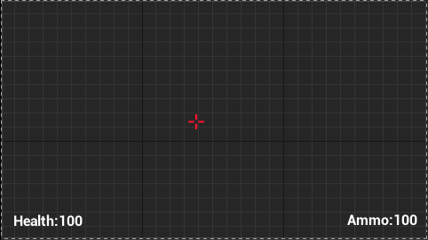

一个简单的界面，我们之后来更新文本，由于`事件TIck`每一帧都会调用，但玩家不会每一帧都更新生命，所以我们自定义触发事件：

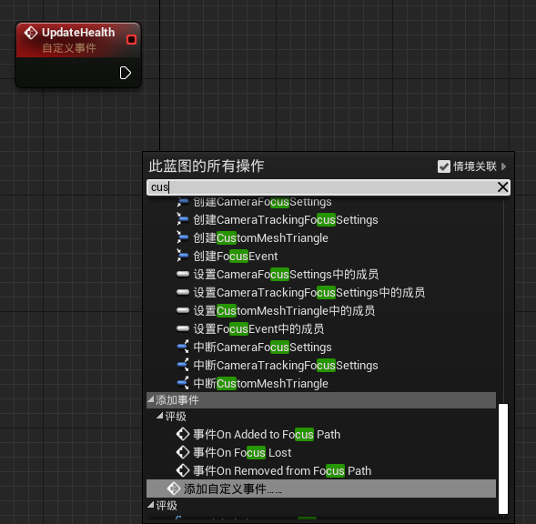

为事件新建一个输入：

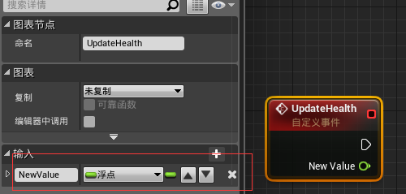

将对应文本设置为变量：

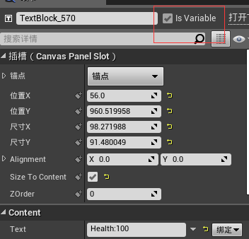

之后，就可以构建如下蓝图：

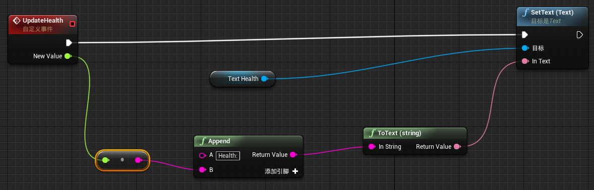

## 2. 在屏幕上显示控件

接下来应该考虑在哪里显示控件，我们这里的控件明显和玩家相关，所以我们将他与玩家绑定。打开如下的玩家控制器：

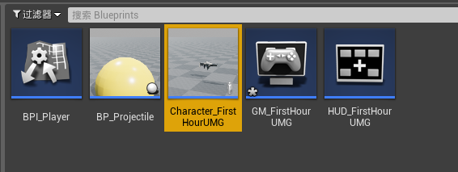

然后添加如下蓝图：（注意节点是`创建控件`）

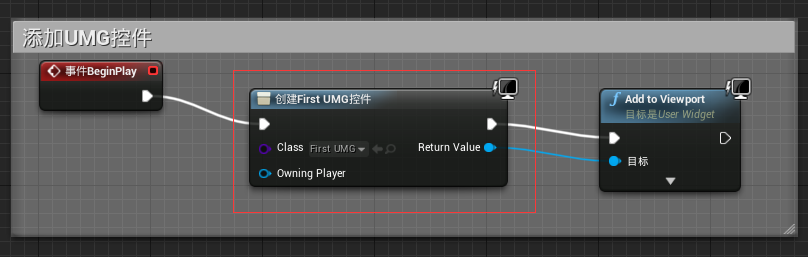

然后可以看到：

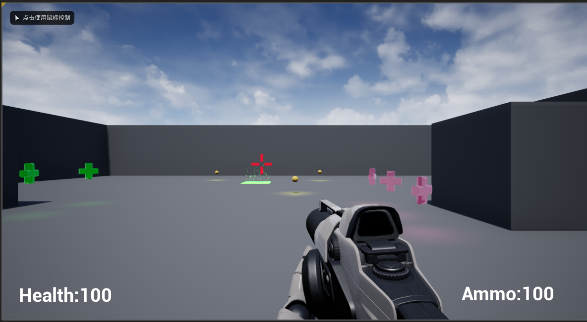

但我们还没有正确更新UI，所以在之前的蓝图上，新建一个变量：

| 1                                                            | 2                                                            |
| ------------------------------------------------------------ | ------------------------------------------------------------ |
| 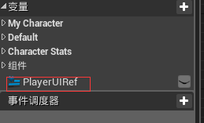 | 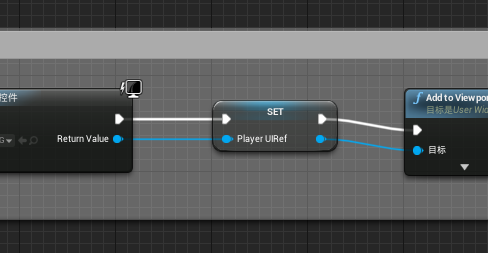 |

然后，新建一个函数`UpdateDafaultUI`：

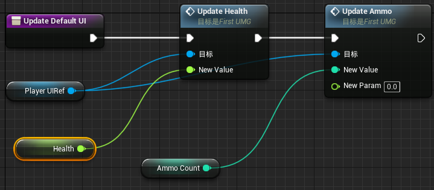

此时：

| 1                                                            | 2                                                            |
| ------------------------------------------------------------ | ------------------------------------------------------------ |
| 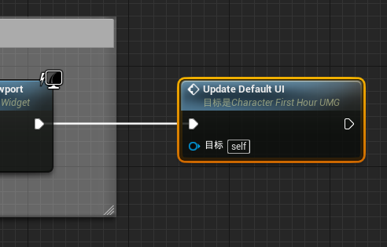 |  |

## 3. 更新用户界面

当用户加血包时，UI也要更新，我们可以使用`属性绑定`，但绑定函数是每帧运行的。选择另外一种方法，我们可以：

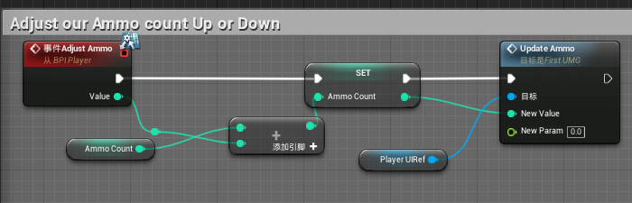

类似的修改应用在其它地方就可以实现实时更新UI了。

## 4. 调整用户界面

现在UI没有匹配屏幕，所以我们需要和Unity一样设置`锚点`

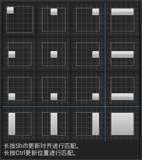

然后我们设置对齐为$(0.5,0.5)$，并修改相对位置（图左顺序反了）：

| 1                                                            | 2                                                            |
| ------------------------------------------------------------ | ------------------------------------------------------------ |
|  | 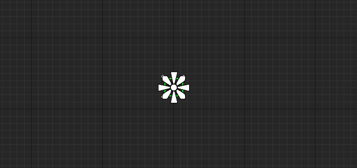 |

而`Health`和`Ammo`方式相似，只是对齐分别是$(0,1)$和$(1,1)$。

现在依然存在问题，对于`Ammo`而言，子弹数量的位数变化会导致其位置发生变化。一种解决方法是：取消勾选`size to Content`，而是固定UI的大小（这也是UI变化的本因）。也可以通过布局组件解决。

## 5. 创建主菜单

创建过程和Unity基本无区别，唯一一个不太注意的是细节面板的`ZOrder`，除了层级面板的顺序，这个也可以控制UI的绘制顺序，越小越靠前，所以可以将背景设置为`-1000`。

| 1                                                            | 2                                                            |
| ------------------------------------------------------------ | ------------------------------------------------------------ |
| 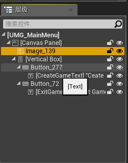 | 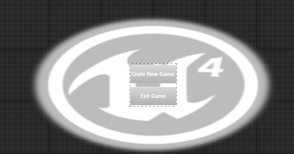 |

为了显示，需要和之前一样创建控件到视口，但此时还会有玩家的绑定UI，因为游戏模式会自动生成默认`Pawn`，所以我们要新建一个游戏模式，并修改其默认`Pawn`：

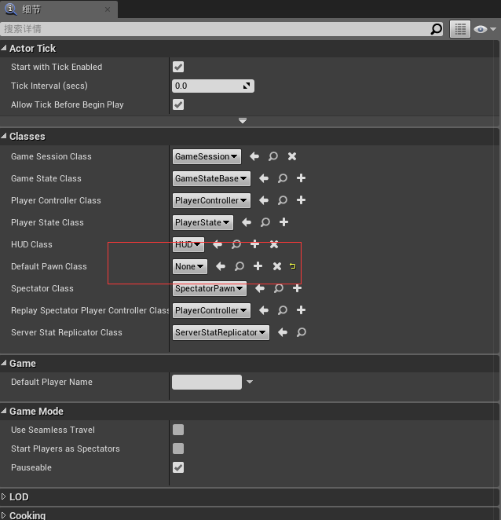

然后再世界设置中选择此游戏模式进行覆盖，就能解决问题。

我们接下来添加按钮逻辑，UE4会自动生成按钮变量，每个按钮变量都有自己的一套触发事件：

| 1                                                            | 2                                                            |
| ------------------------------------------------------------ | ------------------------------------------------------------ |
| 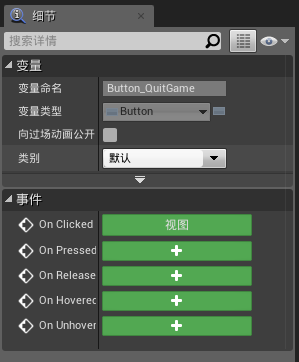 | 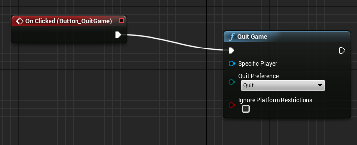 |

新建游戏的逻辑：

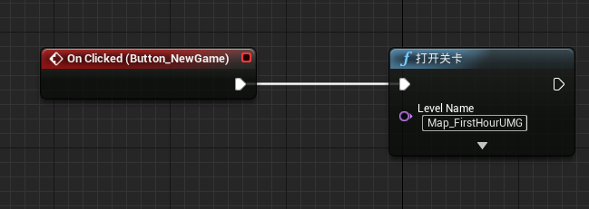

:star:一切似乎OK，但这个时候，在主菜单，如果点击背景，鼠标会消失，问题在于==输入模式==上。在UE4中，有三种游戏模式：仅UI、仅游戏（默认）、游戏和UI。默认情况下，所有输入都默认是对游戏对象有效，而忽视UI，所以我们要按情况区分游戏模式：

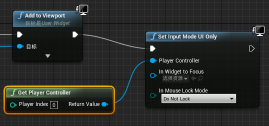

这个时候，再次点击背景，虽然UI按钮会高亮，说明鼠标作用的是UI，但鼠标依然消失了。解决方法很简单：

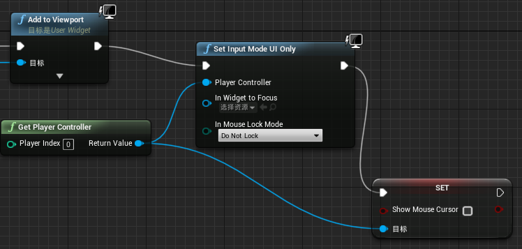

其中，有一点需要注意，从设置输入模式出来，似乎无法找到此`Set`节点，但只要我们取消勾选`情景关联`就可，只是因为此节点和用户控制器相关，所以通过控制器节点（绿色），可以直接搜索到。

> 这里，我想自己对情景关联有了点认知。它的作用相当于：依据输入节点的类型，选择节点全集的对应子集，而此set节点属于控制器子集，却不属于蓝色节点的子集，所以需要关闭，来全集寻找。

而进入游戏后，就需要更改输入模式了：

## 6. 创建暂停菜单

这节聚焦于最后一个输入模式，以暂停菜单的形式。

首先，我们打开项目设置，为暂停按键添加一个==动作映射==。

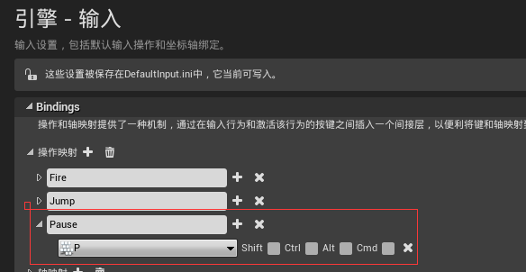

暂停界面应该属于谁呢？既不是关口，也不属于玩家。我们的选择是用==玩家控制器==来实现**暂停事件**。所以我们新建一个玩家控制类：

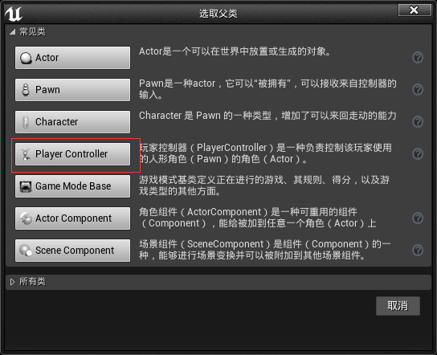

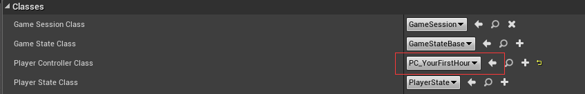

在`玩家控制器`的事件图表中进行设计（这里我们直接使用主界面UI）：

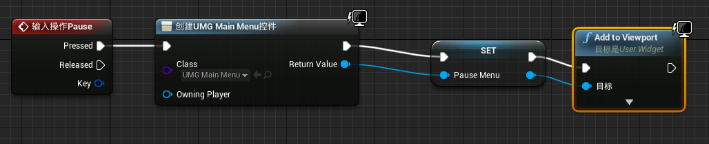

一切似乎顺利，但我们依然能动，这不符合一般常识。解决方法有很多种：我们可以设置输入模式为`仅UI`（确实不动了，但游戏还在进行）；如果想要真的暂停，也很简单，有专门的节点：

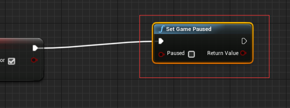

对了，我们还需要设置输入模式为`UI和游戏`。最后，还有一个问题：没法退出暂停菜单，而且每次按P都会生成一个暂停菜单。

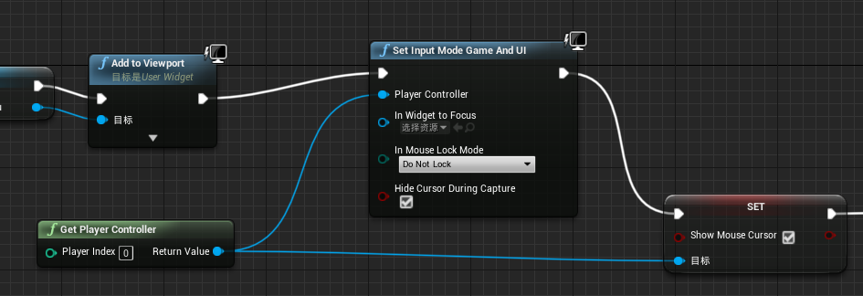

## 7. 高级UI事件

避免多次生成的最简单方法是：检查==有效性==。

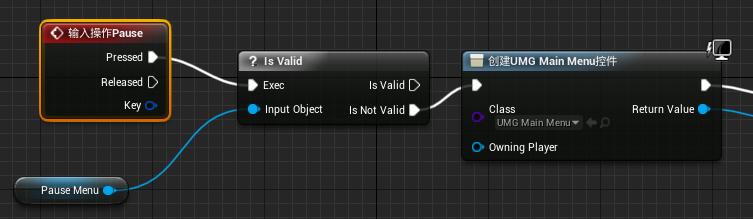

此外，我们希望，此时按P能够关闭开启的暂停窗口，使用节点`Remove From Parent`：

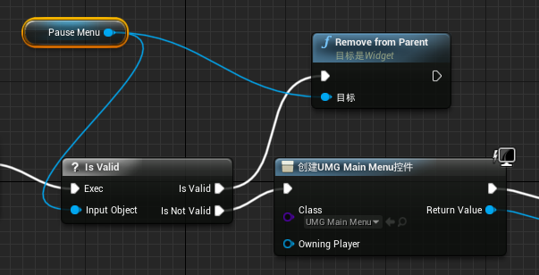

当然，还是不够，我们还需要将菜单引用设置为空：

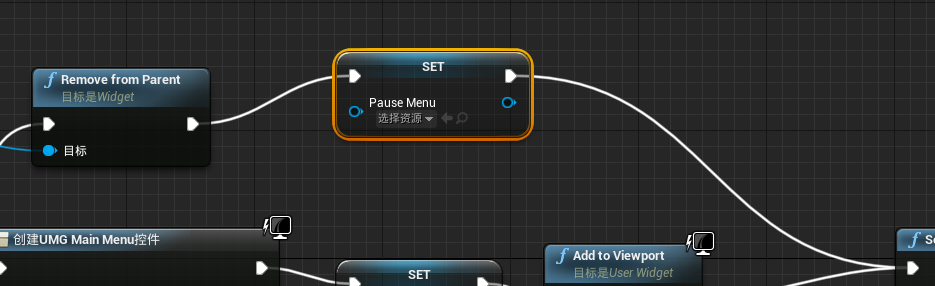

最后，如果我们使用了`游戏暂停`节点，我们还需要对==输出触发==进行勾选：

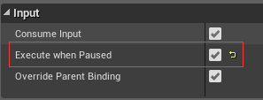

然后我们需要完善关闭`暂停菜单`之后的逻辑：

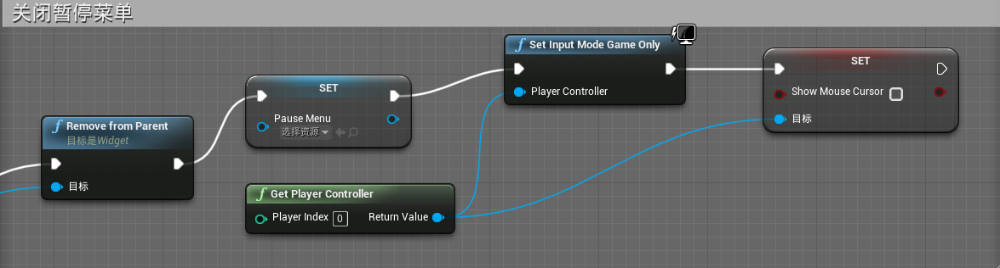

> 对于经常关闭打开的UI，如背包，可以不用设置为空，而是简单的不可见，需要时，再加入父物体下。

下一个问题是，在开启暂停菜单后，关闭玩家UI。打开`Character_FirstHourUMG`，添加如下逻辑：

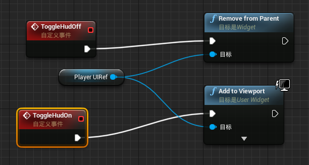

> `Character_FirstHourUMG`作为默认`Pawn`，相比于游戏模式和玩家控制器，有点像绑定角色的I/O。
>
> 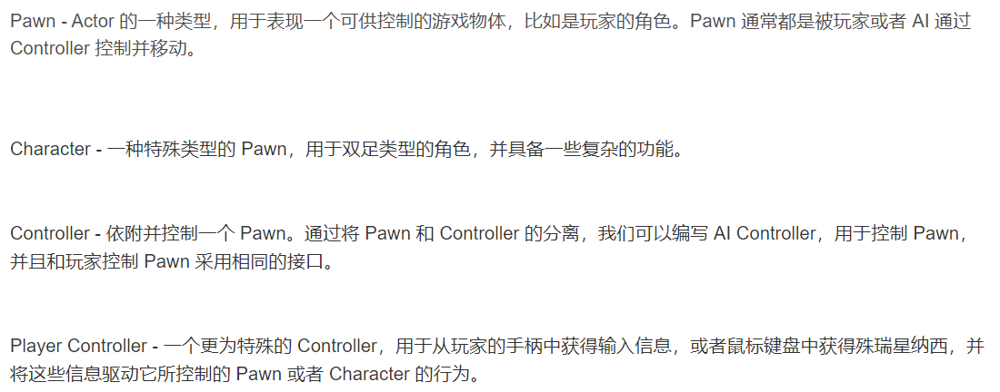

然后回到玩家控制器，添加：

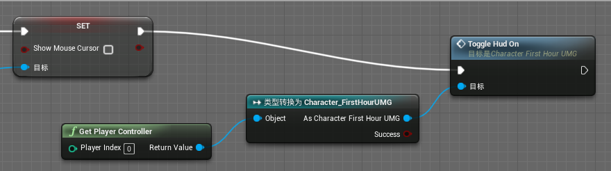

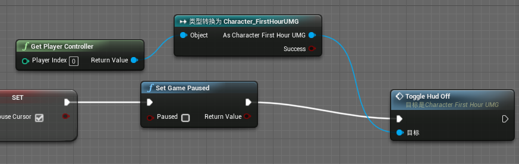

上面不对，实际应该这么写（==Pawn==和玩家控制器咋还是一回事呢）：

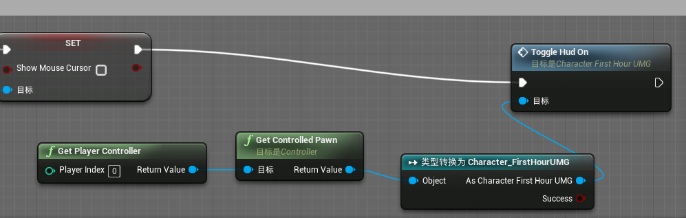

## 8. 完成游戏反馈循环

添加最后一个界面来结束游戏。首先新建一个UI控件：

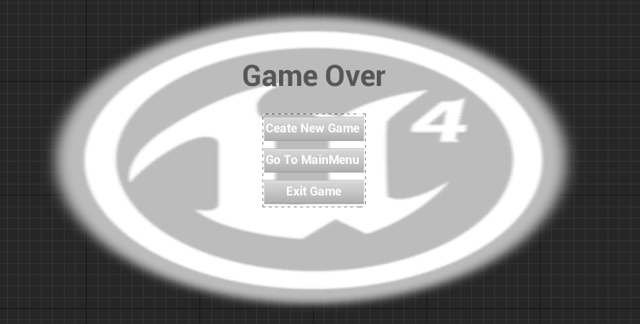

添加新按钮逻辑：

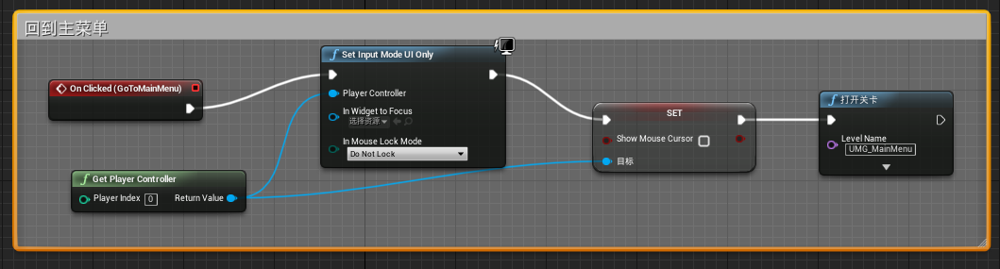

考虑到游戏结束，我们仍需一些操作，如：保存分数等，所以我们在游戏模式的==事件图表==中添加如下逻辑：

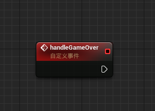

之前，通过`窗口`的`在蓝图中寻找`，找到的游戏胜利的触发地点：（本项目之前已经写好的逻辑）

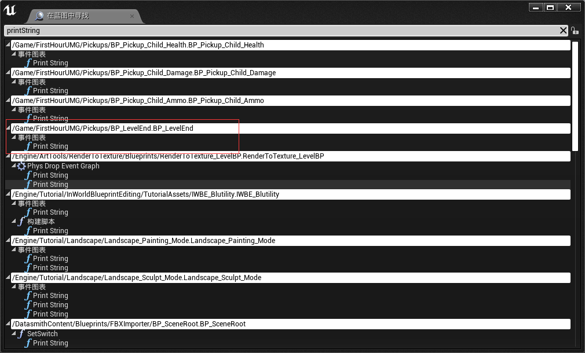

添加如下逻辑：

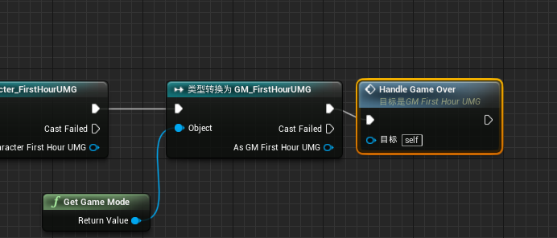

然后，补充这个`Handle Game Over`：（也和之前类似）

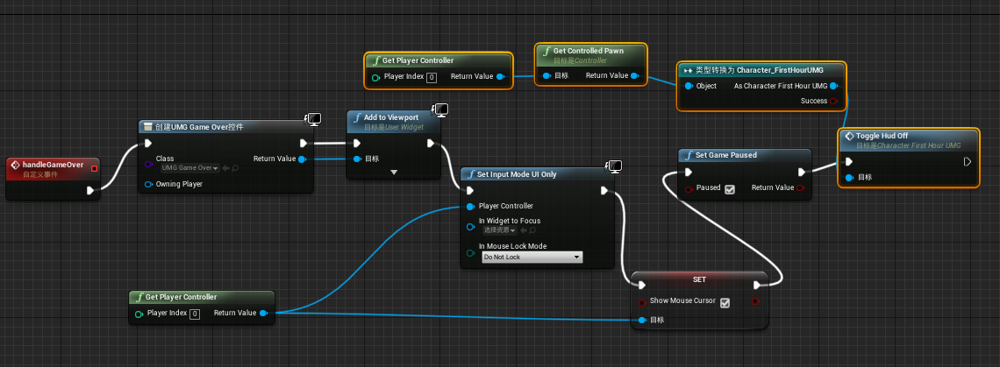

