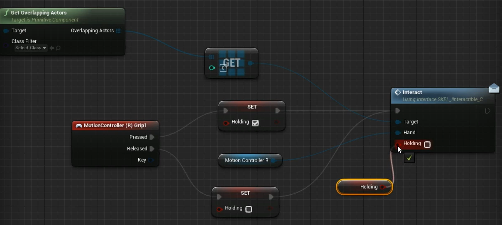

## 1. 虚拟现实理论与最佳实践

1. VR场景的核心要求：真实感、沉浸感、舒适感、流畅性。

2. 其他要求：直观交互、融为一体的UI、环境空间音效。

3. 移动和交互：

   

4. UE4中，VR开发的一些注意事项（性能）：
   + 通过保持==帧率==在90以上；分辨率是$2160\times 1200$，适用于`Oculus Rift`或`HTC Vive`。（注意：在优先级上，帧数大于分辨率）
     + 命令：`r.screenpercentage`可以控制分辨率
   + 使用正向渲染，而不是延迟渲染。
   + 在使用这些常用设备进行开发时，我们一般需要保证==可见面数==在两百万以内；==最高绘制调用次数==在1500以内。
   + 因为我们使用正向渲染，所以可以开启==MSAA==。
   + 也不能使用==屏幕空间特效==、透明、虽然其中一些本来也不能在移动设备上使用。
5. 注意事项（舒适度，避免**视前庭紊乱**）：
   + 保持高帧率（90+Fps）
   + 用户高度 + 场景大小
   + 永远不要取代用户控制摄像机
   + 避免突然的加速，以及视野改变
   + 避免使用镜头特效（本来就是人眼会自动实现的）

## 2. 支持设备

> 第一个分项是：单视场渲染。
>
> 

## 3. 启动新的VR项目

1. 在新建项目的初始设置中，对于VR开发，我们一般不会选择最高渲染配置（桌面应用+最高渲染质量），而是选择最低配置，而其他各选项的禁用项可见下图：

   

2. 进入新项目后，新建一个`Pawn`类（代表玩家），一个`GameMode`类（其**默认Pawn**指定为咱们新建的那个）。

3. 进入`Pawn`，为其添加组件：Camera、Motion Controller（这个应该就是VR中，我们的双手）

   | 组件                                                         | 细节面板                                                     |
   | ------------------------------------------------------------ | ------------------------------------------------------------ |
   |  |  |

4. 对于右手的**运动控制器**，我们需要如下基本修改：

   

5. 对于==玩家出生点==，我们需要注意的是：在VR中，会默认出生点的高度和地面齐平（一般是默认是玩家的中心）。所以我们需要将出生点下移。

## 4. 添加移动的功能

在将场景合并到此项目后，将`Pawn`类拖入场景，并设置其Player Id为0，然后设置场景的游戏模式为None。之后，我们来实现传送系统（注意晕眩）。

1. 在场景中添加==导航网格体==（Nav Mesh Bounds），我们需要保证其中包含的所有物体都有碰撞组件。

2. 我们不希望会**传送**到如下不符合实际的区域:arrow_down:，所以需要添加`Nav Modifier Volume`，让他包围如下的桌椅。

   

3. 在`VRPawn`中，添加两个变量，新建一个函数：

| 1                                                            | 2                                                            |
| ------------------------------------------------------------ | ------------------------------------------------------------ |
|  |  |

4. 补充函数，从起始点，发送射线，看打中了哪些物体

   

5. 通过打中物体，判断其是否是平面（地面，毕竟不能瞬移到墙上），来设置`bTeleport`：

   

6. 如果通过测试，则设置第二个位置变量的值。

   

7. 蓝图Debug，在瞬移目标点绘制圆柱体

   

   > 注意，这种Debug仅适用于开发者模式

8. 调用函数

   

9. 效果

   

## 5. 添加观众移动

1. 新建一个移动函数，比较简单，如下：

   

2. 右扳机触发时，调用。

   

3. 时刻绘制圆柱体，极其消耗性能，所以新建变量，并修改蓝图如下：

   

4. 也不要一直计算可移动的位置：

   

## 6. 与对象交互

1. 新建一个用于通讯的蓝图接口，其唯一函数包含如下输入：（第二个参数名是`Holding`）

   

   

2. 新建一个继承Actor的蓝图，代表可交互对象。并且确保其网格体包含碰撞。

3. 实现接口函数，保持`Holding`时，抓住物体，就是将物体禁用物理模拟，并将其附加在Hand上作为组件：

   

   松手后，则是反过程：

   

4. 为`MotionController`添加碰撞体，并添加如下蓝图：

   