源地址：https://learn.unrealengine.com/course/2504894/module/5419433?moduletoken=UHxxnDLPW8SWh0MmIHBqeeAX1FJd65CsIoe5kSHVQ1VzVbZnytLr-70b0PxSdaxm&LPId=0

## 1. 向项目添加代码插件

1. 新建一个空白项目。

2. 点击`插件`，新建一个简单的空白插件：

    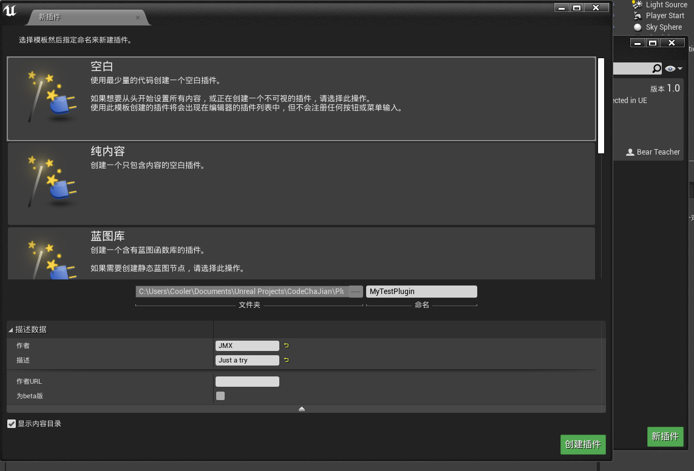

## 2. 模块和引擎结构

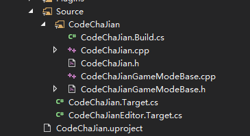

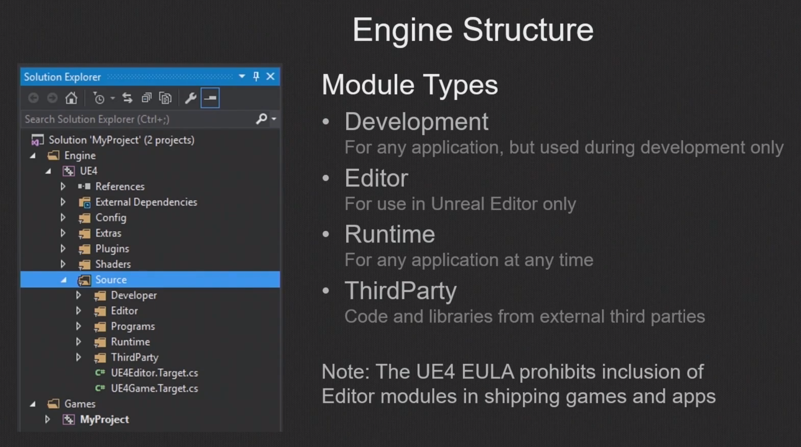


## 3. 编译插件代码

1. 将下载好的插件文件夹拖入`Plugin`下：

    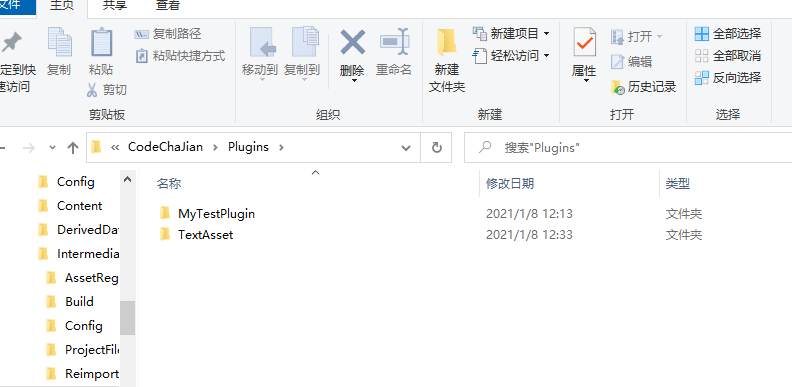

2. 点击`刷新项目`

    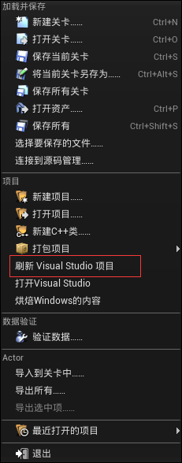

3. 在VS中进行编译。

4. 这里的示例插件很简单，就是一个简单的`文本插件`，但就分析的目的而言，是足够的。


## 4. 创建新的资源类型和工厂

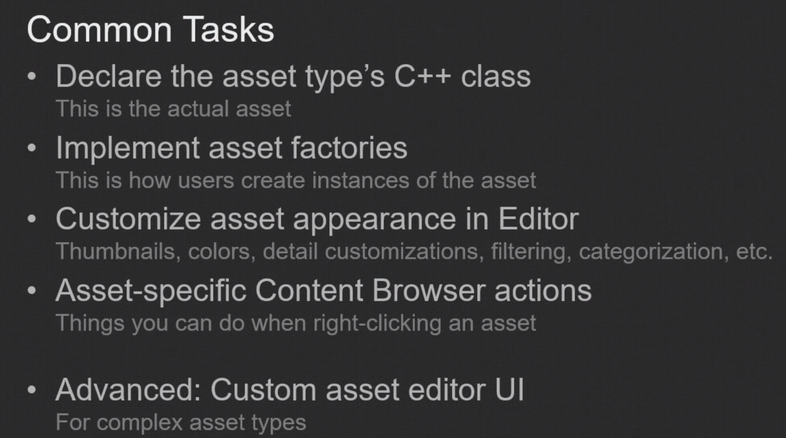

1. 首先我们看看文本资源类的声明——`TextAsset.h`

    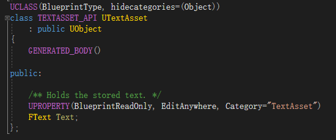

    - 考虑到c++没有自动序列化、运行时内省等功能，所以UE4封装了框架，也就是`UObject`子系统；
    - 继承`UObject`的类，必须以==U==开头。
    - `TEXTASSET_API`是自动生成，作用是将模块暴露出来
    - `UCLASS`宏会告诉虚幻构建工具：这个类是一个需要解析的基于`UObject`的t类

2. 接下来我们要使用工厂

    | 1                                                            | 2                                                            |
    | ------------------------------------------------------------ | ------------------------------------------------------------ |
    | 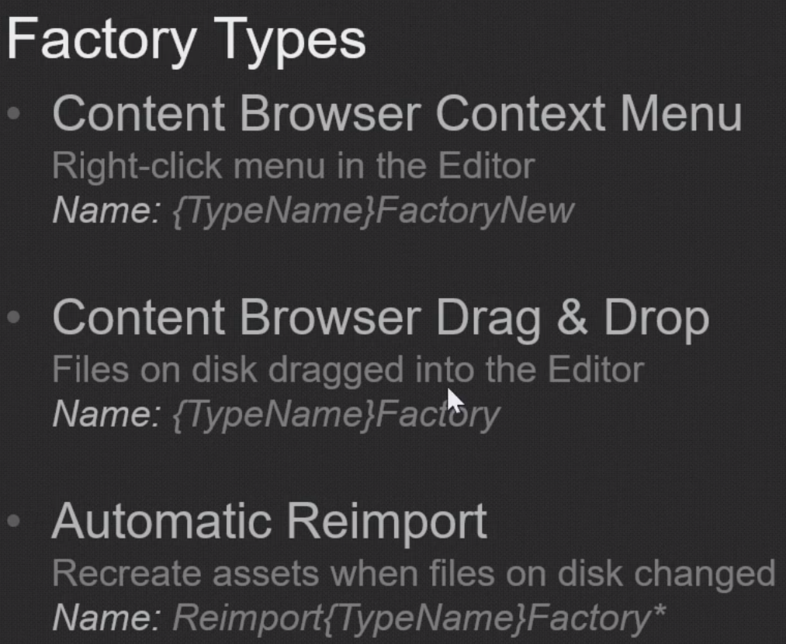 | 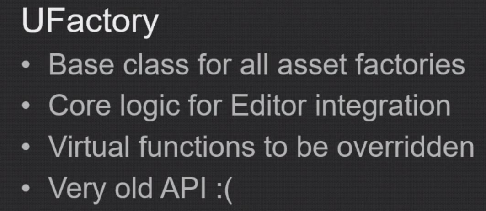 |

3. `TextAssetFactoryNew`，这个类负责允许在菜单栏可以新建`TextAsset`

    ```c++
    // Copyright 1998-2017 Epic Games, Inc. All Rights Reserved.
    
    #pragma once
    
    #include "Factories/Factory.h"
    #include "UObject/ObjectMacros.h"
    
    #include "TextAssetFactoryNew.generated.h"
    
    
    /**
     * Implements a factory for UTextAsset objects.
     */
    UCLASS(hidecategories=Object)
    class UTextAssetFactoryNew
    	: public UFactory
    {
    	GENERATED_UCLASS_BODY()
    
    public:
    
    	//~ UFactory Interface
    
    	virtual UObject* FactoryCreateNew(UClass* InClass, UObject* InParent, FName InName, EObjectFlags Flags, UObject* Context, FFeedbackContext* Warn) override;
    	virtual bool ShouldShowInNewMenu() const override;
    };
    
    ```

    

    ```c++
    // Copyright 1998-2017 Epic Games, Inc. All Rights Reserved.
    
    #include "TextAssetFactoryNew.h"
    
    #include "TextAsset.h"
    
    
    /* UTextAssetFactoryNew structors
     *****************************************************************************/
    
    UTextAssetFactoryNew::UTextAssetFactoryNew(const FObjectInitializer& ObjectInitializer)
    	: Super(ObjectInitializer)
    {
    	SupportedClass = UTextAsset::StaticClass();
    	bCreateNew = true;
    	bEditAfterNew = true;
    }
    
    
    /* UFactory overrides
     *****************************************************************************/
    
    UObject* UTextAssetFactoryNew::FactoryCreateNew(UClass* InClass, UObject* InParent, FName InName, EObjectFlags Flags, UObject* Context, FFeedbackContext* Warn)
    {
    	return NewObject<UTextAsset>(InParent, InClass, InName, Flags);
    }
    
    
    bool UTextAssetFactoryNew::ShouldShowInNewMenu() const
    {
    	return true;
    }
    
    ```

    这里主要覆盖重写了两个函数，第一个函数在新建TextAsset时调用；第二个函数则是运行在菜单内出现`TextAsset`的选项。

    而在构造函数中，第一行代码告诉编辑器，工厂支持`UTextAsset`；第二行代码告诉工厂：我要新建一个实例，而不是拖放资源；第三行代码表示：我们希望在创建资源后，编辑资源的名称。

    > 复习：
    >
    > 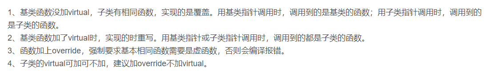

4. `TextAssetFactory`，这个类用于实现**拖放效果**。

    ```c++
    // Copyright 1998-2017 Epic Games, Inc. All Rights Reserved.
    
    #pragma once
    
    #include "Factories/Factory.h"
    #include "UObject/ObjectMacros.h"
    
    #include "TextAssetFactory.generated.h"
    
    
    /**
     * Implements a factory for UTextAsset objects.
     */
    UCLASS(hidecategories=Object)
    class UTextAssetFactory
    	: public UFactory
    {
    	GENERATED_UCLASS_BODY()
    
    public:
    
    	//~ UFactory Interface
    
    //	virtual UObject* FactoryCreateBinary(UClass* Class, UObject* InParent, FName Name, EObjectFlags Flags, UObject* Context, const TCHAR* Type, const uint8*& Buffer, const uint8* BufferEnd, FFeedbackContext* Warn) override;
    	virtual UObject* FactoryCreateFile(UClass* InClass, UObject* InParent, FName InName, EObjectFlags Flags, const FString& Filename, const TCHAR* Parms, FFeedbackContext* Warn, bool& bOutOperationCanceled) override;
    };
    
    ```

    这里我们只覆盖了一个函数，下面是实现方法：

    ```c++
    // Copyright 1998-2017 Epic Games, Inc. All Rights Reserved.
    
    #include "TextAssetFactory.h"
    
    #include "Containers/UnrealString.h"
    #include "TextAsset.h"
    #include "Misc/FileHelper.h"
    
    /* UTextAssetFactory structors
     *****************************************************************************/
    
    UTextAssetFactory::UTextAssetFactory( const FObjectInitializer& ObjectInitializer )
    	: Super(ObjectInitializer)
    {
    	Formats.Add(FString(TEXT("txt;")) + NSLOCTEXT("UTextAssetFactory", "FormatTxt", "Text File").ToString());
    	SupportedClass = UTextAsset::StaticClass();
    	bCreateNew = false;
    	bEditorImport = true;
    }
    
    UObject* UTextAssetFactory::FactoryCreateFile(UClass* InClass, UObject* InParent, FName InName, EObjectFlags Flags, const FString& Filename, const TCHAR* Parms, FFeedbackContext* Warn, bool& bOutOperationCanceled)
    {
    	UTextAsset* TextAsset = nullptr;
    	FString TextString;
    
    	if (FFileHelper::LoadFileToString(TextString, *Filename))
    	{
    		TextAsset = NewObject<UTextAsset>(InParent, InClass, InName, Flags);
    		TextAsset->Text = FText::FromString(TextString);
    	}
    
    	bOutOperationCanceled = false;
    
    	return TextAsset;
    }
    
    ```

    在构造函数中，第一行代码：我们需要告诉编辑器，这个工厂支持`TXT`格式的文件；第四行代码：工厂的导入标志。

    然后是==创建函数==，相比直接新建一个对象，这里实际是从磁盘加载了文件，


## 5. 通过资源操作自定义资源

1. 自定义资源的名称、颜色、缩略图等，可以通过继承`IAssetTypeActions`来实现，也是实现虚函数来实现。

2. 分析`TextAssetActions`

    ```c++
    // Copyright 1998-2017 Epic Games, Inc. All Rights Reserved.
    #pragma once
    #include "AssetTypeActions_Base.h"
    #include "Templates/SharedPointer.h"
    
    class ISlateStyle;
    
    /**
     * Implements an action for UTextAsset assets.
     */
    class FTextAssetActions
    	: public FAssetTypeActions_Base
    {
    public:
    
    	/**
    	 * Creates and initializes a new instance.
    	 *
    	 * @param InStyle The style set to use for asset editor toolkits.
    	 */
    	FTextAssetActions(const TSharedRef<ISlateStyle>& InStyle);
    
    public:
    
    	//~ FAssetTypeActions_Base overrides
    
    	virtual bool CanFilter() override;
    	virtual void GetActions(const TArray<UObject*>& InObjects, FMenuBuilder& MenuBuilder) override;
    	virtual uint32 GetCategories() override;
    	virtual FText GetName() const override;
    	virtual UClass* GetSupportedClass() const override;
    	virtual FColor GetTypeColor() const override;
    	virtual bool HasActions(const TArray<UObject*>& InObjects) const override;
    	virtual void OpenAssetEditor(const TArray<UObject*>& InObjects, TSharedPtr<IToolkitHost> EditWithinLevelEditor = TSharedPtr<IToolkitHost>()) override;
    
    private:
    
    	/** Pointer to the style set to use for toolkits. */
    	TSharedRef<ISlateStyle> Style;
    };
    
    ```

    ```c++
    // Copyright 1998-2017 Epic Games, Inc. All Rights Reserved.
    
    #include "TextAssetActions.h"
    
    #include "Framework/MultiBox/MultiBoxBuilder.h"
    #include "TextAsset.h"
    #include "Styling/SlateStyle.h"
    
    #include "TextAssetEditorToolkit.h"
    
    
    #define LOCTEXT_NAMESPACE "AssetTypeActions"
    
    
    /* FTextAssetActions constructors
     *****************************************************************************/
    
    FTextAssetActions::FTextAssetActions(const TSharedRef<ISlateStyle>& InStyle)
    	: Style(InStyle)
    { }
    
    
    /* FAssetTypeActions_Base overrides
     *****************************************************************************/
    
    bool FTextAssetActions::CanFilter()
    {
    	return true;
    }
    
    //第一个参数是右键点击的对象集合（因为可以一次对多个物体进行操作）；第二个参数是所谓的菜单构建器，
    //允许我们在显示菜单中增加新的选项。
    void FTextAssetActions::GetActions(const TArray<UObject*>& InObjects, FMenuBuilder& MenuBuilder)
    {
        //因为我们继承了这个基类，所以首先调用基类的函数
    	FAssetTypeActions_Base::GetActions(InObjects, MenuBuilder);
    
        //确保指针有效。将这组指针转化为弱指针，这些弱指针在垃圾回收器决定销毁引用对象时，自动重置
    	auto TextAssets = GetTypedWeakObjectPtrs<UTextAsset>(InObjects);
    
        //
    	MenuBuilder.AddMenuEntry(
    		LOCTEXT("TextAsset_ReverseText", "Reverse Text"),
    		LOCTEXT("TextAsset_ReverseTextToolTip", "Reverse the text stored in the selected text asset(s)."),
    		FSlateIcon(),
    		FUIAction(
    			FExecuteAction::CreateLambda([=]{
    				for (auto& TextAsset : TextAssets)
    				{
    					if (TextAsset.IsValid() && !TextAsset->Text.IsEmpty())
    					{
    						TextAsset->Text = FText::FromString(TextAsset->Text.ToString().Reverse());
    						TextAsset->PostEditChange();
    						TextAsset->MarkPackageDirty();
    					}
    				}
    			}),
                //决定是否可以执行
    			FCanExecuteAction::CreateLambda([=] {
    				for (auto& TextAsset : TextAssets)
    				{
    					if (TextAsset.IsValid() && !TextAsset->Text.IsEmpty())
    					{
    						return true;
    					}
    				}
    				return false;
    			})
    		)
    	);
    }
    
    //用于确定资源在快捷菜单中被归类到哪一个类别中，这里是杂项
    uint32 FTextAssetActions::GetCategories()
    {
    	return EAssetTypeCategories::Misc;
    }
    
    //用于返回资源的名称，也就是缩略图中显示的文本字符串
    FText FTextAssetActions::GetName() const
    {
    	return NSLOCTEXT("AssetTypeActions", "AssetTypeActions_TextAsset", "Text Asset");
    }
    
    //告诉编辑器，这个资源操作类应该用于TextAsset
    UClass* FTextAssetActions::GetSupportedClass() const
    {
    	return UTextAsset::StaticClass();
    }
    
    //返回资源缩略图的颜色
    FColor FTextAssetActions::GetTypeColor() const
    {
    	return FColor::White;
    }
    
    //决定是否调用GetActions
    bool FTextAssetActions::HasActions(const TArray<UObject*>& InObjects) const
    {
    	return true;
    }
    
    
    void FTextAssetActions::OpenAssetEditor(const TArray<UObject*>& InObjects, TSharedPtr<IToolkitHost> EditWithinLevelEditor)
    {
    	EToolkitMode::Type Mode = EditWithinLevelEditor.IsValid()
    		? EToolkitMode::WorldCentric
    		: EToolkitMode::Standalone;
    
    	for (auto ObjIt = InObjects.CreateConstIterator(); ObjIt; ++ObjIt)
    	{
    		auto TextAsset = Cast<UTextAsset>(*ObjIt);
    		a
    		if (TextAsset != nullptr)
    		{
    			TSharedRef<FTextAssetEditorToolkit> EditorToolkit = MakeShareable(new FTextAssetEditorToolkit(Style));
    			EditorToolkit->Initialize(TextAsset, Mode, EditWithinLevelEditor);
    		}
    	}
    }

    
    #undef LOCTEXT_NAMESPACE
    
    ```
    
    需要重写两个函数，才能在`TextAsset`的快捷菜单中添加操作选项，分别是`GetActions`和`HasActions`


## 6. 模块剖析和生命周期

在引擎中进行注册，加载`TextAsset`模块。

```c++
// Copyright 1998-2017 Epic Games, Inc. All Rights Reserved.

#include "Containers/Array.h"
#include "ISettingsModule.h"
#include "ISettingsSection.h"
#include "Modules/ModuleInterface.h"
#include "Modules/ModuleManager.h"
#include "Templates/SharedPointer.h"
#include "Toolkits/AssetEditorToolkit.h"

#include "AssetTools/TextAssetActions.h"
#include "Styles/TextAssetEditorStyle.h"
#include "TextAssetEditorSettings.h"


#define LOCTEXT_NAMESPACE "FTextAssetEditorModule"


/**
 * Implements the TextAssetEditor module.
 */
class FTextAssetEditorModule
	: public IHasMenuExtensibility
	, public IHasToolBarExtensibility
	, public IModuleInterface
{
public:

	//~ IHasMenuExtensibility interface

	virtual TSharedPtr<FExtensibilityManager> GetMenuExtensibilityManager() override
	{
		return MenuExtensibilityManager;
	}

public:

	//~ IHasToolBarExtensibility interface

	virtual TSharedPtr<FExtensibilityManager> GetToolBarExtensibilityManager() override
	{
		return ToolBarExtensibilityManager;
	}

public:

	//~ IModuleInterface interface

	virtual void StartupModule() override
	{
		Style = MakeShareable(new FTextAssetEditorStyle());

//		FTextAssetEditorCommands::Register();

		RegisterAssetTools();
		RegisterMenuExtensions();
		RegisterSettings();
	}

	virtual void ShutdownModule() override
	{
		UnregisterAssetTools();
		UnregisterMenuExtensions();
		UnregisterSettings();
	}

	virtual bool SupportsDynamicReloading() override
	{
		return true;
	}

protected:

	/** Registers asset tool actions. */
	void RegisterAssetTools()
	{
		IAssetTools& AssetTools = FModuleManager::LoadModuleChecked<FAssetToolsModule>("AssetTools").Get();

		RegisterAssetTypeAction(AssetTools, MakeShareable(new FTextAssetActions(Style.ToSharedRef())));
	}

	/**
	 * Registers a single asset type action.
	 *
	 * @param AssetTools The asset tools object to register with.
	 * @param Action The asset type action to register.
	 */
	void RegisterAssetTypeAction(IAssetTools& AssetTools, TSharedRef<IAssetTypeActions> Action)
	{
		AssetTools.RegisterAssetTypeActions(Action);
		RegisteredAssetTypeActions.Add(Action);
	}

	/** Register the text asset editor settings. */
	void RegisterSettings()
	{
		ISettingsModule* SettingsModule = FModuleManager::GetModulePtr<ISettingsModule>("Settings");

		if (SettingsModule != nullptr)
		{
			ISettingsSectionPtr SettingsSection = SettingsModule->RegisterSettings("Editor", "Plugins", "TextAsset",
				LOCTEXT("TextAssetSettingsName", "Text Asset"),
				LOCTEXT("TextAssetSettingsDescription", "Configure the Text Asset plug-in."),
				GetMutableDefault<UTextAssetEditorSettings>()
			);
		}
	}

	/** Unregisters asset tool actions. */
	void UnregisterAssetTools()
	{
		FAssetToolsModule* AssetToolsModule = FModuleManager::GetModulePtr<FAssetToolsModule>("AssetTools");

		if (AssetToolsModule != nullptr)
		{
			IAssetTools& AssetTools = AssetToolsModule->Get();

			for (auto Action : RegisteredAssetTypeActions)
			{
				AssetTools.UnregisterAssetTypeActions(Action);
			}
		}
	}

	/** Unregister the text asset editor settings. */
	void UnregisterSettings()
	{
		ISettingsModule* SettingsModule = FModuleManager::GetModulePtr<ISettingsModule>("Settings");

		if (SettingsModule != nullptr)
		{
			SettingsModule->UnregisterSettings("Editor", "Plugins", "TextAsset");
		}
	}

protected:

	/** Registers main menu and tool bar menu extensions. */
	void RegisterMenuExtensions()
	{
		MenuExtensibilityManager = MakeShareable(new FExtensibilityManager);
		ToolBarExtensibilityManager = MakeShareable(new FExtensibilityManager);
	}

	/** Unregisters main menu and tool bar menu extensions. */
	void UnregisterMenuExtensions()
	{
		MenuExtensibilityManager.Reset();
		ToolBarExtensibilityManager.Reset();
	}

private:

	/** Holds the menu extensibility manager. */
	TSharedPtr<FExtensibilityManager> MenuExtensibilityManager;

	/** The collection of registered asset type actions. */
	TArray<TSharedRef<IAssetTypeActions>> RegisteredAssetTypeActions;

	/** Holds the plug-ins style set. */
	TSharedPtr<ISlateStyle> Style;

	/** Holds the tool bar extensibility manager. */
	TSharedPtr<FExtensibilityManager> ToolBarExtensibilityManager;
};


IMPLEMENT_MODULE(FTextAssetEditorModule, TextAssetEditor);


#undef LOCTEXT_NAMESPACE

```


## 7. Slate UI框架和小部件反应物

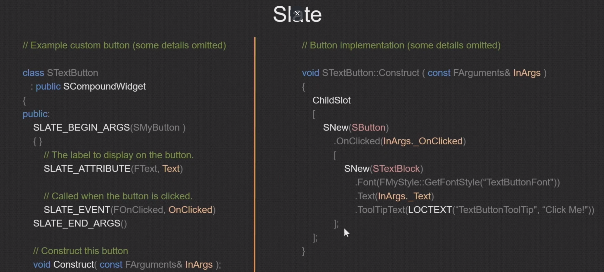

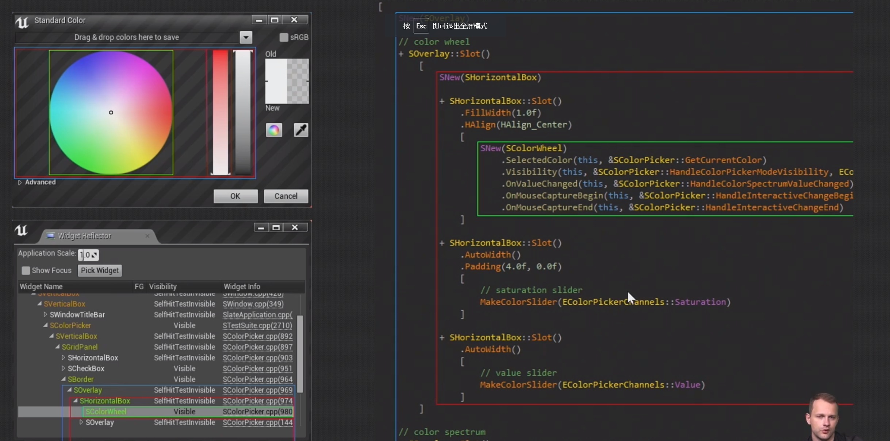


## 8. 自定义资源编辑器代码探索

我们需要重写`TextAssetAction`下的`OpenAssetEditor`函数

```c++
void FTextAssetActions::OpenAssetEditor(const TArray<UObject*>& InObjects, TSharedPtr<IToolkitHost> EditWithinLevelEditor)
{
	EToolkitMode::Type Mode = EditWithinLevelEditor.IsValid()
		? EToolkitMode::WorldCentric
		: EToolkitMode::Standalone;

	for (auto ObjIt = InObjects.CreateConstIterator(); ObjIt; ++ObjIt)
	{
		auto TextAsset = Cast<UTextAsset>(*ObjIt);
		a
		if (TextAsset != nullptr)
		{
			TSharedRef<FTextAssetEditorToolkit> EditorToolkit = MakeShareable(new FTextAssetEditorToolkit(Style));
			EditorToolkit->Initialize(TextAsset, Mode, EditWithinLevelEditor);
		}
	}
}
```

然后进入`TextAssetEditorToolkit`

