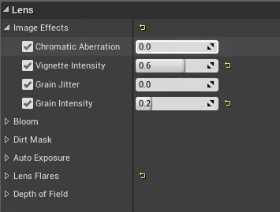
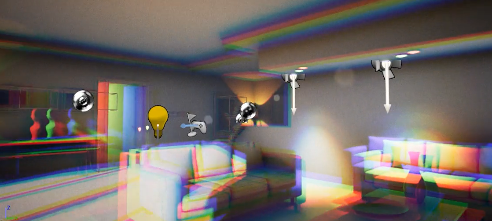
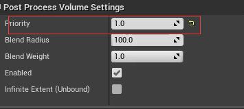

## 1. 介绍

首先，UE4和其它实时引擎的不同之处在于，它是默认开启大部分后处理效果的（只是不明显）；此外，细节面板中，没有勾选不是没起作用，勾选不过是覆盖默认效果。所以，真正想要==关闭后处理==，是勾选之后，将强度设置为0。

1. 在景深中，`Method`选项中的`散景`效果最好，开销最大，开发游戏最好不要使用。

2. 一个之前没有注意到的后处理效果：色差。

   | 1                                                            | 2                                                            |
   | ------------------------------------------------------------ | ------------------------------------------------------------ |
   |  |  |

3. 对于一些局部后处理体积，我们需要设置权重：

   

