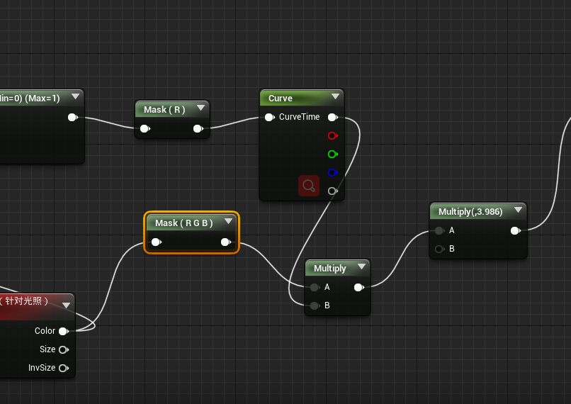

## 1. 利用基础颜色实现扁平化渲染

1. 首先在场景中添加一个后处理体积。

2. 可以选择勾选`无限体积`

    

3. 设置曝光

    

4. 风格化渲染不需要运动模糊，关闭运动模糊

    

5. 新建一个材质，选择其材质域为`后期处理`：

    

6. 在蓝图界面，新建一个`Scene Texture`节点：

    

7. 打开其细节面板，可以看到其包含了`G Buffer`：

    

8. 链接蓝图

    

9. 选择后期处理材质

    

10. 效果

    

11. 由于==TAA==的实现原理，所以画面会有抖动。解决方法：可以修改系统默认的抗锯齿方式为`FXAA `：

    

    另外一种解决方法是：修改材质的应用阶段为：`色调映射之前`

    

    

## 2. 创建多边形描边

1. 新建材质，蓝图如下：

    

2. 添加进体积，注意顺序，描边材质在首位。

    

3. 修改蓝图1，进行UV偏移，然后相减

    

    

4. 新建一个`SceneTexture`节点，选择Id为`PostProcessInput0`，代表经过后期处理流程后的未更改的渲染，然后进行插值，

    

    

5. 可以建立一个材质函数`DepthBias`，用来计算指定方向的深度差，这样就不用将此部分重复四遍了

    

6. 此时，蓝图为：

    

    

7. 可以修改描边的颜色，此外，我们需要对混合系数进行`Clamp`：

    

    

##  3. 创建法线描边

1. 和上一节一样，建立一个计算指定轴向的法线差的函数`NormalDelta`，

    

2. 建立蓝图，和上一节类似：

    

    

3. 和上一节的技术结合在一起：

    

    

## 4. 对描边效果进行最终完善

1. 目前，移动镜头，会有闪烁的`artifacts`，可以通过在`PolyLine`的出口处加上一个简单的乘法进行控制：

    

    | 0.2（Lighting Only）                                         | 20（Lighting Only)                                           |
    | ------------------------------------------------------------ | ------------------------------------------------------------ |
    |  |  |

2. 引入`幂节点`，来控制==对比度==

    

    | 2                                                            | 20                                                           |
    | ------------------------------------------------------------ | ------------------------------------------------------------ |
    |  |  |

3. 控制==线宽==， 修改函数，新增一个乘法节点和标量输入：

    

4. 以上操作可重复用在Normal上

最终蓝图

## 5. 调整遮罩以用于多边形描边

这节我们主要是学习如何让后处理只对特定对象生效。以基础颜色为例。

1. 修改`SceneTexture`的Id为：==CustomDepth==。引擎会在场景中寻找启动了`自定义深度`的对象，并且它只会渲染这些对象。

    

2. 在指定物体的细节面板上，勾选对应选项：

    

3. 设置后处理材质：

    

4. 简单例子：

    | 蓝图                                                         | 效果                                                         |
    | ------------------------------------------------------------ | ------------------------------------------------------------ |
    |  |  |

5. 对于在这种情况下:arrow_down:进行==景深==渲染，会产生错误，只需将阶段进一步前提到`半透明之前`，就可以解决。

    | 前                                                           | 后                                                           |
    | ------------------------------------------------------------ | ------------------------------------------------------------ |
    |  |  |

6. 结合描边，可以有如下效果：

    

6. 描边的时候，进行了UV偏移，如果遮罩不进行就会产生一些`Artifacts`，例如：有些地方的描线过于黑粗。为了解决这个问题，我们需要在`Mask`时，对其进行偏移，首先，新建一个函数`CharaterMaskBias`：

    

7. 依据上诉函数进行修改：

    

    

## 6. 从关卡光照创建遮罩

1. 可以通过==后处理输入0==除以==底色==，来得到场景的==光照遮罩==：

    

2. 效果

    

    

## 7. 创建明暗区域的控制功能

上一节的输出作为这里的`A`:arrow_down:。​

同样的，为了不破坏光照效果，可以修改`混合位置`为`半透明之前`。

## 8. 自定义色带

1. 提取光照遮罩。

    

2. 新建一个`CurveAtlasRowParameter`节点。

    

3. 此节点需要指定曲线，在`内容`下新建一个`曲线`

    

4. 此外，我们还需要一个`曲线图集`：

    

    曲线图集允许我们存储曲线：

    

5. 进行填充：

    

6. 测试：

    | 曲线                                                         | 效果                                                         |
    | ------------------------------------------------------------ | ------------------------------------------------------------ |
    |  |  |

7. 和底色混合

    | 蓝图                                                         | 效果                                                         |
    | ------------------------------------------------------------ | ------------------------------------------------------------ |
    |  |  |

8. 对于NPR而言，色带是不错的选择：

    | 曲线                                                         | 效果                                                         |
    | ------------------------------------------------------------ | ------------------------------------------------------------ |
    |  |  |

    

## 9. 利用Sobel实现模糊效果

1. 首先，新建一个基于==底色==的函数，其形式和前几个基本一样，主要是Id变了，以及**减法变成加法**。

    

2. 建立初步蓝图：

    

3. 取曝光为==-3==来调暗，效果如下：

    

4. 另外一种方法：选择`BlurSampleOffsets`

    

## 10. 实现分色渲染

提高对比度。通过两种取整节点，来计算模糊后的基础颜色，会产生高对比度、高饱和度，且只有少数几种颜色的图像。

## 11. 对画面进行上色

1. 我们使用上一节的输出，作为插值系数，简单的进行上色：

    

    

混合使用

