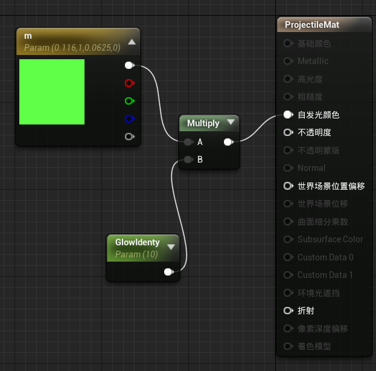
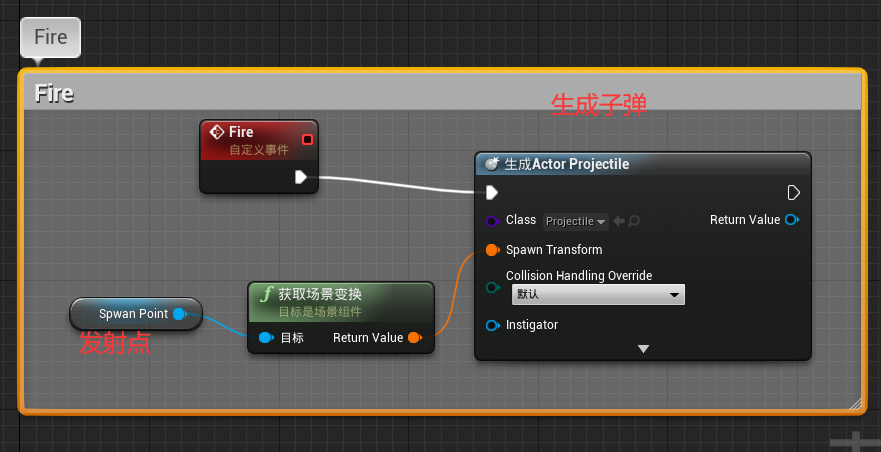
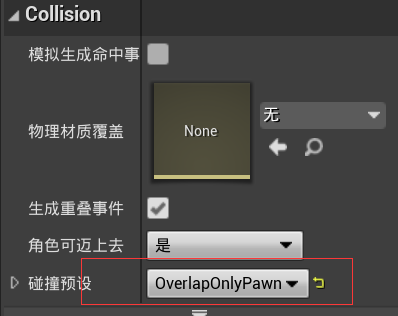
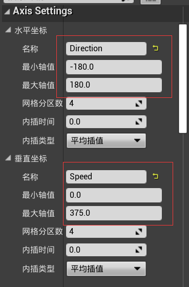
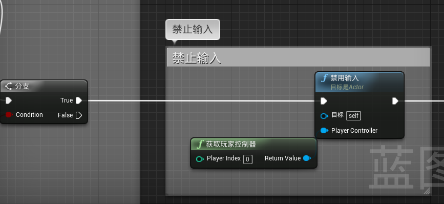

[toc]

##项目设置

1. 新建空项目（包含新手包），导入课程资源文件。

2. 由于我们第一目标是手柄，所以设置输入，添加轴映射（反方向的实现，直接通过将缩放设置为-1）：

   

3. 为**方向控制**设置`盲区`，默认值0.25对于右摇杆，会导致非常明显的不协调感，因此我们修改为0.05（不要设置为0，会导致==漂移==）

   


## 关卡设计

1. 新建一个空`map`

2. 构建初始场景

3. 一个UE技巧，选择一个细节面板的几何分栏，可以根据多个因素选择场景中类似的一大群物体：

   | 1                                                            | 2                                                            |
   | ------------------------------------------------------------ | ------------------------------------------------------------ |
   |  |  |

4. 添加光源：定向光和`Sky Light`。其中天空光的`Source Type`选择为立方体贴图。

5. 添加后处理体积，修改曝光：

   

   

   

   ## 框架综述

   | Name              | Info                                                         |
   | ----------------- | ------------------------------------------------------------ |
   | Actor             | 继承自Object；场景中任何放置的物体都是Actor；                |
   | Pawn              | 派生自Actor；场景中可以被控制的任何对象；可以是场景中的人物，也可以是交通工具，或者是鱼 |
   | Character         | 继承自Pawn类；专门表示双足类对象；具有专门的插槽，可以选择网格模型；自带胶囊体碰撞体；具有==特殊的人物移动组件== |
   | Component         | Actor的一部分，实现特定功能；                                |
   | Controller        | 有两种，如下；就是一种**控制机制**，用于控制==Pawn==         |
   | Player Controller | 经常用于实现游戏中的所有输入功能                             |
   | AI  Controller    | 通常是简单的逻辑组合                                         |
   | GameMode          | 告诉引擎玩家应该使用哪个角色；Rules；独立于其他类；          |


## 角色基类

1. 新建一个继承`Character`的类：

   

2. 编写代码，需要注意的是：

   ```c++
   UFUNCTION(BlueprintCallable, Category = "BaseCharacter")
   		virtual void CalculateHealth(float delta);
   ```

   `UFUNCTION`宏中的`BlueprintCallable`让此函数可以蓝图中成为一个节点被访问:star:。

   辅助函数：

   ```c++
   #if WITH_EDITOR
   	virtual void PostEditChangeProperty(FPropertyChangedEvent& PropertyChangedEvent) override;
   #endif
   ```

   `WITH_EDITOR`让函数只在编辑器中被调用。

3. 详细代码见课程配套资源


## 构建主角

1. 基于上一节的C++类，新建一个蓝图类：

   

2. 为这个蓝图类，选择网格体，并进行调整：

   | 1                                                            | 2                                                            |
   | ------------------------------------------------------------ | ------------------------------------------------------------ |
   |  |  |

3. 新增一个`弹簧臂`组件，其作用是确保摄像机与附加目标之间保持**固定距离**，或者确保其子对象和他保持固定距离。我们还需要设置其**细节面板**如下，确保相机不会随着人物的旋转而旋转。

   

   `弹簧臂`其作用有点像**自拍杆**

4. 新增一个`相机`组件，作为`弹簧臂`的子物体，并进行如下设置：

   

5. 在场景中，新增一个玩家出生点。

6. 在蓝图文件夹下，新增一个继承游戏模式的蓝图类，修改其默认`Pawn`：

   

7. 并在项目设置中，进行修改：

   


## 移动设置

1. 设置如下蓝图，来实现移动。

   

2. 对于旋转，我们需要建立一个**阈值**，大于阈值的输入才会引发旋转：

   

3. 对于摇杆，可能会有问题，会出现`Y`轴反向，可以通过如下设置解决：

   


## 敌人设置

1. 新建一个Enemy Character蓝图类，和之前的类似，唯一的不同是要在`Construction Script`内增加修改身体颜色的蓝图逻辑：

   


2. 新建一个继承`AI Controller`类的蓝图`EnemyAI`

3. 为这个类添加如下`事件图表`，让AI自动跟踪玩家。

   

4. 上诉事件怎么触发呢，我们可以定义一个==计时器==，每秒触发一次：

   

5. 回到之前的敌人蓝图，进行AI控制器的修改：

   

6. 但现在敌人依然没有动静，因为缺少`导航网格包围体`。在体积中就有此导航，我们使用时，需要注意，此**导航体积**需要和地面**相交**。


## 武器和激光系统

1. 新建一个继承`Actor`的蓝图类`Projectile`，其组件面板如下图，其实还有添加一个组件：`ProjectileMovement`（子弹移动）

   | 1                                                            | 2                                                            |
   | ------------------------------------------------------------ | ------------------------------------------------------------ |
   |  |  |

2. 新建一个简单的发光材质，然后应用到上诉的子弹上：

   | 蓝图                                                         | 效果                                                         |
   | ------------------------------------------------------------ | ------------------------------------------------------------ |
   |  |  |

3. 新建一个继承`Actor`的蓝图类`weapon`，需要用带之前教程没有使用的组件：`Arrow`（发射）：（下图错了，没有MoveMent）

   | 1                                                            | 2                                                            |
   | ------------------------------------------------------------ | ------------------------------------------------------------ |
   |  |  |

4. `ProjectileMovement`（子弹移动）的一些简单修改：

   


## 武器发射逻辑

1. 首先在武器上，实现`Fire`逻辑：

   

2. 实现扣动扳机的逻辑：扣动扳机后：持续射出子弹（一秒七发）。需要使用`执行一次`节点：

   

3. 实现断开扳机逻辑：

   > 自定义事件和函数差不多，每一个函数都只有一个计数器。

   

4. 为主角添加一个临时组件，放在武器应该在的位置。

5. 添加初始`给主角附加武器`逻辑：

   

6. 开枪逻辑：

   


## 伤害敌人

敌人和子弹都是蓝图，`伤害`本质上是蓝图间的通信，要想实现这个，其中一个方法是：==蓝图接口==。因此，首先新建一个蓝图接口`iDamage`：


在这个接口中，设置如下接口，包含一个输入`Delta`：


在`EnemyController`蓝图中，旁边细节面板声明要实现的接口：


此时，可以在其中编写如下蓝图：


然后，设置发射体的覆盖属性：

| 选中物体                                                     | 修改属性                                                     |
| ------------------------------------------------------------ | ------------------------------------------------------------ |
|  |  |

对发射体，进行如下蓝图，判断覆盖的Actor是否实现了此接口：


但我们先暂停一下，思考一下击中体的类别问题，按照咱们的设计，子弹有可能击中玩家自己，或者说，在多人游戏中，我们不希望自己的子弹打中队友，因为我们玩家之后也要实现这个接口，所以，先转到`HeroCharacter`中，首先在==类默认值==下，设置标签：


然后，可以回到发射体，补充第二个分支逻辑：


最后，==完整的蓝图==如下：


## 伤害主角

跟敌人的接口实现一致的操作，然后实现如下蓝图：


进入敌人的蓝图界面，为其添加一个box碰撞体，作为伤害域：


添加碰撞体触发逻辑，判断其是否是玩家：


新建一个自定义事件：


设置定时器：


但此时，玩家一碰必死，所以需要添加停止伤害的逻辑：


此外，玩家死亡，也要销毁他的武器：


## 主角重生逻辑

进入游戏模式，自定义如下事件，来生成玩家：（大致逻辑：在指定位置生成主角`Actor`后，为其指定控制器，因为，只有一个玩家，所以索引默认是0）


然后，进入主角蓝图，在`事件开始`的第二个分支实现如下逻辑，将位置信息传给游戏模式：


最后，在销毁玩家处，补充如下逻辑：


## 敌人重生逻辑

新建一个Actor蓝图类`EnemySpawner`，添加一个盒体碰撞体作为重生空间，然后添加如下逻辑，我们需要注意几点：1. 关于从类生成AI，因为我们之前已经设定了敌人是有AI控制的，所以这个方法在生成敌人时，会自动将其交由AI控制类进行掌控；2. 关于获取缩放的盒体范围，其好处时：我们可以扩大重生空间的大小，那么敌人就可以在很大一片区域内重生。


然后，进入游戏模式，调用上诉方法，生成敌人（这里，假设只有一个生成区域）：


但此时，敌人会不断生成，这不符合要求，所以我们需要限制同一时间最大敌人数，回到`EnemySpawn`，补充如下逻辑：


> 实际使用，别忘了拖一个此`Actor`到场景的合适区域，作为敌人生成区域。


## 销毁激光

解决几个小问题。

1. 玩家死亡时，销毁所有敌人，避免敌人占据出生地，导致玩家重生失败。我们在游戏模式中生成玩家的事件处，添加如下逻辑。

   

2. 没有打中敌人的子弹没有被销毁。进入子弹的蓝图空间，修改细节面板如下：

   


## 主角的动画混合空间

1. 混合不同的动画，我们可以新建`混合空间`来进行处理，打开此空间。

2. 修改轴的名称：

   

   3. 进行如下动画设置：

      


## 主角动画蓝图

1. 新建一个动画蓝图，继承默认，关联则选择目标骨架。

   

2. 打开此蓝图，首先在`事件图表`中添加如下逻辑，获取玩家速度：

   

3. 然后，使用之前的`x向量中的旋转`获取玩家的朝向，减去玩家实际的前进方向，就可以得到方向，完整的蓝图如下：

   

4. 进入`动画图表`，拖入之前的混合空间，进行简单方法的实现：

   


## 角色死亡动画

1. 首先，我们要将上节的动画蓝图，应用到玩家身上，打开相关蓝图，点击`Mesh`组件，在其细节面板上，进行如下修改：

   

2. 不要死亡后立即重生，继续修改此蓝图，在死亡销毁前添加一个`Delay`节点：（图中延迟节点的位置错了，应该还要提前一格）

   

3. 但延迟会导致，死亡后依然可以控制移动，所以我们需要在死亡判定通过后，立即禁止输入：

   

4. 如果要添加死亡动画，上一节的方法是不行的，我们需要使用==状态机==，删除上一节的输入，建立一个状态机：

   

5. 编辑这个新的状态机，添加如下两个状态，并填充`Locomotion`状态：

| 状态机                                                       | Locomotion                                                   |
| ------------------------------------------------------------ | ------------------------------------------------------------ |
|  |  |

6. 为了切换到`Death`，我们需要在动画蓝图中获得用户的此状态，所以切换到`事件图表`，在末尾追加如下逻辑：

   

7. 切换到`动画图表`，对管道条件进行补充：

   

8. 填充死亡动画，注意：三个动画的循环都要关闭：

   

9. 我们的目标是每次死亡时，随机播放三个动画的其中一个，所以切换到`事件图表`，在末尾补充如下逻辑：

   

10. 最后：

    


## 武器绑定

现在武器是飘在主角身边，为了更加真实，需要解决这个问题。方法是创建一个插槽。

1. 选择玩家站立的动画，打开其`persnal`窗口，找到右手的位置。

   

2. 选择此节点，新建一个`插槽`，（插槽就是以某个物体为父对象的变换）

3. 点击插槽，选择添加一个预览资源，选择我们的武器：

   

4. 回到主角蓝图，在武器设置部分，添加插槽：

   

5. 此时，武器是旋转的，进入其蓝图，修改其transform。

6. 最终效果：

   


## 让敌人动起来

1. 首先，类似的创建一个**混合空间**，然后，同样的设置坐标轴：

   

   

2. 设置混合。

   

3. 可以看到敌人的动画和方向无关，为什么不用`混合空间1D`呢？因为我们需要以主角的动画蓝图为父类，创建敌人的动画蓝图。

4. 这样的蓝图，存在一个`资源覆盖编辑器`，可以进行重用，我们只需修改`混合空间`即可。

   

5. 进入敌人蓝图，设置其网格的细节面板如下，启用动画蓝图：

   

6. 如果，觉得敌人动画移动的步伐和速度不协调，可以进入行走动画的编辑界面，修改如下项：

   

7. 为了让敌人的死亡动画可以播放，需要添加延迟节点，在销毁之前；但现在依然存在问题：敌人倒地后依然会追着玩家跑，所以需要一个新结点，来让敌人不动，这里是让他脱离ＡＩ的控制：

   

8. 还有一个不太明显的问题，就是敌人倒地时，其碰撞体依然存在，玩家无法跨过尸体，所以我们需要修改蓝图，来控制其碰撞体，

   


## 使用UMG创建HUD

不多做赘述。


## 打包与总结


## 润色

主要是添加音频、粒子特效:star:、一些物理。​