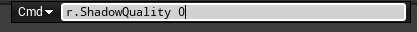
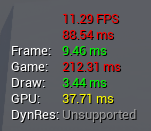
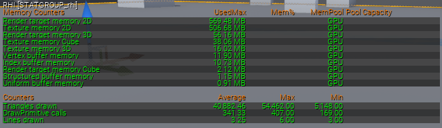
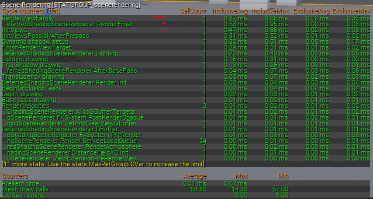

## 深入介绍

1. 对于实现渲染而言，首先是要考虑==剔除==。

2. 其次，我们要考虑==可延展性==。即我们的渲染质量是可以实时改变的，这样允许我们的程序既可以运行在PC上，也可以在手机端运行。

    1. 可以使用命令行指令，进行调试。例如：用~打开CMD，然后输入r.，可以弹出一系列控制命令，例如：==r.shadowQuality 0==可以关闭阴影。（最大质量是5）。

        

3. 延迟渲染和正向渲染。虚幻引擎采取的是==延迟渲染==（其**缺点**是其抗锯齿性，只能使用==TAA==，会导致轻微的**重影**）
4. G-Buffer。

## 实时渲染性能

1. 目标帧率，以及ms（毫秒）。CMD显示帧率的命令是：==stat fps==。如果想要更好的**评估性能**，最好解除**帧率限制**，命令是：==t.maxfps 600==。

    1. 输入：==stat unit==。会得到更多的显示信息，分别是：帧、游戏、绘制和GPU。游戏（CPU）和GPU最为重要，通过这两者，你可以确定CPU和GPU哪个阶段才是性能瓶颈。

        

    2. 高级命令：==stat rhi==。

        

    3. 高级命令：==stat scenerendering==

        

    4. 也可以使用`统计数据`进行分析。

    5. 四种最大的性能影响因素：半透明渲染（使用**着色器复杂度视图**进行分析）、复杂材质、绘制调用（==draw call==）、动态阴影。

        