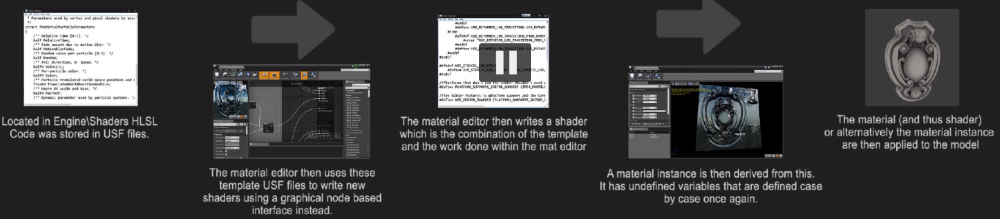

## Intro

确定好**目标帧率**，然后进行渲染，确保自己的每一个操作都是正面影响。

关于性能，除了预处理，有一点是我之前所忽略的，就是：==we need rigid pipelines and restrictions==。我们需要确定每个阶段所使用的资源，如纹理，的具体规格，不要随性而为。

### UE4目前的解决方法

## 渲染之前和遮挡

UE4中每一帧主要是三个阶段：CPU，Draw CPU，GPU。关于第二个阶段，主要是处理遮挡问题，来确定哪些几何体是不可见的，分为：

- Distance Culling。每个物体的细节面板都可以进行设置，但更高效的方法是，建立一个`cullDistanceVolume`，为它内部的物体进行统一设置。（必须手动设置）
- Frustum Culling
- 预计算的可见性（**手动开启**），首先要勾选==世界设置==的预计算可见性；然后在场景中添加一个**预计算可见性体积**。如果想要可视化，可以点击：显示->可视化-->预计算可视化单元（要先Build）
- Occulusion Culling。一个测试命令：==Freezerendering==，冻结此时的渲染，即UE4不再绘制新帧。（撤销命令：加个Un）

关于各个遮挡的性能消耗，可以使用命令：==stat Initviews==进行查看。总结来说，我们应该记得：

1. 首先开启距离剔除，特别是户外场景。
2. 既然大量物体，会增加遮挡消耗，为什么不结合起来成一个大物体呢？这是因为只要物体有一部分在屏幕内，机器就会渲染整个物体，那么，如果一个超大物体，只占据屏幕的一个像素，它这个整体也会进行渲染，总结来说，就是：可能会增加渲染成本。

## 几何渲染

1. 首先我们要考虑的是渲染顺序，纯粹的画家算法是不行的，太浪费资源。在UE4中，是使用一个`PrePass`过程，也被称为`Early Z Pass`，进行极其简单的渲染流程，确定每个像素的渲染对象，这样的话，在常规渲染中，就不会反复渲染某些像素。UE4中，我们可以修改的不多，如下图。

> A group of polygons sharing the same properties is a ==drawcall==。如果一个物体有十种材质，就会调用10次	DrawCall（复习下😗）
>

2. 查看DrawCall信息的命令：==stat RHI==。此外，对于UE4这种复杂引擎，会有很多基本损耗，所以哪怕场景中只有一个正方体，也可能会有100次调用。对于大多数游戏来说，2000~3000次调用是合理的。对于手机端和VR，一般是1000左右。

> UE4中有RenderDoc插件

3. 在模型复杂度和模型数量之间进行衡量，一个常用方法是：模块化网格。此外，一般的选择是：在设计时，选择小模型，关卡设计完成之后，可以根据需要进行**网格合并**，合并规则如下：

> 一般不会合并，出问题才使用这个方法。一般来说，移动端VR这种对于性能记为苛刻的极端场景，可能需要合并所有网格。

4. 使用==实例化静态网格渲染==可以渲染海量物体，其实就是UE4中的Instance渲染。（渲染草，树啥的）
5. UE4中的HLOD技术。常规的LOD只是减少模型的面片数量，而不会减少绘制调用（绘制调用的影响明显大于面片数量）。而HLOD则会将一组物体进行合并，这样当从远处进行看时，不仅面片数量减少了，而且绘制调用也只有一次。

6. **过度着色**。UE4中，给一个像素着色，需要同时访问周围的三个邻居。所以尽量避免使用==长薄的三角形==。

    

7. 高分辨率截图，需要首先勾选`渲染自定义深度通道`，效果：

    

## 渲染和纹理

1. 我们在UE4中，纹理压缩的格式一般是DXTC或BC。

2. 要使用Mip Map，我们必须让纹理是$n\times n$的标准纹理。

3. UE4中的着色流程：

    

4. UE4官方着色代码位置:

    

5. 设置纹理池的大小：==r.Streaming.PoolSize 1gb==。

6. 如果想要在着色器中，使用超过数量限制的纹理，可以将纹理采样器设置为：**Shared Wrap**

    

## 反射

1. UE4中有三种反射系统。各有优缺，所以要混合使用，来产生最后的渲染结果。使用优先级，不断变大。

    | 名称               | 介绍                                                         |
    | ------------------ | ------------------------------------------------------------ |
    | Reflection Capture | 在特点位置生成一张==静态==的cube map。需要`Reflection Capture Actor`；消耗最小。 |
| Planar reflection  | 不常用；类似于反射捕获，但是用平面捕获内容；且只适用于平滑表面，适用于镜子；可以**动态捕获场景** |
    | 屏幕空间反射（SSR) | 唯一默认激活；有噪点、**消耗最大**；屏幕空间方法通病，不能捕获屏幕外信息；要加入==后处理体积==进行激活。 |
    
    一些注意点：反射捕获Actor放在场景中需要严格反射的物体附近，但注意它们之间**不要重叠**，不然会增加不必要的性能消耗；建议反射捕获的数量在8个左右；如果没有开启SSR，关卡内没有使用其它两种捕获的物体，会转而使用天空光照反射。
    
    一些快捷CMD命令：设置SSR质量==r.SSR.Quality 3==；

## 静态光照

1. 为了进行预计算，我们需要准备好模型的==光照贴图UV==。静态光照的效果取决于**预计算贴图的质量**和**UV布局的质量**。

    

2. 在`reBuild`过程中，UE4通过==Lightmass==来生成lightmap。因此，同样的，我们需要在合适位置摆放`LightmassImportanceVolume`。

    

3. 光照贴图的生成质量取决两个：`Build`中的`Lighting Quality`以及世界设置中的`lightmass`参数。

4. `Indirect Light Cache`（ILC）用来解决**动态模型**上的**预计算光照**。可以通过`显示`->`可视化`->`体积光照贴图`来查看。每一个动态物体的细节面板上，都一个属性`ILC Quality`。同样，我们需要使用一个新的Actor——`LightmassCharaterIndirectDetailVolume`。

5. 导入模型时，可以进行勾选，让UE4引擎为模型生成`LightMapUV`。

6. 对于远处的物体，或者无法接近的模型，可以对它`light`下的**覆盖的光照贴图密度分辨率**进行调节，节省性能。

## 动态照明

1. 渲染质量VS阴影质量。动态阴影极为消耗资源。

2. 主要常用的==动态阴影==。

    | 名称                               | 简介                                                         |
    | ---------------------------------- | ------------------------------------------------------------ |
    | Regular Dynamic Shadows            |                                                              |
    | Per Object Shadows（固定光源阴影） |                                                              |
    | 级联阴影贴图（**CSM**）            | 适用于大型户外场景；只能应用于**定向光源**；                 |
    | 距离场阴影                         | 使用距离场信息，而不是几何信息；负责远距离阴影；在几何分明的静态物体上表现会好很多。 |

3. 开启**距离场阴影**，需要进行勾选：

    

4. 一些其它的阴影：
    1. inset shadows：类似于固定光源阴影，允许更高质量的阴影。
    2. contact shadow：适合于小物体
    3. capsule shadows：用来渲染模型下方的阴影；消耗很低；

5. 超过某一距离，关闭某一光源的阴影，来提升性能。

## 雾和透明度

1. UE4中有两种雾：**大气雾**Actor和**指数雾**Actor。还有一种**局部体积雾**。
2. 透明渲染极为消耗性能，且是延迟渲染的弱项。

## 后期处理

1. 需要`PostProcessVolume`。

    