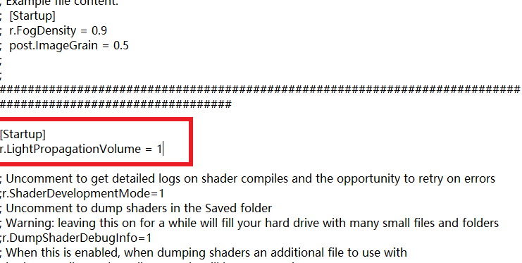

## 1. 全局光照入门

### 理解Lightmass

| 烘焙全局光照的过程                   |
| ------------------------------------ |
| 网格体应该被设置成静态的             |
| 光源应该被设置成静态的或`stationary` |
| 网格体的UV展开应该没有**重叠**       |
| 可以自动生成光照贴图的UVs            |
| 为每个物体设置合适的分辨率           |

1. 对于`stationary`类型的光源：光源通过 **Lightmass** 只烘焙静态几何体的投影和反射光照。其他则为动态光源。此设置还允许光源在游戏中改变颜色和强度，但其并不会移动，且允许部分烘焙光照。
2. 在虚幻4中，主要使用构建`Build`中的**仅构建光照**，来调用**Lightmass**。
3. 生成完成后，进行评估时，设置显示为`only lighting`，要关闭SSAO，因为在烘焙的时候，已经考虑到了一部分AO；也建议禁用**Bloom**。这样就可以无干扰的优化光照贴图。
4. 怎么提升质量呢？
    - 使用`LightmassImportanceVolume`，其本质作用是告诉`Lightmass`应该聚焦在哪里，应该计算哪些区域的GI。因此，主要是两个好处：提升质量和减少烘焙时间。（约束计算区域）
    - 使用`Lightmass portal`（Lightmass 门户），对**室内场景**尤其有用。一般来说，场景的所有**开口位置**（例如：落地窗）都要加上一个这玩意，这样**Lightmass**能更好地汇集光线或光子。（集中重点）
    - 最简单的方式：修改`Build`下地`Light Quality`。场景搭建初期，可以设置为`Low`，方便修改调式；确定好之后，再修改为`High`。

### 世界场景设置

这里只着重介绍。首先是`间接光照质量`，直接影响GI的效果，默认是1，具体可以见**Tip**；如果觉得场景比较暗，缺少`Bounce`次数，可以修改`间接光反射数`和`天空光照反射数`（反射数一般对烘焙时间影响不大）。

如果觉得捕捉到的细节不够丰富，我们可以降低`间接光照等级范围`，但需要小心，**噪点**可能变多。因此，这个一般和`间接光照质量`配合使用。

### 网格体光源

`Lightmass`允许我们将**纹理对象**作为光源。首先新建一个材质，连上**自发光**通道。

然后将材质设置成`无光照(Unlit)`，

之后，我们得告诉`Lightmass`这是个发光对象，所以在挂载此材质的物体细节面板上，勾选`Use Emissive for static Lighting`。

最终效果：

### 动态GI

当场景中包含移动对象时，LPV实时光照解决方案的效果优于烘焙，但是前者的计算量更大。

1. 首先要在`ConsoleVariables.in`中开启这项特性。打开引擎目录中的Config文件夹，选择`ConsoleVariables`文件进行修改

2. 添加自定义命令：`r.LightPropagationVolume = 1`

> 其实吧，也不用这么麻烦，直接命令行就可以设置了
>
> 一个小技巧，关于如何清楚烘焙信息，进入`Content/Maps`下，删除`XXXX_BuildData.uasset`文件

3. 选择一盏动态光源，进入细节面板，勾选`动态间接光照`。

4. 此方法是一种近似，会丢失一些细节，所以最好配合**SSAO**一起使用。
5. 关于动态GI的设置，需要`PostProcessVolume`，在其细节面板下进行修改：

## 2. 光照基础概念和效果