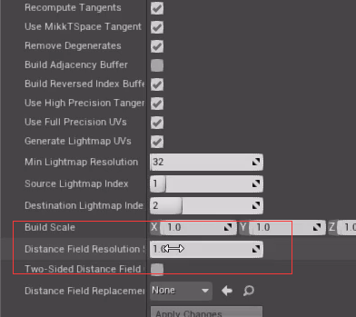
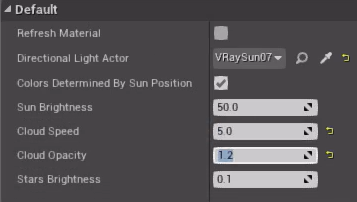
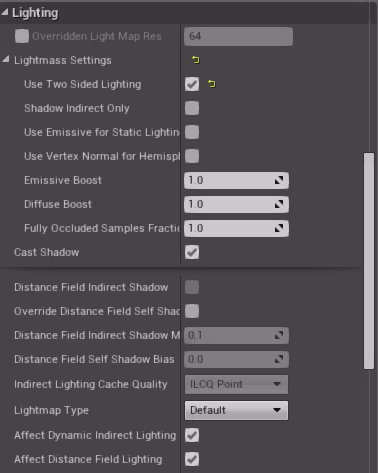
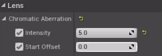

[toc]

## 1. 全局光照入门

### 理解Lightmass

| 烘焙全局光照的过程                   |
| ------------------------------------ |
| 网格体应该被设置成静态的             |
| 光源应该被设置成静态的或`stationary` |
| 网格体的UV展开应该没有**重叠**       |
| 可以自动生成光照贴图的UVs            |
| 为每个物体设置合适的分辨率           |

1. 对于`stationary`类型的光源：光源通过 **Lightmass** 只烘焙静态几何体的投影和反射光照。其他则为动态光源。此设置还允许光源在游戏中改变颜色和强度，但其并不会移动，且允许部分烘焙光照。
2. 在虚幻4中，主要使用构建`Build`中的**仅构建光照**，来调用**Lightmass**。
3. 生成完成后，进行评估时，设置显示为`only lighting`，要关闭SSAO，因为在烘焙的时候，已经考虑到了一部分AO；也建议禁用**Bloom**。这样就可以无干扰的优化光照贴图。
4. 怎么提升质量呢？
    - 使用`LightmassImportanceVolume`，其本质作用是告诉`Lightmass`应该聚焦在哪里，应该计算哪些区域的GI。因此，主要是两个好处：提升质量和减少烘焙时间。（约束计算区域）
    - 使用`Lightmass portal`（Lightmass 门户），对**室内场景**尤其有用。一般来说，场景的所有**开口位置**（例如：落地窗）都要加上一个这玩意，这样**Lightmass**能更好地汇集光线或光子。（集中重点）
    - 最简单的方式：修改`Build`下地`Light Quality`。场景搭建初期，可以设置为`Low`，方便修改调式；确定好之后，再修改为`High`。

### 世界场景设置

这里只着重介绍。首先是`间接光照质量`，直接影响GI的效果，默认是1，具体可以见**Tip**；如果觉得场景比较暗，缺少`Bounce`次数，可以修改`间接光反射数`和`天空光照反射数`（反射数一般对烘焙时间影响不大）。

如果觉得捕捉到的细节不够丰富，我们可以降低`间接光照等级范围`，但需要小心，**噪点**可能变多。因此，这个一般和`间接光照质量`配合使用。

### 网格体光源

`Lightmass`允许我们将**纹理对象**作为光源。首先新建一个材质，连上**自发光**通道。

然后将材质设置成`无光照(Unlit)`，

之后，我们得告诉`Lightmass`这是个发光对象，所以在挂载此材质的物体细节面板上，勾选`Use Emissive for static Lighting`。

最终效果：

### 动态GI

当场景中包含移动对象时，LPV实时光照解决方案的效果优于烘焙，但是前者的计算量更大。

1. 首先要在`ConsoleVariables.in`中开启这项特性。打开引擎目录中的Config文件夹，选择`ConsoleVariables`文件进行修改

2. 添加自定义命令：`r.LightPropagationVolume = 1`

> 其实吧，也不用这么麻烦，直接命令行就可以设置了
>
> 一个小技巧，关于如何清除烘焙信息，进入`Content/Maps`下，删除`XXXX_BuildData.uasset`文件

3. 选择一盏动态光源，进入细节面板，勾选`动态间接光照`。

4. 此方法是一种近似，会丢失一些细节，所以最好配合**SSAO**一起使用。
5. 关于动态GI的设置，需要`PostProcessVolume`，在其细节面板下进行修改：

## 2. 光照基础概念和效果

1. 光照贴图UV，可以导入模型时，自动生成，也可以在UE4中手动生成（如何生成之前说了）。、

    > Tip：只有场景中最重要，体积较大的物体，才选择高分辨率的光照贴图分辨率，不然一般来说，128以内就足够用了。

2. ==可移动光源==的最大缺点是不支持反射光照（==GI==，多次Bounce），不支持**实时辐射**，且阴影过于锐利。

3. 同一个区域内，无法使用过多的==固定光源==，这和每个光源存储的阴影贴图有关，关闭`投射阴影`就不会报错。

4. 固定光源和可移动光源，各自可以使用的阴影类型是不同的。

5. 默认情况下，如果**定向光源**的类型是固定或可移动，会自动生成==级联阴影贴图==（**CSM**）

6. `动态阴影距离`的值越小，阴影消失越快，但同时阴影效果也越清晰。

    

7. `动态级联阴影数字`可以修改贴图生成数量。

8. 开启**距离场阴影**，需要进行勾选：

    

9. 之后，对于`定向光源`，我们需要勾选`距离场阴影`来启用。

    

10. 同时使用CSM和距离场阴影，一般是这样的规则：近处使用质量更高的CSM，随着距离增大，CSM阴影消失，就会切换到**距离场阴影**。

    > 所以说，户外场景的动态光照，一般是混合使用CSM和距离场阴影。

11. 距离场环境光遮蔽（==DFAO==）由**天空光源**生成，注意要将其类型设置为**可移动**，且勾选`阴影投射`，其基本原理是：通过距离场网格体，模拟光线反射以及AO效果。这个技术效果不是很好，因此不是很常用，但对于户外场景，可以进行尝试使用。

    

12. 总结：设计场景时，如果不是必须，考虑到效果，将定向光源设置成`固定`，将`Sky light`设置为`静态`；而其它光源，如果希望它投射的阴影更加清晰（高频细节丰富），则设置为`固定`，反之则是`静态`

### 光照效果和反射

1. 可以使用`源半径`和`源长度`来修改点光源，来创建一个==管光源==。

    | 1.面板                               | 2.效果图                                                     |
    | ------------------------------------ | ------------------------------------------------------------ |
    |  |  |

2. IES，聚光源会用到。我们可以使用其它的工具来创建IES纹理，然后导入UE4，产生奇特的聚光效果。

    

3. ==光照函数==允许我们将材质和光源混合，进入材质界面，我们要将材质的的`材质域`设置为`光照函数`。光照函数适用于任何需要高级光照动画的效果，但不能修改颜色。除了教程中的**焦散**，还可以用来制作火焰闪烁、云层投下的动态阴影等效果。

    | 1.设置材质域                                                 | 2.应用材质                                                   |
    | ------------------------------------------------------------ | ------------------------------------------------------------ |
    |  |  |

4. 首先，关于UE4反射的基础知识可见[实时渲染深入探究2](实时渲染深入探究2.md)的**反射**一节

5. 对于反射的**混合使用**，SSR的优先级最高，然后使用**反射捕获**

6. 对于物体的材质，要真正使用SSR，还需要在其材质内，勾选`使用SSR`（应该是默认）。

7. ==反射捕获==的质量通过`系统设置`进行调节

    

8. 对于==平面反射==，关闭`捕获每一帧`来避免实时渲染，以节省性能；也可以调整分辨率（不过是在Actor的细节面板中），来修改质量。

9. 对于平面反射的启用，我们还需要勾选项目设置中的`支持平面反射的全局剪切平面`。

    

10. 最后，可以使用场景捕获来实现反射，本质就是使用新增的摄像机，将其结果渲染进行目标纹理中。

    | 1. Actor                                                     | 2. 目标纹理                                                  |
    | ------------------------------------------------------------ | ------------------------------------------------------------ |
    |  |  |

### 雾效果

1. `大气雾`是最为复杂的，我们可以直接拖入相关Actor进行使用。

2. 在`定向光`中，有相关属性和`大气雾`相关。勾选`大气/雾太阳光`，大气雾会自动默认定向光源为太阳光，然后会根据定向光源的角度和位置，调整天空颜色:arrow_down:。

    | 白天                                                         | 黄昏                                                         |
    | ------------------------------------------------------------ | ------------------------------------------------------------ |
    |  |  |

3. 如果不想看见太阳的轮廓，可以在大气雾的细节面板上，勾选`禁用日轮`。

    > 这里只是简单的使用，具体的设置参数，可以见官方手册的详细介绍

4. 指数雾相对简单，但也会根据**定向光源**的角度和位置，调整天空颜色。

5. `光束泛光`和`光束遮蔽`，本身和雾无关，但是产生的效果能让我们感受到光线穿过雾气的真实效果。打开**定向光**的细节面板，可以找到**光束**的分栏：

    

6. 光束遮挡使光线变暗，而光线泛光则相反，效果图如下:arrow_down:：

    | 勾选光束遮挡                                                 | 勾选光束泛光                                                 |
    | ------------------------------------------------------------ | ------------------------------------------------------------ |
    |  |  |

7. 如果要启用==体积雾==，则需要勾选**高度雾Actor**中体积雾选项

    

    > 体积雾实际上使用了体积光照贴图

8. 对于光源对雾气的反应，其细节面板上的`体积散射强度`可以对其进行控制:arrow_down:

    | 低值                                                    | 高值                                                    |
    | ------------------------------------------------------- | ------------------------------------------------------- |
    |  |  |

## 3. 创建实时室内建筑项目

1. 场景的初始，一般是设计静态光照，为了明确烘焙效果，做好关闭诸如AO之类的高级效果。

2. 关于IES配置文件，对于性能的影响很少，但却能增加物理光源的真实性。lithonia.com提供了很多免费的IES配置文件。

3. 对于`定向光`，一般设置为`固定`，这样才会距离场阴影。定向光有两个光源角度，第一个仅适用于==动态光源==，仅对距离场阴影和胶囊体阴影有效；这个角度越大，太阳盘越大，产生的阴影越柔和。

   

   第二个角度在`lightmass`下，只会影响烘焙光照。

3. 使用`SkyLight`，还需要勾选：对固定物体使用区域阴影。（CSM更适合户外场景，这里不讨论）

   

4. 对于基于距离场的技术，如果在某个物体上表现不太好，打开该物体，在其细节面板上进行如下修改：

   

5. 还可以在窗户处摆放多个`聚光源`，来模拟户外区域光。

   

6. 增加天空穹顶有多种方法：直接导入外部模型；通过大气雾实现（之前讲过）；添加`BP_Sky_Sphere`，然后设置其默认定向光：

   

   ​	其一项好处，可以设置动画云：

   | 1                                                            | 2                                                            |
   | ------------------------------------------------------------ | ------------------------------------------------------------ |
   |  |  |

7. 如果我们使用聚光源来代替户外光，则光源会出现在镜子的反射中，这样不对：

   

   可以修改细节面板，来避免其加入反射中：

   

8. 关于提升SSR质量，可以进入模型的LOD 0细节面板：

   

   9. 另一个==提升方法==是修改系统设置中的`G Buffer格式`为高精度。

      

### 关于动态GI

### Lightmass设置

1. 首先关于`static Lighting Level Scale`，对于室内场景一般是1.0（代表场景比例使用UE4的默认单位：1cm），而户外场景则可能达到2.0，4.0（有助于缩减构建时间）。此项和`Indirect Lighting Quity`，满足乘积不大于的1的条件。

   > 一个小技巧：将场景比例设置为0.1，而间接光照质量设置为10。虽然会增大构建时间，但光照质量会大幅度提升

2. 对于`Num Indirect Lighting Bounce`，一般是3~5（超过5其实也看不出来）。

3. 如果启用了==Sky light==，可以修改`Num Sky Lighting Bounce`，取决于我们希望场景有多亮。

4. `Indirect Lighting Smothness`增加至1.1或1.2，可以提高光照质量。

5. 以上都是Lightmass本身的一些设置，每个对象自己也有如下的Lightmass设置面板：

   

6. 使用`Use Two Sided Lighting`，应用在任何需要从单面光照转化为双面光照的对象

> 不使用==重要体积==，就会全图烘焙，所以实际上这种体积，是用来进行==场景优化==的。

### 使用Swarm烘焙室内光照

1. 虚幻引擎附带名为==Swarm==的**分布式光照贴图烘焙系统**，只需简单的设置就能运行

2. 主要包含`SwarmAgent`和`SwarmCoordinator`

   

### 后期处理

1. 首先是颜色分级。

   + 白平衡。字面上的理解是白色的平衡，允许我们控制场景的温度，让其与光照温度一致，让白色尽可能接近纯白。首先调整`Temp`，例如调整到5500，整个场景会偏冷。

     

     > 色温。所谓色温，简而言之，就是定量地以[开尔文](https://baike.baidu.com/item/开尔文)温度（K）来表示色彩。[英国](https://baike.baidu.com/item/英国)著名物理学家[开尔文](https://baike.baidu.com/item/开尔文)认为，假定某一黑体物质，能够将落在其上的所有热量吸收，而没有损失，同时又能够将热量生成的能量全部以“光”的形式释放出来的话，它便会因受到热力的高低而变成不同的颜色。例如，当黑体受到的热力相当于500-550℃时，就会变成暗红色，达到1050-1150℃时 [1] ，就变成黄色，温度继续升高会呈现蓝色。光源的颜色成分与该黑体所受的热力温度是相对应的，任何光线的色温是相当于上述黑体散发出同样颜色时所受到的“温度”，这个温度就用来表示某种色光的特性以区别其它，这就是色温。打铁过程中，黑色的铁在炉温中逐渐变成红色，这便是黑体理论的最好例子。色温现象在日常生活中非常普遍，相信人们对它并不陌生。[钨丝灯](https://baike.baidu.com/item/钨丝灯)所发出的光由于色温较低表现为黄色调，不同的路灯也会发出不同颜色的光，天然气的火焰是蓝色的，原因是色温较高。正午阳光直射下的色温约为5600K，阴天更接近室内色温3200K。日出或日落时的色温约为2000K，烛光的色温约为1000K。这时我们不难发现一个规律：色温越高，光色越偏蓝；色温越低则偏红。某一种色光比其它色光的色温高时，说明该色光比其它色光偏蓝，反之则偏红；同样，当一种色光比其它色光偏蓝时说明该色光的色温偏高，反之偏低 [1] 。、
     >
     > [知乎——白平衡](https://zhuanlan.zhihu.com/p/56562780)

   + 以下都是通用项（全局、阴影、高光）

   + 饱和度和对比度。==饱和度==可定义为**彩度除以明度**，与彩度同样表征彩色偏离同亮度灰色的程度。==对比度==指的是一幅图像中明暗区域最亮的白和最暗的黑之间不同亮度层级的测量，差异范围越大代表对比越大，差异范围越小代表对比越小，好的对比率120:1就可容易地显示生动、丰富的色彩，当对比率高达300:1时，便可支持各阶的颜色（各个分栏中都有）

     > ==饱和度==取决于该色中含色成分和消色成分（灰色）的比例。含色成分越大，饱和度越大；消色成分越大，饱和度越小。纯的颜色都是高度饱和的，如鲜红，鲜绿。混杂上白色，灰色或其他色调的颜色，是不饱和的颜色，如绛紫，粉红，黄褐等。完全不饱和的颜色根本没有色调，如黑白之间的各种灰色。
     >
     > ==对比度==就是把白色信号在100%和0%的饱和度相减，再除以用Lux(光照度，即勒克斯，每平方米的流明值)为计量单位下0%的白色值(0%的白色信号实际上就是黑色)，所得到的数值。==对比度==是最白与最黑**亮度单位**的相除值。因此白色越亮、黑色越暗，对比度就越高。
     >
     > [HSV三要素](https://baijiahao.baidu.com/s?id=1641846864822684554&wfr=spider&for=pc)

   + ==Gain==用于控制高光

   + ==Gamma==用于控制中间色调

   + ==Offset==用于控制场景阴影

     > 通用的，一般都是先调节全局，在调节阴影等其他的。

2. 摄像机镜头效果

   + ==色差==。用于模拟旧镜头产生的`色差`效果

     | 1                                                            | 2                                                            |
     | ------------------------------------------------------------ | ------------------------------------------------------------ |
     |  |  |

   + ==Dirt Mask==。允许添加镜头泥土效果，首先我需要一个蒙版纹理：

     

     ​	对于使用的纹理，不要生成Mip Maps：

     

     ​	同时不要进行纹理推送：

     

     ​	效果：

     ​									

其他的一些特效已经比较熟悉，就在这里重复了。（参数设置可以看官方文档）

## 4. 创建实时室外建筑项目

这个教程一开始是关于如何3Dmas中设置模型以适配UE4，然后是FBX导入的相关设置，由于和本文目的无关，就跳过了，其中导入可以使用DataSmith，基本傻瓜操作，所以之后如果需要补，可以只补设置的相关课程。

### 创建和使用LOD来提高性能

> 在3Dmax中导出带LOD的模型集时，必须勾选动画，不然没法导出