# 教程1

## 1. 整体架构

1. 首先，我们需要注意的是在编辑材质时，要小心其细节面板的`用法`分栏，我们需要明确其勾选，否则，很有可能导出后**报错**，部分材质无法显示，例如：一般情况下，哪怕没有勾选，UE4也会启动使用**静态光照**的版本。

2. 为什么编译着色器的数量如此惊人？理由和Unity一样，着色器内分支结构的使用会导致大量的**着色器变体**，每一个变体都要进行编译。

3. 大多数情况，我们无需专门去减少变体数量，保持默认设置即可。

4. 如果需要减少，可以修改如下设置：

   

## 2. 性能

1. 对于材质而言，300以内的材质命令数是合理的（PC），但无论什么硬件环境，过千条的命令数都是不合理的。

## 3. PBR

1. 对于大多数情况，我们只需将`金属度`看作布尔值，`高光值`不用修改，默认使用0.5，着重修改粗糙度即可。

## 4. 压缩和内存

1. 之前也说了，UE4的压缩格式是DXTC或BC，而`矢量置换贴图`则是未压缩，同时，不要因为纹理是灰度图，就选择压缩方式中的`灰度`，这是误导。

   > 具体这些格式细节，可以见RTR4读书笔记

2. 密切关注纹理**信息面板**。

   

3. 勾选`延迟压缩`，会停止在纹理导入时进行其他压缩操作，而变为在保存时进行压缩，这方便开发，是个不错的选项。
4. 法线贴图使用的是特殊的BC5压缩方式，只是要R、G通道。只要使用正确的压缩格式，就无需在着色（蓝图）中使用专门的函数来还原B通道。
5. 帧率问题一般和纹理无关。
6. 可以使用`统计数据窗口`来查看纹理内存使用的详细情况。
7. 使用命令：==stat Memory==，进行查看。

## 5. 纹理池

深入了解纹理如何通过流送、多级渐进纹理、纹理池大小等方面管理可用内存。我们将介绍如何在避免内存遭遇瓶颈的情况下将纹理细节最大化。

1. 根据项目需要，使用命令：r.Straming.PoolSize，来修改纹理池大小，因为项目默认值并不大（==2GB==）。

2. 纹理流送是系统决定使用哪张纹理和相应Mip的过程。

3. 进行纹理分组，方便管理

4. ==合并贴图==，本质是将RGB通道中的不同图像进行组合，例如：三个通道存储了三张纹理的$\alpha$通道。

   > 补充知识可见[纹理](..\实时渲染\实时渲染深入探究2.md)

## 6. 渲染目标

1. 在编辑器或渲染时生成的特殊纹理。

2. 其中，部分情况下使用的`SceneCapture`在**反射**一节也提到过。

3. 关于，怎么将程序纹理渲染进一张贴图中：通过算法生成程序材质，通过蓝图将材质应用到==渲染目标==上，最后将其转化为平常使用的**静态纹理**。

   | 相关对象                                              | 蓝图                                                  |
   | ----------------------------------------------------- | ----------------------------------------------------- |
   |  |  |

> 游戏中，所有雪的实现（在雪地走，雪被挤向两侧），都是基于渲染目标

## 7. 材质编辑器

 

常用的**数学公式**（HLSL中也是常见的）

   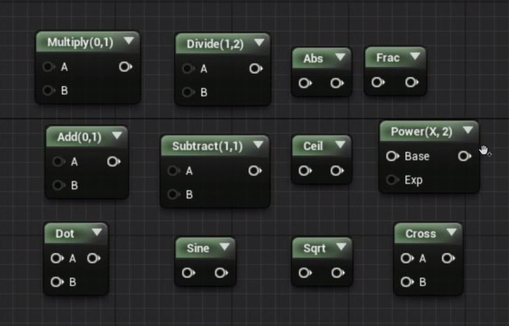

#### 动画序列视图

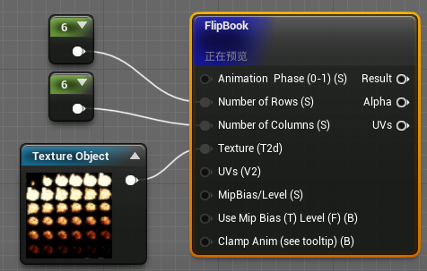

#### 使用的外部信息

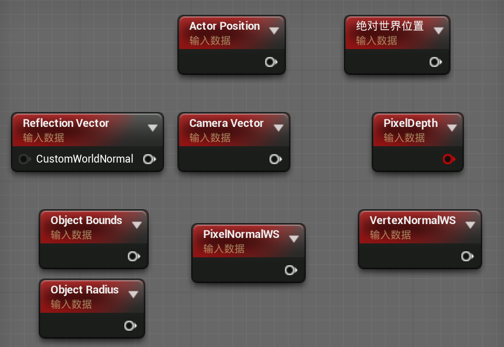

#### 世界对齐纹理

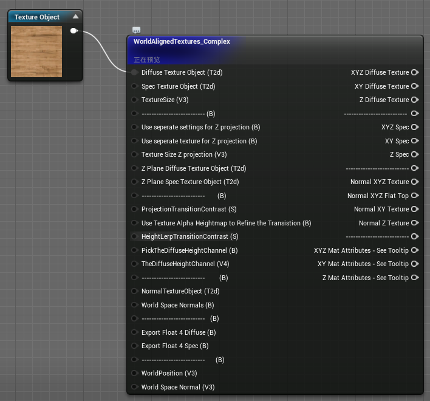

## 8. 简单组合

这里只会简单提及几个有意思的。具体可见教程，比较简单。

#### Bump Offset

| 蓝图                                                         | 效果                                                         |
| ------------------------------------------------------------ | ------------------------------------------------------------ |
| 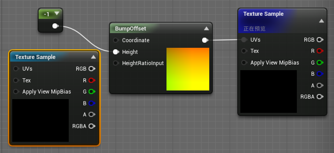 | 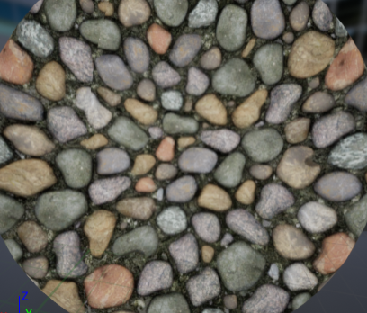 |

使用纹理的话，有种凸起感，（Offset的纹理使用的是同一张，不过要将**采样类型**设置为`线性颜色`）

| 蓝图                                                         | 效果                                                         |
| ------------------------------------------------------------ | ------------------------------------------------------------ |
| 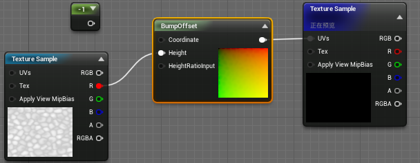 | 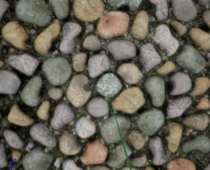 |

一些用处：模仿老式显像管电视机、

#### 混合角度纠正法线

学了这么久图形学，这点还是清楚的，法线贴图的混合可和一般的不一样。

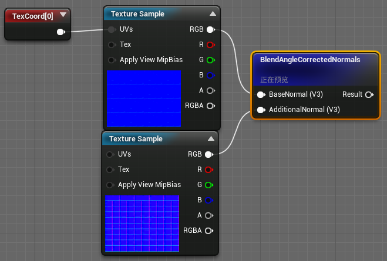

当然，可以用乘法，来改变贴图强度，但是注意不要修改**蓝色通道**。

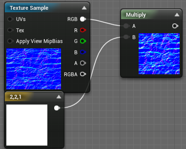

#### 顶点着色

| 蓝图                                                         | 效果                                                  |
| ------------------------------------------------------------ | ----------------------------------------------------- |
| 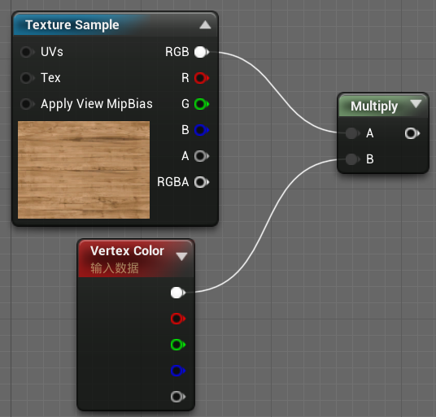 | 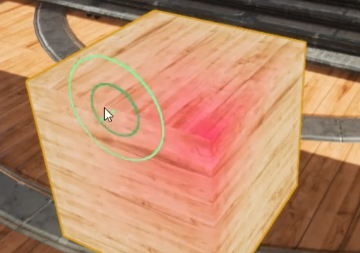 |

| 蓝图                                                         | 效果                                                  |
| ------------------------------------------------------------ | ----------------------------------------------------- |
| 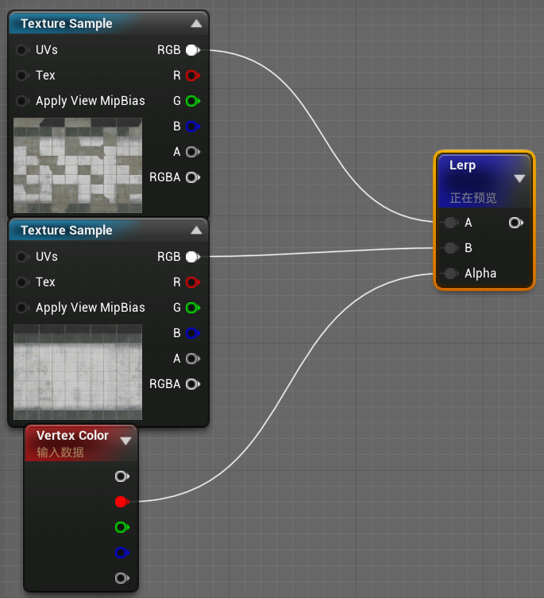 |  |

## 9. 材质输入

这节我们聚焦于用**HLSL**编写的==渲染模板==。**重点**是`材质域`、`混合模式`、`渲染模型`

| 模板                                                  | 控制面板                                              |
| ----------------------------------------------------- | ----------------------------------------------------- |
| 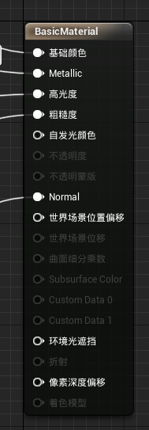 | 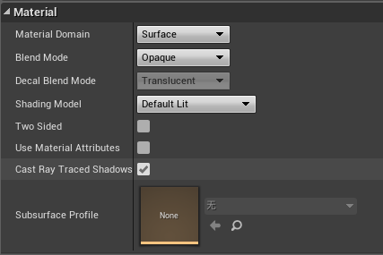 |

#### Displacement

一个简单的==置换贴图==的蓝图

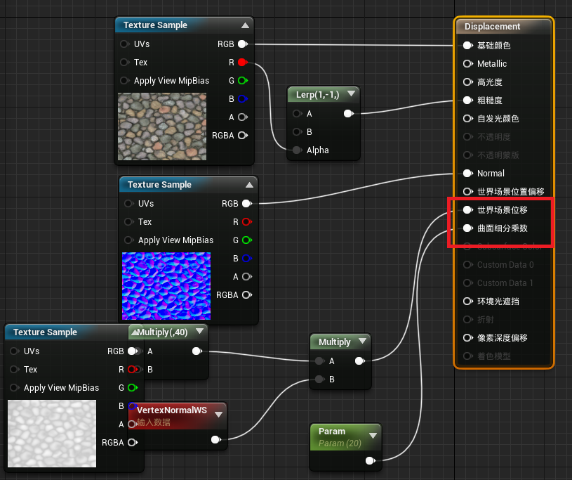

效果图

提醒下，这种方法实际改变了==几何网格==，并且做了曲面细分，建议**参考上限数**为16。

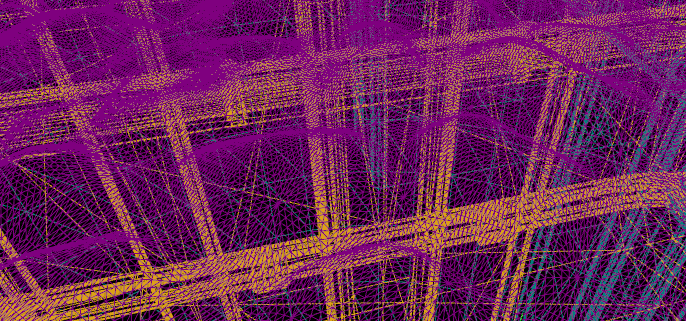

对了，如果要启用这个技术，需要修好材质细节面板，如下：

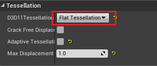

#### 世界位置偏移

这个方法的实现方式和原理和`Displacement`比较相似，其简单使用的蓝图如下：

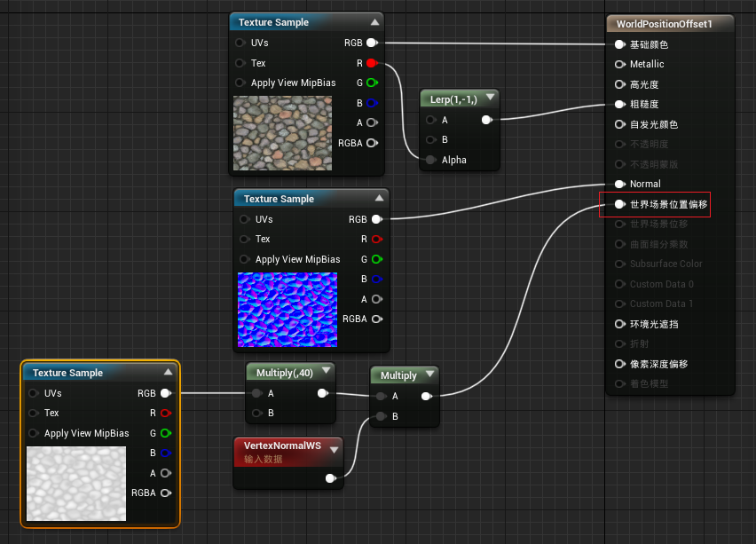

基本原理：使用**顶点着色器**对顶点位置进行进一步偏移。此技术和`Displacement`的最大区别在于，这个技术必须使用==高模模型==，而不能进行曲面细分（显而易见）。

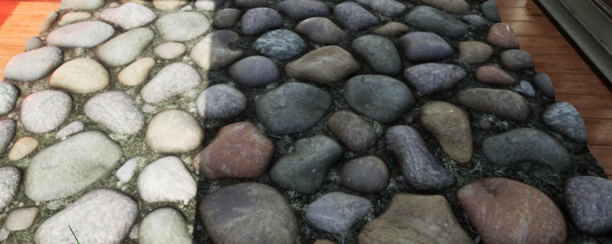

| 置换                               | 世界位置偏移                                   |
| ---------------------------------- | ---------------------------------------------- |
| 可以根据平台，调节细分数，控制性能 | 可以根据需要对模型的不同部分采取不同的细分程度 |

而且，实际上，这里的例子并不是==世界位置偏移==的常规用处，而是诸如**草丛或植物类对象**:arrow_down:，或者布料。

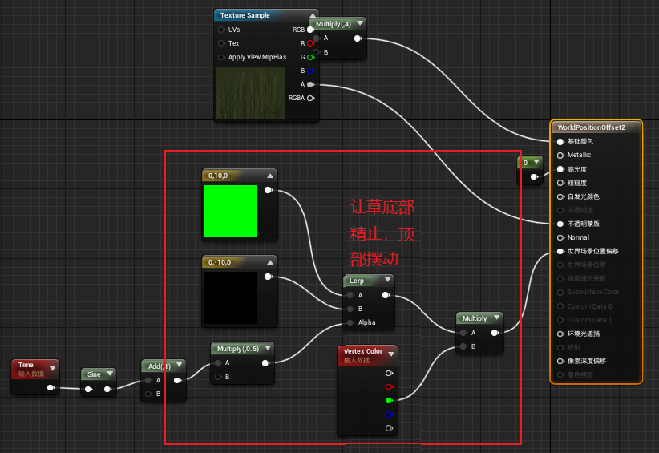

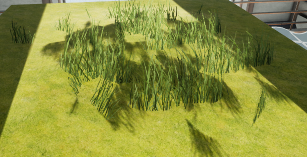

还有简单的==海面==

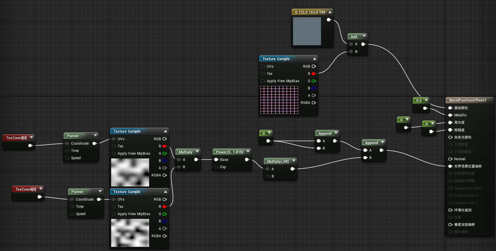

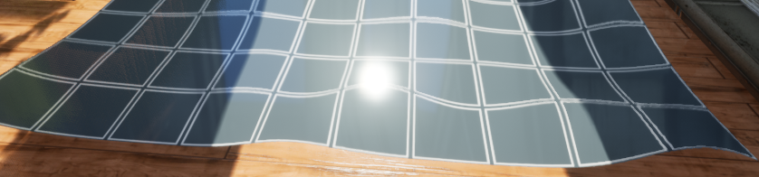

再比如，使用此技术让物体旋转

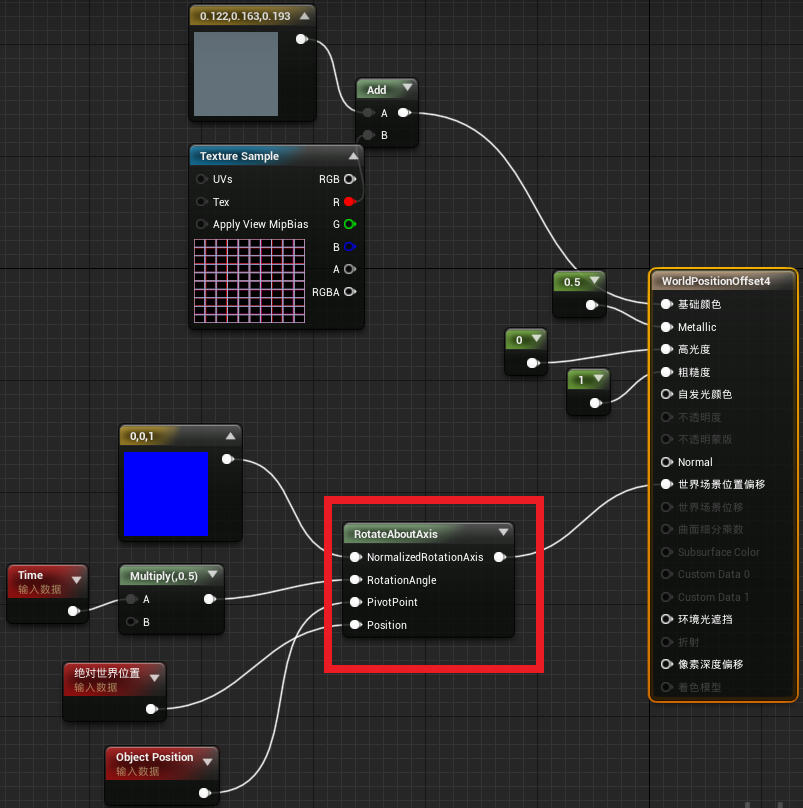

#### 环境光遮蔽

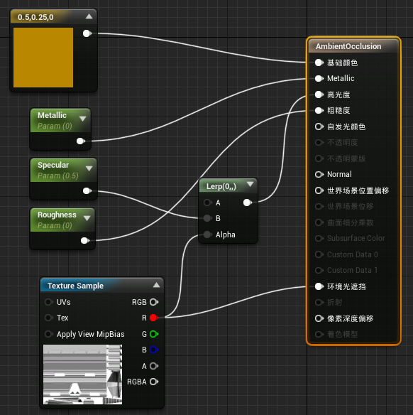

对于UE4引擎，我们需要知道的是，在材质中使用**环境光遮蔽**，只能在静态光照模型上使用和显示。因此，需要注意它实际会不会生效，所以实际上很多材质从来不使用AO。

#### 像素深度偏移

2018年**UE4**更新的新技术，当时使用还较少，

| 蓝图                                                  | 效果                                                  |
| ----------------------------------------------------- | ----------------------------------------------------- |
| 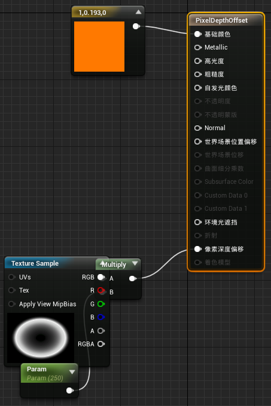 | 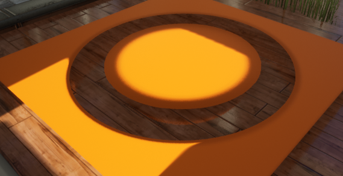 |

这个圆环的空心部分，实际上已经偏移到了地面之下，被覆盖了，不会显示出来，如果让圆盘继续向上，则空心部分会变小，因为两者的距离差超过了$[0,1]\times 250$（例子中的）。

用处呢，比如：我们不希望人物的刘海穿模，比如，草丛的分布应该有层次感:arrow_down:。

| Bad                                                   | Good                                                         |
| ----------------------------------------------------- | ------------------------------------------------------------ |
| 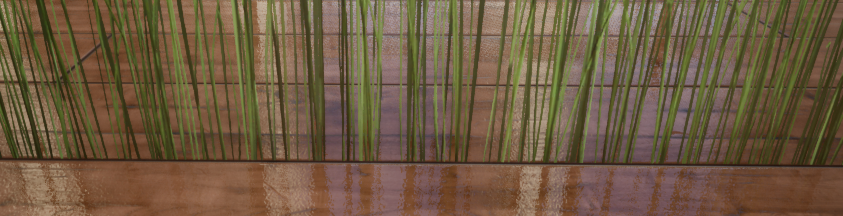 | 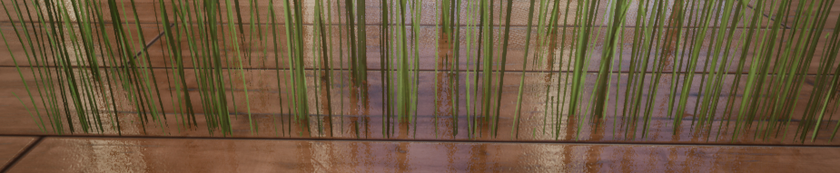 |

也可让视差贴图有如下效果——和物体相交的正确性。

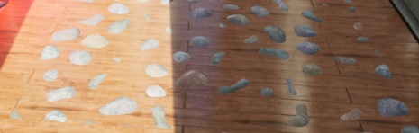