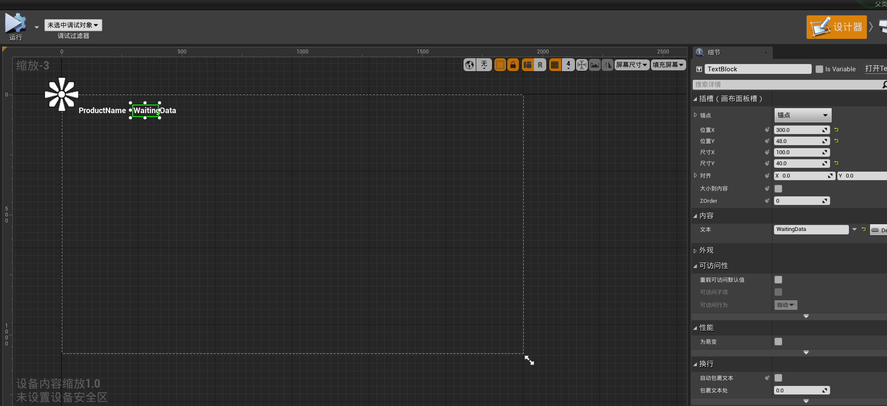

# 蓝图学习1

## 1. 基础概念

蓝图的种类：

+ 关卡蓝图（Level Blueprint）：与关卡绑定，耦合程度大
+ 类蓝图（Class Blueprint）：更加模块化，能用于任何关卡

> C++ code = Blueprint

蓝图的组件的基本使用可以见[教程](https://learn.unrealengine.com/course/2449697/module/5394457?moduletoken=UHxxnDLPW8SWh0MmIHBqeQB6EldmIbItt8cKrHDZ2uPewDU0HUuDlOrhIYF3665x&LPId=94213)，比较简单，就不赘述了。

一些简单例子来看蓝图的使用：

+ 蓝图唤醒时，控制台输出字符串

  

+ 选择节点，按`C`可以进行注释

  

+ 折叠成函数、宏、节点。

动画蓝图、UI蓝图、子蓝图

> C++更高效和强大

使用蓝图的注意事项

## 2. 可交互材质切换

1. 创建参数集合
2. 具体的就不做笔记了，其实和Unity差不多，但这个教程确实比较经典，都是些常用的技术点，时间也不长，可以来反复记忆。

https://learn.unrealengine.com/course/2449670/module/5394494?moduletoken=UHxxnDLPW8SWh0MmIHBqeba2j8JpnpNls1~eB~2rcKJTeE13PqU4jMmikrYWk0-V&LPId=94213

## 3. 蓝图配置器

### DataTable

在UE4中使用CSV表格：

1. 首先需要在UE4中定义表格结构，告诉引擎表格有多少列，一般来说，第一列默认是**ID**，所以可以忽略，直接从第二列开始考虑。新建一个`Structure`，然后导入表格，按右下图设置。

    | 结构                                                         | 配置                                                         |
| ------------------------------------------------------------ | ------------------------------------------------------------ |
    |  |  |
    
2. 实例蓝图

    

### HUD（头显）

HUD是一种向用户提供2D视觉反馈和交互功能的便捷方法。

1. 新建一个`控件蓝图`

    

2. 在`设计器`中添加UI组件，进行设计

    

3. 在图表中，进行类似蓝图的设计

4. 实际应用此蓝图，我们需要在关卡蓝图中进行如下设置：创建此蓝图的实例，然后可以新建一个此变量，将值赋给它，最后将遍历加入到视口中，进行显示。

    

### 游戏模式

1. 首先新建一个**游戏模式**类和**玩家控制**类的蓝图

    

2. 在游戏模式里面，选择新建的玩家类作为默认控制器

    

3. 在**玩家控制**类里面，有很多基于玩家的控制信息，根据需要，进行勾选

    

4. 在世界场景设置中，选择此==游戏模式类==

    

    