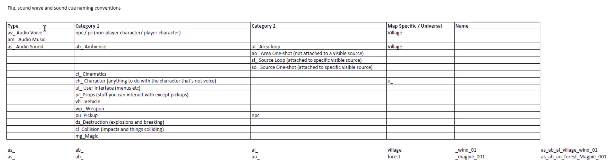
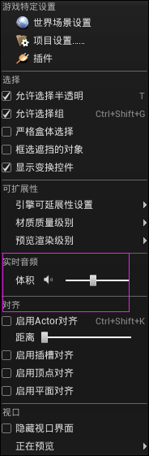
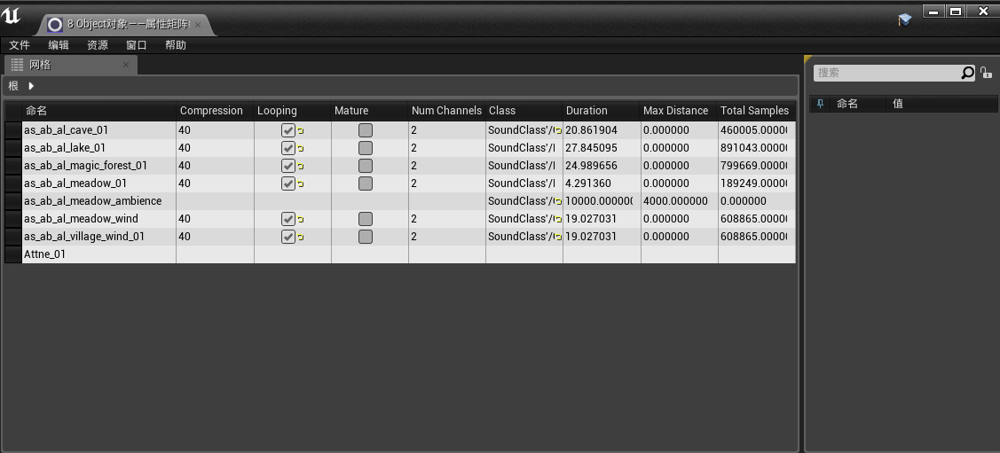
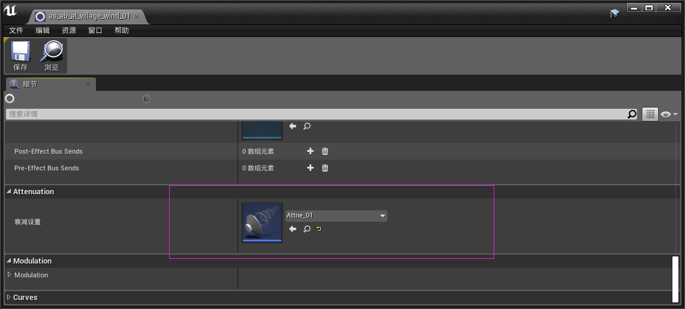
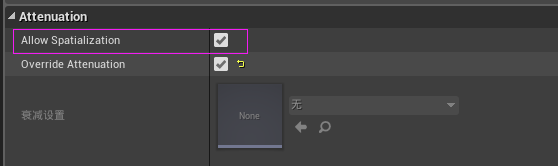
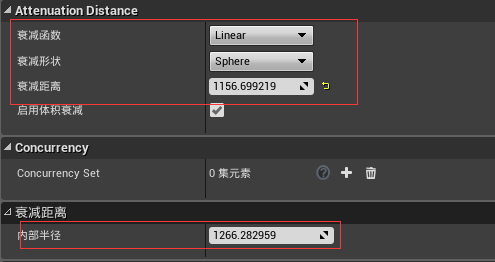
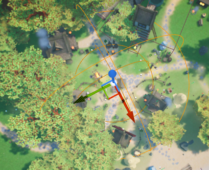
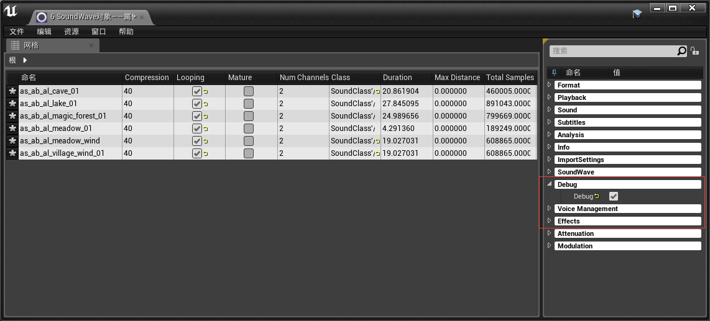
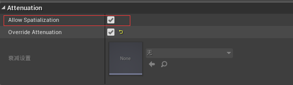
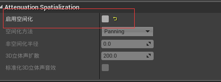

## 1. 基础

1. 命名规范

    

2. 开启实时音频

    

3. 如果符合命名规范，那么命令：`audiosolosoundwave xx`会只播放以`xx`开头的环境音效。

4. 通过==属性矩阵==，对大量音频进行快速调整

    

## 2. 区域循环音效

1. 直接添加，整个场景都会有，但这是不符合我们要求的，所以要进行声音衰减。**常见做法**是新建一个==声音衰减资源==。

2. 然后在音频面板，进行依赖索引：

    

3. 第二种方法，勾选`覆盖衰减`：

    

    调解衰减区域

    | 参数                                                         | 效果                                                         |
    | ------------------------------------------------------------ | ------------------------------------------------------------ |
    |  |  |

    

4. 区域类型：Sphere、Box、Capsule、定向。

5. 命令：==stat sounds-debug==，可以看到声音衰减的形状。前提是我们勾选了此音频的`调试`：

    

6. 空间音效，也就是是否启用**立体声**，很多情况下是不必要的，因此我们对区域循环音效的常见做法是：在细节面板上勾选`启用空间化`；但在音效空间化选项中，关闭它。

    | 1                                                            | 2                                                            |
    | ------------------------------------------------------------ | ------------------------------------------------------------ |
    |  |  |

    