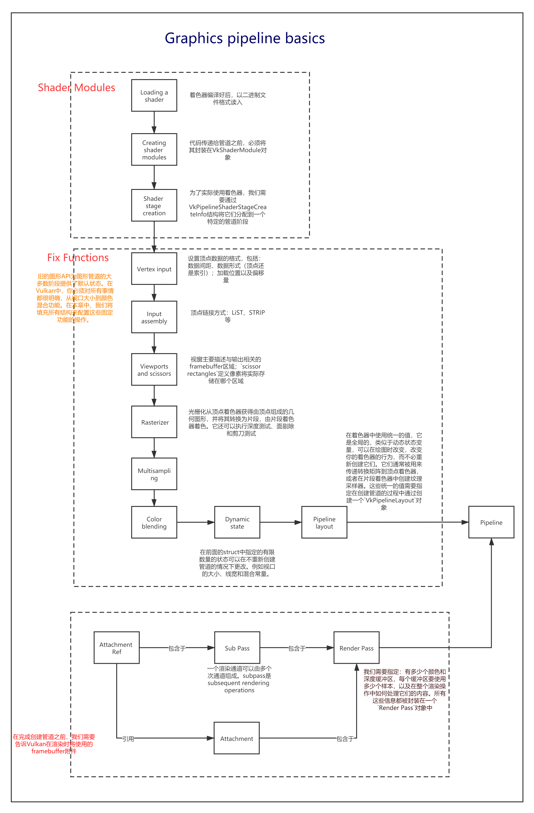
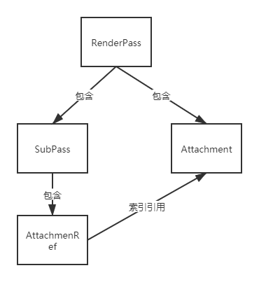
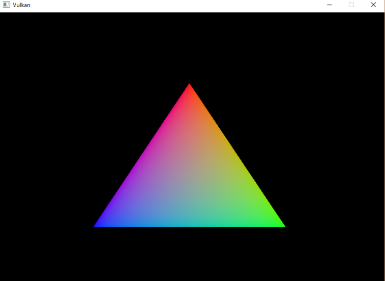
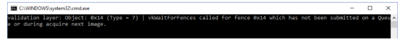

# Vulkan教程1

[toc]


## 开发环境

首先，假设我们使用系统是Win10，采用Visual Studio进行开发

==Vulkan SDK==

开发Vulkan最重要的组件是SDK，类似于OpenGL的GLEW，[下载网址](https://vulkan.lunarg.com/)，下载好之后直接点击EXE。安装完成后要做的第一件事是验证图形卡和驱动程序是否正确支持Vulkan。转到安装SDK的`Bin`目录，打开目录并运行`vkcube.exe`演示，正确结果如下：


> 目录中还有另一个程序对开发有用。`glslangValidator.exe`和`glslc.exe`程序将被用于编译从人类可读着色[GLSL](https://en.wikipedia.org/wiki/OpenGL_Shading_Language)到字节码。

==GLFW和GLM==

这两个库在OpenGL的学习中已经用到，这里我也懒得写了，直接给一个我已经配好的[文件夹]()

然后老生常谈，放在自定义的路径下的话，去项目属性里面设置依赖库啥的，唯一需要注意的是，这里的环境是64位的。

> [原教程地址](https://vulkan-tutorial.com/Development_environment)


## 画一个三角形

### 1. 开始

#### 1.1  基本代码

我们将从如下代码开始

```c++
#include <vulkan/vulkan.h>

#include <iostream>
#include <stdexcept>
#include <cstdlib>

class HelloTriangleApplication {
public:
    void run() {
        initVulkan();
        mainLoop();
        cleanup();
    }

private:
    void initVulkan() {

    }

    void mainLoop() {

    }

    void cleanup() {

    }
};

int main() {
    HelloTriangleApplication app;

    try {
        app.run();
    } catch (const std::exception& e) {
        std::cerr << e.what() << std::endl;
        return EXIT_FAILURE;
    }

    return EXIT_SUCCESS;
}
```

我们首先包含LunarG SDK中的Vulkan.h，提供我们编程所需的函数，结构和枚举。`stdexcept`和`iostream`头用于报告和传播错误（eporting and propagating errors）。`cstdlib` 提供了`EXIT_SUCCESS`和`EXIT_FAILURE`宏。

程序本身被包装到一个类中，在该类中，我们将Vulkan对象存储为私有类成员，并添加函数来初始化每个对象。一切准备就绪后，我们进入主循环以开始渲染帧。我们将填写`mainLoop` 函数以包含一个循环，该循环将反复执行直到窗口关闭。窗口关闭并返回后，在`cleanup`函数中释放已使用的资源。

添加一个`initWindow`函数，并设置在其他调用之前用。我们将使用该函数初始化并创建一个窗口。写法和OpenGL一样，

```c++
const uint32_t WIDTH = 800;
const uint32_t HEIGHT = 600;
void initWindow() {
    glfwInit();
	//initWindow中的第一个调用应该是glfwInit()，它初始化了GLFW库。因为GLFW最初设计用来创建OpenGL上下文，所以我们需要告诉它不要在后续调用中创建OpenGL上下文
    glfwWindowHint(GLFW_CLIENT_API, GLFW_NO_API);
    //因为处理调整大小的窗口需要特别小心，我们稍后将对此进行研究，所以禁用它
    glfwWindowHint(GLFW_RESIZABLE, GLFW_FALSE);
	//前三个参数指定窗口的宽度，高度和标题。第四个参数允许您有选择地指定一个监视器以打开		窗口，最后一个参数仅与OpenGL有关。
    window = glfwCreateWindow(WIDTH, HEIGHT, "Vulkan", nullptr, nullptr);
}
```

为了保持应用程序运行直到发生错误或关闭窗口，我们需要向`mainLoop`函数添加一个事件循环，如下所示：

```c++
void mainLoop() {
    while (!glfwWindowShouldClose(window)) {
        glfwPollEvents();
    }
}
```

窗口关闭后，我们需要通过销毁资源并终止GLFW本身来清理资源。这将是我们的第一个`cleanup`代码：

```c++
void cleanup() {
    glfwDestroyWindow(window);

    glfwTerminate();
}
```


####  1.2 实例

第一件事是通过创建实例来初始化Vulkan库（应用程序和Vulkan库之间的连接），创建该实例涉及为驱动程序指定有关应用程序的一些详细信息。

首先添加一个`createInstance`函数并在该`initVulkan`函数中调用它 。另外，添加一个数据成员以持有该实例的句柄：

```c++
VkInstance instance;
```

现在，要创建实例==，我们首先必须在结构中填充一些有关我们应用程序的信息，以优化我们的应用程序==。该结构称为[`VkApplicationInfo`](https://www.khronos.org/registry/vulkan/specs/1.0/man/html/VkApplicationInfo.html)：

```c#
void createInstance() {
    VkApplicationInfo appInfo{};
    appInfo.sType = VK_STRUCTURE_TYPE_APPLICATION_INFO;
    appInfo.pApplicationName = "Hello Triangle";
    appInfo.applicationVersion = VK_MAKE_VERSION(1, 0, 0);
    appInfo.pEngineName = "No Engine";
    appInfo.engineVersion = VK_MAKE_VERSION(1, 0, 0);
    appInfo.apiVersion = VK_API_VERSION_1_0;
}
```

如前所述，`Vulkan`中的许多结构要求在`sType`成员中显式地指定类型。这也是许多具有`pNext`成员的结构中的一个，`pNext`成员可以在将来指向扩展信息。我们在这里使用**值初始化**将其保留为`nullptr`。

Vulkan中有很多信息是**通过结构体传递的**，而不是通过函数参数传递的，==我们必须再填充一个结构体，以便为创建实例提供足够的信息==。下一个结构不是可选的，它告诉Vulkan驱动程序我们想要使用哪一个**全局扩展和验证层**。全局性意味着它们适用于整个程序，而不是特定的设备。

```c#
VkInstanceCreateInfo createInfo{};
createInfo.sType = VK_STRUCTURE_TYPE_INSTANCE_CREATE_INFO;
createInfo.pApplicationInfo = &appInfo;
```

==接下来的两个属性指定所需的全局扩展==。正如在概述章节中提到的，**Vulkan是一个平台无关的API**，这意味着您需要一个扩展来与窗口系统进行衔接。`GLFW`有一个方便的内置函数，它返回它需要的扩展名，我们可以将这些扩展名传递给结构体

```c++
uint32_t glfwExtensionCount = 0;
const char** glfwExtensions;

glfwExtensions = glfwGetRequiredInstanceExtensions(&glfwExtensionCount);
createInfo.enabledExtensionCount = glfwExtensionCount;
createInfo.ppEnabledExtensionNames = glfwExtensions;
```

结构的最后两个成员决定要启用的**全局验证层**。我们将在下一章更深入地讨论这些，所以现在先把这些空着。

```c++
createInfo.enabledLayerCount = 0;
VkResult result = vkCreateInstance(&createInfo, nullptr, &instance);
```

Vulkan中对象创建函数参数的一般模式如下

- Pointer to struct with creation info
- Pointer to custom allocator callbacks, always `nullptr` in this tutorial
- Pointer to the variable that stores the handle to the new object

```c++
if (vkCreateInstance(&createInfo, nullptr, &instance) != VK_SUCCESS) {
    throw std::runtime_error("failed to create instance!");
}
```

如果您查看`vkCreateInstance`文档，那么您将看到其中一个可能的错误是`VK_ERROR_EXTENSION_NOT_PRESENT`。我们可以简单地指定我们需要的扩展，并在错误返回时终止。这对于像窗口系统接口这样的基本扩展是有意义的，但是如果我们想要检查可选功能呢

要在创建实例之前检索受支持的扩展列表，可以使用`vkEnumerateInstanceExtensionProperties`函数。它使用**一个指向存储扩展数量的变量的指针**和一个`VkExtensionProperties`数组来存储扩展的详细信息。它还带有一个可选的first参数，该参数允许我们通过特定的验证层过滤扩展，我们现在将忽略这个验证层

要分配一个数组来保存扩展细节，我们首先需要知道有多少个扩展细节。您可以通过将后一个参数保留为空来请求扩展的数量

```c++
uint32_t extensionCount = 0;
vkEnumerateInstanceExtensionProperties(nullptr, &extensionCount, nullptr);
```

现在分配一个数组来保存扩展细节

```c++
std::vector<VkExtensionProperties> extensions(extensionCount);
vkEnumerateInstanceExtensionProperties(nullptr, &extensionCount, extensions.data());
```

可以使用vkDestroyInstance函数销毁VkInstance

```c++
 vkDestroyInstance(instance, nullptr);
```

------


#### 1.3  验证层

==Vulkan API的设计理念是将驱动程序开销最小化，表现之一就是默认情况下API中的错误检查非常有限==。即使是枚举设置不正确或空指针传递这样简单的错误，通常也不会显式地处理，只会导致崩溃或未定义的行为。因为Vulkan要求你对你正在做的每件事都非常明确，所以很容易犯很多小错误，比如使用新的GPU功能，却忘记在逻辑设备创建时请求它。

==但是，这并不意味着这些检查不能添加到API中。Vulkan为此引入了一个优雅的系统，称为验证层==。验证层是可选的组件，它们连接到Vulkan函数调用以应用其他操作（Vulkan function calls to apply additional operations.）。验证层中常见的操作有

- 根据规范==检查参数值==，避免误用
- 跟踪对象的创建和破坏以查找==资源泄漏==
- 通过跟踪发出调用的线程来==检查线程安全性==
- 将每个调用及其参数记录到标准输出
- 跟踪Vulkan以进行分析和回放

下面是一个在诊断验证层中实现函数的示例

```c++
VkResult vkCreateInstance(
    const VkInstanceCreateInfo* pCreateInfo,
    const VkAllocationCallbacks* pAllocator,
    VkInstance* instance) {

    if (pCreateInfo == nullptr || instance == nullptr) {
        log("Null pointer passed to required parameter!");
        return VK_ERROR_INITIALIZATION_FAILED;
    }

    return real_vkCreateInstance(pCreateInfo, pAllocator, instance);
}
```

==这些验证层可以自由堆叠，以包含您感兴趣的所有调试功能==。您可以简单地为调试构建启用验证层，并在发布构建中完全禁用它们，这是两全其用

==Vulkan没有提供任何内置的验证层，但是LunarG Vulkan SDK提供了一组很好的检查常见错误的层==。它们也是完全开源的。使用验证层是避免应用程序意外依赖于未定义的行为而破坏不同驱动程序的最佳方法。只有在系统上安装了验证层之后才能使用它们。例如，LunarG验证层只在安装了Vulkan SDK的pc上可用。

以前在Vulkan中有两种不同类型的验证层：特定于实例的验证层和特定于设备的验证层。这个想法是，实例层只会检查与全局Vulkan对象(比如实例)相关的调用，而特定于设备的层只会检查与特定GPU相关的调用。特定于设备的层现在已经被弃用，这意味着==实例验证层适用于所有Vulkan调用==。规范文档仍然建议在设备级别启用验证层，以保证兼容性，这是某些实现所要求的。

##### ==使用验证层==

在本节中，我们将了解如何启用Vulkan SDK提供的标准诊断层。与扩展一样，需要通过指定验证层的名称来启用它们。==所有有用的标准验证都被打包到SDK中包含的一个层中，这个层是==`VK_LAYER_KHRONOS_validation`。

让我们首先向程序中添加两个配置变量，以指定要启用的层以及是否启用它们。我选择将该值基于程序是否在调试模式下编译。NDEBUG宏是c++标准的一部分，表示“不调试”。

```c++
const std::vector<const char*> validationLayers = {
    "VK_LAYER_KHRONOS_validation"
};

#ifdef NDEBUG
    const bool enableValidationLayers = false;
#else
    const bool enableValidationLayers = true;
#endif
```

我们将添加一个新函数`checkValidationLayerSupport`，它检查所有请求的层是否可用。首先使用`vkEnumerateInstanceLayerProperties`函数列出所有可用的层。它的用法与实例创建一章中讨论的`vkEnumerateInstanceExtensionProperties`相同。

```c++
bool checkValidationLayerSupport() {
    uint32_t layerCount;
    vkEnumerateInstanceLayerProperties(&layerCount, nullptr);

    std::vector<VkLayerProperties> availableLayers(layerCount);
    vkEnumerateInstanceLayerProperties(&layerCount, availableLayers.data());

    for (const char* layerName : validationLayers) {
        bool layerFound = false;

        for (const auto& layerProperties : availableLayers) {
            if (strcmp(layerName, layerProperties.layerName) == 0) {
                layerFound = true;
                break;
            }
        }

        if (!layerFound) {
            return false;
        }
	}
	return true;
}
```

最后，修改`VkInstanceCreateInfo`结构实例化，以包含验证层名称(如果启用了这些名称)

```c++
if (enableValidationLayers) {
    createInfo.enabledLayerCount = static_cast<uint32_t>(validationLayers.size());
    createInfo.ppEnabledLayerNames = validationLayers.data();
} else {
    createInfo.enabledLayerCount = 0;
}
```

##### ==信息回调==

默认情况下，验证层将把调试消息打印到标准输出，但是我们也可以通过在程序中提供**显式回调**来自己处理它们。这还将允许您决定希望看到哪种类型的消息，因为并非所有消息都是必要的。

要在程序中设置**一个回调**来处理消息和相关细节，我们必须使用`VK_EXT_DEBUG_UTILS_EXTENSION_NAME `设置一个**带有回调的调试信使**。

我们将首先创建一个`getRequiredExtensions`函数，该==函数将返回所需的扩展列表（基于验证层是否启用）==

```c++
std::vector<const char*> getRequiredExtensions() {
    uint32_t glfwExtensionCount = 0;
    const char** glfwExtensions;
    glfwExtensions = glfwGetRequiredInstanceExtensions(&glfwExtensionCount);

    std::vector<const char*> extensions(glfwExtensions, glfwExtensions + glfwExtensionCount);

    if (enableValidationLayers) {
        extensions.push_back(VK_EXT_DEBUG_UTILS_EXTENSION_NAME);
    }

    return extensions;
}
```

==GLFW指定的扩展是固定需要的，但是有条件地添加了debug messenger扩展==。注意，在这里使用了`VK_EXT_DEBUG_UTILS_EXTENSION_NAME`宏。使用这个宏可以避免输入错误。然后使用这个函数代替之前的GLFW扩展获取函数。

==现在，让我们看看调试回调函数的外观==。添加一个新的名为静态成员函数`debugCallback`，参数有`PFN_vkDebugUtilsMessengerCallbackEXT` 。`VKAPI_ATTR`和`VKAPI_CALL`确保函数具有供Vulkan调用的正确签名。

```c++
static VKAPI_ATTR VkBool32 VKAPI_CALL debugCallback(
    VkDebugUtilsMessageSeverityFlagBitsEXT messageSeverity,
    VkDebugUtilsMessageTypeFlagsEXT messageType,
    const VkDebugUtilsMessengerCallbackDataEXT* pCallbackData,
    void* pUserData)
{

    std::cerr << "validation layer: " << pCallbackData->pMessage << std::endl;

    return VK_FALSE;
}
```

==第一个参数指定消息的严重性==，参考值如下：

- `K_DEBUG_UTILS_MESSAGE_SEVERITY_VERBOSE_BIT_EXT`: 诊断消息
- `VK_DEBUG_UTILS_MESSAGE_SEVERITY_INFO_BIT_EXT`: 信息性消息，例如资源的创建
- `VK_DEBUG_UTILS_MESSAGE_SEVERITY_WARNING_BIT_EXT`: 有关行为的消息不一定是错误，很可能是应用程序中的错误
- `VK_DEBUG_UTILS_MESSAGE_SEVERITY_ERROR_BIT_EXT`: 有关无效行为并可能导致崩溃的消息

可以使用比较操作来检查消息是否与某些级别的严重性相当或更差

```c++
if (messageSeverity >= VK_DEBUG_UTILS_MESSAGE_SEVERITY_WARNING_BIT_EXT) {
    // Message is important enough to show
}
```

==messageType参数可以有以下值==:

- `VK_DEBUG_UTILS_MESSAGE_TYPE_GENERAL_BIT_EXT`: 发生了一些与规范或性能无关的事件
- `VK_DEBUG_UTILS_MESSAGE_TYPE_VALIDATION_BIT_EXT`: 发生了违反规范或指示可能的错误的事情
- `VK_DEBUG_UTILS_MESSAGE_TYPE_PERFORMANCE_BIT_EXT`: Potential non-optimal use of Vulkan（潜在的非最佳使用vulkan）

==pCallbackData参数==引用一个VkDebugUtilsMessengerCallbackDataEXT结构体，该结构体包含消息本身的细节，最重要的成员是:

- `pMessage`: The debug message as a null-terminated string，调试消息
- `pObjects`: Array of Vulkan object handles related to the message，与消息相关的Vulkan对象句柄数组
- `objectCount`: Number of objects in array，

最后，pUserData参数包含一个在设置回调期间指定的指针，允许您将自己的数据传递给它。回调返回一个布尔值，该布尔值指示是否应终止触发验证层消息的Vulkan调用。如果回调返回true，则该调用将因`VK_ERROR_VALIDATION_FAILED_EXT`错误而中止。==通常这仅用于测试验证层本身，因此您应始终返回VK_FALSE==。

==现在剩下的就是告诉Vulkan关于回调函数的信息==。可能有些令人惊讶的是，即使是Vulkan中的调试回调也是使用一个需要显式地创建和销毁的句柄来管理的。这样的回调是调试信使的一部分，您可以使用任意数量的回调。将此句柄的类成员添加到instance的正下方：

```c++
VkDebugUtilsMessengerEXT debugMessenger;
```

现在添加一个函数`setupDebugMessenger`：

```c++
void initVulkan() {
    createInstance();
    setupDebugMessenger();
}

void setupDebugMessenger() {
    if (!enableValidationLayers) return;

}
```

我们需要在结构中填充关于messenger及其回调的详细信息

```c#
void populateDebugMessengerCreateInfo(VkDebugUtilsMessengerCreateInfoEXT& createInfo) {
        createInfo = {};
        createInfo.sType = VK_STRUCTURE_TYPE_DEBUG_UTILS_MESSENGER_CREATE_INFO_EXT;
        createInfo.messageSeverity = VK_DEBUG_UTILS_MESSAGE_SEVERITY_VERBOSE_BIT_EXT | VK_DEBUG_UTILS_MESSAGE_SEVERITY_WARNING_BIT_EXT | VK_DEBUG_UTILS_MESSAGE_SEVERITY_ERROR_BIT_EXT;
        createInfo.messageType = VK_DEBUG_UTILS_MESSAGE_TYPE_GENERAL_BIT_EXT | VK_DEBUG_UTILS_MESSAGE_TYPE_VALIDATION_BIT_EXT | VK_DEBUG_UTILS_MESSAGE_TYPE_PERFORMANCE_BIT_EXT;
        createInfo.pfnUserCallback = debugCallback;
}
```

`messageSeverit`字段允许指定**严重程度类型**；类似地，`messageType`字段允许筛选**通知回调的消息类型**。`pfnUserCallback`字段指定**指向回调函数的指针**。

==这个结构应该传递给vkCreateDebugUtilsMessengerEXT函数，以创建VkDebugUtilsMessengerEXT对象==。不幸的是，因为这个函数是一个扩展函数，所以它不会自动加载。我们必须使用`vkGetInstanceProcAddr`自己查找它的地址。我们将创建我们自己的代理函数在后台处理这个。

```c++
VkResult CreateDebugUtilsMessengerEXT(VkInstance instance, const VkDebugUtilsMessengerCreateInfoEXT* pCreateInfo, const VkAllocationCallbacks* pAllocator, VkDebugUtilsMessengerEXT* pDebugMessenger) {
    auto func = (PFN_vkCreateDebugUtilsMessengerEXT) vkGetInstanceProcAddr(instance, "vkCreateDebugUtilsMessengerEXT");
    if (func != nullptr) {
        return func(instance, pCreateInfo, pAllocator, pDebugMessenger);
    } else {
        return VK_ERROR_EXTENSION_NOT_PRESENT;
    }
}
```

如果函数无法加载，`vkGetInstanceProcAddr`函数将返回`nullptr`。现在，如果扩展对象可用，我们可以调用这个函数来创建它：

```c++
if (CreateDebugUtilsMessengerEXT(instance, &createInfo, nullptr, &debugMessenger) != VK_SUCCESS) {
    throw std::runtime_error("failed to set up debug messenger!");
}
```

该`VkDebugUtilsMessengerEXT`物体还需要与呼叫进行清理 `vkDestroyDebugUtilsMessengerEXT`。与`vkCreateDebugUtilsMessengerEXT` 该功能类似，需要显式加载。

```C#
void DestroyDebugUtilsMessengerEXT(VkInstance instance, VkDebugUtilsMessengerEXT debugMessenger, const VkAllocationCallbacks* pAllocator) {
    auto func = (PFN_vkDestroyDebugUtilsMessengerEXT) vkGetInstanceProcAddr(instance, "vkDestroyDebugUtilsMessengerEXT");
    if (func != nullptr) {
        func(instance, debugMessenger, pAllocator);
    }
}
```

> 这里可能会有一个安装问题，就是会报错“VK_LAYER_KHRONOS_validation not Found”，这里我也遇到了，解决方法如下：
>
> \0. Open home menu, **search for "vulkan configurator" or run "vkconfig.exe"** in where you installed vulkan. then you can see which layers are detected and their corresponding vulkan versions.
>
> \1. **Update your graphics card driver**,
> in my case, its Nvidia Driver for Vulkan and intel graphics card driver;
> in Nvidia Driver installation process, select "clean install";
>
> \2. **Uninstall Vulkan SDK** the usual way.
>
> \3. **Run "regedit.exe"**, goto *HKEY_LOCAL_MACHINE\SOFTWARE\Khronos\Vulkan\ExplicitLayers* and there delete any of the validation layer items (i.e. those which would have SDK path), if there are any. Do the same for *HKLM\SOFTWARE\WOW6432Node\Khronos\Vulkan\ExplicitLayers*.
>
> \4. Install Vulkan of latest version.
>
> \5. After these operations, vulkan layer settings should be ready to go.

关于验证层，太多参数，我也没有细看，目前，是直接照搬，没有理解。

------


####  1.4 物理设备和队列

在通过`VkInstance`初始化**Vulkan库**之后，我们需要在系统中选择**支持所需特性的图形卡**。事实上，我们可以选择**任意数量的显卡**并同时使用它们，但是在本教程中，我们将坚持使用第一个符合需要的显卡。

我们将添加一个函数`pickPhysicalDevice`并在该`initVulkan`函数中添加对其的调用 。选择的显卡将存储在`VkPhysicalDevice`句柄中。==当VkInstance被销毁时，这个对象将被隐式销毁，因此我们不需要在`cleanup`函数中执行任何新操作==。

```c++
uint32_t deviceCount = 0;
vkEnumeratePhysicalDevices(instance, &deviceCount, nullptr);
if (deviceCount == 0) {
    throw std::runtime_error("failed to find GPUs with Vulkan support!");
}
std::vector<VkPhysicalDevice> devices(deviceCount);
vkEnumeratePhysicalDevices(instance, &deviceCount, devices.data());
```

现在我们需要进行评估，检查它们是否适合。为此，我们将引入一个新函数：

```c++
bool isDeviceSuitable(VkPhysicalDevice device) {
    return true;
}
```


##### 基本的设备适用性检查

:one:要评估**设备的适用性**，我们可以从查询==基本的设备属性==开始，如名称，类型和支持的Vulkan版本，可以使用`vkGetPhysicalDeviceProperties`查询：

```c
VkPhysicalDeviceProperties deviceProperties;
vkGetPhysicalDeviceProperties(device, &deviceProperties);
```

==查询功能，如纹理压缩，64位浮动和多viewport渲染==，可以使用`vkGetPhysicalDeviceFeatures`查询：

```c
VkPhysicalDeviceFeatures deviceFeatures;
vkGetPhysicalDeviceFeatures(device, &deviceFeatures);
```

:two:例如，显卡需要支持**几何着色器**。那么`isDeviceSuitable`函数就像这样：

```c
bool isDeviceSuitable(VkPhysicalDevice device) {
    VkPhysicalDeviceProperties deviceProperties;
    VkPhysicalDeviceFeatures deviceFeatures;
    vkGetPhysicalDeviceProperties(device, &deviceProperties);
    vkGetPhysicalDeviceFeatures(device, &deviceFeatures);

    return deviceProperties.deviceType == VK_PHYSICAL_DEVICE_TYPE_DISCRETE_GPU &&
           deviceFeatures.geometryShader;
}
```

我们可以给设备打分，然后选出最高的：

```c
#include <map>

...

void pickPhysicalDevice() {
    ...

    // Use an ordered map to automatically sort candidates by increasing score
    std::multimap<int, VkPhysicalDevice> candidates;

    for (const auto& device : devices) {
        int score = rateDeviceSuitability(device);
        candidates.insert(std::make_pair(score, device));
    }

    // Check if the best candidate is suitable at all
    if (candidates.rbegin()->first > 0) {
        physicalDevice = candidates.rbegin()->second;
    } else {
        throw std::runtime_error("failed to find a suitable GPU!");
    }
}

int rateDeviceSuitability(VkPhysicalDevice device) {
    ...

    int score = 0;

    // Discrete GPUs have a significant performance advantage
    if (deviceProperties.deviceType == VK_PHYSICAL_DEVICE_TYPE_DISCRETE_GPU) {
        score += 1000;
    }

    // Maximum possible size of textures affects graphics quality
    score += deviceProperties.limits.maxImageDimension2D;

    // Application can't function without geometry shaders
    if (!deviceFeatures.geometryShader) {
        return 0;
    }

    return score;
}
```


##### Queue Families（队列族）

在此之前，我们已经简单提到过，==在Vulkan中几乎所有的操作，从绘制到上传纹理，都需要将命令提交到**队列**`queue`中==。==不同类型的队列属于不同的**队列族**（`Queue Familes`），每个队列族只包含命令的一个子集。例如，有一个队列族只处理计算命令，另一个队列族只处理内存传输相关命令==。

我们需要检查**设备**支持哪些**队列族**，以及其中哪个**队列族**支持所需命令。为此，我们将添加一个新函数`findQueueFamilies`。

但是如果**队列族**不可用呢？我们可以在`findQueueFamilies`中抛出一个异常。我们需要某种方式来指示是否找到了**特定的队列族**。

`uint32_t`的任何值在理论上都可以是一个**有效的队列族索引**，包括`0`。幸运的是，`c++ 17`引入了一种数据结构来区分值存在与否：

```c
#include <optional>

...

std::optional<uint32_t> graphicsFamily;

std::cout << std::boolalpha << graphicsFamily.has_value() << std::endl; // false

graphicsFamily = 0;

std::cout << std::boolalpha << graphicsFamily.has_value() << std::endl; // true
```

==std::optional是一个包装器，它不包含任何值，直到你给它赋值==。==在任何时候，您都可以通过调用它的has_value()成员函数来查询它是否包含值==。这意味着我们可以把逻辑改为：

```c
#include <optional>

...

struct QueueFamilyIndices {
    std::optional<uint32_t> graphicsFamily;
};

QueueFamilyIndices findQueueFamilies(VkPhysicalDevice device) {
    QueueFamilyIndices indices;
    // Assign index to queue families that could be found
    return indices;
}
```

接下来正式实现`findQueueFamilies`:

```c
uint32_t queueFamilyCount = 0;
vkGetPhysicalDeviceQueueFamilyProperties(device, &queueFamilyCount, nullptr);

std::vector<VkQueueFamilyProperties> queueFamilies(queueFamilyCount);
vkGetPhysicalDeviceQueueFamilyProperties(device, &queueFamilyCount, queueFamilies.data());
```

`VkQueueFamilyProperties`结构体包含**关于队列族的信息**，包括受支持的**操作类型**和基于该家族可以创建的**队列数量**。我们需要找到至少一个支持`VK_QUEUE_GRAPHICS_BIT`的队列族。

```c
int i = 0;
for (const auto& queueFamily : queueFamilies) {
    if (queueFamily.queueFlags & VK_QUEUE_GRAPHICS_BIT) {
        indices.graphicsFamily = i;
    }

    i++;
}
```

现在我们有了队列族查找函数，我们可以在`isDeviceSuitable`函数中使用它，以确保设备能够处理我们想要使用的命令:

```
bool isDeviceSuitable(VkPhysicalDevice device) {
    QueueFamilyIndices indices = findQueueFamilies(device);

    return indices.graphicsFamily.has_value();
}
```

为了方便起见，我们还将向结构本身添加一个**通用检查**：

```c
struct QueueFamilyIndices {
    std::optional<uint32_t> graphicsFamily;

    bool isComplete() {
        return graphicsFamily.has_value();
    }
};

...

bool isDeviceSuitable(VkPhysicalDevice device) {
    QueueFamilyIndices indices = findQueueFamilies(device);

    return indices.isComplete();
}
```

==下一步是创建一个与之接口的逻辑设备==。

------


####  1.5 逻辑设备和队列

在选择**物理设备**之后，我们需要设置一个**逻辑设备**与之对应。逻辑设备创建过程类似于`Instance`创建过程，需要描述了想要使用的特性。在查询了哪些**队列族**可用之后，我们还需要指定创建哪些队列。如果有不同的需求，==可以从同一物理设备创建多个逻辑设备==。

基础代码：

```
VkDevice device;
...
void createLogicalDevice() {

}
```


##### 指定要创建的队列`queue`

创建**逻辑设备**需要在`struct`中指定一堆信息，其中第一个是`VkDeviceQueueCreateInfo`。这个结构描述了队列族**该包含的队列数量**（取决于我们）。现在我们只对**具有图形功能的队列**感兴趣：

```c
QueueFamilyIndices indices = findQueueFamilies(physicalDevice);

VkDeviceQueueCreateInfo queueCreateInfo{};
queueCreateInfo.sType = VK_STRUCTURE_TYPE_DEVICE_QUEUE_CREATE_INFO;
queueCreateInfo.queueFamilyIndex = indices.graphicsFamily.value();
queueCreateInfo.queueCount = 1;
```

> 当前可用的驱动程序只允许为每个队列家族创建少量的队列，实际上不需要多个队列。这是因为您可以在多个线程上创建所有的`Command Buffer`，然后通过一个低开销的`call`在主线程上一次性提交它们。
>

`Vulkan`允许使用`0.0`到`1.0`之间的浮点数为**队列**分配**优先级**，以决定**命令缓冲区**执行的调度。即使只有一个队列，这也是必需的：

```
float queuePriority = 1.0f;
queueCreateInfo.pQueuePriorities = &queuePriority;
```


##### 指定设备特性

接下来要指定的信息是**设备特性**。实际就是上一节的`vkGetPhysicalDeviceFeatures`，比如几何着色器。暂时只简单声明：

```
VkPhysicalDeviceFeatures deviceFeatures{};
```


##### 创建逻辑设备

有了前两个结构，我们可以开始==填充主`VkDeviceCreateInfo`结构==。首先添加指向队列创建信息和设备特性结构体的指针

```
VkDeviceCreateInfo createInfo{};
createInfo.sType = VK_STRUCTURE_TYPE_DEVICE_CREATE_INFO;

createInfo.pQueueCreateInfos = &queueCreateInfo;
createInfo.queueCreateInfoCount = 1;

createInfo.pEnabledFeatures = &deviceFeatures;
```

​	其余的信息与`VkInstanceCreateInfo`结构类似，需要指定**扩展和验证层**。不同的是，这里是特定于设备的。一个示例是`VK_KHR_swapchain`，它允许我们将**设备中呈现的图像**显示到窗口中。系统中可能有**一些Vulkan设备**缺乏这种能力，例如，因为它们只支持**计算操作**。我们将在==交换链==一章中回到这个扩展。

```c
createInfo.enabledExtensionCount = 0;

if (enableValidationLayers) {
    createInfo.enabledLayerCount = static_cast<uint32_t>(validationLayers.size());
    createInfo.ppEnabledLayerNames = validationLayers.data();
} else {
    createInfo.enabledLayerCount = 0;
}
```

​	**我们现在不需要任何特定于设备的扩展**。通过调用`vkCreateDevice`函数==实例化逻辑设备==。

```c
if (vkCreateDevice(physicalDevice, &createInfo, nullptr, &device) != VK_SUCCESS) {
    throw std::runtime_error("failed to create logical device!");
}
```


##### 保存队列句柄

**队列**是与**逻辑设备**一起自动创建的，但是我们还没有**一个句柄**来链接它：

```c
VkQueue graphicsQueue;
```

设备销毁时，**队列被隐式清除**，因此不需要在`CleanUp`中做任何事情。我们可以使用`vkGetDeviceQueue`函数来检索**每个队列族的队列句柄**。参数包括逻辑设备、队列族、队列索引和句柄指针。因为我们只从这个队列族中创建一个队列，所以使用索引`0`：

```c
vkGetDeviceQueue(device, indices.graphicsFamily.value(), 0, &graphicsQueue);
```


------


###  2 展示(presentation)

==由于Vulkan是一个平台无关的API，它不能自己直接与窗口系统交互==。为了在`Vulkan`和**窗口系统**之间建立连接，将结果显示在屏幕上，我们需要使用**`WSI`（窗口系统集成）扩展**。在本章中，我们将讨论第一个扩展，即`VK_KHR_surface`。 It exposes a `VkSurfaceKHR` object that represents an abstract type of surface to present rendered images to. The surface in our program will be backed by the window that we've already opened with GLFW.

`VK_KHR_surface`扩展是一个实例级扩展，我们实际上已经启用了它，因为它包含在`glfwGetRequiredInstanceExtensions`返回的列表中。该列表还包括一些**其他的WSI扩展**，我们将在接下来的几章中使用。

==在实例创建之后立即创建**窗口表面**，因为它实际上会影响物理设备的选择==。我们推迟的原因是窗口表面是渲染目标和表现的大主题的一部分，对于它的解释会使基本设置混乱。还需要注意的是，==如果你只需要在屏幕外渲染，那么在Vulkan中窗口表面是一个**完全可选的组件**。Vulkan允许你这样做，而不需要像创建一个不可见的窗口==。


#### 2.1 Window surface

首先添加一个`surface`类成员：

```
VkSurfaceKHR surface;
```

尽管**`VkSurfaceKHR`对象及其使用**与平台无关，但==它的创建并不是==，因为它依赖于**窗口系统细节**。因此，在扩展中有一个**特定于平台的附加项**，在`Windows`中称为`VK_KHR_win32_surface`，自动包含在`glfwGetRequiredInstanceExtensions`得到的列表中。

因为**窗口表面**是一个`Vulkan`对象，它带有一个需要填充的`VkWin32SurfaceCreateInfoKHR`结构。它有两个重要的参数：`hwnd`和`hinstance`。这是`window`和`process`的句柄：

```c++
VkWin32SurfaceCreateInfoKHR createInfo{};
createInfo.sType = VK_STRUCTURE_TYPE_WIN32_SURFACE_CREATE_INFO_KHR;
createInfo.hwnd = glfwGetWin32Window(window);
createInfo.hinstance = GetModuleHandle(nullptr);
```

然后可以使用`vkCreateWin32SurfaceKHR`创建`surface`，参数包括：实例、surface创建信息、自定义分配器、`surface`句柄。从技术上讲，这是一个**WSI扩展函数**，但它是如此常用，以至于**标准的Vulkan加载程序**包含了它，所以不需要显式加载：

```c
if (vkCreateWin32SurfaceKHR(instance, &createInfo, nullptr, &surface) != VK_SUCCESS) {
    throw std::runtime_error("failed to create window surface!");
}
```

实际使用中，我们使用的是下面这个**GLFW函数**

```c
void createSurface() {
    if (glfwCreateWindowSurface(instance, window, nullptr, &surface) != VK_SUCCESS) {
        throw std::runtime_error("failed to create window surface!");
    }
}
```

最后，破坏这个Surface

```c
 vkDestroySurfaceKHR(instance, surface, nullptr);
```

------

##### Querying for presentation support

虽然`Vulkan`实现可能支持**`WSI`**，但这并不意味着**系统中的每个设备**都支持它。因此，我们需要`isDeviceSuitable`以确保设备能够将图像显示到我们创建的表面上。==由于`Presentation`是一个**特定于队列的特性**，因此问题实际上是：找到一个队列族来支持创建的`surface`==。

实际上，==支持绘制命令的队列族和支持表示的队列族可能没有重叠==。因此，修改`QueueFamilyIndices`结构：

```c
struct QueueFamilyIndices {
    std::optional<uint32_t> graphicsFamily;
    std::optional<uint32_t> presentFamily;

    bool isComplete() {
        return graphicsFamily.has_value() && presentFamily.has_value();
    }
};
```

接下来，我们将修改`findQueueFamilies`函数，以查找能够显示到窗口表面的队列族。检查这一点的函数是`vkGetPhysicalDeviceSurfaceSupportKHR`，它将物理设备、队列族索引和`surface`作为参数。在`VK_QUEUE_GRAPHICS_BIT`的循环中添加对它的调用：

```c
VkBool32 presentSupport = false;
vkGetPhysicalDeviceSurfaceSupportKHR(device, i, surface, &presentSupport);
if (presentSupport) {
    indices.presentFamily = i;
}
```

##### Creating the presentation queue

剩下的一件事就是：**修改逻辑设备创建过程**，以创建**表示队列**并检索`VkQueue`句柄。为句柄添加一个成员变量。接下来，我们需要有多个`VkDeviceQueueCreateInfo`结构体来创建来自两个家族的队列。An elegant way to do that is to create a set of all unique queue families that are necessary for the required queues：

```c
#include <set>

...

QueueFamilyIndices indices = findQueueFamilies(physicalDevice);

std::vector<VkDeviceQueueCreateInfo> queueCreateInfos;
std::set<uint32_t> uniqueQueueFamilies = {indices.graphicsFamily.value(), indices.presentFamily.value()};

float queuePriority = 1.0f;
for (uint32_t queueFamily : uniqueQueueFamilies) {
    VkDeviceQueueCreateInfo queueCreateInfo{};
    queueCreateInfo.sType = VK_STRUCTURE_TYPE_DEVICE_QUEUE_CREATE_INFO;
    queueCreateInfo.queueFamilyIndex = queueFamily;
    queueCreateInfo.queueCount = 1;
    queueCreateInfo.pQueuePriorities = &queuePriority;
    queueCreateInfos.push_back(queueCreateInfo);
}
```

And modify [`VkDeviceCreateInfo`](https://www.khronos.org/registry/vulkan/specs/1.0/man/html/VkDeviceCreateInfo.html) to point to the vector:

```c
createInfo.queueCreateInfoCount = static_cast<uint32_t>(queueCreateInfos.size());
createInfo.pQueueCreateInfos = queueCreateInfos.data();
```


####  2.2 Swap Chain

`Vulkan`没有”==默认framebuffer==“的概念，因此它需要一个**基础结构**——在屏幕上显示之前，它将拥有**要呈现的缓冲区**。

这个基础结构称为==交换链（Swap Chain）==，必须在`Vulkan`中显式创建。==交换链本质上是**等待显示在屏幕上的图像队列**==。应用程序获得一个`Image`并显示后，将图片返回到**图像队列**中。**交换链的一般目的**是同步图像的表示和屏幕的刷新速率。


#####  Checking for swap chain support

不是所有的显卡都能够将图像直接显示到屏幕上，例如：为服务器设计的显卡，没有任何显示输出。其次，since image presentation is heavily tied into the window system and the surfaces associated with windows，它实际上不是**Vulkan核心**的一部分。必须在确定可用之后启用`VK_KHR_swapchain`

为此，==我们将首先扩展isDeviceSuitable函数==，检查是否支持该扩展。`Vulkan`头文件提供了一个很好的宏`VK_KHR_SWAPCHAIN_EXTENSION_NAME`，它被定义为`VK_KHR_swapchain`。==使用这个宏的好处是编译器可以捕捉拼写错误。==首先声明**所需设备扩展的列表**，类似于**要启用的验证层列表**：

```c
const std::vector<const char*> deviceExtensions = {
    VK_KHR_SWAPCHAIN_EXTENSION_NAME
};
```

接下来，创建一个新的函数`checkDeviceExtensionSupport`，从`isDeviceSuitable`调用该函数作为**附加检查**：

```c
bool isDeviceSuitable(VkPhysicalDevice device) {
    QueueFamilyIndices indices = findQueueFamilies(device);

    bool extensionsSupported = checkDeviceExtensionSupport(device);

    return indices.isComplete() && extensionsSupported;
}

bool checkDeviceExtensionSupport(VkPhysicalDevice device) {
    return true;
}
```

使用**枚举扩展**并检查所有**必需的扩展**是否在其中：

```c
bool checkDeviceExtensionSupport(VkPhysicalDevice device) {
    uint32_t extensionCount;
    vkEnumerateDeviceExtensionProperties(device, nullptr, &extensionCount, nullptr);

    std::vector<VkExtensionProperties> availableExtensions(extensionCount);
    vkEnumerateDeviceExtensionProperties(device, nullptr, &extensionCount, availableExtensions.data());

    std::set<std::string> requiredExtensions(deviceExtensions.begin(), deviceExtensions.end());

    for (const auto& extension : availableExtensions) {
        requiredExtensions.erase(extension.extensionName);
    }

    return requiredExtensions.empty();
}
```


##### Enabling device extensions

使用交换链需要首先启用`VK_KHR_swapchain`。启用扩展只需要对**逻辑设备创建结构**做一点小小的更改

```c
createInfo.enabledExtensionCount = static_cast<uint32_t>(deviceExtensions.size());
createInfo.ppEnabledExtensionNames = deviceExtensions.data();
```


##### Querying details of swap chain support

仅仅检查**交换链是否可用**是不够的，因为它实际上可能与我们的`window surface`不兼容。**创建交换链**还涉及到比创建**实例**和**设备**多得多的设置，因此在继续操作之前，我们需要查询**更多信息**。==我们基本上需要检查如下种属性：==

- 基本`Surface`属性，包括：交换链中`image`的最大和最小数量，`Image`的最`大/小 `高度和宽度
- `Surface`格式：pixel format、颜色空间
- 可用的`presentation`模式

与`findQueueFamilies`类似，在查询完这些信息后，我们将使用**一个结构体**来传递这些信息：

```c
struct SwapChainSupportDetails {
    VkSurfaceCapabilitiesKHR capabilities;
    std::vector<VkSurfaceFormatKHR> formats;
    std::vector<VkPresentModeKHR> presentModes;
};
```

现在我们将创建一个新的函数`querySwapChainSupport`将填充这个结构：

```c
SwapChainSupportDetails querySwapChainSupport(VkPhysicalDevice device) {
    SwapChainSupportDetails details;

    return details;
}
```

让我们从**基本的surface属性**开始。这些属性查询起来很简单，并且返回到一个`VkSurfaceCapabilitiesKHR`结构中。

```
vkGetPhysicalDeviceSurfaceCapabilitiesKHR(device, surface, &details.capabilities);
```

在确定所支持的功能时，此函数将指定的`VkPhysicalDevice`和`VkSurfaceKHR`窗口表面考虑在内（所以是前两个参数）。

下一步是查询**所支持的表面格式**：

```c
uint32_t formatCount;
vkGetPhysicalDeviceSurfaceFormatsKHR(device, surface, &formatCount, nullptr);

if (formatCount != 0) {
    details.formats.resize(formatCount);
    vkGetPhysicalDeviceSurfaceFormatsKHR(device, surface, &formatCount, details.formats.data());
}
```

最后，查询支持的表示模式的工作方式与`vkGetPhysicalDeviceSurfacePresentModesKHR`完全相同

```c
uint32_t presentModeCount;
vkGetPhysicalDeviceSurfacePresentModesKHR(device, surface, &presentModeCount, nullptr);

if (presentModeCount != 0) {
    details.presentModes.resize(presentModeCount);
    vkGetPhysicalDeviceSurfacePresentModesKHR(device, surface, &presentModeCount, details.presentModes.data());
}
```

让我们再次扩展`isDeviceSuitable`，以利用这个函数来验证**交换链支持是否足够**。==交换链支持对于本教程来说就足够了，前提是我们所拥有的`window surface`至少支持一种图像格式和一种表示模式。==

```c
bool swapChainAdequate = false;
if (extensionsSupported) {
    SwapChainSupportDetails swapChainSupport = querySwapChainSupport(device);
    swapChainAdequate = !swapChainSupport.formats.empty() && !swapChainSupport.presentModes.empty();
}
```

函数的最后一行更改为：

```c
return indices.isComplete() && extensionsSupported && swapChainAdequate;
```


##### Choosing the right settings for the swap chain

现在我们将编写两个函数来为最好的交换链找到正确的设置。有三种类型的设置需要确定：

- Surface format (color depth)
- Presentation mode (conditions for "swapping" images to the screen)
- Swap extent (resolution of images in swap chain)


***Surface format***

```c
VkSurfaceFormatKHR chooseSwapSurfaceFormat(const std::vector<VkSurfaceFormatKHR>& availableFormats) {
    for (const auto& availableFormat : availableFormats) {
        if (availableFormat.format == VK_FORMAT_B8G8R8A8_SRGB && availableFormat.colorSpace == 				                 VK_COLOR_SPACE_SRGB_NONLINEAR_KHR) {
            return availableFormat;
        }
    }
     return availableFormats[0];
}
```

每个`VkSurfaceFormatKHR`条目都包含一个格式和一个色彩空间成员。format成员指定颜色通道和类型。例如，`VK_FORMAT_B8G8R8A8_SRG`意味着以8位无符号整数存储B、G、R和alpha通道，每像素总共32位。colorSpace成员指示是否支持SRGB颜色空间，或者不使用`VK_COLOR_SPACE_SRGB_NONLINEAR_KHR`。对于颜色空间，我们将使用SRGB，因为它产生更准确的感知颜色。它也是图像的标准颜色空间，就像我们后面会用到的纹理一样。


 ***Presentation mode***

presentation mode可以说是交换链中最重要的设置，因为它表示在屏幕上显示图像的实际条件。Vulkan有四种模式可供选择：

- `VK_PRESENT_MODE_IMMEDIATE_KHR`：应用程序提交的图像会立即传输到屏幕上，这可能会导致撕裂（tearing）
- `VK_PRESENT_MODE_FIFO_KHR`：交换链是这样一个队列，当刷新显示时，显示器从队列前端获取图像，并且程序将呈现的图像插入到队列的后部。如果队列已满，则程序必须等待。这与现代游戏中的垂直同步（vertical sync ）非常相似。刷新显示的时刻称为`vertical blank`。
- `VK_PRESENT_MODE_FIFO_RELAXED_KHR`：与上一个基本一样，但是当队列已满时，立即显示而不是等待，所以这也可能导致tearing。
- `VK_PRESENT_MODE_MAILBOX_KHR`：这是第二种模式的另一种变化。当队列已满时，不会阻塞应用程序，只是将已经排队的映像替换为较新的映像。此模式可用于实现三重缓冲，与使用双重缓冲的标准垂直同步相比，三重缓冲允许您避免撕裂，显著减少延迟问题。

只有`VK_PRESENT_MODE_FIFO_KHR`被保证可用，但就效果而言肯定是第四种模式最好，因此我们将再次编写一个函数来寻找可用的最佳模式：

```c
VkPresentModeKHR chooseSwapPresentMode(const std::vector<VkPresentModeKHR>& availablePresentModes) {
    for (const auto& availablePresentMode : availablePresentModes) {
        if (availablePresentMode == VK_PRESENT_MODE_MAILBOX_KHR) {
            return availablePresentMode;
        }
    }
    return VK_PRESENT_MODE_FIFO_KHR;
}
```


***Swap extent***

```c
#include <cstdint> // Necessary for UINT32_MAX
VkExtent2D chooseSwapExtent(const VkSurfaceCapabilitiesKHR& capabilities) {
    if (capabilities.currentExtent.width != UINT32_MAX) {
            return capabilities.currentExtent;
        } else {
            VkExtent2D actualExtent = {WIDTH, HEIGHT};

            actualExtent.width = std::max(capabilities.minImageExtent.width, 			                                                            std::min(capabilities.maxImageExtent.width, actualExtent.width));
            actualExtent.height = std::max(capabilities.minImageExtent.height,                                                              std::min(capabilities.maxImageExtent.height, actualExtent.height));

            return actualExtent;
        }
}
```

> The swap extent is the resolution of the swap chain images and it's almost always exactly equal to the resolution of the window that we're drawing to. The range of the possible resolutions is defined in the `VkSurfaceCapabilitiesKHR` structure. Vulkan tells us to match the resolution of the window by setting the width and height in the `currentExtent` member. However, some window managers do allow us to differ here and this is indicated by setting the width and height in `currentExtent` to a special value: the maximum value of `uint32_t`. In that case we'll pick the resolution that best matches the window within the `minImageExtent` and `maxImageExtent` bounds.


##### Creating the Swap Chain

现在我们有了所有这些辅助函数来帮助我们在运行时做出选择，我们终于有了创建一个工作交换链所需的所有信息。创建一个createSwapChain函数，它从这些调用的结果开始，并确保在逻辑设备创建之后从initVulkan调用它。

```c
void createSwapChain() {
    SwapChainSupportDetails swapChainSupport = querySwapChainSupport(physicalDevice);

    VkSurfaceFormatKHR surfaceFormat = chooseSwapSurfaceFormat(swapChainSupport.formats);
    VkPresentModeKHR presentMode = chooseSwapPresentMode(swapChainSupport.presentModes);
    VkExtent2D extent = chooseSwapExtent(swapChainSupport.capabilities);
}
```

除了这些属性之外，我们还必须决定交换链中应该有多少Image，建议请求至少比最小值多一个：

```c
uint32_t imageCount = swapChainSupport.capabilities.minImageCount + 1;
```

在执行此操作时，我们还应该确保不超过图像的最大数量，其中0是一个特殊值，表示不存在最大值：

```c
if (swapChainSupport.capabilities.maxImageCount > 0 && imageCount > swapChainSupport.capabilities.maxImageCount) {
    imageCount = swapChainSupport.capabilities.maxImageCount;
}
```

老生常谈，建立对应的`CreateInfo`结构体：

```c
VkSwapchainCreateInfoKHR createInfo{};
createInfo.sType = VK_STRUCTURE_TYPE_SWAPCHAIN_CREATE_INFO_KHR;
createInfo.surface = surface;

createInfo.minImageCount = imageCount;
createInfo.imageFormat = surfaceFormat.format;
createInfo.imageColorSpace = surfaceFormat.colorSpace;
createInfo.imageExtent = extent;
createInfo.imageArrayLayers = 1;
createInfo.imageUsage = VK_IMAGE_USAGE_COLOR_ATTACHMENT_BIT;
```

`imageArrayLayers`指定每个图像所包含的层的数量。这总是1，除非你正在开发一个立体的3D应用程序。` imageUsage`位字段指定我们将在交换链中使用图像进行的操作类型。在本教程中，我们将直接渲染它们，这意味着它们被用作`color attachment.`。也有可能首先将图像呈现为单独的图像，以执行诸如后处理之类的操作。在这种情况下，您可以使用像`VK_IMAGE_USAGE_TRANSFER_DST_BIT`这样的值，并使用内存操作将渲染的图像传输到交换链图像。

```c
QueueFamilyIndices indices = findQueueFamilies(physicalDevice);
uint32_t queueFamilyIndices[] = {indices.graphicsFamily.value(), indices.presentFamily.value()};

if (indices.graphicsFamily != indices.presentFamily) {
    createInfo.imageSharingMode = VK_SHARING_MODE_CONCURRENT;
    createInfo.queueFamilyIndexCount = 2;
    createInfo.pQueueFamilyIndices = queueFamilyIndices;
} else {
    createInfo.imageSharingMode = VK_SHARING_MODE_EXCLUSIVE;
    createInfo.queueFamilyIndexCount = 0; // Optional
    createInfo.pQueueFamilyIndices = nullptr; // Optional
}
```

接下来，我们需要指定如何处理将跨多个队列族使用的交换链Image。在我们的应用程序中，如果图形队列族与表示队列不同，就会出现这种情况。我们将在交换链中，从图形队列绘制图像，然后将它们提交到演示队列中。有两种方法可以处理从多个队列访问的Iamge：

- `VK_SHARING_MODE_EXCLUSIVE`：一个Image一次由一个队列家族所有，在另一个队列家族中使用它之前，必须显式地转移它的所有权。此选项提供了最佳性能。
- `VK_SHARING_MODE_CONCURRENT`：图像可以跨多个队列族使用，而无需显式的所有权转移。

如果队列族不同，那么在本教程中我们将使用并发模式，以避免进行ownership chapters，因为其中涉及的一些概念将在稍后进行更好的解释。并发模式需要你提前指定队列族所有权之间共享使用`queueFamilyIndexCount`和`pQueueFamilyIndices`。如果图形队列族和表示队列族是相同的(大多数硬件上都是这样)，那么我们应该坚持使用exclusive mode，因为并发模式要求您至少指定两个不同的队列族。

```c
createInfo.preTransform = swapChainSupport.capabilities.currentTransform;
```

如果转换受到支持，我们可以指定对交换链中的图像应用转换，比如90度顺时针旋转或水平翻转。不需要任何转换，只需指定当前转换。

```c
createInfo.compositeAlpha = VK_COMPOSITE_ALPHA_OPAQUE_BIT_KHR;
```

`compositeAlpha`字段指定了alpha通道是否应该用于与窗口系统中的其他窗口混合。这个一般不考虑，所以使用`VK_COMPOSITE_ALPHA_OPAQUE_BIT_KHR`

```c
createInfo.presentMode = presentMode;
createInfo.clipped = VK_TRUE;
```

如果`clipped`被设置为VK_TRUE，那么这意味着不关心被遮挡像素的颜色。除非真的需要能够读取这些像素并获得可预测的结果，否则启用剪切将获得最佳性能。

```c
createInfo.oldSwapchain = VK_NULL_HANDLE;
```

这就剩下最后一个字段`oldSwapChain`。使用Vulkan时，您的交换链可能会在应用程序运行时失效，例如，因为窗口被调整了大小。在这种情况下，交换链实际上需要从头重新创建，并且必须在这个字段中指定对旧交换链的引用。这是一个复杂的主题，我们将在以后的章节中了解更多。现在，我们假设只创建一个交换链。

最后，老生常谈

```c
VkSwapchainKHR swapChain;
...
if (vkCreateSwapchainKHR(device, &createInfo, nullptr, &swapChain) != VK_SUCCESS) {
    throw std::runtime_error("failed to create swap chain!");
}
...
vkDestroySwapchainKHR(device, swapChain, nullptr);
```


##### Retrieving the swap chain images

交换链现在已经创建，因此剩下的工作就是检索其中VkImages句柄。我们将在后面章节的渲染操作中引用这些。添加一个类成员来存储句柄

```c
std::vector<VkImage> swapChainImages;
VkSwapchainKHR swapChain;
std::vector<VkImage> swapChainImages;
VkFormat swapChainImageFormat;
VkExtent2D swapChainExtent;

...

swapChainImageFormat = surfaceFormat.format;
swapChainExtent = extent;
```

我们现在有了一组可以在窗口上绘制和显示的图像。下一章将开始介绍我们如何设置图像作为渲染目标，然后我们开始研究实际的图形管道和绘图命令


#### 2.3 Image Views

要在渲染管道中使用任何`VkImage`，包括交换链中的那些，我们必须创建一个VkImageView对象。An Image View实际上是一个图像的视图。它描述了如何访问图像以及访问图像的哪一部分，例如，它是否应该被视为没有任何mipmapping级别的2D纹理深度纹理

在本章中，我们将编写一个createImageViews函数，为交换链中的每个图像创建一个基本的图像视图，以便我们以后可以使用它们作为颜色目标。首先添加一个类成员来存储图像视图：

```c
std::vector<VkImageView> swapChainImageViews;

void createImageViews() {

}
```

我们需要做的第一件事是调整列表的大小，以适应我们将创建的所有图像视图：

```c
swapChainImageViews.resize(swapChainImages.size());
```

接下来，设置遍历所有交换链Iamge的循环。创建图像视图的参数在VkImageViewCreateInfo结构中指定

```c
for (size_t i = 0; i < swapChainImages.size(); i++) {
	VkImageViewCreateInfo createInfo{};
    createInfo.sType = VK_STRUCTURE_TYPE_IMAGE_VIEW_CREATE_INFO;
    createInfo.image = swapChainImages[i];
}
```

==viewType和format字段==指定应该如何解释图像数据。viewType参数允许您将图像处理为1D纹理、2D纹理、3D纹理和立方体映射。

```c
createInfo.viewType = VK_IMAGE_VIEW_TYPE_2D;
createInfo.format = swapChainImageFormat;
```

The `components` field allows you to swizzle the color channels around. For example, you can map all of the channels to the red channel for a monochrome texture. You can also map constant values of `0` and `1` to a channel. In our case we'll stick to the default mapping.

```c
createInfo.components.r = VK_COMPONENT_SWIZZLE_IDENTITY;
createInfo.components.g = VK_COMPONENT_SWIZZLE_IDENTITY;
createInfo.components.b = VK_COMPONENT_SWIZZLE_IDENTITY;
createInfo.components.a = VK_COMPONENT_SWIZZLE_IDENTITY;
```

==subresourceRange字段描述了图像的用途以及应该访问图像的哪一部分==。我们的图像将被用作没有任何mipmapping级别或多层的颜色目标。

```c
createInfo.subresourceRange.aspectMask = VK_IMAGE_ASPECT_COLOR_BIT;
createInfo.subresourceRange.baseMipLevel = 0;
createInfo.subresourceRange.levelCount = 1;
createInfo.subresourceRange.baseArrayLayer = 0;
createInfo.subresourceRange.layerCount = 1;
```

如果您正在处理一个立体的3D应用程序，那么您将创建一个具有多层的交换链。然后，您可以通过访问不同的层来为每个图像创建多个图像视图，以表示左右眼睛的视图。

```c
if (vkCreateImageView(device, &createInfo, nullptr, &swapChainImageViews[i]) != VK_SUCCESS) {
    throw std::runtime_error("failed to create image views!");
}
```

与图像不同，图像视图是由我们显式创建的，所以我们需要添加一个类似的循环来在程序结束时再次销毁它们:

```c
for (auto imageView : swapChainImageViews) {
        vkDestroyImageView(device, imageView, nullptr);
    }
```

==一个图像视图就足以开始使用一个图像纹理，但作为渲染目标还没完全准备好。这需要另外一个间接步骤，即所谓的framebuffer。但首先我们必须设置图形管道。==


### 3. 图形管道基础——Graphics pipeline basics

==The graphics pipeline is the sequence of operations that take the vertices and textures of your meshes all the way to the pixels in the render targets.==。


- *input assembler* ：从指定的缓冲区收集原始顶点数据，也可以使用索引缓冲区来重复某些元素，而不必复制顶点数据本身。
- *vertex shader*：运行每个顶点，通常应用转换将顶点位置从模型空间转换到屏幕空间。它还通过管道传递每个顶点的数据。
- *tessellation shaders* ：允许基于某些规则细分几何，以增加网格质量。这通常是用来让像砖墙和楼梯这样的平面看起来不平坦。
- *geometry shader*：在每个原语(三角形、线、点)上运行，可以丢弃它或输出比进来的原语更多的原语。这类似于镶嵌着色器，但更加灵活。然而，它在今天的应用程序中使用不多，因为除了英特尔的集成gpu之外，大多数显卡的性能都不是很好。
- *rasterization* ：将基元分解成片段。这些是它们填充在framebuffer上的像素元素。任何落在屏幕之外的片段都会被丢弃，顶点着色器输出的属性会在这些片段上进行插值，如图所示。通常由于深度测试的原因，在其他基元片段后面的片段在这里也会被丢弃。
- *fragment shader*：对幸存下来的每个片段调用，并确定将片段写入到哪个framebuffer以及使用哪个颜色和深度值。它可以使用来自顶点着色器的插值数据来做到这一点，包括纹理坐标和用于照明的法线等。
-  *color blending*：混合映射到framebuffer中相同像素的不同片段。片段可以基于透明度相互覆盖,增加或混合。

==绿色的阶段称为固定功能阶段==。这些阶段允许您使用参数调整它们的操作，但是它们的工作方式是预定义的。另一方面，橙色的舞台是可编程的，这意味着你可以上传你自己的代码到显卡来应用你想要的操作。

==Vulkan中的图形管道几乎是不可变的==，所以如果你想改变着色器，绑定不同的framebuffer或者改变混合函数，你必须从头重新创建管道。缺点是您必须创建许多管道来表示您想在呈现操作中使用的所有不同的状态组合。然而，由于您将在管道中执行的所有操作都是预先知道的，因此驱动程序可以更好地优化它。

创建一个createGraphicsPipeline函数，该函数在initVulkan中的createImageViews之后调用。我们将在接下来的章节中讨论这个功能。




#### 3.1 Shader modules

与早期的api不同，Vulkan中的着色器代码必须以字节码格式指定，而不是像GLSL和HLSL这样可读的语法。这种==字节码格式称为==` [SPIR-V](https://www.khronos.org/spir)`，被设计用于Vulkan和OpenCL（都是Khronos api）。它是一种可用于编写图形和计算着色器的格式，但我们将在本教程中关注在Vulkan的图形管道中使用的着色器。

但是，这并不意味着我们需要手工编写这个字节码。Khronos已经发布了他们自己的独立于供应商的编译器，==可以将GLSL编译为spirv==。还可以将这个编译器作为一个库包含进来，以便在运行时生成spirv，但在本教程中我们不会这样做。尽管我们可以通过`glslangValidator`直接使用这个编译器。我们将使用==glslc.exe==代替。glslc的优点是它使用了与众所周知的编译器(如GCC和Clang)相同的参数格式，并包含了一些额外的功能(如include)。它们都已经包含在Vulkan SDK中，所以你不需要额外下载任何东西。

##### Vertex shader

顶点着色器会处理每一个输入的顶点，把它的属性，如世界位置、颜色、法线和纹理坐标作为输入。输出是裁剪空间下的坐标，以及需要传递给片段着色器的属性，如颜色和纹理坐标。然后，这些值将在光栅化阶段进行插值，产生平滑的渐变。

剪辑坐标是来自顶点着色器的一个四维向量，它随后通过将整个向量除以它的最后一个组件转化为一个标准化的设备坐标。这些规范化的设备坐标是齐次坐标，它将framebuffer映射到一个[- 1,1]by[- 1,1]的坐标系统，如下所示：


如果以前使用过OpenGL，那么会注意到Y坐标的符号现在翻转了。Z坐标现在使用与在Direct3D中相同的范围，从0到1。通常这些坐标会存储在一个顶点缓冲区中，但是在Vulkan中创建一个顶点缓冲区并填充数据并不是件容易的事。因此，我决定在我们满意地看到一个三角形在屏幕上弹出后再开始。同时，我们将做一些不太正统的事情:将坐标直接包含在顶点着色器中。代码如下所示

```c
#version 450

vec2 positions[3] = vec2[](
    vec2(0.0, -0.5),
    vec2(0.5, 0.5),
    vec2(-0.5, 0.5)
);

void main() {
    gl_Position = vec4(positions[gl_VertexIndex], 0.0, 1.0);
}
```


##### Fragment shader

```c
#version 450
#extension GL_ARB_separate_shader_objects : enable

layout(location = 0) out vec4 outColor;

void main() {
    outColor = vec4(1.0, 0.0, 0.0, 1.0);
}
```

与顶点着色器中的gl位置不同，它没有内置变量来为当前片段输出颜色。==您必须为每个framebuffer指定自己的输出变量==，其中layout(location = 0)修饰符指定framebuffer的索引。红色被写入这个outColor变量，该变量链接到索引0处的第一个(也是唯一的)framebuffer。


##### Compiling the shaders

在项目的根目录中创建一个名为shaders的目录，并将顶点着色器存储在名为shader.vert的文件中；片元着色器存储在在一个名为shader.frag的文件中。GLSL着色器没有正式的扩展，但是这两个通常用来区分它们。

创建一个包含以下内容的compile.bat文件，将glslc.exe的路径替换为安装Vulkan SDK的路径。双击该文件以运行它。

```
C:/VulkanSDK/x.x.x.x/Bin32/glslc.exe shader.vert -o vert.spv
C:/VulkanSDK/x.x.x.x/Bin32/glslc.exe shader.frag -o frag.spv
pause
```


##### Loading a shader

现在我们有了一种生成`SPIR-V`的方法，是时候将它们加载到我们的程序中，以便在某个时候将它们插入到图形管道中。我们将首先编写一个简单的helper函数来从文件加载二进制数据。

```c
#include <fstream>

...

static std::vector<char> readFile(const std::string& filename) {
    std::ifstream file(filename, std::ios::ate | std::ios::binary);

    if (!file.is_open()) {
        throw std::runtime_error("failed to open file!");
    }
}
```

`readFile`函数将从指定的文件中读取所有字节，并以`std::vector`管理的字节数组返回它们。我们首先用两个标志打开文件：

- `ate`：在文件末尾开始读取
- `binary`：以二进制格式读取文件

在文件末尾开始读取的好处是，我们可以使用读取位置来确定文件的大小并分配一个缓冲区：

```c
size_t fileSize = (size_t) file.tellg();
std::vector<char> buffer(fileSize);
```

在此之后，我们可以回文件的开头，并一次性读取所有字节：

```c
file.seekg(0);
file.read(buffer.data(), fileSize);
file.close();
return buffer;
```

现在我们将在`createGraphicsPipeline`调用这个函数来加载两个着色器的字节码：

```c
void createGraphicsPipeline() {
    auto vertShaderCode = readFile("shaders/vert.spv");
    auto fragShaderCode = readFile("shaders/frag.spv");
}
```


##### Creating shader modules

在将代码传递给管道之前，必须将其封装在VkShaderModule对象中。让我们创建一个助手函数`createShaderModule`来完成这个任务。

```c
VkShaderModule createShaderModule(const std::vector<char>& code) {

}
```

该函数将接受一个带有字节码的缓冲区作为参数，并从中创建一个VkShaderModule。创建一个着色器模块很简单，我们只需要指定一个指针到缓冲区的字节码和它的长度。该信息在`VkShaderModuleCreateInfo`结构中指定。一个问题是字节码的大小是用字节指定的，但是字节码指针是uint32_t指针，而不是char指针。因此，我们将需要对指针进行强制转换，如下所示。在执行这样的强制转换时，还需要确保数据满足uint32_t的对齐要求。幸运的是，数据存储在一个std::vector中，其中默认分配器已经确保数据满足最坏情况的对齐要求。

```c
VkShaderModuleCreateInfo createInfo{};
createInfo.sType = VK_STRUCTURE_TYPE_SHADER_MODULE_CREATE_INFO;
createInfo.codeSize = code.size();
createInfo.pCode = reinterpret_cast<const uint32_t*>(code.data());
```

然后可以通过调用`vkCreateShaderModule`来创建`VkShaderModule`：

```
VkShaderModule shaderModule;
if (vkCreateShaderModule(device, &createInfo, nullptr, &shaderModule) != VK_SUCCESS) {
    throw std::runtime_error("failed to create shader module!");
}
```

`SPIR-V `的编译和连接要由GPU执行，直到图形管道被创建后才会发生。这意味着我==们可以在管道创建完成后再次销毁着色器模块==，这就是为什么我们将它们作为createGraphicsPipeline函数中的局部变量而不是类成员。然后，通过向vkDestroyShaderModule添加两个调用，在函数的末尾进行清理。本章中所有剩余的代码都将插入到这些行之前。

```c
vkDestroyShaderModule(device, fragShaderModule, nullptr);
vkDestroyShaderModule(device, vertShaderModule, nullptr);
```


##### Shader stage creation

为了实际使用着色器，我们需要通过`VkPipelineShaderStageCreateInfo`结构将它们分配到一个特定的管道阶段，作为实际管道创建过程的一部分。我们首先在`createGraphicsPipeline`函数中填写顶点着色器的结构：

```c
VkPipelineShaderStageCreateInfo vertShaderStageInfo{};
vertShaderStageInfo.sType = VK_STRUCTURE_TYPE_PIPELINE_SHADER_STAGE_CREATE_INFO;
vertShaderStageInfo.stage = VK_SHADER_STAGE_VERTEX_BIT;
```

第一步，除了必须的sType成员，是==告诉Vulkan将在哪个管道阶段使用着色器==。

```c
vertShaderStageInfo.module = vertShaderModule;
vertShaderStageInfo.pName = "main";
```

接下来的两个成员指定包含代码的着色器模块和==要调用的函数，称为入口点==。这意味着有可能将多个片段着色器组合成一个单一着色器模块，并使用不同的入口点来区分它们的行为。然而，在本例中，我们将坚持使用标准main。

还有一个(可选的)成员`pSpecializationInfo`，我们在这里不使用它，但值得讨论。==它允许你为着色器常量指定值==。你可以使用一个单一的着色器模块，它的行为可以在管道创建时配置，通过指定在它使用的常量的不同值。这比在渲染时使用变量配置着色器更有效，因为编译器可以进行优化，比如消除依赖于这些值的if语句。如果你没有任何这样的常量,那么你可以设置nullptr的成员。

类似上面配置Frag

```c
VkPipelineShaderStageCreateInfo fragShaderStageInfo{};
fragShaderStageInfo.sType = VK_STRUCTURE_TYPE_PIPELINE_SHADER_STAGE_CREATE_INFO;
fragShaderStageInfo.stage = VK_SHADER_STAGE_FRAGMENT_BIT;
fragShaderStageInfo.module = fragShaderModule;
fragShaderStageInfo.pName = "main";
```

最后定义一个包含这两个结构体的数组，稍后我们将在实际的管道创建步骤中来引用它们。

```c
VkPipelineShaderStageCreateInfo shaderStages[] = {vertShaderStageInfo, fragShaderStageInfo};
```


#### 3.2 Fixed Functions

旧的图形API为图形管道的大多数阶段提供了默认状态。==在Vulkan中，你必须对所有事情都很明确，从视口大小到颜色混合功能==。在本章中，我们将填充所有结构来配置这些固定功能的操作。

#####  Vertex input

`VkPipelineVertexInputStateCreateInfo`结构描述了将被传递到顶点着色器的顶点数据的格式。它大致从两方面描述了这一点：

- Binding：数据间距，以及数据的形式（顶点还是索引instance）
- Attribute descriptions：传递给顶点着色器的属性的类型，Binding从哪个位置加载它们以及在哪个偏移位置加载它们

因为我们在顶点着色器中直接对顶点数据进行了硬编码，所以我们将表示目前没有要加载的顶点数据。我们会在vertex buffer那一章回到它。将下面这个结构添加到createGraphicsPipeline函数中，就在shaderStages数组的后面。

```c
VkPipelineVertexInputStateCreateInfo vertexInputInfo{};
vertexInputInfo.sType = VK_STRUCTURE_TYPE_PIPELINE_VERTEX_INPUT_STATE_CREATE_INFO;
vertexInputInfo.vertexBindingDescriptionCount = 0;
vertexInputInfo.pVertexBindingDescriptions = nullptr; // Optional
vertexInputInfo.vertexAttributeDescriptionCount = 0;
vertexInputInfo.pVertexAttributeDescriptions = nullptr; // Optional
```


##### Input assembly

`VkPipelineInputAssemblyStateCreateInfo`结构描述了两件事： what kind of geometry will be drawn from the vertices and if primitive restart should be enabled.。前者在`topology`成员中指定，可以具有如下值：

- `VK_PRIMITIVE_TOPOLOGY_POINT_LIST`: points from vertices
- `VK_PRIMITIVE_TOPOLOGY_LINE_LIST`: line from every 2 vertices without reuse（重用）
- `VK_PRIMITIVE_TOPOLOGY_LINE_STRIP`: the end vertex of every line is used as start vertex for the next line
- `VK_PRIMITIVE_TOPOLOGY_TRIANGLE_LIST`: triangle from every 3 vertices without reuse（重用）
- `VK_PRIMITIVE_TOPOLOGY_TRIANGLE_STRIP`: the second and third vertex of every triangle are used as first two vertices of the next triangle

通常，顶点是从顶点缓冲区按索引顺序加载的，但使用元素缓冲区，您可以指定自己使用的索引。这允许您执行诸如重用顶点之类的优化。如果您将`primitiveRestartEnable`成员设置为VK TRUE，那么就可以使用==0xFFFF或0xFFFFFFFF==的特殊索引来分割`_STRIP` topology模式中的线和三角形。

我们打算在整个教程中绘制三角形，所以我们将坚持以下数据的结构：

```c
VkPipelineInputAssemblyStateCreateInfo inputAssembly{};
inputAssembly.sType = VK_STRUCTURE_TYPE_PIPELINE_INPUT_ASSEMBLY_STATE_CREATE_INFO;
inputAssembly.topology = VK_PRIMITIVE_TOPOLOGY_TRIANGLE_LIST;
inputAssembly.primitiveRestartEnable = VK_FALSE;
```


##### Viewports and scissors

==视窗主要描述与输出相关的framebuffer区域==。这几乎总是(0,0)到(宽度，高度)，在本教程中也将是这种情况。

```c
VkViewport viewport{};
viewport.x = 0.0f;
viewport.y = 0.0f;
viewport.width = (float) swapChainExtent.width;
viewport.height = (float) swapChainExtent.height;
viewport.minDepth = 0.0f;
viewport.maxDepth = 1.0f;
```

请记住，交换链及其图像的大小可能与窗口的宽度和高度不同。交换链Image稍后将用作framebuffer，因此我们应该坚持它们的大小。

当视图定义从Image到framebuffer的转换时，`scissor rectangles`定义像素将实际存储在哪个区域，之外的像素在光栅化过程中会被丢弃。它的功能像一个过滤器，而不是一个转换。区别如下所示。请注意，左侧剪切矩形只是生成该图像的多种可能性之一，只要它大于视口即可。


```c
VkRect2D scissor{};
scissor.offset = {0, 0};
scissor.extent = swapChainExtent;
```

现在需要使用`VkPipelineViewportStateCreateInfo`结构体将`Viewport`和`scissor rectangles`组合成一个视口状态。可以在一些图形卡上使用多个，因此它的成员引用它们的数组。==使用多个需要启用GPU功能(见逻辑设备创建)==。

```c
VkPipelineViewportStateCreateInfo viewportState{};
viewportState.sType = VK_STRUCTURE_TYPE_PIPELINE_VIEWPORT_STATE_CREATE_INFO;
viewportState.viewportCount = 1;
viewportState.pViewports = &viewport;
viewportState.scissorCount = 1;
viewportState.pScissors = &scissor;
```


##### Rasterizer

==光栅化从顶点着色器获得由顶点组成的几何图形，并将其转换为片段，由片段着色器着色==。它还可以执行==深度测试、面剔除和剪刀测试==，还可以配置为输出填充整个多边形或仅填充边缘的片段(线框渲染)。所有这些都是使用`VkPipelineRasterizationStateCreateInfo`结构配置的。

```c
VkPipelineRasterizationStateCreateInfo rasterizer{};
rasterizer.sType = VK_STRUCTURE_TYPE_PIPELINE_RASTERIZATION_STATE_CREATE_INFO;
rasterizer.depthClampEnable = VK_FALSE;
```

如果`depthClampEnable`被置为 `VK_TRUE`，超出远、近裁剪平面的fragment会被约束到它们而不是丢弃，这在某些场合是有用的，比如`shadow map`，使用这个需要启动某个GPU Feature

```c
rasterizer.rasterizerDiscardEnable = VK_FALSE;
```

如果`rasterizerDiscardEnable`设置为VK_TRUE，那么几何体永远不会通过光栅化阶段。这基本上禁用了对framebuffer的任何输出

```c
rasterizer.polygonMode = VK_POLYGON_MODE_FILL;
```

`polygonMode`决定了==如何为几何体生成fragment（片元）==。有以下模式可供选择：

- `VK_POLYGON_MODE_FILL`: fill the area of the polygon with fragments
- `VK_POLYGON_MODE_LINE`: polygon edges are drawn as lines
- `VK_POLYGON_MODE_POINT`: polygon vertices are drawn as points

使用`Fill`之外的==其它模式都需要额外的GPU Feature==

```c
rasterizer.lineWidth = 1.0f;
rasterizer.cullMode = VK_CULL_MODE_BACK_BIT;
rasterizer.frontFace = VK_FRONT_FACE_CLOCKWISE;
```

`cullMode`变量确定要使用的面剔除的类型。您可以禁用剔除，剔除正面，剔除背面，或两者兼用。`frontFace`变量指定被认为是正面的面(顺时针或逆时针)的顶点顺序。

```c
rasterizer.depthBiasEnable = VK_FALSE;
rasterizer.depthBiasConstantFactor = 0.0f; // Optional
rasterizer.depthBiasClamp = 0.0f; // Optional
rasterizer.depthBiasSlopeFactor = 0.0f; // Optional
```

光栅化器可以通过添加一个恒定值或基于片段的斜率对其进行偏置来改变深度值。这是有时用于阴影映射，但我们不会使用它。只需将depthBiasEnable设置为VK FALSE。


##### Multisampling

`VkPipelineMultisampleStateCreateInfo`结构体配置了多重采样，这是执行反锯齿的一种方法。它的工作是通过合并多个多边形的碎片着色结果，光栅化到相同的像素。这主要发生在边缘，这也是最明显的混叠现象发生的地方。因为如果只有一个多边形映射到一个像素，它不需要运行片段着色器多次，这比简单地渲染到一个更高分辨率然后缩小比例要便宜得多。启用它需要启用GPU功能。

```c
VkPipelineMultisampleStateCreateInfo multisampling{};
multisampling.sType = VK_STRUCTURE_TYPE_PIPELINE_MULTISAMPLE_STATE_CREATE_INFO;
multisampling.sampleShadingEnable = VK_FALSE;
multisampling.rasterizationSamples = VK_SAMPLE_COUNT_1_BIT;
multisampling.minSampleShading = 1.0f; // Optional
multisampling.pSampleMask = nullptr; // Optional
multisampling.alphaToCoverageEnable = VK_FALSE; // Optional
multisampling.alphaToOneEnable = VK_FALSE; // Optional
```

我们将在后面的章节中重新讨论多重采样，现在让我们将其禁用。


##### Depth and stencil testing

之后章节讨论


##### Color blending

在片元着色器返回一个颜色后，它需要与framebuffer中已经存在的颜色相结合。这种转换被称为颜色混合，有两种方法来做：

- Mix the old and new value to produce a final color
- Combine the old and new value using a bitwise operation

有两种类型的结构来配置颜色混合。第一个结构体`VkPipelineColorBlendAttachmentState`包含每个附加的framebuffer的配置，第二个结构体`VkPipelineColorBlendStateCreateInfo`包含全局颜色混合设置。在我们的例子中，我们只有一个framebuffer

```c
VkPipelineColorBlendAttachmentState colorBlendAttachment{};
colorBlendAttachment.colorWriteMask = VK_COLOR_COMPONENT_R_BIT | VK_COLOR_COMPONENT_G_BIT | VK_COLOR_COMPONENT_B_BIT | VK_COLOR_COMPONENT_A_BIT;
colorBlendAttachment.blendEnable = VK_FALSE;
colorBlendAttachment.srcColorBlendFactor = VK_BLEND_FACTOR_ONE; // Optional
colorBlendAttachment.dstColorBlendFactor = VK_BLEND_FACTOR_ZERO; // Optional
colorBlendAttachment.colorBlendOp = VK_BLEND_OP_ADD; // Optional
colorBlendAttachment.srcAlphaBlendFactor = VK_BLEND_FACTOR_ONE; // Optional
colorBlendAttachment.dstAlphaBlendFactor = VK_BLEND_FACTOR_ZERO; // Optional
colorBlendAttachment.alphaBlendOp = VK_BLEND_OP_ADD; // Optional
```

这个逐帧缓冲区结构允许您配置第一种颜色混合方式。==下面的伪代码可以很好地演示将要执行的操作==：

```c
if (blendEnable) {
    finalColor.rgb = (srcColorBlendFactor * newColor.rgb) <colorBlendOp> (dstColorBlendFactor * oldColor.rgb);
    finalColor.a = (srcAlphaBlendFactor * newColor.a) <alphaBlendOp> (dstAlphaBlendFactor * oldColor.a);
} else {
    finalColor = newColor;
}

finalColor = finalColor & colorWriteMask;
```

如果blendEnable被设置为VK FALSE，那么来自fragment着色器的新颜色是通过未修改的。否则，这两个混合操作将被执行来计算一个新的颜色。产生的颜色是和与colorWriteMask确定哪些通道实际上通过。使用颜色混合最常见的方法是实现alpha混合，我们想要基于不透明度将新颜色与旧颜色混合。最后的颜色应该计算如下：

```c
finalColor.rgb = newAlpha * newColor + (1 - newAlpha) * oldColor;
finalColor.a = newAlpha.a;
```

第二个结构引用所有framebuffer的结构数组，并允许您设置混合常量，在上述计算中用作混合因子。

```c
VkPipelineColorBlendStateCreateInfo colorBlending{};
colorBlending.sType = VK_STRUCTURE_TYPE_PIPELINE_COLOR_BLEND_STATE_CREATE_INFO;
colorBlending.logicOpEnable = VK_FALSE;
colorBlending.logicOp = VK_LOGIC_OP_COPY; // Optional
colorBlending.attachmentCount = 1;
colorBlending.pAttachments = &colorBlendAttachment;
colorBlending.blendConstants[0] = 0.0f; // Optional
colorBlending.blendConstants[1] = 0.0f; // Optional
colorBlending.blendConstants[2] = 0.0f; // Optional
colorBlending.blendConstants[3] = 0.0f; // Optional
```


##### Dynamic state

实际上，我们在前面的struct中指定的有限数量的状态可以在不重新创建管道的情况下更改。例如视口的大小、线宽和混合常量。如果您想这样做，那么您必须像这样填充一个`VkPipelineDynamicStateCreateInfo`结构

```c
VkDynamicState dynamicStates[] = {
    VK_DYNAMIC_STATE_VIEWPORT,
    VK_DYNAMIC_STATE_LINE_WIDTH
};

VkPipelineDynamicStateCreateInfo dynamicState{};
dynamicState.sType = VK_STRUCTURE_TYPE_PIPELINE_DYNAMIC_STATE_CREATE_INFO;
dynamicState.dynamicStateCount = 2;
dynamicState.pDynamicStates = dynamicStates;
```


##### Pipeline layout

你可以在着色器中使用统一的值，它是全局的，类似于动态状态变量，可以在绘图时改变，改变你的着色器的行为，而不必重新创建它们。它们通常被用来传递转换矩阵到顶点着色器，或者在片段着色器中创建纹理采样器。这些统一的值需要指定在创建管道的过程中通过创建一个`VkPipelineLayout`对象。即使我们在以后的章节中才会使用它们，我们仍然需要创建一个空的管道布局。

```c
VkPipelineLayout pipelineLayout;
...
VkPipelineLayoutCreateInfo pipelineLayoutInfo{};
pipelineLayoutInfo.sType = VK_STRUCTURE_TYPE_PIPELINE_LAYOUT_CREATE_INFO;
pipelineLayoutInfo.setLayoutCount = 0; // Optional
pipelineLayoutInfo.pSetLayouts = nullptr; // Optional
pipelineLayoutInfo.pushConstantRangeCount = 0; // Optional
pipelineLayoutInfo.pPushConstantRanges = nullptr; // Optional

if (vkCreatePipelineLayout(device, &pipelineLayoutInfo, nullptr, &pipelineLayout) != VK_SUCCESS) {
    throw std::runtime_error("failed to create pipeline layout!");
}
```

该结构还指定了push常量，这是另一种将动态值传递给着色器的方式，我们可能会在以后的章节中讲到。管道布局将在程序的整个生命周期中被引用，因此应该在最后销毁它

```c
void cleanup() {
    vkDestroyPipelineLayout(device, pipelineLayout, nullptr);
    ...
}
```


####  3.3 Render passes

==在完成创建管道之前，我们需要告诉Vulkan在渲染时将使用的framebuffer附件==。==我们需要指定：有多少个颜色和深度缓冲区，每个缓冲区要使用多少个样本，以及在整个渲染操作中如何处理它们的内容==。所有这些信息都被封装在一个`Render Pass`对象中，我们将为其创建一个新的createRenderPass函数。在创建GraphicsPipeline之前，从initVulkan调用这个函数。

##### Attachment description

In our case we'll have just a single color buffer attachment represented by one of the images from the swap chain.

```c
void createRenderPass() {
    VkAttachmentDescription colorAttachment{};
    colorAttachment.format = swapChainImageFormat;
    colorAttachment.samples = VK_SAMPLE_COUNT_1_BIT;
}
```

color attachment的格式应该与交换链图像的格式一致，我们还没有做过多次采样，所以我们采样一次。

```c
colorAttachment.loadOp = VK_ATTACHMENT_LOAD_OP_CLEAR;
colorAttachment.storeOp = VK_ATTACHMENT_STORE_OP_STORE;
```

loadOp和storeOp决定在Render前后如何处理附件中的数据。对于loadOp，我们有以下选择：

- `VK_ATTACHMENT_LOAD_OP_LOAD`: 保留附件现有内容
- `VK_ATTACHMENT_LOAD_OP_CLEAR`：在开始时将值清除为常量
- `VK_ATTACHMENT_LOAD_OP_DONT_CARE`：现有内容未定义;我们不关心他们

在本例中，我们将在绘制新帧之前使用clear操作将framebuffer清除为黑色。StoreOp只有两种选择：

- `VK_ATTACHMENT_STORE_OP_STORE`：渲染的内容将存储在内存中，以后可以读取
- `VK_ATTACHMENT_STORE_OP_DONT_CARE`: 在render操作之后，framebuffer的内容将未定义

我们感兴趣的是在屏幕上看到呈现的三角形，所以我们在这里进行store操作。

```c
colorAttachment.stencilLoadOp = VK_ATTACHMENT_LOAD_OP_DONT_CARE;
colorAttachment.stencilStoreOp = VK_ATTACHMENT_STORE_OP_DONT_CARE;
```

 `loadOp` and `storeOp` 针对的是颜色和深度缓冲，而 `stencilLoadOp` / `stencilStoreOp` 设置的是stencil，这里我们没有用到，所以都设置为不关心

```c
colorAttachment.initialLayout = VK_IMAGE_LAYOUT_UNDEFINED;
colorAttachment.finalLayout = VK_IMAGE_LAYOUT_PRESENT_SRC_KHR;
```

在Vulkan中，纹理和帧缓冲由具有特定像素格式的VkImage对象表示，但是内存中像素的布局可以根据您试图对图像进行的操作而改变。Some of the most common layouts are：

- `VK_IMAGE_LAYOUT_COLOR_ATTACHMENT_OPTIMAL`: Images used as color attachment
- `VK_IMAGE_LAYOUT_PRESENT_SRC_KHR`: 要在交换链中显示的映像
- `VK_IMAGE_LAYOUT_TRANSFER_DST_OPTIMAL`：用作内存复制操作目标的映像

我们将在纹理章节中更深入地讨论这个话题，但是==现在最重要的是：知道图像需要转换到特定的布局==，这适合于它们接下来将要涉及到的操作。

initialLayout指定在渲染过程开始之前图像将具有哪种布局。finalLayout指定渲染结束时自动转换到的布局。对initialLayout使用 `VK_IMAGE_LAYOUT_UNDEFINED`意味着我们不关心图像之前的布局。这种特殊值的缺点是图像的内容不能保证被保留下来。我们希望图像在呈现后可以使用交换链来表示，所以后者我们赋值为`VK_IMAGE_LAYOUT_PRESENT_SRC_KHR`


##### Subpasses and attachment references

==一个渲染通道可以由多个次通道组成==。subpass是subsequent rendering operations ，它依赖于之前传递的framebuffer的内容，例如一个接一个应用的后处理效果序列。如果您将这些渲染操作分组到一个渲染通道中，那么Vulkan就能够重新排序这些操作并节省内存带宽以获得更好的性能。然而，对于我们的第一个三角形，我们将坚持使用一个subpass。

每个子传递引用一个或多个附件：

```c
VkAttachmentReference colorAttachmentRef{};
colorAttachmentRef.attachment = 0;
colorAttachmentRef.layout = VK_IMAGE_LAYOUT_COLOR_ATTACHMENT_OPTIMAL;
```

`attachment `参数通过==附件描述数组==中的索引指定要引用的附件。我们的数组由单个` VkAttachmentDescription`组成，因此它的索引为0。`layout`指定在使用此引用的子传递期间，我们希望附件具有哪种布局。当subpass启动时，Vulkan将自动将附件转换到此布局。我们打算使用附件作为颜色缓冲区，而`VK_IMAGE_LAYOUT_COLOR_ATTACHMENT_OPTIMAL`将给我们最好的性能

使用`VkSubpassDescription`结构描述`subpass`

```c
VkSubpassDescription subpass{};
subpass.pipelineBindPoint = VK_PIPELINE_BIND_POINT_GRAPHICS;
```

Vulkan将来也可能支持计算子通道，所以我们必须明确这是一个图形子通道。接下来，我们指定对颜色附件的引用

```c
subpass.colorAttachmentCount = 1;
subpass.pColorAttachments = &colorAttachmentRef;
```

这个数组中附件的索引是直接从片段着色器中引用的——(location=0)out vec4 outColor。以下其他类型的附件可以由子传递引用：

- `pInputAttachments`: Attachments that are read from a shader
- `pResolveAttachments`: Attachments used for multisampling color attachments
- `pDepthStencilAttachment`: Attachment for depth and stencil data
- `pPreserveAttachments`: Attachments that are not used by this subpass, but for which the data must be preserved（保留）


##### Render pass

现在已经描述了附件和引用它的基本子通道，我们可以创建渲染通道本身了。创建一个新的类成员变量来保存`VkRenderPass`对象

```c
VkRenderPass renderPass;
```

然后，可以通过使用子通道和附近数组填充`VkRenderPassCreateInfo`结构来创建render pass对象。`VkAttachmentReference`对象使用这个数组的索引引用附件

```c
VkRenderPassCreateInfo renderPassInfo{};
renderPassInfo.sType = VK_STRUCTURE_TYPE_RENDER_PASS_CREATE_INFO;
renderPassInfo.attachmentCount = 1;
renderPassInfo.pAttachments = &colorAttachment;
renderPassInfo.subpassCount = 1;
renderPassInfo.pSubpasses = &subpass;

if (vkCreateRenderPass(device, &renderPassInfo, nullptr, &renderPass) != VK_SUCCESS) {
    throw std::runtime_error("failed to create render pass!");
}

```



销毁管道和Pass:

```c
void cleanup() {
    vkDestroyPipelineLayout(device, pipelineLayout, nullptr);
    vkDestroyRenderPass(device, renderPass, nullptr);
    ...
}
```


#### 3.4 Conclusion

我们现在可以结合前面章节中的所有结构和对象来创建图形管道！下面是我们现在拥有的对象类型，作为一个快速回顾：

- `Shader stages`：定义图形管道可编程阶段功能的着色器模块
- `Fixed-function state`: 定义管道固定功能阶段的所有结构，如input assembly, rasterizer, viewport and color blending
- `Pipeline layout`: the uniform and push values referenced by the shader that can be updated at draw time
- `Render pass`: 管道阶段引用的附件及其用法

==所有这些组合在一起完全定义了图形管道的功能==，因此我们现在可以开始在createGraphicsPipeline函数的末尾填充`VkGraphicsPipelineCreateInfo`结构。但要在调用vkDestroyShaderModule之前，因为这些在创建过程中仍然要使用。

```c
VkGraphicsPipelineCreateInfo pipelineInfo{};
pipelineInfo.sType = VK_STRUCTURE_TYPE_GRAPHICS_PIPELINE_CREATE_INFO;
pipelineInfo.stageCount = 2;
pipelineInfo.pStages = shaderStages;
```

```c
pipelineInfo.pVertexInputState = &vertexInputInfo;
pipelineInfo.pInputAssemblyState = &inputAssembly;
pipelineInfo.pViewportState = &viewportState;
pipelineInfo.pRasterizationState = &rasterizer;
pipelineInfo.pMultisampleState = &multisampling;
pipelineInfo.pDepthStencilState = nullptr; // Optional
pipelineInfo.pColorBlendState = &colorBlending;
pipelineInfo.pDynamicState = nullptr; // Optional
```

然后我们引用了所有固定功能阶段的结构。

```c
pipelineInfo.layout = pipelineLayout;
pipelineInfo.renderPass = renderPass;
pipelineInfo.subpass = 0;
```

最后我们引用了管道将会使用的Render Pass和SubPass的索引。 It is also possible to use other render passes with this pipeline instead of this specific instance, but they have to be *compatible* with `renderPass`. The requirements for compatibility are described [here](https://www.khronos.org/registry/vulkan/specs/1.0/html/vkspec.html#renderpass-compatibility), but we won't be using that feature in this tutorial.

```c
pipelineInfo.basePipelineHandle = VK_NULL_HANDLE; // Optional
pipelineInfo.basePipelineIndex = -1; // Optional
```

实际上还有两个参数:basePipelineHandle和basePipelineIndex。==Vulkan允许您通过从现有管道派生创建一个新的图形管道==。想法来自：当管道与现有管道有许多相同的功能时，设置管道的成本更低，并且在同一父管道之间切换也更快。您可以使用`basePipelineHandle`指定现有管道的句柄，也可以使用`basePipelineIndex`引用另一个将要由索引创建的管道。现在只有一个管道，所以我们只指定一个空句柄和一个无效的索引。只有在`VkGraphicsPipelineCreateInfo`的flags字段中也指定了`VK_PIPELINE_CREATE_DERIVATIVE_BIT`时，才使用这些值。

```
VkPipeline graphicsPipeline;
...
if (vkCreateGraphicsPipelines(device, VK_NULL_HANDLE, 1, &pipelineInfo, nullptr, &graphicsPipeline) != VK_SUCCESS) {
    throw std::runtime_error("failed to create graphics pipeline!");
}
```

vkCreateGraphicsPipelines函数实际上比Vulkan中通常的对象创建函数具有更多的参数。它被设计成接受多个VkGraphicsPipelineCreateInfo对象，并在单个调用中创建多个VkPipeline对象。

第二个参数，我们已经为其传递了VK_NULL_HANDLE参数，引用一个可选的VkPipelineCache对象。管道缓存可用于在多次调用vkCreateGraphicsPipelines的过程中==存储和重用与管道创建相关的数据==，如果缓存存储到文件中，甚至可以在程序执行过程中使用。这样就可以在以后的时间里大大加快管道创建的速度。我们将在管道缓存一章中讨论这个问题。

图形管道对于所有常见的绘图操作都是必需的，所以也应该只在程序结束时销毁它

```
void cleanup() {
    vkDestroyPipeline(device, graphicsPipeline, nullptr);
    vkDestroyPipelineLayout(device, pipelineLayout, nullptr);
    ...
}
```

在接下来的几章中，我们将从交换链图像中设置实际的framebuffer，并准备绘图命令。


### 4. Drawing

#### 4.1 FrameBuffers

在过去的几章中，我们已经讨论了很多关于framebuffer的内容，并且我们已经设置了渲染通道，来期望一个与交换链图像相同格式的单一framebuffer，但是我们实际上还没有创建任何东西。

在创建渲染通道时，指定的附件通过将它们封装到一个`VkFramebuffer`对象中进行绑定。一个framebuffer对象会引用所有代表附件的VkImageView对象。在我们的例子中，这将是只有一个：颜色附件。然而，==我们必须为附件使用的图像==取决于当我们检索一个图像进行展示时，交换链返回的图像。这意味着我们必须为交换链中的所有图像创建一个帧缓冲区，并在绘制时使用与检索到的图像相对应的图像。

为此，创建另一个`std::vector`类成员来保存framebuffer

```c
std::vector<VkFramebuffer> swapChainFramebuffers;
```

我们将在一个新函数createFramebuffers中为这个数组创建对象，这个函数在创建图形管道之后调用

```c
void initVulkan() {
    createInstance();
    setupDebugMessenger();
    createSurface();
    pickPhysicalDevice();
    createLogicalDevice();
    createSwapChain();
    createImageViews();
    createRenderPass();
    createGraphicsPipeline();
    createFramebuffers();
}

...

void createFramebuffers() {

}
```

首先调整容器的大小以容纳所有的framebuffer

```c
void createFramebuffers() {
    swapChainFramebuffers.resize(swapChainImageViews.size());
}
```

然后我们将遍历图像视图并从中创建framebuffer：

```c
for (size_t i = 0; i < swapChainImageViews.size(); i++) {
    VkImageView attachments[] = {
        swapChainImageViews[i]
    };

    VkFramebufferCreateInfo framebufferInfo{};
    framebufferInfo.sType = VK_STRUCTURE_TYPE_FRAMEBUFFER_CREATE_INFO;
    framebufferInfo.renderPass = renderPass;
    framebufferInfo.attachmentCount = 1;
    framebufferInfo.pAttachments = attachments;
    framebufferInfo.width = swapChainExtent.width;
    framebufferInfo.height = swapChainExtent.height;
    framebufferInfo.layers = 1;

    if (vkCreateFramebuffer(device, &framebufferInfo, nullptr, &swapChainFramebuffers[i]) != VK_SUCCESS) {
        throw std::runtime_error("failed to create framebuffer!");
    }
}
```

可以看到，framebuffer的创建非常简单。我们首先需要指定renderPass需要与framebuffer兼容。只能将framebuffer与它兼容的呈现通道一起使用，这大致意味着它们使用相同数量和类型的附件。

The `attachmentCount` and `pAttachments` parameters specify the [`VkImageView`](https://www.khronos.org/registry/vulkan/specs/1.0/man/html/VkImageView.html) objects that should be bound to the respective attachment descriptions in the render pass `pAttachment` array.

宽度和高度参数是不言而喻的，层数指的是图像阵列的层数。我们的交换链图像是单幅图像，所以层数是1。我们应该在图像视图和它们所基于的渲染传递之前删除framebuffer。

```c
void cleanup() {
    for (auto framebuffer : swapChainFramebuffers) {
        vkDestroyFramebuffer(device, framebuffer, nullptr);
    }

    ...
}
```

==我们拥有了渲染所需的所有对象。在下一章中，我们将编写第一个实际的绘图命令。==


#### 4.2 Command buffers

在Vulkan中，像绘制和内存传输这样的命令不是通过函数调用直接执行的。你必须要在命令缓冲区`Command Buffer`中记录要执行的所有操作。好处是，设置绘图命令可以在多个线程中提前完成（the hard work of setting up the drawing commands can be done in advance and in multiple threads.）。在此之后，只需告诉Vulkan在主循环中执行这些命令。

##### Command pools

在创建命令缓冲区之前，我们必须先创建一个命令池。命令池管理内存（用于存储缓冲区的），分配`Command buffers`。添加一个新的类成员VkCommandPool。

```c
VkCommandPool commandPool;
...
void initVulkan() {
	...
    createFramebuffers();
    createCommandPool();
}

...

void createCommandPool() {

}
```

命令池创建只需要两个参数

```c
QueueFamilyIndices queueFamilyIndices = findQueueFamilies(physicalDevice);

VkCommandPoolCreateInfo poolInfo{};
poolInfo.sType = VK_STRUCTURE_TYPE_COMMAND_POOL_CREATE_INFO;
poolInfo.queueFamilyIndex = queueFamilyIndices.graphicsFamily.value();
poolInfo.flags = 0; // Optional
```

命令缓冲区通过在设备队列上提交命令，来执行它（比如我们检索到的图形和演示队列）。由命令池分配的命令缓冲区，只能在一个类型的队列上提交。 We're going to record commands for drawing, which is why we've chosen the graphics queue family。==命令池有两种可能的标志==`flags`：

- `VK_COMMAND_POOL_CREATE_TRANSIENT_BIT`: 命令缓冲区经常使用新命令重新编译（可能会改变内存分配行为）
- `VK_COMMAND_POOL_CREATE_RESET_COMMAND_BUFFER_BIT`: 允许命令缓冲区单独绘制，如果没有这个标志，它们必须一起重新设置。

由于我们只在程序开始的时候设置`Command Buffers`，所以我们将Flag置为0。

```c
if (vkCreateCommandPool(device, &poolInfo, nullptr, &commandPool) != VK_SUCCESS) {
    throw std::runtime_error("failed to create command pool!");
}
...
void cleanup() {
    vkDestroyCommandPool(device, commandPool, nullptr);

    ...
}
```


##### Command buffer allocation

==开始分配命令缓冲区，并记录绘图命令==。因为其中一个绘图命令涉及到绑定正确的VkFramebuffer，所以我们必须为交换链中的每个`Image`记录一个命令缓冲区。为此，创建一个作为类成员的VkCommandBuffer对象列表。（命令缓冲区将在其命令池被销毁时自动释放，因此我们不需要显式的清理）

```
std::vector<VkCommandBuffer> commandBuffers;
...
void initVulkan() {
...
    createFramebuffers();
    createCommandPool();
    createCommandBuffers();
}

...

void createCommandBuffers() {
    commandBuffers.resize(swapChainFramebuffers.size());
}
```

命令缓冲区是由`vkAllocateCommandBuffers`函数分配的，该函数以`VkCommandBufferAllocateInfo`结构体作为参数，指定命令池和要分配的缓冲区数量

```c
VkCommandBufferAllocateInfo allocInfo{};
allocInfo.sType = VK_STRUCTURE_TYPE_COMMAND_BUFFER_ALLOCATE_INFO;
allocInfo.commandPool = commandPool;
allocInfo.level = VK_COMMAND_BUFFER_LEVEL_PRIMARY;
allocInfo.commandBufferCount = (uint32_t) commandBuffers.size();

if (vkAllocateCommandBuffers(device, &allocInfo, commandBuffers.data()) != VK_SUCCESS) {
    throw std::runtime_error("failed to allocate command buffers!");
}
```

`level`参数指定分配的命令缓冲区是主命令缓冲区还是辅助命令缓冲区` secondary command buffers`：

- `VK_COMMAND_BUFFER_LEVEL_PRIMARY`: 可以提交到队列执行，但不能调用其他命令缓冲区。
- `VK_COMMAND_BUFFER_LEVEL_SECONDARY`: 不能直接提交，但可以被主命令缓冲区调用。

这里我们不使用辅助命令缓冲区的功能，但是您可以想象重用主命令缓冲区中的常见操作是有帮助的。


##### Starting command buffer recording

我们通过调用`vkBeginCommandBuffer`来开始记录`Command Buffer`，使用`VkCommandBufferBeginInfo`结构作为参数——它指定了这个特定命令缓冲区的一些使用细节。

```c
for (size_t i = 0; i < commandBuffers.size(); i++) {
    VkCommandBufferBeginInfo beginInfo{};
    beginInfo.sType = VK_STRUCTURE_TYPE_COMMAND_BUFFER_BEGIN_INFO;
    beginInfo.flags = 0; // Optional
    beginInfo.pInheritanceInfo = nullptr; // Optional

    if (vkBeginCommandBuffer(commandBuffers[i], &beginInfo) != VK_SUCCESS) {
        throw std::runtime_error("failed to begin recording command buffer!");
    }
}
```

`flags`参数：如何使用命令缓冲区。可以使用以下值：

- `VK_COMMAND_BUFFER_USAGE_ONE_TIME_SUBMIT_BIT`: 命令缓冲区将在执行一次后立即重新录制。
- `VK_COMMAND_BUFFER_USAGE_RENDER_PASS_CONTINUE_BIT`: This is a secondary command buffer that will be entirely within a single render pass。这是一个次要的命令缓冲区，它将完全在一个渲染传递中。
- `VK_COMMAND_BUFFER_USAGE_SIMULTANEOUS_USE_BIT`: 可以在命令缓冲区已经挂起时看，重新提交它。

`pInheritanceInfo`参数只与辅助命令缓冲区相关。它指定了要从·调用的主命令缓冲区·继承哪种状态。如果命令缓冲区已经被记录过一次，那么调用`vkBeginCommandBuffer`将隐含地重置它。在以后的时间内，也不会将命令追加到缓冲区。


##### Starting a render pass

Drawing starts by beginning the render pass with vkCmdBeginRenderPass. The render pass is configured using some parameters in a VkRenderPassBeginInfo struct.

```c
VkRenderPassBeginInfo renderPassInfo{};
renderPassInfo.sType = VK_STRUCTURE_TYPE_RENDER_PASS_BEGIN_INFO;
renderPassInfo.renderPass = renderPass;
renderPassInfo.framebuffer = swapChainFramebuffers[i];
```

第一个参数是`Render Pass`本身和要绑定的附件。我们为每个交换链图像创建了一个framebuffer，将其指定为颜色附件。

```c
renderPassInfo.renderArea.offset = {0, 0};
renderPassInfo.renderArea.extent = swapChainExtent;
```

接下来的两个参数定义了渲染区域的大小。`Render Area`定义了着色器加载和存储的位置。该区域以外的像素具有未定义的值。它应该与附件的大小匹配，以获得最佳性能。

```c
VkClearValue clearColor = {0.0f, 0.0f, 0.0f, 1.0f};
renderPassInfo.clearValueCount = 1;
renderPassInfo.pClearValues = &clearColor;
```

最后两个参数定义了`VK_ATTACHMENT_LOAD_OP_CLEAR`（作为颜色附件的加载操作）要使用的clear值。

```c
vkCmdBeginRenderPass(commandBuffers[i], &renderPassInfo, VK_SUBPASS_CONTENTS_INLINE);
```

第一个参数是记录命令的命令缓冲区。第二个参数指定`Render Pass`的细节。最后一个参数：控制渲染通道内的绘图命令将如何被提供：

- `VK_SUBPASS_CONTENTS_INLINE`: render pass命令将被嵌入到主命令缓冲区中，不执行辅助命令缓冲区。
- `VK_SUBPASS_CONTENTS_SECONDARY_COMMAND_BUFFERS`: render pass命令将从辅助命令缓冲区执行。


##### Basic drawing commands

我们现在可以绑定图形管道：

```c
vkCmdBindPipeline(commandBuffers[i], VK_PIPELINE_BIND_POINT_GRAPHICS, graphicsPipeline);
```

第二个参数指定：管道对象是图形管道还是计算管道。现在已经告诉Vulkan在图形管道中执行哪些操作，在fragment着色器中使用哪些附件，所以剩下的就是告诉它绘制三角形：

```c
vkCmdDraw(commandBuffers[i], 3, 1, 0, 0);
```

实际的`vkCmdDraw`函数有点虎头蛇头，但由于我们预先指定了所有的信息，所以它非常简单。除了命令缓冲区之外，它还有以下参数：

- `vertexCount`: 即使我们没有顶点缓冲区，从技术上讲我们仍然有3个顶点要绘制。
- `instanceCount`: 用于实例渲染，如果不这样做，请使用1。
- `firstVertex`: Used as an offset into the vertex buffer, defines the lowest value of `gl_VertexIndex`.
- `firstInstance`: Used as an offset for instanced rendering, defines the lowest value of `gl_InstanceIndex`.

==渲染通道现在可以结束了==：

```c
vkCmdEndRenderPass(commandBuffers[i]);
```

我们已经完成了命令缓冲区的记录：

```c
if (vkEndCommandBuffer(commandBuffers[i]) != VK_SUCCESS) {
    throw std::runtime_error("failed to record command buffer!");
}
```

在下一章中，我们将编写主循环的代码，它将从交换链获取一个映像，执行正确的buffer命令，并将完成的映像返回到交换链。


#### 4.3 Rendering and presentation

在这一章里，所有的东西都要结合起来。我们将编写drawFrame函数，它将从主循环中调用，以将三角形放到屏幕上。创建函数并从mainLoop调用它：

```c
void mainLoop() {
    while (!glfwWindowShouldClose(window)) {
        glfwPollEvents();
        drawFrame();
    }
}

...

void drawFrame() {

}
```


##### Synchronization

drawFrame函数将执行以下操作：

- Acquire an image from the swap chain
- Execute the command buffer with that image as attachment in the framebuffer
- Return the image to the swap chain for presentation

这些事件都是使用单个函数调用启动的，但是它们是异步执行的。函数将在操作实际完成之前返回，而且执行的顺序也是未定义的。这是很不幸的，因为每个操作都取决于前一个完成的操作。

==同步交换链有两种方式==： `fences` and `semaphores`。它们都是可以用来协调操作的对象，让一个操作发出信号，另一个操作等待`fences` or `semaphores`从无信号状态到有信号状态。

不同的是，可以使用`vkWaitForFences`从程序中访问fences的状态，而semaphores不能。fences主要是为了同步程序本身的渲染操作，而semaphores则是用来同步命令队列内或跨命令队列的操作。我们要同步绘制命令和呈现的队列操作，这时==semaphores是最合适的==。


##### Semaphores

我们需要一个信号量来表示：已经获得Image并准备渲染；另一个信号来表示：渲染已经完成并可以进行表示。创建两个类成员来存储这些信号量对象

```c
VkSemaphore imageAvailableSemaphore;
VkSemaphore renderFinishedSemaphore;
```

```c
void initVulkan() {
    ...
    createCommandBuffers();
    createSemaphores();
}

...

void createSemaphores() {

}
```

创建`semaphores`需要填充vksemaphoreateinfo，但是在API的当前版本中，除了sType之外，实际上没有任何必需的字段：

```c
void createSemaphores() {
    VkSemaphoreCreateInfo semaphoreInfo{};
    semaphoreInfo.sType = VK_STRUCTURE_TYPE_SEMAPHORE_CREATE_INFO;
}
```

在未来，Vulkan API或扩展可能会添加标志和pNext参数的功能。创建`semaphores`使用vkCreateSemaphore：

```c
if (vkCreateSemaphore(device, &semaphoreInfo, nullptr, &imageAvailableSemaphore) != VK_SUCCESS ||
    vkCreateSemaphore(device, &semaphoreInfo, nullptr, &renderFinishedSemaphore) != VK_SUCCESS) {

    throw std::runtime_error("failed to create semaphores!");
}
```

信号量应该在程序结束时清除，此时所有命令都已完成，不需要再进行同步：

```c
void cleanup() {
    vkDestroySemaphore(device, renderFinishedSemaphore, nullptr);
    vkDestroySemaphore(device, imageAvailableSemaphore, nullptr);
```


##### Acquiring an image from the swap chain

如前所述，需要做的第一件事是：从交换链获取一个图像。回想一下，交换链是一个扩展特性，因此我们必须使用具有vk*KHR命名约定的函数：

```c
void drawFrame() {
    uint32_t imageIndex;
    vkAcquireNextImageKHR(device, swapChain, UINT64_MAX, imageAvailableSemaphore, VK_NULL_HANDLE, &imageIndex);
}
```

`vkAcquireNextImageKHR`的前两个参数是（我们希望获取）图像的逻辑设备和交换链。第三个参数指定了图像可用的超时时间，单位是纳秒。使用64位无符号整数的最大值`UINT64_MAX`，则会使超时失效。

接下来的两个参数指定了要发出信号的同步对象，when the presentation engine is finished using the image。这时候我们就可以开始对其进行绘制了。使用`imageAvailableSemaphore`来实现这个目的。It is possible to specify a semaphore, fence or both.

最后一个参数指定了一个变量，用于输出已经可用的交换链Image的索引。这个索引关联的是`swapChainImages`数组中的VkImage。我们要用这个索引来选择合适的命令缓冲区。


##### Submitting the command buffer

队列提交和同步是通过`VkSubmitInfo`结构中的参数进行配置的。

```c
VkSubmitInfo submitInfo{};
submitInfo.sType = VK_STRUCTURE_TYPE_SUBMIT_INFO;

VkSemaphore waitSemaphores[] = {imageAvailableSemaphore};
VkPipelineStageFlags waitStages[] = {VK_PIPELINE_STAGE_COLOR_ATTACHMENT_OUTPUT_BIT};
submitInfo.waitSemaphoreCount = 1;
submitInfo.pWaitSemaphores = waitSemaphores;
submitInfo.pWaitDstStageMask = waitStages;
```

前三个参数指定了：==执行开始前要等待的信号灯==，以及在管道的哪个阶段等待。 We want to wait with writing colors to the image until it's available，所以我们指定了图形管道的阶段==that writes to the color attachment==。这意味着理论上，可以在图像尚未可用时，就开始执行顶点着色器。waitStages数组中的每个条目都对应于pWaitSemaphores中具有相同索引的信号体。

```c
submitInfo.commandBufferCount = 1;
submitInfo.pCommandBuffers = &commandBuffers[imageIndex];
```

接下来的两个参数指定了要实际提交执行的命令缓冲区。如前所述，我们提交的命令缓冲区，应该绑定刚刚获取的，作为Color Attachment的交换链图像。

```c
VkSemaphore signalSemaphores[] = {renderFinishedSemaphore};
submitInfo.signalSemaphoreCount = 1;
submitInfo.pSignalSemaphores = signalSemaphores;
```

`signalSemaphoreCount`和`pSignalSemaphores`参数指定了在命令缓冲区执行完毕后，要发出的信号。在我们的例子中，我们使用`renderFinishedSemaphore`来实现这一目的。

```c
if (vkQueueSubmit(graphicsQueue, 1, &submitInfo, VK_NULL_HANDLE) != VK_SUCCESS) {
    throw std::runtime_error("failed to submit draw command buffer!");
}
```

现在我们可以使用`vkQueueSubmit`将==命令缓冲区提交给图形队列==。该函数以`VkSubmitInfo`数组作为参数，以便在工作量大时，提高效率。最后一个参数引用一个可选的`fence`，它将在命令缓冲区执行完毕时发出信号。我们使用`semaphores`进行同步，所以我们只传递一个VK_NULL_HANDLE。


##### Subpass dependencies

请记住，渲染通道中的子通道会自动处理 image layout transitions。这些转换是由`subpass dependencies`控制的，`subpass dependencies`指定了子通道之间的内存和执行依赖性`execution dependencies`。我们现在只有一个子通道，但这个子通道之前和之后的操作也算作隐式 "子通道"。

==有两个内置的依赖，分别负责渲染通道开始时和渲染通道结束时的过渡，但前者发生的时间不对==。它假设过渡发生在流水线的开始，但我们在那个时候还没有获取图像。有两种方法可以处理这个问题。我们可以将`imageAvailableSemaphore`的waitStages改成`VK_PIPELINE_STAGE_TOP_OF_PIPE_BIT`，以确保直到图像可用之前，`Render Pass`不开始；或者我们可以让`Render Pass`等待`VK_PIPELINE_STAGE_COLOR_ATTACHMENT_OUTPUT_BIT`阶段。我决定在这里选择第二种方案，因为这是一个很好的过程——可以看看子传递的依赖性以及它们是如何工作的。

子传递依赖项是在`VkSubpassDependency `中指定的。转到createRenderPass函数并添加一个：

```c
VkSubpassDependency dependency{};
dependency.srcSubpass = VK_SUBPASS_EXTERNAL;
dependency.dstSubpass = 0;
```

前两个字段指定了依赖关系和依赖的子通道的索引。特殊值 `VK_SUBPASS_EXTERNAL `关联的是隐式`SubPass`before or after the render pass depending on whether it is specified in srcSubpass or dstSubpass。索引 0 指的是我们的子通道。dstSubpass 必须始终高于 srcSubpass，以防止依赖图中的循环（除非其中一个子通道是 VK_SUBPASS_EXTERNAL）。

```c
dependency.srcStageMask = VK_PIPELINE_STAGE_COLOR_ATTACHMENT_OUTPUT_BIT;
dependency.srcAccessMask = 0;
```

接下来的两个字段指定：等待的操作以及这些操作发生的阶段。在访问映像之前，我们需要等待交换链完成读取Image。This can be accomplished by waiting on the color attachment output stage itself。

```c
dependency.dstStageMask = VK_PIPELINE_STAGE_COLOR_ATTACHMENT_OUTPUT_BIT;
dependency.dstAccessMask = VK_ACCESS_COLOR_ATTACHMENT_WRITE_BIT;
```

The operations that should wait on this are in the color attachment stage and involve the writing of the color attachment. These settings will prevent the transition from happening until it's actually necessary (and allowed): when we want to start writing colors to it.

```c
renderPassInfo.dependencyCount = 1;
renderPassInfo.pDependencies = &dependency;
```

`VkRenderPassCreateInfo`结构体有两个字段来指定==依赖项数组==。


##### Presentation

绘制`Frame`的最后一步是：将结果提交回交换链，使其最终显示在屏幕上。`Presentation`通过`VkPresentInfoKHR`结构进行配置的。

```c
VkPresentInfoKHR presentInfo{};
presentInfo.sType = VK_STRUCTURE_TYPE_PRESENT_INFO_KHR;

presentInfo.waitSemaphoreCount = 1;
presentInfo.pWaitSemaphores = signalSemaphores;
```

The first two parameters specify which semaphores to wait on before presentation can happen, just like [`VkSubmitInfo`](https://www.khronos.org/registry/vulkan/specs/1.0/man/html/VkSubmitInfo.html).

```c++
VkSwapchainKHR swapChains[] = {swapChain};
presentInfo.swapchainCount = 1;
presentInfo.pSwapchains = swapChains;
presentInfo.pImageIndices = &imageIndex;
```

接下来的两个参数指定：要显示`Image`的交换链和每个交换链的`Image`索引。这几乎总是一个单一的。

```c
presentInfo.pResults = nullptr; // Optional
```

还有最后一个可选参数pResults。它允许您指定一个VkResult值数组，以检查每个交换链是否表示成功。如果您只使用一个交换链，则没有必要这样做，因为您可以简单地使用当前函数的返回值。

```c
vkQueuePresentKHR(presentQueue, &presentInfo);
```

`vkQueuePresentKHR`函数提交请求，向交换链呈现一个`Image`。我们将在下一章中为`vkAcquireNextImageKHR`和`vkQueuePresentKHR`添加错误处理，因为它们的失败并不一定意味着程序应该终止，这与我们目前看到的函数不同。

如果到目前为止所有操作都是正确的，那么在运行程序时应该会看到类似如下的内容



Yay! 不幸的是，你会发现，当验证层被启用时，只要你关闭程序，程序就会崩溃。从debugCallback打印到终端的信息告诉我们为什么。请记住，==drawFrame中的所有操作都是异步的==，这意味着当我们在mainLoop中退出循环时，绘图和演示操作可能仍在进行。在这种情况下清理资源是个坏主意。

要解决这个问题，我们应该等待逻辑设备完成操作，然后退出主循环并破坏窗口

```c
void mainLoop() {
    while (!glfwWindowShouldClose(window)) {
        glfwPollEvents();
        drawFrame();
    }

    vkDeviceWaitIdle(device);
}
```

您还可以使用`vkQueueWaitIdle`，来等待特定命令队列中的操作完成。这些函数可以用作执行同步的非常基本的方法。程序现在退出而没有问题。


##### Frames in flight

如果你在启用验证层的情况下，运行你的应用程序，你可能会得到错误，或注意到内存使用量缓慢增长。原因是应用程序在drawFrame函数中快速提交工作，但实际上并没有检查是否有任何工作完成。==如果CPU提交工作的速度超过了GPU能跟上的速度，那么队列就会慢慢被工作填满==。更糟糕的是，我们在同一时间为多个帧重复使用`imageAvailableSemaphore`和`renderFinishedSemaphore`，以及命令缓冲区

解决这个问题的简单方法是：在提交之后，等待工作完成，例如使用`vkQueueWaitIdle`

```c
void drawFrame() {
    ...

    vkQueuePresentKHR(presentQueue, &presentInfo);

    vkQueueWaitIdle(presentQueue);
}
```

然而，这种方式不是使用GPU的最优解，因为现在整个图形管道一次只用于一帧。当前帧已经经过的阶段是空闲的——被下一帧使用。现在我们将扩展应用程序，==允许运行多个帧==，同时仍然限制工作量，避免堆积。首先在程序的顶部添加一个常量，该常量定义：应该并行处理多少帧

```
const int MAX_FRAMES_IN_FLIGHT = 2;
```

每一帧都应该有自己的一组信号量：

```c
std::vector<VkSemaphore> imageAvailableSemaphores;
std::vector<VkSemaphore> renderFinishedSemaphores;
```

应该更改`createSemaphores`函数：

```c
void createSemaphores() {
    imageAvailableSemaphores.resize(MAX_FRAMES_IN_FLIGHT);
    renderFinishedSemaphores.resize(MAX_FRAMES_IN_FLIGHT);

    VkSemaphoreCreateInfo semaphoreInfo{};
    semaphoreInfo.sType = VK_STRUCTURE_TYPE_SEMAPHORE_CREATE_INFO;

    for (size_t i = 0; i < MAX_FRAMES_IN_FLIGHT; i++) {
        if (vkCreateSemaphore(device, &semaphoreInfo, nullptr, &imageAvailableSemaphores[i]) != VK_SUCCESS ||
            vkCreateSemaphore(device, &semaphoreInfo, nullptr, &renderFinishedSemaphores[i]) != VK_SUCCESS) {

            throw std::runtime_error("failed to create semaphores for a frame!");
        }
}
...
void cleanup() {
    for (size_t i = 0; i < MAX_FRAMES_IN_FLIGHT; i++) {
        vkDestroySemaphore(device, renderFinishedSemaphores[i], nullptr);
        vkDestroySemaphore(device, imageAvailableSemaphores[i], nullptr);
    }

    ...
}   
```

为了每次使用正确的一对信号量，我们需要跟踪当前帧。为此，我们将使用框架索引：

```
size_t currentFrame = 0;
```

The `drawFrame` function can now be modified to use the right objects:

```c
void drawFrame() {
    vkAcquireNextImageKHR(device, swapChain, UINT64_MAX, imageAvailableSemaphores[currentFrame], VK_NULL_HANDLE, &imageIndex);

    ...

    VkSemaphore waitSemaphores[] = {imageAvailableSemaphores[currentFrame]};

    ...

    VkSemaphore signalSemaphores[] = {renderFinishedSemaphores[currentFrame]};

    ...
    currentFrame = (currentFrame + 1) % MAX_FRAMES_IN_FLIGHT;
}
```

虽然我们现在已经设置了所需的对象，以方便同时处理多帧，但实际上，我们仍然没有防止超过`MAX_FRAMES_IN_FLIGHT`的提交。==现在只有GPU-GPU的同步，没有CPU-GPU的同步==，无法跟踪工作的进展情况。我们可能会在0号帧还在运行的时候，使用0号帧的对象。

为了执行CPU-GPU同步，Vulkan提供了第二种类型的同步原语，称为`fences`。`fences`在某种意义上类似于信号量，but this time we actually wait for them in our own code.。我们首先为每一帧创建一个`fences`

```c
std::vector<VkSemaphore> imageAvailableSemaphores;
std::vector<VkSemaphore> renderFinishedSemaphores;
std::vector<VkFence> inFlightFences;
size_t currentFrame = 0;
```

决定将`fences`和`semaphores`一起创建（和销毁）：

```c
void createSyncObjects() {
    imageAvailableSemaphores.resize(MAX_FRAMES_IN_FLIGHT);
    renderFinishedSemaphores.resize(MAX_FRAMES_IN_FLIGHT);
    inFlightFences.resize(MAX_FRAMES_IN_FLIGHT);

    VkSemaphoreCreateInfo semaphoreInfo{};
    semaphoreInfo.sType = VK_STRUCTURE_TYPE_SEMAPHORE_CREATE_INFO;

    VkFenceCreateInfo fenceInfo{};
    fenceInfo.sType = VK_STRUCTURE_TYPE_FENCE_CREATE_INFO;

    for (size_t i = 0; i < MAX_FRAMES_IN_FLIGHT; i++) {
        if (vkCreateSemaphore(device, &semaphoreInfo, nullptr, &imageAvailableSemaphores[i]) != VK_SUCCESS ||
            vkCreateSemaphore(device, &semaphoreInfo, nullptr, &renderFinishedSemaphores[i]) != VK_SUCCESS ||
            vkCreateFence(device, &fenceInfo, nullptr, &inFlightFences[i]) != VK_SUCCESS) {

            throw std::runtime_error("failed to create synchronization objects for a frame!");
        }
    }
}
...
void cleanup() {
    for (size_t i = 0; i < MAX_FRAMES_IN_FLIGHT; i++) {
        vkDestroySemaphore(device, renderFinishedSemaphores[i], nullptr);
        vkDestroySemaphore(device, imageAvailableSemaphores[i], nullptr);
        vkDestroyFence(device, inFlightFences[i], nullptr);
    }

    ...
}    
```

现在，我们将改变`drawFrame`来使用`fences`进行同步。`vkQueueSubmit`包含一个可选的参数——当命令缓冲区完成命令时，传递信号的`fences`。我们可以用它来提示一个帧已经完成：

```c
void drawFrame() {
    ...

    if (vkQueueSubmit(graphicsQueue, 1, &submitInfo, inFlightFences[currentFrame]) != VK_SUCCESS) {
        throw std::runtime_error("failed to submit draw command buffer!");
    }
    ...
}
```

Now the only thing remaining is to change the beginning of `drawFrame` to wait for the frame to be finished：

```c
void drawFrame() {
    vkWaitForFences(device, 1, &inFlightFences[currentFrame], VK_TRUE, UINT64_MAX);
    vkResetFences(device, 1, &inFlightFences[currentFrame]);

    ...
}
```

`vkWaitForFences`函数接收一个`fences`数组，并在返回之前，等待其中任何一个`fences`发出信号。这里传递的`VK_TRUE`表示：我们希望等待所有的`fences`，但是对于单个`fences`来说，显然是无所谓的。就像`vkAcquireNextImageKHR`一样，这个函数也需要超时。与`semaphores`不同的是，我们需要通过`vkResetFences`手动将`fences`恢复到无信号状态。

如果您现在运行该程序，您将注意到一些奇怪的东西——应用程序似乎不再呈现任何东西。启用验证层后，您将看到以下消息：



这意味着：我们正在等待一个尚未提交的`fences`。起因是，默认情况下，`fences`是在无信号的状态下创建的，这意味着如果我们之前没有使用过`fences`，`vkWaitForFences`将永远等待。为了解决这个问题，我们可以将`fences`的创建改为在信号状态下初始化，就像我们已经渲染了一个完成的初始帧一样。

```c
void createSyncObjects() {
    ...

    VkFenceCreateInfo fenceInfo{};
    fenceInfo.sType = VK_STRUCTURE_TYPE_FENCE_CREATE_INFO;
    fenceInfo.flags = VK_FENCE_CREATE_SIGNALED_BIT;

    ...
}
```

内存泄漏` memory leak `现在已经消失了，==但是程序还没有完全正确地工作==。如果运行中的最大帧数`MAX_FRAMES_IN_FLIGHT`，大于交换链`Image`的数量，或者`vkAcquireNextImageKHR`返回无序的图像，那么我们可能会开始渲染一个已经在处理的交换链图像。为了避免这种情况，我们需要跟踪每个交换链图像，如果一个运行的帧正在使用它。This mapping will refer to frames in flight by their fences so we'll immediately have a synchronization object to wait on before a new frame can use that image.

首先添加一个新的列表`imagesInFlight`来跟踪它：

```c
std::vector<VkFence> inFlightFences;
std::vector<VkFence> imagesInFlight;
size_t currentFrame = 0;
```

```c
void createSyncObjects() {
    imageAvailableSemaphores.resize(MAX_FRAMES_IN_FLIGHT);
    renderFinishedSemaphores.resize(MAX_FRAMES_IN_FLIGHT);
    inFlightFences.resize(MAX_FRAMES_IN_FLIGHT);
    imagesInFlight.resize(swapChainImages.size(), VK_NULL_HANDLE);

    ...
}
```

最初，没有一个帧在使用图像，所以我们显式地将它初始化为无`fences`。现在我们将修改drawFrame，来等待某一帧——这个帧使用了我们刚刚为新帧分配的图像。

```c
void drawFrame() {
    ...

    vkAcquireNextImageKHR(device, swapChain, UINT64_MAX, imageAvailableSemaphores[currentFrame], VK_NULL_HANDLE, &imageIndex);

    // Check if a previous frame is using this image (i.e. there is its fence to wait on)
    if (imagesInFlight[imageIndex] != VK_NULL_HANDLE) {
        vkWaitForFences(device, 1, &imagesInFlight[imageIndex], VK_TRUE, UINT64_MAX);
    }
    // Mark the image as now being in use by this frame
    imagesInFlight[imageIndex] = inFlightFences[currentFrame];

    ...
}
```

因为我们现在有更多对`vkWaitForFences`的调用，  `vkResetFences`应该被移动。最好是在真正使用`fences`之前，使用它。

```c
void drawFrame() {
    ...

    vkResetFences(device, 1, &inFlightFences[currentFrame]);

    if (vkQueueSubmit(graphicsQueue, 1, &submitInfo, inFlightFences[currentFrame]) != VK_SUCCESS) {
        throw std::runtime_error("failed to submit draw command buffer!");
    }

    ...
}
```

我们现在已经实现了所有同步，==以确保进入工作队列的不超过两个帧==，并且这些帧不会使用相同的`Image`。请注意，代码的其他部分（如最后的清理）可以依赖更粗糙的同步（如`vkDeviceWaitIdle`）。您应该根据性能需求决定使用哪种方法。

To learn more about synchronization through examples, have a look at [this extensive overview](https://github.com/KhronosGroup/Vulkan-Docs/wiki/Synchronization-Examples#swapchain-image-acquire-and-present) by Khronos.


### 5 Swap chain recreation

现在已经成功地绘制了一个三角形，但是有些情况还没有正确地处理。窗口表面可能发生更改，使得交换链不再与之兼容。导致这种情况发生的原因之一是：窗口的大小发生了变化。我们必须捕获这些事件并重新创建交换链。

##### Recreating the swap chain

创建一个新的`createswapchain`函数，该函数调用createSwapChain，以及依赖交换链或窗口大小的创建函数。

```c
void recreateSwapChain() {
    vkDeviceWaitIdle(device);

    createSwapChain();
    createImageViews();
    createRenderPass();
    createGraphicsPipeline();
    createFramebuffers();
    createCommandBuffers();
}
```

我们首先调用`vkDeviceWaitIdle`，因为就像上一章一样，我们不应该去使用那些可能还在使用的资源。很明显，我们要做的第一件事就是重新创建交换链本身。`ImageView`需要重新创建，因为它们是直接基于交换链图像的；`RenderPass`需要重新创建，因为它取决于交换链图像的格式；在窗口调整这样的操作过程中，==交换链图像格式==很少会发生变化，但还是应该进行处理。`Viewport`和`scissor rectangle size`是在创建图形管道时指定的，所以管道也需要重建。可以通过对`Viewport`和`scissor rectangle size`使用动态状态来避免这种情况。最后， the framebuffers and command buffers也直接依赖于交换链图像。

为了确保这些对象的旧版本在重新创建它们之前被清理掉，我们应该将一些清理代码移到一个单独的函数中，我们可以从`recreateSwapChain`函数中调用。让我们把它叫做`cleanupSwapChain`。

```c
void cleanupSwapChain() {
	for (size_t i = 0; i < swapChainFramebuffers.size(); i++) {
        vkDestroyFramebuffer(device, swapChainFramebuffers[i], nullptr);
    }

    vkFreeCommandBuffers(device, commandPool, static_cast<uint32_t>(commandBuffers.size()), commandBuffers.data());

    vkDestroyPipeline(device, graphicsPipeline, nullptr);
    vkDestroyPipelineLayout(device, pipelineLayout, nullptr);
    vkDestroyRenderPass(device, renderPass, nullptr);

    for (size_t i = 0; i < swapChainImageViews.size(); i++) {
        vkDestroyImageView(device, swapChainImageViews[i], nullptr);
    }

    vkDestroySwapchainKHR(device, swapChain, nullptr);
}

void recreateSwapChain() {
    vkDeviceWaitIdle(device);

    cleanupSwapChain();

    createSwapChain();
    createImageViews();
    createRenderPass();
    createGraphicsPipeline();
    createFramebuffers();
    createCommandBuffers();
}
```

我们可以从头重新创建`command pool`，但这相当浪费。相反，我选择使用`vkFreeCommandBuffers`函数，来清理现有的` command buffers`。这样，我们就可以重用现有池，来分配新的命令缓冲区。

为了正确地处理窗口的大小调整，我们还需要查询`framebuffer`的当前大小，以确保交换链图像具有(新的)正确的大小。为此，更改`chooseSwapExtent`函数以将实际大小考虑在内

```c
VkExtent2D chooseSwapExtent(const VkSurfaceCapabilitiesKHR& capabilities) {
    if (capabilities.currentExtent.width != UINT32_MAX) {
        return capabilities.currentExtent;
    } else {
        int width, height;
        glfwGetFramebufferSize(window, &width, &height);

        VkExtent2D actualExtent = {
            static_cast<uint32_t>(width),
            static_cast<uint32_t>(height)
        };

        ...
    }
}
```

==这种方法的缺点是，在创建新的交换链之前，我们需要停止所有渲染==。在旧的交换链上，`Image`的绘制命令仍在运行时，可以创建一个新的交换链。你需要将之前的交换链传递给`VkSwapchainCreateInfoKHR`中的`oldSwapChain`字段，并在使用完旧交换链后，立即销毁它。


##### Suboptimal or out-of-date swap chain

现在我们==只需要弄清楚什么时候需要重新创建交换链==，然后调用我们新的`recreateSwapChain`函数。幸运的是，Vulkan通常会在` presentation`过程中告诉我们：交换链已经不够用了，`vkAcquireNextImageKHR`和`vkQueuePresentKHR`函数可以通过返回特殊值来指示：

- `VK_ERROR_OUT_OF_DATE_KHR`： 交换链与表面不兼容，不能再用于渲染。通常发生在窗口大小调整之后。
- `VK_SUBOPTIMAL_KHR`：交换链仍可用于成功地`present to the surface`，但表面属性` surface properties`不再精确匹配。

```c
VkResult result = vkAcquireNextImageKHR(device, swapChain, UINT64_MAX, imageAvailableSemaphores[currentFrame], VK_NULL_HANDLE, &imageIndex);

if (result == VK_ERROR_OUT_OF_DATE_KHR) {
    recreateSwapChain();
    return;
} else if (result != VK_SUCCESS && result != VK_SUBOPTIMAL_KHR) {
    throw std::runtime_error("failed to acquire swap chain image!");
}
```

如果交换链在尝试获取`Image`时，被发现已经过时，那么就无法再 present to it。因此，我们应该重新创建交换链，并在下一次drawFrame中再次尝试。如果交换链是次优的，也可以选择重新创建交换链。但在这种情况下，我还是选择了继续，因为我们已经获取了一个图像。

```c
result = vkQueuePresentKHR(presentQueue, &presentInfo);

if (result == VK_ERROR_OUT_OF_DATE_KHR || result == VK_SUBOPTIMAL_KHR) {
    recreateSwapChain();
} else if (result != VK_SUCCESS) {
    throw std::runtime_error("failed to present swap chain image!");
}

currentFrame = (currentFrame + 1) % MAX_FRAMES_IN_FLIGHT;
```

`vkQueuePresentKHR`函数会返回相同意义的值。在这种情况下，如果交换链是次优的，我们也会重新创建交换链，因为我们希望得到最好的结果。


##### Handling resizes explicitly

虽然许多驱动程序和平台，在窗口调整大小后会自动触发`VK_ERROR_OUT_OF_DATE_KHR`，但这并不能保证会发生。所以要添加一些额外的代码，来显式处理。首先添加一个新的成员变量，标志着：发生了调整大小的情况。

```c
bool framebufferResized = false;
```

然后应该修改drawFrame函数来检查这个标志：

```c
if (result == VK_ERROR_OUT_OF_DATE_KHR || result == VK_SUBOPTIMAL_KHR || framebufferResized) {
    framebufferResized = false;
    recreateSwapChain();
} else if (result != VK_SUCCESS) {
    ...
}
```

在`vkQueuePresentKHR`之后做这件事是很重要的——以确保semaphores处于一致的状态，否则一个信号的semaphore可能永远不会被正确地等待。现在为了实际检测大小调整，可以使用GLFW框架中的`glfwSetFramebufferSizeCallback`函数来设置一个回调：

```c
void initWindow() {
    glfwInit();

    glfwWindowHint(GLFW_CLIENT_API, GLFW_NO_API);

    window = glfwCreateWindow(WIDTH, HEIGHT, "Vulkan", nullptr, nullptr);
    glfwSetFramebufferSizeCallback(window, framebufferResizeCallback);
}

static void framebufferResizeCallback(GLFWwindow* window, int width, int height) {

}
```

> The reason that we're creating a static function as a callback is because GLFW does not know how to properly call a member function with the right this pointer to our HelloTriangleApplication instance.

我们确实在回调中得到了一个对`GLFWwindow`的引用，并且有另一个GLFW函数：允许你在它里面存储一个任意指针

```c
window = glfwCreateWindow(WIDTH, HEIGHT, "Vulkan", nullptr, nullptr);
glfwSetWindowUserPointer(window, this);
glfwSetFramebufferSizeCallback(window, framebufferResizeCallback);
```

现在可以使用`glfwGetWindowUserPointer`从回调中检索该值，以正确设置标志：

```c
static void framebufferResizeCallback(GLFWwindow* window, int width, int height) {
    auto app = reinterpret_cast<HelloTriangleApplication*>(glfwGetWindowUserPointer(window));
    app->framebufferResized = true;
}
```


##### Handling minimization

还有一种情况是：交换链可能会出现数据缺失的情况，那就是一种特殊的窗口大小调整：==窗口最小化==。这种情况很特殊，因为它会导致帧缓冲区大小为0，在本教程中，我们将通过扩展`recreateSwapChain`函数来处理这种情况——暂停，直到窗口再次进入前景：

```c
void recreateSwapChain() {
    int width = 0, height = 0;
    glfwGetFramebufferSize(window, &width, &height);
    while (width == 0 || height == 0) {
        glfwGetFramebufferSize(window, &width, &height);
        glfwWaitEvents();
    }

    vkDeviceWaitIdle(device);

    ...
}
```

The initial call to glfwGetFramebufferSize handles the case where the size is already correct and glfwWaitEvents would have nothing to wait on.


<iframe height='265' scrolling='no' title='Fancy Animated SVG Menu' src='//codepen.io/jeangontijo/embed/OxVywj/?height=265&theme-id=0&default-tab=css,result&embed-version=2' frameborder='no' allowtransparency='true' allowfullscreen='true' style='width: 100%;'>See the Pen <a href='https://codepen.io/jeangontijo/pen/OxVywj/'>Fancy Animated SVG Menu</a> by Jean Gontijo (<a href='https://codepen.io/jeangontijo'>@jeangontijo</a>) on <a href='https://codepen.io'>CodePen</a>. </iframe>

