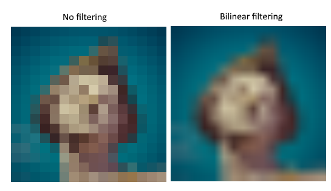
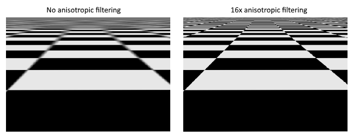
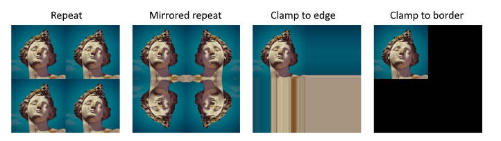

# Vulkan教程4——Texture Mapping


## 1. Images

### 1.1 Introduction

==向我们的应用程序添加纹理将涉及以下步骤==：

- 创建由设备内存支持的图像对象。Create an image object backed by device memory
- 用图像文件中的像素填充它。
- 创建一个图像采样器
- 添加一个组合的图像采样描述符，来从纹理中采样颜色。

我们之前已经使用过image对象，但是这些对象是由交换链扩展自动创建的。这一次我们必须自己创建一个。==创建一个图像并填充数据类似于创建顶点缓冲区==：

- 我们将首先创建一个`staging resource`，并用像素数据填充它，然后将其复制到我们将用于渲染的最终图像对象。
- 尽管可以为此创建一个`staging image`，但Vulkan也允许您将像素从`VkBuffer`复制到`Image`中，而且用于此目的的API，在某些硬件上实际上更快。
- 我们将首先创建这个缓冲区，并用像素值填充它，然后我们将创建一个`Image`来复制像素。创建`Image`与创建`Buffer`没有太大区别。它包括查询内存需求，分配设备内存并绑定它，就像我们以前看到的。

然而，在处理图像时，还有一些额外的东西需要我们注意。==图像可以具有不同的布局，从而影响像素在内存中的组织方式。例如，由于图形硬件的工作方式，简单地逐行存储像素可能无法获得最佳性能==。在对图像`Image`执行任何操作时，必须确保——它们具有在该操作中使用的最佳布局。当我们指定渲染通道时，我们实际上已经看到了其中的一些布局：

- `VK_IMAGE_LAYOUT_PRESENT_SRC_KHR`: Optimal for presentation（最佳展示）
- `VK_IMAGE_LAYOUT_COLOR_ATTACHMENT_OPTIMAL`: Optimal as attachment for writing colors from the fragment shader（最适合作为从片段着色器中写入颜色的附件。）
- `VK_IMAGE_LAYOUT_TRANSFER_SRC_OPTIMAL`: Optimal as source in a transfer operation, like [`vkCmdCopyImageToBuffer`](https://www.khronos.org/registry/vulkan/specs/1.0/man/html/vkCmdCopyImageToBuffer.html)（在传输操作中，作为源最优，如vkCmdCopyImageToBuffer）
- `VK_IMAGE_LAYOUT_TRANSFER_DST_OPTIMAL`: Optimal as destination in a transfer operation, like [`vkCmdCopyBufferToImage`](https://www.khronos.org/registry/vulkan/specs/1.0/man/html/vkCmdCopyBufferToImage.html)（在传输操作中，作为目的地最优）
- `VK_IMAGE_LAYOUT_SHADER_READ_ONLY_OPTIMAL`: Optimal for sampling from a shader（最适合从着色器中取样）

转换图像布局的最常见方法之一是<u>管道屏障</u>`pipeline barrier`。==管道屏障主要用于：同步对资源的访问==，比如确保`Image`在读取之前被写入，但是它们也可以用于转换布局。在本章中，我们将看到管道屏障是如何使用的。当使用``VK_SHARING_MODE_EXCLUSIVE``时，barrier还可以用来转移队列族的所有权。


### 1.2 Image library

有许多库可用于加载图像，您甚至可以编写自己的代码来加载简单的格式，如BMP和PPM。在本教程中，我们将使用来自stb集合（ [stb collection](https://github.com/nothings/stb)）的stb图像库`stb_image library`。它的优点是所有代码都在一个文件中，因此不需要任何复杂的构建配置。下载stb_image.h，并将其存储在一个方便的位置，再将该位置添加到包含路径中。

**Makefile**

Add the directory with stb image.h to the include directories for GCC

```c
VULKAN_SDK_PATH = /home/user/VulkanSDK/x.x.x.x/x86_64
STB_INCLUDE_PATH = /home/user/libraries/stb

...

CFLAGS = -std=c++17 -I$(VULKAN_SDK_PATH)/include -I$(STB_INCLUDE_PATH)
```


### 1.3 Loading an image

像这样包含图像库：

```
#define STB_IMAGE_IMPLEMENTATION
#include <stb_image.h>
```

头文件默认只定义了函数的原型。一个代码文件需要在头中包含`STB_IMAGE_IMPLEMENTATION`定义，以包含函数体，否则我们会得到链接错误。:arrow_up:

```c
void initVulkan() {
    ...
    createCommandPool();
    createTextureImage();
    createVertexBuffer();
    ...
}

...

void createTextureImage() {

}
```

创建一个新函数`createTextureImage`，我们将加载一个图像，并将它上传到`Vulkan image`对象中。我们将使用命令缓冲区，所以它应该在`createCommandPool`之后调用。

在着色器目录旁边，创建一个新的texture目录来存储纹理图像。我们将从那个目录中加载一张名为texture.jpg的图像。用这个库加载图像非常简单：

```c
void createTextureImage() {
    int texWidth, texHeight, texChannels;
    stbi_uc* pixels = stbi_load("textures/texture.jpg", &texWidth, &texHeight, &texChannels, STBI_rgb_alpha);
    VkDeviceSize imageSize = texWidth * texHeight * 4;

    if (!pixels) {
        throw std::runtime_error("failed to load texture image!");
    }
}
```

`stbi_load`函数将文件路径和要加载的通道数量作为参数。`STBI_rgb_alpha`强制为图像加载一个alpha通道，即使它没有。中间的三个参数是图像中通道的宽度、高度和实际数量的输出，返回的指针是像素值数组中的第一个元素。在使用`STBI_rgb_alpha`的情况下，像素以每像素/4字节的方式逐行布局，总共有==texWidth * texHeight * 4==个值。


### 1.4 Staging buffer

我们将在主机的可见内存中创建一个缓冲区，这样我们就可以使用`vkMapMemory`，并将像素复制到它里面。将此临时缓冲区的变量添加到`createTextureImage`函数中

```
VkBuffer stagingBuffer;
VkDeviceMemory stagingBufferMemory;
```

缓冲区`buffer`应该在主机的可见内存中，以便我们可以映射它；它应该可用作一个传输源，以便稍后复制它到一个Image中：

```c
createBuffer(imageSize, VK_BUFFER_USAGE_TRANSFER_SRC_BIT, VK_MEMORY_PROPERTY_HOST_VISIBLE_BIT | VK_MEMORY_PROPERTY_HOST_COHERENT_BIT, stagingBuffer, stagingBufferMemory);
```

然后，我们可以直接将获得的像素值复制到缓冲区中：

```c
void* data;
vkMapMemory(device, stagingBufferMemory, 0, imageSize, 0, &data);
    memcpy(data, pixels, static_cast<size_t>(imageSize));
vkUnmapMemory(device, stagingBufferMemory);
```

不要忘记清理：

```c
stbi_image_free(pixels);
```


### 1.5 Texture Image

虽然我们可以设置着色器来访问缓冲区中的像素值，但是使用Vulkan中的<u>图像对象</u>`image objects`会更好。例如，图像对象允许我们使用2D坐标，从而使检索颜色变得更容易、更快。==图像对象中的像素称为texels==。添加以下新类成员

```c
VkImage textureImage;
VkDeviceMemory textureImageMemory;
```

Image的参数在`VkImageCreateInfo`中指定：

```c
VkImageCreateInfo imageInfo{};
imageInfo.sType = VK_STRUCTURE_TYPE_IMAGE_CREATE_INFO;
imageInfo.imageType = VK_IMAGE_TYPE_2D;
imageInfo.extent.width = static_cast<uint32_t>(texWidth);
imageInfo.extent.height = static_cast<uint32_t>(texHeight);
imageInfo.extent.depth = 1;
imageInfo.mipLevels = 1;
imageInfo.arrayLayers = 1;
```

:arrow_up:图像类型在`imageType`字段中指定，它告诉Vulkan：图像的texel将被处理为哪种坐标系——可以创建1D、2D和3D图像。例如，一维图像可以用来存储一组数据或梯度，二维图像主要用于纹理，而三维图像可以用于存储体素体积。`entent`字段指定了图像的尺寸`dimensions `——其值代表每个轴上有多少texels。这就是为什么深度必须是1而不是0。==纹理现在不是一个数组，所以暂时不会使用mipmapping。==

```c
imageInfo.format = VK_FORMAT_R8G8B8A8_SRGB;
```

Vulkan支持多种可能的图像格式:arrow_up:。

```c
imageInfo.tiling = VK_IMAGE_TILING_OPTIMAL;
```

`tiling`字段有两个值：

- `VK_IMAGE_TILING_LINEAR`：Texels are laid out in row-major order like our `pixels` array
- `VK_IMAGE_TILING_OPTIMAL`： Texels are laid out in an implementation defined order for optimal access

与图像的布局不同，平铺模式`tiling mode`不能在以后更改。如果想要直接访问内存中的图像texels，那么必须使用`VK_IMAGE_TILING_LINEAR`。我们将使用一个staging buffer而不是staging image，因此这是不必要的。所以我们将使用`VK_IMAGE_TILING_OPTIMAL`。

```c
imageInfo.initialLayout = VK_IMAGE_LAYOUT_UNDEFINED;
```

`initialLayout`只有两个可能的值：

- `VK_IMAGE_LAYOUT_UNDEFINED`: Not usable by the GPU and the very first transition will discard the texels.
- `VK_IMAGE_LAYOUT_PREINITIALIZED`: Not usable by the GPU, but the first transition will preserve the texels.

第二种值的使用情况较少，一个代表场景是：使用Staging Image和`tiling`字段的`VK_IMAGE_TILING_LINEAR`。在这种情况下，我们希望将texel数据上传到Staging Image，然后在不丢失数据的情况下将图像转换为传输源。然而，在我们的例子中，我们首先将==图像转换为传输目的地==，然后将texel数据从一个Buffer，复制到它里面，所以我们使用第一个值。

```c
imageInfo.usage = VK_IMAGE_USAGE_TRANSFER_DST_BIT | VK_IMAGE_USAGE_SAMPLED_BIT;
```

`usage`字段与创建缓冲区时的语义相同。图像将被用作缓冲区拷贝的dst，所以它应该被设置为传输目标。我们也希望能够从着色器中访问图像，来为我们的网格着色，所以应该包括`VK_IMAGE_USAGE_SAMPLED_BIT`。

```c
imageInfo.sharingMode = VK_SHARING_MODE_EXCLUSIVE;
```

The image will only be used by one queue family: the one that supports graphics (and therefore also) transfer operations:arrow_up:。​

```c
imageInfo.samples = VK_SAMPLE_COUNT_1_BIT;
imageInfo.flags = 0; // Optional
```

`sample`字段与多采样`multisampling`有关。这只适用于将用作附件的图像，所以请坚持采样一次。有一些与稀疏图像相关的可选标志。==稀疏图像是指只有特定区域有内存支持的图像。例如，如果我们正在为体素地形使用3D纹理，那么可以使用它来避免分配内存，来存储大量的“air”值。我们不会在本教程中使用它，所以让它的默认值为0。==

```c
if (vkCreateImage(device, &imageInfo, nullptr, &textureImage) != VK_SUCCESS) {
    throw std::runtime_error("failed to create image!");
}
```

关于使用不同格式的问题，之后将会讨论。

```c
VkMemoryRequirements memRequirements;
vkGetImageMemoryRequirements(device, textureImage, &memRequirements);

VkMemoryAllocateInfo allocInfo{};
allocInfo.sType = VK_STRUCTURE_TYPE_MEMORY_ALLOCATE_INFO;
allocInfo.allocationSize = memRequirements.size;
allocInfo.memoryTypeIndex = findMemoryType(memRequirements.memoryTypeBits, VK_MEMORY_PROPERTY_DEVICE_LOCAL_BIT);

if (vkAllocateMemory(device, &allocInfo, nullptr, &textureImageMemory) != VK_SUCCESS) {
    throw std::runtime_error("failed to allocate image memory!");
}

vkBindImageMemory(device, textureImage, textureImageMemory, 0);
```

为图像分配内存的工作方式与为缓冲区分配内存的方式完全相同。使用vkGetImageMemoryRequirements代替vkGetBufferMemoryRequirements，使用vkBindImageMemory代替vkBindBufferMemory。

这个函数已经变得相当大了，在后面的章节中需要创建更多的图像，所以我们应该将图像创建抽象为一个`createImage`函数，就像我们对缓冲区所做的那样。创建函数，并将图像对象创建和内存分配移动到该函数：

```c
void createImage(uint32_t width, uint32_t height, VkFormat format, VkImageTiling tiling, VkImageUsageFlags usage, VkMemoryPropertyFlags properties, VkImage& image, VkDeviceMemory& imageMemory) {
    VkImageCreateInfo imageInfo{};
    imageInfo.sType = VK_STRUCTURE_TYPE_IMAGE_CREATE_INFO;
    imageInfo.imageType = VK_IMAGE_TYPE_2D;
    imageInfo.extent.width = width;
    imageInfo.extent.height = height;
    imageInfo.extent.depth = 1;
    imageInfo.mipLevels = 1;
    imageInfo.arrayLayers = 1;
    imageInfo.format = format;
    imageInfo.tiling = tiling;
    imageInfo.initialLayout = VK_IMAGE_LAYOUT_UNDEFINED;
    imageInfo.usage = usage;
    imageInfo.samples = VK_SAMPLE_COUNT_1_BIT;
    imageInfo.sharingMode = VK_SHARING_MODE_EXCLUSIVE;

    if (vkCreateImage(device, &imageInfo, nullptr, &image) != VK_SUCCESS) {
        throw std::runtime_error("failed to create image!");
    }

    VkMemoryRequirements memRequirements;
    vkGetImageMemoryRequirements(device, image, &memRequirements);

    VkMemoryAllocateInfo allocInfo{};
    allocInfo.sType = VK_STRUCTURE_TYPE_MEMORY_ALLOCATE_INFO;
    allocInfo.allocationSize = memRequirements.size;
    allocInfo.memoryTypeIndex = findMemoryType(memRequirements.memoryTypeBits, properties);

    if (vkAllocateMemory(device, &allocInfo, nullptr, &imageMemory) != VK_SUCCESS) {
        throw std::runtime_error("failed to allocate image memory!");
    }

    vkBindImageMemory(device, image, imageMemory, 0);
}
```

`createTextureImage`函数现在可以简化为：

```c
void createTextureImage() {
    int texWidth, texHeight, texChannels;
    stbi_uc* pixels = stbi_load("textures/texture.jpg", &texWidth, &texHeight, &texChannels, STBI_rgb_alpha);
    VkDeviceSize imageSize = texWidth * texHeight * 4;

    if (!pixels) {
        throw std::runtime_error("failed to load texture image!");
    }

    VkBuffer stagingBuffer;
    VkDeviceMemory stagingBufferMemory;
    createBuffer(imageSize, VK_BUFFER_USAGE_TRANSFER_SRC_BIT, VK_MEMORY_PROPERTY_HOST_VISIBLE_BIT | VK_MEMORY_PROPERTY_HOST_COHERENT_BIT, stagingBuffer, stagingBufferMemory);

    void* data;
    vkMapMemory(device, stagingBufferMemory, 0, imageSize, 0, &data);
        memcpy(data, pixels, static_cast<size_t>(imageSize));
    vkUnmapMemory(device, stagingBufferMemory);

    stbi_image_free(pixels);

    createImage(texWidth, texHeight, VK_FORMAT_R8G8B8A8_SRGB, VK_IMAGE_TILING_OPTIMAL, VK_IMAGE_USAGE_TRANSFER_DST_BIT | VK_IMAGE_USAGE_SAMPLED_BIT, VK_MEMORY_PROPERTY_DEVICE_LOCAL_BIT, textureImage, textureImageMemory);
}
```


### 1.6 Layout transitions

现在我们要写的函数，涉及记录`recording`和执行一个命令缓冲区，所以现在是把逻辑转移到一、两个辅助函数的好时机

```c
VkCommandBuffer beginSingleTimeCommands() {
    VkCommandBufferAllocateInfo allocInfo{};
    allocInfo.sType = VK_STRUCTURE_TYPE_COMMAND_BUFFER_ALLOCATE_INFO;
    allocInfo.level = VK_COMMAND_BUFFER_LEVEL_PRIMARY;
    allocInfo.commandPool = commandPool;
    allocInfo.commandBufferCount = 1;

    VkCommandBuffer commandBuffer;
    vkAllocateCommandBuffers(device, &allocInfo, &commandBuffer);

    VkCommandBufferBeginInfo beginInfo{};
    beginInfo.sType = VK_STRUCTURE_TYPE_COMMAND_BUFFER_BEGIN_INFO;
    beginInfo.flags = VK_COMMAND_BUFFER_USAGE_ONE_TIME_SUBMIT_BIT;

    vkBeginCommandBuffer(commandBuffer, &beginInfo);

    return commandBuffer;
}

void endSingleTimeCommands(VkCommandBuffer commandBuffer) {
    vkEndCommandBuffer(commandBuffer);

    VkSubmitInfo submitInfo{};
    submitInfo.sType = VK_STRUCTURE_TYPE_SUBMIT_INFO;
    submitInfo.commandBufferCount = 1;
    submitInfo.pCommandBuffers = &commandBuffer;

    vkQueueSubmit(graphicsQueue, 1, &submitInfo, VK_NULL_HANDLE);
    vkQueueWaitIdle(graphicsQueue);

    vkFreeCommandBuffers(device, commandPool, 1, &commandBuffer);
}
```

这些函数的代码基于copyBuffer中的现有代码。现在可以将函数简化为：

```c
void copyBuffer(VkBuffer srcBuffer, VkBuffer dstBuffer, VkDeviceSize size) {
    VkCommandBuffer commandBuffer = beginSingleTimeCommands();

    VkBufferCopy copyRegion{};
    copyRegion.size = size;
    vkCmdCopyBuffer(commandBuffer, srcBuffer, dstBuffer, 1, &copyRegion);

    endSingleTimeCommands(commandBuffer);
}
```

如果我们仍然使用缓冲区，那么我们现在可以编写一个函数来记录和执行`vkCmdCopyBufferToImage`来完成任务，==但是这个命令要求Image首先处于正确的布局中==。==创建一个新函数来处理布局转换==：

```c
void transitionImageLayout(VkImage image, VkFormat format, VkImageLayout oldLayout, VkImageLayout newLayout) {
    VkCommandBuffer commandBuffer = beginSingleTimeCommands();

    endSingleTimeCommands(commandBuffer);
}
```

执行布局转换的最常见方法之一是使用` image memory barrier`（之前说过）。barrier通常用于同步资源的访问，比如确保对缓冲区的写操作要在读取之前完成，但是当使用`VK_SHARING_MODE_EXCLUSIVE`时，它也可以用于转换图像布局和转移队列家的所有权。There is an equivalent *buffer memory barrier* to do this for buffers：

```c
VkImageMemoryBarrier barrier{};
barrier.sType = VK_STRUCTURE_TYPE_IMAGE_MEMORY_BARRIER;
barrier.oldLayout = oldLayout;
barrier.newLayout = newLayout;
```

前两个字段指定布局转换。如果您不关心图像的现有内容，可以使用`VK_IMAGE_LAYOUT_UNDEFINED`作为oldLayout:arrow_up:。

```c
barrier.srcQueueFamilyIndex = VK_QUEUE_FAMILY_IGNORED;
barrier.dstQueueFamilyIndex = VK_QUEUE_FAMILY_IGNORED;
```

如果您使用barrier来转移队列族的所有权，那么这两个字段应该是队列家族的索引。如果不想这样做，就必须将它们设置为`VK_QUEUE_FAMILY_IGNORED`（==不是默认值==）:arrow_up:

```c
barrier.image = image;
barrier.subresourceRange.aspectMask = VK_IMAGE_ASPECT_COLOR_BIT;
barrier.subresourceRange.baseMipLevel = 0;
barrier.subresourceRange.levelCount = 1;
barrier.subresourceRange.baseArrayLayer = 0;
barrier.subresourceRange.layerCount = 1;
```

`Image`和子资源范围`subresourceRange`指定受影响的图像和图像的特定部分。我们的图像不是数组，也没有mipmapping级别，因此只指定了一个级别和层。

```c
barrier.srcAccessMask = 0; // TODO
barrier.dstAccessMask = 0; // TODO
```

barrier主要用于同步，因此您必须指定：哪些涉及资源的操作类型必须在barrier之前发生，以及哪些操作必须等待barrier。尽管我们已经使用`vkQueueWaitIdle`来手动同步，但我们仍然需要这样做。正确的值取决于新旧布局，所以一旦我们弄清楚要使用哪些过渡，我们就会回到这个问题上。:arrow_up:

```c
vkCmdPipelineBarrier(
    commandBuffer,
    0 /* TODO */, 0 /* TODO */,
    0,
    0, nullptr,
    0, nullptr,
    1, &barrier
);
```

所有类型的`PipelineBarrier`都使用相同的函数提交。命令缓冲区之后的==第一个参数==指定：应该在barrier之前执行的操作发生在哪个管道阶段。==第二个参数==指定：等待barrier的操作发生在哪个管道阶段。管道阶段（允许在屏障前后指定）取决于：在barrier前后如何使用资源。例如，如果我们需要在屏障前访问Uniform，则指定`VK_ACCESS_UNIFORM_READ_BIT`（具体这部分看教程，没怎么搞懂其语言逻辑）。当你指定的管道阶段与使用类型不匹配时，验证层会警告你。==第三个参数==是0，或者`VK_DEPENDENCY_BY_REGION_BIT`。后者将屏障`barrier`转换为`per-region condition`。例如，这意味着允许实现已经开始读取到目前为止已写入的资源部分。例如，这意味着：允许从已经写了的部分中开始读取。

==最后三对参数==引用三种可用类型的管道屏障数组：内存屏障`memory barriers`、缓冲区内存屏障`buffer memory barriers`和我们这里使用的图像内存屏障` image memory barriers`。请注意，我们还没有使用`VkFormat`参数，但我们将在深度缓冲区一章中使用它来处理特殊的转换。


### 1.7 Copying buffer to image

在回到`createTextureImage`之前，我们将再编写一个辅助函数：`copyBufferToImage`

```c
void copyBufferToImage(VkBuffer buffer, VkImage image, uint32_t width, uint32_t height) {
    VkCommandBuffer commandBuffer = beginSingleTimeCommands();

    endSingleTimeCommands(commandBuffer);
}
```

就像缓冲区拷贝（copy）一样，您需要指定：缓冲区的哪一部分将被复制到图像的哪一部分。这是通过`VkBufferImageCopy`结构体实现的：

```c
VkBufferImageCopy region{};
region.bufferOffset = 0;
region.bufferRowLength = 0;
region.bufferImageHeight = 0;

region.imageSubresource.aspectMask = VK_IMAGE_ASPECT_COLOR_BIT;
region.imageSubresource.mipLevel = 0;
region.imageSubresource.baseArrayLayer = 0;
region.imageSubresource.layerCount = 1;

region.imageOffset = {0, 0, 0};
region.imageExtent = {
    width,
    height,
    1
};
```

:arrow_up:这些字段大多数都是不言自明的。`bufferOffset`指定像素值开始处的缓冲区的字节偏移量。`bufferRowLength`和`bufferImageHeight`字段指定像素在内存中的布局方式。例如，在图像的行之间可以有一些填充字节`padding bytes `。为两者指定0：表示像素被紧密地打包（packed）。imageSubresource、imageOffset和imageExtent字段表示：我们希望将像素复制到图像的哪一部分。

复制操作使用`vkCmdCopyBufferToImage`函数：

```c
vkCmdCopyBufferToImage(
    commandBuffer,
    buffer,
    image,
    VK_IMAGE_LAYOUT_TRANSFER_DST_OPTIMAL,
    1,
    &region
);
```

第四个参数表示==图像当前使用的布局==。我在这里假设——==图像已经转换到最适合复制像素的布局==。现在我们只将一块像素复制到整个图像，但是可以指定一个`VkBufferImageCopy数组`来在一个操作中，根据这个缓冲区，对图像执行许多不同的复制。


### 1.8 Preparing the texture image

现在我们有了完成纹理图像设置所需的所有工具，所以回到`createTextureImage`函数。我们做的最后一件事是创建纹理图像。下一步是将Staging缓冲区复制到纹理图像。这包括两个步骤：

- Transition the texture image to `VK_IMAGE_LAYOUT_TRANSFER_DST_OPTIMAL`
- 执行缓冲区到图像的复制操作

对于我们刚刚创建的函数来说，这很容易做到：

```c
transitionImageLayout(textureImage, VK_FORMAT_R8G8B8A8_SRGB, VK_IMAGE_LAYOUT_UNDEFINED, VK_IMAGE_LAYOUT_TRANSFER_DST_OPTIMAL);
copyBufferToImage(stagingBuffer, textureImage, static_cast<uint32_t>(texWidth), static_cast<uint32_t>(texHeight));
```

图像是用`VK_IMAGE_LAYOUT_UNDEFINED`创建的，所以在transition textureImage时，应该指定为旧布局。记住，我们可以这样做，是因为我们在执行复制操作之前并不关心它的内容。

我们需要最后一次过渡，为着色器访问做准备：

```c
transitionImageLayout(textureImage, VK_FORMAT_R8G8B8A8_SRGB, VK_IMAGE_LAYOUT_TRANSFER_DST_OPTIMAL, VK_IMAGE_LAYOUT_SHADER_READ_ONLY_OPTIMAL);
```


### 1.9 Transition barrier masks

如果运行应用程序，那么将看到它报告`transitionImageLayout`中的访问掩码`access masks`和管道阶段是无效的。我们仍然需要根据转换中的布局来设置这些。

我们需要处理两种转换：

- ==Undefined → transfer destination==: transfer writes that don't need to wait on anything（**转移**不需要等待任何东西的**写**）
- ==Transfer destination → shader reading==: shader reads should wait on transfer writes, specifically the shader reads in the fragment shader, because that's where we're going to use the texture。

使用以下访问掩码和管道阶段，来指定这些规则:

```c
VkPipelineStageFlags sourceStage;
VkPipelineStageFlags destinationStage;

if (oldLayout == VK_IMAGE_LAYOUT_UNDEFINED && newLayout == VK_IMAGE_LAYOUT_TRANSFER_DST_OPTIMAL) {
    barrier.srcAccessMask = 0;
    barrier.dstAccessMask = VK_ACCESS_TRANSFER_WRITE_BIT;

    sourceStage = VK_PIPELINE_STAGE_TOP_OF_PIPE_BIT;
    destinationStage = VK_PIPELINE_STAGE_TRANSFER_BIT;
} else if (oldLayout == VK_IMAGE_LAYOUT_TRANSFER_DST_OPTIMAL && newLayout == VK_IMAGE_LAYOUT_SHADER_READ_ONLY_OPTIMAL) {
    barrier.srcAccessMask = VK_ACCESS_TRANSFER_WRITE_BIT;
    barrier.dstAccessMask = VK_ACCESS_SHADER_READ_BIT;

    sourceStage = VK_PIPELINE_STAGE_TRANSFER_BIT;
    destinationStage = VK_PIPELINE_STAGE_FRAGMENT_SHADER_BIT;
} else {
    throw std::invalid_argument("unsupported layout transition!");
}

vkCmdPipelineBarrier(
    commandBuffer,
    sourceStage, destinationStage,
    0,
    0, nullptr,
    0, nullptr,
    1, &barrier
);
```

从上述表格中可以看出，传输写入必须发生在管道传输阶段。由于写入不需要等待任何东西，所以可以指定一个空的访问掩码和最早的管道阶段`VK_PIPELINE_STAGE_TOP_OF_PIPE_BIT`来进行 pre-barrier operation。需要注意的是，`VK_PIPELINE_STAGE_TRANSFER_BIT`并不是图形和计算管道中的真实阶段。它更像是一个发生传输的伪阶段。更多信息和其他伪阶段的例子请看文档—— [the documentation](https://www.khronos.org/registry/vulkan/specs/1.1-extensions/man/html/VkPipelineStageFlagBits.html)。

图像将在相同的管道阶段被写入，随后由片段着色器读取，这就是为什么我们指定对片段着色器管道阶段的着色器进行读取访问。如果在将来需要做更多的转换，那么我们将扩展这个函数。应用程序现在应该可以成功运行了，尽管还没有出现任何视觉上的变化。

需要注意的一点是，命令缓冲区提交在开始时导致隐式的`VK_ACCESS_HOST_WRITE_BIT`同步。由于transitionImageLayout函数只执行一个命令缓冲区，所以如果在布局转换中需要`VK_ACCESS_HOST_WRITE_BIT`依赖关系，可以使用这个隐式同步并将`srcAccessMask`设置为0。

==实际上有一种特殊类型的图像布局支持所有操作==，即`VK_IMAGE_LAYOUT_GENERAL`。当然，它的问题在于——它不一定能为所有操作提供最佳的性能。在某些特殊情况下，比如同时使用图像作为输入和输出，或者在==图像==离开预先初始化的布局后，==读取图像时==，它是必需的。

到目前为止，所有提交命令的helper函数都被设置为——==通过等待队列变为空闲，来同步执行==。对于实际应用程序，==建议将这些操作合并到单个命令缓冲区中==，并异步执行它们以获得更高的吞吐量，特别是createTextureImage函数中的转换和复制。

试着做个实验，创建一个`setupCommandBuffer`，让辅助函数（help）把命令记录到里面，然后添加一个`flushSetupCommands`来执行目前已经记录的命令。最好在纹理贴图工作后再做这个工作，以检查纹理资源是否正确设置。


### 1.10 Cleanup

最后通过清理Staging缓冲区及其内存，来完成`createTextureImage`函数：

```c
    transitionImageLayout(textureImage, VK_FORMAT_R8G8B8A8_SRGB, VK_IMAGE_LAYOUT_TRANSFER_DST_OPTIMAL, VK_IMAGE_LAYOUT_SHADER_READ_ONLY_OPTIMAL);

    vkDestroyBuffer(device, stagingBuffer, nullptr);
    vkFreeMemory(device, stagingBufferMemory, nullptr);
}
```

主纹理图像被使用，直到程序结束：

```c
void cleanup() {
    cleanupSwapChain();

    vkDestroyImage(device, textureImage, nullptr);
    vkFreeMemory(device, textureImageMemory, nullptr);

    ...
}
```

图像现在包含了纹理，但是我们仍然需要一种==从图形管道访问它的方法==。我们将在下一章讨论这个问题。


## 2. Image view and sampler

在本章中，我们将再创建两个资源，这两个资源是图形流水线对图像进行采样所需要的。第一个资源在处理交换链图像时，已经见过，但第二个资源是新的——它涉及到着色器如何从图像中读取`texels`。

### 2.1 Texture image view

我们之前已经看到，with the swap chain images and the framebuffer，图像是通过图像视图，而不是直接访问的。因此我们需要为纹理图像创建这样一个图像视图`Image View`。

添加一个类成员，来为纹理图像保存一个`VkImageView`，并创建一个新的函数`createTextureImageView`，我们将在那里创建它：

```c
VkImageView textureImageView;

...

void initVulkan() {
    ...
    createTextureImage();
    createTextureImageView();
    createVertexBuffer();
    ...
}

...

void createTextureImageView() {

}
```

这个函数直接基于`createImageViews`。需要更改是`format`和`Image`：

```c
VkImageViewCreateInfo viewInfo{};
viewInfo.sType = VK_STRUCTURE_TYPE_IMAGE_VIEW_CREATE_INFO;
viewInfo.image = textureImage;
viewInfo.viewType = VK_IMAGE_VIEW_TYPE_2D;
viewInfo.format = VK_FORMAT_R8G8B8A8_SRGB;
viewInfo.subresourceRange.aspectMask = VK_IMAGE_ASPECT_COLOR_BIT;
viewInfo.subresourceRange.baseMipLevel = 0;
viewInfo.subresourceRange.levelCount = 1;
viewInfo.subresourceRange.baseArrayLayer = 0;
viewInfo.subresourceRange.layerCount = 1;
```

我省略了显式的`viewInfo.component`的初始化，因为`VK_COMPONENT_SWIZZLE_IDENTITY`总是被定义为0。通过调用`vkCreateImageView`完成图像视图的创建。

```c
if (vkCreateImageView(device, &viewInfo, nullptr, &textureImageView) != VK_SUCCESS) {
    throw std::runtime_error("failed to create texture image view!");
}
```

因为很多逻辑是从`createImageViews`中复制的，所以您可能希望将其抽象为一个新的`createImageView`函数：

```c
VkImageView createImageView(VkImage image, VkFormat format) {
    VkImageViewCreateInfo viewInfo{};
    viewInfo.sType = VK_STRUCTURE_TYPE_IMAGE_VIEW_CREATE_INFO;
    viewInfo.image = image;
    viewInfo.viewType = VK_IMAGE_VIEW_TYPE_2D;
    viewInfo.format = format;
    viewInfo.subresourceRange.aspectMask = VK_IMAGE_ASPECT_COLOR_BIT;
    viewInfo.subresourceRange.baseMipLevel = 0;
    viewInfo.subresourceRange.levelCount = 1;
    viewInfo.subresourceRange.baseArrayLayer = 0;
    viewInfo.subresourceRange.layerCount = 1;

    VkImageView imageView;
    if (vkCreateImageView(device, &viewInfo, nullptr, &imageView) != VK_SUCCESS) {
        throw std::runtime_error("failed to create texture image view!");
    }

    return imageView;
}
```

`createTextureImageView`函数现在可以简化为：

```c
void createTextureImageView() {
    textureImageView = createImageView(textureImage, VK_FORMAT_R8G8B8A8_SRGB);
}
```

`createImageViews`可以简化为：

```c
void createImageViews() {
    swapChainImageViews.resize(swapChainImages.size());

    for (uint32_t i = 0; i < swapChainImages.size(); i++) {
        swapChainImageViews[i] = createImageView(swapChainImages[i], swapChainImageFormat);
    }
}
```

确保在程序结束时销毁Image View，就在销毁图像本身之前：

```c
void cleanup() {
    cleanupSwapChain();

    vkDestroyImageView(device, textureImageView, nullptr);

    vkDestroyImage(device, textureImage, nullptr);
    vkFreeMemory(device, textureImageMemory, nullptr);
```


### 2.2 Samplers

着色器可以直接从图像中读取texels，但当它们被用作纹理时，这并不常见。纹理通常是通过采样器访问的，采样器会应用过滤和变换`filtering and transformations`来计算检索到的最终颜色。



==采样不足则是相反的问题，即纹理多于片段==。这将导致在以锐角采样高频模式，如棋盘纹理时，产生伪影



如上左图所示，纹理在远处变得模糊混乱。解决这个问题的方法是各向异性滤波 [anisotropic filtering](https://en.wikipedia.org/wiki/Anisotropic_filtering)，==它也可以通过采样器自动应用==。除了这些过滤器之外，采样器还可以处理转换。:arrow_down:



现在我们将创建一个函数`createTextureSampler`，来设置这样一个采样器对象。稍后我们将使用采样器，从着色器的纹理中读取颜色。

```c
void initVulkan() {
    ...
    createTextureImage();
    createTextureImageView();
    createTextureSampler();
    ...
}

...

void createTextureSampler() {

}
```

采样器是通过`VkSamplerCreateInfo`结构配置的，该结构指定了：它应该使用的所有过滤器和转换。

```c
VkSamplerCreateInfo samplerInfo{};
samplerInfo.sType = VK_STRUCTURE_TYPE_SAMPLER_CREATE_INFO;
samplerInfo.magFilter = VK_FILTER_LINEAR;
samplerInfo.minFilter = VK_FILTER_LINEAR;
```

