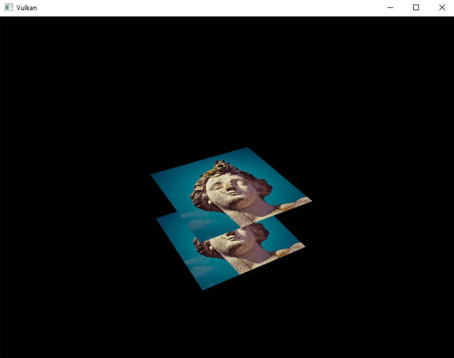

# Vlkan教程5——Depth buffering

### 1. 3D geometry

将顶点结构改为使用3D向量作为位置，并更新相应的`VkVertexInputAttributeDescription`中的格式。

```c
struct Vertex {
    glm::vec3 pos;
    glm::vec3 color;
    glm::vec2 texCoord;

    ...

    static std::array<VkVertexInputAttributeDescription, 3> getAttributeDescriptions() {
        std::array<VkVertexInputAttributeDescription, 3> attributeDescriptions{};

        attributeDescriptions[0].binding = 0;
        attributeDescriptions[0].location = 0;
        attributeDescriptions[0].format = VK_FORMAT_R32G32B32_SFLOAT;
        attributeDescriptions[0].offset = offsetof(Vertex, pos);

        ...
    }
};
```

接下来，更新顶点着色器以接受并转换3D坐标作为输入。不要忘记之后重新编译它

```c
layout(location = 0) in vec3 inPosition;

...

void main() {
    gl_Position = ubo.proj * ubo.view * ubo.model * vec4(inPosition, 1.0);
    fragColor = inColor;
    fragTexCoord = inTexCoord;
}
```

最后，更新顶点容器以包含Z坐标

```c
const std::vector<Vertex> vertices = {
    {{-0.5f, -0.5f, 0.0f}, {1.0f, 0.0f, 0.0f}, {0.0f, 0.0f}},
    {{0.5f, -0.5f, 0.0f}, {0.0f, 1.0f, 0.0f}, {1.0f, 0.0f}},
    {{0.5f, 0.5f, 0.0f}, {0.0f, 0.0f, 1.0f}, {1.0f, 1.0f}},
    {{-0.5f, 0.5f, 0.0f}, {1.0f, 1.0f, 1.0f}, {0.0f, 1.0f}},

    {{-0.5f, -0.5f, -0.5f}, {1.0f, 0.0f, 0.0f}, {0.0f, 0.0f}},
    {{0.5f, -0.5f, -0.5f}, {0.0f, 1.0f, 0.0f}, {1.0f, 0.0f}},
    {{0.5f, 0.5f, -0.5f}, {0.0f, 0.0f, 1.0f}, {1.0f, 1.0f}},
    {{-0.5f, 0.5f, -0.5f}, {1.0f, 1.0f, 1.0f}, {0.0f, 1.0f}}
};

const std::vector<uint16_t> indices = {
    0, 1, 2, 2, 3, 0,
    4, 5, 6, 6, 7, 4
};
```

==深度缓冲区是为每个位置存储深度的附加附件，就像颜色附件存储每个位置的颜色一样==。每次光栅化器产生片段时，深度测试将检查新片段是否比前一个片段更近。如果不是，则丢弃新的片段。通过深度测试的片段将自己的深度写入深度缓冲区。可以从片段着色器中操纵这个值，就像你可以操纵颜色输出一样。

```c
#define GLM_FORCE_RADIANS
#define GLM_FORCE_DEPTH_ZERO_TO_ONE
#include <glm/glm.hpp>
#include <glm/gtc/matrix_transform.hpp>
```


### 2. Depth image and view

深度附件`depth attachment`是基于图像的，就像颜色附件一样。不同之处在于：交换链不会自动为我们创建深度图像。我们只需要一个深度图像，因为一次只运行一个绘制操作。深度图像将再次需要三种资源：image, memory and image view.

```c
VkImage depthImage;
VkDeviceMemory depthImageMemory;
VkImageView depthImageView;
```

创建一个新函数`createDepthResources`来设置这些资源

```c
void initVulkan() {
    ...
    createCommandPool();
    createDepthResources();
    createTextureImage();
    ...
}

...

void createDepthResources() {

}
```

创建一个深度图像是相当直接的。唯一的问题是：深度图像的正确格式是什么？该格式必须包含深度组件，indicated by _D??_ in the VK_FORMAT_。

与纹理图像不同，我们不需要特定的格式，因为我们不会直接从程序中访问纹理。它只需要有一个合理的精度，至少24位。有几种格式可以满足这一需求：

- `VK_FORMAT_D32_SFLOAT`: 32-bit float for depth
- `VK_FORMAT_D32_SFLOAT_S8_UINT`: 32-bit signed float for depth and 8 bit stencil component
- `VK_FORMAT_D24_UNORM_S8_UINT`: 24-bit float for depth and 8 bit stencil component

我们可以简单地选择`VK_FORMAT_D32_SFLOAT`格式，因为对它的支持是非常普遍的(参见硬件数据库)，但在可能的情况下，为我们的应用程序增加一些额外的灵活性也是不错的。我们要写一个函数`findSupportedFormat`，它按照从最需要到最不需要的顺序接收一个候选格式列表，并检查哪个是第一个被支持的格式。

```c
VkFormat findSupportedFormat(const std::vector<VkFormat>& candidates, VkImageTiling tiling, VkFormatFeatureFlags features) {

}
```

格式的支持取决于`tiling mode`和`usage`，因此还必须将它们作为参数。可以使用`vkGetPhysicalDeviceFormatProperties`函数查询格式支持

```c
for (VkFormat format : candidates) {
    VkFormatProperties props;
    vkGetPhysicalDeviceFormatProperties(physicalDevice, format, &props);
}
```

`VkFormatProperties`结构体包含三个字段：

- `linearTilingFeatures`: Use cases that are supported with linear tiling
- `optimalTilingFeatures`: Use cases that are supported with optimal tiling
- `bufferFeatures`: Use cases that are supported for buffers

```c
if (tiling == VK_IMAGE_TILING_LINEAR && (props.linearTilingFeatures & features) == features) {
    return format;
} else if (tiling == VK_IMAGE_TILING_OPTIMAL && (props.optimalTilingFeatures & features) == features) {
    return format;
}
```

如果所有候选格式都不支持，那么我们可以返回一个特殊值或抛出一个异常

```c
VkFormat findSupportedFormat(const std::vector<VkFormat>& candidates, VkImageTiling tiling, VkFormatFeatureFlags features) {
    for (VkFormat format : candidates) {
        VkFormatProperties props;
        vkGetPhysicalDeviceFormatProperties(physicalDevice, format, &props);

        if (tiling == VK_IMAGE_TILING_LINEAR && (props.linearTilingFeatures & features) == features) {
            return format;
        } else if (tiling == VK_IMAGE_TILING_OPTIMAL && (props.optimalTilingFeatures & features) == features) {
            return format;
        }
    }

    throw std::runtime_error("failed to find supported format!");
}
```

现在，我们将使用这个函数来创建一个`findDepthFormat`函数：

```c
VkFormat findDepthFormat() {
    return findSupportedFormat(
        {VK_FORMAT_D32_SFLOAT, VK_FORMAT_D32_SFLOAT_S8_UINT, VK_FORMAT_D24_UNORM_S8_UINT},
        VK_IMAGE_TILING_OPTIMAL,
        VK_FORMAT_FEATURE_DEPTH_STENCIL_ATTACHMENT_BIT
    );
}
```

添加一个简单的辅助函数，判断所选的深度格式是否包含stencil component。

```c
bool hasStencilComponent(VkFormat format) {
    return format == VK_FORMAT_D32_SFLOAT_S8_UINT || format == VK_FORMAT_D24_UNORM_S8_UINT;
}
```

```
VkFormat depthFormat = findDepthFormat();
```

现在我们有了调用`createImage`和`createImageView`函数所需的所有信息：

```c
createImage(swapChainExtent.width, swapChainExtent.height, depthFormat, VK_IMAGE_TILING_OPTIMAL, VK_IMAGE_USAGE_DEPTH_STENCIL_ATTACHMENT_BIT, VK_MEMORY_PROPERTY_DEVICE_LOCAL_BIT, depthImage, depthImageMemory);
depthImageView = createImageView(depthImage, depthFormat);
```

但是，目前`createImageView`函数假设子资源总是`VK_IMAGE_ASPECT_COLOR_BIT`，所以我们需要将该字段变成一个参数：

```c
VkImageView createImageView(VkImage image, VkFormat format, VkImageAspectFlags aspectFlags) {
    ...
    viewInfo.subresourceRange.aspectMask = aspectFlags;
    ...
}
```

更新对该函数的所有调用：

```c
swapChainImageViews[i] = createImageView(swapChainImages[i], swapChainImageFormat, VK_IMAGE_ASPECT_COLOR_BIT);
...
depthImageView = createImageView(depthImage, depthFormat, VK_IMAGE_ASPECT_DEPTH_BIT);
...
textureImageView = createImageView(textureImage, VK_FORMAT_R8G8B8A8_SRGB, VK_IMAGE_ASPECT_COLOR_BIT);
```

这就是创建深度图像的方法。


### 3. Explicitly transitioning the depth image

我们不需要显式地将图像的布局转换为深度附件，因为我们将在渲染传递中处理这个问题。然而，为了完整起见，我仍将在本节中描述该过程。如果你愿意，可以跳过它。

在`createDepthResources`函数的末尾调用`transitionImageLayout`

```c
transitionImageLayout(depthImage, depthFormat, VK_IMAGE_LAYOUT_UNDEFINED, VK_IMAGE_LAYOUT_DEPTH_STENCIL_ATTACHMENT_OPTIMAL);
```

未定义的布局可以用作初始布局，因为不存在现有的深度图像内容。我们需要更新`transitionImageLayout`中的一些逻辑，以使用正确的子资源方面

```c
if (newLayout == VK_IMAGE_LAYOUT_DEPTH_STENCIL_ATTACHMENT_OPTIMAL) {
    barrier.subresourceRange.aspectMask = VK_IMAGE_ASPECT_DEPTH_BIT;

    if (hasStencilComponent(format)) {
        barrier.subresourceRange.aspectMask |= VK_IMAGE_ASPECT_STENCIL_BIT;
    }
} else {
    barrier.subresourceRange.aspectMask = VK_IMAGE_ASPECT_COLOR_BIT;
}
```

虽然我们没有使用模板组件，但我们确实需要在深度图像的布局转换中包含它。最后，添加正确的访问掩码和管道阶段

```c
if (oldLayout == VK_IMAGE_LAYOUT_UNDEFINED && newLayout == VK_IMAGE_LAYOUT_TRANSFER_DST_OPTIMAL) {
    barrier.srcAccessMask = 0;
    barrier.dstAccessMask = VK_ACCESS_TRANSFER_WRITE_BIT;

    sourceStage = VK_PIPELINE_STAGE_TOP_OF_PIPE_BIT;
    destinationStage = VK_PIPELINE_STAGE_TRANSFER_BIT;
} else if (oldLayout == VK_IMAGE_LAYOUT_TRANSFER_DST_OPTIMAL && newLayout == VK_IMAGE_LAYOUT_SHADER_READ_ONLY_OPTIMAL) {
    barrier.srcAccessMask = VK_ACCESS_TRANSFER_WRITE_BIT;
    barrier.dstAccessMask = VK_ACCESS_SHADER_READ_BIT;

    sourceStage = VK_PIPELINE_STAGE_TRANSFER_BIT;
    destinationStage = VK_PIPELINE_STAGE_FRAGMENT_SHADER_BIT;
} else if (oldLayout == VK_IMAGE_LAYOUT_UNDEFINED && newLayout == VK_IMAGE_LAYOUT_DEPTH_STENCIL_ATTACHMENT_OPTIMAL) {
    barrier.srcAccessMask = 0;
    barrier.dstAccessMask = VK_ACCESS_DEPTH_STENCIL_ATTACHMENT_READ_BIT | VK_ACCESS_DEPTH_STENCIL_ATTACHMENT_WRITE_BIT;

    sourceStage = VK_PIPELINE_STAGE_TOP_OF_PIPE_BIT;
    destinationStage = VK_PIPELINE_STAGE_EARLY_FRAGMENT_TESTS_BIT;
} else {
    throw std::invalid_argument("unsupported layout transition!");
}
```

深度缓冲区将被读取以执行深度测试，以确定一个片段是否可见，并将在绘制一个新的片段时被写入。读取发生在	`VK_PIPELINE_STAGE_EARLY_FRAGMENT_TESTS_BIT`阶段，写入发生在`VK_PIPELINE_STAGE_LATE_FRAGMENT_TESTS_BIT`。你应该选取==与指定操作相匹配的、最早的==管道阶段，这样在需要时，就可以作为深度附件使用。


### 4. Render pass

我们现在要修改`createRenderPass`以包含一个深度附件。首先指定`VkAttachmentDescription`

```c
VkAttachmentDescription depthAttachment{};
depthAttachment.format = findDepthFormat();
depthAttachment.samples = VK_SAMPLE_COUNT_1_BIT;
depthAttachment.loadOp = VK_ATTACHMENT_LOAD_OP_CLEAR;
depthAttachment.storeOp = VK_ATTACHMENT_STORE_OP_DONT_CARE;
depthAttachment.stencilLoadOp = VK_ATTACHMENT_LOAD_OP_DONT_CARE;
depthAttachment.stencilStoreOp = VK_ATTACHMENT_STORE_OP_DONT_CARE;
depthAttachment.initialLayout = VK_IMAGE_LAYOUT_UNDEFINED;
depthAttachment.finalLayout = VK_IMAGE_LAYOUT_DEPTH_STENCIL_ATTACHMENT_OPTIMAL;
```

格式应该和深度图本身一样。这次我们不关心存储深度数据(storeOp)，因为在绘制完成后不会使用它。这样可以让硬件进行额外的优化。就像颜色缓冲区一样，我们不关心之前的深度内容，所以我们可以使用`VK_IMAGE_LAYOUT_UNDEFINED`作为初始Layout。

```c
VkAttachmentReference depthAttachmentRef{};
depthAttachmentRef.attachment = 1;
depthAttachmentRef.layout = VK_IMAGE_LAYOUT_DEPTH_STENCIL_ATTACHMENT_OPTIMAL;
```

为第一个(也是唯一的)子传递添加对附件的引用：

```c
VkSubpassDescription subpass{};
subpass.pipelineBindPoint = VK_PIPELINE_BIND_POINT_GRAPHICS;
subpass.colorAttachmentCount = 1;
subpass.pColorAttachments = &colorAttachmentRef;
subpass.pDepthStencilAttachment = &depthAttachmentRef;
```

==与颜色附件不同，子通道只能使用单一的深度(+模板)附件。在多个缓冲区上进行深度测试没有任何意义。==

```c
std::array<VkAttachmentDescription, 2> attachments = {colorAttachment, depthAttachment};
VkRenderPassCreateInfo renderPassInfo{};
renderPassInfo.sType = VK_STRUCTURE_TYPE_RENDER_PASS_CREATE_INFO;
renderPassInfo.attachmentCount = static_cast<uint32_t>(attachments.size());
renderPassInfo.pAttachments = attachments.data();
renderPassInfo.subpassCount = 1;
renderPassInfo.pSubpasses = &subpass;
renderPassInfo.dependencyCount = 1;
renderPassInfo.pDependencies = &dependency;
```

接下来，更新`VkRenderPassCreateInfo`结构以引用两个附件:arrow_up:。

```c
dependency.srcStageMask = VK_PIPELINE_STAGE_COLOR_ATTACHMENT_OUTPUT_BIT | VK_PIPELINE_STAGE_EARLY_FRAGMENT_TESTS_BIT;
dependency.dstStageMask = VK_PIPELINE_STAGE_COLOR_ATTACHMENT_OUTPUT_BIT | VK_PIPELINE_STAGE_EARLY_FRAGMENT_TESTS_BIT;
dependency.dstAccessMask = VK_ACCESS_COLOR_ATTACHMENT_WRITE_BIT | VK_ACCESS_DEPTH_STENCIL_ATTACHMENT_WRITE_BIT;
```


### 5. Framebuffer

下一步是修改framebuffer创建，将深度图像与深度附件绑定。进入createFramebuffers，指定深度图像视图为第二附件。

```c
std::array<VkImageView, 2> attachments = {
    swapChainImageViews[i],
    depthImageView
};

VkFramebufferCreateInfo framebufferInfo{};
framebufferInfo.sType = VK_STRUCTURE_TYPE_FRAMEBUFFER_CREATE_INFO;
framebufferInfo.renderPass = renderPass;
framebufferInfo.attachmentCount = static_cast<uint32_t>(attachments.size());
framebufferInfo.pAttachments = attachments.data();
framebufferInfo.width = swapChainExtent.width;
framebufferInfo.height = swapChainExtent.height;
framebufferInfo.layers = 1;
```

每个交换链图像的颜色连接是不同的，但是相同的深度图像可以被所有的交换链图像使用，因为由于我们的信号量，只有一个子通道在同一时间运行。您还需要将调用移动到createFramebuffers，以确保它在深度图像视图实际创建之后被调用。

```c
void initVulkan() {
    ...
    createDepthResources();
    createFramebuffers();
    ...
}
```


### 6. Clear values

因为我们现在有多个附件的`VK_ATTACHMENT_LOAD_OP_CLEAR`，所以我们还需要指定多个清除值。进入`createCommandBuffers`，创建一个`VkClearValue`结构的数组。

```c
std::array<VkClearValue, 2> clearValues{};
clearValues[0].color = {0.0f, 0.0f, 0.0f, 1.0f};
clearValues[1].depthStencil = {1.0f, 0};

renderPassInfo.clearValueCount = static_cast<uint32_t>(clearValues.size());
renderPassInfo.pClearValues = clearValues.data();
```

注意clearValues的顺序应该与附件的顺序相同。


### 7. Depth and stencil state

深度附件现在已经准备好使用了，但是深度测试仍然需要在图形管道中启用。它是通过`VkPipelineDepthStencilStateCreateInfo`结构配置的

```c
VkPipelineDepthStencilStateCreateInfo depthStencil{};
depthStencil.sType = VK_STRUCTURE_TYPE_PIPELINE_DEPTH_STENCIL_STATE_CREATE_INFO;
depthStencil.depthTestEnable = VK_TRUE;
depthStencil.depthWriteEnable = VK_TRUE;
```

`depthTestEnable`字段指定是否应该将新片段的深度与深度缓冲区进行比较，以确定是否应该丢弃它们。`depthWriteEnable`字段指定是否应该将通过深度测试的片段的新深度写入深度缓冲区。

```c
depthStencil.depthCompareOp = VK_COMPARE_OP_LESS;
```

```c
depthStencil.depthBoundsTestEnable = VK_FALSE;
depthStencil.minDepthBounds = 0.0f; // Optional
depthStencil.maxDepthBounds = 1.0f; // Optional
```

depthBoundsTestEnable、minDepthBounds和maxDepthBounds字段用于可选的深度绑定测试。这允许只保留在指定深度范围内的片段。我们不会使用这个功能:arrow_up:。

```c
depthStencil.stencilTestEnable = VK_FALSE;
depthStencil.front = {}; // Optional
depthStencil.back = {}; // Optional
```

```c
pipelineInfo.pDepthStencilState = &depthStencil;
```

更新`VkGraphicsPipelineCreateInfo`结构。A depth stencil state must always be specified if the render pass contains a depth stencil attachment。




### 8. Handling window resize

当窗口被调整大小以匹配新的颜色附件分辨率时，深度缓冲区的分辨率应该改变。在这种情况下，扩展`recreateSwapChain`函数以重新创建深度资源

```c
void recreateSwapChain() {
    int width = 0, height = 0;
    while (width == 0 || height == 0) {
        glfwGetFramebufferSize(window, &width, &height);
        glfwWaitEvents();
    }

    vkDeviceWaitIdle(device);

    cleanupSwapChain();

    createSwapChain();
    createImageViews();
    createRenderPass();
    createGraphicsPipeline();
    createDepthResources();
    createFramebuffers();
    createUniformBuffers();
    createDescriptorPool();
    createDescriptorSets();
    createCommandBuffers();
}
```

```c
void cleanupSwapChain() {
    vkDestroyImageView(device, depthImageView, nullptr);
    vkDestroyImage(device, depthImage, nullptr);
    vkFreeMemory(device, depthImageMemory, nullptr);

    ...
}
```

