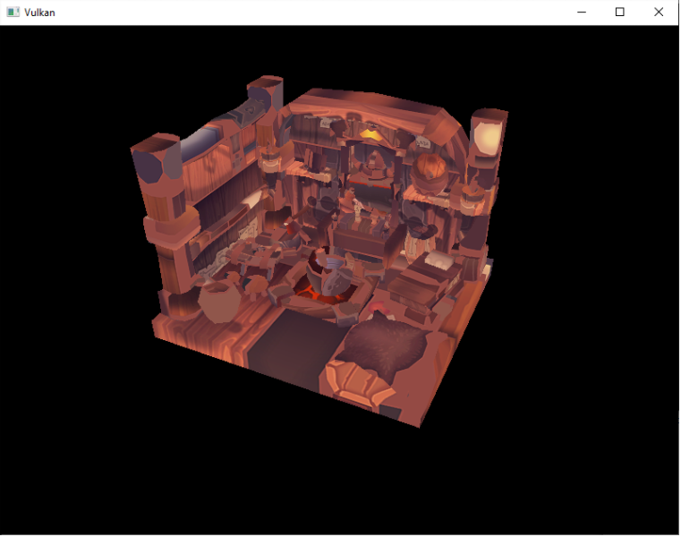
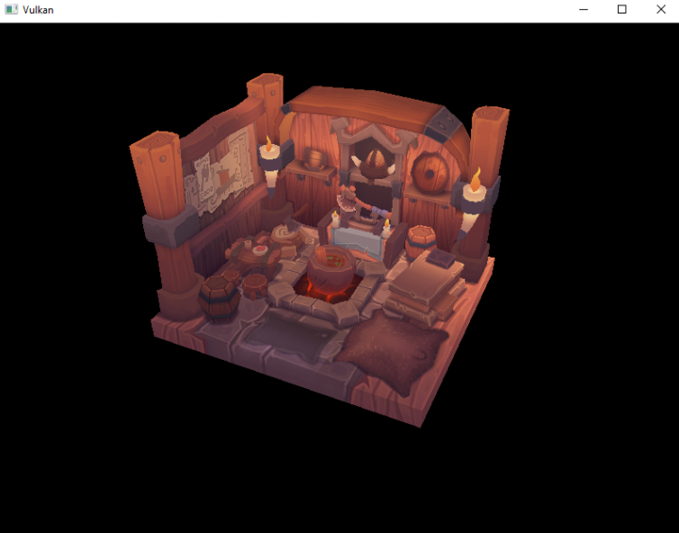

# Vulkan教程6——Loading Models

在本章中，我们将扩展程序，从实际的模型文件加载顶点和索引，使显卡实际做一些工作。我们将从OBJ模型加载网格数据，但我们将更多地关注网格数据与程序本身的集成，而不是从文件加载它的细节。


### Library

我们将使用 `tinyobjloader` 库从 OBJ 文件中加载顶点和面。它的速度很快，而且很容易集成。下载 `tiny_obj_loader.h `文件到你的库目录下的一个文件夹。确保使用主分支的文件版本，因为最新的官方版本已经过时了。


### Sample mesh

在这一章中，我们还不会启用光照，所以使用已将光照烘焙到纹理中的样本模型是有帮助的。找到这种模型的一个简单方法是在`Sketchfab`上寻找3D扫描。该网站上的许多模型都是以OBJ格式提供的，并有允许的许可。

在本教程中，我决定使用nigelgoh制作的Viking room模型(CC 4.0)。我调整了模型的大小和方向：

在程序中添加两个新的配置变量来定义模型和纹理路径：

```c
const uint32_t WIDTH = 800;
const uint32_t HEIGHT = 600;

const std::string MODEL_PATH = "models/viking_room.obj";
const std::string TEXTURE_PATH = "textures/viking_room.png";
```

并更新`createTextureImage`来使用这个路径变量

```c
stbi_uc* pixels = stbi_load(TEXTURE_PATH.c_str(), &texWidth, &texHeight, &texChannels, STBI_rgb_alpha);
```


### Loading vertices and indices

我们现在要从模型文件中加载顶点和索引，所以你现在应该移除全局顶点和索引数组。用非`const`容器替换它们作为类成员

```c
std::vector<Vertex> vertices;
std::vector<uint32_t> indices;
VkBuffer vertexBuffer;
VkDeviceMemory vertexBufferMemory;
```

您应该将索引的类型从`uint16_t`更改为`uint32_t`，因为将会有比65535更多的顶点。记住也要更改`vkCmdBindIndexBuffer`的参数

```c
vkCmdBindIndexBuffer(commandBuffers[i], indexBuffer, 0, VK_INDEX_TYPE_UINT32);
```

```c
#define TINYOBJLOADER_IMPLEMENTATION
#include <tiny_obj_loader.h>
```

现在我们要写一个`loadModel`函数：

```c
void initVulkan() {
    ...
    loadModel();
    createVertexBuffer();
    createIndexBuffer();
    ...
}

...

void loadModel() {

}
```

通过调用`tinyobj::LoadObj`函数，将模型加载到库的数据结构中：

```c
void loadModel() {
    tinyobj::attrib_t attrib;
    std::vector<tinyobj::shape_t> shapes;
    std::vector<tinyobj::material_t> materials;
    std::string warn, err;

    if (!tinyobj::LoadObj(&attrib, &shapes, &materials, &warn, &err, MODEL_PATH.c_str())) {
        throw std::runtime_error(warn + err);
    }
}
```

==一个OBJ文件由位置、法线、纹理坐标和面组成。面由任意数量的顶点组成，其中每个顶点通过索引指向一个位置、法线和/或纹理坐标。这使得它不仅可以重用整个顶点，还可以重用单个属性==。

`attrib`容器在其`attrib.vertices`、`attrib.normals`和`attrib.texcoords`向量中保存了所有的位置、法线和纹理坐标。shapes容器包含了所有的独立对象和它们的面。每个面由一个顶点数组组成，每个顶点包含位置、法线和纹理坐标属性的索引。OBJ模型也可以为每个面定义一个材质和纹理，但我们将忽略这些。

`err` 字符串包含错误，`warn` 字符串包含加载文件时发生的警告，比如缺少材料定义。只有当`LoadObj`函数返回false时，加载才真正失败。如上所述，OBJ文件中的面实际上可以包含任意数量的顶点，而我们的应用程序只能渲染三角形。幸运的是LoadObj有一个可选的参数可以自动对这类面进行三角测量，默认情况下是启用的。

我们将把文件中的所有面合并到一个模型中，所以只需要迭代所有的形状：

```c
for (const auto& shape : shapes) {

}
```

三角测量特性已经确保了每个面有三个顶点，所以我们现在可以直接遍历顶点并将它们直接转储到顶点向量中

```c
for (const auto& shape : shapes) {
    for (const auto& index : shape.mesh.indices) {
        Vertex vertex{};

        vertices.push_back(vertex);
        indices.push_back(indices.size());
    }
}
```

为了简单起见，我们假设现在每个顶点都是唯一的，因此使用简单的自增索引。index变量是`tinyobj::index_t`类型的，它包含顶点索引、法线索引和`texcoord`索引成员。我们需要使用这些索引来查找attrib数组中的实际顶点属性

```c
vertex.pos = {
    attrib.vertices[3 * index.vertex_index + 0],
    attrib.vertices[3 * index.vertex_index + 1],
    attrib.vertices[3 * index.vertex_index + 2]
};

vertex.texCoord = {
    attrib.texcoords[2 * index.texcoord_index + 0],
    attrib.texcoords[2 * index.texcoord_index + 1]
};

vertex.color = {1.0f, 1.0f, 1.0f};
```

不幸的是， `attrib.vertices` 数组是一个浮动值的数组，所以你需要将索引乘以 3。 同样，每个条目有两个纹理坐标分量。0、1和2的偏移量用于访问X、Y和Z分量，或者在纹理坐标的情况下访问U和V分量。



很好，几何图形看起来是正确的，但是纹理是怎么回事呢?OBJ格式假设了一个坐标系统，其中垂直坐标0表示图像的底部，然而我们已经将图像上传至Vulkan，从上到下的方向0表示图像的顶部。通过翻转纹理坐标的垂直分量来解决这个问题

```c
vertex.texCoord = {
    attrib.texcoords[2 * index.texcoord_index + 0],
    1.0f - attrib.texcoords[2 * index.texcoord_index + 1]
};
```




### Vertex deduplication

不幸的是，我们还没有真正利用索引缓冲区。顶点向量包含了许多重复的顶点数据，因为许多顶点被包含在多个三角形中。我们应该只保留唯一的顶点，并在它们出现时使用索引缓冲区来重用它们。实现这一点的一种简单方法是使用映射或无序映射来跟踪唯一的顶点和各自的索引

```c
#include <unordered_map>

...

std::unordered_map<Vertex, uint32_t> uniqueVertices{};

for (const auto& shape : shapes) {
    for (const auto& index : shape.mesh.indices) {
        Vertex vertex{};

        ...

        if (uniqueVertices.count(vertex) == 0) {
            uniqueVertices[vertex] = static_cast<uint32_t>(vertices.size());
            vertices.push_back(vertex);
        }

        indices.push_back(uniqueVertices[vertex]);
    }
}
```

每次我们从OBJ文件中读取一个顶点时，我们检查是否已经看到一个具有完全相同的位置和纹理坐标的顶点。如果没有，我们将它添加到顶点，并将它的索引存储在`uniqueVertices`容器中。之后，我们将新顶点的索引添加到索引中。如果我们以前见过完全相同的顶点，那么我们就在`uniqueVertices`中查找它的索引，并将索引存储在索引中。

程序现在将无法编译，因为在哈希表中使用用户定义的顶点结构作为键，需要我们实现两个函数：相等测试和哈希计算。前者很容易实现，只需重写顶点结构中的==运算符

```c
bool operator==(const Vertex& other) const {
    return pos == other.pos && color == other.color && texCoord == other.texCoord;
}
```

通过为std::hash<T>指定模板特化来实现顶点的哈希函数。散列函数是一个复杂的主题，但是`cppreference.com`推荐使用以下方法组合结构的字段，来创建高质量的散列函数

```c
namespace std {
    template<> struct hash<Vertex> {
        size_t operator()(Vertex const& vertex) const {
            return ((hash<glm::vec3>()(vertex.pos) ^
                   (hash<glm::vec3>()(vertex.color) << 1)) >> 1) ^
                   (hash<glm::vec2>()(vertex.texCoord) << 1);
        }
    };
}
```

这段代码应该放在顶点结构的外面。GLM类型的散列函数需要包含在以下头文件中：

```c
#define GLM_ENABLE_EXPERIMENTAL
#include <glm/gtx/hash.hpp>
```

现在，您应该能够成功地编译和运行程序了。如果您检查顶点的大小，那么您将看到它已经从1,500,000缩减到265,645!这意味着每个顶点在平均~6个三角形中被重用。这无疑为我们节省了大量GPU内存。