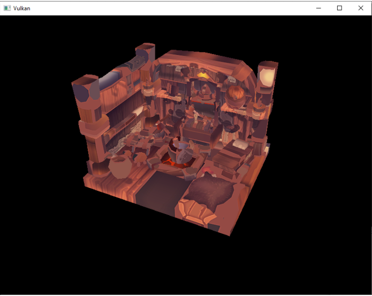
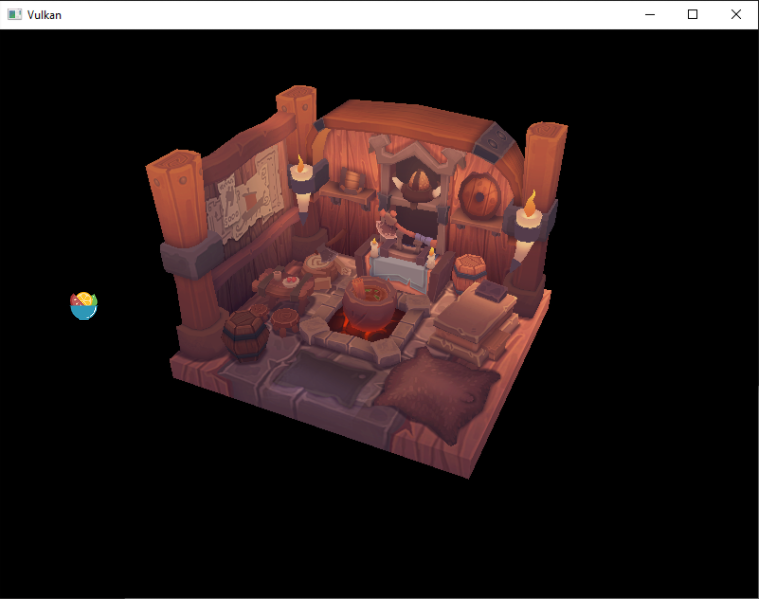

# Vulkan教程7

## Library

使用`tinyobjloader`库加载模型。


## Sample mesh

在这一章中，我们还不会启用照明，所以它有助于使用一个样本模型，将照明烘焙到纹理中。找到这种模型的一个简单方法是在Sketchfab上寻找3D扫描。该网站上的许多模型都是OBJ格式的，并且都有许可。

你可以随意使用自己的模型，但要确保它只包含一种材料，尺寸大约是1.5 x 1.5 x 1.5个单元。如果它大于这个值，那么你就必须改变视图矩阵。把模型文件放在一个新的模型目录下，并把纹理图像在纹理目录。

在程序中添加两个新的配置变量来定义模型和纹理路径：

```c
const uint32_t WIDTH = 800;
const uint32_t HEIGHT = 600;

const std::string MODEL_PATH = "models/viking_room.obj";
const std::string TEXTURE_PATH = "textures/viking_room.png";
```

然后更新createTextureImage来使用这个路径变量：

```c
stbi_uc* pixels = stbi_load(TEXTURE_PATH.c_str(), &texWidth, &texHeight, &texChannels, STBI_rgb_alpha);
```


## Loading vertices and indices

我们现在要从模型文件中加载顶点和索引，所以你现在应该移除全局顶点和索引数组。将它们替换为非const容器作为类成员：

```c++
std::vector<Vertex> vertices;
std::vector<uint32_t> indices;
VkBuffer vertexBuffer;
VkDeviceMemory vertexBufferMemory;
```

你应该改变索引的类型：从`uint16t`到`uint32t`，因为会有比65535更多的顶点。记住还要更改`vkCmdBindIndexBuffer`参数

```c
vkCmdBindIndexBuffer(commandBuffers[i], indexBuffer, 0, VK_INDEX_TYPE_UINT32);
```

`tinyobjloader`库的包含方式与STB库相同。包括`obj loader.h`文件，并确保在一个源文件中定义`TINYOBJLOADER_IMPLEMENTATION`，以避免链接器错误

```pascal
#define TINYOBJLOADER_IMPLEMENTATION
#include <tiny_obj_loader.h>
```

现在我们将编写一个`loadModel`函数，它用网格中的顶点数据填充顶点和索引容器。它应该在创建顶点和索引缓冲区之前被调用：

```c
void initVulkan() {
    ...
    loadModel();
    createVertexBuffer();
    createIndexBuffer();
    ...
}

...

void loadModel() {

}
```

通过调用`tinyobj::LoadObj`函数将模型加载到该库的数据结构中:

```c
void loadModel() {
    tinyobj::attrib_t attrib;
    std::vector<tinyobj::shape_t> shapes;
    std::vector<tinyobj::material_t> materials;
    std::string warn, err;

    if (!tinyobj::LoadObj(&attrib, &shapes, &materials, &warn, &err, MODEL_PATH.c_str())) {
        throw std::runtime_error(warn + err);
    }
}
```

==OBJ文件由位置、法线、纹理坐标和面组成。面由任意数量的顶点组成，其中每个顶点根据索引表示一个位置、法线和/或纹理坐标==。这使得不仅可以重用整个顶点，还可以重用单个属性。

`attrib`容器在其`attrib.vertices`、`attrib.normals`和`attrib.texcoords`向量中保存了所有的位置、法线和纹理坐标。`shapes`容器包含了所有的独立对象和它们的面。每个面由一个顶点数组组成，每个顶点包含位置、法线和纹理坐标属性的索引。OBJ模型也可以为每个面定义一个材质和纹理，但我们将忽略这些。

我们要把文件中所有的面合并到一个模型中，所以只要遍历所有的形状：

```c
for (const auto& shape : shapes) {

}
```

三角化特性已经确保了每个面有三个顶点，所以我们现在可以直接遍历这些顶点，并将它们直接转储到顶点向量中：

```c
for (const auto& shape : shapes) {
    for (const auto& index : shape.mesh.indices) {
        Vertex vertex{};

        vertices.push_back(vertex);
        indices.push_back(indices.size());
    }
}
```

为了简单起见，我们现在假设每个顶点都是唯一的，因此使用简单的自动递增索引。索引变量为`tinyobj::index_t`类型，包含顶点索引、法线索引和texcoord索引成员。我们需要使用这些索引来查找`attrib`数组中的实际顶点属性

```c
vertex.pos = {
    attrib.vertices[3 * index.vertex_index + 0],
    attrib.vertices[3 * index.vertex_index + 1],
    attrib.vertices[3 * index.vertex_index + 2]
};

vertex.texCoord = {
    attrib.texcoords[2 * index.texcoord_index + 0],
    attrib.texcoords[2 * index.texcoord_index + 1]
};
vertex.color = {1.0f, 1.0f, 1.0f};
```

现在运行你的程序，并启用优化（例如，在Visual Studio中的Release模式和GCC的-O3编译器标志）。这是必要的，因为否则加载模型会很慢。您应该看到类似下面的内容



很好，几何图形看起来是正确的，但是纹理呢?OBJ格式假设一个坐标系统，垂直坐标为0表示图像的底部，但是我们已经以从上到下的方向将图像上传到Vulkan，其中0表示图像的顶部。通过翻转纹理坐标的垂直分量来解决这个问题：

```c
vertex.texCoord = {
    attrib.texcoords[2 * index.texcoord_index + 0],
    1.0f - attrib.texcoords[2 * index.texcoord_index + 1]
};
```




## Vertex deduplication

不幸的是，我们还没有真正利用索引缓冲区。顶点向量包含许多重复的顶点数据，因为许多顶点包含在多个三角形中。我们应该只保留唯一的顶点，并在它们出现时使用索引缓冲区来重用它们。实现这一点的一种直接方法是使用映射或无序映射来跟踪惟一的顶点和各自的索引

```c
#include <unordered_map>

...

std::unordered_map<Vertex, uint32_t> uniqueVertices{};

for (const auto& shape : shapes) {
    for (const auto& index : shape.mesh.indices) {
        Vertex vertex{};

        ...

        if (uniqueVertices.count(vertex) == 0) {
            uniqueVertices[vertex] = static_cast<uint32_t>(vertices.size());
            vertices.push_back(vertex);
        }

        indices.push_back(uniqueVertices[vertex]);
    }
}
```

每当我们从OBJ文件中读取一个顶点时，我们都会检查之前是否已经看到一个位置和纹理坐标完全相同的顶点。如果没有，我们就把它添加到`vertices`中，并把它的索引存储在`uniqueVertices`容器中。之后我们将新顶点的索引添加到`indices`中。如果我们之前看到过完全相同的顶点，那么我们就在uniqueVertices中查找它的索引，并将该索引存储在indices中。

程序现在就会编译失败，因为需要我们实现两个功能：相等测试和哈希计算。前者很容易实现，只要覆盖Vertex结构中的==操作符即可。

```c
bool operator==(const Vertex& other) const {
    return pos == other.pos && color == other.color && texCoord == other.texCoord;
}
```

顶点的哈希函数是通过为std::hash<T>指定模板专门化来实现的。哈希函数是一个复杂的主题，但是cppreference.com建议使用以下方法组合结构的字段来创建一个高质量的哈希函数：

```c
namespace std {
    template<> struct hash<Vertex> {
        size_t operator()(Vertex const& vertex) const {
            return ((hash<glm::vec3>()(vertex.pos) ^
                   (hash<glm::vec3>()(vertex.color) << 1)) >> 1) ^
                   (hash<glm::vec2>()(vertex.texCoord) << 1);
        }
    };
}
```

这段代码应该放在顶点结构的外部。需要使用以下头：

```c
#define GLM_ENABLE_EXPERIMENTAL
#include <glm/gtx/hash.hpp>
```

散列函数是在gtx文件夹中定义的，这意味着它在技术上仍是GLM的实验扩展。因此，您需要定义`GLM ENABLE EXPERIMENTAL`来使用它。这意味着未来该API可能会随着GLM的新版本而改变，但实际上该API非常稳定。