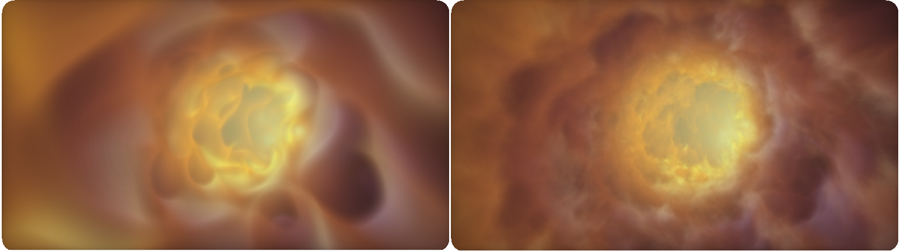

# Protean Clouds优秀代码解析

作者：nimitz，网址：https://www.shadertoy.com/view/3l23Rh

标签：procedural, 3d, fast, volumetric（程序，3d，快速，体积）


> Technical details：主要的体积噪声是由一个变形的周期网格（periodic grid）产生的，它可以以非常低的计算成本产生大范围的noise-like patterns。允许多次取体梯度计算，以改善照明。进一步加速March，因为volume is smooth，超过一半的密度信息不是用来渲染，而是作为一个潜在的体积来确定动态步长
>
> 由于动态行进的步长是不均匀的（因为所有的步长都没有被渲染）the fog is evaluated as the difference of the fog integral at each rendered step.


## mainImage

首先是常规的坐标变换，然后是相机设置，这里和以前不一样的是：因为是在云道里蜿蜒前进，所以需要进行一些微调

```c
vec2 bsMo = vec2(.0);
vec2 disp(float t){ return vec2(sin(t*0.22)*1., cos(t*0.175)*1.)*2.; }
...
vec3 ro = vec3(0,0,time);
ro += vec3(sin(iTime)*0.5,sin(iTime*1.)*0.5,0);
//微调的程度
float dspAmp = .85;
//随深度变换位置，或者随着不断移动，视点的位置进行微调
ro.xy += disp(ro.z)*dspAmp;
//target离视点在Z轴方向的距离
float tgtDst = 3.5;
//target计算
vec3 target = normalize(ro - vec3(disp(time + tgtDst)*dspAmp, time + tgtDst));
ro.x -= bsMo.x*2.;
//常规的变换矩阵设置
vec3 rightdir = normalize(cross(target, vec3(0,1,0)));
vec3 updir = normalize(cross(rightdir, target));
rightdir = normalize(cross(updir, target));
vec3 rd=normalize((p.x*rightdir + p.y*updir)*1. - target);
//给视点射线加一个轻微的偏移
rd.xy *= rot(disp(time + 3.5).x*0.2 + bsMo.x);
```

随后进入重点的Render函数

```C
prm1 = smoothstep(-0.4, 0.4,sin(iTime*0.3));
vec4 scn = render(ro, rd, time);
```


## Render

首先，一些参数的设置：`rez`应该是最终要输出的结果，`t`是RayMarching已经移动的距离

```
vec4 rez = vec4(0);
const float ldst = 8.;
vec3 lpos = vec3(disp(time + ldst)*0.5, time + ldst);
float t = 1.5;
float fogT = 0.;
```

然后进入循环，一开始，进行一个判断，原理也很简单：积累的雾的透明度超过了0.99，说明已经不需要继续循环了（继续循环的贡献也不大）。

```
if(rez.a > 0.99)break;
```

根据计算的Pos值，传入Map函数，这里可以先转到后面去分析Map。

```c
vec2 mpv = map(pos);
float den = clamp(mpv.x-0.3,0.,1.)*1.12;
float dn = clamp((mpv.x + 2.),0.,3.);
```

+ 根据返回值计算dn和den，然后，如果返回的d值大于0.6，则进行如下操作

```c
if (mpv.x > 0.6)
{	    
    col = vec4(sin(vec3(5.,0.4,0.2) + mpv.y*0.1 +sin(pos.z*0.4)*0.5 + 1.8)*0.5 				+ 0.5,0.08);
    col *= den*den*den;
    col.rgb *= linstep(4.,-2.5, mpv.x)*2.3;
    float dif =  clamp((den - map(pos+.8).x)/9., 0.001, 1. );
    dif += clamp((den - map(pos+.35).x)/2.5, 0.001, 1. );
    col.xyz *= den*(vec3(0.005,.045,.075) + 1.5*vec3(0.033,0.07,0.03)*dif);
}
```

+ 看不懂，先不看了。


## Map

```c
float mag2(vec2 p){return dot(p,p);}
...
vec2 map(vec3 p)
{
    vec3 p2 = p;
    p2.xy -= disp(p.z).xy;
    p.xy *= rot(sin(p.z+iTime)*(0.1 + prm1*0.05) + iTime*0.09);
    float cl = mag2(p2.xy);
    float d = 0.;
    p *= .61;
    float z = 1.;
    float trk = 1.;
    float dspAmp = 0.1 + prm1*0.2;
    for(int i = 0; i < 5; i++)
    {
		p += sin(p.zxy*0.75*trk + iTime*trk*.8)*dspAmp;
        d -= abs(dot(cos(p), sin(p.yzx))*z);
        z *= 0.57;
        trk *= 1.4;
        p = p*m3;
    }
    d = abs(d + prm1*3.)+ prm1*.3 - 2.5 + bsMo.y;
    return vec2(d + cl*.2 + 0.25, cl);
}

```

首先，我们需要在Map中计算两个值，一个是经过扰动处理的坐标p的XY坐标的L2范数（cl），另一个则经过类似FBM过程，求得的距离d。下面，具体分析：

```c
 vec3 p2 = p;
 p2.xy -= disp(p.z).xy;
 p.xy *= rot(sin(p.z+iTime)*(0.1 + prm1*0.05) + iTime*0.09);
 float cl = mag2(p2.xy);
```

+ 对p的xy坐标进行平移扰动，然后进行旋转扰动，最后根据扰动后的xy坐标计算cl（个人感觉这个cl与管道有关）。就效果而言，这几行的影响几乎看不到。

```c
float d = 0.;
p *= .61;
float z = 1.;
float trk = 1.;
float dspAmp = 0.1 + prm1*0.2;
```

+ d是另外一个输出；对坐标p进行缩小（扩大云层的聚簇团）；Z可以理解成FBM中的幅度值A；trk可以理解成频率f；dspAmp是对d值进行缩放（将这个值变大，粒子会被拉长，到一定程度，会有==毛发感==）。

```c
const mat3 m3 = mat3(0.33338, 0.56034, -0.71817, -0.87887, 0.32651, -0.15323, 0.15162, 0.69596, 0.61339)*1.93;
...
for(int i = 0; i < 5; i++)
{
    p += sin(p.zxy*0.75*trk + iTime*trk*.8)*dspAmp;
    d -= abs(dot(cos(p), sin(p.yzx))*z);
    z *= 0.57;
    trk *= 1.4;
    p = p*m3;
}
```

+ 第一行，相当于（个人感觉）是使用频率trk和p来求一个连续性的随机数（类似FBM），赋值给p，然后用d减去上一部结果的z缩放值。为什么套一个三角函数呢？暂且不知，但这个代码应该是==效果核心==——没有显示不出任何东西。
+ 然后就是迭代更新，缩小振幅，增大频率。
+ p*m3。这个是另外一个==核心==——真正赋予云层细节和变化。（如下图）。为什么要乘上它呢？我觉得就是这项工程Fast的核心之初了，仔细想想，我们只循环了五次？这根本生成不出足够的细节，==所以需要将P乘上一个矩阵来额外产生足够的细节变化==。



```c
 d = abs(d + prm1*3.)+ prm1*.3 - 2.5 + bsMo.y;
 return vec2(d + cl*.2 + 0.25, cl);
```

+ 首先对d进行微调，原理不知，作用不知，效果上无明显影响。
+ 然后返回值里面，后者就是直接的cl，前者却还要加上cl，为什么？