# C++ Prime 精简

## 1. 变量和基本类型

:one:在**变量名**前添加**关键字**`extern`，则表明这是声明一个变量，而不是定义：==变量能且只能被定义一次，但是可以被多次声明==。


:two:**得到空指针最直接的方法**就是用字面值`nullptr`来初始化指针。`nullptr`是一种**特殊类型的字面值**，可以被转换成**任意其它类型的指针**。


:three:==顶层const和底层const==

+ 顶层const ：不可以改变**指向**，但可以改变**指向的值**

  ```c++
  double* const p = &curEEr;
  ```

+ 底层const：可以改变**指向**，但不可以改变**指向的值**

  ```c++
  const double *p = &curEEr;
  ```


:four:`constexpr`和常量表达式

+ **常量表达式**：值不会改变，并且在编译过程就能得到计算结果的==表达式==。
+ `constexpr`：也可以叫做**字面值类型**，允许将变量声明为`constexpr`类型，以便由**编译器**来验证**变量的值**是否是一个**常量表达式**。


:five:`auto`一般会忽略掉**顶层const**。如果希望推断出的`auto`类型是一个**顶层const**，需要明确指出：

```c++
const auto f = ci;
```


## 2. 函数

:one:当用**实参**初始化**形参**时，会忽略掉**顶层const**。当**形参**有**顶层const**时，传给它**常量对象**或者**非常量对象**都是可以的。

> ==尽量使用常量引用==


:two:关于数组

```c++
int *a[10]; //指针的数组，包含10个指针
int (*b)[10] = &d; //指向数组的指针，该数组是[10]
int (&c)[10] = d; //数组d的引用
```


:three:**尾置返回类型**

```c++
auto func(int i) -> int(*)[10];
```


:four:**constexpr函数**：函数的返回类型及所有形参的类型都得是**字面值类型**，而且**函数体**中必须有且只有一条return语句。


:five:指向函数的指针

+ 声明一个函数指针

  ```c++
  bool (*pf)(const string& , const string&);
  ```

+ 返回**指向函数的指针**

  ```c++
  // 方法1 使用类型别名
  using F = int(int*, int);
  ...
  F fl(int);
  
  // 方法2 使用尾置返回类型
  auto fl(int) -> int(*)(int*, int);
  ```

  

##  3. 类

:one:`class`和`struct`都可以新建一个类，但**默认访问权限**不太一样（==唯一区别==）。在**第一个访问说明符**之前定义的成员，使用`struct`关键字，都是`Public`；而`class`都是`Private`。


:two:友元

+ 为了使**友元**对**类的用户**可见，我们通常把**友元的声明**与类本身放置在同一个头文件中（**类的外部**）。也就是说，==在友元声明之外，还要在外部声明==。

  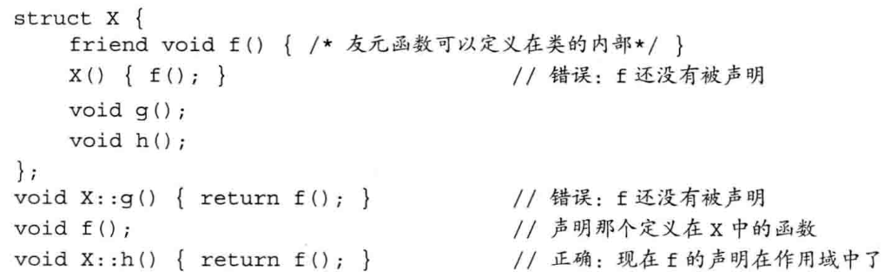

+ `Screen`类把`Window_mgr`类指定成它的友元。这样`Window_mgr`可以访问`Screen`的==私有成员==。


:three:一个`const成员函数`如果以**引用的形式**返回`*this`，那么它的返回类型将是==常量引用==。


:four:编译器只会自动执行==一步类型转换==，所以下面是错的

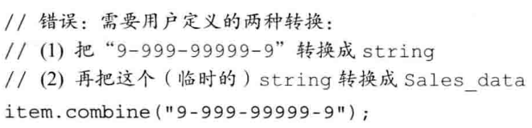


:five:可以通过**关键字**`explicit`，阻止这种**一步转换**。


:six:类的静态成员

+ **类的静态成员**不与任何对象绑定在一起，它们不包含`this指针`。

+ 必须在**类的外部**定义和初始化**每个静态成员**：

  ```c++
  double Accout::interestRate = initRate();
  ```

+ 在类内初始化，必须要求静态成员是==字面值常量类型==`constexpr`：

  ```c++
  class A{
  	static constexpr int period = 30;
  }
  ```

  

## 4. IO库

:one:==getline函数==：从一个给定的`istream`读取一行数据，存入一个给定的`string`对象中。


:two:文件输入输出

+ 文件模式

  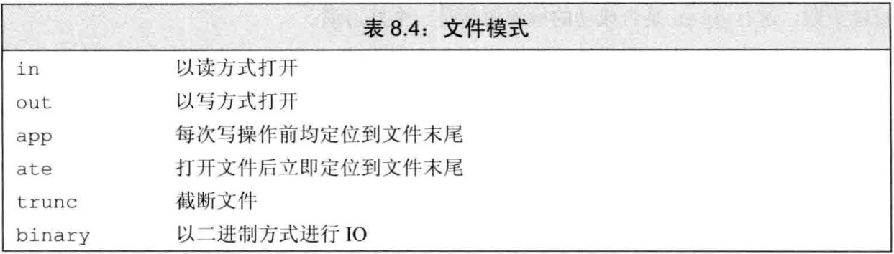

  ```c++
  ofstream app("file2", ofstream::app);
  ```


:three:当我们的某些工作是对整行文本进行处理，而其它一些工作是处理行内的单个单词时，通常可以使用`istringstream`。

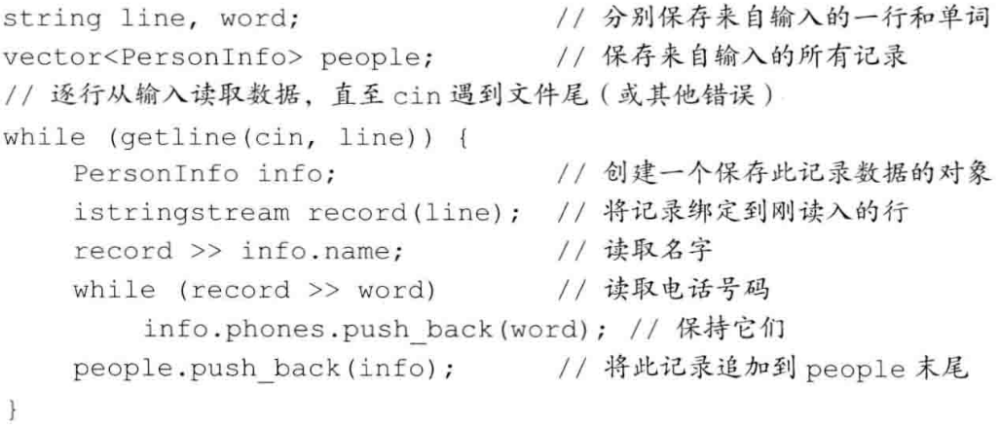


## 5. 顺序容器

:one:概述

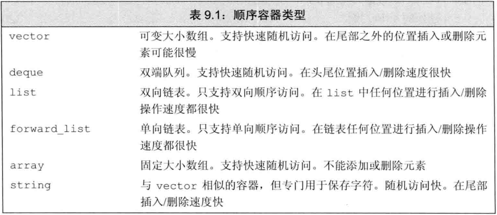


:two:**assign运算符**：允许我们从一个不同但相容的类型赋值（比`=`更强）

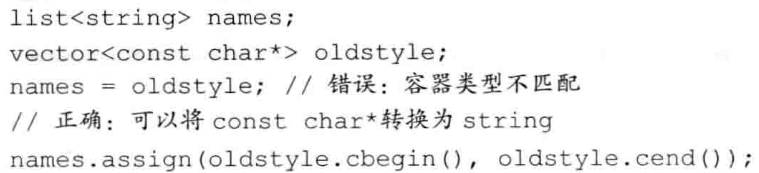


:three:**emplace操作**：不是**拷贝元素**，而是将**参数**传递给**元素类型**的==构造函数==：

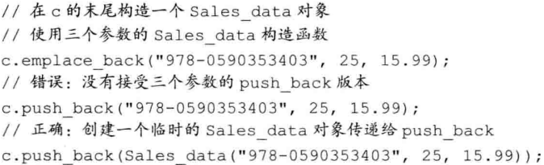


:four:**string和数值之间的转换**

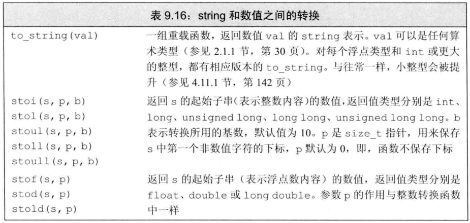


:five:==容器适配器==：`stack`、`queue`、`priority_queue`

+ 默认情况下，`stack、queue`是基于`deque`实现的，`prioprity_queue`是在`vector`之上实现的。
+ `priority_queue`：**最大/小堆**
+ `queue`：先入先出
+ `stack`：堆栈


## 6. 泛型算法

:one:**插入迭代器**：`back_inserter`，一种向容器中添加元素的迭代器

+ 常常使用`back_inserter`来创建一个迭代器，作为算法的目的位置来使用：

  ```c++
  vector<int> vec;
  fill_n(back_inserter(vec), 10, 0);
  ```


:two:**lambda表达式**：可以将其理解为一个**未命名的内联函数**
$$
[capture list] (parameter list)\rightarrow ReturnType\{FunctionBody\}
$$

+ **捕获列表**只能用于**局部非`static`变量**，lambda可以直接使用**局部`static`变量**

  ```c++
  [sz](const string &a)
  { return a.size() >= sz;}
  ```

+ 为了指示编译器**推断**捕获列表，应在**捕获列表**中写一个`&`和`=`（前者是**引用捕获**，后者是**值捕获**）

  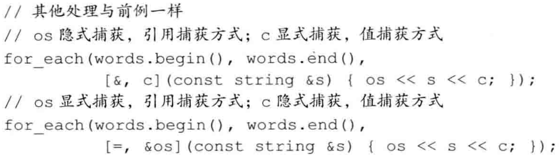


:three:==bind==

+ 可以将**bind函数**看作一个**通用的函数适配器**，它接受一个可调用对象，生成一个可调用对象来适应**原对象的参数列表**：
+ 具体见笔记


## 7. 关联容器

:one:定义一个`map`时，必须既指定**关键字类型**，又指明**值类型**；而定义`set`时，只需指明**关键字类型**，因为`set`没有值。


:two:`map`的元素是`pair`，`pair`的数据成员是`public`，分别命名为`first`和`second`。


:three:**关联容器**都支持**普通容器操作**，不支持顺序容器的位置相关操作。


:four:`map`的下标操作

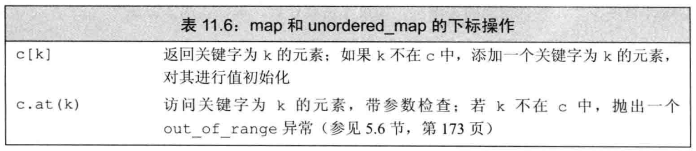

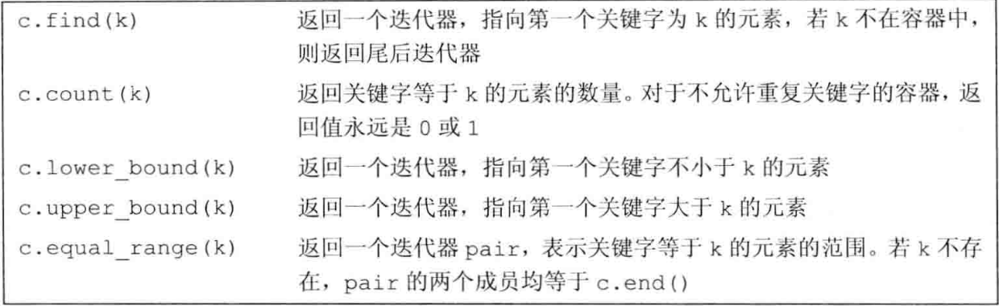


## 8. 动态内存

:one:==最安全的分配和使用动态内存的方法==是：调用一个名为`make_shared`的函数。


:two:==不要使用`get`初始化另一个智能指针或为智能指针赋值==


:three:`unique_ptr`==不支持普通的拷贝或赋值操作==

+ 不能拷贝`unique_ptr`的规则有一个例外：我们可以拷贝或赋值一个将要被销毁的`unique_ptr`。


:four:`weak_ptr`

+ 一种==不控制==所指向对象==生存期==的智能指针，它指向一个由`shared_ptr`管理的对象。
+ 将一个`weak_ptr`绑定到一个`shared_ptr`不会改变`shared_ptr`的引用计数。
+ 即使有`weak`，也能销毁`shared`。
+ 由于对象可能不存在，我们不能使用`weak_ptr`直接访问对象，而必须调用`lock`。


:five:**allocator类**：定义在`memory`中，帮助我们将**内存分配**和**对象构造**分离开来。

```c++
allocator<string> alloc;
auto const p = alloc.allocate(n);
```

+ 为了适应`allocate`返回的内存，我们必须用`construct`构造对象。使用**未构造的内存**，其行为是**未定义的**。

  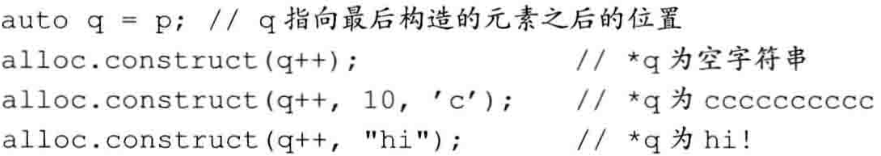

+ ==拷贝和填充算法==是这个类的**两个伴随算法**，可以在**未初始化内存**中创建对象：

  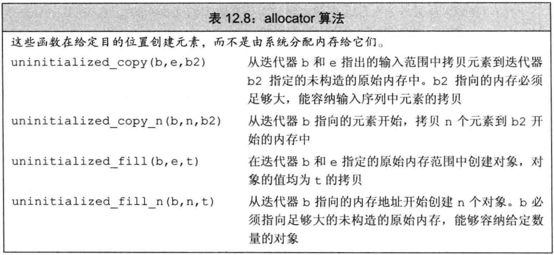

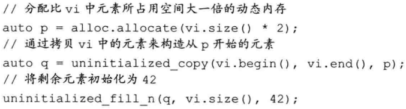


## 9. 拷贝控制:star:

:one:拷贝构造函数

```c++
Foo(const Foo&); 	//拷贝构造函数
```


:two:拷贝赋值运算符

```c++
Foo& operator=(const Foo&);
```

+ 需要析构函数的类也需要拷贝和赋值函数
+ 需要**拷贝操作**的类也需要**赋值操作**，反之亦然，但不意味着需要**析构函数**


:three:区分

+ `= default`
+ `= 0`
+ `= delete`


:four:**右值引用**

+ **右值引用**就是必须绑定到右值的引用

+ **右值引用**有一个重要的性质：**只能绑定到一个将要销毁的对象**。

  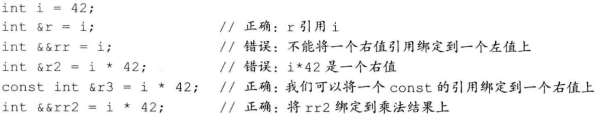

:five:`move`函数

+ 可以通过调用`move`来获得绑定到左值上的右值引用：

  ```c++
  int &&rr3 = std::move(rr1); //OK
  ```

+ 调用`move`就意味着承诺：除了对`rr1`（移后源对象）赋值或销毁它外，**我们将不再使用它**。


:six:移动构造函数和移动赋值函数

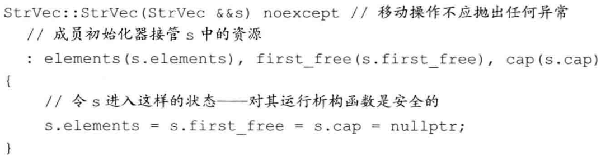

+ 由于**移动操作**窃取资源，通常**不分配任何资源**。因此，移动操作通常**不会抛出任何异常**，所以为了节省抛异常的开销，就需要指明。方法是使用==noexcpt==（这个是必须加的）。

  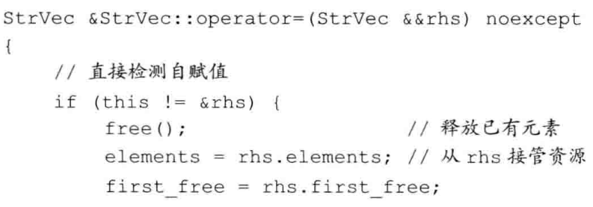


:seven:==移动迭代器==

+ 一个移动迭代器通过改变**给定迭代器的解引用运算符的行为**，来适配此迭代器，其行为变成了：==生成一个右值引用==。
+ 通过调用标准库的`make_move_iterator`函数将一个**普通迭代器**转换为一个**移动迭代器**。

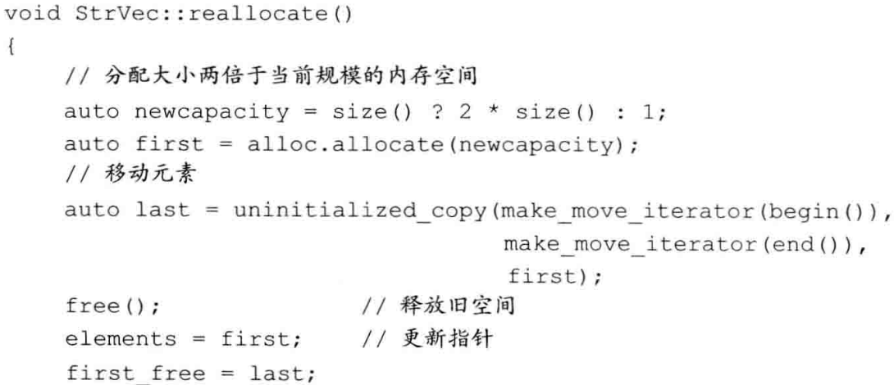


## 10. 重载运算和类型转换

:one:当我们把**运算符**定义成**成员函数**时，它的**左侧运算对象**必须是运算符**所属类的一个对象**。


:two:**重载==输出运算符==**（为类自定义）

+ 必须定义成**非成员函数**

+ 要把**IO运算符**声明为**友元**

  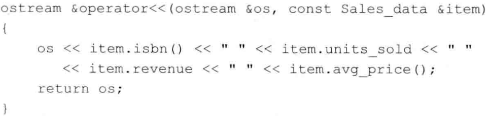


:three:**下标运算符**必须是**成员函数**。如果一个类包含下标运算符，则通常会定义**两个版本**：一个返回**普通定义**，一个是类的常量成员，并且返回**常量引用**。

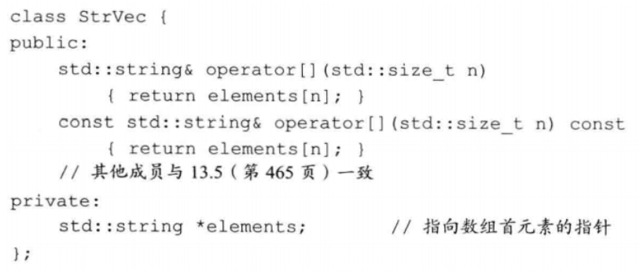


:four:C++语言中有几种**可调用的对象**：

+ 函数
+ 函数指针
+ `lambda`表达式
+ `bind`创建的对象
+ 重载了**函数调用运算符**的类。


:five:使用名为==function==的标准库类型，存储指向这些可调用对象的**指针**。

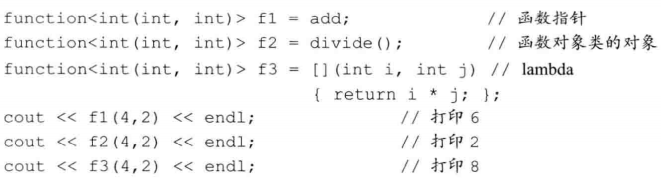


:six:**类型转换运算符**

+ 类的一种**特殊成员函数**，它负责将一个类类型的值转换成**其它类型**

  ```c++
  operator type() const;
  ```

  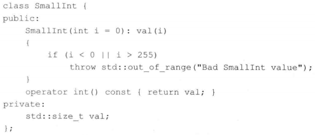

+ 这个运算符会触发**隐式的用户定义类型转换**

+ **显示的类型转换运算符**：避免隐式转换

  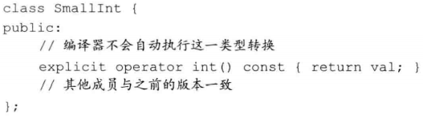

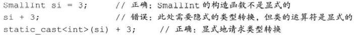


## 11. 面向对象程序设计

:one:如果不希望某个类作为基类，则使用`final`关键字：

```c++
class NoDerived final {...};
```


:two:含有纯虚函数的类是==抽象基类==。它负责定义接口，而后续其他类可以覆盖该接口。**我们不能直接创建一个抽象基类的对象**。而且`Disc_quote`的派生类必须给出自己的`net_price`定义，否则他们仍是**抽象基类**。


:three: To Do


## 12. 模板和泛型编程

:one:编写泛型代码的**两个重要原则**：

+ 模板中的**函数参数**是**`const`的引用**。
+ 函数体中的**条件判断**仅使用`<`比较运算。


:two:当我们在**类模板外**定义一个**成员模板**时，必须同时提供类模板和成员模板的模板参数列表，类模板在前，然后是成员模板：


:three:标准库**`std::move`**的定义：

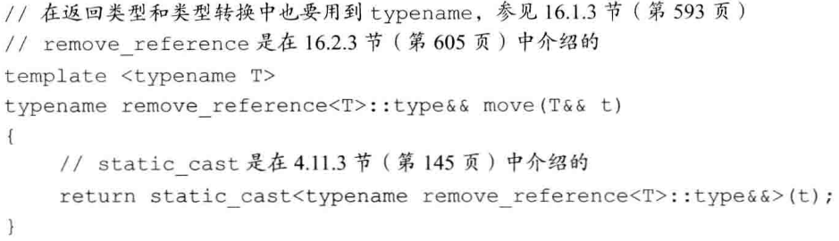

+ 当实参是左值时（例如：string a;），`move`实例化如下：

  ```c++
  string&& move(string &t);
  ```

+ 这正是我们所寻求的，将一个右值引用绑定到一个左值。


:four:**可变参数模板**

+ 可变数目的参数称为==参数包==，存在两种参数包：==模板参数包==，表示零个或多个**模板参数**；==函数参数包==，表示零个或多个**函数参数**。

+ 用一个==省略号==来指出一个包

  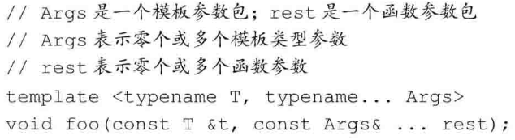

  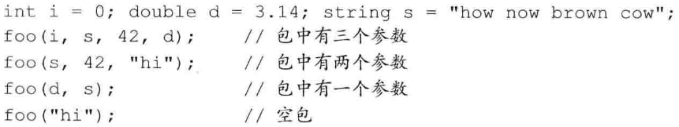

+ 当我们需要知道包中有多少元素时，可以使用`sizeof...`运算符：

  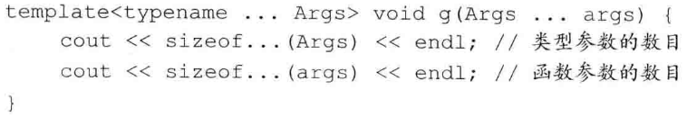


后续章节 ： To Do


# C++并行编程

## 1. 管理线程

:one:`std::thread`对象

+ 指定了线程上要运行的任务

+ 传入**可调用对象**

  ```c++
  std::thread my_thread([]{
      do_something();
      do_something_else();
  });
  ```


:two:启动了线程，之后：

+ 等待线程结束（`joined`）

  + 线程完毕，函数才结束

  ```c++
  std::thread t(my_func);
  t.join();
  ```

+ 自主运行（`detached`）

  + 函数继续；因此，需要保证线程数据的**有效性**

  ```c++
  std::thread my_thread(my_func);
  my_thread.detach(); 
  ```

+ 否则，程序终止


:three:`join`

+ 只能对一个线程使用一次`join()`
+ 如果打算**等待对应线程**，则需要细心挑选**调用join()的位置**
+ 一方面，倾向于在无异常的情况下使用`join()`时；另外一方面，需要在异常处理过程中调用`join()`。


:four:`detach`

+ 此方式的线程是**守护线程**
+ 应用场景比较极端：
  + 长时间运行
  + 发后即忘的任务


:five:线程参数

+ **参数**会==拷贝==到线程的**独立内存**中，即使参数是**引用**的形式。

  ```c++
  void f(int, std::string const&);
  std::thread t(f, 3, "hello");
  ```

+ 想要引用，使用`std::ref`来包装参数

  ```c++
  std::thread t(update_data_for_widget, w, std::ref(data));
  ```

+ 如果想要启动一个==成员函数==，则第一个参数是**函数指针**，第二个参数是**对象指针**，第三个开始才是**参数**：

  ```c++
  class X
  {
      public:
      void do_lengthy_work();
  };
  ...
  X my_x;
  std::thread t(&X::do_lengthy_work, &my_x); // 1
  ```

+ `std::thread`==是可移动的，但**不是可复制的**==。

  + 强行复制，会导致**程序终止**


:six:`std::thread::hardware_concurrency() `：返回能并发在一个程序中的线程数量。


:seven:**线程标识符**的类型是 `std::thread::id `，可以通过两种方式进行检索：

+ `t.get_id()`
+ 当前线程内：`std::this_thread::get_id()`


## 2. 在线程间共享数据

:one:C++**保护共享数据结构**的最基本的方式是==互斥元==。

+ 通过实例化`std::mutex`创建**互斥量**

+ 调用`lock`进行上锁，`unlock()`进行解锁

+ **互斥量**通常会与**保护的数据**放在同一个类中

+ 不推荐实践中直接去调用成员函数，因为：要记住在**函数出口处**调用`unlock`，还有考虑**异常**等情况，情况太复杂了。

  

:two:更好的方法：一个`RAII`语法的模板类`std::lack_guard`

+ 在**构造**的时候进行提供**已锁的互斥量**，在**析构**时进行**解锁**

  ```c++
  #include <list>
  #include <mutex>
  #include <algorithm>
  std::list<int> some_list; // 1
  std::mutex some_mutex; // 2
  void add_to_list(int new_value)
  {
      std::lock_guard<std::mutex> guard(some_mutex); // 3
      some_list.push_back(new_value);
  }
  ```

  

:three:`std::lock`

+  `std::lock `可以在同时获取两个以上的锁时**避免死锁**，但它没办法处理**分别获得的情况**。

+ 可以同时锁定**两个或更多的互斥元**，并且没有副作用（死锁风险）

  ```c++
  // 这里的std::lock()需要包含<mutex>头文件
  class some_big_object;
  void swap(some_big_object& lhs, some_big_object& rhs);
  
  class X
  {
  private:
      some_big_object some_detail;
      std::mutex m;
      
  public:
      X(some_big_object const& sd) : some_detail(sd) {}
      
      friend void swap(X& lhs, X& rhs)
      {
          if(&lhs == &rhs)
          	return;
          
          std::lock(lhs.m, rhs.m); // 1
          std::lock_guard<std::mutex> lock_a(lhs.m, std::adopt_lock); // 2
          std::lock_guard<std::mutex> lock_b(rhs.m, std::adopt_lock); // 3
          
          swap(lhs.some_detail, rhs.some_detail);
      }
  };
  ```

+  `std::adopt_lock` 参数：表示**` std::lock_guard `对象**使用**现成的锁**（`std::lock`产生的），而非创建新的锁。

+  **`std::lock`要么将两个锁都锁住，要不一个都不锁**


:four:==死锁==

+ **死锁的普遍性**：仅需要2个 `std::thread` 对象调用对方的`join()`，两个线程就能产生**死锁**
+ **解决死锁的统一思路**为：如果有人等你，那就不要等他
+ 解决方法：
  + **避免嵌套锁**。如果已经持有锁，就别再获取锁。
  + **在持有锁时，避免调用用户提供的代码**
  + **以固定的顺序获取锁**


:five:`std::unique_lock`

+ 比 `std:lock_guard` 更加灵活

+ 可将 `std::adopt_lock` 作为第二个参数传入构造函数；也可以将 `std::defer_lock` 作为第二个参数传递进去，表明**互斥量应保持解锁状态**。

  ```c++
  class some_big_object;
  void swap(some_big_object& lhs, some_big_object& rhs);
  class X
  {
  private:
      
      some_big_object some_detail;
      std::mutex m;
      
  public:
      
      X(some_big_object const& sd) : some_detail(sd) {}
      
      friend void swap(X& lhs, X& rhs)
      {
          if(&lhs == &rhs)
          	return;
          
          std::unique_lock<std::mutex> lock_a(lhs.m, std::defer_lock); // 1
          std::unique_lock<std::mutex> lock_b(rhs.m, std::defer_lock); // 1 std::def_lock 留下未上锁的互斥量
          
          std::lock(lock_a,lock_b); // 2 互斥量在这里上锁
          swap(lhs.some_detail, rhs.some_detail);
      }
  };
  ```

+ 使用情况：

  + 需求满足，考虑性能：`std::lock_guard`
  + 灵活性： `std::unique_lock`

+ `std::unique_lock `是**可移动，但不可复制的**

+ 在调用`unlock()`时，代码不需要再访问共享数据； 而后当再次需要对共享数据进行访问时，就可以再调用`lock()`了：

  ```c++
  void get_and_process_data()
  {
      std::unique_lock<std::mutex> my_lock(the_mutex);
      some_class data_to_process = get_next_data_chunk();
      my_lock.unlock(); // 1 不要让锁住的互斥量越过process()函数的调用
      result_type result = process(data_to_process);
      my_lock.lock(); // 2 为了写入数据，对互斥量再次上锁
      write_result(data_to_process, result);
  }
  ```

  


# 

