# c++

## C++11新特性

[参考](https://blog.csdn.net/jiange_zh/article/details/79356417)

1. nullptr。nullptr 的类型为 nullptr_t，能够隐式的转换为任何指针或成员指针的类型，也能和他们进行相等或者不等的比较。

2. 类型推导。C++11 引入了 auto 和 decltype 这两个关键字实现了类型推导

3.  委托构造

4. Lambda 表达式

5.   一个可以区分左值和右值的便捷方法：**看能不能对表达式取地址，如果能，则为左值，否则为右值**。`c++11`中的右值引用使用的符号是`&&`。

    ```cpp
    int&& a = 1; //实质上就是将不具名(匿名)变量取了个别名
    int b = 1;
    int && c = b; //编译错误！ 不能将一个左值复制给一个右值引用
    ```
    
    **常量左值引用**却是个奇葩，它可以算是一个“万能”的引用类型，它可以绑定非常量左值、常量左值、右值。

## C++和C的区别

 C++ 集成性很好。

现代C++是至少四种编程范式的集合体（面向过程，面向对象，泛型编程和元编程，函数式编程等，实际可能不止4种）。说C++是面向对象语言，是一种很瞧不起C++的说法，因为面向对象仅仅是C++的多种范式之一。在面向对象方面，C语言提供的语法支持比较薄弱

C并不是C++的子集，C++也不是C的超集


> [面向对象方法](https://baike.baidu.com/item/面向对象方法/216078)，把相关的数据和方法组织为一个整体来看待，从更高的层次来进行系统建模，更贴近事物的自然运行模式。
>
> 对象唯一性。抽象性。继承性。多态性（多形性）

### 1. c#和c++大小端

[参考](https://www.jianshu.com/p/c41741b5c19d)

 大端：（Big-Endian）就是把数值的高位字节放在内存的低位地址上，把数值的低位字节放在内存的高位地址上。

 小端：（Little-Endian）就是把数字的高位字节放在高位的地址上，低位字节放在低位地址上。

C#是小端。


## new/new[]和delete/delete[]的区别原理

在C++中堆内存的分配和释放是通过new和delete来操作的，它们和C语言的malloc和free有什么区别呢？new的底层也是通过malloc来开辟内存的，new比malloc多一项功能，就是开辟完内存，还可以进行初始化操作。

**delete比free多一项功能就是在释放内存之前，还可以析构指针指向的对象**，new和delete配对使用，**new[]和delete[]配对使用，尽量不要交叉使用**，以免产生不可预期的问题。

**new开辟内存失败是抛出bad_alloc类型的异常**，因此代码上要捕获该类型的异常才能正确的判断堆内存是否分配成功；**malloc内存开辟失败返回的是nullptr指针**。

[参考](https://blog.csdn.net/weixin_39411321/article/details/89310651)


## 虚函数的实现

可以在基类中将被重写的成员函数设置为虚函数，其含义是：当通过基类的指针或者引用调用该成员函数时，将根据指针指向的对象类型确定调用的函数，而非指针的类型。

### 1. 虚函数表

[参考](https://blog.csdn.net/lyztyycode/article/details/81326699)

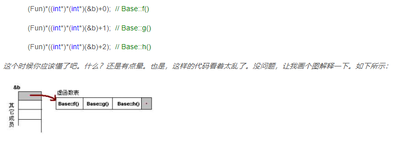

### 2. 关于多态

**多态**（英语：polymorphism）指为不同[数据类型](https://baike.baidu.com/item/数据类型)的实体提供统一的[接口](https://baike.baidu.com/item/接口)。关于多态，简而言之就是用父类型别的指针指向其子类的实例，然后通过父类的指针调用实际子类的成员函数。这种技术可以让父类的指针有“多种形态”，这是一种泛型技术。所谓泛型技术，说白了就是试图使用不变的代码来实现可变的算法。*

### 3. 纯虚函数

纯虚函数是在基类中声明的虚函数，它在基类中没有定义，**但要求任何派生类都要定义自己的实现方法**。在基类中实现纯虚函数的方法是在函数原型后加 **=0**。[参考](https://www.runoob.com/w3cnote/cpp-virtual-functions.html)

### 4. vptr指针

若类中包含虚函数，则编译器会在类实例化对象时在对象中加入==vptr指针==，它指向一个==虚函数表==，**子类和父类分别有自己的虚函数表**，所以使用父类指针调用类的虚函数时，是根据实际的对象时子类对象还是父类对象，来实现虚函数的调用。


## foreach实现原理

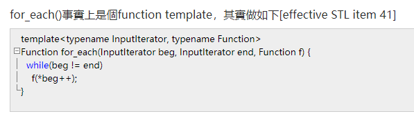

1. begin() end()

2. 迭代器

3. 迭代器重载 !=

4. 迭代器重载 前++

5. 迭代器重载 *(解引用)


## 模板STL

### 1. vector和list的区别

[参考](https://www.cnblogs.com/kandid/p/11369057.html)

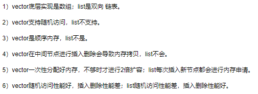

### 2. vector扩容方式

[参考](https://blog.csdn.net/yangshiziping/article/details/52550291)

新增元素：Vector通过一个连续的数组存放元素，如果集合已满，在新增数据的时候，就要分配一块更大的内存，将原来的数据复制过来，释放之前的内存，在插入新增的元素；对vector的任何操作，==一旦引起空间重新配置，指向原vector的所有迭代器就都失效了== ；初始时刻vector的capacity为0，塞入第一个元素后capacity增加为1；不同的编译器实现的扩容方式不一样，VS2015中以1.5倍扩容，GCC以2倍扩容

1. 为什么要成倍的扩容，而不是一次增加一个固定大小的容量呢？

    对比可以发现采用采用成倍方式扩容，可以保证==常数的时间复杂度==，而增加指定大小的容量只能达到O(n)的时间复杂度，因此，使用成倍的方式扩容。

2. 为什么是以两倍的方式扩容而不是三倍四倍，或者其他方式呢？

    为了防止申请内存的浪费，现在使用较多的有2倍与1.5倍的增长方式，而1.5倍的增长方式可以更好的实现对内存的重复利用，因为更好。


### 3. vector clear 函数具体做了什么操作?

+ Vector存储的**对象的指针**：不会调用析构函数，因此要在`clear`之前，要进行`delete`。
+ Vector存储的**对象**：内建类型直接删除；自定义对象则会**调用析构函数**


### 4. vector 的 push_back 做了什么操作？

+ `push_back`函数首先会检查是否还有空间，有就插入，没有就调用`insert_aux`。
+ `insert_aux`也会先做一次剩余空间判断
+ `insert_aux`找到新空间后会先把原地址的内容拷贝到新空间，再插入新元素，最后将原地址插入点后的内容也拷贝过去。


### 4. map、hash_map、unordered_map、unordered_set

**map**是用**红黑树**实现的：==查找，插入和删除的复杂度都是$O(logN)$，但会占用大量内存==

hash_map、unordered_map这两个的内部结构都是采用==哈希表==来实现：查找非常快（常数时间）。缺点：哈希表的建立比较耗费时间，有可能还会**哈希冲突**（==开链法避免地址冲突==）

unordered_set就是在哈希表插入value，而这个value就是它自己的key，而不是像之前的unordered_map那样有**键-值对**，这里单纯就是为了方便查询这些值。


## 联合体、结构体、类的区别

联合体中每次只能存其中的一个变量，这个变量在联合体变量中存入新的成员就失效了

C++中，结构体和类的最大区别是：开始没有明确指定的成员的默认域。


## 关键字

### const用法

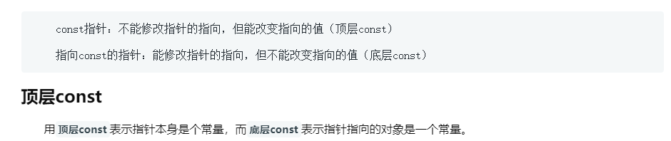

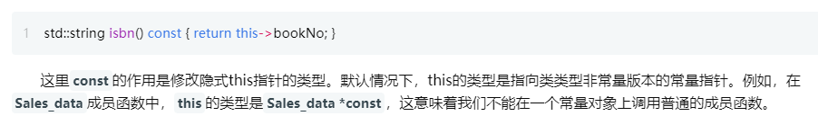

### static用法

类的静态成员不与任何对象绑定在一起，它们不包含`this指针`。

在类的外部定义静态成员时，不能重复`static`关键字，该关键字只出现在类内部的声明语句。

一般来说，必须在类的外部定义和初始化每个静态成员。


### 强制类型转换

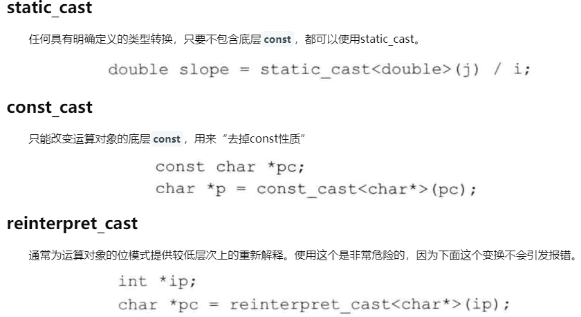

#### static_cast和dynamic_cast的区别

[参考](https://blog.csdn.net/u012411498/article/details/80804755)。dynamic_cast主要用于类层次间的上行转换和下行转换，还可以用于类之间的交叉转换。在类层次间进行上行转换时，dynamic_cast和**static_cast**的效果是一样的；==在进行下行转换时，dynamic_cast具有类型检查的功能，比**static_cast**更安全==。

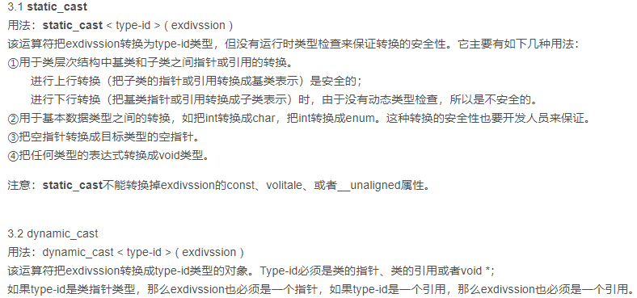

## 析构函数

当对象的生命周期结束时，撤销**类对象**时候会自动调用**析构函数**。[参考](https://www.cnblogs.com/liuzhenbo/p/11214276.html)

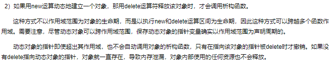

#### 在继承关系中，父类的析构函数最好定义为虚函数。构造函数不能是虚函数


## 什么是装箱拆箱

==装箱==: 将值类型转换为引用类型；==拆箱==: 将引用类型转换为值类型。装箱拆箱涉及到**堆和栈的内存分配，内存拷贝以及内存析构**，是一个很耗时的操作。

[参考](https://www.cnblogs.com/kdp0213/p/8533408.html)


## 协程实现原理

[参考](https://blog.csdn.net/qq_39787367/article/details/108654824)

协程不是线程，也不是异步执行的。协程和 MonoBehaviour 的 Update函数一样也是在MainThread中执行的。==使用协程你不用考虑同步和锁的问题==。

协程是一个分部执行，遇到条件（yield return 语句）会挂起，直到条件满足才会被唤醒继续执行后面的代码。Unity在每一帧（Frame）都会去处理对象上的协程。Unity主要是在Update后去处理协程（检查协程的条件是否满足）。协程跟Update()其实一样的，都是Unity每帧对会去处理的函数（如果有的话）。如果MonoBehaviour 是处于激活（active）状态的而且yield的条件满足，就会协程方法的后面代码。


## 深拷贝和浅拷贝的区别

浅拷贝（shallowCopy）只是增加了一个指针指向已存在的内存地址，

深拷贝（deepCopy）是增加了一个指针并且申请了一个新的内存，使这个增加的指针指向这个新的内存，


## 堆空间和栈空间

栈空间用于存储函数参数和局部变量，所需空间由系统自动分配，回收也由系统管理，无需人工干预；堆空间用于存储动态分配的内存块，分配和释放空间均由程序员控制，有可能产生内存泄漏。

栈空间作为一个严格后进先出的数据结构，可用空间永远都是一块连续的区域；堆空间在不断分配和释放空间的过程中，可用空间链表频繁更新，造成可用空间逐渐碎片化，每块可用空间都很小。

栈空间的默认大小只有几M的空间，生长方式是向下的，也就是向着内存地址减小的方向消耗空间；堆空间的理论大小与几G的空间，生长方式是向上的，也就是向着内存地址增大的方向消耗空间。

栈空间有计算机底层的支持，压栈和出栈都有专门的指令，效率较高；堆空间通过函数动态获取空间，涉及可用空间链表的扫描和调整以及相邻可用空间的合并等操作，效率相对较低。


## C++智能指针

动态内存管理经常会出现两种问题：一种是忘记释放内存，会造成内存泄漏；一种是尚有指针引用内存的情况下就释放了它，就会产生引用非法内存的指针。

智能指针的行为类似常规指针，重要的区别是它负责自动释放所指向的对象。标准库提供的两种智能指针的区别在于管理底层指针的方法不同，shared_ptr允许多个指针指向同一个对象，unique_ptr则“独占”所指向的对象。


## 右值引用

可以通过调用`move`来获得绑定到左值上的右值引用：

```c++
int &&rr3 = std::move(rr1); //OK
```

调用`move`就意味着承诺：除了对`rr1`（移后源对象）赋值或销毁它外，**我们将不再使用它**。

> 对于`move`，不提供`using`声明，直接调用`std::move`而不是`move`。


### weak_ptr使用场景

当你想使用对象，但是并不管理对象，并且在需要时可以返回对象的shared_ptr时，则使用。

解决shared_ptr的循环引用问题


## [内联函数和宏定义的区别](https://www.cnblogs.com/zsq1993/p/5896763.html)

内联函数在运行时可调试，而宏定义不可以;

编译器会对内联函数的参数类型做安全检查或自动类型转换（同普通函数），而宏定义则不会； 

内联函数可以访问类的成员变量，宏定义则不能； 

在类中声明同时定义的成员函数，自动转化为内联函数。


## 继承

### 继承constructor和destructor的执行顺序

当一个类继承自多个基类，而且本身还包含有其他类的成员对象的时候，构造函数的调用顺序为：==基类的构造函数->成员对象的构造函数->自身的构造函数==。

析构函数调用次序与构造函数刚好相反：==自身的析构函数->成员对象的析构函数->基类的析构函数==。


## 其它


## 算法

### 1. 平衡二叉树

**平衡二叉树**（Balanced Binary Tree）又被称为==AVL树==（有别于AVL算法），且具有以下性质：它是一 棵空树或它的左右两个子树的高度差的绝对值不超过1，并且左右两个子树都是一棵平衡二叉树。这个方案很好的解决了二叉查找树退化成链表的问题，把插入，查找，删除的时间复杂度最好情况和最坏情况都维持在O(logN)。但是频繁旋转会使插入和删除牺牲掉O(logN)左右的时间，不过相对二叉查找树来说，时间上稳定了很多。

### 2. 红黑树

红黑树（Red Black Tree） 是一种==自平衡二叉查找树==，是在[计算机](https://baike.baidu.com/item/计算机)科学中用到的一种[数据结构](https://baike.baidu.com/item/数据结构/1450)，典型的用途是实现[关联数组](https://baike.baidu.com/item/关联数组/3317025)。[参考](https://www.cnblogs.com/skywang12345/p/3245399.html#a3)

它可以在==O(log n)==时间内做查找，插入和删除。

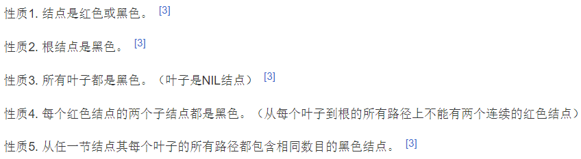

这些约束强制了红黑树的关键性质：==从根到叶子的最长的可能路径不多于最短的可能路径的两倍长==。结果是这个树大致上是平衡的。因为操作比如插入、删除和查找某个值的最坏情况时间都要求与树的高度成比例，这个在高度上的理论上限允许红黑树在最坏情况下都是高效的，而不同于普通的二叉查找树。 

是性质4导致路径上不能有两个连续的红色结点确保了这个结果。最短的可能路径都是黑色结点，最长的可能路径有交替的红色和黑色结点。因为根据性质5所有最长的路径都有相同数目的黑色结点，这就表明了没有路径能多于任何其他路径的两倍长。 

因为红黑树是一种特化的[二叉查找树](https://baike.baidu.com/item/二叉查找树/7077965)，所以红黑树上的只读操作与普通二叉查找树相同。

#### 有平衡二叉树为什么还要红黑树？

虽然平衡树解决了二叉查找树退化为近似链表的缺点，能够把查找时间控制在 O(logn)，不过却不是最佳的，因为平衡树要求每个节点的左子树和右子树的高度差至多等于1，这个要求实在是太严了，导致每次进行插入/删除节点的时候，几乎都会破坏平衡树的第二个规则，进而我们都需要通过左旋和右旋来进行调整，使之再次成为一颗符合要求的平衡树。

显然，如果在那种插入、删除很频繁的场景中，平衡树需要频繁着进行调整，这会使平衡树的性能大打折扣。

### 3. B+树

B+ 树是一种树数据结构，是一个n叉树，每个节点通常有多个孩子，一颗B+树包含根节点、内部节点和叶子节点。==B+ 树通常用于数据库和操作系统的文件系统中==。 B+ 树的特点是能够保持数据稳定有序，其插入与修改拥有较稳定的对数时间复杂度。 B+ 树元素自底向上插入。

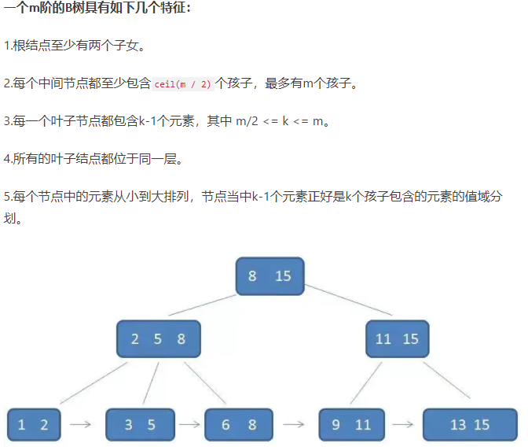


### 4. 快速排序

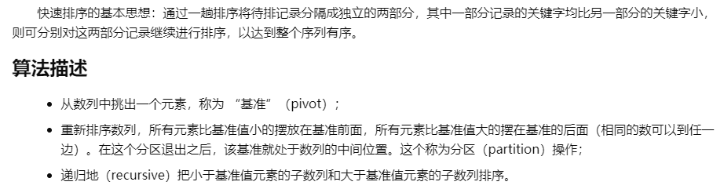

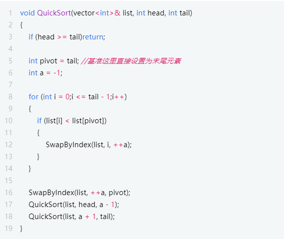


### 5. 哈希表

#### 哈希表冲突一般怎么做？:star:

1. **开放定址法**：当**关键字key**的哈希地址 $p=H(key)$ 出现冲突时，以p为基础，产生另一个哈希地址p1，如果p1仍然冲突，再以p为基础，产生另一个哈希地址p2。
   + 二次探测再散列：冲突发生时，在表的左右进行跳跃式探测，比较灵活
   + 伪随机探测再散列
2. **再哈希法**：同时构造多个不同的哈希函数
3. **建立公共溢出区**：将哈希表分为基本表和溢出表两部分，凡是和基本表发生冲突的元素，一律填入溢出表。


## 计算机网络

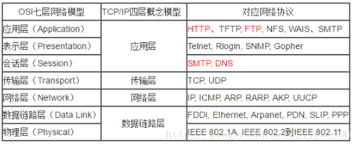

### TCP和UDP的区别

这是==传输层协议==。

首先TCP是面向连接的，UDP是无需连接的，TCP有着三握四挥，并且三次握手和四次挥手是对TCP建立的连接有着重要意义的两步，并且TCP是对IP无可靠性提供**可靠性的源头**，UDP继承了IP的特性，不保证不丢失包，不保证按顺序到达

TCP面向字节流，发送的时候是一个流，没有头尾，IP包不是一个流，而是一个个的IP包，UDP也是如此

TCP是有**拥塞控制**的，但是UDP没有


### tcp三次握手

TCP是属于网络分层中的传输层。[参考](https://blog.csdn.net/jun2016425/article/details/81506353)

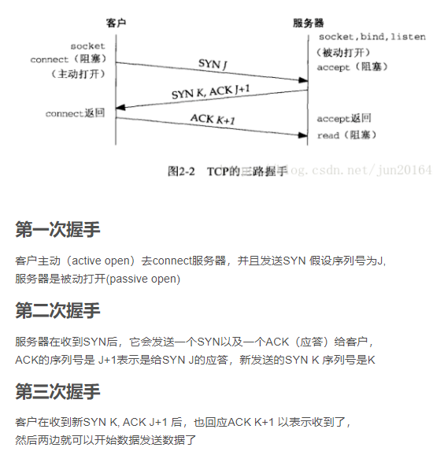


# 操作系统

## 进程的状态

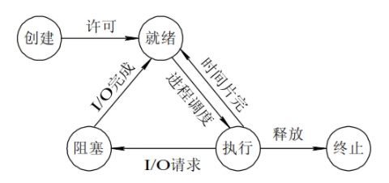

## 中断有哪些

从中断事件的性质出发，中断可以分为两大类：

- 强迫性中断事件：包括硬件故障中断，程序性中断，外部中断和输入输出中断等。

- 自愿性中断事件：是由正在运行的进程执行一条访管指令用以请求系统调用而引起的中断，这种中断也称为"访管中断"。

一般情况下，优先级的高低顺序依次为：硬件故障中断、自愿中断、程序性中断，外部中断和输入输出中断。自愿中断的断点是确定的，而强迫性中断的断点可能发生在任何位置。


# 计算机组成原理

## 浮点数的表示

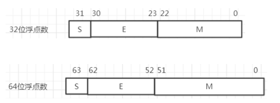

32位的浮点数中，S是浮点数的符号位，占1位，安排在最高位，S=0表示正数，S=1表示负数。M是尾数，放在低位部分，占用23位，小数点位置放在尾数域最左（最高）有效位的右边。E是阶码，占用8位，阶符采用隐含方式，，即采用移码方法来表示正负指数。移码方法对两个指数大小的比较和对阶操作都比较方便，因为阶码域值大者其指数值也大。采用这种方式时，将浮点数的指数真值e变成阶码E时，应将指数e加上一个固定的偏移值127（01111111），即E=e+127。