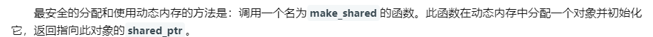

# c++

## 基础知识

### 1. 动态库和静态库:star:

+ 静态库（`.lib`）
  + **静态库**对函数库的链接是放在**编译时期**完成的。
  + 程序在运行时与函数库再无瓜葛，==移植方便==。
  + **多个程序依赖，多份拷贝**：浪费空间和资源，因为所有相关的目标文件与牵涉到的函数库被链接合成一个可执行文件。
  + **更新麻烦**：静态库liba.lib更新了，所以使用它的应用程序都需要重新编译、发布给用户
+ 动态库（`.dll`）
  + **动态库**在程序编译时并不会被连接到目标代码中，而是**在程序运行是才被载入**
  + **不同的应用程序如果调用相同的库，那么在内存里只需要有一份该共享库的实例**
  + 在动态库的情况下，有两个文件，一个是引入库（.LIB）文件，一个是`.DLL`文件，**引入库文件**包含被DLL导出的**函数的名称和位置**，DLL包含**实际的函数和数据**，应用程序使用LIB文件链接到所需要使用的DLL文件，库中的函数和数据并不复制到可执行文件中，因此在应用程序的可执行文件中，存放的不是被调用的函数代码，而是DLL中所要调用的函数的内存地址。


### 2. 定义和声明的区别

+ **声明**是告诉编译器**变量的类型和名字**==，不会为变量分配空间==
+ **定义**就是对这个变量和函数进行**内存分配和初始化**。需要分配空间，同一个变量可以被声明多次，但是只能被定义一次


### 3. 联合体、结构体、类的区别

**联合体**中每次只能存其中的一个变量，这个变量在联合体变量中存入新的成员就失效了

C++中，**结构体**和**类**的最大区别是：开始没有明确指定的成员的默认域。


### 4. C++和C的区别

+ C++ 集成性很好。


+ 现代C++是至少四种编程范式的集合体（面向过程，面向对象，泛型编程和元编程，函数式编程等，实际可能不止4种）。说C++是面向对象语言，是一种很瞧不起C++的说法，因为面向对象仅仅是C++的多种范式之一。在面向对象方面，C语言提供的语法支持比较薄弱


+ C并不是C++的子集，C++也不是C的超集


> [面向对象方法](https://baike.baidu.com/item/面向对象方法/216078)，把相关的数据和方法组织为一个整体来看待，从更高的层次来进行系统建模，更贴近事物的自然运行模式。
>
> 对象唯一性。抽象性。继承性。多态性（多形性）


###5.  C#和C++大小端

[参考](https://www.jianshu.com/p/c41741b5c19d)

 大端：（Big-Endian）就是把数值的高位字节放在内存的低位地址上，把数值的低位字节放在内存的高位地址上。

 小端：（Little-Endian）就是把数字的高位字节放在高位的地址上，低位字节放在低位地址上。

C#是小端。


### 6. new/new[]和delete/delete[]的区别原理

在C++中堆内存的分配和释放是通过new和delete来操作的，它们和C语言的malloc和free有什么区别呢？new的底层也是通过malloc来开辟内存的，new比malloc多一项功能，就是开辟完内存，还可以进行初始化操作。

**delete比free多一项功能就是在释放内存之前，还可以析构指针指向的对象**，new和delete配对使用，**new[]和delete[]配对使用，尽量不要交叉使用**，以免产生不可预期的问题。

**new开辟内存失败是抛出bad_alloc类型的异常**，因此代码上要捕获该类型的异常才能正确的判断堆内存是否分配成功；**malloc内存开辟失败返回的是nullptr指针**。

[参考](https://blog.csdn.net/weixin_39411321/article/details/89310651)


### 7. [内联函数和宏定义的区别](https://www.cnblogs.com/zsq1993/p/5896763.html)

内联函数在运行时可调试，而宏定义不可以;

编译器会对内联函数的参数类型做安全检查或自动类型转换（同普通函数），而宏定义则不会； 

内联函数可以访问类的成员变量，宏定义则不能； 

在类中声明同时定义的成员函数，自动转化为内联函数。


### 8. 被free回收的内存是立即返还给操作系统吗？为什么

不是的，**被free回收的内存**会首先被`ptmalloc`使用==双链表==保存起来，当用户下一次申请内存的时候，会尝试从这些内存中寻找合适的返回。这样就**避免了频繁的系统调用**，占用过多的系统资源。同时`ptmalloc`也会尝试对小块内存进行合并，**避免过多的内存碎片**。


### 9. C ++内存管理

在`c++``中，==内存被分为五个区==，分别是**栈**、**堆**、**全局/局部静态存储区**、**常量存储区** 和 **代码区**。

+ 栈：在执行函数时，函数内局部变量的存储单元都可以在栈上创建，函数执行结束时这些存储单元自动被释放。栈内存分配运算内置于处理器的指令集中，效率很高但分配的内存有限。
+ 堆：由new分配的内存块，们的释放编译器不去管，由我们的应用程序去控制，一般一个new就要对应一个delete。如果程序员没有释放掉，那么在程序结束后，操作系统会自动回收。
+ 局/静态存储区，内存在程序编译的时候就已经分配好，这块内存在程序的整个运行期间都存在。它主要存放静态数据（局部static变量，全局static变量）、全局变量和常量。
+ **常量存储区，这是一块比较特殊的存储区，他们里面存放的是常量字符串，不允许修改**。
+ 代码区，存放程序的二进制代码。


### 10. 面向对象的三大特性

面向对象的三大特性是：封装，继承和多态。

+ 封装隐藏了类的实现细节和成员数据，实现了代码模块化，如类里面的private和public；
+ 继承使得子类可以复用父类的成员和方法，实现了代码重用；
+ 多态则是“一个接口，多个实现”，通过父类调用子类的成员，实现了接口重用，如父类的指针指向子类的对象。


### 11. 基类的析构函数一般写成虚函数的原因:star:

+ 首先**析构函数**可以为**虚函数**，当析构一个指向子类的父类指针时，编译器可以根据**虚函数表**寻找到**子类的析构函数**进行调用，从而正确释放**子类对象的资源**。
+ 如果**析构函数**不被声明成**虚函数**，则编译器实施**静态绑定**，在删除指向子类的父类指针时，只会调用**父类的析构函数**而不调用**子类析构函数**，这样就会造成子类对象**析构不完全**造成**内存泄漏**。


### 12. 构造函数为什么一般不定义为虚函数:star:

+ 因为创建一个对象时需要确定**对象的类型**，而虚函数是在运行时确定其类型的。而在构造一个对象时，由于对象还未创建成功，==编译器无法知道对象的实际类型，是类本身，还是类的派生类==等等
+ 虚函数的调用需要虚函数表指针，而该指针存放在对象的内存空间中；若构造函数声明为虚函数，那么由于==对象还未创建，还没有内存空间==，更==没有虚函数表地址==用来调用虚函数即构造函数了


### 13. 构造函数或者析构函数中调用虚函数会怎样

+ 在**构造函数**中调用**虚函数**，由于当前对象还没有构造完成，此时调用的虚函数指向的是**基类的函数实现方式**。
+ 在**析构函数**中调用**虚函数**，此时调用的是**子类的函数实现方式**。


### 14. 为什么要进行内存对齐?

:one:==内存对齐使数据读取更高效==。

在硬件设计上，**数据读取的处理器**只能从**地址为`k`的倍数的内存处**开始读取数据。这种读取方式相当于将内存分为了**多个"块“**。假设内存可以从任意位置开始存放的话，**数据很可能会被分散到多个“块”中**，处理分散在多个块中的数据需要移除**首尾不需要的字节**，再进行**合并**，非常耗时。

为了提高**数据读取的效率**，程序分配的内存并**不是连续存储的**，而是**按首地址为k的倍数的方式存储**；这样就可以一次性读取数据，而不需要额外的操作。

> 读取**非对齐内存**的过程示例


:two:在某些平台下，不进行**内存对齐**会崩溃。


### 15. 在main执行之前和之后执行的代码可能是什么？

**main函数执行之前**，主要就是初始化系统相关资源：

+ 设置**栈指针**
+ 初始化静态`static`变量和`global`全局变量，即`.data`段的内容
+ 将未初始化部分的全局变量赋初值：数值型`short`，`int`，`long`等为`0`，`bool`为`FALSE`，指针为`NULL`等等，即`.bss`段的内容
+ 全局对象初始化，在`main`之前调用构造函数，这是可能会执行前的一些代码
+ 将main函数的参数`argc`，`argv`等传递给`main`函数，然后才真正运行`main`函数
+ `__attribute__((constructor))`

**main函数执行之后**：

+ 全局对象的析构函数会在main函数之后执行；
+ 可以用 **`atexit`** 注册一个函数，它会在main 之后执行;
+ `__attribute__((destructor))`


### 16. 结构体内存对齐问题

+ **结构体内成员**按照**声明顺序**存储，第一个成员地址和整个结构体地址相同。
+ 未特殊说明时，按结构体中**size最大的成员**对齐（若有`double`成员，按`8`字节对齐。）

`c++11`以后引入两个关键字 [alignas ](https://zh.cppreference.com/w/cpp/language/alignas)与 [alignof ](https://zh.cppreference.com/w/cpp/language/alignof)。其中`alignof`可以计算出**类型的对齐方式**，`alignas`可以指定**结构体的对齐方式**。


### 17. 在传递函数参数时，什么时候该使用指针，什么时候该使用引用呢？:star:

+ 需要返回**函数内局部变量的内存**的时候用**指针**。使用指针传参需要开辟内存，用完要记得释放指针，不然会内存泄漏。而返回局部变量的引用是没有意义的
+ **对栈空间大小比较敏感（比如递归）的时候使用==引用==**。使用引用传递不需要创建临时变量，开销要更小
+ **类对象**作为**参数**传递的时候使用**引用**，这是C++类对象传递的标准方式


### 18. 堆快一点还是栈快一点？

毫无疑问是栈快一点。

+ 因为操作系统会==在底层对栈提供支持==，会分配**专门的寄存器**存放栈的地址，栈的入栈出栈操作也十分简单，并且有专门的指令执行，所以栈的效率比较高也比较快。

+ 而**堆的操作**是由**C/C++函数库**提供的，在分配堆内存的时候需要一定的算法**寻找合适大小的内存**。并且获取堆的内容需要两次访问，第一次访问指针，第二次根据指针保存的地址访问内存，因此堆比较慢。


### 19. 一个指针占多少字节？

一个指针占内存的大小==跟编译环境有关==，而与机器的位数无关。

+ 在64位的编译环境下的，指针的占用大小为**8字节**；

+ 而在32位环境下，指针占用大小为**4字节**。


### 20. define宏定义和const的区别

**编译阶段**

+ `define`是在编译的**预处理**阶段起作用，而`const`是在**编译、运行**的时候起作用

**安全性**

+ define只做替换，不做类型检查和计算，也不求解，容易产生错误，一般最好加上一个大括号包含住全部的内容，要不然很容易出错
+ const常量有数据类型，编译器可以对其进行类型安全检查

**内存占用**

+ define只是将宏名称进行替换，在内存中会产生多分相同的备份。const在程序运行中只有一份备份，且可以执行常量折叠，能将复杂的的表达式计算出结果放入常量表
+ 宏替换发生在编译阶段之前，属于文本插入替换；const作用发生于编译过程中。
+ 宏不检查类型；const会检查数据类型。
+ 宏定义的数据没有分配内存空间，只是插入替换掉；const定义的变量只是值不能改变，但要分配内存空间。


### 21. 数组名和指针（这里为指向数组首元素的指针）区别？

+ 二者均可通过**增减偏移量**，来访问数组中的元素。
+ ==**数组名**不是真正意义上的指针==，可以理解为**常指针**，所以**数组名**没有自增、自减等操作。
+ **当数组名当做形参传递给调用函数后，就失去了原有特性，退化成一般指针，多了自增、自减操作，但`sizeof`运算符不能再得到原数组的大小了**


### 22. 初始化和赋值的区别

+ 对于简单类型来说，初始化和赋值没什么区别
+ **对于类和复杂数据类型来说，这两者的区别就大了**，举例如下：

```c++
class A{
public:
    int num1;
    int num2;
public:
    A(int a=0, int b=0):num1(a),num2(b){};
    A(const A& a){};
    //重载 = 号操作符函数
    A& operator=(const A& a){
        num1 = a.num1 + 1;
        num2 = a.num2 + 1;
        return *this;
    };
};
int main(){
    A a(1,1);
    A a1 = a; //拷贝初始化操作，调用拷贝构造函数
    A b;
    b = a;//赋值操作，对象a中，num1 = 1，num2 = 1；对象b中，num1 = 2，num2 = 2
    return 0;
}
 
```


### 23. 野指针和悬空指针

+ **野指针**，指的是没有被初始化过的指针
+ **悬空指针**，指针最初指向的内存已经被释放了的一种指针。


### 24. 如何用代码判断大小端存储？

```c++
#include <iostream>
using namespace std;
//union联合体的重叠式存储，endian联合体占用内存的空间为每个成员字节长度的最大值
union endian
{
    int a;
    char ch;
};
int main()
{
    endian value;
    value.a = 0x1234;
    //a和ch共用4字节的内存空间
    if (value.ch == 0x12)
        cout << "big endian"<<endl;
    else if (value.ch == 0x34)
        cout << "little endian"<<endl;
}
```


### 25. 堆空间和栈空间

栈空间用于存储函数参数和局部变量，所需空间由系统自动分配，回收也由系统管理，无需人工干预；堆空间用于存储动态分配的内存块，分配和释放空间均由程序员控制，有可能产生内存泄漏。

栈空间作为一个严格后进先出的数据结构，可用空间永远都是一块连续的区域；堆空间在不断分配和释放空间的过程中，可用空间链表频繁更新，造成可用空间逐渐碎片化，每块可用空间都很小。

栈空间的默认大小只有几M的空间，生长方式是向下的，也就是向着内存地址减小的方向消耗空间；堆空间的理论大小与几G的空间，生长方式是向上的，也就是向着内存地址增大的方向消耗空间。

栈空间有计算机底层的支持，压栈和出栈都有专门的指令，效率较高；堆空间通过函数动态获取空间，涉及可用空间链表的扫描和调整以及相邻可用空间的合并等操作，效率相对较低。


### 26. C++实现[单例模式](https://www.jb51.net/article/241565.htm):star:（雷火）

:one:局部静态变量方式

+ 存在隐患：对于**多线程方式**生成的实例可能是多个。

```c++
class Single2
{
private:
    
    Single2() {}
    
    Single2(const Single2 &) = delete;
    
    Single2 &operator=(const Single2 &) = delete;
    
public:
    
    static Single2 &GetInst()
    {
        static Single2 single;
        return single;
    }
};
```

:two:静态成员变量指针方式

```c++
//饿汉式
class Single2Hungry
{
private:
    
    Single2Hungry() {}
    
    Single2Hungry(const Single2Hungry &) = delete;
    
    Single2Hungry &operator=(const Single2Hungry &) = delete;
    
public:
    
    static Single2Hungry *GetInst()
    {
        if (single == nullptr)
        {
            single = new Single2Hungry();
        }
        
        return single;
    }
    
private:
    
    static Single2Hungry *single;
};
```


### 27. 深拷贝和浅拷贝的区别:star:

**浅拷贝**（`shallow Copy`）只是增加了**一个指针**，指向已存在的内存地址，

**深拷贝**（`deep Copy`）是增加了一个指针，并且申请了**一个新的内存**，使这个增加的指针指向这个新的内存。


## C++11新特性

[参考](https://blog.csdn.net/jiange_zh/article/details/79356417)

1. nullptr。nullptr 的类型为 nullptr_t，能够隐式的转换为任何指针或成员指针的类型，也能和他们进行相等或者不等的比较。

2. 类型推导。C++11 引入了 auto 和 decltype 这两个关键字实现了类型推导

3.  委托构造

4. Lambda 表达式

5.   一个可以区分左值和右值的便捷方法：**看能不能对表达式取地址，如果能，则为左值，否则为右值**。`c++11`中的右值引用使用的符号是`&&`。

    ```cpp
    int&& a = 1; //实质上就是将不具名(匿名)变量取了个别名
    int b = 1;
    int && c = b; //编译错误！ 不能将一个左值复制给一个右值引用
    ```
    
    **常量左值引用**却是个奇葩，它可以算是一个“万能”的引用类型，它可以绑定非常量左值、常量左值、右值。
    
    

### 1. C++智能指针

动态内存管理经常会出现两种问题：一种是忘记释放内存，会造成内存泄漏；一种是尚有指针引用内存的情况下就释放了它，就会产生引用非法内存的指针。

智能指针的行为类似常规指针，重要的区别是它负责自动释放所指向的对象。标准库提供的两种智能指针的区别在于管理底层指针的方法不同，shared_ptr允许多个指针指向同一个对象，unique_ptr则“独占”所指向的对象。




#### weak_ptr使用场景

当你想使用对象，但是并不管理对象，并且在需要时可以返回对象的shared_ptr时，则使用。

解决shared_ptr的循环引用问题


###2. 右值引用

可以通过调用`move`来获得绑定到左值上的右值引用：

```c++
int &&rr3 = std::move(rr1); //OK
```

调用`move`就意味着承诺：除了对`rr1`（移后源对象）赋值或销毁它外，**我们将不再使用它**。

> 对于`move`，不提供`using`声明，直接调用`std::move`而不是`move`。


## 虚函数的实现

可以在基类中将被重写的成员函数设置为虚函数，其含义是：当通过基类的指针或者引用调用该成员函数时，将根据指针指向的对象类型确定调用的函数，而非指针的类型。

### 1. 虚函数表

[参考](https://blog.csdn.net/lyztyycode/article/details/81326699)


### 2. 关于多态

**多态**（英语：polymorphism）指为不同[数据类型](https://baike.baidu.com/item/数据类型)的实体提供统一的[接口](https://baike.baidu.com/item/接口)。关于多态，简而言之就是用父类型别的指针指向其子类的实例，然后通过父类的指针调用实际子类的成员函数。这种技术可以让父类的指针有“多种形态”，这是一种泛型技术。所谓泛型技术，说白了就是试图使用不变的代码来实现可变的算法。*

### 3. 纯虚函数

纯虚函数是在基类中声明的虚函数，它在基类中没有定义，**但要求任何派生类都要定义自己的实现方法**。在基类中实现纯虚函数的方法是在函数原型后加 **=0**。[参考](https://www.runoob.com/w3cnote/cpp-virtual-functions.html)

### 4. vptr指针

若类中包含虚函数，则编译器会在类实例化对象时在对象中加入==vptr指针==，它指向一个==虚函数表==，**子类和父类分别有自己的虚函数表**，所以使用父类指针调用类的虚函数时，是根据实际的对象时子类对象还是父类对象，来实现虚函数的调用。


## STL

`C++ STL`从广义来讲包括了三类：**算法**，**容器**和**迭代器**。

+ 算法包括排序，复制等常用算法，以及不同容器特定的算法。
+ 容器就是数据的存放形式，包括序列式容器和关联式容器，序列式容器就是list，vector等，关联式容器就是set，map等。
+ **迭代器就是在不暴露容器内部结构的情况下对容器的遍历**。


### 1. vector和list的区别

[参考](https://www.cnblogs.com/kandid/p/11369057.html)


### 2. vector扩容方式

[参考](https://blog.csdn.net/yangshiziping/article/details/52550291)

新增元素：Vector通过一个连续的数组存放元素，如果集合已满，在新增数据的时候，就要分配一块更大的内存，将原来的数据复制过来，释放之前的内存，在插入新增的元素；对vector的任何操作，==一旦引起空间重新配置，指向原vector的所有迭代器就都失效了== ；初始时刻vector的capacity为0，塞入第一个元素后capacity增加为1；不同的编译器实现的扩容方式不一样，VS2015中以1.5倍扩容，GCC以2倍扩容

1. 为什么要成倍的扩容，而不是一次增加一个固定大小的容量呢？

    对比可以发现采用采用成倍方式扩容，可以保证==常数的时间复杂度==，而增加指定大小的容量只能达到O(n)的时间复杂度，因此，使用成倍的方式扩容。

2. 为什么是以两倍的方式扩容而不是三倍四倍，或者其他方式呢？

    为了防止申请内存的浪费，现在使用较多的有2倍与1.5倍的增长方式，而1.5倍的增长方式可以更好的实现对内存的重复利用，因为更好。


### 3. vector clear 函数具体做了什么操作?

+ `Vector`存储的**对象的指针**：不会调用析构函数，因此要在`clear`之前，要进行`delete`。
+ `Vector`存储的**对象**：内建类型直接删除；**自定义对象**则会**调用析构函数**


### 4. vector 的 push_back 做了什么操作？

+ `push_back`函数首先会检查是否还有空间，有就插入，没有就调用`insert_aux`。
+ `insert_aux`也会先做一次剩余空间判断
+ `insert_aux`找到新空间后会先把原地址的内容拷贝到新空间，再插入新元素，最后将原地址插入点后的内容也拷贝过去。


### 5. map、hash_map、unordered_map、unordered_set

**map**是用**红黑树**实现的：==查找，插入和删除的复杂度都是$O(logN)$，但会占用大量内存==

hash_map、unordered_map这两个的内部结构都是采用==哈希表==来实现：查找非常快（常数时间）。缺点：哈希表的建立比较耗费时间，有可能还会**哈希冲突**（==开链法避免地址冲突==）

unordered_set就是在哈希表插入value，而这个value就是它自己的key，而不是像之前的unordered_map那样有**键-值对**，这里单纯就是为了方便查询这些值。


### 6. foreach实现原理


1. begin() end()

2. 迭代器

3. 迭代器重载 !=

4. 迭代器重载 前++

5. 迭代器重载 *(解引用)


### 7. STL中的sort()算法是用什么实现的，stable_sort()呢

STL中的`sort`是用**快速排序**和**插入排序**结合的方式实现的，`stable_sort()`是**归并排序**。


### 8. string的底层实现

+ `string`继承自``basic_string`，其实是对`char`进行了封装，封装的`string`包含了`char`数组，容量，长度等等属性。
+ `string`可以进行**动态扩展**，在每次扩展的时候另外申请一块原空间大小两倍的空间（2*n），然后将原字符串拷贝过去，并加上新增的内容。


### 9. map、set为什么要用红黑树实现

==红黑树==是一种**二叉查找树**，但在每个节点上增加一个存储为用于表示节点的颜色，可以是红或者黑。通过对任何一条从根到叶子节点的路径上各个节点的着色方式的限制，**红黑树确保没有一条路径会比其他路径长出两倍**，因此，==红黑树是一种弱平衡树==，但又相对与**要求严格的AVL树**来说，他的旋转次数较少，所以**对于搜索，插入，删除操作比较多的情况下，通常使用红黑树**。


### 10. STL里迭代器什么情况下失效，具体说几种情况

+ 对于**序列式容器**（如``vector`，`deque`），**序列式容器就是数组式容器**，删除当前的`iterator`会使后面所有元素的`iterator`都失效。这是因为使用了**连续分配的内存**，删除一个元素导致后面所有的元素会向前移动一个位置。
+ 对于**关联容器**（如``map`，`set`，`multimap`，`multiset`)，删除当前的`iterator`，仅仅会使当前的`iterator`失效，只要在`erase`时，递增当前`iterator`即可。这是因为map之类的容器，使用了**红黑树**来实现，插入、删除一个结点不会对其他结点造成影响。
+ 对于**链表式容器**（如`list`），删除当前的`iterator`，仅仅会使当前的`iterator`失效，这是因为`list`之类的容器，使用了链表来实现，插入、删除一个结点不会对其他结点造成影响。


## 关键字

### 1. const用法:star:


+ 不考虑类的情况
  + const常量在定义时必须初始化，之后无法更改
  + const形参可以接收const和非const类型的实参，例如// i 可以是 int 型或者 const int 型void fun(const int& i){ //...}
+ 考虑类的情况
  + const成员变量：==不能在**类定义外部**初始化==，只能通过**构造函数初始化列表**进行初始化，并且必须有构造函数；不同类对其const数据成员的值可以不同，所以不能在类中声明时初始化
  + const成员函数：const对象不可以调用非const成员函数；非const对象都可以调用；**不可以改变==非mutable数据==的值**


### 2. static用法:star::star:

`static`的意思是**静态的**，用来修饰变量，函数和类成员。

+ 变量：被static修饰的变量就是静态变量，它会在程序运行过程中一直存在，会被放在静态存储区。**局部静态变量的作用域在函数体内**，**全局静态变量的作用域在这个文件内**（否则就能被其他文件访问）。
  + ==是可以修改的==
  + 静态变量在函数内定义，始终存在，且**只进行一次初始化**，==具有记忆性==

+ 函数：被static修饰过的函数就是静态函数，==静态函数只能在本文件中使用==，不能被其他文件调用，**也不会和其他文件中的同名函数冲突**。
+ 类：在类中，被static修饰的成员变量是**类静态成员**，这个静态成员会被类的多个对象共用。被static修饰的成员函数也属于**静态成员**，不是属于某个对象的，访问这个静态函数不需要引用对象名，而是通过**引用类名**来访问。定义时要分配空间，不能在类声明中初始化，**必须在类定义体外部初始化**，初始化时不需要标示为static。
  + static成员函数：不具有**this指针**，无法访问**类对象的非static成员变量和非static成员函数**；**不能被声明为const、虚函数和volatile**；可以被非static成员函数任意访问


**类的静态成员**不与任何对象绑定在一起，它们不包含`this指针`。

在类的外部定义静态成员时，不能重复`static`关键字，该关键字只出现在类内部的声明语句。

当static用来修饰局部变量的时候，它就改变了局部变量的存储位置，从原来的栈中存放改为静态存储区。但是==局部静态变量在离开作用域之后，并没有被销毁，而是仍然驻留在内存当中==，直到程序结束，只不过我们不能再对它进行访问。


### 3. 强制类型转换


#### static_cast和dynamic_cast的区别

[参考](https://blog.csdn.net/u012411498/article/details/80804755)。dynamic_cast主要用于类层次间的上行转换和下行转换，还可以用于类之间的交叉转换。在类层次间进行上行转换时，dynamic_cast和**static_cast**的效果是一样的；==在进行下行转换时，dynamic_cast具有类型检查的功能，比**static_cast**更安全==。


# 算法

## 1. 平衡二叉树

**平衡二叉树**（Balanced Binary Tree）又被称为==AVL树==（有别于AVL算法），且具有以下性质：它是一 棵空树或它的左右两个子树的高度差的绝对值不超过1，并且左右两个子树都是一棵平衡二叉树。这个方案很好的解决了二叉查找树退化成链表的问题，把插入，查找，删除的时间复杂度最好情况和最坏情况都维持在O(logN)。但是频繁旋转会使插入和删除牺牲掉O(logN)左右的时间，不过相对二叉查找树来说，时间上稳定了很多。

## 2. 红黑树

红黑树（Red Black Tree） 是一种==自平衡二叉查找树==，是在[计算机](https://baike.baidu.com/item/计算机)科学中用到的一种[数据结构](https://baike.baidu.com/item/数据结构/1450)，典型的用途是实现[关联数组](https://baike.baidu.com/item/关联数组/3317025)。[参考](https://www.cnblogs.com/skywang12345/p/3245399.html#a3)

它可以在==O(log n)==时间内做查找，插入和删除。


这些约束强制了红黑树的关键性质：==从根到叶子的最长的可能路径不多于最短的可能路径的两倍长==。结果是这个树大致上是平衡的。因为操作比如插入、删除和查找某个值的最坏情况时间都要求与树的高度成比例，这个在高度上的理论上限允许红黑树在最坏情况下都是高效的，而不同于普通的二叉查找树。 

是性质4导致路径上不能有两个连续的红色结点确保了这个结果。最短的可能路径都是黑色结点，最长的可能路径有交替的红色和黑色结点。因为根据性质5所有最长的路径都有相同数目的黑色结点，这就表明了没有路径能多于任何其他路径的两倍长。 

因为红黑树是一种特化的[二叉查找树](https://baike.baidu.com/item/二叉查找树/7077965)，所以红黑树上的只读操作与普通二叉查找树相同。

#### 有平衡二叉树为什么还要红黑树？

虽然平衡树解决了二叉查找树退化为近似链表的缺点，能够把查找时间控制在 O(logn)，不过却不是最佳的，因为平衡树要求每个节点的左子树和右子树的高度差至多等于1，这个要求实在是太严了，导致每次进行插入/删除节点的时候，几乎都会破坏平衡树的第二个规则，进而我们都需要通过左旋和右旋来进行调整，使之再次成为一颗符合要求的平衡树。

显然，如果在那种插入、删除很频繁的场景中，平衡树需要频繁着进行调整，这会使平衡树的性能大打折扣。

## 3. B+树

B+ 树是一种树数据结构，是一个n叉树，每个节点通常有多个孩子，一颗B+树包含根节点、内部节点和叶子节点。==B+ 树通常用于数据库和操作系统的文件系统中==。 B+ 树的特点是能够保持数据稳定有序，其插入与修改拥有较稳定的对数时间复杂度。 B+ 树元素自底向上插入。


## 4. 快速排序


## 5. 哈希表:star:（雷火）

### 哈希表冲突一般怎么做？:star:

1. **开放定址法**：当**关键字key**的哈希地址 $p=H(key)$ 出现冲突时，以p为基础，产生另一个哈希地址p1，如果p1仍然冲突，再以p为基础，产生另一个哈希地址p2。
   + 二次探测再散列：冲突发生时，在表的左右进行跳跃式探测，比较灵活
   + 伪随机探测再散列
2. **再哈希法**：同时构造多个不同的哈希函数
3. **建立公共溢出区**：将哈希表分为基本表和溢出表两部分，凡是和基本表发生冲突的元素，一律填入溢出表。
3. **拉链法**

### 哈希表删除元素

[参考博客](https://blog.csdn.net/weixin_57214688/article/details/124826241)


# 计算机网络


## TCP和UDP的区别

这是==传输层协议==。

首先TCP是面向连接的，UDP是无需连接的，TCP有着三握四挥，并且三次握手和四次挥手是对TCP建立的连接有着重要意义的两步，并且TCP是对IP无可靠性提供**可靠性的源头**，UDP继承了IP的特性，不保证不丢失包，不保证按顺序到达

TCP面向字节流，发送的时候是一个流，没有头尾，IP包不是一个流，而是一个个的IP包，UDP也是如此

TCP是有**拥塞控制**的，但是UDP没有


## tcp三次握手

TCP是属于网络分层中的传输层。[参考](https://blog.csdn.net/jun2016425/article/details/81506353)


# 操作系统

## 1. 进程的状态


## 2. 中断有哪些

从中断事件的性质出发，中断可以分为两大类：

- 强迫性中断事件：包括硬件故障中断，程序性中断，外部中断和输入输出中断等。

- 自愿性中断事件：是由正在运行的进程执行一条访管指令用以请求系统调用而引起的中断，这种中断也称为"访管中断"。

一般情况下，优先级的高低顺序依次为：硬件故障中断、自愿中断、程序性中断，外部中断和输入输出中断。自愿中断的断点是确定的，而强迫性中断的断点可能发生在任何位置。


## 3. 进程与线程的区别与联系:star:

1. **拥有资源**：**进程是资源分配的基本单位**，而**线程是CPU分配和调度的基本单位**。
   **进程在执行过程中拥有独立的内存单元，而多个线程共享进程的内存**。（资源分配给进程，同一进程的所有线程共享该进程的所有资源。同一进程中的多个线程共享代码段（代码和常量），数据段（全局变量和静态变量），扩展段（堆存储）。但是每个线程拥有自己的栈段，栈段又叫运行时段，用来存放所有局部变量和临时变量。
2. **调度**：==线程是实现独立调度的基本单位==。在同一进程中，线程的切换不会引起进程切换，从一个进程中的线程切换到另一个进程中的线程时，会引起进程切换。
3. **系统开销**：由于**创建或撤销进程**时，系统都要为之分配或回收资源，如内存空间、I/O 设备等，**所付出的开销远大于==创建或撤销线程时的开销==**。类似地，在进行进程切换时，涉及当前执行进程 CPU 环境的保存及新调度进程 CPU 环境的设置，而线程切换时只需保存和设置少量寄存器内容，开销很小。
4. **通信**：程间可以通过直接读写同一进程中的数据进行通信，但是进程通信需要借助 IPC (Inter-Process Communication)。


## 4. 进程调度方法

+ ==先来先服务（FCFS）==：按照作业到达任务队列的顺序调度FCFS是非抢占式的，易于实现，效率不高，性能不好，有利于长作业（CPU繁忙）而不利于短作业（I/O繁忙）
+ **短作业优先（SHF）**：次从队列里选择预计时间最短的作业运行。SJF是非抢占式的，优先照顾短作业，具有很好的性能，降低平均等待时间，提高吞吐量。但是不利于长作业，长作业可能一直处于等待状态，出现饥饿现象；完全未考虑作业的优先紧迫程度，不能用于实时系统。
+ **最短剩余时间优先**：该算法首先按照作业的服务时间挑选最短的作业运行，在该作业运行期间，一旦有新作业到达系统，并且该新作业的服务时间比当前运行作业的剩余服务时间短，则发生抢占；否则，当前作业继续运行。该算法确保一旦新的短作业或短进程进入系统，能够很快得到处理。
+ ==时间片轮转== ：用于分时系统的进程调度。基本思想：系统将CPU处理时间划分为若干个时间片（q），进程按照到达先后顺序排列。每次调度选择队首的进程，执行完1个时间片q后，计时器发出时钟中断请求，该进程移至队尾。以后每次调度都是如此。该算法能在给定的时间内响应所有用户的而请求，达到分时系统的目的。
+ ==优先级调度==：为每个进程分配一个优先级，按优先级进行调度。为了防止低优先级的进程永远等不到调度，可以随着时间的推移增加等待进程的优先级。


## 5. 多线程和多进程的选择

+ 频繁修改：需**要频繁创建和销毁的优先使用多线程**
+ 计算量：**需要大量计算的优先使用多线程** 因为需要消耗大量CPU资源且切换频繁，所以多线程好一点
+ 相关性：任务间相关性比较强的用多线程，**相关性比较弱的用多进程**。因为线程之间的数据共享和同步比较简单。
+ 多分布：可能要扩展到**多机分布的用多进程**，**多核分布的用多线程**。


## 6. 协程实现原理

[参考](https://blog.csdn.net/qq_39787367/article/details/108654824)

协程不是线程，也不是异步执行的。协程和 MonoBehaviour 的 Update函数一样也是在MainThread中执行的。==使用协程你不用考虑同步和锁的问题==。

协程是一个分部执行，遇到条件（yield return 语句）会挂起，直到条件满足才会被唤醒继续执行后面的代码。Unity在每一帧（Frame）都会去处理对象上的协程。Unity主要是在Update后去处理协程（检查协程的条件是否满足）。协程跟Update()其实一样的，都是Unity每帧对会去处理的函数（如果有的话）。如果MonoBehaviour 是处于激活（active）状态的而且yield的条件满足，就会协程方法的后面代码。


## 7. 操作系统内存管理:star:（雷火）

### 概要

+ 存储管理的功能：

+ + 地址映射：地址重定位，源地址→逻辑地址→物理地址

  + + 固定地址映射（编程时确定）
    + 静态地址映射（操作系统完成）：MA=VA+BA（不变）
    + 动态地址映射（程序执行过程中）：MA=VA+BA（可变）

  + ==虚拟内存：**时间局部性**和**空间局部性**==

  + + 内存不够和地址冲突

  + 内存分配

  + 存储保护

### 物理内存管理

+ 单一区存储管理：用户区不分区，单用户单任务（DOS）

+ ==分区存储管理==：

+ + 固定分区：内存固定的划分（程序装入前，已分区且无法改变）

  + + 系统维护分区表
    + 浪费内存，大程序无法运行

  + **动态分区**：程序装入时划分，大小刚好相等

  + + 分区动态建立

    + 存在内存碎片

    + 分区的分配：

    + + 首次适应法：空闲区表带首址递增排序
      + 最佳适应法：大小递增排序
      + 最坏适应法：大小递减排序

+ 覆盖和对换技术

### 虚拟内存管理

+ ==虚拟内存==：面向用户的**虚拟封闭存储空间**

+ 虚拟内存管理：

+ + **页式虚拟存储管理**

    

    + 虚拟地址分为：**页号**`P`和**页内偏移**`W`
      + MA = P * 页大小 + W
    + 页表地址寄存器：页表在内存的存放地址
    + cache和内存→快表（一次访问内存）和慢表（两次）：快表是慢表的部分复制
    + 页表扩展：中断位（是否在内存）、访问位，修改位
    + 淘汰策略：较低的缺页率，减少页面抖动（频繁交换）
      + 先进先出算法：淘汰在内存中停留时间最长的
      + 最久未使用淘汰算法（LRU）
      + 最不经常使用算法（LFU）：访问次数最少
    + 页面的常见大小：2的整数次幂：1KB、2KB、、、

  + 段式虚拟存储管理

  + + 把**进程**按逻辑意义划分为多个段（不要求相邻），每段有段名，长度不定。进程由多段组成。

    + 段式虚拟地址VA包括：段号`S`和段内偏移`W`

    + 段表：段号（Ｓ），段长（Ｌ），基地址（B）

    + + MA =Ｂ＋Ｗ

    + 共享段在内存中只有一份存储

      

+ **段页式存储管理**

+ + 地址构成：段号＋页号＋页内偏移
  + 每个进程一个段表，每个段一个页表，段表给出每段的页表基地址和页表长度

+ 

# 计算机组成原理

## 浮点数的表示


32位的浮点数中，S是浮点数的符号位，占1位，安排在最高位，S=0表示正数，S=1表示负数。M是尾数，放在低位部分，占用23位，小数点位置放在尾数域最左（最高）有效位的右边。E是阶码，占用8位，阶符采用隐含方式，，即采用移码方法来表示正负指数。移码方法对两个指数大小的比较和对阶操作都比较方便，因为阶码域值大者其指数值也大。采用这种方式时，将浮点数的指数真值e变成阶码E时，应将指数e加上一个固定的偏移值127（01111111），即E=e+127。