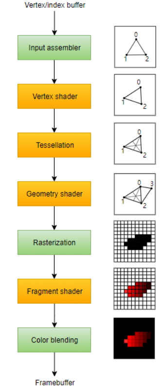

## C5

------

光照计算主要是在片元着色器中实现，为什么不在顶点着色器呢？这主要是顶点着色器会导致Spec部分的错误（color进行线性插值——错误的高光进行插值不会产生正确的高光）。

### 1. 抗锯齿

首先介绍的是 Sampling and Filtering Theory，主要是对==采样、重建、滤波（filtering）==的介绍。

- ==采样频率必须是被采样信号最高频率的两倍以上==。这就是通常所说的采样定理（==Nyquist limit==）
- 需要一个合适的filter去重建信号。请注意，滤波器的面积应始终为1，否则重建信号可能会出现增长或收缩
- 重采样用于放大或缩小一个采样信号。假设初始信号位于单位坐标系上（间隔为一进行采样）。那么在重采样的过程中，采样间隔a>1，则minification（==downSampling==），否则a<1，导致magnification（==upsampling==）。
- SSAA、MSAA（只对Z缓存（Z-Buffer）和模板缓存(Stencil Buffer)中的数据进行超级采样抗锯齿的处理）、TXAA
- Effective sampling patterns are a key element in reducing aliasing：RGSS
- ==MLAA==：这个技术作为==后处理==来进行。大概流程如下：找到似乎是边界的地方（对周围的像素进行分析，给出边界的可能性），然后处理他（根据覆盖值处理颜色，下图右）
- ==DLAA==（directionally localized antialiasing ）：基于这样的观察：接近垂直的边缘应该在水平方向上模糊，同样接近水平方向上模糊应该在垂直方向上模糊。
- 最流行的两种算法是：==FXAA（fast approximate antialiasing ）和SMAA（subpixel morphological antialiasing ）==，流行的部分原因其高度的可移植性。

### 2. 透明

为了正确地渲染透明对象，我们需要在不透明对象之后绘制它们。而在绘制半透明物体时，也要按照==从远到近的顺序==，否则视觉上会不正确。一个简单的方法是根据它们到视点的距离进行排序。

==over==操作：$c_o=\alpha c_s+(1-\alpha_s)c_d\quad[over \quad operator]$。缺点：正常世界中，通过红色透明物体观看蓝色物体，蓝色物体应该呈现黑色（几乎没有光会通过红色物体，特别是足够的蓝光），但over操作则是红蓝的部分相加。

==additive blending==：$c_o=\alpha_s c_s+c_d$。==这种混合模式可以很好地用于发光效果==，如闪电或火花，它们不会使后面的像素衰减，而只是使它们变亮。

==under operator==  ：先渲染背面，然后渲染正面。==个人觉得under的重点在于Alpha值的更新，这个允许我们从前往后进行渲染，另外一个角度来说，需要一个额外的Buffer来存储Alpha==
$$
\begin{align}
c_o&=\alpha_dc+(1-\alpha_d)\alpha_sc_s\quad [under \quad operator]\\
a_o&=\alpha_s(1-\alpha_d)+\alpha_d=\alpha_s-\alpha_s\alpha_d+\alpha_d
\end{align}
$$
**under操作**的另一个用途是==Order-Independent Transparency（OIT），known as depth peeling==  。这意味着程序不用多物体进行排序，背后的思想是使用两个**Z-Buffers**和**multiple passes**  。首先，正常渲染一次，所有物体的深度值被填入了Z-Buffer，然后第二次Render，所有透明物体被渲染，然后比较透明物体的深度和Z-buffer的深度，如果一致，说明这个透明物体离屏幕最近，然后将它的RGBA填入一个单独的Color_Buffer。

### 3. 伽马校正

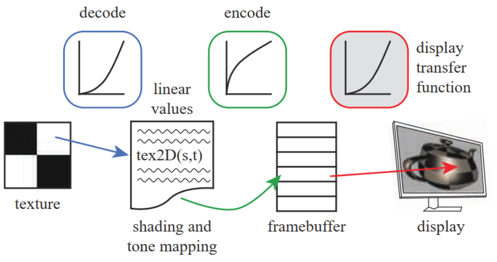

> ==个人理解==：首先对于各大相机厂商（索尼、三星等），它们为了解决CRT的问题，所以在处理拍摄的图像时，使用了光电处理方程（1/2.2次幂），进入了sRGB空间（即标准RGB颜色空间），这样的话就可以直接在CRT上呈现正确的图像（否则会偏暗）。在编程中，GPU自带的tex采样函数会自动进行解码处理，将sRGB重新转换到线性空间，所以这点在实际编程中是隐藏的，我们不用管，但在最终颜色计算完成后，我们需要重新编码：从流程角度，一个正常的图片（sRGB空间下）本来好好的，你却要解码，那么后面肯定要收尾，再次编码；从数值角度，0.5的最终颜色值，不经过伽马校正，输出近似0.25，而$((0.5)^{1/2.2})^2.2=0.5$。

## c6

------

#### 1. 纹理管道

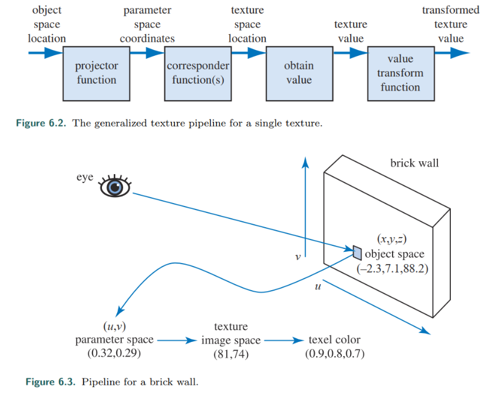

在OpenGL中，这种类型的对应函数称为“Wrapping mode”；在DirectX，它被称为“纹理寻址模式”。这类常见的函数有:

- wrap (DirectX), repeat (OpenGL), or tile ：图像在表面重复;算法上，纹理坐标的整数部分被删除。这个功能对于一个材料的图像重复覆盖一个表面非常有用，并且通常是默认的。

- mirror：也是重复，但是每次重新开始之前，会进行翻转。

- clamp (DirectX) or clamp to edge (OpenGL)  ：图像纹理边缘的重复。

- border (DirectX) or clamp to border (OpenGL)  ：自定义纯色。

### 2. 图像纹理

==Magnification==：对于纹理放大==最常见的过滤技术==是`nearest neighbor`（实际上是Box Filter）和`bilinear interpolation`（双线性插值）。

==Minification==：以上方法都不太好。解决锯齿的方法主要是采样和过滤技术的优化。纹理的信号频率取决于它的纹理在屏幕上的距离有多近。在奈奎斯特极限下，我们需要确保==纹理的信号频率不大于采样频率的一半==。为了达到这个目标，==采样频率必须增加或者纹理频率必须降低==，，之前的算法都是增加采样频率，但这个是有极限的，所以我们在后者想办法。

- **==Mipmapping==**  。高质量MipMap技术的两个关键点是==好的过滤器和伽马校正==。本技术的一个主要缺点是`overblurring`。

    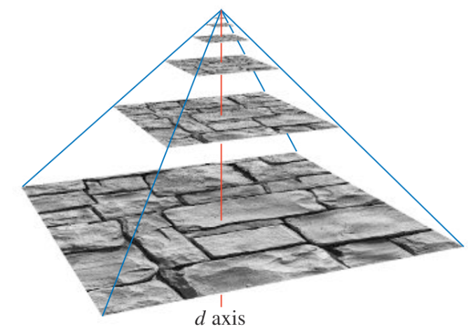

- **==Summed-Area Table==**  ：

    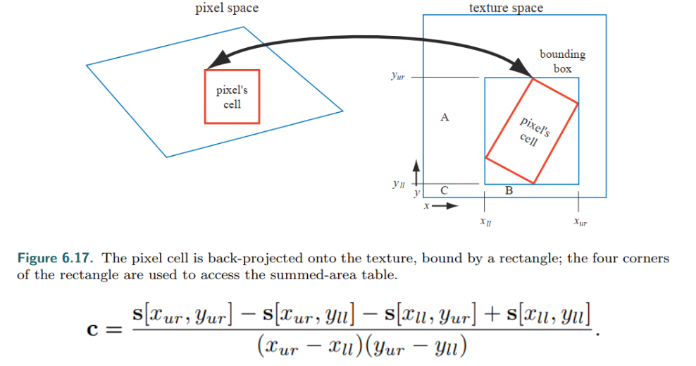

为了能够为==GPU批处理尽可能多的工作==，==通常倾向于尽可能少地改变状态==。为了达到这个目的，可以把几个图像放在一个更大的纹理中，称为纹理图集`texture atlas`。一个更简单的方法是使用`texture arrays`。

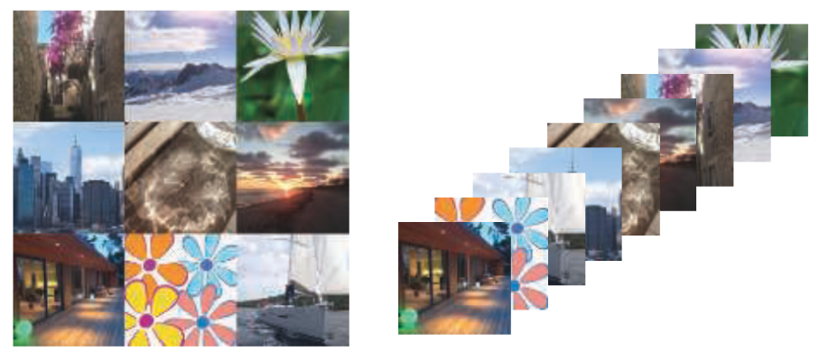

### 3. Alpha Mapping

==decaling==`：贴花是纹理相关的一个应用。通常情况下，`clamp corresponder function`与透明边框一起使用，以将贴花的单个副本（与重复的纹理）应用到表面。下图是应用贴花的一个例子：

另外一种应用是==making cutout==。假设你制作了一个灌木的贴花图像，并将其应用到场景中的一个矩形上。**原理和贴花是一样的，但不是与底层表面平齐，灌木将绘制在任何几何图形的顶部**。通过这种方式，使用一个单一的矩形，你可以渲染一个具有复杂轮廓的对象。但是，如果视点移动，则很明显会发现灌木的"真相"，一个解决方案是：复制这个矩形，并将复制体旋转90度，产生一个廉价的三维灌木`cross tree`。

`Alpha Blending`==透明度混合==允许使用部分透明度值，可以对边缘进行抗锯齿处理，也可以对部分透明的对象进行抗锯齿处理。但是，它要求必须先渲染不透明物体，而且透明物体的面片必须按照从前往后的顺序进行渲染。

在渲染时，这个问题可以通过几种不同的方式加以改善。一种是使用==alpha测试==`alpha testing`：$if(texture.a<alphaThreshold) discard;$

### 4. Bump Mapping

==TBN矩阵==：将指定向量从**世界空间**转换到**切线空间**

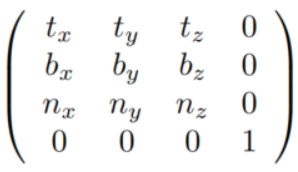

`Offset vector bump map`or`offset map`：对于每个法线，存储了两个值$(b_u,b_v)$，这两个值分别是图像坐标(u,v)的数值，然后加在n上。

`heightfield`：每个单色纹理值代表一个高度，所以在纹理中，白色是高区域，黑色是低区域(反之亦然)。heightfield用于推导u和v符号值，类似于在第一种方法中使用的值。

==过滤法线贴图==是一个困难的问题。一般来说，法线和最后渲染结果之间的关系不是线性的，所以标准的滤波方法可能会导致令人讨厌的锯齿。

### 5. Parallax Mapping

==视差映射的关键思想==是通过检查可见物体的高度，对一个像素中应该看到的东西进行有根据的猜测。(假定：像素的高度和其邻居是近似的)

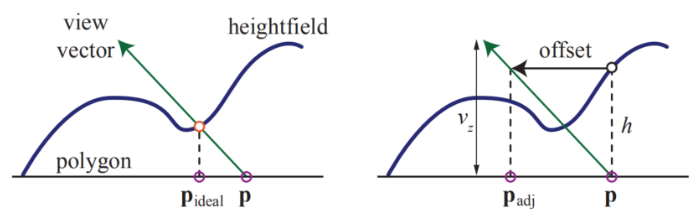

==Parallax Occlusion Mapping==：到目前为止讨论的方法都不会导致遮挡、阴影。我们想要的是在像素处可见的东西，也就是说，在视图向量第一次与高度场相交的地方。目前，主要的研究方向是使用==RayMarching==（将高度数据存在纹理里，这个方法可以在pixel shader中实现）。这些算法统称为`Parallax occlusion mapping`（==POM==）or `relief mapping`。

## C7

------

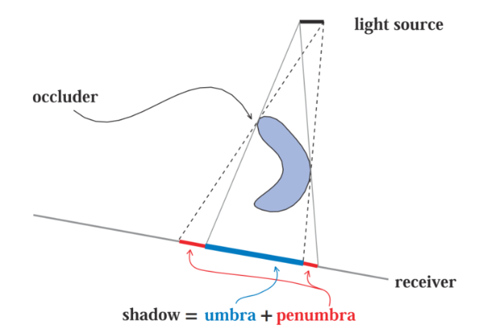

### 1. Shadow Maps

阴影贴图技术的==主要缺点==是：实现效果依赖于阴影图的分辨率和`Z-buffer`的数值精度。离物体交接的地方越近，锯齿问题越容易出现，一个常见的问题就是`self-shadow aliasing`——a triangle is incorrectly considered to shadow itself 。出现这个问题有两个主要原因：1.存储精度，2.几何原因，**阴影贴图的采样位置和该点的位置并不完全对应，一般偏小**。

一个常见的解决方法就是引入`bias`——从物体到视点的距离中减去它。除了使用常量，一种更有效的方法是使用<与**接收者对光的角度**成比例>的偏差——==倾斜角度越大，偏置就越大==。这种技术被称为`slope scale bias`

### 2. 阴影的抗锯齿问题

==Matrix-Warping==：除了这个矩阵，不需要额外的工作。通过分析这些技术，就采样和锯齿问题来说，==最好的解决方案是让View和Light垂直==。当光源在摄像机的正前方时， 上诉`matrix-warping  `方法是无效的

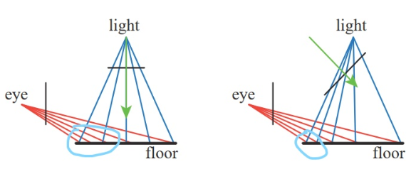

==Cascaded Shadow Maps==：将视点的`frustum volume `按照`view direction  `分解成几部分（如上图）。随着深度增加，每个块的深度范围都是上一个的2到3倍。对于每一个`frustum volume`，光源都会生成一个`frustum`来绑定它，然后生成`shadow map`。

- 关键是：如何在场景内划分`z-depths  `的范围
- ==这个算法的难点==在于怎么设置`near plane  `——设置的太远会导致物体被Clipped。
- ==这个算法的另外一个问题是：保存采样的稳定性==（帧间，以及移动物体）。当物体穿越两个阴影贴图是，阴影会发生突变，一个解决思路是：让两张阴影贴图有轻微的重叠，在重叠处进行混合采样。

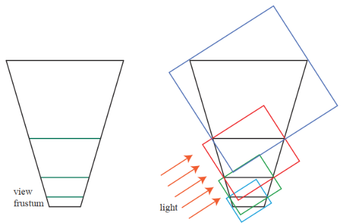

### 3. Percentage-Closer Filtering

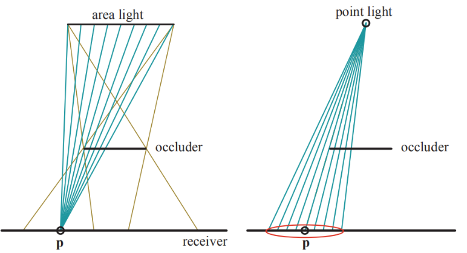

这种方法相当于在`punctal light`的情况下，来模拟区域光的效应。在PCF的情况下，Self-shadowing等问题更加明显，而`Slope scale bias`等技术效果变差，由此提出了新的技术`bias cone`）——每个样本向光移动，其移动距离与***离原始样本的距离***成正比。

==PCF算法最明显的局限是==：采样区域是固定的——软阴影的范围是固定的（the same penumbra width）。==特别是在物体间接触的情况下，这种处理是不对的。==

### 4. Percentage-Closer Soft Shadows

思路：在`shadow map`上搜索附近区域（原始采样点对应的texel为中心），来寻找所有可能的`occluders`，然后根据这些`occluders`到光源的平均距离，来更新采样区域`Sample area`：(d~r~是接受者到光的距离，d~o~是投影者的平均距离)：
$$
w_{sample}=w_{light}\frac{d_r-d_o}{d_r}
$$

## C8

------

### 1. 光的量化

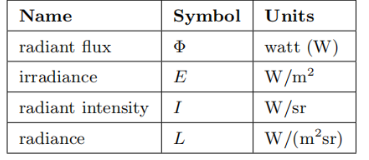

人类大概可以分辨1000万种颜色，对于颜色感知，==视网膜上有三种不同类型的锥体感受器==`cone receptors`，每一种感受器对不同的波长有不同的反应。==所以，对于一个给定的SPD，我们的大脑只通过这些感受器接收三种不同的信号==。这就是为什么只用三个数字就可以精确地表示任何颜色 。

### 2. Tone Mapping

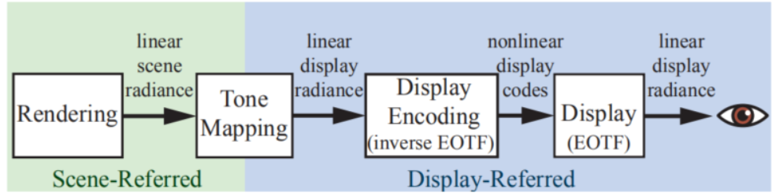

==为了理解色调映射的目的==，最好把它看作是一种图像复制。应该给予观看者，和原始图像一样的观看体验。但考虑到场景的亮度范围要超过显示器几个数量级，所以完美的复制是困难的；此外，场景中一些颜色的饱和度也可能远远超过硬件显示能力。

一个sigmoid（S型）的色调再现曲线` tone-reproduction`。

==曝光的概念是色调映射的关键==。在摄影中，曝光是指：控制照射在胶片上的光量。然而，在渲染中，曝光是：在应用**色调还原变换**`tone reproduction transform`之前，对图像进行线性缩放操作。曝光的棘手之处在于：确定使用什么比例因子。

## C9

------

### 1. Physics of Light

当讨论光散射时，粒子`particles`用于指孤立的分子和多分子团簇。由于来自多分子聚簇（直径小于波长）的散射是来自孤立分子的散射的放大，它表现出相同的方向变化和波长依赖性。这种类型的散射在大气粒子中称为`Rayleigh scattering`，在固体颗粒中称为`Tyndall scattering`。当粒子越来越大，散射光的波长依赖性越来越低，这种类型的散射称为`Mie scattering`。

`index of refraction`（==IOR==、折射率，用n表示）。有些介质具有吸收性，其中的光，随着距离的不断深入，强度逐渐衰减——下降的速率被称为`attenuation index`（用 $\kappa$ 表示）。这两者通常组合起来，$n+i\kappa$，称之为==复折射率==`complex index of refraction`。

折射光的角度和入射光的角度之间的关系：(==Snell’s law==)
$$
sin(\theta_t)=\frac{n_1}{n_2}sin(\theta_i)
$$

### 2. Fresnel Reflectance

渲染程序中，在掠射角附近，反射率增加的现象叫做`Fresnel effect`。而在渲染中，直接使用菲涅尔方程是困难的（方面有很多，比如：它要求我们对可见光谱进行采样，获得折射率）。==Schlick给出了菲涅耳反射系数的近似==：（这个函数明显是：在F~0~和white间进行插值，简单但精确）
$$
F(n,l)=F_0+(1-F_0)(1-(n\cdot l)^+)^5
$$

### 3. Microfacet Theory（微平面理论）

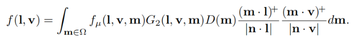

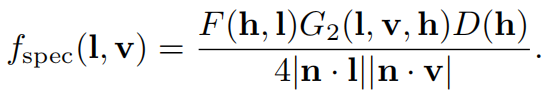

微平面理论的一个重要性质就是：==微观法线的统计分布== [over the microgeometry surface area ]。这种分布可以通过==normal distribution function==（NDF，D(m) ）进行描述。

可见微面的投影面积之和等于宏观表面的投影面积。我们可以通过定义==masking函数==G~1~(m, v)来数学地表达这一点。結合上面的NDF，求球面积分，可得到：可见微表面在视线垂直平面上的投影面积。$G_1(m,v)\cdot D(m)$就是所谓的`distribution of visible normals `。

==Smith Masking==，Heitz还提出了一种结合了方向和高度相关性的Smith G~2~。

### 4. BRDF Models for Surface Reflection

Beckmann NDF是第一批微表面模型中使用的法线分布。它至今仍广泛使用，也是Cook-Torrance BRDF选择的NDF。标准化的形式如下：

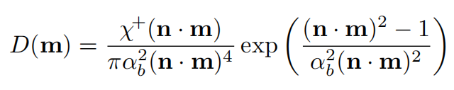

GGX distribution及其变体，是如今电影和游戏种，使用==最为广泛的方法==（也叫`Trowbridge-Reitz distribution`）

GTR：许多真实世界的材料显示出类似的模糊亮点，且尾部通常比GGX分布更长，这是GGX日益流行的一个重要因素。Burley提出了``generalized Trowbridge-Reitz `(==GTR==) NDF，其目标是：==对NDF的形状进行更多的控制，特别是尾部==。

==生成各向异性NDF的一个常见方法：是在一个已经存在的各向同性NDF上进行扩展==。

### 5. BRDF Models for Subsurface Scattering

==Smooth-Surface Subsurface Models==：

Shirley等人提出了平坦表面` flat surfaces`的==耦合漫射项==，解决了菲涅尔效应和`surface-subsurface`反射的权衡问题，同时支持能量守恒和赫尔姆霍兹互易性` Helmholtz reciprocity`：
$$
f_{diff}(l,v)=\frac{21}{20\pi}(1-F_0)\rho_{ss}(1-(1-(n\cdot l)^+)^5)(1-(1-(n\cdot v)^+)^5)
$$
==Rough-Surface Subsurface Models==：

## C10

------

### 1. 区域光

对于理想的郎伯平面，可以使用一个不基于物理，但有效的方法来近似区域光（之前的Fig 4）：`wrap lighting`。寒霜的一个实现如下：
$$
E=\pi c_{light}(\frac{(n\cdot l)+k_{wap}}{1+k_{wap}})^+ \quad (10.9)
$$
most representative point：其基本思想是——使用一个基于渲染点而改变的光矢量`light vector`，来表示区域光。修改光矢量，使其朝向区域光的表面上，产生最大能量贡献的点（上图右:arrow_up:）。

LCTs：以上所有的算法，都基于假设对模型进行简化，然后通过对结果积分进行拟合。==H神提出了一种不同的、通用的、精确的思路==——` linearly transformed cosines`（LTCs）。基本思路：首先设计一类球面函数，这类函数既具有很强的表现力(即可以有多种形状)，又可以很容易地集成在任意球面多边形上

### 2. Environment Mapping

==由于入射光L~i~只取决于方向，它可以存储在一个二维表中==。这种表示方法使我们能够有效渲染任何形状的镜面（并带有任意的入射辐射分布）。我们通过计算每个点的R，并在表中查找`radiance`来实现这一目的。这张表就叫做Environment Mapping，

==这种思想也被称为基于图像的照明(IBL)==，通常，这里的环境地图是从真实场景中获得得——使用摄像机捕捉360度全景、高动态范围（HDR）图像。

==Latitude-Longitude Mapping==：此算法中，反射向量被转化成球坐标$(\rho,\phi)$

==Sphere Mapping==：技术的纹理生成过程：在一个完美反射球体中，正投影观察环境。得到的圆形图像也被称为`light probe`。

==Cube Mapping==：这种方法是目前最流行的方法，它的投影`projection`直接在现代GPU上集成了。

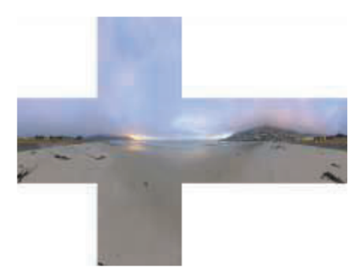

### 3. Specular Image-Based Lighting

当光源无限远时，环境映射也被称为`specular light probes`。之所以使用这个术语，是因为它们捕捉了场景中给定点的，各个方向上的亮度，并使用该信息来计算一般的BRDFs，但不仅限于pure mirrors or Lambertian surfaces。而`specular cube maps`则是使用环境映射技术来模拟光滑表面的反射。

为了体现表面的粗糙度，环境贴图需要进行预过滤`prefiltered`。而这种模糊应该是非线性的，不同的纹理部分应该以不同的方式进行过滤。

 

## C11

------

light map是==存储预先计算的照明==的常见方式之一，且通常不需要使用mip map，因为其分辨率通常是很低的:arrow_down:。为了在纹理中存储光照，对象需要提供一个` unique parameterization`。当把一个漫反射颜色纹理映射到一个模型上时，==对于网格的不同部分使用相同的纹理区域通常是很好的==，

RSM：此方法的思想和阴影贴图的思想近似，但在第一次Pass中，存储的不仅是深度，还有击中点的反射率、法线、直接照明。然后在第二次Pass中，每个纹理`texel`当做一个间接光源。当然，对于每一个点，我们只需要考虑其中的一个小子集的影响。更为好的**优化**是：==将这个纹理模拟成几个屏幕空间的点光源==。

Light propagation volumes（LPV），其**灵感**来自辐射传播中的`discrete ordinate methods`。思路：场景被分解成一个规则的**三维单元网格**。每个单元存储了经过它的辐射率的**方向分布**`directional distribution `。**[854]**

- 在第一步中，光线被注入到**包含直接光照亮的表面**的单元格`CELL`中。可以使用**RSM**来找到这些单元格。注入的光线是表面反射的亮度`radiance`。因此，==它在法线周围形成一个分布==，并从材质的`albedo`获得它的颜色。
- 接下来，光线被传播`propagated`。每个单元**分析**相邻单元的**radiance fields**。然后，修改自己的分布，以考虑来自各个方向的辐射。
- 每一次迭代，只传播到相邻的单元格中。因此需要多次迭代:arrow_down:。

## C12

------

