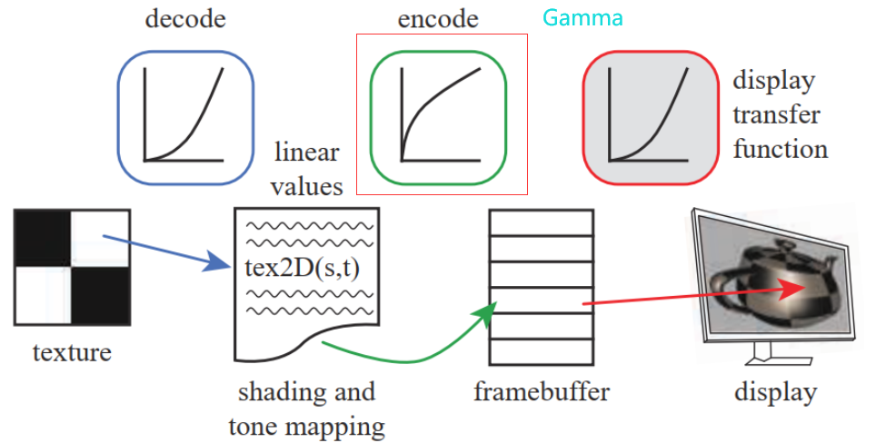
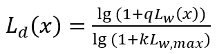
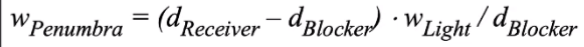
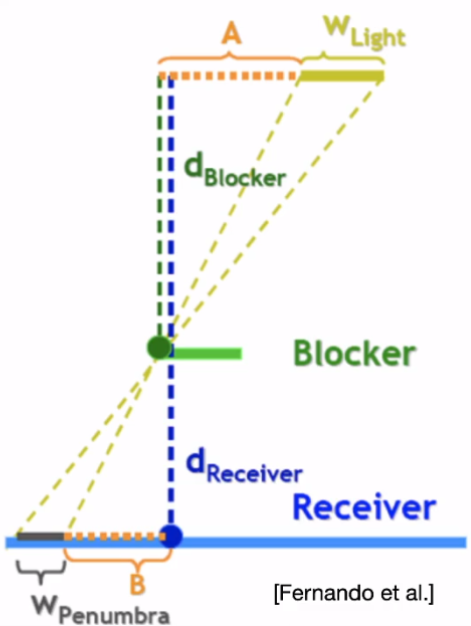

[toc]


# 1. 基础（死硬问题）

## 给定点集求凸包

[Graham扫描法](https://zhuanlan.zhihu.com/p/340442313)：

1. 容易发现，**最左下角**的一个点（这里指以横坐标为第一关键词、纵坐标为第二关键词排序后最小的点）是必然在凸包上的。我们以这个点为极点进行**极角排序**。将极角排序后的点依次相连即可得到一个包围所有点的多边形。
2. 我们维护一个**栈**，按照极角排序后的顺序遍历每个点。如果栈中点数小于3，就直接进栈；否则，检查栈顶三个点组成的两个向量的旋转方向是否为**逆时针**（这可以用叉乘判断），若是则进栈，若不是则弹出栈顶，直到栈中点数小于3或者满足逆时针条件为止。
3. 在极角排序的情况下，如果想要组成凸多边形，向量就肯定应该不断逆时针旋转。


## 向量点乘和叉乘的几何意义:star:

**叉乘（Cross Product）**又称**向量积**：其运算结果是一个向量，并且与这两个向量都**垂直**，是这两个向量所在平面的**法线向量**。使用右手定则确定其方向。


## 如何判断点在三角形内:star:

如何判断一个点在三角形内部

+ https://zhuanlan.zhihu.com/p/356529702
+ **面积比较**
+ **向量叉乘**：若点O在三角形内部，则沿着三角形的边逆时针走，点O一定保持在边的左侧、
  + 计算**向量AO**与**向量AB**的叉乘的值为**正**，则表示**O在AB的左侧**，反之为右侧。


## 如何判断点在矩形内

[Todo](https://www.programminghunter.com/article/3714369336/)


## 如何判断一个多边形是凸多边形

[Graham扫描法](https://zhuanlan.zhihu.com/p/340442313)：

+ 类似**给定点集求凸包**：只要有**点**弹出，那么就说明不是凸多边形


## 已知法线向量和入射向量求反射向量

$$
R=V-2\cdot dot(N,V)\cdot N
$$


## 叉乘求多边形面积


**点**的记录必须要==逆时针顺序==。


## 齐次坐标:star::star:

+ **使用齐次坐标，可以表示：平行线在透视空间的无穷远处交于一点。**
+ **齐次坐标的作用**：把各种变换都统一了起来——把缩放，旋转，平移等变换都统一起来，都表示成一连串的矩阵相乘的形式。**==合并矩阵运算中的乘法和加法==**


## 空间点到空间三角形的最近距离

个人理解：首先求点到三角形所在平面的**最短距离**，以及**投影点**，然后区分这个投影点**是否在三角形内**：

+ 在内部，那么最短距离已经算出了
+ 否则，求离投影点最近的三角形顶点，然后以空间点，投影点、三角形顶点构建三角形，三角形斜边就是最短距离。


## 法线矩阵:star::star:

+ 为什么不用`ModelViewMatrix`：`ModelViewMatrix`可能包含**非均匀的缩放**

  |  |  |
  | ------------------------------------------------------------ | ------------------------------------------------------------ |

+ 法线矩阵：$(M^{-1})^T$（在世界空间进行光照计算）

  + 把法线从**局部空间**变换到**世界空间**

+ TBN矩阵：切线空间-->局部空间

  + 用于`Normal map`的采样转换


## 裁剪空间:star::star:

+ P矩阵后的结果：会进行**视锥体裁剪**（齐次空间裁剪）
+ 之后进行**齐次除法**，会得到**NDC空间**——$[-1,1]$
+ 然后进行`Screen Remapping`


## 视锥体如何定义

+ 长度、长宽比、FOV、Far/Near Clip Plane


## 欧拉角:star::star:

+ 优缺点
  + 简单，三个数就能表示出来
  + 万向节死锁
  + 插值误差大
  + 欧拉角的种类太多（`24`种），不同专业背景之间的沟通容易出问题


## 万向锁:star::star::star:

+ **动态欧拉角**必然会造成的
+ 表现：Y轴与Z轴重合，调节效果一致，产生万象锁问题，**Z轴看起来不再生效**
+ 本质：失去了一个轴的自由度
+ 产生万向锁：先绕z轴旋转`α`度，再绕y轴旋转`90`度，再绕x轴旋转`β`度


## 四元数:star::star:

+ 四元数可以抽象地理解成对一种三维旋转方式的代表，这个旋转方式由两部分组成：一部分是**旋转轴**；另一部分则是绕该旋转轴**旋转角度**，逆时针为正。

+ $(\theta,u_x,u_y,u_k)$，四元数`q`可以构造为：

  ![[公式]](面经题_计算机图形学_汇总.assets/theta)u_zk.svg+xml)

+ 假设有一个向量$v=(0,b,c,d)=bi+cj+dk$，一个代表旋转的四元数$q=(e,i,j,k)$

  + 第一步：$v1=q\cdot v$

    ![[公式]](https://www.zhihu.com/equation?tex=v_1+%3D+%28ae-bf-cg-dh%29%2B+%5C%5C%28be%2Baf-dg%2Bch%29i%2B+%5C%5C%28ce%2Bdf%2Bag-bh%29j%2B+%5C%5C%28de-cf%2Bbg%2Bah%29k)

  + 第二步（同上）：$v2=v1\cdot q^{-1}$
  + $v2$就是旋转后的向量


## GPU渲染管线:star::star::star:

大致过程：

+ **应用程序阶段**：数据准备、碰撞检测、加速算法、输入检测，动画，力反馈以及纹理动画，变换 仿真、几何变形等
+ **顶点着色**：MVP变换等
  + 顶点着色的结果，会被发送到**光栅化阶段**以进行**插值操作**。
+ **裁剪 Clipping**：视锥体裁剪
+ **齐次除法、屏幕映射**
+ ==光栅化阶段==
  + 三角形设定（`Triangle Setup`）阶段
  + 三角形遍历（`Triangle Traversal`）阶段：将进行**逐像素检查操作**，检查该像素处的像素中心**是否由三角形覆盖**，而 对于有三角形部分重合的像素，将在其重合部分生成**片段（fragment）**。
  + 像素着色（`Pixel Shading`）阶段
  + 融合（`Merging`）阶段：
    + 负责可见性问题的处理——Z 缓冲算法：比较z值，决定是否更新相应像素
    + ==alpha测试、深度测试、模板测试、Alpha Blend依次进行==


## 手系问题:star:

+ 左手坐标系（**+z轴**指向**前方**）：局部空间，世界空间
+ 右手坐标系（**+z轴**指向**后方**）：视图空间


## 正交投影和透视投影有什么区别？

+ 大小一致、近大远小
+ 平行线是否相交


## 视口变换时深度值如何处理？

**存入深度缓冲**


## 片元是什么？和像素有什么不同

+ 片元本质不是像素,它是潜在的像素。
+ 片元经过着色、深度测试、模板测试，最终才能成为像素


## 顶点着色和片元着色

+ 顶点着色：为多边形着上**渐变色**。它所渲染出的物体具有相当丰富的颜色和平滑的变色效果，不过其着色速度比[平面着色](https://baike.baidu.com/item/平面着色)要慢得多。


## 基础光照模型:star:

+ **Lambert光照模型**
  $$
  L_o=L_{light}\cdot Diffuse\cdot dot(N,L)
  $$

+ **Gouraud着色模型**：顶点着色

+ **Phong模型**
  $$
  L_o=L_{light}\cdot Spec \cdot dot^+(R,V)^m
  $$

+ **Blinn-Phong光照模型**
  $$
  L_o=L_{light}\cdot Spec \cdot dot^+(N,H)^m
  $$

  + 优点：**减少计算量**


## 法线贴图

法线贴图（NormalMap）存储的是**表面的法线方向**。而方向是相对于坐标空间而言的。通常法线有两种坐标空间：Tangent Space（切线空间）、Object Space（对象空间或模型空间）

+ **Tangent Space法线贴图**看上去通常大部分是浅蓝色，**Object Space法线贴图**则五颜六色

+ ==过滤法线贴图==是一个困难的问题：法线和最后渲染结果之间的关系不是线性的


## 伽马矫正:star:

$$
L_o=L_i^{1/2.2}
$$




## HDR (Tone Mapping):star:

+ HDR：显示器被限制为只能显示值为`0.0`到`1.0`间的颜色，但是在光照方程中却没有这个限制。通过使片段的颜色超过1.0，我们有了一个更大的颜色范围，这也被称作**HDR(High Dynamic Range, 高动态范围)**。有了HDR，亮的东西可以变得非常亮，暗的东西可以变得非常暗，而且充满细节。

+ **色调映射算法**的目的：在于将**HDR图像的亮度**进行压缩，进而映射到LDR显示设备的显示范围之内

+ Reinhard色调映射

  ```c++
  vec3 hdrColor = texture(hdrBuffer, TexCoords).rgb;
  // Reinhard色调映射
  vec3 mapped = hdrColor / (hdrColor + vec3(1.0));
  ```

+ 曝光(Exposure)参数的使用 + 指数映射

  ```c++
  vec3 hdrColor = texture(hdrBuffer, TexCoords).rgb;
  // 曝光色调映射
  vec3 mapped = vec3(1.0) - exp(-hdrColor * exposure);
  ```

+ log映射（$q,k$ 是用户自定义参数）

  


# 2. 阴影

## ShadowMap:star::star:

+ 基本流程摘要

  + 投影矩阵：使用正交投影（方向光）、透视投影（点光源等）

  ```c++
  glm::mat4 lightProjection = glm::ortho(-10.0f, 10.0f, -10.0f, 10.0f, near_plane, far_plane);
  ```

  + 对象的世界坐标，乘以`LightM`，得到的`Light_UV`，要进行**齐次除法**，然后`remapp`到$[0,1]$，采样得到`closestDepth`
  + 比较深度

  ```c++
  float shadow = currentDepth > closestDepth  ? 1.0 : 0.0;
  ```

+ 改进

  + Bias
    $$
    0.05*(1.0-N\cdot L)
    $$
    

+ 透视投影矩阵：深度变成了**非线性的深度值**，它的大多数可辨范围都位于近平面附近。为了可以像使用正交投影一样合适地观察深度值，你必须先将**非线性深度值**转变为**线性的**

  ```c++
  float LinearizeDepth(float depth)
  {
      float z = depth * 2.0 - 1.0; // Back to NDC 
      return (2.0 * near_plane * far_plane) / (far_plane + near_plane - z * (far_plane - near_plane));
  }
  ```

  


## 反向Z:star:

透视投影导致：深度分布不均，为了解决深度分配不均的问题。**==反向z==使得各处的精度都得到保证**。反向z的实现很简单，只需要：

+ [修改投影矩阵](https://zhuanlan.zhihu.com/p/505589251)，使**近平面处的像素**映射至**NDC下1.0坐标**，**远平面处像素**映射至**NDC下的0.0坐标**。
+ ZTest改为Greater


## PCF和PCSS（软影算法）

:one:简单PCF算法：

```c++
float shadow = 0.0;
vec2 texelSize = 1.0 / textureSize(shadowMap, 0);
for(int x = -1; x <= 1; ++x)
{
    for(int y = -1; y <= 1; ++y)
    {
        float pcfDepth = texture(shadowMap, projCoords.xy + vec2(x, y) * texelSize).r; 
        shadow += currentDepth - bias > pcfDepth ? 1.0 : 0.0;        
    }    
}
shadow /= 9.0;
```

+ 缺点：软阴影区域固定，特别是在物体间接触的情况下，这种处理是不对的。

:two:Percentage-Closer Soft Shadows（`PCFF`）算法

1. Block Area搜索，得到遮挡物==到光源的平均距离==

2. 计算软阴区域（宽度）

   

   

3. 使用计算的`w`，进行**PCF算法**


# 3. 抗锯齿

## 抗锯齿算法

详见笔记。

+ 