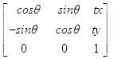
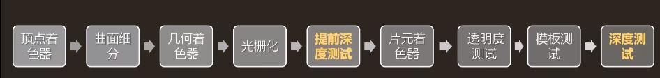
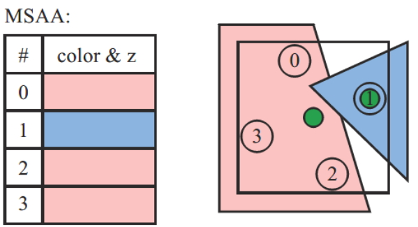

[toc]


# 1. 基础（死硬问题）

## 给定点集求凸包

[Graham扫描法](https://zhuanlan.zhihu.com/p/340442313)：

1. 容易发现，**最左下角**的一个点（这里指以横坐标为第一关键词、纵坐标为第二关键词排序后最小的点）是必然在凸包上的。我们以这个点为极点进行**极角排序**。将极角排序后的点依次相连即可得到一个包围所有点的多边形。
2. 我们维护一个**栈**，按照极角排序后的顺序遍历每个点。如果栈中点数小于3，就直接进栈；否则，检查栈顶三个点组成的两个向量的旋转方向是否为**逆时针**（这可以用叉乘判断），若是则进栈，若不是则弹出栈顶，直到栈中点数小于3或者满足逆时针条件为止。
3. 在极角排序的情况下，如果想要组成凸多边形，向量就肯定应该不断逆时针旋转。


## 向量点乘和叉乘的几何意义:star:

**叉乘（Cross Product）**又称**向量积**：其运算结果是一个向量，并且与这两个向量都**垂直**，是这两个向量所在平面的**法线向量**。使用右手定则确定其方向。


## 如何判断点在三角形内:star:

如何判断一个点在三角形内部

+ https://zhuanlan.zhihu.com/p/356529702
+ **面积比较**
  + 一个三角形的三个边长为 $a,b,c$。
  + 求参数：$p=0.5\cdot (a + b + c)$
  + 面积：$Area=\sqrt{p\cdot(p-a)\cdot(p-b)\cdot(p-c)}$

+ **向量叉乘**：若点O在三角形内部，则沿着三角形的边逆时针走，点O一定保持在边的左侧、
  + 计算**向量AO**与**向量AB**的叉乘的值为**正**，则表示**O在AB的左侧**，反之为右侧。


## 手动写叉乘

若向量$a=(a1,b1,c1)$，向量$b=(a2,b2,c2)$， 则


## 射线与平面相交

两者的定义如下

```c++
p(t) = p0 + t * u //这里的p0是射线的起点　

n *(p - p1) = 0 //这里的p1是平面所过的点
```

求解

```c++
  t = n * (p1 - p0) / n * u
```

若$t∈[0,∞)$，则射线与平面相交，且交点为 $p0 + t*u$。


## 如何判断射线和三角形相交

1. 首先判断射线和三角形所在的平面相交，如果相交，求出交点
2. 判断这个交点，是否在三角形内部


## 如何判断射线和AABB盒相交

1. 判定射线和AABB所在的平面是否相交，若相交，求出交点，继续过程

2. 将AABB盒分成两个三角形

3. 依次进行交点在三角形内部的判断

4. 只要其中一个满足，就说明相交

   ```c++
   vec2 iBox(in vec3 ro, in vec3 rd, in vec3 rad)
   {
       vec3 m = 1.0 / rd;
       vec3 n = m * ro;
       vec3 k = abs(m) * rad;
       vec3 t1 = -n - k;
       vec3 t2 = -n + k;
       return vec2(max(max(t1.x, t1.y), t1.z),
                   min(min(t2.x, t2.y), t2.z));
   }
   
   ```

   


## 如何判断点在矩形内

[Todo](https://www.programminghunter.com/article/3714369336/)


## 如何判断一个多边形是凸多边形

[Graham扫描法](https://zhuanlan.zhihu.com/p/340442313)：

+ 类似**给定点集求凸包**：只要有**点**弹出，那么就说明不是凸多边形


## 两条线段相交判断

两条线段：`ab`和`cd`，需要同时满足：（也就是[相互跨越](https://zhuanlan.zhihu.com/p/37360022)）

+ $cross(ca,cd)\cdot cross(cb,cd) \leq 0$
+ $cross(ac,ab)\cdot cross(ad,ab) \leq 0$


## 已知法线向量和入射向量求反射向量

$$
R=V-2\cdot dot(N,V)\cdot N
$$


## 叉乘求多边形面积


**点**的记录必须要==逆时针顺序==。


## 齐次坐标:star::star:

+ **使用齐次坐标，可以表示：平行线在透视空间的无穷远处交于一点。**
+ **齐次坐标的作用**：把各种变换都统一了起来——把缩放，旋转，平移等变换都统一起来，都表示成一连串的矩阵相乘的形式。**==合并矩阵运算中的乘法和加法==**


## 空间点到空间三角形的最近距离

个人理解：首先求点到三角形所在平面的**最短距离**，以及**投影点**，然后区分这个投影点**是否在三角形内**：

+ 在内部，那么最短距离已经算出了
+ 否则，求离投影点最近的三角形顶点，然后以空间点，投影点、三角形顶点构建三角形，三角形斜边就是最短距离。


## 法线矩阵:star::star:

+ 为什么不用`ModelViewMatrix`：`ModelViewMatrix`可能包含**非均匀的缩放**

  |  |  |
  | ------------------------------------------------------------ | ------------------------------------------------------------ |

+ 法线矩阵：$(M^{-1})^T$（在世界空间进行光照计算）

  + 把法线从**局部空间**变换到**世界空间**

+ TBN矩阵：切线空间-->世界空间

  + 用于`Normal map`的采样转换


## 如果对一个模型仅沿X轴缩放，如何利用M矩阵计算光照？

法线乘逆转置矩阵


## 裁剪空间:star::star:

+ P矩阵后的结果：会进行**视锥体裁剪**（齐次空间裁剪）
+ 之后进行**齐次除法**，会得到**NDC空间**——$[-1,1]$
+ 然后进行`Screen Remapping`


## 视锥体如何定义

+ 长度、长宽比、FOV、Far/Near Clip Plane


## 欧拉角:star::star:

+ 优缺点
  + 简单，三个数就能表示出来
  + 万向节死锁
  + 插值误差大
  + 欧拉角的种类太多（`24`种），不同专业背景之间的沟通容易出问题


## 万向锁:star::star::star:

+ **动态欧拉角**必然会造成的
+ 表现：Y轴与Z轴重合，调节效果一致，产生万象锁问题，**Z轴看起来不再生效**
+ 本质：失去了一个轴的自由度
+ 产生万向锁：先绕z轴旋转`α`度，再绕y轴旋转`90`度，再绕x轴旋转`β`度


## 四元数:star::star:

+ 四元数可以抽象地理解成对一种三维旋转方式的代表，这个旋转方式由两部分组成：一部分是**旋转轴**；另一部分则是绕该旋转轴**旋转角度**，逆时针为正。

+ $(\theta,u_x,u_y,u_k)$，四元数`q`可以构造为：

  ![[公式]](面经题_计算机图形学_汇总.assets/theta)u_zk.svg+xml)

+ 假设有一个向量$v=(0,b,c,d)=bi+cj+dk$，一个代表旋转的四元数$q=(e,i,j,k)$

  + 第一步：$v1=q\cdot v$

    ![[公式]](https://www.zhihu.com/equation?tex=v_1+%3D+%28ae-bf-cg-dh%29%2B+%5C%5C%28be%2Baf-dg%2Bch%29i%2B+%5C%5C%28ce%2Bdf%2Bag-bh%29j%2B+%5C%5C%28de-cf%2Bbg%2Bah%29k)

  + 第二步（同上）：$v2=v1\cdot q^{-1}$
  + $v2$就是旋转后的向量


## GPU渲染管线:star::star::star:

大致过程：

+ **应用程序阶段**：数据准备、碰撞检测、加速算法、输入检测，动画，力反馈以及纹理动画，变换 仿真、几何变形等
+ **顶点着色**：MVP变换等
  + 顶点着色的结果，会被发送到**光栅化阶段**以进行**插值操作**。
+ **裁剪 Clipping**：视锥体裁剪
+ **齐次除法、屏幕映射**
+ ==光栅化阶段==
  + 三角形设定（`Triangle Setup`）阶段
  + 三角形遍历（`Triangle Traversal`）阶段：将进行**逐像素检查操作**，检查该像素处的像素中心**是否由三角形覆盖**，而 对于有三角形部分重合的像素，将在其重合部分生成**片段（fragment）**。
  + 像素着色（`Pixel Shading`）阶段
  + 融合（`Merging`）阶段：
    + 负责可见性问题的处理——Z 缓冲算法：比较z值，决定是否更新相应像素
    + ==alpha测试、深度测试、模板测试、Alpha Blend依次进行==


## 手系问题:star:

+ 左手坐标系（**+z轴**指向**前方**）：局部空间，世界空间
+ 右手坐标系（**+z轴**指向**后方**）：视图空间


## 正交投影和透视投影有什么区别？

+ 大小一致、近大远小
+ 平行线是否相交


## 视口变换时深度值如何处理？

**存入深度缓冲**


## 片元是什么？和像素有什么不同

+ 片元本质不是像素,它是潜在的像素。
+ 片元经过着色、深度测试、模板测试，最终才能成为像素


## 顶点着色和片元着色

+ 顶点着色：为多边形着上**渐变色**。它所渲染出的物体具有相当丰富的颜色和平滑的变色效果，不过其着色速度比[平面着色](https://baike.baidu.com/item/平面着色)要慢得多。


## 基础光照模型:star:

+ **Lambert光照模型**
  $$
  L_o=L_{light}\cdot Diffuse\cdot dot(N,L)
  $$

+ **Gouraud着色模型**：顶点着色

+ **Phong模型**
  $$
  L_o=L_{light}\cdot Spec \cdot dot^+(R,V)^m
  $$

+ **Blinn-Phong光照模型**
  $$
  L_o=L_{light}\cdot Spec \cdot dot^+(N,H)^m
  $$

  + 优点：**减少计算量**


## 法线贴图

法线贴图（NormalMap）存储的是**表面的法线方向**。而方向是相对于坐标空间而言的。通常法线有两种坐标空间：Tangent Space（切线空间）、Object Space（对象空间或模型空间）

+ **Tangent Space法线贴图**看上去通常大部分是浅蓝色，**Object Space法线贴图**则五颜六色

+ ==过滤法线贴图==是一个困难的问题：法线和最后渲染结果之间的关系不是线性的


## alpha混合

+ 最常见的是`over`操作
  $$
  c_o=\alpha_s c_s+(1-\alpha_s)c_d
  $$

+ 添加混合（==additive blending== ）
  $$
  c_o=\alpha_s c_s+c_d
  $$

+ ==渲染顺序==：从远及近渲染多个透明物体

+ 使用`under`操作（具体见笔记）：可以**由近到远**

+ Order-Independent Transparency（顺序无关透明算法、`OIT`）：`depth peeling`

  + `depth peeling`是由近到远，所以要使用`under`操作

+ aplha混合时，注意：根据`Alpha`对`color`进行预计算


## compute shader

它就是**一个在GPU上运行的渲染(**[Rendering Commands](https://link.zhihu.com/?target=https%3A//www.khronos.org/opengl/wiki/Rendering_Command)**)命令,这个命令没有用户定义的输入，需要的输入来自管线中其他接口获取和它的内置输入，同样也没有输出，但是运算结果可以利用Shader storge buffers和Image Load Store的方式获取。可以声明全局共享变量，但是需要加barrier来保证线程的同步。**

**因此Compute Shader也叫计算管线，利用各种buffer来获取输入和结果，因为与渲染管线是分开的，所以效率会很高。**


## 了解光线追踪吗？路径追踪是什么？

从技术上讲，**光线追踪**主要是计算**反射和镜面反射**，朝光源方向再次发射一次光线，判断其是否为阴影后，计算直接光照。由于此时只计算了GI（全局光照）的镜面反射区域，所以**缺少GI的漫反射**。

简而言之，**路径追踪**是指，==通过光线追踪来实现全局光照（GI）==。它会计算所有的镜面反射和漫反射，更准确地可理解为，**利用光追来计算渲染方程**（rendering equation）。值得我们注意的是，在路径跟踪中，不需要单独计算直接光照。


## 延迟渲染:star::star:

**正向渲染**：对于每一个需要渲染的物体，程序都要对每一个光源每一个需要渲染的片段进行迭代

+ 浪费：很多片元不会显示
+ 光源数量限制

**延迟渲染**：

+ 第一个几何处理阶段(Geometry Pass)：先渲染场景一次，之后获取对象的各种几何信息，并储存在一系列叫做G缓冲**(G-buffer)**的纹理中。其中物体的几何信息有：
  + 位置（Position，也可以是深度，因为只要有深度和屏幕空间的uv就可以重建出位置）。
  + 法线（Normal）。
  + 材质参数(Diffuse Color, Emissive Color, Specular Scale, Specular Power, AO, Roughness, Shading Model, ...)。
+ 第二个光照处理阶段(Lighting Pass)中使用G缓冲内的纹理数据。在光照处理阶段中，我们渲染一个屏幕大小的方形，并使用G缓冲中的几何数据对每一个片段计算场景的光照
+ 缺点：带宽增加、不支持透明混合
+ ==法线存储的空间：世界空间==


## 提高渲染效率的方法，如何保证稳定帧率

+ 视锥体裁切
+ 四叉树：地形渲染必备方案
+ 八叉树
  + 裁切（包括但不限于镜头裁切）
  + 场景管理
+ LOD
+ GPU优化：Compute shader，CUDA，openCL，CUDNN
+ 合并渲染批次


## **动态批次合并**、**静态批次合并**、**GPU实例化:star:**

> [博客](https://zhuanlan.zhihu.com/p/350207301)

==动态合批==的原理简而言之就是把符合条件（**共享同一材质的多个模型**）通过一次draw call绘制，这个模型数据有一定的限制，一次动态合批只能处理900个float4的数据

==静态合批==会把**设置成static且材质相同的物体**预先进行**坐标转换**，运行时不再需要进行顶点坐标变换操作，会产生额外资源，**不会降低draw call**。类似于你提前把需要一起拿的书放在柜子上临近的位置，这样再拿的是不需要一本一本书去找。

==gpu instancing==是把**同材质同属性同Mesh的渲染对象**一次性执行渲染，它单次渲染对象上限是`1024`个。


## Shader优化❓️

+ **计算精度优化**
  + 对于**世界空间位置和纹理坐标**，使用`float`精度。
  + 对于其他一切（矢量，HDR颜色等），首先使用`half精度`，必要时增加精度。
  + 对于纹理数据的非常简单的操作，使用`fixed`精度。

+ 减少分支代码，避免for循环语句
+ 少用复杂的数学操作，尽量使用内置函数
  + 少用三角函数
+ 减少纹理采样次数


## 仿射变换:star::star::star:

==线性变换==有三个特点：

1. 变换前是直线，变换后依然是直线；
2. 直线比例保持不变
3. 变换前是原点，变换后依然是原点

==[仿射变换](https://blog.csdn.net/sinat_29957455/article/details/103845581?utm_medium=distribute.pc_relevant.none-task-blog-2~default~baidujs_baidulandingword~default-0-103845581-blog-115356839.pc_relevant_multi_platform_featuressortv2dupreplace&spm=1001.2101.3001.4242.1&utm_relevant_index=3)==也称`仿射投影`，是指几何中，**对一个向量空间进行线性变换并接上一个平移，变换为另一个向量空间**。所以，仿射变换其实也就是再讲如何来进行两个向量空间的变换。**仿射变换**有两个特点：

1. 变换前是直线，变换后依然是直线；
2. 直线比例保持不变

==少了原点保持不变这一条==，当然，也可以把仿射变换称作一个线性变换，==仿射变换矩阵==是齐次坐标形式的变换矩阵



> **仿射变换**：包括线性变换（旋转、剪切、缩放）及平移；特点：**平行的线变换后依然保持平行**。任意的仿射变换都能表示为乘一个矩阵(线性变换)，再加一个向量 (平移) 的形式． 
>
> **透射变换**：利用透视中心、像点、目标点三点共线原理，从一个平面投影到另一个视平面。特点：投影变换后的线不一定保持平行，对图形的扭曲能力更强。也被称为投影变换、共线性或单应性。
>
> [参考博客](https://blog.csdn.net/qq_42422981/article/details/104988300?spm=1001.2101.3001.6650.2&utm_medium=distribute.pc_relevant.none-task-blog-2%7Edefault%7ECTRLIST%7Edefault-2-104988300-blog-115356839.pc_relevant_multi_platform_featuressortv2dupreplace&depth_1-utm_source=distribute.pc_relevant.none-task-blog-2%7Edefault%7ECTRLIST%7Edefault-2-104988300-blog-115356839.pc_relevant_multi_platform_featuressortv2dupreplace&utm_relevant_index=4)


## [Early-Z](https://zhuanlan.zhihu.com/p/490138542)

:one:引擎位置



**在以下几种情况中，==Ealry-Z会不生效==**：

+ 开启`Alpha Test` 或 `clip/discard `等手动丢弃片元操作
+ 手动修改**GPU插值得到的深度**
+ 开启`Alpha Blend`
+ 关闭**深度测试**``epth Test`

:two:==严重缺点==

+ `early-z`的优化效果并不稳定，最理想条件下所有绘制顺序都是==由近及远==，那么`early-z`可以完全避免**过度绘制**。
+ 但是相反的状态下（==由远到近==），则会起不到任何效果。因为每次进行提前深度测试，都会通过

:three:优化方法：`Z-Prepass`技术

+ 方法1

  + 在第一个`Pass`，即`Z-Prepass`中，仅仅**只写入深度**，不计算输出任何颜色（有点像`G-buffer`）

  + 在第二个`Pass`中**关闭深度写入**，并且将**深度比较函数**设置为**相等（Equal）**。

  + 缺点：影响了批处理，增加`Draw Call`

    ```c++
    Shader "Custom/EarlyZPresentation"{
       Properties{ //.......}
       SubShader
        {
            Tags { "RenderType"="Opaque" }
            //Z-Prepass部分
            Pass
            {
                ZWrite On	        //开启深度写入
                ColorMask 0	        //关闭颜色输出
                CGPROGRAM
                //...这里省略了单纯地顶点变换计算部分
                ENDCG
            }
          
      //正常地计算输出颜色的Pass
            Pass
            {
            	Zwrite Off	//关闭深度写入
                ZTest Equal 	//深度相等为通过
                CGPROGRAM
                //...这里省略了顶点变换和颜色等计算部分
                ENDCG
            }
        }
    }
    ```

+ 方法2：提前分离的`PrePas`

  + 将原先第一个`Pass`（即`Z-Prepass`）单独分离出来为单独一个`Shader`，并先使用这个`Shader`将整个场景的Opaque的物体渲染一遍。（先提前渲染一遍场景）
  + 而原先材质只剩下原先的第二个Pass，仍然关闭深度写入，并且将深度比较函数设置为相等。


# 2. 阴影

## ShadowMap:star::star:

+ 基本流程摘要

  + 投影矩阵：使用正交投影（方向光）、透视投影（点光源等）

  ```c++
  glm::mat4 lightProjection = glm::ortho(-10.0f, 10.0f, -10.0f, 10.0f, near_plane, far_plane);
  ```

  + 对象的世界坐标，乘以`LightM`，得到的`Light_UV`，要进行**齐次除法**，然后`remapp`到$[0,1]$，采样得到`closestDepth`
  + 比较深度

  ```c++
  float shadow = currentDepth > closestDepth  ? 1.0 : 0.0;
  ```

+ 改进

  + Bias
    $$
    0.05*(1.0-N\cdot L)
    $$
    

+ 透视投影矩阵：深度变成了**非线性的深度值**，它的大多数可辨范围都位于近平面附近。为了可以像使用正交投影一样合适地观察深度值，你必须先将**非线性深度值**转变为**线性的**

  ```c++
  float LinearizeDepth(float depth)
  {
      float z = depth * 2.0 - 1.0; // Back to NDC 
      return (2.0 * near_plane * far_plane) / (far_plane + near_plane - z * (far_plane - near_plane));
  }
  ```

  


## 反向Z:star:

透视投影导致：深度分布不均，为了解决深度分配不均的问题。**==反向z==使得各处的精度都得到保证**。反向z的实现很简单，只需要：

+ [修改投影矩阵](https://zhuanlan.zhihu.com/p/505589251)，使**近平面处的像素**映射至**NDC下1.0坐标**，**远平面处像素**映射至**NDC下的0.0坐标**。
+ ZTest改为Greater


## PCF和PCSS（软影算法）

:one:简单PCF算法：

```c++
float shadow = 0.0;
vec2 texelSize = 1.0 / textureSize(shadowMap, 0);
for(int x = -1; x <= 1; ++x)
{
    for(int y = -1; y <= 1; ++y)
    {
        float pcfDepth = texture(shadowMap, projCoords.xy + vec2(x, y) * texelSize).r; 
        shadow += currentDepth - bias > pcfDepth ? 1.0 : 0.0;        
    }    
}
shadow /= 9.0;
```

+ 缺点：软阴影区域固定，特别是在物体间接触的情况下，这种处理是不对的。

:two:Percentage-Closer Soft Shadows（`PCSS`）算法

1. Block Area搜索，得到遮挡物==到光源的平均距离==

2. 计算软阴区域（宽度）

   

   

3. 使用计算的`w`，进行**PCF算法**


# 3. 抗锯齿

## 抗锯齿算法

详见笔记。

+ **超级采样抗锯齿（SSAA）**：这种抗锯齿方法先把图像映射到缓存并把它放大，再用超级采样 把放大后的图像像素进行采样，一般选取 2 个或 4 个邻近像素，把这些采样混合起来后，生 成的最终像素
+ **多重采样抗锯齿（MSAA）**： ==MSAA 只对 Z 缓存（Z-Buffer）和模板缓存 (Stencil Buffer)中的数据进行超级采样抗锯齿的处理==。可以简单理解为只对多边形的边缘进行抗锯齿处理。
+ **形态抗锯齿（[MLAA](https://blog.csdn.net/JMXIN422/article/details/122446803)）**
+ **快速近似抗锯齿（[FXAA](https://blog.csdn.net/JMXIN422/article/details/122240264)）**
+ **时间性抗锯齿（TXAA）**：Jittering samples、反向重投影、Sample accumulation、History Rejection。
+ HRAA、CFAA等


## [MSAA详解](https://www.cnblogs.com/ghl_carmack/articles/8245032.html):star:



:one:这里直接给出流程

1. 首先，**深度/模板缓冲**，**颜色缓冲**都是`4x`于原本的缓冲区。

2. 除了**深度/模板缓冲**，**颜色缓冲**，还有个`Coverage Mask `的纹理，它的大小应该是等于原缓冲区，它的`R G B A`通道分别对应`4`个子像素采样点的覆盖情况

3. 光栅化阶段，对于当前**三角形片元**，针对每一个**子像素采样点**（如上图，是`4`个）

   1. 进行==覆盖判断==（`Coverage Mask`）：当前**子像素采样点**，是否在这个**三角形片元**内

4. 如果`Coverage Mask `的值是`(0,0,0,0)`，则不进行后续操作——流程终止。

5. 执行**像素着色器**，进行**光照计算**。只要覆盖了，无论覆盖多少个采样点，都使用**当前片元的颜色**进行`fragment shading`

6. **裁剪**（`scissor reject`）完再执行是必须的，**要得到coverage mask，不仅仅看4个sample中是否被三角形覆盖到（光栅化），还要看是否在[scissor](https://www.zhihu.com/search?q=scissor&search_source=Entity&hybrid_search_source=Entity&hybrid_search_extra={"sourceType"%3A"answer"%2C"sourceId"%3A157756410})内部。**

7. 进行==遮挡判断==（**深度测试**）。

   1. 深度怎么来的？光栅化的时候应该做了：对三角形片元的三个顶点的深度，进行线性插值，得到像素中心处的深度（举个例子：红色梯形的三个覆盖采样点$(0,2,3)$，其**深度**都是一致的，都是当前片元，根据**像素中心绿点**，插值得到的**深度**）；然后和**4个子像素采样点**的深度进行比较（`GL_Less`）（上一个三角形片元的深度）

8. 深度测试通过，而且`Coverage Mask `也通过的，则将`fragment shading`得到的颜色，`copy`到对应的`color buffer 4x`的位置

9. 一般来说，绘制一个物体之后，不会立马进行`resolving`，而是继续**绘制场景**

10. 时机成熟后（例如：场景都画完了），进行`Resolving`操作，其中，**像素的颜色**可以简单的使用如下方法求出（==均值方法==）：
   $$
   C_{final}=\frac{\sum_{i=1}^{4}{C_{sample\_i}}}{4}
   $$
   而`Depth\Stencil `则可以使用 `Min`、`Max`、`Sample0 `三种模式。

   > 像超采样一样，**过采样的信号**必须重新采样到**指定的分辨率**，这样我们才可以显示它。这个过程叫==解析（resolving）==。在它最早的版本里，解析过程是在显卡的固定硬件里完成的。一般使用的采样方法就是==一像素宽的box过滤器==。


:two:`SSAA`和`MSAA`

+ `SSAA`所抵抗的抗锯是两个方面：
  + 一个方面是：光栅化阶段会产生锯齿（比如三角图元的边界）
  + 另一个方面是`pixel shader stage`（`shader`的本质是：通过`shader`输入参数，利用一个公式计算出结果，这个公式其实是个连续函数，而我们的`shader`执行次数确是有限的，所以本质上跟几何锯齿的产生原因一样，都是用离散有限的数据，表示一个连续的事物，如果要**抗shader锯齿**，那也自然而然是提升shader执行的次数频率，`SSAA`正是这样做的）。
+ `MSAA`只是做了**几何阶段的抗锯齿**（多生成了片元），而忽略**shader方面的锯齿**（这个就是为什么只算一次`fragmen`的原因，因为他不做shader方面的抗锯齿，所以`MSAA`的渲染质量其实是比`SSAA`要低的，其实**shader产生的锯齿**大多数情况下都没有**几何锯齿**那样明显，所以`MSAA`用这个细微的损失换来了性能上的提升）


# 4. 后处理

## 伽马矫正:star:

$$
L_o=L_i^{1/2.2}
$$


## HDR (Tone Mapping):star:

+ HDR：显示器被限制为只能显示值为`0.0`到`1.0`间的颜色，但是在光照方程中却没有这个限制。通过使片段的颜色超过1.0，我们有了一个更大的颜色范围，这也被称作**HDR(High Dynamic Range, 高动态范围)**。有了HDR，亮的东西可以变得非常亮，暗的东西可以变得非常暗，而且充满细节。

+ **色调映射算法**的目的：在于将**HDR图像的亮度**进行压缩，进而映射到LDR显示设备的显示范围之内

+ Reinhard色调映射

  ```c++
  vec3 hdrColor = texture(hdrBuffer, TexCoords).rgb;
  // Reinhard色调映射
  vec3 mapped = hdrColor / (hdrColor + vec3(1.0));
  ```

+ 曝光(Exposure)参数的使用 + 指数映射

  ```c++
  vec3 hdrColor = texture(hdrBuffer, TexCoords).rgb;
  // 曝光色调映射
  vec3 mapped = vec3(1.0) - exp(-hdrColor * exposure);
  ```

+ log映射（$q,k$ 是用户自定义参数）

  


## 高斯模糊的实现

```c++
void mainImage( out vec4 fragColor, in vec2 fragCoord )
{
    vec2 uv = fragCoord / iResolution.xy;
    
    vec3 col;
    col += 0.40 * texture(iChannel0, uv).xyz;
    col += 0.15 * texture(iChannel0, uv + vec2(STEP_SIZE, 0.)).xyz;
    col += 0.15 * texture(iChannel0, uv - vec2(STEP_SIZE, 0.)).xyz;
    col += 0.10 * texture(iChannel0, uv + vec2(STEP_SIZE * 2., 0.)).xyz;
    col += 0.10 * texture(iChannel0, uv - vec2(STEP_SIZE * 2., 0.)).xyz;
    col += 0.05 * texture(iChannel0, uv + vec2(STEP_SIZE * 3., 0.)).xyz;
    col += 0.05 * texture(iChannel0, uv - vec2(STEP_SIZE * 3., 0.)).xyz;
    
    fragColor = vec4(col, 1.0);
}
```


# 5. PBR

## BRDF介绍:star::star::star:

Cook-Torrance模型-高光BRDF


+ 推导速览

  


+ 核心：==法线分布项==`NDF`

  + **形状不变性**（shape-invariant）是一个合格的法线分布函数需要具备的重要性质

  + GGX（最常见）、TR、GTR（迪士尼扩展了TR）

    

  + 视觉上：影响**高光的拖尾**（越优秀、拖尾越长）

+ 视觉影响最大：菲涅尔项`F`

  + ==Schlick Fresnel 近似公式==（$\theta_d$是 L 和 H 的夹角）

    

+ 辅助核心（最复杂）：几何项`G`

  + 除了近掠射角或非常粗糙的表面，**几何函数对BRDF 的形状影响相对较小**
  + 几何项是保证Microfacet BRDF 理论上==能量守恒==，逻辑上自洽的重要一环。
  + **几何函数的解析形式依赖于法线分布函数**
  + **Smith GGX**
  + 将**粗糙度参数**进行**重映射**：$[0,1]\rightarrow [0.5,1.0]$


## PBR参数:star::star:

> $f_0$ 实际上是正视时、物体的反射颜色

| 参数                           | 定义                                                     |
| ------------------------------ | -------------------------------------------------------- |
| **baseColor **基色（`albedo`） | 非金属表面的**漫反射反照率**, 金属表面的**镜面反射颜色** |
| **metallic** 金属度            | 电介质（`0.0`）还是金属（`1.0`）                         |
| **roughness** 粗糙度           |                                                          |
| **reflectance** 反射率         | 只对电介质对象有用：**用来计算电介质对象的$f_0$**        |
| **clearCoat** 涂层             | 透明涂层的强度                                           |
|                                |                                                          |
|                                |                                                          |

### 1. 基色重映射

实际上，**金属**没有`diffuseColor`，只有**电介质**有。所以下面只针对**电介质**

```c++
vec3 diffuseColor = (1.0 - metallic) * baseColor;
```


### 2. 反射率重映射

如果是**非金属-电介质**：
$$
f_0=0.16⋅reflectance^2
$$
如果是**金属**：
$$
f_0=baseColor
$$
统一起来：

```c++
vec3 f0 = 0.16 * reflectance * reflectance * (1.0 - metallic) + baseColor * metallic;
```


### 3. 粗糙度重映射

用户设定的粗糙度为**感知粗糙度**，需要将其重新映射到**感知线性范围**：
$$
α=perceptualRoughness^2
$$

### 4. 关于清漆模型

+ 同样使用标准模型中的**Cook-Torrance微面片BRDF**

+ **透明涂层BRDF**可以修改**可见项G**：**Kelemen可见度函数**

  ```c++
  float V_Kelemen(float LoH) {
      return 0.25 / (LoH * LoH);
  }
  ```

+ 修改BRDF：
  $$
  f(v,l)=f_d(n,l)(1−F_c)+f_r(n,l)(1−F_c)^2+f_c(n,l)
  $$
  $f_c$ 为**透明涂层BRDF**


## 蒙特卡洛积分方法:star:

> [笔记](https://blog.csdn.net/JMXIN422/article/details/123253992?spm=1001.2014.3001.5501)

**蒙特卡洛积分**，并不是指一种名叫蒙特卡洛的积分，而是**采用蒙特卡洛法来估计积分**。

+ 对于那些值比较大的区域（陡峭的区域），给这些采样**更小的权重**

  

  


## 重要性采样:star::star:

> [笔记](https://blog.csdn.net/JMXIN422/article/details/123253992?spm=1001.2014.3001.5501)

在蒙特卡洛积分的基础上，在生成采样上花功夫——不是随机采样（均匀采样），而是==在重点区域多采样==

+ **Diffuse光**由于其**低频性**，我们或许可以在采样数量降低的情况下，保持渲染质量。但**Specular光**则不行，因为它的主要贡献都在一个**特定的lobe**里面。

+ 在保持低采样数的情况下，我们为了更好的**拟合Specular**，应该==尽可能采样lobe区域==——而决定这个lobe的，就是我们所熟悉的BRDF，这个时候，积分离散形式是这样的：
+ 但我们很难根据完整的BRDF方程来生成采样，一个好的思路是：不使用完整的BRDF，而是使用对lobe影响最大的**GGX法线分布项**，来生成采样
+ GGX重要性采样、Blinn重要性采样


# 6. 图形API

## 常见图形API

DX，OpenGL/ES，metal，vulkan


## GLFW是什么

[GLFW](https://www.glfw.org/) 是配合 OpenGL 使用的轻量级工具程序库，缩写自 Graphics Library Framework（图形库框架）。GLFW 的主要功能是创建并管理窗口和 OpenGL 上下文，同时还提供了处理手柄、键盘、鼠标输入的功能。


## OpenGL有哪几种缓冲？作用是什么:star::star:

1. **顶点数组对象** `VAO`
2. **顶点缓冲对象** `VBO`
3. **帧缓冲区对象** `FBO`
   + `FBO`与`VAO`一样，也是个容器的概念，真正起作用的是它的附件。
   + 颜色缓冲区、深度缓冲区、模板缓冲区
4. **纹理（GL_TEXTURE_2D）**
