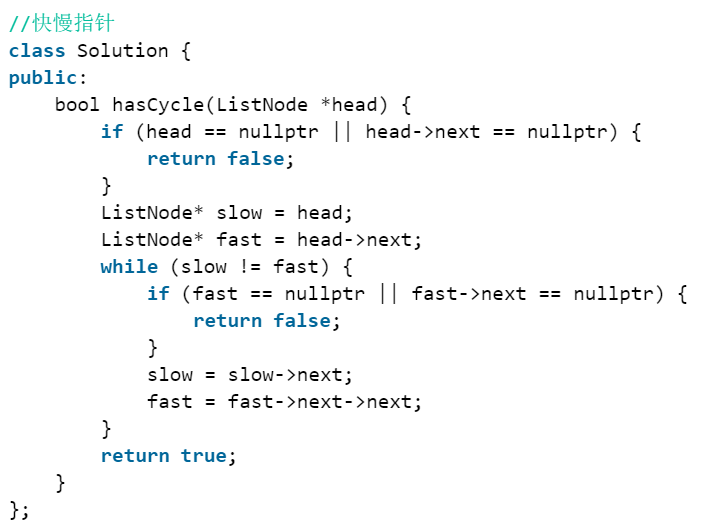

# 实战题C++

## 如何判断一个点在三角形内部

+ https://zhuanlan.zhihu.com/p/356529702


## volatile关键字

[volatile关键字](https://blog.csdn.net/liitdar/article/details/86063883)

+ volatile 关键字，最早出现于 19 世纪 70 年代，被用于处理 MMIO(Memory-mapped I/O) 带来的问题
+ 在引入 MMIO 之后，一块内存地址既有可能是真正的内存，也有可能是映射的一个 I/O 端口。因此，**读/写**一个内存地址，既有可能是真正地操作内存，也有可能是**读/写**一个 I/O 设备。


## main为什么可以不用写return 0？return 1/2/3可以吗？

1. 函数如果约定了返回，实际没有返回，语法上并不算错，但此时返回的是**寄存器中的值**，可以理解为是**垃圾数据**，返回值没有意义；
2. 为啥一定是`return 0`？这是继承自传统的系统中的习惯，作为一个可执行程序的返回值，==0表示正常，非0表示error code==。
3. `main`如果不`return 0`，或者随便return一个值会怎么样？实测下来不会怎么样，因为我们自己的程序并不会获取这值，从规范的角度来来说，还是要写`return 0`的。在部分信息学竞赛中，也明确要求，`main`必须以`return 0`结尾。


## 为什么要区分`.h`和`.cpp`文件

+ 这就是`C++`的特色之一，暴露出去的东西，声明在`.h`里；`.cpp`里隐藏自己的实现。
+ `C++`完全可以和其他编程语言一样，把代码实现都写在`.h`里，为什么代码要分开写：
  + 第一、编译速度
  + 第二、链接的时候不用把声明也编译进去
  + 第三、关系到生成的可执行文件（.exe）文件大小
+ `C++20`的module应该解决了这个问题了


## `.h`文件里面可以写函数实现吗？

可以。


## `.h`文件里面可以写静态变量的定义吗？

可以。


# 经典算法题

### 1. 并查集:star:

```c++
namespace UnionStruct
{
	#define MAX_N 10000
	int par[MAX_N]; // 父亲
	int rank[MAX_N]; //树的高度

	void init(int n)
	{
		for (int i = 0; i < n; ++i)
		{
			par[i] = i;
			rank[i] = 0;
		}
	}

	int find(int x)
	{
		if (par[x] == x)
			return x;
		else
		{
			return par[x] = find(par[x]);
		}
	}

	void unite(int x, int y)
	{
		x = find(x);
		y = find(y);
		if (x == y)return;

		if (rank[x] < rank[y])
		{
			par[x] = y;
		}
		else {
			par[y] = x;
			if (rank[x] == rank[y]) rank[x]++;
		}
	}

	bool same(int x, int y)
	{
		return find(x) == find(y);
	}
}
```


## 2. Bellman-Ford 算法

```c++
struct J_edge { 
    int from, to, cost; 

    J_edge(int i, int j, int k) : from(i), to(j), cost(k){}

    J_edge(const J_edge& es) : from(es.from), to(es.to), cost(es.cost) {}

    J_edge& operator=(const J_edge& es)
    {
        from = es.from;
        to = es.to;
        cost = es.cost;
        return *this;
    }
};

// S是起点，E是终点
void BellmanFord_Shortest_path(vector<J_edge> es, vector<int>& d, int S, int E)
{
	for (auto i : d) i = INT32_MAX;
	d[S] = 0;

	bool IsUpdated = false;

	while (true)
	{
		IsUpdated = false;

		for (auto e : es)
		{
			if (d[e.from] != INT32_MAX && d[e.to] > d[e.from] + e.cost)
			{
				d[e.to] = d[e.from] + e.cost;
				IsUpdated = true;
			}
		}

		if (!IsUpdated) break;
	}
}
```


## 3. Dijkstra 算法

```c++
void BOOK_1::Shortest_path_Dijkstra(vector<vector<int>> cost, vector<int>& d, int S)
{
	vector<bool> used(d.size(), false);

	for (auto i : d) i = INT32_MAX;
	d[S] = 0;

	while (true)
	{
		int v = -1;
		for (int u = 0; u < d.size(); u++)
			if (!used[u] && (v == -1 || d[u] < d[v]))v = u;

		if (v == -1) break;
		used[v] = true;
		
		for (int u = 0; u < d.size(); u++)
			d[u] = min(d[u], d[v] + cost[v][u]);

	}
}
```


# 实战算法题

## 1. 链表实现冒泡排序

```c++
#include "BaseTest.h"
#include "ObjectModelTest.h"
#include <vector>
#include <iostream>

using namespace std;

struct ListNode {
	int val;
	ListNode* next_;
};


ListNode* Sort(ListNode* root, int length)
{
	ListNode* root_pre = (ListNode*)malloc(sizeof(ListNode));
	root_pre->next_ = root;
	ListNode* temp = (ListNode*)malloc(sizeof(ListNode));
	temp->next_ = root_pre;

	ListNode* root_copy = root;
	ListNode* root_next = root->next_;

	for (int i = 0; i < length; i++)
	{
		for (int j = 0; j < length - i - 1; ++j)
		{
			if (root_next->val < root_copy->val)
			{
				root_copy->next_ = root_next->next_;
				root_next->next_ = root_copy;
				root_pre->next_ = root_next;

			}
			root_pre = root_pre->next_;
			root_copy = root_pre->next_;
			root_next = root_copy->next_;

		}
		root_pre = temp->next_;
		root = root_pre->next_;
		root_copy = root;
	}
	return root_pre->next_;
}

void main()
{
	vector<int> data{ 99,78,198,56,3 };

	ListNode* root = (ListNode*)malloc(sizeof(ListNode));
	root->val = data[0];
	ListNode* root_copy = root;
	for (int i = 1; i < data.size(); i++)
	{
		ListNode* temp = (ListNode*)malloc(sizeof(ListNode));
		temp->val = data[i];
		temp->next_ = nullptr;
		root_copy->next_ = temp;
		root_copy = temp;
	}
    
    root_copy = root;
	int length = 0;
	while (root_copy != nullptr)
	{
		length++;
		root_copy = root_copy->next_;
	}

	if (length == 1)return;
	else
		root_copy = Sort(root, length);

	for (int i = 0; i < length; i++)
	{
		cout << root_copy->val << " ";
		root_copy = root_copy->next_;
	}
	cout << endl;	
}
```


## 2. K个一组翻转链表

```c++

/**
 * Definition for singly-linked list.
 * struct ListNode {
 *     int val;
 *     ListNode *next;
 *     ListNode() : val(0), next(nullptr) {}
 *     ListNode(int x) : val(x), next(nullptr) {}
 *     ListNode(int x, ListNode *next) : val(x), next(next) {}
 * };
 */
class Solution {
public:
    void Surf(ListNode* &a, int k)
	{
		if (k == 0)return;
		Surf(a->next, k - 1);
		a->next->next = a;
	}

    ListNode* reverseKGroup(ListNode* head, int k) {
		int L = k;
        ListNode* temp = new ListNode;
		temp->next = head;
        ListNode* h1 = temp;
        
		while (head != nullptr)
		{
			L--;
			if (L == 0)
			{
                // a是下一段的开始
				ListNode* a = head->next;
                // b是此段的开始
				ListNode* b = temp->next;
                
                // 翻转
				Surf(b, k - 1);
                // 翻转后，b成为尾部，head成为首部
                // 此段和下一段连接
                b->next = a;
                // 上一段和此段链接
				temp->next = head;
                
                // temp 等于此段的尾部
				temp = b;
                L = k;
                // head 等于下一段的首部，开启下一次k翻转
                head = a;
                continue;
			}
            //cout<<head->val<<endl;
			head = head->next;
		}
		return h1->next;
    }
};

```


## 3. 如何判断链表是否有环？

参考：[【算法】如何判断链表有环_Mlib-CSDN博客_判断链表是否有环](https://blog.csdn.net/u010983881/article/details/78896293)

快慢指针，一个走一步，一个走两步，看是否会相交。




## 4. 两两翻转链表

```c++
struct Node
{
	int value;
	Node* next;
};

Node* reverse(Node* head)
{
	if (head == nullptr || head->next == nullptr)return head;
	Node* pre = (Node*)malloc(sizeof(Node));
	pre->next = head;
	Node* next_ = head->next;

	Node* prepre = (Node*)malloc(sizeof(Node));
	prepre->next = pre;

	while (head != nullptr && next_ != nullptr)
	{
		head->next = next_->next;
		next_->next = head;
		pre->next = next_;

		pre = head;
		head = head->next;
		if (head != nullptr)next_ = head->next;
		else next_ = nullptr;
	}
	return prepre->next->next;
}
```


## 5. [字典序](https://blog.csdn.net/HappyRocking/article/details/83619392?spm=1001.2101.3001.6650.3&utm_medium=distribute.pc_relevant.none-task-blog-2%7Edefault%7EBlogCommendFromBaidu%7ERate-3-83619392-blog-82991528.pc_relevant_multi_platform_featuressortv2removedup&depth_1-utm_source=distribute.pc_relevant.none-task-blog-2%7Edefault%7EBlogCommendFromBaidu%7ERate-3-83619392-blog-82991528.pc_relevant_multi_platform_featuressortv2removedup&utm_relevant_index=6)（最近换位数）


**获得最近换位数的三个步骤：**

1. 从低位向高位，查看逆序区域（**高位数字**小于**低位数字**），此时的位置为 $a$

2. 和逆序区域（$[0,a)$）中刚刚大于它的数字（在位置 $b$ ）交换位置

3. 重新排列$[0,a-1]$，让其满足由小到大。


## 6. 水位上升的泳池中游泳

> [LeetCode 778](https://leetcode.cn/problems/swim-in-rising-water/)

```c++
#include <vector>
#include <iostream>

using namespace std;

class Solution {
public:

    struct State
    {
        int i, j, height;

        State(int a, int b, int c) : i(a), j(b), height(c) {}
    };

    int swimInWater(vector<vector<int>>& grid) {

        vector<vector<bool>> isArrived(grid.size(), vector<bool>(grid[0].size(), false));
        isArrived[0][0] = true;

        vector<State> states;
        states.push_back(State(0, 0, grid[0][0]));
        
        int t = 0;
        int base = grid[0][0];

        while(1)
        {
            auto temp = states.begin();
            temp->height = base + t;
            int c = temp->height;
            int pos = 0;

            while(temp != states.end())
            {

                int a = temp->i, b = temp->j;

                if(a == grid.size() - 1 && b == grid.size() - 1)
                {
                    return c;
                }
                
                if(a - 1 >= 0 && !isArrived[a - 1][b] && c >= grid[a - 1][b])
                {
                    states.insert(states.end(), State(a - 1, b, c));
                    isArrived[a - 1][b] = true;
                }

                if(a + 1 < grid.size() && !isArrived[a + 1][b] && c >= grid[a + 1][b])
                {
                    states.insert(states.end(), State(a + 1, b, c));
                    isArrived[a + 1][b] = true;
                }

                 if(b - 1 >= 0 && !isArrived[a][b - 1] && c >= grid[a][b - 1])
                {
                    states.insert(states.end(), State(a, b - 1, c));
                    isArrived[a][b - 1] = true;
                }

                if(b + 1 < grid[0].size() && !isArrived[a][b + 1] && c >= grid[a][b + 1])
                {
                    states.insert(states.end(), State(a, b + 1, c));
                    isArrived[a][b + 1] = true;
                }

                pos++;
                
                temp = states.begin() + pos;
                
            }

            t++;
        }

        return 1;
    }
};
```


## 7. 节点之和最大路径

> [Leet code](https://leetcode.cn/problems/jC7MId/)

```c++
/**
 * Definition for a binary tree node.
 * struct TreeNode {
 *     int val;
 *     TreeNode *left;
 *     TreeNode *right;
 *     TreeNode() : val(0), left(nullptr), right(nullptr) {}
 *     TreeNode(int x) : val(x), left(nullptr), right(nullptr) {}
 *     TreeNode(int x, TreeNode *left, TreeNode *right) : val(x), left(left), right(right) {}
 * };
 */
 #include <cmath>

 using namespace std;

static int maxLen = 0;


class Solution {
public:

    void Surf(TreeNode* root, int& maxSwitch)
    {
        maxSwitch = root->val;
        int L_MaxSwitch = 0;
        int R_MaxSwitch = 0;

        if(root->left != nullptr)Surf(root->left, L_MaxSwitch);
        if(root->right != nullptr)Surf(root->right, R_MaxSwitch);
        
        maxSwitch = max(maxSwitch, max(maxSwitch + L_MaxSwitch, maxSwitch + R_MaxSwitch));

        maxLen = max(maxLen, 
                max(root->val, 
                max(root->val + L_MaxSwitch, 
                max(root->val + R_MaxSwitch, 
                root->val + R_MaxSwitch + L_MaxSwitch))));
    }


    int maxPathSum(TreeNode* root) {
        maxLen = root->val;
        int maxSwitch = 0;
        Surf(root, maxSwitch);
        return maxLen;
    }
};
```


## 8. 剪绳子

> [剑指Offer 14- 1. 剪绳子](https://leetcode.cn/problems/jian-sheng-zi-lcof/)

```c++
class Solution {
public:
    int cuttingRope(int n) {
        if(n == 2)return 1;
        if(n == 3)return 2;
        if(n == 4)return 4;

        int a = n / 3;
        int b = n % 3;

        if(b == 0)return pow(3, a);
        else if(b == 2) return pow(3, a) * 2;
        else
        {
            return pow(3, a - 1) * 4;
        }
    }
};
```

