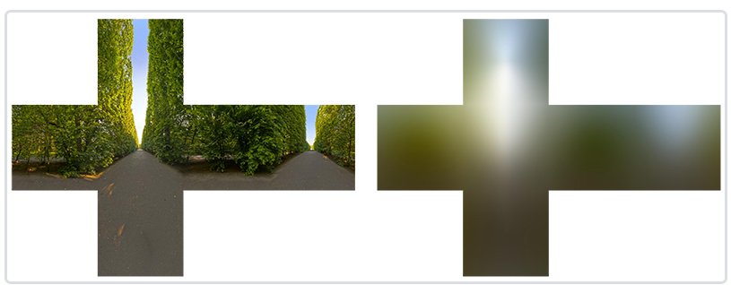
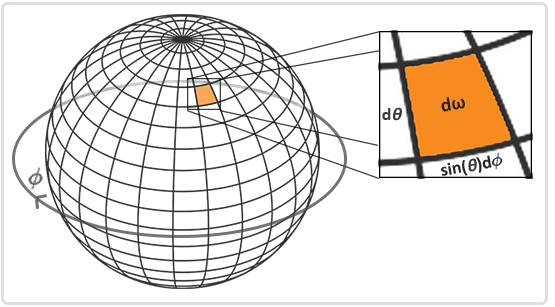

# IBL研究

所谓的基于图像的光照，实际中一般是光探针的形式。

## 漫反射

一般来说，都是使用归一化`Lambertian BRDF`，非常简单，容易预积分，也符合所需的视觉质量：
$$
BRDF=\frac{1}{\pi},
\\
L_{out}=albedo*k_d*\int_{\Omega}BRDF*L_i(w_i)*(w_i*n)dw_i
$$
我们实际上需要对**上诉积分部分**进行预计算，而这取决于 $w_i$ 和 $n$。更加准确的说，我们通过法线确定了入射光线所在的半球。所以说，我们预计算时最主要的就是考虑**法线的方向**。

实际中的预计算过程：我们渲染一个球体，对于每个`frag`，以原点到其位置的向量作为**法线**，来进行上诉积分计算，最后表现上，就是对一张环境贴图进行了**卷积**。

而实时渲染时，则根据**当前法线**来进行采样，作为`light`值。

### 具体推导

实际应用中，我们都是**离散化取点**——在半球上**均匀采样**。这个时候就要将积分转换成**离散形式**。但为了避免处理**麻烦的立体角积分**，我们使用球坐标 $(\theta,\phi)$ 来代替：

$$
\int=\int^{2\pi}_{\phi=0}\int^{0.5\pi}_{\theta=0}L_icos(\theta)sin(\theta)d\phi d\theta
\\=\frac{1}{n2*n1}\sum^{n1}_{\phi}\sum^{n2}_{\theta}L_icos(\theta)sin(\theta)d\phi d\theta
$$
