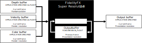
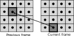
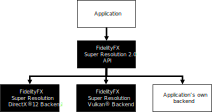
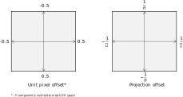

# FSR2技术分析

## 1. 技术文档翻译

### 1.1 介绍



`FSR2`使用**时间反馈**（`temporal feedback`）来重建高分辨率图像，同时与**原生渲染**相比，保持甚至提高图像质量。


### 1.2 快速开始

ToDo


### 1.3 集成指南

:one:**缩放模式**

| Quality           | Per-dimension scaling factor（缩放系数） |
| ----------------- | ---------------------------------------- |
| Quality           | 1.5x                                     |
| Balanced          | 1.7x                                     |
| Performance       | 2.0x                                     |
| Ultra performance | 3.0x                                     |

:two:**内存要求**

使用`FSR2`需要分配一些**额外的GPU本地内存**供GPU使用。当使用`FSR2 API`时，这块内存是在创建**FSR2上下文**时分配的，并且是通过**一系列的回调**来完成的，这些回调构成了后端接口。

这块内存用于存储`FSR2`算法计算的`intermediate surfaces`，以及在许多帧中持久存在的`surfaces`。下表包括了`FSR2`在不同操作条件下使用的内存量。

| Resolution | Quality                | Working set (MB)(总) | Persistent memory (MB) （额外） | Aliasable memory (MB)（已存在） |
| ---------- | ---------------------- | -------------------- | ------------------------------- | ------------------------------- |
| 3840x2160  | Quality (1.5x)         | 293.53MB             | 94.92MB                         | 198.61MB                        |
|            | Balanced (1.7x)        | 274.03MB             | 94.92MB                         | 179.11MB                        |
|            | Performance (2x)       | 255.68MB             | 94.92MB                         | 160.76MB                        |
|            | Ultra performance (3x) | 227.11MB             | 94.92MB                         | 132.19MB                        |
| 2560x1440  | Quality (1.5x)         | 136.41MB             | 84.37MB                         | 52.04MB                         |
|            | Balanced (1.7x)        | 126.97MB             | 84.37MB                         | 42.60MB                         |
|            | Performance (2x)       | 117.53MB             | 84.37MB                         | 33.16MB                         |
|            | Ultra performance (3x) | 104.95MB             | 84.37MB                         | 20.58MB                         |
| 1920x1080  | Quality (1.5x)         | 76.46MB              | 47.46MB                         | 29.18MB                         |
|            | Balanced (1.7x)        | 71.75MB              | 47.46MB                         | 23.68MB                         |
|            | Performance (2x)       | 67.81MB              | 47.46MB                         | 20.79MB                         |
|            | Ultra performance (3x) | 58.38MB              | 47.46MB                         | 11.09MB                         |

可以通过覆盖FSR2后端接口的**资源创建和销毁部分**，来控制`FSR2`中的资源创建。这意味着根据我们的操作条件，为了完美地集成`FSR2`，需要创建额外的内存——所以上诉`Persistent memory `可能更多，或更少。

:three:**输入资源**

`FSR2`是一个==时域算法==，因此需要访问**当前和前一帧的数据**。下表列举了`FSR2`所需的**所有外部输入**。

| Name           | Resolution             | Format                             | Type    | Notes                                                        |
| -------------- | ---------------------- | ---------------------------------- | ------- | ------------------------------------------------------------ |
| Color buffer   | Render                 | `APPLICATION SPECIFIED`            | Texture | The render resolution color buffer for the current frame provided by the application. If the contents of the color buffer are in high dynamic range (HDR), then the [`FFX_FSR2_ENABLE_HIGH_DYNAMIC_RANGE`](src/ffx-fsr2-api/ffx_fsr2.h#L87) flag should be set in  the [`flags`](src/ffx-fsr2-api/ffx_fsr2.h#L103) field of the [`FfxFsr2ContextDescription`](src/ffx-fsr2-api/ffx_fsr2.h#L101) structure. |
| Depth buffer   | Render                 | `APPLICATION SPECIFIED (1x FLOAT)` | Texture | The render resolution depth buffer for the current frame provided by the application. The data should be provided as a single floating point value, the precision of which is under the application’s control. The configuration of the depth should be communicated to FSR2 via the [`flags`](src/ffx-fsr2-api/ffx_fsr2.h#L103) field of the [`FfxFsr2ContextDescription`](src/ffx-fsr2-api/ffx_fsr2.h#L101) structure when creating the [`FfxFsr2Context`](src/ffx-fsr2-api/ffx_fsr2.h#L164). You should set the [`FFX_FSR2_ENABLE_DEPTH_INVERTED`](src/ffx-fsr2-api/ffx_fsr2.h#L90) flag if your depth buffer is inverted (that is [1..0] range), and you should set the [`FFX_FSR2_ENABLE_DEPTH_INFINITE`](src/ffx-fsr2-api/ffx_fsr2.h#L91) flag if your depth buffer has an infinite far plane. If the application provides the depth buffer in `D32S8` format, then FSR2 will ignore the stencil component of the buffer, and create an `R32_FLOAT` resource to address the depth buffer. On GCN and RDNA hardware, depth buffers are stored separately from stencil buffers. |
| Motion vectors | Render or presentation | `APPLICATION SPECIFIED (2x FLOAT)` | Texture | The 2D motion vectors for the current frame provided by the application in [**(<-width, -height>**..**<width, height>**] range. If your application renders motion vectors with a different range, you may use the [`motionVectorScale`](src/ffx-fsr2-api/ffx_fsr2.h#L125) field of the [`FfxFsr2DispatchDescription`](src/ffx-fsr2-api/ffx_fsr2.h#L114) structure to adjust them to match the expected range for FSR2. Internally, FSR2 uses 16-bit quantities to represent motion vectors in many cases, which means that while motion vectors with greater precision can be provided, FSR2 will not benefit from the increased precision. The resolution of the motion vector buffer should be equal to the render resolution, unless the [`FFX_FSR2_ENABLE_DISPLAY_RESOLUTION_MOTION_VECTORS`](src/ffx-fsr2-api/ffx_fsr2.h#L88) flag is set in the [`flags`](src/ffx-fsr2-api/ffx_fsr2.h#L103) field of the [`FfxFsr2ContextDescription`](src/ffx-fsr2-api/ffx_fsr2.h#L101) structure when creating the [`FfxFsr2Context`](src/ffx-fsr2-api/ffx_fsr2.h#L164), in which case it should be equal to the presentation resolution. |
| Reactive mask  | Render                 | `R8_UNORM`                         | Texture | As some areas of a rendered image do not leave a footprint in the depth buffer or include motion vectors, FSR2 provides support for a reactive mask texture which can be used to indicate to FSR2 where such areas are. Good examples of these are particles, or alpha-blended objects which do not write depth or motion vectors. If this resource is not set, then FSR2’s shading change detection logic will handle these cases as best it can, but for optimal results, this resource should be set. For more information on the reactive mask please refer to the [Reactive mask](#reactive-mask) section. |
| Exposure       | 1x1                    | `R32_FLOAT`                        | Texture | A 1x1 texture containing the exposure value computed for the current frame. This resource is optional, and may be omitted if the [`FFX_FSR2_ENABLE_AUTO_EXPOSURE`](src/ffx-fsr2-api/ffx_fsr2.h#L92) flag is set in the [`flags`](src/ffx-fsr2-api/ffx_fsr2.h#L103) field of the [`FfxFsr2ContextDescription`](src/ffx-fsr2-api/ffx_fsr2.h#L101) structure when creating the [`FfxFsr2Context`](src/ffx-fsr2-api/ffx_fsr2.h#L164). |

> 以上的`Notes`部分，很关键，可以指导我们进行修改


#### 深度缓冲设置

强烈建议在`FSR2`中使用倒置的、无限的深度缓冲。然而，也支持其他深度缓冲器的配置。应用程序应在创建[`FfxFsr2Context`](src/ffx-fsr2-api/ffx_fsr2.h#L164)时设置适当的标志，告知`FSR2 API`其深度缓冲区的配置。下表包含了相应的标志。

| FSR2 flag                                                    | Note                                                         |
| ------------------------------------------------------------ | ------------------------------------------------------------ |
| [`FFX_FSR2_ENABLE_DEPTH_INVERTED`](src/ffx-fsr2-api/ffx_fsr2.h#L90) | A bit indicating that the input depth buffer data provided is inverted [max..0]. |
| [`FFX_FSR2_ENABLE_DEPTH_INFINITE`](src/ffx-fsr2-api/ffx_fsr2.h#L91) | A bit indicating that the input depth buffer data provided is using an infinite far plane. |


#### 提供运动矢量

**:one:空间**

==时域算法==（无论是**抗锯齿**还是**升频**）的一个关键部分是**提供运动矢量**。`FSR2`接受**二维的运动向量**——编码了从当前帧中的一个像素到前一帧中同一像素的位置的运动。``FSR2`希望运动矢量是由应用程序在[**<-width, -height>**...**<width, height>**]范围内提供的。例如，屏幕左上角的一个像素的运动向量的值为<width, height>，这代表了一个从右下角开始，穿越整个输入面的运动。



如果应用程序在另一个空间——例如`NDC`，计算运动矢量，那么可以使用[`FfxFsr2DispatchDescription`](src/ffx-fsr2-api/ffx_fsr2.h#L125)结构的[`motionVectorScale`](src/ffx-fsr2-api/ffx_fsr2.h#L114)域，来指示`FSR2`调整它们，以匹配FSR2的预期范围。下面的代码例子说明了如何将**运动矢量**缩放到**屏幕空间**。

```c++
// GPU: Example of application NDC motion vector computation
float2 motionVector = (currentPosition.xy / currentPosition.w) - (previousPosition.xy / previousPosition.w);

// CPU: Matching FSR 2.0 motionVectorScale configuration
dispatchParameters.motionVectorScale.x = (float)renderWidth;
dispatchParameters.motionVectorScale.y = (float)renderHeight;
```

:two:**精度&分辨率**

Todo

:three:**Coverage**

当更多的物体提供**运动向量**时，`FSR2`升频的质量更好。因此，作者建议所有不透明的、经过`alpha test`和`alpha blend`的物体应该算出它们的运动向量（不是全部，而是覆盖了像素的那部分）。如果应用了顶点着色器的效果——比如滚动的UV——这些计算也应该被考虑到**运动的计算**中，以获得最佳效果。

对于`alpha blend`的对象，作者也强烈建议将**每个被覆盖像素的阿尔法值**存储到[reactive mask](#reactive-mask)中的相应像素。这将使`FSR2`在升格过程中更好地处理`alpha blend`的对象。


#### Reactive mask（反应掩码）

:one:在**FSR2的上下文**中，术语`reactivity`是指当前帧渲染的样本对产生最终的升级图像**有多大影响**。通常情况下，**当前帧渲染的样本**对`FSR2`计算的结果**贡献较小**；但是，也有例外。为了对快速移动的`alpha blend`物体产生最好的结果，`FSR2`要求[Reproject & accumulate](#reproject-accumulate)阶段对这种像素变得更加敏感。由于没有很好的方法从颜色、深度或运动矢量中确定哪些像素是用`alpha blend`渲染的，当应用程序明确标记这些区域时，`FSR2`的性能最好。

因此，作者强烈建议应用程序为`FSR2`提供一个`Reactive mask`——指导`FSR2`在合成当前像素时，应该在哪些地方**减少对历史信息的依赖**，而让当前帧的样本对最终结果做出更大贡献。`Reactive mask`允许应用程序提供一个$[0...1]$的值，其中`0`表示该像素完全没有反应（使用**默认的FSR2合成策略**），而`1`表示该像素应该是完全反应的。

虽然`Reactive mask`还有其他的应用，但`Reactive mask`的主要应用是对**半透明对象**产生更好的升格效果。`Reactive mask`的一个很好的实现是：使用`alpha Blend`使用的alpha值——因此，应用程序应该将`alpha`写入`Reactive mask`。应该注意的是，接近`1`的`Reactive value`不太可能产生良好的效果。因此，作者建议将最大的`Reactive value`限制在`0.9`左右。

如果没有向FSR2提供[Reactive mask](#reactive-mask)（通过将[`FfxFsr2DispatchDescription`](src/ffx-fsr2-api/ffx_fsr2.h#L121)字段设置为`NULL`），那么将使用一个**内部生成的1x1纹理**，其`Reactive value`已清除。


#### Transparency & composition mask

ToDo


#### Automatically generating reactivity:star:

为了帮助应用程序生成[Reactive mask](#reactive-mask)和[Transparency & Composition mask](#transparency-and-composition-mask)，`FSR2`提供了一个可选的辅助API。在引擎`hood`下，该API启动了一个**计算着色器**，使用**基于亮度的启发式方法**为每个像素计算这些值。

希望这样做的应用程序可以调用[`ffxFsr2ContextGenerateReactiveMask`](src/ffx-fsr2-api/ffx_fsr2.h#L265)函数，并且应该传递**两个版本的颜色缓冲区**，**一个只包含不透明的几何体**，**另一个包含不透明和alpha混合的对象**。


#### Exposure（曝光）

:one:`FSR2`提供了**两个值**，来控制执行升频时使用的曝光，如下：

1. 预曝光**（`Pre-exposure`）：用它来除以输入信号，以便在打包成**较低精度的渲染目标**之前，回到游戏产生的原始信号。

2. **曝光值**)（`Expsoure`）：与**预曝光颜色值**相乘的数值。

**曝光值选择不当**会对`FSR2`的最终升频质量产生巨大影响。因此，建议应用程序使用[`FFX_FSR2_ENABLE_AUTO_EXPOSURE`](src/ffx-fsr2-api/ffx_fsr2.h#L92)。通过[`FfxFsr2ContextDescription`](src/ffx-fsr2-api/ffx_fsr2. h#L101)结构的[`flags`](src/ffx-fsr2-api/ffx_fsr2.h#L103)字段，来设置[`FFX_FSR2_ENABLE_AUTO_EXPOSURE`](src/ffx-fsr2-api/ffx_fsr2.h#L92)。

:two:下面的HLSL代码展示了曝光计算：

```c++
float ComputeAutoExposureFromAverageLog(float averageLogLuminance)
{
	const float averageLuminance = exp(averageLogLuminance);
	const float S = 100.0f; // ISO arithmetic speed
	const float K = 12.5f;
	const float exposureIso100 = log2((averageLuminance * S) / K);
	const float q = 0.65f;
	const float luminanceMax = (78.0f / (q * S)) * pow(2.0f, exposureIso100);
	return 1 / luminanceMax;
}
```


#### Placement in the frame

`FSR2`的==主要目标==是：通过使用**时空缩放算法**（`temporal upscaling algorithm`），来提高渲染性能。因此，它在**管道中的位置**是确保最高质量的视觉质量和巨大性能之间的**正确平衡的关键**。


将一些**图像空间算法**放在`upscaling`之前，优点是它们在较低的分辨率下运行，会给应用程序带来性能上的优势。然而，对于某些图像空间技术来说，这并不合适

例如，许多应用程序可能会在最终图像中引入**噪音或颗粒**——为了模拟物理相机。在`upscaling`之前这样做可能会导致**放大噪声**，造成不希望出现的伪影。

下表将**常见的实时图像空间技术**分为两列：

| Post processing A               | Post processing B    |
| ------------------------------- | -------------------- |
| Screenspace reflections         | Film grain           |
| Screenspace ambient occlusion   | Chromatic abberation |
| Denoisers (shadow, reflections) | Vignette             |
| Exposure (optional)             | Tonemapping          |
|                                 | Bloom                |
|                                 | Depth of field       |
|                                 | Motion blur          |


#### Host API

:one:要使用`FSR API`，应该链接**FSR2库**，并包括`ffx_fsr2.h`头文件，该文件又有以下**头文件依赖**。

```c++
ffx_assert.h
ffx_error.h
ffx_fsr2_interface.h
ffx_types.h
ffx_util.h
```

要使用`FSR2 API`，应该链接`ffx_fsr2_api_x64.lib`。`FSR2 API`有一个**模块化的后端**，这意味着不同的图形API和平台可以通过使用一个匹配的后端来实现。因此，应该进一步包括与我们的要求**相匹配的后端lib**，参考下面的表格。

| Target       | Library name            |
| ------------ | ----------------------- |
| DirectX(R)12 | `ffx_fsr2_dx12_x64.lib` |
| Vulkan(R)    | `ffx_fsr2_vk_x64.lib`   |

:two:为了开始使用API，**应用程序**应该首先创建一个[`FfxFsr2Context`](src/ffx-fsr2-api/ffx_fsr2.h#L164) 结构。通过调用[`ffxFsr2ContextCreate`](src/ffx-fsr2-api/ffx_fsr2.h#L213)，[`FfxFsr2Context`](src/ffx-fsr2-api/ffx_fsr2.h#L164)结构将被填充上它所需的数据。此外，将从[`ffxFsr2ContextCreate`]()向**后端**（` backend `）进行一些调用——后端作为[`FfxFsr2ContextDescription`]()结构的一部分提供给[`FfxFsr2Context`]()。这些调用将执行诸如：创建`FSR2`所需的中间资源、设置着色器及其相关流水线状态等任务。`FSR2 API`不执行任何动态内存分配。 

当某帧需要`upscaling`时，应该调用[`ffxFsr2ContextDispatch`](src/ffx-fsr2-api/ffx_fsr2.h#L254)。这个函数接受[`FfxFsr2Context`](src/ffx-fsr2-api/ffx_fsr2.h#L164)结构（已经创建好的）和 如何进行`upscaling`、对哪些数据进行升级的**描述结构**。该描述结构由应用程序提供——通过填充[`FfxFsr2DispatchDescription`](src/ffx-fsr2-api/ffx_fsr2.h#L114)结构。

:three:**销毁上下文**是通过调用[`ffxFsr2ContextDestroy`](src/ffx-fsr2-api/ffx_fsr2.h#L277)进行的。请注意，在尝试调用[`ffxFsr2ContextDestroy`](src/ffx-fsr2-api/ffx_fsr2.h#L277)之前，GPU应该是空闲的，并且该函数不执行**隐式同步**，以确保被`FSR2`访问的资源目前不在`flying`中。这样选择的原因是：避免为应用程序引入额外的GPU刷新。

> 关于`FSR2 API`的更详尽的文档，可以参考提供的API参考文档。


#### Modular backend （模块化后端）

:one:`FSR2 API`的设计意味着：**`FSR2`算法**的核心实现并不知道它位于哪个渲染API上。相反，`FSR2`通过一个接口调用提供给它的函数，允许**不同的后端**与`FSR2`一起使用。这种设计也允许**集成`FSR2`的应用程序**提供他们自己的后端实现，==这意味着FSR2目前不支持的平台可以通过**实现少数几个函数**来实现==。



`FSR2 API`将按照**核心API**和**后端**之间已经概述的分离方式编译成多个库。这意味着如果想使用`FSR2`提供的后端，我们应该同时链接**FSR2核心API库**和**符合要求的后端**。

> FSR2的公开版本带有**DirectX(R)12**和**Vulkan(R)**后端，但其他后端可以根据要求提供。欲了解更多信息，请与**AMD开发者技术代表**联系。


#### Memory management（内存管理）

:one:如果`FSR2 API`与**所提供的后端之一**一起使用（如 DirectX(R)12或Vulkan(R)），那么`FSR2`所需的所有资源都是直接使用**主机应用程序提供的图形设备**作为承诺资源来创建。然而，通过**重写后端接口中的创建和销毁函数族**，应用程序可以更精确地控制`FSR2`的内存管理。

要做到这一点，可以通过[`FfxFsr2ContextDescription`](src/ffx-fsr2-api/ffx_fsr2.h#L101)结构传递给[`ffxFsr2ContextCreate`](src/ffx-fsr2-api/ffx_fsr2. h#L213)函数，提供一个完整的公开后端给`FSR`；或者可以检索我们所需要的API的后端，并重写**资源的创建和销毁函数**，来自己处理它们。要做到这一点，只需覆盖[`fpCreateResource`](src/ffx-fsr2-api/ffx_fsr2_interface.h#L399)和[`fpDestroyResource`](src/ffx-fsr2-api/ffx_fsr2_interface.h#L403) 函数指针。

```c++
// Setup DX12 interface.
const size_t scratchBufferSize = ffxFsr2GetScratchMemorySizeDX12();
void* scratchBuffer = malloc(scratchBufferSize);
FfxErrorCode errorCode = ffxFsr2GetInterfaceDX12(&contextDescription.callbacks, m_pDevice->GetDevice(), scratchBuffer, scratchBufferSize);
FFX_ASSERT(errorCode == FFX_OK);

// Override the resource creation and destruction.
contextDescription.callbacks.createResource = myCreateResource;
contextDescription.callbacks.destroyResource = myDestroyResource;

// Set up the context description.
contextDescription.device = ffxGetDeviceDX12(m_pDevice->GetDevice());
contextDescription.maxRenderSize.width = renderWidth;
contextDescription.maxRenderSize.height = renderHeight;
contextDescription.displaySize.width = displayWidth;
contextDescription.displaySize.height = displayHeight;
contextDescription.flags = FFX_FSR2_ENABLE_HIGH_DYNAMIC_RANGE
                         | FFX_FSR2_ENABLE_DEPTH_INVERTED
                         | FFX_FSR2_ENABLE_AUTO_EXPOSURE;

// Create the FSR2 context.
errorCode = ffxFsr2ContextCreate(&context, &contextDescription);
FFX_ASSERT(errorCode == FFX_OK);
```

:two:对于控制FSR2所需的内存管理的应用程序来说，一个有趣的优势是可以进行==资源别名==，这可以节省内存。[内存需求](#memory-requirements)中的表格显示了通过使用这种技术可以节省的内存。为了实现表格中显示的节约，应该找到一个**合适的内存区域**——其内容不需要在调用FSR2调度时存活——与`FSR2`所需的可别名资源共享。

**FSR2的核心API**通过**FSR2后端接口**进行的每个[`FfxFsr2CreateResourceFunc`](src/ffx-fsr2-api/ffx_fsr2_interface.h#L399)调用将包含**一组**作为[`FfxCreateResourceDescription`](src/ffx-fsr2-api/ffx_types.h#L251)结构一部分的**标志**。如果[`FFX_RESOURCE_FLAGS_ALIASABLE`](src/ffx-fsr2-api/ffx_types.h#L101)字段中设置了[`flags`](src/ffx-fsr2-api/ffx_types.h#L208)，则表明该资源可以与渲染帧中的其他资源安全地别名。


#### Temporal Antialiasing

==时间抗锯齿（TAA）==是一种技术，它使用**以前的帧的输出**，来构建**当前帧的高质量输出**。由于`FSR2·具有类似的目标——尽管它还具有**提高渲染图像的分辨率**的额外目标——==因此不需要在应用程序中包含一个单独的TAA通道==。


#### Camera jitter

`FSR2`需要在渲染时应用==子像素抖动==——这通常包含在**摄像机的投影矩阵**中。为了使摄像机抖动的应用变得简单，`FSR2 API`提供了一小套实用的函数，在一连串独立的抖动偏移中，计算出**特定帧的子像素抖动偏移**。

```c++
nt32_t ffxFsr2GetJitterPhaseCount(int32_t renderWidth, int32_t displayWidth);
FfxErrorCode ffxFsr2GetJitterOffset(float* outX, float* outY, int32_t jitterPhase, int32_t sequenceLength);
```

> 在内部，这些函数实现了一个**Halton[2,3]序列**



重要的是：要理解从[`ffxFsr2GetJitterOffset`](src/ffx-fsr2-api/ffx_fsr2.h#L422)返回的值是在**单位像素空间**，为了将其正确合成到**投影矩阵**中，我们必须将其转换成**投影偏移**。下面的代码列表显示了如何将**子像素抖动偏移值**正确合成到**投影矩阵**中。

```c++
const int32_t jitterPhaseCount = ffxFsr2GetJitterPhaseCount(renderWidth, displayWidth);

float jitterX = 0;
float jitterY = 0;
ffxFsr2GetJitterOffset(&jitterX, &jitterY, index, jitterPhaseCount);

// Calculate the jittered projection matrix.
const float jitterX = 2.0f * jitterX / (float)renderWidth;
const float jitterY = -2.0f * jitterY / (float)renderHeight;
const Matrix4 jitterTranslationMatrix = translateMatrix(Matrix3::identity, Vector3(jitterX, jitterY, 0));
const Matrix4 jitteredProjectionMatrix = jitterTranslationMatrix * projectionMatrix;
```

