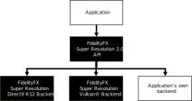

[toc]


# FSR2技术分析

# 1. 技术文档翻译

## 1. 介绍


`FSR2`使用**时间反馈**（`temporal feedback`）来重建**高分辨率图像**，同时与**原生渲染**相比，保持甚至提高图像质量。


## 2. 快速开始

ToDo


## 3. 集成指南

:one:**缩放模式**

| Quality           | Per-dimension scaling factor（缩放系数） |
| ----------------- | ---------------------------------------- |
| Quality           | 1.5x                                     |
| Balanced          | 1.7x                                     |
| Performance       | 2.0x                                     |
| Ultra performance | 3.0x                                     |

:two:**内存要求**

使用`FSR2`需要分配一些**额外的GPU本地内存**供GPU使用。当使用`FSR2 API`时，这块内存是在创建**FSR2上下文**时分配的，并且是通过**一系列的回调**来完成的，这些回调构成了**后端接口**。

这块内存用于存储`FSR2`算法计算的`intermediate surfaces`，以及在许多帧中持久存在的`surfaces`。下表包括了`FSR2`在不同操作条件下使用的内存量。

| Resolution | Quality                | Working set (MB)(总) | Persistent memory (MB) （额外） | Aliasable memory (MB)（已存在） |
| ---------- | ---------------------- | -------------------- | ------------------------------- | ------------------------------- |
| 3840x2160  | Quality (1.5x)         | 293.53MB             | 94.92MB                         | 198.61MB                        |
|            | Balanced (1.7x)        | 274.03MB             | 94.92MB                         | 179.11MB                        |
|            | Performance (2x)       | 255.68MB             | 94.92MB                         | 160.76MB                        |
|            | Ultra performance (3x) | 227.11MB             | 94.92MB                         | 132.19MB                        |
| 2560x1440  | Quality (1.5x)         | 136.41MB             | 84.37MB                         | 52.04MB                         |
|            | Balanced (1.7x)        | 126.97MB             | 84.37MB                         | 42.60MB                         |
|            | Performance (2x)       | 117.53MB             | 84.37MB                         | 33.16MB                         |
|            | Ultra performance (3x) | 104.95MB             | 84.37MB                         | 20.58MB                         |
| 1920x1080  | Quality (1.5x)         | 76.46MB              | 47.46MB                         | 29.18MB                         |
|            | Balanced (1.7x)        | 71.75MB              | 47.46MB                         | 23.68MB                         |
|            | Performance (2x)       | 67.81MB              | 47.46MB                         | 20.79MB                         |
|            | Ultra performance (3x) | 58.38MB              | 47.46MB                         | 11.09MB                         |

可以通过覆盖FSR2后端接口的**资源创建和销毁部分**，来控制`FSR2`中的资源创建。这意味着根据我们的操作条件，为了完美地集成`FSR2`需要创建**额外的内存**——所以上诉`Persistent memory `可能更多，或更少。

:three:**输入资源**

`FSR2`是一个==时域算法==，因此需要访问**当前和前一帧的数据**。下表列举了`FSR2`所需的**所有外部输入**。

| Name           | Resolution             | Format                             | Type    | Notes                                                        |
| -------------- | ---------------------- | ---------------------------------- | ------- | ------------------------------------------------------------ |
| Color buffer   | Render                 | `APPLICATION SPECIFIED`            | Texture | The render resolution color buffer for the current frame provided by the application. If the contents of the color buffer are in high dynamic range (HDR), then the [`FFX_FSR2_ENABLE_HIGH_DYNAMIC_RANGE`](src/ffx-fsr2-api/ffx_fsr2.h#L87) flag should be set in  the [`flags`](src/ffx-fsr2-api/ffx_fsr2.h#L103) field of the [`FfxFsr2ContextDescription`](src/ffx-fsr2-api/ffx_fsr2.h#L101) structure. |
| Depth buffer   | Render                 | `APPLICATION SPECIFIED (1x FLOAT)` | Texture | The render resolution depth buffer for the current frame provided by the application. The data should be provided as a single floating point value, the precision of which is under the application’s control. The configuration of the depth should be communicated to FSR2 via the [`flags`](src/ffx-fsr2-api/ffx_fsr2.h#L103) field of the [`FfxFsr2ContextDescription`](src/ffx-fsr2-api/ffx_fsr2.h#L101) structure when creating the [`FfxFsr2Context`](src/ffx-fsr2-api/ffx_fsr2.h#L164). You should set the [`FFX_FSR2_ENABLE_DEPTH_INVERTED`](src/ffx-fsr2-api/ffx_fsr2.h#L90) flag if your depth buffer is inverted (that is [1..0] range), and you should set the [`FFX_FSR2_ENABLE_DEPTH_INFINITE`](src/ffx-fsr2-api/ffx_fsr2.h#L91) flag if your depth buffer has an infinite far plane. If the application provides the depth buffer in `D32S8` format, then FSR2 will ignore the stencil component of the buffer, and create an `R32_FLOAT` resource to address the depth buffer. On GCN and RDNA hardware, depth buffers are stored separately from stencil buffers. |
| Motion vectors | Render or presentation | `APPLICATION SPECIFIED (2x FLOAT)` | Texture | The 2D motion vectors for the current frame provided by the application in [**(<-width, -height>**..**<width, height>**] range. If your application renders motion vectors with a different range, you may use the [`motionVectorScale`](src/ffx-fsr2-api/ffx_fsr2.h#L125) field of the [`FfxFsr2DispatchDescription`](src/ffx-fsr2-api/ffx_fsr2.h#L114) structure to adjust them to match the expected range for FSR2. Internally, FSR2 uses 16-bit quantities to represent motion vectors in many cases, which means that while motion vectors with greater precision can be provided, FSR2 will not benefit from the increased precision. The resolution of the motion vector buffer should be equal to the render resolution, unless the [`FFX_FSR2_ENABLE_DISPLAY_RESOLUTION_MOTION_VECTORS`](src/ffx-fsr2-api/ffx_fsr2.h#L88) flag is set in the [`flags`](src/ffx-fsr2-api/ffx_fsr2.h#L103) field of the [`FfxFsr2ContextDescription`](src/ffx-fsr2-api/ffx_fsr2.h#L101) structure when creating the [`FfxFsr2Context`](src/ffx-fsr2-api/ffx_fsr2.h#L164), in which case it should be equal to the presentation resolution. |
| Reactive mask  | Render                 | `R8_UNORM`                         | Texture | As some areas of a rendered image do not leave a footprint in the depth buffer or include motion vectors, FSR2 provides support for a reactive mask texture which can be used to indicate to FSR2 where such areas are. Good examples of these are particles, or alpha-blended objects which do not write depth or motion vectors. If this resource is not set, then FSR2’s shading change detection logic will handle these cases as best it can, but for optimal results, this resource should be set. For more information on the reactive mask please refer to the [Reactive mask](#reactive-mask) section. |
| Exposure       | 1x1                    | `R32_FLOAT`                        | Texture | A 1x1 texture containing the exposure value computed for the current frame. This resource is optional, and may be omitted if the [`FFX_FSR2_ENABLE_AUTO_EXPOSURE`](src/ffx-fsr2-api/ffx_fsr2.h#L92) flag is set in the [`flags`](src/ffx-fsr2-api/ffx_fsr2.h#L103) field of the [`FfxFsr2ContextDescription`](src/ffx-fsr2-api/ffx_fsr2.h#L101) structure when creating the [`FfxFsr2Context`](src/ffx-fsr2-api/ffx_fsr2.h#L164). |

> 以上的`Notes`部分，很关键，可以指导我们进行修改


### 1. 深度缓冲设置

强烈建议在`FSR2`中使用**倒置的、无限的深度缓冲**——也支持其他深度缓冲器的配置。应用程序应在创建[`FfxFsr2Context`](src/ffx-fsr2-api/ffx_fsr2.h#L164)时设置适当的标志，告知`FSR2 API`其深度缓冲区的配置。下表包含了相应的标志。

| FSR2 flag                                                    | Note                                                         |
| ------------------------------------------------------------ | ------------------------------------------------------------ |
| [`FFX_FSR2_ENABLE_DEPTH_INVERTED`](src/ffx-fsr2-api/ffx_fsr2.h#L90) | A bit indicating that the input depth buffer data provided is inverted [max..0]. |
| [`FFX_FSR2_ENABLE_DEPTH_INFINITE`](src/ffx-fsr2-api/ffx_fsr2.h#L91) | A bit indicating that the input depth buffer data provided is using an infinite far plane. |


### 2. 提供运动矢量

**:one:空间**

==时域算法==（无论是**抗锯齿**还是**升频**）的一个关键部分是**提供运动矢量**。`FSR2`接受**二维的运动向量**——编码了从当前帧中的一个像素到前一帧中同一像素的位置的运动。`FSR2`希望**运动矢量**是由应用程序在[**<-width, -height>**...**<width, height>**]范围内提供的。


如果应用程序在另一个空间——例如`NDC`，==计算运动矢量==，那么可以使用[`FfxFsr2DispatchDescription`](src/ffx-fsr2-api/ffx_fsr2.h#L125)结构的[`motionVectorScale`](src/ffx-fsr2-api/ffx_fsr2.h#L114)来调整，以匹配`FSR2`的预期范围。下面的代码例子说明了如何将**运动矢量**缩放到**屏幕空间**。

```c++
// GPU: Example of application NDC motion vector computation
float2 motionVector = (currentPosition.xy / currentPosition.w) - (previousPosition.xy / previousPosition.w);

// CPU: Matching FSR 2.0 motionVectorScale configuration
dispatchParameters.motionVectorScale.x = (float)renderWidth;
dispatchParameters.motionVectorScale.y = (float)renderHeight;
```

:two:**精度&分辨率**

在`FSR 2.0`的算法内部，都是使用==16位量==来表示**运动矢量**，所以我们不需要提供**高精度的运动矢量**——提供了也没用。

ToDo

:three:**Coverage**

提供**运动向量**的物体越多时，`FSR2`升频的质量越好。因此，作者建议所有不透明的、经过`alpha test`和`alpha blend`的物体应该算出它们的**运动向量**（不是全部，而是覆盖了像素的那部分）。如果应用了顶点着色器的效果——比如**滚动的UV**——这些计算也应该被考虑到**运动的计算**中，以获得最佳效果。

对于`alpha blend`的对象，作者强烈建议：将**每个被覆盖像素的阿尔法值**存储到[reactive mask](#reactive-mask)中的相应像素。这将使`FSR2`在放大过程中更好地处理**`alpha blend`的对象**。


### 3. Reactive mask（反应掩码）:star::star:

> 总结下：半透明物体应该更多依赖历史数据，而半透明物体则相反，我们需要更多的依赖当前帧的渲染结果，而减少对历史数据的依赖，所以我们需要一张`Reactive mask`来表明哪些像素是半透明像素！

:one:在**FSR2的上下文**中，术语`reactivity`是指**当前帧渲染的样本**对产生最终的放大图像**有多大影响**。通常情况下，**当前帧渲染的样本**对`FSR2`计算的结果**贡献较小**。

但是，也有例外。为了对**快速移动的`alpha blend`物体** 产生最好的结果，`FSR2`要求 **[Reproject & accumulate](#reproject-accumulate) 阶段** （这个应该是TAA的流程，用于获取和使用**历史数据**）对这种像素变得更加敏感。由于没有很好的方法从颜色、深度或运动矢量中确定哪些像素是用`alpha blend`渲染的，当应用程序明确标记这些区域时，`FSR2`的性能最好。

因此，作者强烈建议：应用程序为`FSR2`提供一个`Reactive mask`——指导`FSR2`在合成当前像素时，应该在哪些地方**减少对历史信息的依赖**，而让**当前帧的样本**对**最终结果**做出更大贡献。`Reactive mask`允许应用程序提供一个$[0...1]$的值，其中`0`表示该像素是**不透明的**（不反应的）（使用**默认的FSR2合成策略**），而`1`表示该像素应该是**完全透明的**（完全反应的）。

虽然`Reactive mask`还有其他的应用，但`Reactive mask`的主要应用是：**半透明对象**产生更好的放大效果。==`Reactive mask`的一个很好的实现是：使用`alpha Blend`中的alpha值==——因此，应用程序应该将`alpha`写入`Reactive mask`。

> 接近`1`的`Reactive value`产生的效果不好。因此，作者建议将最大的`Reactive value`限制在`0.9`左右。

如果没有向FSR2提供[Reactive mask](#reactive-mask)（通过将[`FfxFsr2DispatchDescription`](src/ffx-fsr2-api/ffx_fsr2.h#L121)的对应字段设置为`NULL`），那么将使用一个**内部生成的1x1纹理**，其`Reactive value`已清除。


### 4. Transparency & composition mask（透明度&合成掩码）

除了`Reactive mask`之外，`FSR2`还为应用程序提供了**其他专业渲染区域的标记**，这些区域应该在**升频过程**中得到考虑，例如：光线跟踪的反射区域、动画纹理。

**透明度**和**组成遮罩**（`composition mask`）则调整**由FSR2创建的像素锁**（什么是**像素锁**？）。Todo


### 5. Automatically generating reactivity :star: （自动生成掩码）

为了帮助应用程序生成[Reactive mask](#reactive-mask)和[Transparency & Composition mask](#transparency-and-composition-mask)，`FSR2`提供了一个**可选的辅助API**。在引擎`hood`下，该`API`启动了一个**计算着色器**，使用**基于亮度的启发式方法**为每个像素进行计算。

我们可以调用[`ffxFsr2ContextGenerateReactiveMask`](src/ffx-fsr2-api/ffx_fsr2.h#L265)函数，然后传递**两个颜色缓冲区**，**一个只包含不透明物体**，**另一个包含不透明和alpha混合对象**。


### 6. Exposure（曝光）:star::star:

:one:`FSR2`提供了**两个值**，来控制**升频时使用的曝光**，如下：

1. **预曝光**（`Pre-exposure`）：用**颜色值**除以这个值，以便在打包成**较低精度的渲染目标**之前，回到游戏产生的原始信号。

2. **曝光值**（`Expsoure`）：与**预曝光后的颜色值**相乘。

**曝光值选择不当**会对`FSR2`的**最终升频质量**产生巨大影响。因此，建议使用[`FFX_FSR2_ENABLE_AUTO_EXPOSURE`](src/ffx-fsr2-api/ffx_fsr2.h#L92)。通过[`FfxFsr2ContextDescription`](src/ffx-fsr2-api/ffx_fsr2. h#L101)结构的[`flags`](src/ffx-fsr2-api/ffx_fsr2.h#L103)字段，来设置[`FFX_FSR2_ENABLE_AUTO_EXPOSURE`](src/ffx-fsr2-api/ffx_fsr2.h#L92)。

:two:下面的**HLSL代码**展示了**曝光计算**：

```c++
float ComputeAutoExposureFromAverageLog(float averageLogLuminance)
{
	const float averageLuminance = exp(averageLogLuminance);
	const float S = 100.0f; // ISO arithmetic speed
	const float K = 12.5f;
	const float exposureIso100 = log2((averageLuminance * S) / K);
	const float q = 0.65f;
	const float luminanceMax = (78.0f / (q * S)) * pow(2.0f, exposureIso100);
	return 1 / luminanceMax;
}
```


### 7. Placement in the frame :star: （FSR2的插入位置）

`FSR2`的==主要目标==是：通过使用**时空缩放算法**（`temporal upscaling algorithm`），来提高**渲染性能**。因此，它在**管道中的位置**是确保**视觉质量和巨大性能**之间平衡的关键。


将一些**图像空间算法**放在`upscaling`之前，优点是：它们在较低的分辨率下运行，会有**性能优势**。然而，对于某些图像空间技术来说，这并不合适——许多图像算法会在最终图像中引入**噪音或颗粒**。在`upscaling`之前这样做会导致**放大噪声**，造成伪影。

下表将**常见的实时图像空间技术**分为两类：

| Post processing A               | Post processing B    |
| ------------------------------- | -------------------- |
| Screenspace reflections         | Film grain           |
| Screenspace ambient occlusion   | Chromatic abberation |
| Denoisers (shadow, reflections) | Vignette             |
| Exposure (optional)             | Tonemapping          |
|                                 | Bloom                |
|                                 | Depth of field       |
|                                 | Motion blur          |


### 8. Host API

:one:要使用`FSR API`，应该链接`ffx_fsr2_api_x64.lib`，并包含`ffx_fsr2.h`头文件，该文件有如下**头文件依赖**：

```c++
ffx_assert.h
ffx_error.h
ffx_fsr2_interface.h
ffx_types.h
ffx_util.h
```

`FSR2 API`有一个**模块化的后端**，这意味着**不同的图形API和平台**可以通过使用**一个匹配的后端（`backend`）**来实现。因此，应该进一步链接与我们的要求**相匹配的后端lib**，参考下面的表格：

| Target       | Library name            |
| ------------ | ----------------------- |
| DirectX(R)12 | `ffx_fsr2_dx12_x64.lib` |
| Vulkan(R)    | `ffx_fsr2_vk_x64.lib`   |

:two:为了使用`API`，**应用程序**应该首先创建一个[`FfxFsr2Context`](src/ffx-fsr2-api/ffx_fsr2.h#L164) 结构。通过调用[`ffxFsr2ContextCreate`](src/ffx-fsr2-api/ffx_fsr2.h#L213)，[`FfxFsr2Context`](src/ffx-fsr2-api/ffx_fsr2.h#L164)结构将被填充上它所需的数据。此外，将从[`ffxFsr2ContextCreate`]()向**后端**（` backend `）进行一些调用——后端作为[`FfxFsr2ContextDescription`]()结构的一部分提供给[`FfxFsr2Context`]()。这些调用将执行诸如：创建`FSR2`所需的中间资源、设置着色器及其相关流水线状态等任务。

> `FSR2 API`不执行任何**动态内存分配**。 

当某帧需要`upscaling`时，应该调用[`ffxFsr2ContextDispatch`](src/ffx-fsr2-api/ffx_fsr2.h#L254)。这个函数接受[`FfxFsr2Context`](src/ffx-fsr2-api/ffx_fsr2.h#L164)结构（已经创建好的）和 [FfxFsr2DispatchDescription](src/ffx-fsr2-api/ffx_fsr2.h#L114)结构 ——如何进行`upscaling`、对哪些数据进行`upscaling`的**描述结构**。

:three:**销毁上下文**是通过调用[`ffxFsr2ContextDestroy`](src/ffx-fsr2-api/ffx_fsr2.h#L277)进行的。请注意，在调用[`ffxFsr2ContextDestroy`](src/ffx-fsr2-api/ffx_fsr2.h#L277)之前，`GPU`应该是空闲的，并且该函数不执行**隐式同步**，以确保被`FSR2`访问的资源目前不在`flying`中。这样选择的原因是：避免为应用程序引入**额外的GPU刷新**。

> 关于`FSR2 API`的更详尽的文档，可以参考提供的API参考文档。


### 9. Modular backend （模块化后端）:star:

:one:`FSR2 API`的设计表面：**`FSR2`算法**的核心实现并不知道它位于哪个**渲染API**上。相反，`FSR2`只一股脑调用提供给它的函数——允许**不同的后端**与`FSR2`一起使用。这种设计也允许**集成`FSR2`的应用程序**提供他们**自己的后端实现**——==这意味着FSR2目前不支持的平台可以通过**实现少数几个函数**来实现==。



`FSR2 API`将按照**核心API**和**后端**之间的分离方式编译成多个库。这意味着如果想使用`FSR2`提供的后端，我们应该同时链接**FSR2核心API库**和**符合要求的后端**。

> FSR2的公开版本带有**DirectX(R)12**和**Vulkan(R)**后端，但其他后端可以根据要求提供。欲了解更多信息，请与**AMD开发者技术代表**联系。


### 10. Memory management（内存管理）

:one:如果`FSR2 API`与**所提供的后端之一**一起使用，那么`FSR2`所需的所有资源都是：直接使用**主机应用程序提供的图形设备**作为`committed resources`来创建。通过**重写后端接口中的创建和销毁函数族**，应用程序可以更精确地控制`FSR2`的内存管理。

要做到这一点，可以通过[`FfxFsr2ContextDescription`](src/ffx-fsr2-api/ffx_fsr2.h#L101)结构传递给[`ffxFsr2ContextCreate`](src/ffx-fsr2-api/ffx_fsr2. h#L213)函数，提供一个完整的公开后端给`FSR`；或者可以检索我们所需要的API的后端，并重写**资源的创建和销毁函数**，来自己处理它们。要做到这一点，只需覆盖[`fpCreateResource`](src/ffx-fsr2-api/ffx_fsr2_interface.h#L399)和[`fpDestroyResource`](src/ffx-fsr2-api/ffx_fsr2_interface.h#L403) 函数指针。

```c++
// Setup DX12 interface.
const size_t scratchBufferSize = ffxFsr2GetScratchMemorySizeDX12();
void* scratchBuffer = malloc(scratchBufferSize);
FfxErrorCode errorCode = ffxFsr2GetInterfaceDX12(&contextDescription.callbacks, m_pDevice->GetDevice(), scratchBuffer, scratchBufferSize);
FFX_ASSERT(errorCode == FFX_OK);

// Override the resource creation and destruction.
contextDescription.callbacks.createResource = myCreateResource;
contextDescription.callbacks.destroyResource = myDestroyResource;

// Set up the context description.
contextDescription.device = ffxGetDeviceDX12(m_pDevice->GetDevice());
contextDescription.maxRenderSize.width = renderWidth;
contextDescription.maxRenderSize.height = renderHeight;
contextDescription.displaySize.width = displayWidth;
contextDescription.displaySize.height = displayHeight;
contextDescription.flags = FFX_FSR2_ENABLE_HIGH_DYNAMIC_RANGE
                         | FFX_FSR2_ENABLE_DEPTH_INVERTED
                         | FFX_FSR2_ENABLE_AUTO_EXPOSURE;

// Create the FSR2 context.
errorCode = ffxFsr2ContextCreate(&context, &contextDescription);
FFX_ASSERT(errorCode == FFX_OK);
```

:two: ==Need ReRead==：

对于控制FSR2所需的内存管理的应用程序来说，一个有趣的优势是可以进行==资源别名==，这可以节省内存。[内存需求](#memory-requirements)中的表格显示了通过使用这种技术可以节省的内存。为了实现表格中显示的节约，应该找到一个**合适的内存区域**——其内容不需要在调用FSR2调度时存活——与`FSR2`所需的可别名资源共享。

**FSR2的核心API**通过**FSR2后端接口**进行的每个[`FfxFsr2CreateResourceFunc`](src/ffx-fsr2-api/ffx_fsr2_interface.h#L399)调用将包含**一组**作为[`FfxCreateResourceDescription`](src/ffx-fsr2-api/ffx_types.h#L251)结构一部分的**标志**。如果[`FFX_RESOURCE_FLAGS_ALIASABLE`](src/ffx-fsr2-api/ffx_types.h#L101)字段中设置了[`flags`](src/ffx-fsr2-api/ffx_types.h#L208)，则表明该资源可以与渲染帧中的其他资源安全地别名。


### 11. Temporal Antialiasing（时域抗锯齿）

==时间抗锯齿（TAA）==是一种技术：它使用**历史帧的输出**，来构建**当前帧的高质量输出**。由于`FSR2`具有类似的目标——尽管它还具有**提高渲染图像的分辨率**的额外目标——==因此不需要在应用程序中包含一个**单独的TAA通道**==。


### 12. Camera jitter（相机亚像素抖动）

:one:`FSR2`需要在渲染时应用==子像素抖动==——这通常包含在**摄像机的投影矩阵**中。为了使摄像机抖动的应用变得简单，`FSR2 API`提供了一小套实用的函数，在一连串独立的抖动偏移中，计算出**特定帧的子像素抖动偏移**。

```c++
nt32_t ffxFsr2GetJitterPhaseCount(int32_t renderWidth, int32_t displayWidth);
FfxErrorCode ffxFsr2GetJitterOffset(float* outX, float* outY, int32_t jitterPhase, int32_t sequenceLength);
```

> 在内部，这些函数实现了一个**Halton[2,3]序列**


重要的是：从[`ffxFsr2GetJitterOffset`](src/ffx-fsr2-api/ffx_fsr2.h#L422)返回的值是在**单位像素空间**，为了将其正确合成到**投影矩阵**中，我们必须将其转换成**投影偏移**。下面的代码列表显示了如何将**子像素抖动偏移值**正确加入到**投影矩阵**中。

```c++
const int32_t jitterPhaseCount = ffxFsr2GetJitterPhaseCount(renderWidth, displayWidth);

float jitterX = 0;
float jitterY = 0;
ffxFsr2GetJitterOffset(&jitterX, &jitterY, index, jitterPhaseCount);

// Calculate the jittered projection matrix.
const float jitterX = 2.0f * jitterX / (float)renderWidth;
const float jitterY = -2.0f * jitterY / (float)renderHeight;
const Matrix4 jitterTranslationMatrix = translateMatrix(Matrix3::identity, Vector3(jitterX, jitterY, 0));
const Matrix4 jitteredProjectionMatrix = jitterTranslationMatrix * projectionMatrix;
```

:two:**亚像素抖动**应该应用于所有渲染——包括**不透明**、**阿尔法透明**和**光线跟踪**。对于光栅化对象，由`ffxFsr2GetJitterOffset`函数计算出子像素抖动值，然后应用于**投影矩阵**（上面的代码）。对于光线追踪物体，**亚像素抖动**应用于光线的原点——通常是相机的位置。

最后设置`FfxFsr2DispatchDescription`结构的`jitterOffset`字段。

> 当然，也可以使用我们自己的序列生成器，来代替`ffxFsr2GetJitterOffset`，但无论如何，最后都要拿来填充`FfxFsr2DispatchDescription`结构的`jitterOffset`字段。

:three:下表显示了各个质量模式的**抖动序列长度**：

| Quality mode      | Scaling factor          | Sequence length |
| ----------------- | ----------------------- | --------------- |
| Quality           | 1.5x (per dimension)    | 18              |
| Balanced          | 1.7x (per dimension)    | 23              |
| Performance       | 2.0x (per dimension)    | 32              |
| Ultra performance | 3.0x (per dimension)    | 72              |
| Custom            | [1..n]x (per dimension) | `ceil(8 * n^2)` |


### 13. Camera jump cuts（相机跳切）

如果相机剧烈变化，那么帧与帧之间就无法保证时间一致性（内容正确），也就是所谓的`Camer jump cuts`。为了向`FSR2`表明摄像机发生了**跳切**，应该在**不连续的摄像机转换的第一帧**，将`FfxFsr2DispatchDescription`结构中的`reset`字段设置为`true`。

在使用`reset`时，**渲染性能可能会变差**，因为`FSR2`会清除一些额外的内部资源。


### 14. Mipmap biasing（Mip偏移）

:one:应用==负的Mipmap偏移==通常会产生一个**具有更好纹理细节的放大图像**。作者建议对**Mipmap偏移**应用以下公式：

```c++
mipBias = log2(renderResolution / displayResolution) - 1.0;
```

:two:作者建议：为**特定的高频纹理内容**调整**MIP偏置**——不然，容易产生**时域锯齿**。

下表展示了**Mipmap的偏置系数**——该系数通过计算上述伪代码得出，其缩放比例与建议的质量模式相匹配：

| Quality mode      | Scaling factor       | Mipmap bias |
| ----------------- | -------------------- | ----------- |
| Quality           | 1.5X (per dimension) | -1.58       |
| Balanced          | 1.7X (per dimension) | -1.76       |
| Performance       | 2.0X (per dimension) | -2.0        |
| Ultra performance | 3.0X (per dimension) | -2.58       |


### 15. HDR support （HDR支持）

`FSR2`支持**高动态范围图像**。要启用这一点，只需要在`FfxFsr2ContextDescription`结构的标志字段中设置`FFX_FSR2_ENABLE_HIGH_DYNAMIC_RANGE `。纹理应该处于**线性色彩空间**，然后提供给`FSR2`。


### 16. Falling back to 32-bit floating point（什么时候使用32位浮点）:star::star:

:one:`FSR2`在设计上，利用了**半精度（`FP16`）硬件加速**来实现**最高的性能**。然而，为了提供最大程度的**兼容性和灵活性**，`FSR2`也支持使用**全精度（`FP32`）**。

作者建议：在所有支持FSR2的硬件上使用**`FP16`版本**。

- 我们可以通过使用`DirectX 12`中的`D3D12_FEATURE_DATA_SHADER_MIN_PRECISION_SUPPORT`，来查询显卡对`FP16`的支持程度——具体来说，应该检查`D3D[11/12]_SHADER_MIN_PRECISION_16_BIT`是否被设置，如果没有，就退回到**FP32版本的FSR2**。

- 对于`Vulkan`，如果`VkPhysicalDeviceFloat16Int8FeaturesKHR::shaderFloat16`没有设置，那么就·应该回退到**FP32版本的FSR2**。同样，如果`VkPhysicalDevice16BitStorageFeatures::storageBuffer16BitAccess`没有被设置，也应该退回到**FP32版本的FSR2**。


:two:为了在**FSR2着色器源代码**中启用**FP32路径**，我们应该将`FFX_HALF`定义为`1`。

> 为了在`FP16`和`FP32`之间共享算法的大部分源代码，FSR2着色器源代码使用了**一组类型宏**，便于在着色器源代码中的16位和32位之间进行切换。

| FidelityFX type | FP32     | FP16          |
| --------------- | -------- | ------------- |
| `FFX_MIN16_F`   | `float`  | `min16float`  |
| `FFX_MIN16_F2`  | `float2` | `min16float2` |
| `FFX_MIN16_F3`  | `float3` | `min16float3` |
| `FFX_MIN16_F4`  | `float4` | `min16float4` |

上表列举了`FidelityFX SDK`的**抽象类型**和**内在类型**之间的映射关系，在编译过程中会根据**着色器源的配置**来进行替换。


### 17. 64-wide wavefronts（硬件）

ToDo


## 4. 技术介绍

### 1. 算法结构

==FSR2算法==由一系列阶段实现，具体如下（注意算法并==不是单线运行==！）：

1. 计算**亮度金字塔**（`luminance pyramid`）
2. 调整输入颜色
3. 重构和扩张（`Reconstruct & dilate`）
4. 深度裁剪（`Depth clip`）
5. 创建锁
6. 重投和累积（`Reproject & accumulate`）
7. 对比度自适应锐化（`RCAS`）。

**完整FSR2算法的数据流**如下所示：


### 2. Compute luminance pyramid (1)

==计算亮度金字塔==有两个目的：

- 产生输入颜色的**亮度的低分辨率版本**。这将用于`accumulation pass`中的**着色变化检测**。
- 产生一个`1×1`的**曝光纹理**，可用于`Adjust input color stage (2)`的曝光计算，以应用**色调映射**；以及`Reproject & Accumulate stage(6)`：在产生`FSR2`的输出之前，用于**反转局部色调映射**。

#### 2.1 Resource inputs

| Name         | Temporal layer | Resolution | Format                  | Type    | Notes                                                        |
| ------------ | -------------- | ---------- | ----------------------- | ------- | ------------------------------------------------------------ |
| Color buffer | Current frame  | Render     | `APPLICATION SPECIFIED` | Texture | The render resolution color buffer for the current frame provided by the application. If the contents of the color buffer are in high dynamic range (HDR), then the [`FFX_FSR2_ENABLE_HIGH_DYNAMIC_RANGE`](https://github.com/GPUOpen-Effects/FidelityFX-FSR2/blob/master/src/ffx-fsr2-api/ffx_fsr2.h#L87) flag should be set in the [`flags`](https://github.com/GPUOpen-Effects/FidelityFX-FSR2/blob/master/src/ffx-fsr2-api/ffx_fsr2.h#L103) field of the [`FfxFsr2ContextDescription`](https://github.com/GPUOpen-Effects/FidelityFX-FSR2/blob/master/src/ffx-fsr2-api/ffx_fsr2.h#L101) structure. |

#### 2.2 Resource outputs

| Name              | Temporal layer | Resolution     | Format      | Type    | Notes                                                        |
| ----------------- | -------------- | -------------- | ----------- | ------- | ------------------------------------------------------------ |
| Exposure          | Current frame  | 1x1            | `R32_FLOAT` | Texture | A 1x1 texture containing the exposure value computed for the current frame. This resource is optional, and may be omitted if the [`FFX_FSR2_ENABLE_AUTO_EXPOSURE`](https://github.com/GPUOpen-Effects/FidelityFX-FSR2/blob/master/src/ffx-fsr2-api/ffx_fsr2.h#L92) flag is set in the [`flags`](https://github.com/GPUOpen-Effects/FidelityFX-FSR2/blob/master/src/ffx-fsr2-api/ffx_fsr2.h#L103) field of the [`FfxFsr2ContextDescription`](https://github.com/GPUOpen-Effects/FidelityFX-FSR2/blob/master/src/ffx-fsr2-api/ffx_fsr2.h#L101) structure when creating the [`FfxFsr2Context`](https://github.com/GPUOpen-Effects/FidelityFX-FSR2/blob/master/src/ffx-fsr2-api/ffx_fsr2.h#L164). |
| Current luminance | Current frame  | `Render * 0.5` | `R16_FLOAT` | Texture | A texture at 50% of render resolution texture which contains the luminance of the current frame. |

#### 2.3 描述

:one:`Compute luminance pyramid Stage`是使用[FidelityFX Single Pass Downsampler](https://github.com/GPUOpen-Effects/FidelityFX-FSR2/blob/master/single-pass-downsampler.md) 实现的，这是一种使用**单一计算着色器调度**，来产生**mipmap链**的优化技术。`SPD`代替了**传统的（全）金字塔方法**，提供了一种机制：可以为任意的输入纹理产生一组特定的`mipmap level`，以及在我们将数据存储到**内存中的目标位置**时对该数据进行**任意的计算**。

在`FSR2`中，我们感兴趣的是根据`FfxFsr2Context`的配置来产生**最多两个中间资源**。

- 第一个资源是：当前亮度的低分辨率表示，这在`FSR2`中被用来尝试检测**着色变化**。
- 第二个是曝光值，虽然它总是被计算出来，但只有在创建上下文时在 `FfxFsr2ContextDescription `结构的` flags `字段中设置了 `FFX_FSR2_ENABLE_AUTO_EXPOSURE `标志，它才会被后续阶段使用。


:two:正如`FSR2`所使用的那样，`SPD`被设置为：只写`Level 2`（一半分辨率）和`Level last`（1x1）的`mipmap level`（所以其他`level`不使用，也不占用内存）。此外，在这些`levels`中的每个`level`都应用不同的计算。

第二层`mipmap`的计算方式如下：

```c++
float3 rgb = LoadInputColor(tex);
float3 rgb2y = float3(0.2126, 0.7152, 0.0722);
float logLuma = log(max(FSR2_EPSILON, dot(rgb2y, rgb)));
```

最后一个`mipmap level`的计算方法如下：

```c++
float ComputeAutoExposureFromAverageLog(float averageLogLuminance)
{
	const float averageLuminance = exp(averageLogLuminance);
	const float S = 100.0f; // ISO arithmetic speed
	const float K = 12.5f;
	const float exposureIso100 = log2((averageLuminance * S) / K);
	const float q = 0.65f;
	const float luminanceMax = (78.0f / (q * S)) * pow(2.0f, exposureIso100);
	return 1 / luminanceMax;
}
```


### 3. Adjust input color  (2)

`FSR2`对输入的颜色进行了几种类型的调整，具体如下：

1. 输入的颜色除以**预曝光值**（`pre-exposure`）。
2. 输入的颜色乘以**曝光值**（`exposure`）。
3. **曝光后的颜色**被转换为**[YCoCg色彩空间](https://en.wikipedia.org/wiki/YCoCg)**。

#### 3.1 Resource inputs

> that which is to be presented to the user.

| Name         | Temporal layer | Resolution | Format                  | Type    | Notes                                                        |
| ------------ | -------------- | ---------- | ----------------------- | ------- | ------------------------------------------------------------ |
| Color buffer | Current frame  | Render     | `APPLICATION SPECIFIED` | Texture | The render resolution color buffer for the current frame provided by the application. If the contents of the color buffer are in high dynamic range (HDR), then the [`FFX_FSR2_ENABLE_HIGH_DYNAMIC_RANGE`](https://github.com/GPUOpen-Effects/FidelityFX-FSR2/blob/master/src/ffx-fsr2-api/ffx_fsr2.h#L87) flag should be set in the [`flags`](https://github.com/GPUOpen-Effects/FidelityFX-FSR2/blob/master/src/ffx-fsr2-api/ffx_fsr2.h#L103) field of the [`FfxFsr2ContextDescription`](https://github.com/GPUOpen-Effects/FidelityFX-FSR2/blob/master/src/ffx-fsr2-api/ffx_fsr2.h#L101) structure. |
| Exposure     | Current frame  | 1x1        | `R32_FLOAT`             | Texture | A 1x1 texture containing the exposure value computed for the current frame. This resource can be supplied by the application, or computed by the [Compute luminance pyramid](https://github.com/GPUOpen-Effects/FidelityFX-FSR2#compute-luminance-pyramid) stage of FSR2 if the [`FFX_FSR2_ENABLE_AUTO_EXPOSURE`](https://github.com/GPUOpen-Effects/FidelityFX-FSR2/blob/master/src/ffx-fsr2-api/ffx_fsr2.h#L92) flag is set in the [`flags`](https://github.com/GPUOpen-Effects/FidelityFX-FSR2/blob/master/src/ffx-fsr2-api/ffx_fsr2.h#L103) field of the [`FfxFsr2ContextDescription`](https://github.com/GPUOpen-Effects/FidelityFX-FSR2/blob/master/src/ffx-fsr2-api/ffx_fsr2.h#L101) structure. |

#### 3.2 Resource outputs

| Name                  | Temporal layer | Resolution | Format               | Type    | Notes                                                        |
| --------------------- | -------------- | ---------- | -------------------- | ------- | ------------------------------------------------------------ |
| Adjusted color buffer | Current frame  | Render     | `R16G16B16A16_FLOAT` | Texture | A texture containing the adjusted version of the application's color buffer. The tonemapping operator may not be the same as any tonemapping operator included in the application, and is instead a local, reversible operator used throughout FSR2. ==这个缓冲区是以**YCoCg格式**存储的==。 |
| Luminance history     | Many frames    | Render     | `R8G8B8A8_UNORM`     | Texture | 一个包含**三帧亮度历史**的纹理，以及在阿尔法通道中，编码了一个==稳定系数==。 |
| Previous depth buffer | Current frame  | Render     | `R32_UNORM`          | Texture | A texture containing a reconstructed and dilated depth values. This surface is cleared by the [Adjust input color](https://github.com/GPUOpen-Effects/FidelityFX-FSR2#adjust-input-color) stage. Please note: When viewing this texture in a capture tool (such as [RenderDoc](https://renderdoc.org/)) it may not display correctly. This is because the format of this texture is `R32_UNORM` and contains IEEE754 floating point values, which have been written after performing a bitcast using the [`asuint`](https://docs.microsoft.com/en-us/windows/win32/direct3dhlsl/dx-graphics-hlsl-asuint) intrinsic function. See the note in [Adjust input color](https://github.com/GPUOpen-Effects/FidelityFX-FSR2#adjust-input-color) for more details on the specifics of how this works. （请注意：==抓帧的时候，这个纹理可能无法正确显示==，因为它的格式是`R32_UNORM`） |

> Previous depth buffers似乎只是在这个阶段被`clear`，然后**后续pass**会进行填充
>
> `UNORM`：Unsigned-Normalized-Integer。无符号型归一化的整数。这种纹理的值都位于`[0,1]`。

#### 3.3 描述

:one:`FSR2`的大部分算法在==YCoCg色彩空间==中运行。为了避免重复**颜色空间的转换**，`FSR2`实现了一个专门的阶段，该阶段将**所有调整**一次性应用于**颜色**，然后将结果缓存到**调整后的颜色纹理**中，然后其他`pass`可以读取。作为调整过程的一部分，`FSR2`还计算了一个==亮度历史缓冲区==。

由于**亮度缓冲区**（`luminance buffer`）是持久的，在`Adjust input color`阶段，我们可以在任何一帧中获得**四帧的历史记录**。然而，在`Adjust input color`阶段结束时，亮度历史值被**下移**（`shifted down`），这意味着`FSR2`的后续阶段可以访问**最近的三帧亮度**（==当前帧和之前两帧==）。因此，如果我们把**当前帧**表示为`n`，那么存储在**亮度历史缓冲器**中的值如下：

| Channel | Frame index (Start of adjust input color stage) | Frame index (End of adjust input color stage) |
| ------- | ----------------------------------------------- | --------------------------------------------- |
| Red     | n-1                                             | n                                             |
| Green   | n-2                                             | n - 1                                         |
| Blue    | n-3                                             | n - 2                                         |

:two:亮度历史缓冲区的**`alpha`通道**包含了对当前帧和之前三帧的**亮度稳定性的测量**。它的计算方法如下：

```c++
float stabilityValue = 1.0f;
for (int i = 0; i < 3; i++) {
    stabilityValue = min(stabilityValue, MinDividedByMax(currentFrameLuma, currentFrameLumaHistory[i]));
}
```

> 算法描述：用当前亮度值除以每一个历史亮度值（如果历史亮度小于当前亮度，则是历史亮度除以当前亮度），然后去三个结果的最小值，用来表示**亮度的稳定程度**。

:three:除了已经概述的**颜色调整**外，这个阶段还负责将**重新投影的深度缓冲区**清除到一个**已知值**，为**下一帧的`Reconstruct & dilate`阶段**做准备。缓冲区必须被清除，因为`Reconstruct & dilate`将使用**原子操作**来填充它。根据深度缓冲区的配置，会选择一个**适当的清零值**。

`previous depth buffer `的格式是`R32_UINT`，允许使用`InterlockedMax`和`InterlockedMin`操作——在`FSR2`的`Reconstruct & dilate`阶段执行。、

计算方法：使用**asint函数**转换**深度值**后，返回的整数值作为**填充值**。

> `previous depth buffer `的格式到底是哪个？原文似乎前后矛盾？


### 4. Reconstruct and dilate (3)

`Reconstruct and dilate`阶段依赖**深度缓冲区**和**运动矢量**，produces a reconstructed and dilated depth buffer for the previous frame（逻辑上：依据当前帧的深度和运动矢量，倒推出上一帧的深度，然后存到`previous depth buffer `），以及UV空间中的**运动矢量的扩展集**（`a dilated set of motion vectors`）。该阶段以**渲染分辨率**运行。


#### 4.1 Resource inputs

| Name           | Temporal layer | Resolution             | Format                             | Type    | Notes                                                        |
| -------------- | -------------- | ---------------------- | ---------------------------------- | ------- | ------------------------------------------------------------ |
| Depth buffer   | Current frame  | Render                 | `APPLICATION SPECIFIED (1x FLOAT)` | Texture | The render resolution depth buffer for the current frame provided by the application. The data should be provided as a single floating point value, the precision of which is under the application's control. The configuration of the depth should be communicated to FSR2 via the [`flags`](https://github.com/GPUOpen-Effects/FidelityFX-FSR2/blob/master/src/ffx-fsr2-api/ffx_fsr2.h#L103) field of the [`FfxFsr2ContextDescription`](https://github.com/GPUOpen-Effects/FidelityFX-FSR2/blob/master/src/ffx-fsr2-api/ffx_fsr2.h#L101) structure when creating the [`FfxFsr2Context`](https://github.com/GPUOpen-Effects/FidelityFX-FSR2/blob/master/src/ffx-fsr2-api/ffx_fsr2.h#L164). You should set the [`FFX_FSR2_ENABLE_DEPTH_INVERTED`](https://github.com/GPUOpen-Effects/FidelityFX-FSR2/blob/master/src/ffx-fsr2-api/ffx_fsr2.h#L90) flag if your depth buffer is inverted (that is [1..0] range), and you should set the flag if your depth buffer has as infinite far plane. If the application provides the depth buffer in `D32S8` format, then FSR2 will ignore the stencil component of the buffer, and create an `R32_FLOAT` resource to address the depth buffer. On GCN and RDNA hardware, depth buffers are stored separately from stencil buffers. |
| Motion vectors | Current frame  | Render or presentation | `APPLICATION SPECIFIED (2x FLOAT)` | Texture | The 2D motion vectors for the current frame provided by the application in [*(<-width, -height>*..*<width, height>*] range. If your application renders motion vectors with a different range, you may use the [`motionVectorScale`](https://github.com/GPUOpen-Effects/FidelityFX-FSR2/blob/master/src/ffx-fsr2-api/ffx_fsr2.h#L125) field of the [`FfxFsr2DispatchDescription`](https://github.com/GPUOpen-Effects/FidelityFX-FSR2/blob/master/src/ffx-fsr2-api/ffx_fsr2.h#L114) structure to adjust them to match the expected range for FSR2. Internally, FSR2 uses 16bit quantities to represent motion vectors in many cases, which means that while motion vectors with greater precision can be provided, FSR2 will not benefit from the increased precision. The resolution of the motion vector buffer should be equal to the render resolution, unless the [`FFX_FSR2_ENABLE_DISPLAY_RESOLUTION_MOTION_VECTORS`](https://github.com/GPUOpen-Effects/FidelityFX-FSR2/blob/master/src/ffx-fsr2-api/ffx_fsr2.h#L88) flag is set in the [`flags`](https://github.com/GPUOpen-Effects/FidelityFX-FSR2/blob/master/src/ffx-fsr2-api/ffx_fsr2.h#L103) field of the [`FfxFsr2ContextDescription`](https://github.com/GPUOpen-Effects/FidelityFX-FSR2/blob/master/src/ffx-fsr2-api/ffx_fsr2.h#L101) structure when creating the [`FfxFsr2Context`](https://github.com/GPUOpen-Effects/FidelityFX-FSR2/blob/master/src/ffx-fsr2-api/ffx_fsr2.h#L164), in which case it should be equal to the presentation resolution. |

#### 4.2 Resource outputs

> he user.

| Name                   | Temporal layer | Resolution | Format         | Type    | Notes                                                        |
| ---------------------- | -------------- | ---------- | -------------- | ------- | ------------------------------------------------------------ |
| Previous depth buffer  | Current frame  | Render     | `R32_UNORM`    | Texture | A texture containing the reconstructed previous frame depth values. This surface should first be cleared, see the [Adjust input color](https://github.com/GPUOpen-Effects/FidelityFX-FSR2#adjust-input-color) stage for details. Please note: When viewing this texture in a capture tool (such as [RenderDoc](https://renderdoc.org/)) it may not display correctly. This is because the format of this texture is `R32_UNORM` and contains IEEE754 floating point values, which have been written after performing a bitcast using the `asuint` intrinsic function. See the note in [Reproject & accumulate](https://github.com/GPUOpen-Effects/FidelityFX-FSR2#reproject-accumulate) for more details on the specifics of how this works. |
| Dilated depth          | Current frame  | Render     | `R16_UINT`     | Texture | A texture containing dilated depth values computed from the application's depth buffer. |
| Dilated motion vectors | Current frame  | Render     | `R16G16_FLOAT` | Texture | A texture containing dilated 2D motion vectors computed from the application's 2D motion vector buffer. The red and green channel contains the two-dimensional motion vectors in NDC space. |

#### 4.3 描述

:one:`Reconstruct & dilate`阶段的==第一步==是：根据**当前帧的深度值**和**运动矢量**计算 ==扩张的（dilate）深度值和运动矢量==。扩张后的深度值和运动矢量会强调**已经渲染到深度缓冲区的==几何体的边缘==**。这是因为几何体的边缘通常会在**一系列连续的深度值**中引入**不连续的部分**，这意味着当**深度值**和**运动向量**被扩张时，<u>它们会自然地遵循深度缓冲区中的几何体边缘的轮廓</u>（ they will naturally follow the contours of the geometric edges present in the depth buffer）。

为了计算**扩张后的深度值和运动矢量**，`FSR2`会查看每个像素的**3x3邻域的深度值**，然后选择该邻域中==**深度值最接近摄像机的深度值和运动向量**==。下图显示了**3x3核的中心像素**是如何用**最大深度值的像素**——中央右侧的像素-——的深度值和运动向量来更新的。


由于这个阶段是**运动矢量**第一次被`FSR2`使用，如果使用`FSR2 host API`，这里是应用**运动矢量缩放**的地方。**运动矢量缩放因子**通过`FfxFsr2DispatchDescription`结构的`motionVectorScale`字段提供，允许你将**非屏幕空间的运动矢量**转换成`FSR2`期望的**屏幕空间运动矢量**。

```c++
// An example of how to manipulate motion vector scaling factors using the FSR2 host API. 
FfxFsr2DispatchParameters dispatchParams = { 0 };
dispatchParams.motionVectorScale.x = renderWidth;
dispatchParams.motionVectorScale.y = renderHeight;
```

:two:有了**扩张的运动矢量**，我们现在可以进入**`Reconstruct & dilate`阶段**的第二部分：也就是估计当前帧的深度缓冲区中的每个像素在**前一帧中的位置**（`ReProjection`？）。

这是通过将**扩张运动矢量**应用于**对应的深度缓冲区值**来完成的。由于许多像素有可能重新投射到` previous depth buffer`的同一个像素，因此使用**原子操作**来解决每个像素的**最近的深度值**——使用`InterlockedMax`或`InterlockedMin`操作（具体使用哪一个，取决于深度缓冲区==是否是倒置的==）。

> 下面这段话看不懂，感觉前后矛盾，暂时搁置

使用**累积操作**来处理`previous depth buffer`的内容，意味着**重建的深度缓冲区资源**必须总是**被清除到一个已知的值**，这在`Reproject & accumulate`阶段进行——在第N帧上进行，用于第N+1帧。


> 当使用`FSR2 API`时，**深度缓冲区**和**速度缓冲区**必须按照上面的**资源输入表**指定为**单独的资源**。然而，如果我们正在进行一个**定制的集成**，到应用程序中，这个限制可能会`soft`。注意，如果使用**更稀疏的运动矢量纹理格式**——例如：作为延迟渲染器中打包的`g-buffer`的一部分——该`pass`的性能特征不会改变。


### 5. Depth clip (4)

`Depth clip`阶段的目标是：产生一个显示当前帧中**不包括的区域的遮罩**（`disocclusion mask`）。

该阶段以**渲染分辨率**运行。

#### 5.1 Resource inputs

| Name                   | Temporal layer | Resolution | Format         | Type    | Notes                                                        |
| ---------------------- | -------------- | ---------- | -------------- | ------- | ------------------------------------------------------------ |
| Previous depth buffer  | Current frame  | Render     | `R32_UNORM`    | Texture | A texture containing the reconstructed previous frame depth values. This surface should first be cleared, see the [Reproject & accumulate](https://github.com/GPUOpen-Effects/FidelityFX-FSR2#reproject-accumulate) stage for details. Please note: When viewing this texture in a capture tool (such as [RenderDoc](https://renderdoc.org/)) it may not display correctly. This is because the format of this texture is `R32_UINT` and contains IEEE754 floating point values, which have been written after performing a bitcast using the `asuint` intrinsic function. See the note in [Reproject & accumulate](https://github.com/GPUOpen-Effects/FidelityFX-FSR2#reproject-accumulate) for more details on the specifics of how this works. |
| Dilated depth          | Current frame  | Render     | `R16_UINT`     | Texture | A texture containing dilated depth values computed from the application's depth buffer. |
| Dilated motion vectors | Current frame  | Render     | `R16G16_FLOAT` | Texture | A texture containing dilated 2D motion vectors computed from the application's 2D motion vector buffer. The red and green channel contains the two-dimensional motion vectors in NDC space, and the alpha channel contains the depth value used by the [Depth clip](https://github.com/GPUOpen-Effects/FidelityFX-FSR2#depth-clip) stage. |

#### 5.2 Resource outputs

| Name              | Temporal layer | Resolution | Format     | Type    | Notes                                                        |
| ----------------- | -------------- | ---------- | ---------- | ------- | ------------------------------------------------------------ |
| Disocclusion mask | Current frame  | Render     | `R8_FLOAT` | Texture | 一个float纹理，表示**该像素被遮挡的程度**。值为`0`意味着该像素在前一帧中完全被遮挡，值大于`0`意味着**该像素的可见程度**。因此，当在**图形调试工具**中检查掩码时，遮挡掩码中的深色区域表示遮挡程度较高的区域。 |

#### 5.3 描述

:one:为了生成`disocclusion mask`，必须从**上一个摄像机的位置**和**新摄像机的位置**计算**每个像素的深度值**。在下图中，我们可以看到一个摄像机从一个初始位置（标记为$P0$）移动到一个新的位置（标记为$P1$）——此时，球体后面的部分着色区域变得可见了。


:two:有了这两个深度值，we can compare the **delta** between them against the **Akeley separation value** 。直观地说，**Akeley分离常数**提供了浮点深度缓冲区中**两个物体之间的最小距离**——由此，我们可以判读这些物体是否彼此不同。

在下图中，我们可以看到中**灰色物体**和**深灰色物体**的`delta`值大于为深度缓冲区的配置而计算的**kSep值**。然而，浅灰色物体到中灰色物体的距离并没有超过**计算出的kSep值**，因此我们无法断定是否是不同的物体。


储存在`disocclusion mask`中的值在 $[0\dots 1]$ 范围内，其中：`1`映射为**大于或等于Akeley分离值的值**。


### 6. Create locks (5)

这个阶段负责==在像素上创建**新的锁**==，这些锁会在`Reproject & Accumulate`阶段被使用。

这个阶段以**渲染分辨率**运行。

#### 6.1 Resource inputs

| Name                  | Temporal layer                              | Resolution   | Format               | Type    | Notes                                                        |
| --------------------- | ------------------------------------------- | ------------ | -------------------- | ------- | ------------------------------------------------------------ |
| Adjusted color buffer | Current frame                               | Render       | `R16G16B16A16_FLOAT` | Texture | A texture containing the adjusted version of the application's color buffer. The tonemapping operator may not be the same as any tonemapping operator included in the application, and is instead a local, reversible operator used throughout FSR2. This buffer is stored in YCoCg format. |
| Lock status           | Current frame（？？我觉得应该是last frame） | Presentation | `R16G16_FLOAT`       | Texture | 一个表示**是否对一个像素进行==颜色矫正==的遮罩**，可以认为是对该像素的锁定，以阻止**矫正**去除其细节。请注意：这个纹理是一个**由两个纹理组成的数组**的一部分，同时还有作为本阶段输入的锁定状态纹理。在数组中选择哪种纹理用于输入和输出是每一帧都要交换的。`R`通道包含像素锁定的剩余时间，`Y`通道包含锁定产生时像素的亮度。[创建锁](https://github.com/GPUOpen-Effects/FidelityFX-FSR2#create-locks)阶段**只更新该资源的一个子集**。 |


#### 6.2 Resource outputs

| Name        | Temporal layer | Resolution   | Format         | Type    | Notes                                                        |
| ----------- | -------------- | ------------ | -------------- | ------- | ------------------------------------------------------------ |
| Lock status | Current frame  | Presentation | `R16G16_FLOAT` | Texture | A mask which indicates whether or not to perform color rectification on a pixel, can be thought of as a lock on the pixel to stop rectification from removing the detail. Please note: This texture is part of an array of two textures along with the Lock status texture which is used as an input to this stage. The selection of which texture in the array is used for input and output is swapped each frame. The red channel contains the time remaining on the pixel lock, and the Y channel contains the luminance of the pixel at the time when the lock was created. The [Create locks](https://github.com/GPUOpen-Effects/FidelityFX-FSR2#create-locks) stage updates only a subset of this resource. |


#### 6.3 描述

:one:直观地说，**像素锁定**（` pixel lock`）是一种机制，**可以阻止对一个像素进行颜色调整**。这种==锁定的基本效果是==：在`Reproject & accumulate`阶段计算**最终的超分辨率像素颜色**时，**会使用更多前一帧的颜色数据**。

**锁定状态纹理**（`lock status texture`）包含两个值，它们共同构成了一个` pixel lock`：

- **`R`通道**：包含**像素锁定的剩余寿命**。这个值的计算方法：**初始锁的长度**除以抖动序列的总长度。明显，这个值会递减。当一个锁达到`0`时，它就被认为是**过期了**。
- **`G`通道**：包含**创建锁定时的像素亮度**。它只在`Reproject & accumulate`阶段的` reprojection `阶段被填充。**亮度值**最终会在`Reproject & Accumulate`阶段被用作**着色变化检测的一部分**——这使得`FSR2`能够在像素的外观发生**不连续变化**（例如：像素的着色突然变化）时解锁该像素，也就是尽量**不使用前一帧的颜色数据**。

:two:在创建锁时，==**3x3邻域的亮度值**与一个阈值进行比较==。这一比较的结果决定了：**是否应该创建一个新的锁**。**领域的使用**使我们能够检测到**输入图像中应被锁定的细小特征**，以便在最终的超分辨率图像中**保留细节**——如电线、链式围栏。


### 7. Reproject & accumulate (6) :star::star::star:

这个阶段进行了以下步骤。

1. 使用**Lanczos滤波**对当前帧的颜色缓冲区进行==上采样==。（终于看到`FSR 1`的残骸了，呜呜）
2. 对**前一帧的输出颜色**和**锁定状态缓冲区**进行重新投影，就像从当前摄像机的角度看一样。
3. `color rectification`：对**历史颜色**进行各种**清理步骤**（`cleanup steps`）
4. ==历史颜色== 和 ==当前帧的升频颜色== 被累积。
5. 输出结果进行（可选择的）**色调映射**，为**`RCAS`锐化**做好准备。

这个阶段以**演示分辨率**（` presentation resolution`）运行。

#### 7.1 Resource inputs

| Name                   | Temporal layer | Resolution     | Format               | Type    | Notes                                                        |
| ---------------------- | -------------- | -------------- | -------------------- | ------- | ------------------------------------------------------------ |
| Disocclusion mask      | Current frame  | Render         | `R8_UNORM`           | Texture | A texture containing a value indicating how much the pixel has been disoccluded. |
| Dilated motion vectors | Current frame  | Render         | `R16G16_FLOAT`       | Texture | A texture containing dilated motion vectors computed from the application's velocity buffer. The red and green channel contains the two-dimensional motion vectors in UV space. |
| Reactive mask          | Current frame  | Render         | `R8_UNORM`           | Texture | As some areas of a rendered image do not leave a footprint in the depth buffer or include motion vectors, FSR2 provides support for a reactive mask texture which can be used to indicate to FSR2 where such areas are. Good examples of these are particles, or alpha-blended objects which do not write depth or motion vectors. If this resource is not set, then FSR2's shading change detection logic will handle these cases as best it can, but for optimal results, this resource should be set. For more information on the reactive mask please refer to the [Reactive mask](https://github.com/GPUOpen-Effects/FidelityFX-FSR2#reactive-mask) section. |
| Output buffer          | Previous frame | *Presentation* | `R16G16B16A16_FLOAT` | Texture | The output buffer produced by the FSR2 algorithm running in the previous frame. Please note: This buffer is used internally by FSR2, and is distinct from the presentation buffer which is derived from the output buffer, and has [RCAS](https://github.com/GPUOpen-Effects/FidelityFX-FSR2#robust-contrast-adpative-sharpening-rcas) applied. Please note: This texture is part of an array of two textures along with the Output buffer texture which is produced by the [Reproject & accumulate](https://github.com/GPUOpen-Effects/FidelityFX-FSR2#reproject-accumulate) stage. The selection of which texture in the array is used for input and output is swapped each frame. |
| Current luminance      | Current frame  | `Render * 0.5` | `R16_FLOAT`          | Texture | A texture at 50% of render resolution texture which contains the luminance of the current frame. |
| Luminance history      | Many frames    | Render         | `R8G8B8A8_UNORM`     | Texture | A texture containing three frames of luminance history, as well as a stability factor encoded in the alpha channel. |
| Adjusted color buffer  | Current frame  | Render         | `R16G16B16A16_FLOAT` | Texture | A texture containing the adjusted version of the application's color buffer. The tonemapping operator may not be the same as any tonemapping operator included in the application, and is instead a local, reversible operator used throughout FSR2. This buffer is stored in YCoCg format. |
| Lock status            | Previous frame | Presentation   | `R16G16_FLOAT`       | Texture | A mask which indicates not to perform color clipping on a pixel, can be thought of as a lock on the pixel to stop clipping removing the detail. For a more detailed description of the pixel locking mechanism please refer to the [Create locks](https://github.com/GPUOpen-Effects/FidelityFX-FSR2#create-locks) stage. Please note: This texture is part of an array of two textures along with the Lock status texture which is used as an output from this stage. The selection of which texture in the array is used for input and output is swapped each frame. |

#### 7.2 Resource outputs

| Name              | Temporal layer | Resolution   | Format               | Type    | Notes                                                        |
| ----------------- | -------------- | ------------ | -------------------- | ------- | ------------------------------------------------------------ |
| Output buffer     | Current frame  | Presentation | `R16G16B16A16_FLOAT` | Texture | The output buffer produced by the [Reproject & accumulate](https://github.com/GPUOpen-Effects/FidelityFX-FSR2#reproject-accumulate) stage for the current frame. Please note: This buffer is used internally by FSR2, and is distinct from the presentation buffer which is produced as an output from this stage after applying RCAS. Please note: This texture is part of an array of two textures along with the Output buffer texture which is consumed by the [Reproject & accumulate](https://github.com/GPUOpen-Effects/FidelityFX-FSR2#reproject-accumulate) stage. The selection of which texture in the array is used for input and output is swapped each frame. |
| Reprojected locks | Current frame  | Render       | `R16G16_FLOAT`       | Texture | The reprojected lock status texture.                         |

#### 7.3 描述

`FSR2`的`reproject & accumulate`阶段是算法中==最复杂和昂贵的阶段==。它汇集了之前许多算法步骤的结果，并将**前一帧的重投影颜色数据**与**当前帧的上采样颜色数据**累积在一起。

> 请注意，作者文档中的描述是为了让我们对这一阶段所涉及的步骤有一个直观的认识，而==不一定与实现的方法完全一致==。


:one:`reproject & accumulate`阶段的第一步：==计算每个像素的shade变化==。如果我们处于**锁定区域**，则将**创建lock时的亮度**与`FSR2`的**着色变化阈值**进行比较。在非锁定区域，**当前帧和历史亮度值**都被用来做这个判断。**着色变化的确定**是FSR2的`reproject & accumulate`阶段的**一个关键部分**，并反馈到这个阶段的许多其他部分。


:two:接下来我们必须对**调整后的颜色**进行==上采样==。为了执行上采样，调整后的颜色的像素位置作为**5x5 Lanczos重采样核的中心**。在下图中，可以看到**Lanczos函数**是以显示分辨率样本`S`为中心的。每个像素中的点——标记为 $P$——表示**渲染分辨率抖动的样本位置**，我们为其计算**Lanczos权重**。

可以看到==Lanczos(x, 2)重采样核==被应用于5x5像素网格中的渲染分辨率样本。值得注意的是，虽然概念上**邻域**是`5x5`，但在实现中，由于邻域外围的像素的零加权贡献，实际上只有`4x4`被采样。**Lanczos内核的实现**可能因GPU产品而异。在基于RDNA2的产品上，作者使用一个查找表（`LUT`）来编码**sinc(x)函数**。这有助于在`Reproject & accumulate`阶段的ALU和内存之间产生一个更和谐的平衡。


由于`upsample`步骤可以访问**像素的5x5邻域**，从效率的角度来看，在这一点上计算**YCoCg边界框**是有意义的——它在==色彩整顿（`color rectification`）过程==中使用。下图显示了一个由当前像素周围的3x3邻域构建的**二维YCo边界框**，实际上这个边界框还有一个**用于Cg的第三维**。


:three:`Reprojection`是`Reproject & accumulate`阶段的另一个**关键部分**。为了执行==重投影==，由`Reconstruct & dilate`阶段产生的**扩张运动矢量**被采样，然后应用到**前一帧的输出缓冲区**。

下图左边显示：**二维运动矢量** $M$ 被应用到**当前像素位置**。然后在**转换后的像素位置**（周围的5x5网格）应用**Lanczos(x, 2)重采样核**。重投的结果是一个**演示分辨率的图像**，包含前一帧的、可以映射到当前帧的所有数据。

然而，被重新投射的不仅仅是**前一帧的输出颜色**。由于`FSR2`依赖于一种机制：每个像素都可以被锁定，以增强其**时间稳定性**，这些`locks`也必须从**上一帧**重投到**当前帧**。这与颜色数据的重投方式基本相同，但也结合了我们对各种亮度值（包括当前和历史亮度）进行的**着色变化检测步骤的结果**。


:four:现在是时候==更新锁==了。更新锁的第一个任务是：寻找在这一帧的`Create locks`阶段创建的锁，==这些锁没有被重新投影==，而是将**当前帧的亮度值**写入`reprojected locks texture`的`G`通道中。

然后剩下的就是：**辨别哪些锁对当前帧来说是可信的**，并将这些锁传递给`color rectification`步骤。==真实性的确定==是通过比较**当前亮度纹理中的、像素邻域内的亮度值**来完成的。如果这些值之间的亮度差距很大，那么就不应该相信这个锁。

:five:在`lock update`并确定其**可信度**后，就可以进入`color rectification`阶段，这是`FSR2`的`Reproject & accumulate`阶段的下一个关键步骤。在这个阶段，最终的颜色是由**像素的历史数据**决定的，然后与**当前帧的上采样颜色**相混合，以形成最终的**累积超分辨率颜色**。最终历史颜色的确定和它的贡献主要由两件事控制：

1. 减少历史样本对**被排除的区域**的影响。这是由 `disocclusion mask`来调节颜色值。

2. 减少历史样本的影响（下图中标记为$S_h$），这些样本远离**当前帧颜色的边界盒**（在`Reproject & accumulate`阶段的`Up Sampler`阶段计算）。six

   

:six:`Reproject & accumulate`阶段的==最后一步==是：将**当前帧的上采样颜色**与`rectified`后的**历史颜色数据**进行累积。默认情况下，`FSR2`通常会以一个**相对较低的线性插值系数**来混合当前帧——也就是说，==在最终的输出中会包含相对较少的当前帧==。然而，这可以根据应用程序提供的`reactivity mask`的内容来改变。


### 8. Robust Contrast Adaptive Sharpening (RCAS) (7)

==强健的对比度自适应锐化==（`RCAS`）最初是在 `FSR 1.0`中引入的，作为一个**额外的锐化Pass**，以在最终升频的图像中产生**额外的清晰度和锐度**。`RCAS`是流行的对比度自适应锐化（`CAS`）算法的衍生品，但有一些关键的区别，使其**更适合于升频**。

`CAS`使用一种简化的机制将**局部对比度**转换为**可变的锐度**；而`RCAS`使用一种更精确的机制，在`clipping`之前求出**最大局部锐度**。此外，`RCAS`也有一个内置的程序，来限制**噪声的锐化**。

`RCAS`以演示分辨率运行。

#### 8.1 描述


:one:`RCAS`就是一个**拉普拉斯算子的变种**。按照上图求出两个结果之后，我们通过对这两个值进行`max`操作，选择不会导致`clipping`的值。最后乘上锐度：
$$
w=max(w_1,w_2)\cdot sharp
$$
:two:如果使用`MSAA`，**沿着梯度的步骤**会导致**边缘检测问题**。`RCAS`通过使用**局部最大值**和**局部最小值**来代替具体像素的颜色值，大致如下：

$$
w=max(-\frac{Min}{4Max},\frac{1-Max}{4Min-4})* sharp
$$
:three:`RCAS`做了一个**简单的高通**，对**局部对比度**进行了**归一化处理**，然后进行了`shape`：


上面这个**滤波核**被用作==噪声检测滤波器==，以减少`RCAS`对`Grain`的影响，并关注**真正的边缘**。

