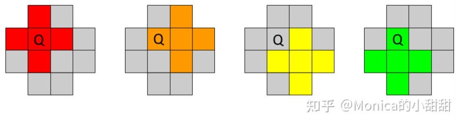

[toc]


# FSR技术分析


## 1. SIGGRAPH课程分析

### 1. 源码介绍

**FSR源码核心**是两个文件：

- `ffx_a.h`：Portability header（可移植头文件）
- `ffx_fsr1.h`：核心算法集合：
  - `EASU`：边缘自适应**空间升频**（**Edge Adaptive Spatial Upsampling** ）
  - `RCAS`：鲁棒的对比度自适应**锐化**（Robust Contrast Adaptive ==Sharpening==）
  - `LFGA`：Linear ==Film Grain== Applicator
  - `SRTM`：Simple Reversible ==Tonemapper==
  - `TEPD`：Temporal Energy Preserving ==Dither==

### 2. EASU简单介绍

:one:==EASU==最好的描述是：一个局部自适应的==椭圆Lanczos式滤波器==。`Lanczos`是一种重采样算法，是一个**sinc函数**。这是一个**理论上最佳的重建滤波器**。

==EASU==需要有**良好的抗锯齿输入**作为基础——它本身并不是一个抗锯齿的解决方案，因此它需要**良好的抗锯齿**来作为输入。

:two:`EASU`使用的是一个如下所示的**`12-tap`的窗口**来进行**空间升频**：


> 使用`12 tap`的好处之一，就是如果我们使用`Float32`，那么我们只需要`32`个寄存器来存储：$16_{register}=12_{tap}*3_{rgb}$。由后续算法可知， 窗口内的数据都要使用两次，与其每次都读取纹理，不如直接存储下来使用，这也是一种==**以空间换取时间**==了。

读取得到**RGB数据**，和很多`DLAA`算法类似，需要转换成`luma`，这里的**转换算法**非常简单：

```c++
float RGB2Luma(float3 rgb)
{
	return rgb.x + 2.0 * rgb.y + rgb.z;
}
```

对于这个**`12-tap`的窗口**，算法会进行四次`+`类型的分析，如下所示：


:three:每次`+`类型分析，其实就是**边缘检测**和**特征长度计算**（`Feature length `），关于后者：`EASU`会忽略**单像素特征**，也就是**完全翻转**（例如：黑-白-黑，**滤波器核**变得**对称**和**无方向性**），而关心**部分翻转**和**不翻转**。如下图所示：


此外，`EASU`最好运行在==感知空间==（例如：`sRGB`、`Gamma 2.0`），**线性空间**虽然也可以，但效果会变差。

:four:正如之前所说，`+`分析之后，我们会得到两个结果：

- `direction`：每个`+`类型分析的结果有三个类型：水平、垂直、对角线。我们要进行**四次分析**，对四次分析结果进行**双线性插值**，得到**最终的方向**。我们根据这个方向来**旋转过滤核**。
- `length`：**长度**用于在`X`和`Y`轴上对**旋转后的内核**进行**缩放**。

对于**缩放**，更加准确的算法解释是：

- `X`轴：缩放区间是$[1,\sqrt{2}]$，对应的是从**轴对齐**到**对角线**。这意味着：对角线情况下使用更大的内核，来避免**带状伪影**（`band`）。
- `Y`轴：缩放区间是$[1,2]$​，对应的是从`small feature`到`large feature`。这意味着：对**小的特征**使用无比例，这样就得到了一个**小的对称核**，它不会在特征本身之外采样。而当特征变大时，使用一个**较长的核**，这样我们可以更好地**还原边缘**。

:five:正如一开始所说，算法使用的过滤核是`lanczos`核，但是原始内核的计算太过昂贵，所以`EASU`使用了==多项式近似==：
$$
[\frac{25}{16}(\frac{2}{5}x^2-1)^2-(\frac{25}{16}-1)](wx^2-1)^2
$$
其中，`w`可以看作是**控制窗口的基数**。以下图为例子：当$w=1/4$时，**内核是宽的**，范围是$[-2,2]$；当$w=1/2$时，**内核是窄的**，范围是$[-\sqrt{2},\sqrt{2}]$。


## 2. EASU源码分析

### 1. FsrEasuCon分析

根据官方信息，我们可以知道：在`CPU`端，我们需要调用此函数，来设置`EASU`算法所需的四个`const vec4`常量，我们接下来分析这些常量都填充了什么。

:one:首先是`con0`，它的第一个和第二个成员，填充的是**输入/输出的分辨率比**：
$$
con0.xy=\frac{inputViewportInPixels}{outputSizeInPixels}
$$
它的第三个和第四个成员，则是使用了类似 $[0,1]\rightarrow [-1,1]$ 的映射公式：
$$
con0.zw=0.5 *\frac{inputViewportInPixels}{outputSizeInPixels}-0.5
$$
:two:在分析其他常量之前，我们需要参考如下图片：


然后直接看看代码（**分析**也在代码处给了）：

```c++
// Note : 
// ARcpF1(x) : 1/x
// AU1_AF1 : 打包函数
// AF1_ : 类型转换函数

// This is used to get upper-left of 'F' tap.
// 所以采样原点是`F`tap的左上方那个空白处
con1[0] = AU1_AF1(ARcpF1(inputSizeInPixelsX));
con1[1] = AU1_AF1(ARcpF1(inputSizeInPixelsY));

// Centers of gather4, first offset from upper-left of 'F'
// 根据后续代码可以知道，con1.zw是用来以`F`为原点，来定位`(0)`处
con1[2] = AU1_AF1(AF1_( 1.0) * ARcpF1(inputSizeInPixelsX));
con1[3] = AU1_AF1(AF1_(-1.0) * ARcpF1(inputSizeInPixelsY));

// These are from (0) instead of 'F'.
// 依据注释，以上四个偏移是以(0)为原点的
// 下面依次是 ： (1) (2) (3) (0)的位置
con2[0] = AU1_AF1(AF1_(-1.0) * ARcpF1(inputSizeInPixelsX));
con2[1] = AU1_AF1(AF1_( 2.0) * ARcpF1(inputSizeInPixelsY));

con2[2] = AU1_AF1(AF1_( 1.0) * ARcpF1(inputSizeInPixelsX));
con2[3] = AU1_AF1(AF1_( 2.0) * ARcpF1(inputSizeInPixelsY));

con3[0] = AU1_AF1(AF1_( 0.0) * ARcpF1(inputSizeInPixelsX));
con3[1] = AU1_AF1(AF1_( 4.0) * ARcpF1(inputSizeInPixelsY));

con3[2] = con3[3] = 0;
```

ToDo：暂时先不管了，先来看之后的源码吧


### 2. FidelityFXSuperResolution分析

根据`PostProcessFFX_FSR.usf`的`MainPs`函数，我们可以知道`EASU`算法的实现是在`FidelityFXSuperResolution()`中的，现在让我们来分析它。

```c++
AF4 FidelityFXSuperResolution(AU2 gxy)
{
	// FSR / EASU()
	AF3 Gamma2Color = AF3(0,0,0);
	FsrEasuF(Gamma2Color, gxy, Const0, Const1, Const2, Const3);
	
	AF3 OutColor = AF3(Gamma2Color);
	
	// Grain()
	// if RCAS & ChromAb are not running, we will apply Grain Intensity post-upscale here.
	// App should disable this path based on pass inputs on the CPU-side;
	#if USE_GRAIN_INTENSITY
		AF3 LinearColor = Gamma2ToLinear(AF3(Gamma2Color));
		ApplyUE4Grain(LinearColor, gxy, VPColor_ExtentInverse);
	#endif // USE_GRAIN_INTENSITY
	
	// 一些颜色空间的变换操作
    ...
    return AF4(OutColor, 1);
}
```

仔细一看，其实核心也是调用的函数：`FsrEasuF`。我们暂且不管`ApplyUE4Grain`，而直接去分析`FsrEasuF`。


### 3. FsrEasuF分析

:one:首先，就参数而言，主要是：

```c++
void FsrEasuF(
 out AF3 pix,
 AU2 ip, // 整数像素位置
 AU4 con0, // FsrEasuCon中设置的四个const vector
 AU4 con1,
 AU4 con2,
 AU4 con3)
```

然后，参考下图的`12 tap`窗口的编号：


首先，我们获得`f`的位置，得到`fp`：

```c++
// Get position of 'f'.
AF2 pp = AF2(ip) * AF2_AU2(con0.xy) + AF2_AU2(con0.zw);
AF2 fp = floor(pp);
pp -= fp;
```

然后，根据**输入的const向量**，我们可以得到四个`tap`的中心：


```c++
// Allowing dead-code removal to remove the 'z's.
// 以F为原点，定位到(0)
AF2 p0 = fp * AF2_AU2(con1.xy) + AF2_AU2(con1.zw);
// These are from p0 to avoid pulling two constants on pre-Navi hardware.
// 以(0)为原点。定位(1) (2) (3)
AF2 p1 = p0 + AF2_AU2(con2.xy);
AF2 p2 = p0 + AF2_AU2(con2.zw);
AF2 p3 = p0 + AF2_AU2(con3.xy);
```

:two:然后是以下的一大串调用：

```c++
AF4 bczzR = FsrEasuRF(p0);
AF4 bczzG = FsrEasuGF(p0);
AF4 bczzB = FsrEasuBF(p0);
AF4 ijfeR = FsrEasuRF(p1);
AF4 ijfeG = FsrEasuGF(p1);
AF4 ijfeB = FsrEasuBF(p1);
AF4 klhgR = FsrEasuRF(p2);
AF4 klhgG = FsrEasuGF(p2);
AF4 klhgB = FsrEasuBF(p2);
AF4 zzonR = FsrEasuRF(p3);
AF4 zzonG = FsrEasuGF(p3);
AF4 zzonB = FsrEasuBF(p3);
```

这些`FsrEasuXF`函数是我们用户自定义的，在`PostProcessFFX_FSR.usf`中可以找到其定义：

```c++
AF4 FsrEasuRF(AF2 p) { AF4 res = InputTexture.GatherRed  (samLinearClamp, p, ASU2(0, 0)); return res; }
AF4 FsrEasuGF(AF2 p) { AF4 res = InputTexture.GatherGreen(samLinearClamp, p, ASU2(0, 0)); return res; }
AF4 FsrEasuBF(AF2 p) { AF4 res = InputTexture.GatherBlue (samLinearClamp, p, ASU2(0, 0)); return res; }
```

> 对于`GatherRed`类函数，可以参考https://docs.microsoft.com/zh-cn/windows/win32/direct3dhlsl/sm5-object-texture2d-gatherred。

所以，上面就是读取四个`tap`的值，不过和一般的读取不同，我们是读取一个$2\times2$区域的指定通道。所以我们可以很快的转换成`luma`：

```c++
// Simplest multi-channel approximate luma possible (luma times 2, in 2 FMA/MAD).
AF4 bczzL = bczzB * AF4_(0.5) + (bczzR * AF4_(0.5) + bczzG);
AF4 ijfeL = ijfeB * AF4_(0.5) + (ijfeR * AF4_(0.5) + ijfeG);
AF4 klhgL = klhgB * AF4_(0.5) + (klhgR * AF4_(0.5) + klhgG);
AF4 zzonL = zzonB * AF4_(0.5) + (zzonR * AF4_(0.5) + zzonG);
```

虽然我们读取了16个`vec3`数据，但是实际上正如**之前的理论探讨**所说，我们只需要`12`个`vec3`数据，接下来我们直接把**所需的数据**单独提取出来：

```c++
// Rename.
AF1 bL = bczzL.x;
AF1 cL = bczzL.y;
AF1 iL = ijfeL.x;
AF1 jL = ijfeL.y;
AF1 fL = ijfeL.z;
AF1 eL = ijfeL.w;
AF1 kL = klhgL.x;
AF1 lL = klhgL.y;
AF1 hL = klhgL.z;
AF1 gL = klhgL.w;
AF1 oL = zzonL.z;
AF1 nL = zzonL.w;
```

:three:接下里，就是对`4`个`taps`窗口进行分析，来计算得到`direction`和`length`：

```c++
// Accumulate for bilinear interpolation.
AF2 dir = AF2_(0.0);
AF1 len = AF1_(0.0);
FsrEasuSetF(dir,len,pp,true, false,false,false,bL,eL,fL,gL,jL);
FsrEasuSetF(dir,len,pp,false,true ,false,false,cL,fL,gL,hL,kL);
FsrEasuSetF(dir,len,pp,false,false,true ,false,fL,iL,jL,kL,nL);
FsrEasuSetF(dir,len,pp,false,false,false,true ,gL,jL,kL,lL,oL);
```

#### FsrEasuSetF分析

:one:首先，我们很快可以知道：这个函数的`4`个`bool`参数是用来区分`tap`的位置，从而计算**双线性插值的权重**：

```c++
AF1 w = AF1_(0.0);
if(biS) w = (AF1_(1.0) - pp.x) * (AF1_(1.0) - pp.y);
if(biT) w =              pp.x  * (AF1_(1.0) - pp.y);
if(biU) w = (AF1_(1.0) - pp.x) *              pp.y ;
if(biV) w =              pp.x  *              pp.y ;
```

> ==上面的权重计算怎么来的==？首先，我们需要知道，`12 tap`窗口默认是套在`f`编号上的（下图`Q`点），也就是我们应该按照下图计算双线性插值：
>
> 
>
> ![[公式]](https://www.zhihu.com/equation?tex=Q) 点通常不是整数， ![[公式]](https://www.zhihu.com/equation?tex=O%3Dfloor%28Q%29) 。假设 ![[公式]](https://www.zhihu.com/equation?tex=Q) 点在以 ![[公式]](https://www.zhihu.com/equation?tex=O) 点为原点的坐标系中坐标为 ![[公式]](https://www.zhihu.com/equation?tex=%28x%2Cy%29) ,则双线性插值之后的结果为：
>
> 
>
> 

然后，我们给`tap`窗口进行编号，如下所示：


先以`x`轴方向为例，计算`direction`很简单，就是**梯度**，然后乘上**双线性插值权重**：

```c++
AF1 dirX = lD - lB;
dir.x += dirX * w;
```

:two:`length`（==边缘特征==）的计算则要复杂很多：

```c++
// ASatF1 : saturate
AF1 dc = lD - lC;
AF1 cb = lC - lB;
AF1 lenX = max(abs(dc),abs(cb));
// 快速倒数 1/lenX
lenX = APrxLoRcpF1(lenX);
// 分子结合分母，然后clamp
lenX = ASatF1(abs(dirX) * lenX);
lenX *= lenX;
// 乘上双线性插值权重
len += lenX * w;
```

根据[大佬博客](https://zhuanlan.zhihu.com/p/401030221)和直接推导，可以很容易得到：`EASU`定义的==边缘特征的计算公式==为：


以上代码就是$FX^2$的计算。

:three:之后就是在`Y`轴重复一遍代码：

```c++
AF1 ec = lE-lC;
AF1 ca = lC-lA;
AF1 lenY = max(abs(ec),abs(ca));
lenY = APrxLoRcpF1(lenY);
AF1 dirY = lE-lA;
dir.y += dirY*w;
lenY = ASatF1(abs(dirY)*lenY);
lenY *= lenY;
len += lenY*w;
```


#### 回到主函数1

:one:回到**主函数**，我们已经得到了双线性插值完毕的`direction`和`length`（边缘特征）。首先，我们对`direction`进行**归一化**，由于要考虑**除零问题**，所以代码稍显复杂，但其实就是**归一化**：

```c++
AF2 dir2 = dir * dir;
AF1 dirR = dir2.x + dir2.y;
AP1 zro = dirR < AF1_(1.0 / 32768.0);
dirR = APrxLoRsqF1(dirR);
dirR = zro ? AF1_(1.0) : dirR;
dir.x = zro ? AF1_(1.0) : dir.x;
dir *= AF2_(dirR);
```

然后，根据以下公式，由`length`计算出实际的`Feature`（$F/2$ 是了从$[0,2]$映射回$[0,1]$）：


```c#
// Transform from {0 to 2} to {0 to 1} range, and shape with square.
len = len * AF1_(0.5);
len *= len;
```

:two:我们然后计算`stretch`变量，用于拉伸**过滤核**：对其轴线时，这个值为`1`，对其对角线时，这个值为$\sqrt{2}$。具体代码如下：

```c++
// Stretch kernel {1.0 vert|horz, to sqrt(2.0) on diagonal}.
// 因为归一化了，分母不就是1吗
AF1 stretch = (dir.x * dir.x + dir.y * dir.y) * APrxLoRcpF1(max(abs(dir.x), abs(dir.y)));
```

:three:然后计算`len2`：

```c++
// Anisotropic length after rotation,
//  x := 1.0 lerp to 'stretch' on edges
//  y := 1.0 lerp to 2x on edges
AF2 len2 = AF2(AF1_(1.0) + (stretch - AF1_(1.0)) * len,AF1_(1.0) + AF1_(-0.5) * len);
```

数学上的形式如下：


> 大佬指出：为了减少锯齿，`EASU`还提出可以根据**梯度和边缘信息**进行缩放，EASU定义的缩放比例如上。

回顾第一大节，我们也说了：“**长度**用于在`X`和`Y`轴上对**旋转后的内核**进行**缩放**”。所以，我们得到的`len2`是为了缩放过滤核的`size`。这里就是我们要计算`Feature`的两大目的之一了。

:four:然后计算：

```c++
// Based on the amount of 'edge',
// the window shifts from +/-{sqrt(2.0) to slightly beyond 2.0}.
AF1 lob = AF1_(0.5) + AF1_((1.0 / 4.0 - 0.04) - 0.5) * len;
// Set distance^2 clipping point to the end of the adjustable window.
AF1 clp = APrxLoRcpF1(lob);
```

这里又是干什么的，别忘了，我们使用的过滤核是`lanczos`核，所以我们还一个值没有确定，那就是用于控制其形状的基数`w`，而这个就是通过`Feature`（也就是`length`）获得的，这里直接给出**映射公式**：
$$
w=\frac{1}{2}-\frac{1}{4}Feature
$$
那么上诉`lob`的计算其实就是这个公式，也就是 $lob=w$。那第二行呢，这个其实是为了==裁剪==——至于为什么，以及怎么得出裁剪值是$\frac{1}{\sqrt{w}}$，具体见：https://zhuanlan.zhihu.com/p/401030221。

:five:计算得到`12 tap`窗口的**最大值**和**最小值**：

```c++
AF3 min4 = min(AMin3F3(AF3(ijfeR.z,ijfeG.z,ijfeB.z),AF3(klhgR.w,klhgG.w,klhgB.w),AF3(ijfeR.y,ijfeG.y,ijfeB.y)),
               AF3(klhgR.x,klhgG.x,klhgB.x));
AF3 max4 = max(AMax3F3(AF3(ijfeR.z,ijfeG.z,ijfeB.z),AF3(klhgR.w,klhgG.w,klhgB.w),AF3(ijfeR.y,ijfeG.y,ijfeB.y)),
               AF3(klhgR.x,klhgG.x,klhgB.x));
```

:six:然后，就是调用`FsrEasuTapF` 12次，累加`aC`（颜色）和`aW`（权重）：

```c++
AF3 aC = AF3_(0.0);
AF1 aW = AF1_(0.0);
FsrEasuTapF(aC,aW,AF2( 0.0,-1.0)-pp,dir,len2,lob,clp,AF3(bczzR.x,bczzG.x,bczzB.x)); // b
FsrEasuTapF(aC,aW,AF2( 1.0,-1.0)-pp,dir,len2,lob,clp,AF3(bczzR.y,bczzG.y,bczzB.y)); // c
FsrEasuTapF(aC,aW,AF2(-1.0, 1.0)-pp,dir,len2,lob,clp,AF3(ijfeR.x,ijfeG.x,ijfeB.x)); // i
FsrEasuTapF(aC,aW,AF2( 0.0, 1.0)-pp,dir,len2,lob,clp,AF3(ijfeR.y,ijfeG.y,ijfeB.y)); // j
FsrEasuTapF(aC,aW,AF2( 0.0, 0.0)-pp,dir,len2,lob,clp,AF3(ijfeR.z,ijfeG.z,ijfeB.z)); // f
FsrEasuTapF(aC,aW,AF2(-1.0, 0.0)-pp,dir,len2,lob,clp,AF3(ijfeR.w,ijfeG.w,ijfeB.w)); // e
FsrEasuTapF(aC,aW,AF2( 1.0, 1.0)-pp,dir,len2,lob,clp,AF3(klhgR.x,klhgG.x,klhgB.x)); // k
FsrEasuTapF(aC,aW,AF2( 2.0, 1.0)-pp,dir,len2,lob,clp,AF3(klhgR.y,klhgG.y,klhgB.y)); // l
FsrEasuTapF(aC,aW,AF2( 2.0, 0.0)-pp,dir,len2,lob,clp,AF3(klhgR.z,klhgG.z,klhgB.z)); // h
FsrEasuTapF(aC,aW,AF2( 1.0, 0.0)-pp,dir,len2,lob,clp,AF3(klhgR.w,klhgG.w,klhgB.w)); // g
FsrEasuTapF(aC,aW,AF2( 1.0, 2.0)-pp,dir,len2,lob,clp,AF3(zzonR.z,zzonG.z,zzonB.z)); // o
FsrEasuTapF(aC,aW,AF2( 0.0, 2.0)-pp,dir,len2,lob,clp,AF3(zzonR.w,zzonG.w,zzonB.w)); // n
```


#### FsrEasuTapF分析

:one:首先，参数分析：

```c++
// Filtering for a given tap for the scalar.
 void FsrEasuTapF(
 inout AF3 aC, // 累积的颜色, with negative lobe.
 inout AF1 aW, // 累积的权重.
 AF2 off, // Pixel offset from resolve position to tap. 偏移
 AF2 dir, // Gradient direction. 旋转过滤核
 AF2 len, // Length.  缩放过滤核
 AF1 lob, // Negative lobe strength.  控制基数w
 AF1 clp, // Clipping point.  裁剪点
 AF3 c){ // Tap color.  tap的颜色
```

:two:使用方向渲染`offset`（本质就是**旋转过滤核**）：

```c++
// Rotate offset by direction.
AF2 v;
v.x = (off.x * ( dir.x)) + (off.y * dir.y);
v.y = (off.x * (-dir.y)) + (off.y * dir.x);
```

然后，继续缩放：

```c++
// Anisotropy.
v *= len;
```

:three:计算当前的位置离`resolve point`的距离，然后进行裁剪：


```c++
// Compute distance^2.
AF1 d2 = v.x * v.x + v.y * v.y;
// Limit to the window as at corner, 2 taps can easily be outside.
d2 = min(d2,clp);
```

:four:以下一大串都是，以`w`和`d2`（也就是`x`）作为输入，来应用`lanczos`核，也就是计算当前`tap`的权重：
$$
[\frac{25}{16}(\frac{2}{5}x^2-1)^2-(\frac{25}{16}-1)](wx^2-1)^2
$$

```c++
AF1 wB = AF1_(2.0 / 5.0) * d2 + AF1_(-1.0);
AF1 wA = lob * d2 + AF1_(-1.0);
wB *= wB;
wA *= wA;
wB = AF1_(25.0/16.0)*wB+AF1_(-(25.0/16.0-1.0));
AF1 w = wB * wA;
```

:five:最后，累加颜色和权重：

```c++
aC += c * w;
aW += w;
```


#### 回到主函数2

$$
C=\frac{1}{\sum_{i=0}^{n}w_i}\sum_{i=1}^{n}w_iC_i
$$

最后，进行基操：**累加的颜色**，除以**累加权重**。然后使用之前计算好的**局部最大值**和**最小值**，对结果进行`clamp`：

```c++
pix = min(max4, max(min4, aC * AF3_(ARcpF1(aW))));
```


## 3. RACS源码分析

在`EASU Pass`完成后，不需要进行**颜色转换**，将其输出直接传入`RCAS`，进行了**自适应锐化**，来强化**边缘信息**。过去的`CAS`使用一个简化的机制，将**局部对比度**转换为**锐度**。而`RACS`使用了一种更精确的机制，在`clipping`之前计算出**最大的局部锐度**。

### 1. 算法分析

:one:`RCAS`就是一个**拉普拉斯算子的变种**，其模板为：


`RCAS` 通过查看信号可能超出 $[0,1]$ 输入范围的位置，来求解`w`：
$$
0==\frac{w*(n+e+w+s)+m}{4*w+1}\rightarrow w=-\frac{m}{n+e+w+s}=w_1
\\
1==\frac{w*(n+e+w+s)+m}{4*w+1}\rightarrow w=\frac{1-m}{n+e+w+s-4}=w_2
$$
其中，$n,e,w,s,m$ 是算子中那`5`个像素（北部像素、东部像素等）。然后，我们通过对这两个值进行`max`操作，选择不会导致`clipping`的值。最后乘上锐度：
$$
w=max(w_1,w_2)\cdot sharp
$$
:two:但正如我们之前所说，算法的应用流程如下：


如果AA算法是`MSAA`，**沿着梯度的步骤**会导致**边缘检测问题**。`RCAS`通过使用**局部最大值**和**局部最小值**来代替具体像素的颜色值，大致如下：
$$
w=max(-\frac{Min}{4Max},\frac{1-Max}{4Min-4})* sharp
$$
:three:`RCAS`做了一个**简单的高通**，对**局部对比度**进行了**归一化处理**，然后进行了`shape`：


上面这个滤波核被用作==噪声检测滤波器==，以减少`RCAS`对`Grain`的影响，并关注**真正的边缘**。


### 2. FsrRcasCon分析

:one:和`EASU`一样，`RCAS`也需要首先在`CPU`端进行所需常量的设置。这个函数比较简单，感觉就是把用户设置的**感知锐度**，转换到**线性锐度**：

```c++
A_STATIC void FsrRcasCon(
    outAU4 con,
    // The scale is {0.0 := maximum, to N>0, where N is the number of stops (halving) of the reduction of sharpness}.
    AF1 sharpness)
{
    // Transform from stops to linear value.
    sharpness = AExp2F1(-sharpness);
    varAF2(hSharp) = initAF2(sharpness,sharpness);
    con[0] = AU1_AF1(sharpness);
    con[1] = AU1_AH2_AF2(hSharp);
    con[2] = 0;
    con[3] = 0;
}
```


### 3. FsrRcasF分析

:one:和`EASU`类似，也是`MainPs`调用`RCASPassCommon`，然后`RCASPassCommon`调用`FsrRcasF`，我们这里就直接分析`FsrRcasF`。

:two:首先是**采样缓冲区**，获得所需的数据：

```c++
ASU2 sp = ASU2(ip);
AF3 b = FsrRcasLoadF(sp + ASU2( 0,-1)).rgb;
AF3 d = FsrRcasLoadF(sp + ASU2(-1, 0)).rgb;
#ifdef FSR_RCAS_PASSTHROUGH_ALPHA
	AF4 ee = FsrRcasLoadF(sp);
	AF3 e = ee.rgb;
	pixA = ee.a;
#else
	AF3 e = FsrRcasLoadF(sp).rgb;
#endif
AF3 f = FsrRcasLoadF(sp+ASU2( 1, 0)).rgb;
AF3 h = FsrRcasLoadF(sp+ASU2( 0, 1)).rgb;
// Rename (32-bit) or regroup (16-bit).
AF1 bR = b.r;
AF1 bG = b.g;
AF1 bB = b.b;
AF1 dR = d.r;
AF1 dG = d.g;
AF1 dB = d.b;
AF1 eR = e.r;
AF1 eG = e.g;
AF1 eB = e.b;
AF1 fR = f.r;
AF1 fG = f.g;
AF1 fB = f.b;
AF1 hR = h.r;
AF1 hG = h.g;
AF1 hB = h.b;
```

然后是**额外的输入变换**，这个是我们根据自己的需求，来自定义的，默认为空，啥也不做：

```c++
// Run optional input transform.
FsrRcasInputF(bR,bG,bB);
FsrRcasInputF(dR,dG,dB);
FsrRcasInputF(eR,eG,eB);
FsrRcasInputF(fR,fG,fB);
FsrRcasInputF(hR,hG,hB);
```

接下来，转化为`luma`：

```c++
// Luma times 2.
AF1 bL = bB * AF1_(0.5) + (bR * AF1_(0.5) + bG);
AF1 dL = dB * AF1_(0.5) + (dR * AF1_(0.5) + dG);
AF1 eL = eB * AF1_(0.5) + (eR * AF1_(0.5) + eG);
AF1 fL = fB * AF1_(0.5) + (fR * AF1_(0.5) + fG);
AF1 hL = hB * AF1_(0.5) + (hR * AF1_(0.5) + hG);
```

:three:然后，是按照算法分析中所说，利用那个**简单的高通滤波器**，计算得到一个值`nz`：

```c++
AF1 nz = AF1_(0.25) * bL + AF1_(0.25) * dL + AF1_(0.25) * fL + AF1_(0.25) * hL - eL;
```

之后，利用**局部最大值和局部最小值**，进行**二次确认**：
$$
nz=clamp(\frac{nz}{max-min})
$$

```c++
nz = ASatF1(abs(nz) * APrxMedRcpF1(AMax3F1(AMax3F1(bL, dL, eL), fL, hL) - AMin3F1(AMin3F1(bL, dL, eL), fL, hL)));
```

最后，进行重映射：
$$
nz=1-0.5*nz
$$

```c#
nz = AF1_(-0.5) * nz + AF1_(1.0);
```

:four:然后就是进行`Rcas`锐化，但这里有一点很大的变化，就是：它是对`RGB`三个分量，都进行一次计算，得到三个对应的`lobeX`（`w`），然后取三者的最小值，进行一些`clamp`之后，乘上锐度（就是一开始设置的`const`常量），作为最后的权重：
$$
lobe=max(limit,min(lobeR,lobeG,lobeB))*sharp
$$

```c++
// Min and max of ring.
AH1 mn4R = min(AMin3H1(bR, dR, fR), hR);
AH1 mn4G = min(AMin3H1(bG, dG, fG), hG);
AH1 mn4B = min(AMin3H1(bB, dB, fB), hB);
AH1 mx4R = max(AMax3H1(bR, dR, fR), hR);
AH1 mx4G = max(AMax3H1(bG, dG, fG), hG);
AH1 mx4B = max(AMax3H1(bB, dB, fB), hB);
// Immediate constants for peak range.
AH2 peakC=AH2(1.0,-1.0*4.0);
// Limiters, these need to be high precision RCPs.
AH1 hitMinR = mn4R * ARcpH1(AH1_(4.0) * mx4R);
AH1 hitMinG = mn4G * ARcpH1(AH1_(4.0) * mx4G);
AH1 hitMinB = mn4B * ARcpH1(AH1_(4.0) * mx4B);
AH1 hitMaxR = (peakC.x - mx4R) * ARcpH1(AH1_(4.0) * mn4R + peakC.y);
AH1 hitMaxG = (peakC.x - mx4G) * ARcpH1(AH1_(4.0) * mn4G + peakC.y);
AH1 hitMaxB = (peakC.x - mx4B) * ARcpH1(AH1_(4.0) * mn4B + peakC.y);
AH1 lobeR = max(-hitMinR,hitMaxR);
AH1 lobeG = max(-hitMinG,hitMaxG);
AH1 lobeB = max(-hitMinB,hitMaxB);
AH1 lobe = max(AH1_(-FSR_RCAS_LIMIT), min(AMax3H1(lobeR,lobeG,lobeB), AH1_(0.0))) * AH2_AU1(con.y).x;
```

如果，我们需要进行降噪，就乘上之前计算好的`nz`：

```c++
// Apply noise removal.
#ifdef FSR_RCAS_DENOISE
	lobe *= nz;
#endif
```

:five:最后，实际运用`RCAS`锐化：

```c++
// Resolve, which needs the medium precision rcp approximation to avoid visible tonality changes.
AH1 rcpL = APrxMedRcpH1(AH1_(4.0) * lobe + AH1_(1.0));
pixR = (lobe * bR + lobe * dR + lobe * hR + lobe * fR + eR) * rcpL;
pixG = (lobe * bG + lobe * dG + lobe * hG + lobe * fG + eG) * rcpL;
pixB = (lobe * bB + lobe * dB + lobe * hB + lobe * fB + eB) * rcpL;
```


## 4. 为什么使用`lanczos`核以及`w`的映射问题

> 以下转载自[大佬博客](https://zhuanlan.zhihu.com/p/401030221)


