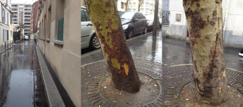
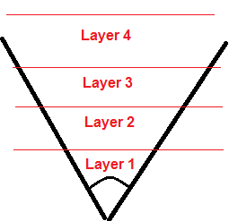

# 1. 观察雨天

夜间下雨时，每个人首先注意到的是**明亮光源**的==长长高光反射==：


但这不限于夜晚（甚至不限于潮湿的表面，只有**在潮湿的表面上才会更明显**）：


**高光**随底层表面的**粗糙度**而变化：


**高光大小**取决于**视角**。**各向异性反射**似乎遵循` Blinn-Phong` 行为（`Blinn-Phong `模型也不允许拉伸太多）：


水首先在低深度处积聚，当积累了足够的水时，我们可以看到**薄薄的水层**或深水坑表现出==双层行为==。我们可以看到一个水层和一个下面的表面层：


水层的反射遵循**菲涅耳定律**。这意味着你在**掠射角** (`0°`) 处有全反射，而在垂直于表面 (`90°`) 时有低反射：


具体反射情况，取决于**入射光的亮度**和**底层表面的反照率**。当下层表面有**暗反照率**并且天空晴朗时，水面的行为几乎像一面**镜子**：


==湿表面漫反射更暗，镜面更亮==：


但**漫反射项**不是都会在雨天变暗（这些材质既有金属也有塑料），


**干燥**是不规则的（可能取决于**曲率**），可能需要很长的时间，取决于**天气**（阴天、暖天、晴天）。


干燥时，**镜面反射强度**消失得比**漫反射变暗**快。


**表面不会以相同的速度干燥**（左侧完全湿，右侧干燥，中间）：


与雨平行的物体，如墙壁，几乎不受它的影响。像树这样具有复杂方向的对象会受到影响，但不会是所有（右树是湿的，左树是相反的干侧）：



照明对下雨有很大影响，尤其是在夜间。**雨滴通常很难看到**，但在**反射光线**时非常明显。雨滴被认为是**条纹粒子**，但实际上**长条纹**是由相机或我们眼睛的**运动模糊**造成的。

在强降雨下，由于大气散射效应，光线透过雨产生**雾状辉光效果**：


# 2. 动态雨及其效果1

## 雨效果

### 雨溅/落下的水滴溅起

在现实世界中，当落下的水滴撞击表面时，会产生**飞溅**。雨水在屋顶或树等高处流动，会产生**下落的水滴**，这两种情况的行为是相同的。我们将第一时间关注**雨滴**。当代表雨滴的拉伸粒子与场景碰撞时，可以通过生成**水溅粒子**在游戏中轻松模拟雨溅。**跟踪与场景碰撞的每个粒子的成本可能很高**。有这么多雨滴造成水溅，很难区分哪个雨滴引起了特定的雨溅。基于这一事实并出于性能原因，**拥有两个独立的系统来管理雨滴和雨溅会更简单**。大多数游戏从**世界顶部**开始向下发出一堆**随机射线**（使用**场景的简单几何表示**，而不是完整的游戏场景），然后在**碰撞的起点**处生成**水溅粒子**。

作为优化，**水花**只在靠近屏幕的地方产生。当拥有无法简单近似的**复杂几何体**时，**另一个简单的解决方案**是在几何体边界后**手动放置水溅粒子发射器**。

我们尝试了**另一种方法**。我们可以简单地从**下雨方向的顶部**渲染**depth map**，这提供了我们在世界中任意位置发射**水溅粒子**所需的所有信息，方法的步骤：

– 渲染**深度图**（一个`pass`）

– 将深度图从` GPU `传输到` CPU `内存

– 使用深度图，根据世界几何生成**随机位置**

– 在生成的位置发射水溅

为了渲染**深度图**，我们将当前相机前面的一个**虚拟位置**链接起来，但要高一点，然后从这个角度渲染世界几何。所有**标准阴影贴图优化**都适用于此处（剔除方法、` Z double speed`、在不透明后渲染蒙版、仅具有位置的流、不渲染太小的对象、强制 `lod `网格等……）。由于并非世界上的所有地方都需要生成雨水溅落，因此我们为美术师添加了额外的**网格标记方法**，以指定**是否需要在深度图中渲染网格**。我们还允许只在深度图中渲染网格，而不是在正常场景中渲染。当有半透明物体（如玻璃）时，该物体应该可以挡雨但无法在**不透明的深度图**中渲染。


从该深度图生成的**世界位置的精度**取决于**深度图的分辨率**和**截锥体的大小**。使用 `256×256 `深度图和 `20m x 20m` 正交平截头体，我们在深度图的高度处得到 `7.8cm² `的世界单元。光栅化器将控制深度图中的高度存储。这意味着如果您在 7.8 平方厘米的单元格中放置一个**高度差异很大的物体**，则水溅很可能会在**错误的高度**产生。这是内存和性能之间的权衡。

为了渲染深度图，我们可以使用**正交矩阵**或**透视矩阵**。我们还没有发现透视矩阵的任何用法，但在下面我假设我们可以同时拥有两者。此外，在控制台或 DX10 及更高版本上，我们可以访问深度缓冲区，因此我们将使用此功能。在 PC DX9 上，我们将**深度值**存储在**颜色缓冲区的 alpha 通道**中。为了与其他平台保持一致，深度值存储在标准化坐标设备中。在透视投影的情况下，反向`float`深度值用于提高精度。这是此编码的 PC DX9 伪代码：

```glsl
// ScreenPosition is the projected position
#if ORTHOGONAL
// We encode the Z device value for orthogonal matrix 
// ScreenPosition.w is supposed to be 1.0 in orthogonal projection matrix
OutColor = float4(0, 0, 0, ScreenPosition.z / ScreenPosition.w);
#else // PERSPECTIVE
// Define A = ProjectionMatrix[2][2] and B = ProjectionMatrix[3][2] (row major)
// Standard projection do Z_NDC = A + B / Z  => Reversed (1 - Z_NDC) = 1 - A - B / Z
OutColor = float4(0, 0, 0, 1 - A - B / ScreenPosition.w);
#endif
```


将深度图传到`CPU`端（例如：RT），然后使用`CPU`生成位置。首先，设置一个**发射器**以在**兴趣点**（如玩家）周围的区域中产生粒子。该区域应在用于**深度图的截锥体**内。在我们的第三人称游戏中，我们在摄像机前定义了一个可变大小的**圆形发射器**，来产生水花。当粒子发射时，用深度图的 `ViewProjection `矩阵投影它的位置，从深度图重建归一化设备位置` Z`，然后用深度图的` InverseViewProjection `取消投影以检索**最终位置**。下面是一些伪代码：

```glsl
// Project current position in our depth map and set world space z location.
Vector4 ShadowPosition = ViewProjMatrix.TransformVector4(Particle->Location);
ShadowPosition = ShadowPosition / ShadowPosition.W;

// Save depth map X Y position for later world space reconstruction
Vector2D PosNDC(Clamp(ShadowPosition.X, -1.0f, 1.0f), Clamp(ShadowPosition.Y, -1.0f, 1.0f));

// If we are out of shadowmap, just kill the pixel (We do this by testing if value change by clamp)
if (PosNDC.X - ShadowPosition.X + PosNDC.Y - ShadowPosition.Y)
{
    return ;
}

// Convert to shadow map texel space - apply a clamp mode address mode
ShadowPosition.X = Clamp(ShadowPosition.X *  0.5f + 0.5f, 0.0f, 1.0f);
ShadowPosition.Y = Clamp(ShadowPosition.Y * -0.5f + 0.5f, 0.0f, 1.0f);

int PosX = (int)(ShadowPosition.X * (float)(SizeX - 1));
int PosY = (int)(ShadowPosition.Y * (float)(SizeY - 1));

#if CONSOLE

Data = &Data[(PosY * DepthBuffer->DepthSurfacePitch) + (PosX * 4)]; // Data is the CPU memory containing the depth map
// Big endian on console - D24S8 depth/stencil buffer
unsigned int Val = (Data[0] << 16) + (Data[1] << 8) + Data[2];    // Remove stencil value
float DepthNDC = (float)Val / 16777215.0f; // 2^24 - 1 == 16777215.0f  (for 24bit depth )

#else

Data = &Data[(PosY * SizeX + PosX) * sizeof(Float16Color)];
float DepthDeviceFloat = ((Float16Color*)Data)->A; // Convert to float

// As inversion is not handled inside the projection matrix but in
// the shader we must invert here
if (UsesInvertedZ && ProjMatrix[3][3] < 1.0f) // Orthogonal projection is not inversed
{
    DepthDeviceFloat = 1.0f - DepthDeviceFloat;
}

#endif

Vector4 ReconstructedPositionWS = InverseViewProjection.TransformVector4(Vector4(PosNDC.X, PosNDC.Y, DepthNDC, 1.0f)); 
Particle->Location = ReconstructedPositionWS/ ReconstructedPositionWS.W;
```

最后，我们使用生成的位置来产生水花。真实飞溅的外观很难建模。[7] 中进行了广泛的研究，总结如下：

> 当落下的水滴撞击表面时，它会受到突然的冲击力。这种冲击使水滴变形并迫使水径向向外流动。一些水最终以无数小水滴的形式离开表面——这一事件被定义为飞溅。飞溅可以通过两种可能的方式发生：`corona splash`，其中薄薄的`crow-shaped`水层垂直上升到表面上方，然后碎裂成较小的水滴；以及`prompt splash`，其中水滴直接从水滴底部喷出而没有形成冠部。

通常，`corona splash`需要在平坦表面上涂上一层**薄薄的水**并保持 `10-20 `毫秒，否则会迅速飞溅。飞溅的动态取决于许多因素，分为两类：**表面的材料属性**（粗糙度、刚性、湿度、倾斜度、疏水性）和**落下的液滴属性**（大小、速度）。粗糙的材料往往对冲击结果有重要影响。冠部的半径和高度与液滴的性质有关，飞溅液滴的数量也与液滴的速度有关。飞溅液滴的分布可以通过随机模型来描述。**所有细节**都可以在[7]中找到。

当然对于游戏来说，在细节上是很难做到的。例如，**玩具店演示**使用从**飞溅的牛奶滴**的高速视频中捕获的**单个四边形纹理动画**。**四边形被缩放以产生多样性**。一个好方法似乎与**撞击的两个主要特征**保持一致：按高度和半径缩放冠形。然而，由于这部分效果通常掌握在 FX 艺术家的手中，他们倾向于做任何他们认为看起来不错的事情，而不管**物理效果**如何。本着这种精神，约翰·大卫·桑森 (John David Thornthon) 为“冰河世纪：崩溃”开发了一种模块化装备，**可以对飞溅进行艺术控制** [**9**]。我们在游戏中使用艺术方式，使用网格来表示`crown shape`和`sprite`来模拟**飞溅的水滴**。下图显示了效果的线框，其中` crown mesh `为白色，**飞溅液滴**为红色（左）。


最后，谈谈**飞溅分布**。产生的飞溅数量取决于雨滴的数量，我们将雨水飞溅的数量与**雨强度值**联系起来。

> 出于**性能原因**，我们不包括**雨溅中的照明信息**，但正如我们在观察部分看到的那样，这在夜间具有重要影响。==背光时更容易看到雨滴==。

### 雨/雨滴

**雨**是**雨效应**中最复杂的（也是研究最多的），而且修复成本很高。在所有情况下，我们看到的是**长条纹**，但实际上雨是由**单个雨滴**组成的。如果我们想渲染真实世界的雨滴，**在正常的低分辨率下，雨滴只有几个像素宽**。此外，由于**雨滴在明亮区域非常微弱，而在黑暗区域往往显得更强烈**，因此游戏与现实完全匹配并不是一个好主意。我们不会考虑雨滴的复杂外观，但可以了解下发生的事情。

**雨滴物理特性的详细描述**可以在[**6**]和[**11**]中找到。以下是主要信息：雨滴是` 0.5-10` 毫米大小的**透明物体**。**较小**的雨滴呈**球形**，但**较大**的雨滴呈**扁球体**。

-  雨滴将环境（包括天空）的大实体角度（`165°`）的光线折射到相机上。此外，被折射的入射光仅衰减了 `6%`。镜面反射和内部反射进一步增加了水滴的亮度。因此，**水滴往往比其背景（它遮挡的场景部分）亮得多**。
- **水滴遮挡的背景立体角远小于水滴本身的总视野。**因此，尽管是透明的，**静止水滴（没有运动模糊）内的平均亮度并不强烈依赖于它的背景。**
- **雨滴的亮度不受其他雨滴的影响**。这是因为对于任何给定的雨滴，由其他雨滴（雨滴很小且相距很远）对向的总立体角与环境对向的总立体角无关。


正确渲染**雨滴**需要通过**反射**、**折射**和**内部反射**渲染球形。当它们下落时，雨滴会经历**快速的形状扭曲**（振荡）。雨滴的恒定速度在**较小雨滴** (`1mm`) 的 `3 m/s `到**较大雨滴** (`> 4mm`) 的` 9 m/s `之间。它们的运动会在图像中产生随机变化的空间和时间强度。这被认为是由于相机或我们的眼睛长时间曝光而产生的条纹：雨滴产生的强度是**运动模糊的**。**雨条纹**的出现在[**8**]中有详细说明：

游戏中有**两种实现雨滴的方法**。使用==粒子系统==或==大纹理==。

**粒子系统方法**通常包括用**简单的形状**（如**矩形**）表示**条纹**。粒子系统通常会产生**逼真的运动**，它们可以被**风力**驱动并在` GPU `上进行有效模拟 [**14**]。为了性能，粒子系统链接到相机，以最小化要管理的**粒子数量**。例如，“Space Marine”使用**视锥体受限粒子生成器** [1]。粒子系统的**主要缺点是缺乏可扩展性**。更强的降水需要增加粒子数量（导致帧率降低）。

**大纹理方法**使用**代表多个条纹的动画纹理**（程序或手工制作）。与粒子系统不同，**大纹理方法对于重降水与轻降水具有相同的性能开销**。但它们**缺乏雨滴深度和运动的真实感**。玩具店演示使用**后处理**。该演示尝试模拟不同速度和不同深度移动的**多层雨滴**。不同的输入用于为**投影纹理**获取生成“`w`”参数。然而，当相机移动时，这种方法的弱点就暴漏了。**雨效果是一个后期处理**，向下看会使雨滴与地面平行。

“飞行模拟器 2004”将**四个动画纹理**映射到==双锥体== [**12**]。通过使用**锥形网格**并倾斜它以适应相机移动，它们可以让降水落向相机。他们缩小四个纹理，并更慢地滚动它，创建**更小且移动更慢的水滴**，以模拟**视差深度**。


为了以合理的性能支持**不同强度的动态降雨**，我们开发了一种类似于 Antoine Zanuttini 描述的“Flight Simulator 2004”的方法：

我们定义了**四层雨**，每一层都代表摄像机前面的一个区域。



每一层都使用相同的`pre-motion blurred raindrops texture`：


我们将**纹理**映射到一个与**相机**相连的`mi-cylinder mi-cone`网格上，并将其定位在**相机原点**。我们从圆柱体内部进行渲染。当向上或向下看时（就像[12]），我们可以通过简单地在**顶点颜色**中存储**不透明度**来平滑地淡化雨滴，但我们选择不这样做。


我们以**不同的速度和大小**对每一层的**圆柱体纹理坐标**进行**平移和不均匀的缩放**。平移模拟了雨滴的运动，远层使用**更大的比例系数**来增加雨滴的数量。为了模拟风的感觉，应用了一个额外的`cyclic `旋转。在实践中，没有根据**风向**进行旋转，而是根据艺术价值来获得一种**混乱运动**。下面的两个镜头显示了前两层变换后的**圆柱体的纹理坐标**。


下面是**前两层纹理坐标变换**的伪代码：

```c++
float2 SinT = sin(Time.xx * 2.0f * Pi / speed.xy) * scale.xy; 
// 旋转和缩放 UV 
float4 Cosines = float4(cos(SinT), sin(SinT)); 
float2 CenteredUV = UV - float2(0.5f, 0.5f); 
float4 RotatedUV = float4(dot(Cosines.xz * float2(1, -1), CenteredUV) 
                         , dot(Cosines.zx, CenteredUV) 
                         , dot(Cosines.yw * float2(1, -1), CenteredUV) 
                         , dot(Cosines.wy, CenteredUV) ) + 0.5f); 
float4 UVLayer12 = ScalesLayer12 * RotatedUV.xyzw;
```

为了在**雨滴效果**中获得**深度和视差感觉**，我们想使用**深度缓冲区**来遮挡雨滴。为此，每个雨滴都需要一个**“虚拟”位置**。我们已经定义了**每一层代表相机前面的一个区域**。在每一层中，我们使用`height map`缩放和偏移**层属性**，以计算每个雨滴在**该区域内的深度**。我们使用**从视图到圆柱体像素位置的方向**和这个深度来检索**雨滴的虚拟世界位置**。**生成高度图纹理**不是一件容易的事，最好是**按程序生成**。

至于**粒子**，可以进行**软深度测试**，逐步降低**雨滴的不透明度**。这种**深度遮蔽**`depth occlusion`增加了**雨的真实性**，特别是在摄像机前面有很多**遮蔽物**（如城市）。在像我们这样的第三人称游戏中，你可以看到一些雨滴落在玩家和摄像机之间。这个测试的一个很好的副作用是，在看**地面**的时候，**雨滴会消失**，因为雨滴的深度在地面的深度之后。另一个需要考虑的遮挡是**来自天空的遮挡**。当我们在**掩体**下时，我们希望**没有雨滴**。这可以通过重新使用**为雨滴生成的深度图**来轻松实现。就像`shadow map`一样，我们可以投射出**雨滴的虚拟位置**，并做一个深度比较，以知道这个雨滴是否会到达它的虚拟位置，或者它是否应该停止。如果深度图支持这种格式，就可以用**硬件PCF功能**进行测试。

在实践中，出于性能原因进行了一些简化。我们选择仅在前两层以**较低的分辨率**执行**雨滴遮挡测试**。我们为雨溅生成的深度图范围有限，因此我们设置前两层的距离以便被**深度图**覆盖（请记住，深度图向相机移动）。我们还决定不投影**距离遮挡**的虚拟位置，而只是在**视图空间**中进行**深度测试差异**。这是前两个层的一些伪代码：

```c++
// Background Pixel depth - in view space
float Depth = CalcSceneDepth(ScreenPosition);

// Layers Depth tests :
float2 VirtualDepth = 0;

// Constant are based on layers distance
VirtualDepth.x = tex2D(Heightmap, UVLayer12.xy).r * RainDepthRange.x + RainDepthStart.x;
VirtualDepth.y = tex2D(Heightmap, UVLayer12.zw).r * RainDepthRange.y + RainDepthStart.y;

// Mask using virtual position and the scene depth
float2 OcclusionDistance = saturate((Depth - VirtualDepth) * 10000.0f);

// Calc virtual position
float3 Dir = normalize(PixelPosition);   // Cylinder is link to camera
float3 VirtualPosition1WS = CameraPositionWS.xyz + Dir * DepthLayers.x;
float3 VirtualPosition2WS = CameraPositionWS.xyz + Dir * DepthLayers.y;

// Mask using virtual layer depth and the depth map
// RainDepthMapTest use the same projection matrix than
// the one use for render depth map
float2 Occlusion= 0;
Occlusion.x = RainDepthMapTest(VirtualWPos1);
Occlusion.y = RainDepthMapTest(VirtualWPos2);
Occlusion *= OcclusionDistance;
```

为了考虑到其他远层（`3 `和 `4`）的雨滴遮挡，我们在全分辨率下**基于层距离和深度缓冲区**平滑地屏蔽了每一层。我们还对前两层执行此测试，以纠正**低分辨率遮挡测试**引入的伪影。

```c++
// 深度在视图空间
// RainDepthStart 包含每一层的起始距离
// RainDepthRange 包含每一层的区域大小
float4 Mask = saturate((Depth - RainDepthStart) / RainDepthRange);
```

前三层的**蒙版结果**：


对于两个远层（3 和 4），我们添加了一个**美学特征**来增加**雨滴的多样性**。我们生成了两个平滑变化的**图案纹理**，用作**混合蒙版**来减弱雨滴，不允许重复落下的雨滴。这些纹理同时以比**雨滴遮挡测试**更低的分辨率生成。这是生成的混合蒙版的两个示例：


Let’s take a look at the **low and full** pass pseudo code:

```c++
void RainLowPixelShader(...)
{
    // Mask with magic values (detail are not provide as this is "artistic" feature)
    // Layer 3
    float2 NoiseUV = tex2D(DistortionTexture, DistoUV.xy).xy
                     + tex2D(DistortionTexture, DistoUV.zw).xy;
    NoiseUV = NoiseUV * UV.y * 2.0f + float2(1.5f, 0.7f)*UV.xy
                     + float2(0.1f, -0.2f) * Time;    
    float LayerMask3 = tex2D(NoiseTexture, NoiseUV) + 0.32f;
    LayerMask3 = saturate(pow(2.0f * Layer1, 2.95f) * 0.6f);

    // Layer 4
    float LayerMask4 = tex2D(NoiseTexture, BlendUV.xy)
                       + tex2D(NoiseTexture, BlendUV.zw) + 0.37f;
    // Background Pixel depth - in view space
    float Depth = CalcSceneDepth(ScreenPosition);
    // Layers Depth tests :
    float2 VirtualDepth = 0;
    // Constant are based on layers distance
    VirtualDepth.x = tex2D(Heightmap, UVLayer12.xy).r * RainDepthRange.x + RainDepthStart.x;
    VirtualDepth.y = tex2D(Heightmap, UVLayer12.zw).r * RainDepthRange.y + RainDepthStart.y;
    // Mask using virtual position and the scene depth
    float2 OcclusionDistance = saturate((Depth - VirtualDepth) * 10000.0f);
    // Calc virtual position
    float3 Dir = normalize(PixelPosition);   // Cylinder is link to camera
    float3 VirtualPosition1WS = CameraPositionWS.xyz + Dir * DepthLayers.x;
    float3 VirtualPosition2WS = CameraPositionWS.xyz + Dir * DepthLayers.y;
    // Mask using virtual layer depth and the depth map
    // RainDepthMapTest use the same projection matrix than
    // the one use for render depth map
    float2 Occlusion= 0;
    Occlusion.x = RainDepthMapTest(VirtualWPos1);
    Occlusion.y = RainDepthMapTest(VirtualWPos2);
    Occlusion*= OcclusionDistance;

    OutColor = float4(Occlusion.xy, LayerMask3, LayerMask4);
}
```

**低通道生成的纹理**用于渲染**全分辨率的圆柱体**，以获得最终的雨效果：

```c++
/ Depth is in view space
float Depth = CalcSceneDepth(ScreenPosition);
// RainDepthMin contain the start distance of each layer
// RainDepthRange contain the area size of each layer
// RainOpacities allow to control opacity of each layer (useful with lightning
// or to mask layer)
float4 Mask = RainOpacities * saturate((Depth - RainDepthStart) / RainDepthRange);

float2 MaskLowUV = ScreenPosition.xy * float2(0.5f, -0.5f) + float2(0.5f, 0.5f);
float4 MaskLow = tex2D(RainLowTexture, MaskLowUV);

float4 Values;
Values.x = tex2D(RainTexture, CylUVLayer1.xy);
Values.y = tex2D(RainTexture, CylUVLayer1.zw);
Values.z = tex2D(RainTexture, CylUVLayer2.xy);
Values.w = tex2D(RainTexture, CylUVLayer2.zw);

// The merge of all mask: occlusion, pattern, distance is perform here
float RainColor = dot(Values, Mask * MaskLow);

float3 FinalColor = RainColor.xxx * 0.09f * RainIntensity;
```

为了优化，正如我们之前所说的，我们做了两次`pass`。一个是四分之一分辨率的低分辨率`pass`，一个是通过绘制全屏圆柱体的全分辨率`pass`。全分辨率`pass`与所有其他后期处理（运动模糊、景深、调色、色调映射......）合并，以避免多余的解析和混合工作。

我们在这里不谈照明，因为照明对我们来说太昂贵了。但是我们应该知道，为了得到更好的真实的雨滴，正如开头的小理论部分所说的，应该考虑到反射、折射和内部反射：

```cc
float3 SiTransmissionDirection (float fromIR, float toIR, 
    float3 incoming, float3 normal)
{
    float eta = fromIR/toIR; // relative index of refraction
    float c1 = -dot (incoming, normal); // cos(theta1)
    float cs2 = 1.-eta*eta*(1.-c1*c1); // cos^2(theta2)
    float3 v = (eta*incoming + (eta*c1-sqrt(cs2))*normal);
    if (cs2 < 0.) v = 0; // total internal reflection
    return v;
}

// Reimplemented - Not in the shaderX 5 article
float3 SiReflect (float3 view, float3 normal)
{
    return 2*dot (view, normal)*normal - view;
}

// In the main shader:
// Retrieve the normal map normal for rain drops:
float3 vNormalTS = tex2Dproj( tBump, texCoord ).xyz;
vNormalTS = SiComputeNormalATI2N( vNormalTS );
// Compute normal in world space:
float3x3 mTangentToWorld = float3x3( normalize( i.vTangent ), 
                            normalize( i.vBinormal ), normalize( i.vNormal ));
float3   vNormalWS       = normalize( mul( mTangentToWorld, vNormalTS ));
// Compute the reflection vector:
float3 vReflectionWS = SiReflect( vViewWS, vNormalWS );
(...)
// Environment contribution:
float3 cReflection = texCUBE( tEnvironment, vReflectionWS );
(...)
// Approximate fresnel term
float fFresnel = SiComputeFresnelApprox( vNormalWS, vViewWS );
// Compute refraction vector: 0.754 = 1.003 (air) / 1.33 (water)
float3 vRefractWS = SiTransmissionDirection( 1.003, 1.33, vViewWS, vNormalWS );
// Refraction contribution:
float3 cRefraction = texCUBE( tEnvironment, vRefractWS );
(...)
cResult = saturate( (cReflection * fFresnel * 0.25f) +
                     cRefraction * (1.0f - (fFresnel * 0.75 )));
```

### 水滴/墙壁滑动/额外的雨水

这个效果使用了**水滴的滑动纹理**（下图）。纹理以不同的**平移和比例**进行了**两次采样**。这个结果也被用来在有水滴的地方实现变形效果。为了获得一些与视图相关的光照信息，我们对**低分辨率的环境立方体贴图**进行了采样，并将其添加到**实际的颜色**中。


视情况而定，也可以使用**详细的网格**（以保持**水的有机形状**），而不是使用精灵，因为精灵在这种效果下往往有大量的`over draw`。


### 相机水滴

沉浸在雨景中的一个重要线索是，当相机朝上时，**相机镜头上会出现雨滴**。这种效果在游戏中总是以艺术的方式实现。为了实现这种效果，我们首先尝试使用**全屏后处理**，在相机**向上看**时混合**失真纹理**，然后在不再向上时**淡出效果**。除了**两个问题**外，这种效果非常有效：

- 除了淡入淡出之外，它并**不是那么动态**。
- 这是相当**昂贵的**。

所以我们的第二次尝试是针对**使用粒子**实现一些**屏幕空间效果**。它的优点是减少了**所需的填充率**，并允许使用**粒子系统框架**来实现更多的动态效果。**在屏幕空间中直接绘制粒子**并不容易在粒子系统框架中完成。一个更简单的方法是**把粒子当作是在视图空间中（在摄像机前面的近平面上）来绘制**，并把它们的变换与摄像机的变换联系起来。这也有一些缺点：改变`FOV`会影响这些粒子的外观，例如**改变屏幕比例**。但这些问题在我们的案例中是可以忽略的。这里是添加在生成粒子模块中的伪代码。

```c++
if (ParticleSystem->UseAsCameraLensEffect())
{
    // View matrix transform from world to view.
    // Here we want that's the view transform
    // has no effect as if we were spanwing in view space. 
    // So use inverse of the view matrix.
    ParticleSystem->LocalToWorld = View->InvViewMatrix;
}
```

### 雨效果控制面板

本节不是一个效果。它是**一组定义**，允许关卡设计师**理解和管理雨效果**。关卡设计师通常很难解释一个值。**雨强**`0.7`是什么意思。是大雨吗？而且，如果`0.7`应该是强降雨，感觉像强降雨吗？定义**常用词**很重要，不仅可以更轻松地设置复杂效果，还可以在错误时进行调试。

具体见[网址](https://seblagarde.wordpress.com/2012/12/27/water-drop-2a-dynamic-rain-and-its-effects/)


# 3. 动态雨及其效果2