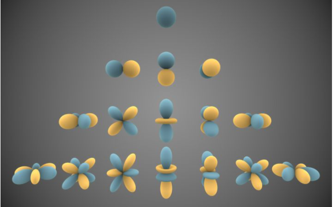

# 球谐函数

[球谐函数与光照估计]：https://blog.csdn.net/tinyzhao/article/details/62419220

[:star:球谐光照——简单理解和实现]：https://blog.csdn.net/qq_33999892/article/details/83862583

[:star:球谐光照与PRT学习笔记]：https://zhuanlan.zhihu.com/p/50208005

[球谐光照（Spherical Harmonics Lighting）及其应用-实验篇]：https://www.bbsmax.com/A/A7zgOmkz4n/

[Unity球谐项目]：https://github.com/TianYiJT/SphericalHarmonicLighting

[教学课程]：http://www0.cs.ucl.ac.uk/staff/j.kautz/PRTCourse/