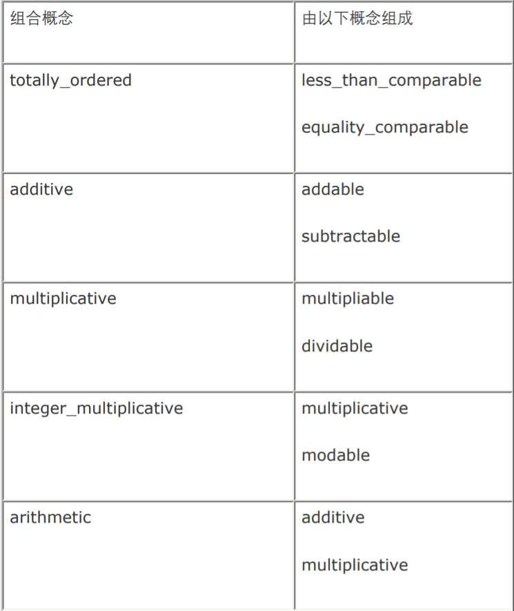
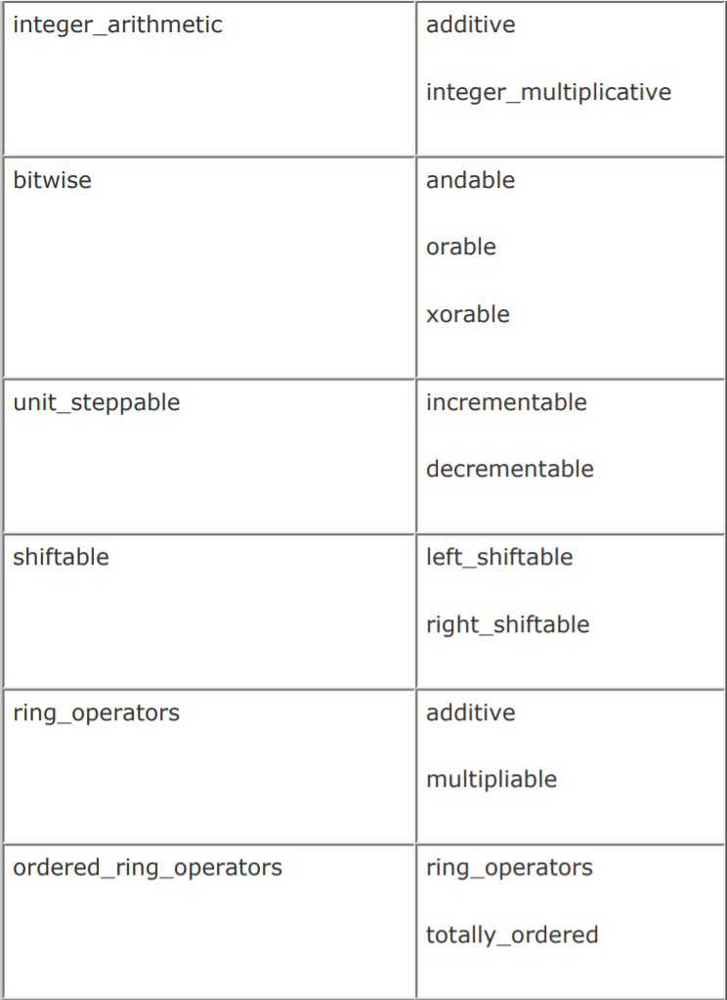
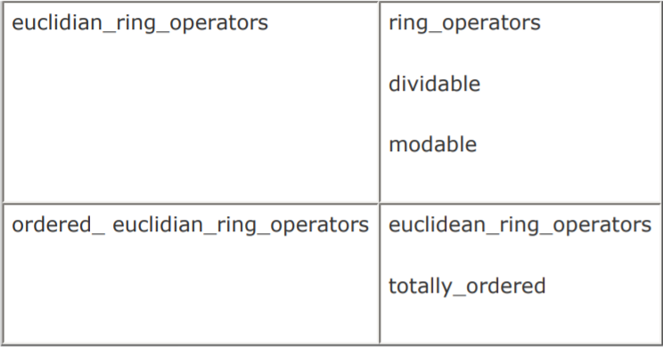
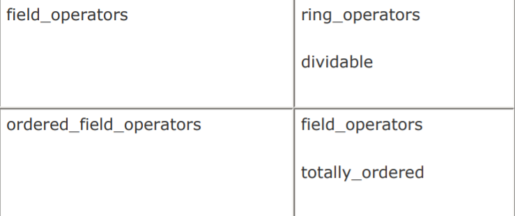

[toc]


# 1. Library : Conversion

## 1.1 Conversion 库如何改进你的程序？ 

它提供了防止**危险转换**及可复用的**类型转换工具**，其**主要特点**是：

- 可理解、可维护，以及**一致的多态类型转换** 
- **静态向下转型**使用比 `static_cast` 更安全的结构 
- 进行范围判断的数字转换确保**正确的值逻辑**以及**更少的调试时间** 
- **正确且可重用的文字转换**导致更少的编码时间 

**Conversion库**由`4`个转换函数组成，分别提供了**更好的类型安全性**（`polymorphic_cast`）, **更高效的类型安全防护**（`polymorphic_downcast`），**范围检查的数字转换**（`numeric_cast`），以及**文字转换**（`lexical_cast`）。这些函数具有一个重要特点——**类型安全性**，明确无误地表达程序员的意图。

## 1.2 polymorphic_cast 

***boost/cast.hpp***

:one:`C++`中的**多态转型**是用 `dynamic_cast` 来实现的，其有一个缺点是：根据使用的**类型的不同**，会有不同的行为。如果操作的是**引用**，则转型失败**抛出异常**（我想**引用不能为空**应该刻在我们的心里）；操作的是**指针**，则返回**空指针**。这在过去被认为是优点，但如果我们想**统一表示**，所有转型失败都**抛异常**呢？`Boost `提供了 `polymorphic_cast`。它在**转型失败时**总是抛出一个` std::bad_cast` 异常。

> "偶尔可能会不小心**忘了测试指针是否为空**。如果这困扰了你，你可以写一转型函数在转型失败时抛出异常。"

:two:`polymorphic_cast` 的用法类似于` dynamic_cast`，除了在转型失败时总是抛出一个 `std::bad_cast `异常。`polymorphic_cast `的**另一个特点**是它是**一个函数**，必要时**可以被重载**。这个函数**泛化**了要转换的类型，并接受一个要进行转型的参数。 

```c++
template <class Target, class Source>   
polymorphic_cast(Source* p); 
```

要注意的是，`polymorphic_cast` 没有**针对引用类型的版本**。原因是那是` dynamic_cast `已经实现了的，没有必须让` polymorphic_cast` 重复` C++`语言中已有的功能。

:three:有两种典型的使用情况：：从基类向派生类的**向下转型**， 或者**交叉转型**，即从一个基类到另一个基类。例如：这里有两个基类，`base1 `和 `base2`，以及一个从两个基类公有派生而来的类 `derived` 。 

```c++
int main() 
{  
    base1* p1 = new derived; 
    p1->print(); 
    
    try {    
        derived* pD = boost::polymorphic_cast<derived*>(p1);    
        pD->only_here();   
        pD->only_base2();    
        base2* pB = boost::polymorphic_cast<base2*>(p1);    
        pB->only_base2();  
    }  
    catch(std::bad_cast& e) 
    {    
        std::cout << e.what() << '\n';  
    }  
    delete p1; 
}

```

在对**指针类型**使用`dynamic_cast `时，测试**指针的有效性**是一种既乏味又反复的事情，这使得测试很容易被紧张的程序员所忽略掉。差别在于无论何时对指针使用 `dynamic_cast` ，我们都要记住测试**返回的指针是否为空**。

> 技术上， `dynamic_cast `是转型操作符，而 `polymorphic_cast `是函数模板。

:four:如果说**失败的指针转型**不应被视为错误，你就应该使用 `dynamic_cast` 而不是` polymorphic_cast`。 例如，一种常见的情形是使用 `dynamic_cast `来进行**类型确定测试**。使用**异常处理**来进行**类型的转换测试**是**低效的**，代码也很难看。这种情形下` dynamic_cast `就很有用了。

必须记住，其它人将要维护我们写的代码。这意味着我们必须确保代码以及它的意图是**清晰并且易懂的**。这一点可 以通过注释部分地解决，但对于任何人，更容易的方法是不需加以说明的代码。当**指针转型失败**被认为是异常时， `polymorphic_cast `比` dynamic_cast `更能清晰地表明代码的意图，它也导致**更短的代码**。如果转型失败不应被认为是错误，则应该使用 `dynamic_cast` ，这使得` dynamic_cast `的使用更为清楚。

何时使用`polymorphic_cast `和` dynamic_cast`：

- 当一个**多态转型的失败**是预期的时候，使用 `dynamic_cast<T*>`。它清楚地表明转型失败不是一种错误。
- 当一个**多态转型**必须成功以确保逻辑的正确性时，使用`polymorphic_cast<T*>`。它清楚地表明**转型失败是一种错误**。 
- 对**引用类型**执行**多态转型**时，使用`dynamic_cast`。

## 1.3 polymorphic_downcast 

***boost/cast.hpp***

:one:有时 `dynamic_cast` 被认为**太过低效**。执行` dynamic_cast` 需要额外的运行时间。为了避免这些代价，常常会诱使你使用 `static_cast`，它没有这些性能代价。`static_cast `用于**向下转型**可能是**危险的**，并会导致错误，但它的确比 `dynamic_cast` 要快。

`dynamic_cast`会测试**向下转型的结果**，并在失败时返回**空指针**或**抛出异常**，而 `static_cast` 则仅仅执行需要的**指针运算**，并将保证转型有效的责任留给了程序员。`polymorphic_downcast `用` dynamic_cast` 进行了转型测试，但仅是在**调试模式**下； 然后它在**发布模式**下就使用` static_cast` 去执行转型。如果`polymorphic_downcast` 是在**调试模式**下失败的，它对 `dynamic_cast` 产生的**空指针**执行断言并退出。。如果**向下转型**真的是必须的，并且被证实是**性能的瓶颈**，`polymorphic_downcast `就是你需要的。

> 使用 static_cast 进行向下转型的风险：转型总是"成功"的，但**指针可能是无效的**。

:two:`polymorphic_downcast `用于那些你应该用而又不想用 `dynamic_cast `的情形，原因是你确认**将要发生的转型**肯定会成功，而且你需要**提升它带来的性能**。

> 注意：一定要确保使用的 `polymorphic_downcast `所有可能的类型及转换组合**都经过测试**。

```c++
void newer(base* p) {
    // Logic that suggests that p points to derived1 omitted
    derived1* pd = boost::polymorphic_downcast<derived1*>(p);
    // ^-- The above cast will cause an assertion in debug builds
    pd->foo();
}
```


## 1.4 numeric_cast

***boost/cast.hpp***

:one:**整数类型间的转换**经常会产生**意外的结果**。例如， `long`可以拥有比 `short `更大范围的值，那么当从` long `赋值到 `short` 并且` long` 的数值超出了 `short `的范围时会发生什么？答案是**结果是由实现定义的**（比"**你不可能明确知道**"好听一点的说法)。

**相同大小整数间**的**有符号数到无符号数的转换**是好的，只要有**符号数的数值**是**正的**，但如果有符号数的数值是**负的**呢？它将被转换为一个**大的无符号数**，如果这不是你的真实意图，那么就是一个问题了。

` numeric_cast `通过测试**范围是否合理**来确保**转换的有效性**，当**范围超出**时它会**抛出异常**。

:two:`numeric_cast `是一个看起来象**C++的转型操作符**的==函数模板==，它泛化了**目标类型及源类型**。源类型可以从函数的参数**隐式推导**得到。

```c++
char c = boost::numeric_cast<char>(12);
float f = boost::numeric_cast<float>(3.001);
```

一个**最常见的数字转换问题**是将来自一个**更宽范围的值**赋给**范围较窄的类型**。有可能**数值过大或过小**而不能被**目标类型**所表示。我们先从**有符号类型**开始。C++中有**四个内建的有符号类型**：`signed char`、`short int (short)`、`int`、`long int (long)`。

> 想查看你的系统上的类型大小，可以使用 `sizeof(T) `或` std::numeric_limits::max() `和 `std::numeric_limits::min()`.
>
> 当然，==有符号类型与无符号类型的范围是不同的，即使它们有相同的大小。==

上面是按**大小递增**的，除了 `int` 和` long` 通常具有**相同的值范围**。当把一个**有符号整数类型**赋给另一个时，==C++标准==说：*若目标类型为有符号类型，在数值可以被目标类型表示时，值不改变；否则，值为实现定义*

```c++
#include <iostream>
#include "boost/cast.hpp"
#include "boost/limits.hpp"
int main() {
    std::cout << "larger_to_smaller example\n";
    
    // 没有使用numeric_cast的转换
    long l = std::numeric_limits<short>::max();
    short s = l;
    std::cout << "s is: " << s << '\n';
    s = ++l;
    std::cout << "s is: " << s << "\n\n";
    
    // 使用numeric_cast的转换
    try {
        l = std::numeric_limits<short>::max();
        s = boost::numeric_cast<short>(l);
        std::cout << "s is: " << s << '\n';
        s = boost::numeric_cast<short>(++l);
        std::cout << "s is: " << s << '\n';
    }
    catch(boost::bad_numeric_cast& e) {
        std::cout << e.what() << '\n';
    }
}
```

输出是：

```cmake
larger_to_smaller example
s is: 32767
s is: -32768
s is: 32767
bad numeric cast: loss of range in numeric_cast
```

因为**赋值的结果**属于**实现定义的行为**，这取决于你使用的平台。使用我的编译器，它变成了一个**大的负值**，即它被**回绕**了。用了 `numeric_cast`，**第一个转型成功了**，因为数值在范围之内。而**第二个转型却会失败**，结果是抛出一个 `bad_numeric_cast `异常。

> 注意，虽然我们在这里只讨论了**有符号类型**，但**同样的原理**可应用于**无符号类型**。

:three:**无符号整数类型**有一个非常有趣的特性，**任何数值都有可以合法地赋给它们**！对于**无符号类型**而言，无所谓**正或负的溢出**。数值被简单地**对目标类型最大值加一取模**（这种行为通常被称为**数值回绕**`value wrapping`）。什么意思？看如下代码：

```c++
#include <iostream>
#include "boost/limits.hpp"
int main() {
    unsigned char c;
    long l = std::numeric_limits<unsigned char>::max() + 14;
    c = l;
    
    std::cout << "c is: " << (int)c << '\n';
    
    long reduced = l % (std::numeric_limits<unsigned char>::max() + 1);
    std::cout << "reduced is: " << reduced << '\n';
}

//.........output
c is: 13
reduced is: 13
```

如果你真的想要**数值回绕**，就不要使用`numeric_cast`。

:four:**混用有符号和无符号类型**可能很有趣，特别是执行**算术操作**时，普通的赋值也会产生微妙的问题。**最常见的问题**是**将一个负值赋给无符号类型**。结果几乎可以肯定不是你**原来的意图**。另一种情形是从**无符号类型**到同样大 小的**有符号类型**的赋值——人们总是会很容易忘记**无符号类型**可以持有比同样大小的有符号类型**更大的值**。特别是在表达式或函数调用中更容易忘记。阅读如下代码：

```c++
#include <iostream>
#include "boost/limits.hpp"
#include "boost/cast.hpp"
int main() {
    unsigned int ui = std::numeric_limits<unsigned int>::max();
    int i;
    try {
        std::cout << "Assignment from unsigned int to signed int\n";
        i = boost::numeric_cast<int>(ui);
    }
    catch(boost::bad_numeric_cast& e) {
        std::cout << e.what() << "\n\n";
    }
    
    try {
        std::cout << "Assignment from signed int to unsigned int\n";
        i = -12;
        ui = boost::numeric_cast<unsigned int>(i);
    }
    catch(boost::bad_numeric_cast& e) {
        std::cout << e.what() << "\n\n";
    }
}

//...........output
Assignment from unsigned int to signed int
bad numeric cast: loss of range in numeric_cast
Assignment from signed int to unsigned int
bad numeric cast: loss of range in numeric_cast
```

输出清晰地表明了**预期的错误**。==基本的规则==很简单：无论何时在**不同的类型间**执行**类型转换**，都应该使用 `numeric_cast `来**保证转换的安全**。

:five:`numeric_cast `不能帮助我们在**浮点数间的转换**中避免**精度的损失**。原因是`float`，` double` 和` long double `间的转换不像**整数类型间的隐式转换**那样敏感。

```c++
double d = 0.123456789123456;
float f = 0.123456;
try {
    f = boost::numeric_cast<float>(d);
}
catch(boost::bad_numeric_cast& e) {
    std::cout << e.what();
}
```

运行这段代码**不会有异常抛出**。在许多实现中，从`double `到 `float` 的转换都会**导致精度的损失**。当一个**浮点数类型**被转换为一个**整数类型**，它会被截断；小数部分会被扔掉。` numeric_cast `对**截断后的数值**与**目标类型**进行**相同的检查**，就像在两个**整数类型间的检查**一样。

:six:以下情况时使用 numeric_cast: 

-  在**无符号**与**有符号类型**间进行赋值或比较时 
- 在不同大小的整数类型间进行赋值或比较时 
- 从一个**函数返回类型**向一个**数值变量**赋值，为了**预防该函数未来的变化**。


## 1.5 lexical_cast

***boost/lexical_cast.hpp***

所有应用都会使用==字面转换==。我们把**字符串**转为**数值**，反之亦然。许多**用户定义的类型**可以转换为字符串或者由字符串转换而来。你常常是在需要这些转换时才编写代码，而更好的方法是提供一个**可重用的实现**。这就是 `lexical_cast` 的用途所在。

它可以与任何用`operator<< `进行输出的源，以及任何用 `operator<<`进行输入的目标一起工作。

:one:比起调用一堆的**转换子程序**，或者是编写**自己的转换代码**， `lexical_cast `可以更好地为任何**满足它的要求的类型**服务。它的要求就是

- **源类型**必须是**可流输出的** (`OutputStreamable`)——存在一个为该类型定义的 `operator<<`
- 而**目标类型**必须是**可流输入的** (`InputStreamable`)——要求有一个`operator>>`
- 两种类型都必须是**可复制构造的**
- **目标类型**还要是**可缺省构造的**和**可赋值的**。

```c++
#include <iostream>
#include <string>
#include "boost/lexical_cast.hpp"
int main() {
    // string to int
    std::string s = "42";
    int i = boost::lexical_cast<int>(s);
    
    // float to string
    float f = 3.14151;
    s = boost::lexical_cast<std::string>(f);
    
    // literal to double
    double d = boost::lexical_cast<double>("2.52");
    
    // 失败的转换
    s="Not an int";
    try {
        i = boost::lexical_cast<int>(s);
    }
    catch(boost::bad_lexical_cast& e) {
        // 以上lexical_cast将会失败，我们将进入这里
    }
}
```

> 你可能注意到了没有办法控制**转换的格式**；如果需要这种级别的控制，要用`std::stringstream` 

:two:作为使用`lexical_cast `进行**泛型编程**的简单例子，来看一下如何用它创建一个 `to_string `函数。这个函数接受**任何类型的参数**（当然它要符合要求）并返回一个表示该值的 `string `。

```c++
#include <iostream>
#include <string>
#include "boost/lexical_cast.hpp"
template <typename T> 
std::string to_string(const T& arg) {
    try {
        return boost::lexical_cast<std::string>(arg);
    }
    catch(boost::bad_lexical_cast& e) {
        return "";
    }
}

int main() {
    std::string s = to_string(412);
    s = to_string(2.357);
}
```

:three:使类可以用于 `lexical_cast`，一个简单的例子如下：

```c++
class lexical_castable {
public:
    lexical_castable() {};
    lexical_castable(const std::string s) : s_(s) {};
    
    friend std::ostream operator<<
        (std::ostream& o, const lexical_castable& le);
    
    friend std::istream operator>>
        (std::istream& i, lexical_castable& le);
    
private:
    virtual void print_(std::ostream& o) const {
        o << s_ <<"\n";
    }
    virtual void read_(std::istream& i) const {
        i >> s_;
    }
    std::string s_;
};

std::ostream operator<<(std::ostream& o, const lexical_castable& le) {
    le.print_(o);
    return o;
}

std::istream operator>>(std::istream& i, lexical_castable& le) {
    le.read_(i);
    return i;
}

int main(int argc, char* argv[]) {
    lexical_castable le;
    std::cin >> le;
    
    try {
        int i = boost::lexical_cast<int>(le);
    }
    catch(boost::bad_lexical_cast&) {
        std::cout << "You were supposed to enter a number!\n";
    }
}
```


## 1.6 总结

在这一章里，你学习了`Boost.Conversion `库，从 `polymorphic_cast `开始。` polymorphic_cast` 的基本原理是**代码的清晰性和安全性**，它使我们在代码中更灵活地表达我们的意图，与它的竞争者` dynamic_cast `相比它更为安全，因为对**结果指针的测试**很容易忘记。 

接着，你看到了安全的优化，使用 `polymorphic_downcast`, 它在调试模式下增加了类似于` dynamic_cast `的安全性，但却是使用 `static_cast `来进行转换。这样比单独使用` static_cast` 更安全。

` numeric_cast `帮助你避免数值转换中的某些困难。代码的清晰性也得到提高，从而避免了**未定义的行为**以 及实现定义的行为。

 最后一个是 `lexical_cast`—— 没有重复的转换函数。这就是为什么它被提议纳入下一个版本的C++标准库的原因。 它是一个非常小巧的、用于转换不同的可流数据类型的工具。 


# 2. Library : Utility

**有些工具还不够组成它们自己的库**，因此它们与其它实体被集合到一起。这就形成了`Boost.Utility`，收集了一些没有更合适地方存放的、有用的工具。本章介绍`Boost.Utility`中**最基本的以及最广泛使用的工具**。


## 2.1 BOOST_STATIC_ASSERT

***boost/static_assert.hpp***

:one:在**运行期执行断言**可能是你经常用到的，也是非常合理的。它是测试**前置条件**、**后置条件**以及**不变式**的好方法。 **执行运行期断言**有很多不同的方法，但是在**编译期**你**如何进行断言**呢？当然，**唯一的方法**就是**让编译器产生一个错误**，这是很平常的事情，但如何从**错误信息**中获得**有意义的信息**。而且，即使你在一个编译器上找到了办法，也**很难**把它**移植到其它编译器**上。

`BOOST_STATIC_ASSERT`作为它的第一个使用范例，我们来看看如何在**类作用域**中使用它。考虑一个**泛化的类**，它要求**实例化时所用的类型**是一个**整数类型**。现在，我们先提前一点使用另一个Boost库来进行测试，它就是`Boost.Type_traits`，我们使用一个称为` is_integral `的断言，它对**它的参数**执行一个**编译期求值**，正如你从它的名字可以猜到的一样，求值的结果是**表明该类型是否一个整数类型**。

```c++
#include <iostream>
#include "boost/type_traits.hpp"
#include "boost/static_assert.hpp"
template<typename T> 
class only_compatible_with_integral_types {
    BOOST_STATIC_ASSERT(boost::is_integral<T>::value);
};
```

有了这个断言，在实例化类 `only_compatible_with_integral_types `时如果试图使用一个**非整型的类型**，就会导致**一个编译期的失败**。

```c++
only_compatible_with_integral_types<double> test2;
//...
Error: use of undefined type
 'boost::STATIC_ASSERTION_FAILURE<false>'
```

:two:`BOOST_STATIC_ASSERT `也可以用在**函数作用域**中。例如，考虑一个**泛化的函数**，它带有一个**非类型模板参数**，并且该参数只接受`1`至`10`的值。与其在运行期执行断言，我们不如**在编译器使用静态断言**。

```c++
template <int i> 
void accepts_values_between_1_and_10() {
 	BOOST_STATIC_ASSERT(i >= 1 && i <= 10);
}
```

**断言中的表达式必须是一个纯粹的编译期表达式**，也就是说，**表达式中的参数和操作符**都必须被编译器**所认识**。

我们可以在**任何函数**中很方便地测试条件。例如，**一个函数**需要一个**与平台相关的前提条件**，就常常需要一个断言：

```c++
void expects_ints_to_be_4_bytes() {
    BOOST_STATIC_ASSERT(sizeof(int) == 4);
}
```

:three:以下情形下使用 `BOOST_STATIC_ASSERT `： 

-  当条件**可以在编译期进行求值** 

-  对类型的要求可以在编译期表示 

- 你需要对**两个或以上的整型常量间的关系**进行断言

  

## 2.2 checked_delete

***boost/checked_delete.hpp***

**通过指针来删除一个对象**时，**执行的结果**取决于执行删除时**被删除的类型是否可知**。对一个**指向不完整类型的指针**执行`delete` 几乎**不可能有编译器警告**，这会导致**各种各样的麻烦**，由于析构函数可以没有被执行。换句话说，即**进行清除的代码没有被执行**。 `checked_delete `在对象析构时执行一个**静态断言**，测试**类是否可知**，以确保**析构函数被执行**。

:one:它用于删除**动态分配的对象**，对于**动态分配的数组**，同样有一个称为`checked_array_delete `的**模板函数**。这两个函数都要求在**销毁对象时**，这些**被删除的类型必须是可知的**。

```c++
#include "boost/checked_delete.hpp"
class some_class;
some_class* create() {
 	return (some_class*)0;
}
int main() {
    some_class* p = create();
    boost::checked_delete(p2);
}
```

如果你试图编译这段代码，对函数`checked_delete `的实例化将失败，因为` some_class` 是一个**不完整的类型**。但我们的代码中哪里存在**不完整的类型**呢？接下来的章节我们来讨论它。

:two:如果你试图删除一个指针，而该指针指向的是一个带有**非平凡析构函数**的不完整类型，结果将是未定义的行为。

> 不完整的类型：是指**已声明但未定义的类型**。 
>
> **非平凡析构函数**是：类的一个或多个直接基类，或者一个或多个非静态数据成员，**具有用户定义的析构函数**。

`checked_delete `基本上就是**一个判断类是否完整的断言**，它的实现如下：

```c++
template< typename T > 
inline void checked_delete(T * x) {
    typedef char type_must_be_complete[sizeof(T)];
    delete x;
}
```

这里的想法是创建一个` char` 的数组，数组的**元素数量**为` T` 的大小。如果 `checked_delete` 被一个不完整的类型` T `所实例化，**编译将会失败**，因为` sizeof(T) `会返回` 0`，而**创建一个0个元素的数组是非法的**。你也可以用 `BOOST_STATIC_ASSERT `来执行这个断言。

```c++
BOOST_STATIC_ASSERT(sizeof(T));
```

:three:删除一个**动态分配的对象**时，必须调用**它的析构函数**。如果这个类型是不完整的，即只有声明没有定义，那么析构函数可能会没被调用。这是一种潜在的危险状态，所以应该避免它。对于类模板及函数模板，风险会更大，因为无法预先知道会 使用什么类型。使用 `checked_delete` 和` checked_array_delete`， 可以解决这个删除不完整类型的问题。它**没有运行期的额外开销**，只是直接调用`delete`， 因此说 `checked_delete` 带来的**安全性实际上是免费的**。 


## 2.3 noncopyable

***boost/utility.hpp***

:one:如果这个类不想被**复制（或被赋值）**，就需要明确地告诉这个类的使用者**复制构造以及赋值是被禁止的**，要禁止对**复制构造函数**以及**赋值操作符**的访问。幸运的是，当类带有**不能复制或不能赋值的基类或成员函数**时，编译器生成的**复制构造函数及赋值操作符就不能使用**。 `boost::noncopyable` 的工作原理就是：禁止访问它的复制构造函数和赋值操作符，然后**使用它作为基类**。

:two:要使用 `boost::noncopyable`，你要从它==私有==地派生出**不可复制类**。虽然**公有继承**也可以，但这是一个坏习惯。**公有继承**对于阅读类声明的人而言，意味着`IS-A` 关系：

```c++
#include "boost/utility.hpp"
class please_dont_make_copies : boost::noncopyable {};
int main() {
    please_dont_make_copies d1;
    please_dont_make_copies d2(d1); //error
    please_dont_make_copies d3;
    d3 = d1;	//error
}
```

> 无论何时你需要定义**析构函数**、**复制构造函数**、或**赋值操作符**三个中的任意一个，你也需要定义另外两个。


## 2.4 addressof

***boost/utility.hpp***

:one:要取得一个**变量的地址**，我们要依赖于**返回的值**是否真的是这个**变量的地址**。但是，技术上重载`operator&` 是有可能的，这意味着存**有恶意的人**可以破坏你的**地址相关的代码**。 `boost::addressof `被用于==获得变量的地址==，不管取址操作符是否被误用。通过使用一些灵巧的内部机制，模板函数` addressof` 确保可以获得**真实的对象及其地址**。

```c++
#include "boost/utility.hpp"
class some_class {};
int main() {
    some_class s;
    some_class* p = boost::addressof(s);
}
```

> 除非有非常好的理由，否则**不要重载**`operator&`

:two:即使一个类的`operator&`被重载了，也还是有办法获得这个**类的实例的真实地址**。 `addressof` 使用了一些幕后巧妙方法来获得真实的地址，而不会受任何`operator&` 的欺骗。


## 2.5 enable_if

***boost/utility/enable_if.hpp***

:one:有时候，我们希望控制**某个函数或类模板的特化**是否可以加入到**重载决议时使用的重载或特化的集合**中。例如，考虑一个重载的函数，它有一个版本是带一个` int `参数的**普通函数**，另一个版本是一个**函数模板**，它要求参数类型 `T` 具有一个名为 `type `的**嵌套类型**。它们看起来可能象这样：

```c++
void some_func(int i) {
 	std::cout << "void some_func(" << i << ")\n";
}

template <typename T> void some_func(T t) {
    typename T::type variable_of_nested_type;
    std::cout <<
        "template <typename T> void some_func(" << t << ")\n";
}
```

如果参数的类型为 `int`，**第一个版本**将被调用。如果参数的类型是`int` 以外的其它类型，则**第二个版本**将被调用。这没问题，只要这个类型有一个名为`type`的**嵌套类型**，但如果它没有，这段代码就**不能通过编译**。

:two:我们希望仅对含有名为`type`的**嵌套类型的类**使用**模板版本的some_func** ，而对于其它没有这个嵌套类型的类则**忽略它**。一个**最简单的方法**是把模板版本的**返回类型**改为如下：

```c++
template <typename T> typename T::type* some_func(T t) {
    typename T::type variable_of_nested_type;
    std::cout <<
        "template <typename T> void some_func(" << t << ")\n";
    return 0;
}
```

或者，添加一个**额外的参数**：

```c++
template <typename T>
void some_func(T t, typename T::type* p=0) {
     typename T::type variable_of_nested_type;
     std::cout << "template <typename T> void some_func(T t)\n";
}
```

:three:要使用`enable_if`和` disable_if`，通过接受**一个谓词**来控制是否启用或禁止一个函数：

```c++
#include <iostream>
#include "boost/utility/enable_if.hpp"
#include "boost/type_traits.hpp"
void some_func(int i) {
 	std::cout << "void some_func(" << i << ")\n";
}

template <typename T> void some_func(T t, typename boost::disable_if<boost::is_integral<T>>::type* p = 0) 
{
    typename T::type variable_of_nested_type;
    std::cout << "template <typename T> void some_func(T t)\n";
}
```

虽然这看起来与我们前面所做的差不多，但它表达了一些我们使用**直接的方法**所不能表达的东西，而且它在函数的声明中表达了关于**这个函数的重要信息**——可以清楚的知道这个函数要求类型 `T `不能是一个**整数类型**。

:four:我们还可以用另一个库`Boost.Mpl`来做。如下：

```c++
#include <iostream>
#include "boost/utility/enable_if.hpp"
#include "boost/type_traits.hpp"
#include "boost/mpl/has_xxx.hpp"
BOOST_MPL_HAS_XXX_TRAIT_DEF(type)
void some_func(int i) {
 	std::cout << "void some_func(" << i << ")\n";
}

template <typename T> void some_func(T t,
 	typename boost::enable_if<has_type<T>>::type* p = 0) {
     typename T::type variable_of_nested_type;
     std::cout << "template <typename T> void some_func(T t)\n";
}
```

这里的窍门在于使用了`Boost.Mpl`的一个**非常漂亮的特性**：它可以测试任意类型` T` **是否内嵌有某个指定类型**。通过使用宏 `BOOST_MPL_HAS_XXX_TRAIT_DEF(type)`，我们定义了一个名为`has_type`的新的 `trait`，我们可以在函数 `some_func `中使用它作为 `enable_if `的谓词。

也可以包装**返回类型**，而不用增加一个**额外的缺省参数**。我们最后一个也是最好的一个 `some_func`， 在它的返回类型中使用`enable_if`，如下：

```c++
template <typename T> typename
boost::enable_if<has_type<T>, void>::type
some_func(T t) {
    typename T::type variable_of_nested_type;
    std::cout << "template <typename T> void some_func(T t)\n";
}
```

:five:对于**类模板**，我们需要对**主模板**进行一 些**特别的处理**：增加一个**模板参数**。考虑一个带有返回一个` int` 的成员函数` max `的类模板：

```c++
template <typename T> 
class some_class {
public:
    int max() const {
        std::cout << "some_class::max() for the primary template\n";
        return std::numeric_limits<int>::max();
    }
};
```

假设我们决定对于**所有算术类型**，给出一个**特化版本的定义**， `max `返回的是**该算术类型可以表示的最大值**。那么我们需要对模板类型 `T` 使用 `std::numeric_limits `，而对其它类型我们还是使用**主模板**。要做到这样，我们**必须给主模板加一个模板参数**，该参数的缺省类型为 `void` （这意味着用户**不需要显式地给出该参数**）。结果主模板的定义如下：

```c++
template <typename T, typename Enable = void> 
class some_class {
public:
    int max() const {
        std::cout << "some_class::max() for the primary template\n";
        return std::numeric_limits<int>::max();
    }
};
```

现在我们已经为**提供特化版本**作好了准备，**该特化版本为算术类型所启用**。该特性可通过`Boost.Type_traits` 库获得。以下是特化版本：

```c++
template <typename T> 
class some_class<T,
typename boost::enable_if<boost::is_arithmetic<T>>::type> {
public:
    T max() const {
        std::cout << "some_class::max() with an arithmetic type\n";
        return std::numeric_limits<T>::max();
    }
};
```

:six:我们使用了模板`enable_if`， 它要求**其中的条件**要有一个名为 `value` 的**嵌套定义**。对于多数可用于元编程的类型而言这都是成立的，但对于**整型常量表达式**则不然。如果没有名为` value `的嵌套类型，就要使用 `enable_if_c `来代替，它接受一**个整型常量表达式**。使用` is_arithmetic `并直接取出它的值，我们可以这样重写 `some_class`的**启用条件**：

```c++
template <typename T> class some_class<T, typename boost::enable_if_c<boost::is_arithmetic<T>::value>::type> 
{
public:
        T max() const {
            std::cout << "some_class::max() with an arithmetic type\n";
            return std::numeric_limits<T>::max();
        }
};
```


## 2.6 总结

本章介绍了几种工具类，它们可以大大简化我们的日常工作

-  `BOOST_STATIC_ASSERT` 提供**编译期断言**，它有助 于我们测试前提条件或强制某些要求。
- 对于泛型编程， `checked_delete `在**检查错误用法**时非常有用，它可以**节省**我们大量的**阅读可怕的错误信息**和**研究代码的时间**。
- 我们还讨论了` addressof`，它是一个**获得对象真实地址**的小工具，不用管`operator&`有否被重载。
- 我们还看到了` enable_if `和` disable_if `如何控制某些函数参与重载决议
- 我们也讨论了基类 `noncopyable`。 它既提供了好的习惯用法，也清楚地向任何看到这段代码的人表达了正确的意图，它值得你经常使用。


# 3. Library : Operators

当你为你的类定义了一组操作符中的一个时，你应该也提供该组中**其余的操作符**，以避免令人惊讶。不幸的是，**为一个类增加多个操作符**以支持比较或算术运算是**很麻烦并且容易出错的**，还有，**迭代器类**必须根据它所依照的**迭代器种类**来提供**一组特定的操作符**以确保其功能正确。

`Boost.Operators`的目的是：它允许你**只定义所需的比较或算术操作符的一个子集**，然后基于你提供的操作符**自动定义其它的操作符**。

**Operators库**的另一个好处在于**为不同操作符给出了明确的概念命名**，例如支持` operator+ `和 `operator+=` 的类称为`addable`，支持` operator<< `和` operator>>` 的类称为`shiftable`，等等。这很重要，有两个原因：

- 一个统一的命名方法更为易懂；
- 而且这些概念以及其后命名的类，可以是类接口的一部分，清晰地表明了重要的行为。


## 3.1 Operators

***boost/operators.hpp***

**Operators库**由**多个基类**组成。每一个类生成与其名字概念相关的操作符。你可以用**继承的方式**来使用它们，如果你需要一个以上的功能，则需要使用**多重继承**。`Operators`中定义了一些**复合的概念**，在大多数情况下可以无须使用多重继承。 下面将介绍最常用的一些`Operator`类，包括它们所表示的概念，以及它们**对派生类的要求**。

:one:

***less_than_comparable***

要求类型` T `具有以下语义：

```c++
bool operator<(const T&,const T&);
bool operator>(const T&,const T&);
bool operator<=(const T&,const T&);
bool operator>=(const T&,const T&);
```

要派生自 `boost::less_than_comparable`， **派生类**`T`必须提供：

```c++
bool operator<(const T&, const T&); 
```

注意，返回值的类型不必是真正的`bool`，但必须可以隐式转换为`bool`。

此外，equivalent（等等`==`）要求派生类提供`<`，比较简单，就不额外列出了。

:two:

***equality_comparable***

要求类型` T `具有以下语义：

```c++
bool operator==(const T&,const T&);
bool operator!=(const T&,const T&);
```

`T`必须提供：

```c++
bool operator==(const T&,const T&);
```

:three:

***addable***

要求类型` T `具有以下语义：

```c++
T operator+(const T&,const T&);
T operator+=(const T&);
```

`T`必须提供：

```c++
T operator+=(const T&);
```

subtractable（减法）、orable（或`|`）、andable（且`&`）类似。

:four:

***incrementable***

要求类型` T `具有以下语义：

```c++
T& operator++(T&);
T operator++(T&,int);
```

`T`必须提供：

```c++
T& operator++(T&); //++T
```

**返回值的类型**必须可以隐式转换为` T`。

decrementable（自减`--`）类似。


### 解引用操作符

对于**迭代器**，有两个概念特别有用， `dereferenceable `和 `indexable`，分别表示了**解引用的两种情况**：一个是`*t`，`t`是一个**支持解引用的迭代器**（显然所有迭代器都支持），另一个是`indexing`，`t[x]`，`t`是一个支持**下标操作符寻址**的类型，而` x `通常是一个**整数类型**。

:one:

***dereferenceable***

`dereferenceable `概念要求类型` T` 具有以下语义，假设 `T `是操作数，` R `是引用类型，而 `P `是指针类型：

```c++
P operator->() const;
R operator*() const;
```

`T`必须提供：

```c++
R operator*() const;
```

另外， `R `的一元 `operator& `必须可以被**隐式转换**为` P`——这意味着 `R`不必一定要是**引用类型**，它可以是一个**代理类**（proxy class）。

:two:

***indexable***

`indexable` 概念要求类型` T `具有以下语义，假设 `T `是操作数，` R `是引用类型，而 `P `是指针类型，而 `D `是 `difference_type`：

```c++
R operator[](D) const;
R operator+(const T&, D)
```

`T`必须提供：

```c++
R operator+(const T&,D);
```


### 复合算术操作符

到目前为止我们看到的概念都只代表了**最简单的功能**。但是，还有一些**高级的，或是复合的概念**，它们由几个简单概念组合而成，或是在复合概念之上再增加简单的概念而成。例如，一个类是 `totally_ordered `的，同时是 `less_than_comparable `的和 `equality_comparable `的，必须实现 `less_than_comparable `所要求的操作符`(bool operator<(const T&,const T&)) `和 `equality_comparable `所要求的操作符`(bool operator== (const T&,const T&))`。









> 注意， 继承不一定要是公有的，**私有继承也可以**

```c++
class thing :
boost::less_than_comparable<thing>,
boost::equivalent<thing> 
{
    
    std::string name_;
    
public:
    thing() {}
    
    explicit thing(const std::string& name):name_(name) {}
    
    friend bool operator<(const thing& lhs,const thing& rhs) {
        return lhs.name_<rhs.name_;
    }
};
```

一个看起来怪怪的地方是，**把派生类传给基类作为模板参数**。这是一种著名的技巧，被称为 ==Barton-Nackmann技巧==。这种技巧所解决的问题是**循环的依赖性**。考虑一下实现一个**泛型类**，它为另一个定义了 `operator< `的类提供` operator==` 。顺便说一下，这就是这个库中称为 `equivalent` 的概念。很明显，任何类要**利用**提供了这种服务的**具体实现**，它都要了解**提供服务的这个类**，我们以**这个类所实现的概念**来命名它，称之为 `equivalent `类。然而，我们刚刚还在说` equivalent `要了解那个它要为之定义` operator== `的类！==这是一种循环的依赖性==，乍一看，好象没有办法可以解决。但是，如果我们把` equivalent `实现为**类模板**，然后指定那个要定义 `operator== `的类为**模板的参数**，这样我们就已经有效地把相关类型，也即是那个**派生类**，加入到 **equivalent 的作用域**中了。以下例子示范了如何使用这个技巧：

```c++
#include <iostream>
template <typename Derived> class equivalent {
public:
    friend bool operator==(const Derived& lhs, const Derived& rhs) {
        return !(lhs<rhs) && !(rhs<lhs);
    }
};

class some_class : equivalent<some_class> {
int value_;
public:
    some_class(int value) : value_(value) {}
    friend bool operator<(const some_class& lhs,
                          const some_class& rhs) {
        return lhs.value_<rhs.value_;
    }
};

int main() {
    some_class s1(4);
    some_class s2(4);
    if (s1 = =s2)
        std::cout << "s1 == s2\n";
}
```

基类 `equivalent `接受一个要为之定义` operator== `的类型为**模板参数**。它通过使用 `operator< `为**该参数化类型**实现泛型风格的 `operator== `。然后，类 `some_class `想要利用` equivalent `的服务，就从它派生并把自己作 为**模板参数**传递给 `equivalent `。因此，结果就是为类型` some_class `定义了 `operator== `，是依照` some_class` 的 `operator< `实现的。这就是==Barton-Nackmann技巧==的全部内容。这是一种**简单且非常有用的模式**，相当优美。

### 严格弱序

:one:**严格弱序**是两个对象间的一种关系。首先我们来一点**理论的讲解**，然后再具体地讨论。一个函数$ f(a, b) $​如果实现了一种**严格弱序关系**，这里的 `a` 和`b`是同一类型的两个对象，我们说， `a `和` b `是等价的，如果$f(a, b)$​ 是 `false `并且$f(b,a)$​ 也是`false`。这意味着` a `不在 `b `之前，而且 `b `也不在` a `之前。因此我们可以认为它们是**等价的**。

- 此外， $f(a,a)$​ 必须总是 `false`（==自反性==）
- 而且如果 $f(a,b)$ 为` true`，则$f(b,a)$ 必须为`false`。（==反称性==）
- 还有，如果 $f(a,b)$ 与 $f(b,c)$ 均为`true`，则有$f(a,c)$。（==传递性==）
- 最后，如果$f(a,b)$为`false`且$f(b,a)$也为`false`，并且如果$f(b,c)$为`false` 且$f(c,b)$也为`false`，则$f(a,c)$为 `false`且$f(c,a)$为`false`。（==等价关系的传递性==）

我们前面的例子可以有助于澄清这个理论。 `thing `的小于比较是依照` std::string `的**小于比较**实现的。也就是说，是一种**字面的比较**。因此，给出一个包含字符串"**First**"的 `thing`  `a` ，和一个包含字符串"Second"的`thing` `b`，还有一个包含字符串"Third"的`thing` `c` ，我们可以` assert` 前面给出的定义和公理。

```c++
#include <cassert>
#include <string>
#include "boost/operators.hpp"
// Definition of class thing omitted
int main() {
    thing a("First");
    thing b("Second");
    thing c("Third");
    // assert that a<b<c
    assert(a<b && a<c && !(b<a) && b<c && !(c<a) && !(c<b));
    // 等价关系
    thing x = a;
    assert(!(x < a) && !(a < x));
    // 自反性
    assert(!(a < a));
    // 反对称性
    assert((a < b) == !(b < a));
    // 传递性
    assert(a < b && b < c && a < c);
    // 等价关系的传递性
    thing y = x;
    assert( (!(x < a) && !(a < x)) &&
           (!(y < x) && !(x < y)) &&
           (!(y < a) && !(a < y)));
}
```

现在，所有这些`asserts`都成立，因为`std::string`实现了**严格弱序**。就像`operator< `可以定义一个**严格 弱序**，`operator> `也可以。稍后，我们将看到一个非常具体的例子，看看如果我们**未能区分等价**（它是一个严格 弱序所要求的）与相等（它不是严格弱序所要求的）之间的不同，将会发生什么。

### 深入探讨

:one:在前面的例子中，我们的类派生自**两个基类**：`less_than_comparable`和`equivalent`。 根据你所使用的编译器，你需要为这个**多重继承**付出**一定的代价**；`thing`可能要比它所需的更大。为了避免潜在的**对象大小膨胀**，`Operators`支持一种称为==基类链==的技术。每个**操作符类**接受一个**可选的额外的模板参数**，该参数来自于它的派生类。采用以下方法：**一个概念类派生自另一个**，后者又派生自另一个，后者又派生自另一个，这样就**不再需要多重继承**了：

```c++
// Before
boost::less_than_comparable<thing>, boost::equivalent<thing>
// After
boost::less_than_comparable<thing, boost::equivalent<thing>>
```

> 标准允许编译器使用==空类优化==来创建一个没有数据成员、没有虚拟函数、也没有重复基类的基类，这样在**派生类的对象**中只会占用**零空间**， 而多数现代的编译器都会执行这种优化。

**由于基类链很容易使用，我们应该在所有情况下都使用它**。

:two:考虑操作符左右类型不一致，例如`My_string`和`char *`，我们依然利用==基类链==：

```c++
class simple_string :
boost::addable<simple_string,
boost::addable2<simple_string, const char*> >
```

如果你用的编译器支持==模板偏特化==，你就不需要限定这个名字；你可以用 `addable `代替 `addable2`。为了对称性，还有一个版本的类，它带有后缀`1`。它可以**增加可读性**，它总是明确给出**参数的数量**，它带给我们以下对 `simple_string`的派生写法：

```c++
class simple_string :
 boost::addable1<simple_string,
 boost::addable2<simple_string, const char*>>
```

:three:要使用**关联容器**，就要求有**等价关系**，它通过概念 `LessThanComparable`定义了一个**严格弱序**。如果一个类支持概念`LessThanComparable`，通常它也就**支持等价的概念**。如果两个元素进行比较，没有一个比另一 个小，我们称它们是**等价的**。但是，==等价并不意味着相等==。例如，有可能在一个`less than`关系中忽略某些特性。为了举例说明这一点，我们来看一个类`animal`，它同时支持等价关系和相等关系。

```c++
class animal : boost::less_than_comparable<animal,
boost::equality_comparable<animal>> 
{
    std::string name_;
    int age_;
public:
    animal(const std::string& name,int age) : name_(name), age_(age) {}
    
    void print() const 
    {
    	std::cout << name_ << " with the age " << age_ << '\n';
    }
    
    friend bool operator<(const animal& lhs, const animal& rhs) 
    {
    	return lhs.name_<rhs.name_;
    }
    
    friend bool operator==(const animal& lhs, const animal& rhs) 
    {
    	return lhs.name_ == rhs.name_ && lhs.age_ == rhs.age_;
    }
};
```

现在让我们把这个类的一些元素存入`std::set`，和其它**关联容器**一样，`set`仅依赖于概念 `LessThanComparable`。 以下面例子中，我们创建`4`个不一样的动物，然后试图把它们插入一个`set`，完全假装我们不知道相等和等价之间的差别。

具体分析见书，我们总结下：**等价不区分克隆人，而相等则世界唯一，就只是你**。


## 3.2 如何工作:star:

:one:我们来看看如何实现对`less_than_comparable`的支持。你需要了解你要增加支持的那个类，并且你要为这个类**增加操作符**，这个操作符将用于实现该类的其它相关操作符。

```c++
template<class T>
class less_than1
{
public:
    friend bool operator>(const T& lhs,const T& rhs) { 
        return rhs < lhs;
    }
    
    friend bool operator<=(const T& lhs,const T& rhs) {
        return !(rhs < lhs);
    }
    
    friend bool operator>=(const T& lhs,const T& rhs) {
        return !(lhs < rhs);
    }
};
```

:two:双类型版本`less_than`：

```c++
template <class T,class U>
class less_than2
{
public:
    friend bool operator<=(const T& lhs,const U& rhs) {
        return !(lhs>rhs);
    }
    friend bool operator>=(const T& lhs,const U& rhs) {
        return !(lhs<rhs);
    }
    friend bool operator>(const U& lhs,const T& rhs) {
        return rhs<lhs;
    }
    friend bool operator<(const U& lhs,const T& rhs) {
        return rhs>lhs;
    }
    friend bool operator<=(const U& lhs,const T& rhs) {
        return !(rhs<lhs);
    }
    friend bool operator>=(const U& lhs,const T& rhs) {
        return !(rhs>lhs);
    }
};
```

:three:还是要用**健壮的方法**来实现它，以完全**避开偏特化**。首先，我们知道我们需要某个东西用来调用`less_than`，它是一个接受一个或两个类型参数的模板。我们也知道**第二个类型是可选的**，我们可以给它加一个**缺省类型**，我们知道用户不会传递这样一个类型给这个模板：

```c++
struct dummy {};
template <typename T,typename U = dummy> 
class less_than {};
```

我们需要**某种机制**来选择正确版本的 `less_than` （`less_than1`或`less_than2`）；我们可以**无需借助模板偏特化**，而通过使用一个**辅助类**来做到，这个辅助类有一个类型参数，并内嵌**一个接受另一个类的嵌套模板** `struct` 。 然后，使用全特化，我们可以确保类型` U `是` dummy `时， l`ess_than1 `将被选中。

```c++
template <typename T> 
struct selector {
    template <typename U> 
    struct type {
        typedef less_than_2<U,T> value;
    };
};
```

前面这个版本创建了一个名为 `value `的类型定义，这个类型正是我们已经创建的模板的**一个正确的实例化**：

```c++
template<> 
struct selector<dummy> {
    template <typename U> struct type {
        typedef less_than1<U> value;
    };
};
```

全特化的`selector`创建了另一个版本`less_than1`的`typedef` 。为了让编译器更容易做，我们将创建**另一个辅助类**，专门负责收集正确的类型，并把它存入适当的`typedef type`：

```c++
template <typename T, typename U> 
struct select_implementation {
 	typedef typename selector<U>::template type<T>::value type;
};
```

这种语法看上去不讨人喜欢，因为`selector` 类中的嵌套模板`struct` ，但类的使用者并不需要看到这段代码， 所以这不是什么大问题。现在我们有了所有的因素，我们需要从中选择一个正确的实现，我们最终从 `select_implementation::type `派生` less_than `：

```c++
template <typename T, typename U = dummy> 
class less_than : select_implementation<T,U>::type 
{};
```

我们现在有了一个完全可用的`less_than`， 由于我们付出的额外努力，增加了一种检测并选择正确的实现版本的机制，用户现在可以以最容易的方式来使用它。我们还正确地了解了`operator<`如何用于创建一个 `less_than_comparable `类所用的其它操作符。对其它操作符完成同样的任务只需要小心行事，并弄清楚不同的 操作符是如何共同组成新的概念的就行了。

> 我们还没有讨论Operators库中的剩余部分，==迭代器助手类==。我不想给出示例了，因为你主要是在 定义迭代器类型时会用到它们，这需要额外的解释，这超出了本章甚至是本书的范围。


# 4. Library : Regex

`Boost.Regex`是一个非常完善并有效的库，它将**正则表达式**并入了C++程序，并且它包含了`Perl`，`grep`和`Emacs`等常见工具所使用的几种不同语法。

## 4.1 Regex

***boost/regex.hpp***

:one:**正则表达式**被封装为一个类型 `basic_regex `的对象。我们将在下一节更深入地讨论正则表达式如何被编译和分析，这里我们首先粗略地看看`basic_regex `，以及这个库中**三个最重要的算法**：

```c++
namespace boost {
    template <class charT, class traits = regex_traits<charT>>
    class basic_regex {
        public:
        explicit basic_regex(
            const charT* p,
            flag_type f = regex_constants::normal);
        
        bool empty() const;
        unsigned mark_count() const;
        flag_type flags() const;
    };
    typedef basic_regex<char> regex;
    typedef basic_regex<wchar_t> wregex;
}
```

:two:

```c++
explicit basic_regex(const charT* p, flag_type f = regex_constants::normal);
```

这个构造函数接受一个**包含正则表达式的字符序列**，还有一个参数用于指定使用正则表达式时的选项，例如**是否忽略大小写**。如果 `p `中的正则表达式无效，则抛出一个 `bad_expression `或 `regex_error `的异常。

```c++
bool empty() const; 
```

这个成员函数是**一个谓词**，当 `basic_regex` 实例没有包含一个**有效的正则表达式**时返回 `true` ，即它被赋予一个**空的字符序列**时。

```c++
unsigned mark_count() const; 
```

`mark_count `返回` regex` 中**带标记子表达式的数量**。带标记子表达式是指：正则表达式中**用圆括号括起来的部分**。 **匹配这个子表达式的文本**可以通过调用某个正则表达式算法而获得。

```c
flag_type flags() const;
```

返回一个**位掩码**，其中包含这个` basic_regex `所设置的**选项标志**。例如标志` icase` ，表示正则表达式**忽略大小写**，标志` JavaScript`，表示`regex`使用`JavaScript`的语法。

```c++
typedef basic_regex<char> regex;
typedef basic_regex<wchar_t> wregex;
```

不要使用类型`basic_regex`来定义变量，你应该使用这两个`typedef `中的一个。这两个类型， `regex `和 `wregex`，是两种字符类型的缩写。

:three:

```c++
template <class charT, class Allocator, class traits >
bool regex_match(const charT* str,
 				match_results<const charT*, Allocator>& m,
 				const basic_regex<charT, traits>& e,
 				match_flag_type flags = match_default);
```

`regex_match`判断一个**正则表达式**（参数`e`）是否匹配**字符序列**` str` 。它主要用于**验证文本**。注意，这个**正则表达式**必须匹配**被分析串的全部**，否则函数返回 `false`。如果整个序列被成功匹配， `regex_match`返回`True`。

```c++
template <class charT,class Allocator, class traits>
bool regex_search(
    			const charT* str,
    			match_results<const charT*, Allocator>& m,
    			const basic_regex<charT, traits>& e,
    			match_flag_type flags = match_default);
```

`regex_search` 类似于` regex_match`，但它不要求**整个字符序列**完全匹配。你可以用`regex_search`来查找输入中的一个**子序列**，该子序列匹配正则表达式` e`。

```c++
template <class traits,class charT>
basic_string<charT> regex_replace(
                const basic_string<charT>& s,
                const basic_regex<charT,traits >& e,
                const basic_string<charT>& fmt,
                match_flag_type flags = match_default);
```

`regex_replace` 在整个字符序列中查找**正则表达式** `e `的所有匹配。这个算法每次成功匹配后，就根据参数 `fmt` 对**匹配字符串**进行**格式化**。缺省情况下，不匹配的文本不会被修改，即文本会被输出但没有改变。


## 4.2 用法

:one:要做的第一件事就是声明一个类型` basic_regex `的变量。这是该库的**核心类之一**，也是存放**正则表达式**的地方。创建这样一个变量很简单：

```c++
boost::regex reg("(A.*)");
```

```c++
bool b=boost::regex_match(
 						"This expression could match from A and beyond.",
 						reg);
```

> 用圆括号把一个子表达式括起来，这样可以稍后在**同一个正则表达式**中引用它，或者取出匹配它的文本。

以上输出是`false`。

```c++
bool b=boost::regex_match(
 						"As this string starts with A, does it match? ",
 						reg);
```

:two:**验证输入**：

**正则表达式**常用于对**输入数据的格式**进行验证。考虑：3个数字，一个单词，任意字符，2个数字或字符串。

首先，我们需要一个匹配`3`个数字的表达式。对于数字，我们应该使用一个特别的缩写`\d`​ 。要表示重复`3`次，需要一个称为`bounds operator`的**特定重复**，它用**花括号**括起来：

```c++
boost::regex reg("\\d{3}");
```

> 需要在**转义字符**(\\)之前加一个转义字符，即在我们的字符串中，缩写 `\d`变成了` \\d` 

接下来，我们需要定义一个单词的方法，即定义一个字符序列：

```c++
boost::regex reg("[a-zA-Z]+");
```

以上正则表达式可以工作，但由于经常要表示**一个单词**，所以有一个**更简单的方法**：` \w`。这个符号匹配所有单词，不仅更短，而且也更适用于国际化的环境。

接下来的字符是一个**任意字符**，我们 已经知道要用点来表示：

```c++
boost::regex reg(".");
```

再接下来是 `2`个数字或**字符串**。为了匹配它，我们需要用到一个称为==选择==的特性。**选择**即是匹配**两个或更多 子表达式中的任意一个**，每种选择之间用` | ` 分隔开：

```c++
boost::regex reg("(\\d{2}|N/A)");
```

> `N/A`表示字符串

在**正则表达式**中增加**一个空格**是很简单的；用缩写` \s`。把以上合并起来，就得到了以下表达式：

```c++
boost::regex reg("\\d{3}[a-zA-Z]+.(\\d{2}|N/A)\\s");
```

现在事情变得有点复杂了。我们需要某种方法，来验证接下来的**输入数据中的单词**是否匹配**第一个单词**（即那个我们用表达式 `[a-zA-Z]+ `所捕获的单词）。关键是要使用==后向引用==，即对**前面的子表达式**的引用。为了可以引用表达式`[a-zA-Z]+`，我们必须先把它用**圆括号**括起来。这使得表达式 `([a-zA-Z]+) `成为我们的**正则表达式**中的**第一个子表达式**，我们就可以用索引`1`来建立一个**后向引用**了。

```c++
boost::regex reg("\\d{3}([a-zA-Z]+).(\\d{2}|N/A)\\s\\1");
```

下面是一个简单的程序，把这个表达式用于算法` regex_match`，验证两个输入字符串。

```c++
#include <iostream>
#include <cassert>
#include <string>
#include "boost/regex.hpp"
int main() {
    // 3 digits, a word, any character, 2 digits or "N/A",
    // a space, then the first word again
    boost::regex reg("\\d{3}([a-zA-Z]+).(\\d{2}|N/A)\\s\\1");

    std::string correct="123Hello N/A Hello";
    std::string incorrect="123Hello 12 hello";

    assert(boost::regex_match(correct,reg)==true);
    assert(boost::regex_match(incorrect,reg)==false);
}
```

:three:**查找​**。

考虑一个程序员的问题，他可能在程序中有一至两次忘记了调用`delete` 。虽然他知道这个简单的测试可能没什么意义，他还是决定计算一下`new` 和 `delete`出现的次数，看看数字是否符合：

```c++
boost::regex reg("(new)|(delete)");
```

我们使用 `regex_search `的一个重载，它接受一个 `match_results` 类型的参数。当 `regex_search` 执行匹配时，它通过一个 `match_results` 类型的对象报告**匹配的子表达式**。类模板 `match_results `使用**一个输入序列所用的迭代器类型**来参数化。

```c++
template <class Iterator, class Allocator = std::allocator<sub_match<Iterator>>
 class match_results;
typedef match_results<const char*> cmatch;
typedef match_results<const wchar_t> wcmatch;
typedef match_results<std::string::const_iterator> smatch;
typedef match_results<std::wstring::const_iterator> wsmatch;
```

我们将使用 `std::string`，所以要留意`typedef smatch`，它是`match_results`的缩写。如果 `regex_search` 返回 `true`，传递给该函数的`match_results`引用将包含**匹配的子表达式**结果。在 `match_results `里，用已索引的` sub_match `来表示**正则表达式中的每个子表达式**。我们来看 一下我们如何帮助这位困惑的程序员来计算对 `new `和 `delete `的调用。

```c++
#include <iostream>
#include <string>
#include "boost/regex.hpp"
int main() {
    // "new" and "delete" 出现的次数是否一样？
    boost::regex reg("(new)|(delete)");
    boost::smatch m;
    std::string s = "Calls to new must be followed by delete. Calling simply new results in a leak!";
    
    int new_counter = 0;
    int delete_counter = 0;
    std::string::const_iterator it = s.begin();
    std::string::const_iterator end = s.end();
    
    while (boost::regex_search(it, end, m, reg)) {
        // 是 new 还是 delete?
        m[1].matched ? ++new_counter : ++delete_counter;
        it = m[0].second;
    }
    if (new_counter != delete_counter)
        std::cout << "Leak detected!\n";
    else
        std::cout << "Seems ok...\n";
}
```

注意，这个程序总是把**迭代器**` it`设置为` m[0].second `。 `match_results[0]`返回对**匹配整个正则表达式的子匹配的引用**，因此我们可以确认这个匹配的结束点就是下次运行 `regex_search`的起始点。

:four:**替换​**。

将英式拼法的 `colour`替换为美式拼法`color`：

```c++
boost::regex reg("(Colo)(u)(r)", boost::regex::icase|boost::regex::perl);
```

注意到这个**正则表达式**是**大小写无关的**，我们要把格式标志` boost::regex::icase `传给 `regex `的构造函数。

```c++
#include <iostream>
#include <string>
#include "boost/regex.hpp"
int main() {
    boost::regex reg("(Colo)(u)(r)",
                     boost::regex::icase|boost::regex::perl);

    std::string s = "Colour, colours, color, colourize";
    s = boost::regex_replace(s, reg, "$1$3");
    std::cout << s;
}
```

你想保留第一个和第三个匹配的子表达式，而去掉第二个` (u)` 。表达式 `$N` 表示**匹配的子表达式**，`N`为**子表达式索引**。因此我们的格式化串应该是 "\$1\$​3"，表示替换文本为**第一个和第三个子表达式**。

你可以用一些**特定的缓冲操作符**来让` regex_search` 像` regex_match `那样运行。` \A `匹配**缓冲的起始点**，而 `\Z` 匹配**缓冲的结束点**，因此如果你把` \A `放在正则表达式的开始，把 `\Z `放在最后，你就可以让 `regex_search `象 `regex_match `那样使用，即**必须匹配所有输入**。

```c++
boost::regex reg("\\A\\d*\\Z");
```

:five:另一个**容易混淆的地方**是关于**重复的贪婪**。有些重复，如` +` 和` *` ，是贪婪的。即是说，它们会消耗掉**尽可能多的输入**。以下正则表达式并不罕见，它用于在一个**贪婪的重复**后捕获两个数字。

```c++
boost::regex reg("(.*)(\\d{2})");
```

```c++
int main() {
    boost::regex reg("(.*)(\\d{2})");
    boost::cmatch m;
    const char* text = "Note that I'm 31 years old, not 32.";
    if(boost::regex_search(text,m, reg)) {
        if (m[1].matched)
            std::cout << "(.*) matched: " << m[1].str() << '\n';
        if (m[2].matched)
            std::cout << "Found the age: " << m[2] << '\n';
    }
}
```

你或许会认为，`m[2].matched`匹配的是`31`，但实际上贪婪会使得其只能匹配`32`。要使用==非贪婪的重复==，在**重复符**后加一个`?` ，

```c++
boost::regex reg("(.*?)(\\d{2})");
```

如果我们用这个正则表达式来修改程序，那么` m[1].matched` 和` m[2].matched `都会为 `true`。表达式 `.*?` 只消耗**最少可能的输入**，因此，第一个子表达式会匹配` Note that I'm ` 而第二个匹配` 31`。


## 4.3 regex_iterator

:one:更为优雅的方法是使用 `regex_iterator` 。这个**迭代器类型**用一个**序列**来列举**正则表达式的所有匹配**。解引用一个 `regex_iterator `会产生一个 `match_results` 实例的引用。构造一个` regex_iterator `时，你要把**指示输入序列的迭代器**传给它，并提供相应的正则表达式。

```c++
boost::regex reg("(\\d+),?");
```

在正则表达式的最后加一个` ? `（匹配零次或一次）确保最后一个数字可以被成功分析，即使输入序列不是以逗号结束。下面是一个接受任意形式的 `match_results` 的函数对象，它有一个泛型的调用操作符。 它所执行的就是把**当前匹配的值**加到一个**总和**中（在我们的正则表达式中，第一个子表达式是我们要用的）：

```c++
class regex_callback {
    int sum_;
public:
    regex_callback() : sum_(0) {}
    
    template <typename T> 
    void operator()(const T& what) {
        sum_ += atoi(what[1].str().c_str());
    }
    int sum() const {
        return sum_;
    }
};
```

现在把这个**函数对象的一个实例**传递给 `std::for_each`，结果是对每一个迭代器` it `的**解引用**调用**该函数对象**， 即对每一次匹配的子表达式进行调用

```c++
int main() {
    boost::regex reg("(\\d+),?");
    std::string s = "1,1,2,3,5,8,13,21";
    boost::sregex_iterator it(s.begin(), s.end(), reg);
    boost::sregex_iterator end;
    regex_callback c;
    int sum = for_each(it, end, c).sum();
}
```

> ` it `和` end `的类型均为 `boost::sregex_iterator`，即为 `regex_iterator<std::string::const_iterator>` 。


:two:另一个迭代器类型，或者说得更准确些，==迭代器适配器==，就是 `boost::regex_token_iterator`。 它与 `regex_iterator`很类似，但却是用于列举**不匹配某个正则表达式的每一个字符序列**，这对于**分割字符串**很有用。

考虑这样一个应用程序，它接受一些用**斜线号**分隔的**数据项**作为输入。两个斜线号之间的数据组成应用程序 要处理的项。使用` regex_token_iterator `来分割这个字符串很容易。该正则表达式很简单：

```c++
boost::regex reg("/");
```

```c++
int main() {
    boost::regex reg("/");
    std::string s = "Split/Values/Separated/By/Slashes,";
    std::vector<std::string> vec;
    boost::sregex_token_iterator it(s.begin(), s.end(), reg, -1);
    boost::sregex_token_iterator end;
    while (it != end)
        vec.push_back(*it++);
    assert(vec.size() == std::count(s.begin(), s.end(), '/') + 1);
    assert(vec[0] == "Split");
}
```


## 4.4 更多细节

:one:**限定重复符**可以很灵活；下面是三种不同的用法：

```c++
boost::regex reg1("\\d{5}");
boost::regex reg2("\\d{2,4}");
boost::regex reg3("\\d{2,}");
```

第一个正则表达式匹配`5`个数字。第二个匹配` 2`个，`3`个或者`4`个数字。第三个匹配`2`个或更多个数字，没有上限。

:two:另一种**重要的正则表达式特性**是使用**元字符** `^ `表示**非字符类别**。用它来表示一个匹配任意不在给定字符类别中的字符；即你**所列字符类别的补集**。例如，看如下正则表达式。

```c++
boost::regex reg("[^13579]");
```

这个元字符`^` 还有另一个意思，它可以用来表示**一行的开始**。而元字符`$` 则表示**一行的结束**。

:three:一个错的正则表达式就是一个不遵守规则的正则表达式。这时，将抛出一个`regex_error`的异常

> 要知道更多，可以学习`Boost.Regex`的在线文档。


