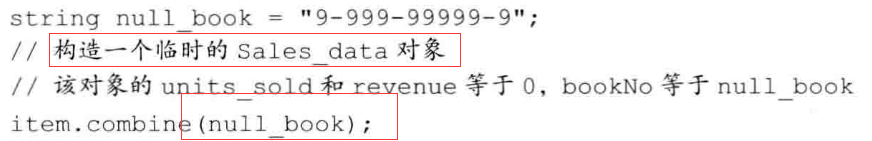
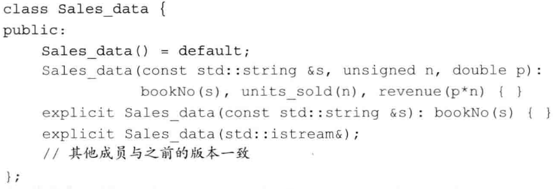
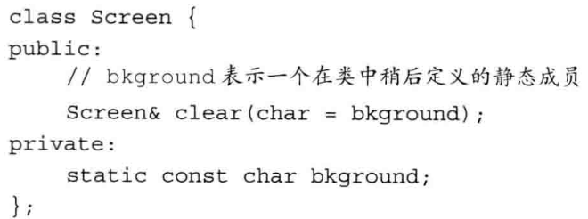

# 类

类的基本思想是**数据抽象**和**封装**。

## 1. 引入Const成员函数

```c++
std::string isbn() const { return this->bookNo; }
```

这里`const`的作用是修改隐式this指针的类型。默认情况下，this的类型是指向类类型非常量版本的常量指针。例如，在`Sales_data`成员函数中，`this`的类型是`Sales_data *const`，这意味着我们不能在一个常量对象上调用普通的成员函数。


[常量成员函数](https://blog.csdn.net/GMstart/article/details/7046140?utm_medium=distribute.pc_relevant.none-task-blog-BlogCommendFromMachineLearnPai2-1.control&dist_request_id=1328641.10985.16155463148072827&depth_1-utm_source=distribute.pc_relevant.none-task-blog-BlogCommendFromMachineLearnPai2-1.control)

### 构造函数

构造函数不能被声明成const。

必须定义类自己的默认构造函数，不能依赖于系统==合成的默认构造函数==。


在`C++11`新标准中，如果我们需要默认的行为，那么可以通过在参数列表后面写上`= default`来要求编译器生成构造函数。和其它函数一样，如果`= default`在类的内部，则默认构造函数时内联的；如果在外部，则不是。

> 之前可能错过了，对于在类内部实现的函数，则默认是内联的。


## 2. 访问控制与封装

`class`和`struct`都可以新建一个类，但**默认访问权限**不太一样（==唯一区别==）。在第一个访问说明符之前定义的成员，使用`struct`关键字，都是`Public`；而`class`都是`Private`

### 友元

类可以允许其它类或者函数访问它的非公有成员，方法是加一个`friend`关键字使其成为右元。

```c++
class A{
		friend void &print();
}
```

为了使友元对类的用户可见，我们通常把友元的声明与类本身放置在同一个头文件中（类的外部）。也就是说，在友元声明之外，还要在外部声明。

友元声明的作用是==影响访问权限==，本身并非普通意义上的声明。


## 3. 类的其它特性

### 可变数据成员

加入`mutable`关键字。一个可变数据成员永远不会是`const`，即使它是`const对象`的成员。

### 返回*this的成员函数


一个`const成员函数`如果以引用的形式返回`*this`，那么它的返回类型将是==常量引用==。

### 基于const的重载

常量对象==只能==调用常量函数，非常量对象==最好==调用非常量函数。

### 类之间的友元关系

例如：`Screen类`把`Window_mgr`类指定成它的友元。这样`Window_mgr`可以访问`Screen`的==私有成员==。

```c++
class Screen{
	friend class Window_mgr
        //
    .....
}
```

友元关系不具有传递性。

也可以只令成员函数作为友元（也会区分重载函数）：

```c++
class Screen{
	friend void Window_mgr::clear(ScreenIndex)
        //
    .....
}
```


## 4. 类的作用域

首先，==返回类型==中使用的名字都位于类的作用域之外。


> 类的定义分为两步：1、编译成员的声明。2、直到类全部可见后，才编译函数体。


## 5. 构造函数再探

### 委托构造函数

一个委托构造函数使用它所属类的其它构造函数执行它自己的初始化过程，或者说它把它自己的一些（或全部）职责委托给了其它构造函数。


### 隐式的类类型转换:star:

如果构造函数只接受一个实参，则它实际上定义了转换为此类类型的隐式转换机制，称为`转换构造函数`。



编译器只会自动执行==一步类型转换==，所以下面是错的：


### explicit关键字

我们可以通过关键字`explicit`，阻止这种一步转换，但记得：其只对一个实参的构造函数有效，且只允许出现在类内的构造函数声明处，不允许出现在类外。



==explicit构造函数只能用于直接初始化==，不能用于拷贝初始化。

```c++
Class a = Class(b); //错误
```

为转换显示使用构造函数：


### 聚合类


可以进行如下初始化：

```c++
Data vall = { 0, "Anna" }
```

### 字面值常量类


## 6. 类的静态成员

类的静态成员不与任何对象绑定在一起，它们不包含`this指针`。

在类的外部定义静态成员时，不能重复`static`关键字，该关键字只出现在类内部的声明语句。

一般来说，必须在类的外部定义和初始化每个静态成员。


### 静态成员的类内初始化

在类内初始化，必须要求静态成员是==字面值常量类型==`constexpr`：

```c++
class A{
	static constexpr int period = 30;
}
```


而在外部定义时，如果在类内部初始化了，则只需定义，不能初始化：

```c++
constexpr int Accout::period
```

### 静态成员能用于某些场景，而普通成员不能:star:


静态成员和普通成员的另外一个区别是：我们可以使用静态成员作为默认实参。



