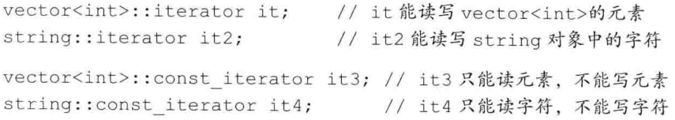
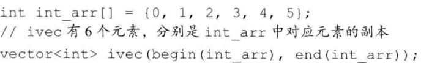

# 字符串、向量和数组

[toc]

## 1. 命名空间的using声明

使用`using声明`：

```c++
using namespace::name;
```

头文件不应包含`using声明`。


## 2. 标准库类型string


==拷贝初始化==和直接初始化：是否使用`=`。


使用`getline`读取一整行：

```c++
string line;
while(getline(cin, line))
	cout << line << endl;
return 0;
```

### string::size_type类型

size()返回的即是这个类型。string类及其它大多数标准库类型都定义了几种配套的类型，这些配套类型体现了标准库类型与机器无关的特性，类型`size_type`即是其中的一种。

### 字面值和string对象相加

两个**字面值**（例如："xx"）不能直接相加：


> C++语言中的字符串字面值并不是标准库类型string的对象。切记，字符串字面值与string是不同的类型。

### 处理string对象中的字符


### 使用范围For语句改变字符串中的字符

主要是要使用`引用`。


## 3. 标准库类型vector

`vector`是一个类模板，是==容器==的一种。


## 4. 迭代器介绍

所有**标准库容器**都可以使用**迭代器**。

获取迭代器不是使用==取地址符==，拥有迭代器的类型同时拥有返回迭代器的成员，比如：`begin()`和`end()`

`end()`成员返回的迭代器称为==尾后迭代器==。


> 因为end返回的迭代器并不实际指示某个元素，所以不能对其进行**递增**或**解引用**操作

### 迭代器类型

拥有迭代器的标准库类型使用`iterator`和`const_iterator`来表示迭代器的类型：



`C++ 11`新特性，引入了两个新函数：`cbegin`和`cend`，类似于之前的，但返回的类型是`const_iterator`。

> 但凡是使用了迭代器的循环体，都不要向迭代器所属的容器添加元素。

### 迭代器运算


## 5. 数组


### 复杂的数组声明


### 标准库函数begin和end

`C++ 11`新标准引入了两个名为`begin`和`end`的函数，和容器中的两个同名成员功能类似。这两个函数定义在`iterator`头文件中。


### 指针和数组


### C风格字符串


### 与旧代码的接口（c_str）

不能使用string对象直接初始化指向字符的指针，为了完成该功能，string专门提供了一个名为`c_str`的成员函数：


:star:使用数组初始化vector对象：




## 6. 多维数组

尽量使用auto，而无需考虑复杂的指针。