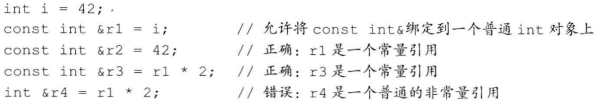

# 变量和基本类型


 

## 列表初始化


用花括号来初始化变量。如果我们使用列表初始化且初始值存在丢失信息的风险，则编译器将报错。


## 变量声明和定义

在变量名前添加关键字`extern`，则表明这是声明一个变量，而不是定义。


变量能且只能被定义一次，但是可以被多次声明。

## 引用

这里指的是`左值引用`。==引用为对象起了另外一个名字==， 引用即别名。


定义引用时，程序把引用和它的初始值绑定在一起，而不是将初始值拷贝给引用。一旦定义了引用，就无法令其在绑定到另外的对象。


## 指针

取地址符`&`和解引用符`*`

### 空指针

得到空指针最直接的方法就是用字面值`nullptr`来初始化指针。`nullptr`是一种特殊类型的字面值，可以被转换成任意其它类型的指针。

过去的程序还会用到一个名为`NULL`的==预处理变量==来给指针赋值。

### void*指针

这是一种特殊的指针类型，可用于存放任意对象的地址。


## 指向指针的引用


## const限定符

const对象一旦创建后，其值就不能再改变，所以`Const`对象必须初始化。


默认状态下，**const对象**仅在文件内有效（P 60）。如果需要这类对象只在一个文件中定义`const`，而在其它多个文件中声明并使用它，则需要添加`extern`关键字。


### const的引用

与普通引用不同的是，对常量的引用不能修改它所绑定的对象。

引用的类型必须与其所引用的对象的类型一致，但是有==两个例外==：:one:在初始化**常量引用**时，允许用任意表达式作为初始值，只要其结果能转换成引用的类型即可。[P 55]




### 指针和Const

指向常量的指针：


和**常量引用**一样，`指向常量的指针`也没有规定其所指的对象必须是一个常量。==所谓指向常量的指针仅仅要求不能通过该指针改变对象的值==，而没有规定那个对象的值不能通过其它途径改变。

### const指针

常量指针必须初始化，而且它的值不能再改变了。


> const指针：不能修改指针的指向，但能改变指向的值
>
> 指向const的指针：能修改指针的指向，但不能改变指向的值

### 顶层const

用`顶层const`表示指针本身是个常量，而`底层const`表示指针指向的对象是一个常量。


## constexpr和常量表达式

常量表达式是指：值不会改变并且在编译过程就能得到计算结果的==表达式==。


允许将变量声明为`constexpr`类型以便由编译器来验证变量的值是否是一个常量表达式。声明为`constexpr`的变量一定是一个常量，而且必须用常量表达式初始化。


### 指针和constexpr

限定符`constexpr`仅对指针有效，与指针所指向的对象无关，会把这个指针置为顶层const。


## 类型别名

传统的方法使用关键字`typedef`。


新的方法是`别名声明`：

```c++
using SI = double
```

[P 61]：别名的const问题。


## auto类型说明符

`auto`让编译器通过初始值来推算变量的类型。

auto一般会忽略掉顶层const。如果希望推断出的`auto`类型是一个顶层const，需要明确指出：

```c++
const auto f = ci;
```


## decltype类型指示符

作用是选择并返回操作数的数据类型。

```c++
decltype(f()) sum = x;   //sum的类型就是函数f的返回类型
```


## 预处理器概述


> 预处理变量无视C++语言中关于作用域的规则

