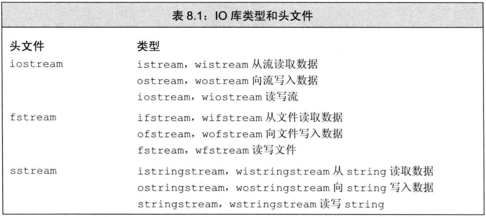
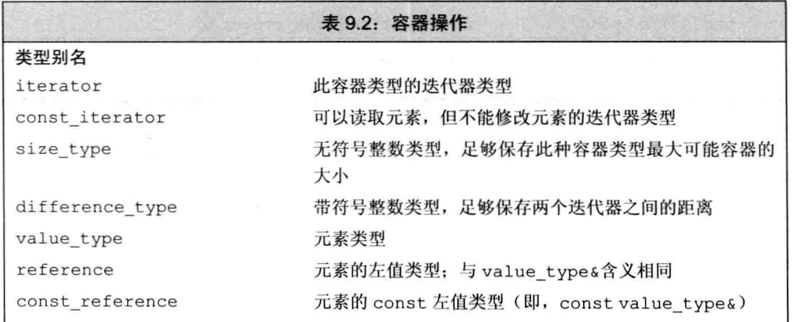
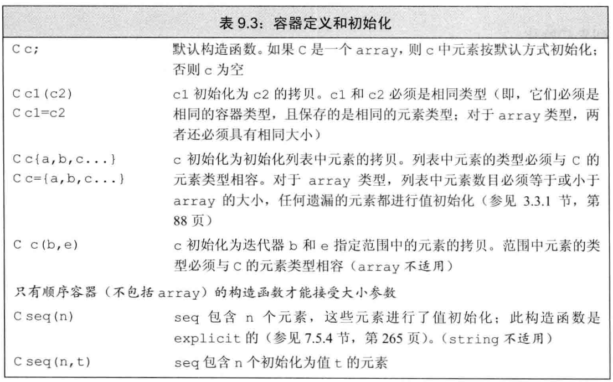
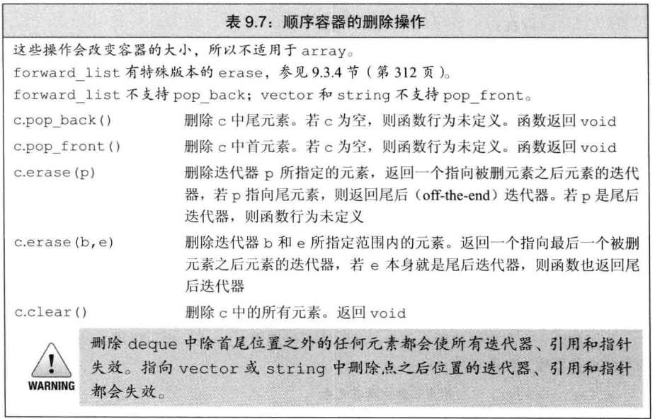
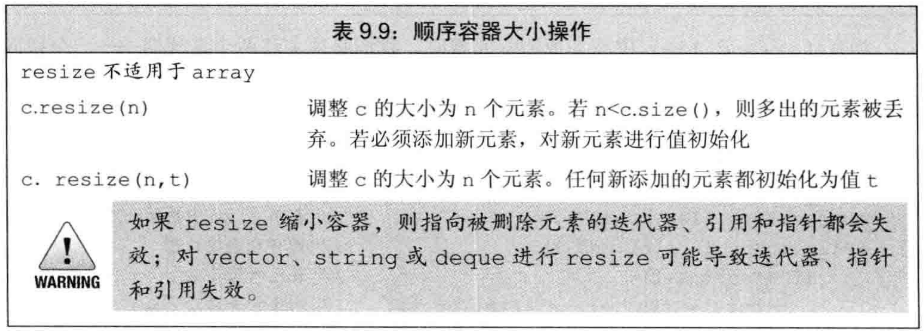
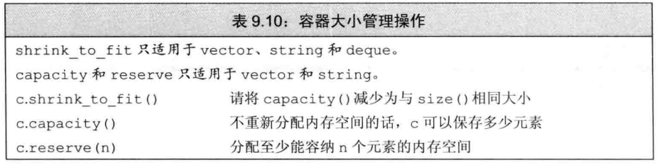
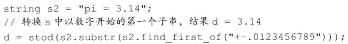

# IO库


## 1. IO类

到目前为止，我们已经使用过的IO类型和对象都是操纵char数据的。



上诉带`w`的都是对应的**宽字符版本**。

==IO对象无拷贝和赋值==。

### 条件状态

部分表：（完整见P 279）


### 管理条件状态

流对象的`rdstate`成员返回一个`iostate`值，对应流的当前状态。


### 管理缓冲输出

:one:`flush`刷新缓冲区，但不输出任何额外的字符；`ends`向缓冲区插入一个空字符，然后刷新缓冲区。


:two:`unitbuf`操作符，告诉流在接下来的每次写操作之后都进行一次flush操作。而`nounitbuf`则取消之。

```c++
cout << unitbuf;
cout << nounitbuf;
```

:three:当一个输入流被关联到一个输出流时，任何试图从输入流读取数据的操作都会线刷新关联的·输出流。标准库将cout和cin关联在一起。


## 2. 文件输入输出


对于已经关联好的流，关联到另外一个文件时，需要先关闭：

```c++
in.close();
in.open(ifile + "2");
```

### 文件模式


指定文件模式有如下限制，见(P 286)

以`out`模式打开文件，会丢弃已有数据（自带`trunc`）。防止的方法是指定`app模式`：

```c++
ofstream app("file2", ofstream::app);
```


## 3. string流


### 使用istringstream

当我们的某些工作是对整行文本进行处理，而其它一些工作是处理行内的单个单词时，通常可以使用`istringstream`。


### 使用ostringstream

当我们逐步构造输出时，希望最后一起打印时，`ostringstream`是很有用的。


# 顺序容器

一个容器就是一些特定类型对象的集合。顺序容器为程序员提供了元素存储和访问顺序的能力。

## 1. 顺序容器概述


`forward_list`和`array`是新`C++`标准增加的类型。通常使用`vector`是最好的选择，除非你有很好的理由选择其它容器。

## 2. 容器库概览

初始化时，如果对象没有默认构造函数，则需要提供：


==容器操作表==——部分：







### assign运算符

赋值运算符要求左边和右边的运算对象具有相同的类型，而`Assign`允许我们从一个不同但相容的类型赋值


### swap运算符

交换值，而元素不会被移动的事实意味着，除`string`外，指向容器的迭代器、引用和指针在`swap`操作之后不会失效，但会指向不同的容器。

与其它容器不同，`swap`两个`array`会真正交换它们的元素。

统一使用非成员版本的`Swap`是个好习惯。

### 关系运算符

比较两个容器，实际上是进行元素的**逐对比较**。同时比较还需要其**元素类型**定义了相应的比较运算符。


## 3. 顺序容器操作


### insert返回值

在新标准下，接受元素个数或范围的`insert`版本返回指向第一个新加入元素的**迭代器**。

### 使用emplace操作

新标准的三个emplace成员，不是拷贝元素，而是将参数传递给元素类型的构造函数：


### 访问元素


如果我们希望确保下标是合法的，可以使用`at`成员函数，如果越界，会抛出一个`out_of_range `异常。

### 删除元素




### 改变容器大小



### 容器操作可能使迭代器失效

添加元素后：


删除元素后：


## 4. Vector对象是如何增长的



> `reserve`并不改变容器中元素的数量，它仅影响`vector`预先分配多大的内存空间

调用`shrink_to_fit`只是一个请求，标准库并不保证退还内存。


## 5. 额外的String操作


### substr操作


### append和replace函数

```c++
s.append(" 4th ");
s.replace(11,3," 5th ");
```


### sting搜索操作

每个搜索操作返回一个`string::size_type`值，搜索失败返回`string::npos`的静态成员。


### compare函数


### 数值转换

```c++
int i = 42;
string s = to_string(i);
double d = stod(s);
```




## 6. 容器适配器

标准库还定义了三个顺序容器适配器：`stack、queue、priority_queue`。本质上，一个适配器是一种机制，能够使某种事物的行为看起来像另外一种事物一样。例如，stack适配器接受一个顺序容器，并使其操作起来像一个`stack`一样。


默认情况下，`stack、queue`是基于`deque`实现的，`prioprity_queue`是在`vector`之上实现的。

### 定义一个适配器

可以在创建一个适配时，将一个命名的顺序容器作为第二个类型参数来重载默认容器类型：


### 栈适配器


### 队列适配器

FIFO（先进先出）。

`priority_queue`允许我们为队列中的元素建立优先级，新加入的元素会安排在所有优先级比它低的已有元素之前。


```
bool cmp2(const pair<int, array<int, 2>>& a, const pair<int, array<int, 2>>& b)
{
	return a.second[1] > b.second[1];
}

class LRUCache {
public:
    map<int, array<int,2>> cache;
	int cap = 0;
	LRUCache(int capacity) {
		cap = capacity;
	}

	int get(int key) {
		if (cache.find(key) == cache.end())
			return -1;
		for (auto it = cache.begin(); it != cache.end(); it++)
		{
			it->second[1]++;
			//cout<<it->first<<" "<<it->second[1]<<endl;
		}
		cache[key][1] = 0;
		return cache[key][0];
	}

	void put(int key, int value) {
		for (auto it = cache.begin(); it != cache.end(); it++)
			{
				it->second[1]++;
				//cout<<it->first<<" "<<it->second[1]<<endl;
			}
		cout<<endl;
		cache[key] = { value,0 };
		if (cache.size() > cap)
		{
			vector<pair<int, array<int, 2>>> vtMap;
			for (auto it = cache.begin(); it != cache.end(); it++)
				vtMap.push_back(make_pair(it->first, it->second));
			
			sort(vtMap.begin(), vtMap.end(), cmp2);
			cache.erase(vtMap[0].first);
		}
	}
};

```

