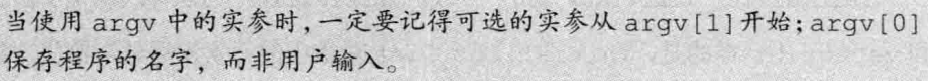

# 函数

## 1. 局部静态对象

局部静态对象在程序的执行路径第一次经过对象定义语句时初始化，并且知道程序终止才被销毁，在此期间即使对象所在的函数结束执行也不会对它由影响。


这段程序将输出从1到10的数字。


## 2. 参数传递

引用传递和值传递。

==使用引用，避免拷贝==。

### const形参和实参

和其它初始化过程一样，当用实参初始化形参时，会忽略掉**顶层const**。当形参有**顶层const**时，传给它常量对象或者非常量对象都是可以的。

因为会忽略`const`，所以是下面的结果：


==尽量使用常量引用==

### 数组形参


### main：处理命令行选项


当实参传给main函数之后，`argv`的第一个元素指向程序的名字或者一个空字符串，接下来的元素依次传递命令行提供的参数。最后一个指针之后的元素值保证为0。




## 3. 函数返回


### 返回数组指针:star:

```c++
Type (*function (parameter_list)) [dimension];
int (*func(int i))[10];
```

### 使用尾置返回类型:star:

```c++
auto func(int i) -> int(*)[10];
```

### 使用decltypeZ:star:

如果我们知道函数返回的指针将指向哪个数组，就可以使用`decltype`关键字声明返回类型：


有一个地方需要注意：`decltype`并不负责把数组类型转换为成对应的指针，所以结果是个数组，要想表示`arrPtr`返回指针，还必须在函数声明加一个*符合。


## 4. 函数重载

对于**重载的函数**来说，它们应该在形参数量或类型上有所不同，但不允许两个函数除了返回类型外其它所有的要素都相同。


### const形参

const形参也无法起到区分作用。

另外一方面，如果形参是某种类型的指针或引用，则通过区分其指向的是常量对象，还是非常量对象，可以实现函数重载，此时的`const`是底层的：


## 5. 特殊用途语言特性

### 默认实参

在给定的作用域中一个形参只能被赋予一次默认实参。

### 内联函数

内联函数可避免函数调用的开销；在函数的返回类型前面加上关键字==inline==，就可以将它声明成内联函数了：


### constexpr函数

这是指能用于常量表达式的函数。要遵循几项约定：

- 函数的返回类型及所有形参的类型都得是字面值类型，而且函数体中必须有且只有一条return语句。


> 通常把内联函数和constexpr函数放在头文件内。

## 6. 调式帮助

### assert预处理宏

所谓的预处理宏其实是一个预处理变量，它的行为有点类似于内联函数，`assert`宏使用一个表达式作为它的条件：

```c++
assert(expr);
```

首先对expr求值，如果表达式为0，assert输出信息并终止程序的运行，如果为一，则什么也不做。

> 这个宏定义在`cassert`头文件中

### NDEBUG预处理变量

`assert`的行为依赖于一个名为`NDEBUG`的预处理变量的状态，如果定义了它，则`assert`什么也不做。我们可以使用：

```c++
#define NDEBUG
```

来关闭调试状态，也可以使用命令行：

```c++
$ CC -D NDEBUG main.c
```

也可以使用NDEBUG编写自己的条件调试代码。


> 除了`__fun__`，还有`__FILE__`、`__LINe__`、`__TIME__`、`__DATE__`


## 7. 函数指针

要想声明一个函数指针，只需要用指针替换函数名即可。


### 使用函数指针


我们还能直接使用指向函数的指针调用该函数，无须提前解引用指针：

```c++
bool b1 = pf("hello", "good");
bool b1 = (*pf)("hello", "good");
```

### 重载函数的指针

当我们使用重载函数时，上下文必须清晰地界定到底应该选用哪个函数：


### 函数指针形参


实际调用时：

```c++
useBigger(s1,  s2,  lengthCompare);
```

使用类型别名和`decltype`可以让我们简化使用函数指针：

```c++
typedef decltype(lengthCompare)  Func
```

### 返回指向函数的指针

最简单的方法是使用类型别名：

```c++
using F = int(int*, int);
...
F fl(int);
```

当然也可以直接声明：

```c++
int (*fl(int))(int*, int);
```

也可以使用`尾置返回类型`：

```c++
auto fl(int) -> int(*)(int*, int);
```

