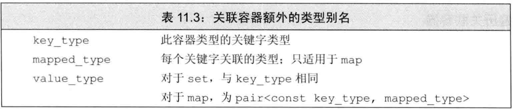
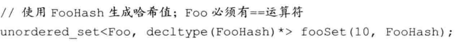

# 关联容器

关联容器中的元素是按关键字来保存和访问的。

## 1. 关联容器概述

关联容器都支持普通容器操作，不支持顺序容器的位置相关操作，例如`push_front`。定义一个`map`时，必须既指定关键字类型，又指明值类型；而定义`set`时，只需指明关键字类型，因为`set`没有值。

### 关键字类型的要求

对于有序容器，关键字类型必须定义==元素比较的方法==。默认情况下，标准库使用关键字类型的`<`运算符来比较两个关键字。

如果用**自定义**来取代`<`，必须符合`<=`（严格弱序）：

### 使用关键字类型的比较函数

### pair类型

这个标准库类型，定义在头文件`utility`中。一个pair保存两个数据成员。

pair的数据成员是`public`，分别命名为`first`和`second`。

map的元素是pair。

## 2. 关联容器操作

由于set里存的只有关键字，所以和`map`不能改变关键字一样，其迭代器是`const`的。

### 关联容器和算法

通常不对关联容器使用泛型算法。关联容器可用于只读取元素的算法。

### 删除元素

关联容器定义了三个版本的`erase`，前两个比较常见，最后一个接受一个`key_type`参数：删除所有匹配给定关键字的元素。

### map的下标操作

由于set没有值，所以set不支持下标。

### 访问元素

不想插入元素来进行搜索，就使用`find`代替下标操作。

对于`multi`类型的，可能一个关键字对应多个值，而在实际空间，这些值是存储在一起的，所以find返回的是指向第一个元素的迭代器，所以可以进行`++`来遍历获取。

## 4. 无序容器

这些容器不是使用比较运算符来组织元素，而是使用一个哈希函数和关键字类型的`==`运算符。在某些应用中，维护元素的序代价非常高昂，此时无序容器也很有用。

### 管理桶

### 无序容器对关键字类型的要求

无序容器使用关键字类型的`==`运算符来比较元素，它们还使用一个`hash<key_type>`类型的对象来生成每个元素的哈希值。

我们不能直接定义关键字类型为自定义类类型的无序容器。与容器不同，不能直接使用哈希模板，而必须使用我们自己的`hash`模板版本。

为了能将`Sale_data`用作关键字，我们需要通过元素来替代`==`运算符和哈希值计算函数：

使用这些函数来定义一个`unordered_multiset`：

如果我们的类定义了`==`运算符，则可以只重载哈希函数：

