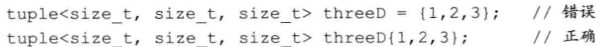
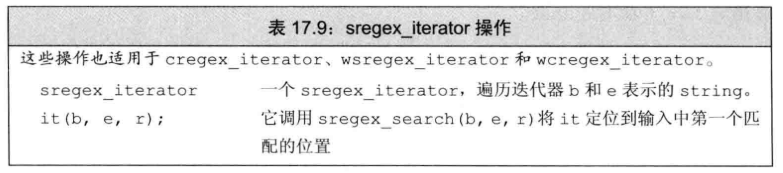
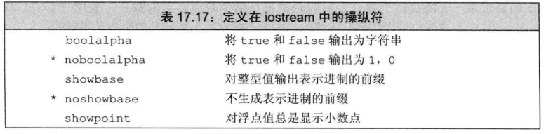
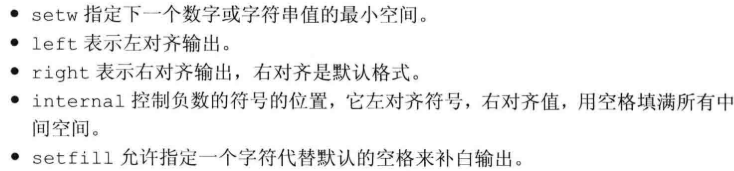

# 标准库特殊设施

## 1. tuple类型

`tuple`是类似`pair`的模板。和其类似，不同`tuple`类型的成员类型也不相同，但一个`tuple`可以有任意数量的成员。当我们希望将一些数据组合成单一对象，但又不想麻烦的地定义一个新手数据成员结构来表示这些数据时，`tuple`是非常有用的。


定义和初始化`tuple`时，注意其构造函数是`explicit`的，必须使用直接初始化语法：



可以使用`make_tuple`来生成`tuple`对象。访问其成员，需要使用标准库函数模板`get`：

```c++
auto book = get<1>(item); //返回item的第二个成员
```

如果不知道一个`tuple`准确的类型细节信息，可以用上表中的两个赋值函数：


`tuple`间进行比较（使用相等和关系运算符），需要两者成员数量相同，且每对成员间`=`和`<`都是合法的。

### 1. 使用tuple返回多个值

tuple的一个常见用途是从一个函数返回多个值。


## 2. bitset类型

标准库定义了`bitset`类，使得位运算的使用更为容易，并且能够处理超过最长整形类型大小的位集合。它类似`array`类，定义时需要声明它包含多少个二进制位：

```
bitset<32> bitvec(1U); //32位，低位为1，其他位为0
```


### bitset操作


需要注意的是，下标运算符对`const`属性进行了重载。const版本的下标运算符返回布尔值。而`非const`版本返回`bitset`定义的一个特殊类型，它允许我们操纵指定位的值：


## 3. 正则表达式

正则表达式一种描述字符序列的方法，是一种极其强大的计算工具。我们重点介绍如何使用c++正则表达式库（RE库），定义在`regex`中：


### 使用正则表达式

从一个简单例子开始：“i除非在c之后，否则必须在e之前”：


默认情况下，regex使用的正则表达式语言是`ECMAScript`，在`ECMAScript`中，模式`[[::alpha::]]`匹配任意字母，符号`+`和`*`分别表示我们希望`一个或多个`或`零个或多个`。

### 指定regex对象的选项


一个正则表达式的语法是否正确是在运行时解析的。如果错误，运行时会抛出`regex_error`的异常，其有一个`what()`操作来描述发生了什么错误。


### 匹配与Regex迭代器类型

之前的简单例子只能打印输入序列中第一个匹配的单词，我们可以使用`sregex_iterator`来获得所有匹配。




这里，`end_it`是一个空迭代器，起到尾后迭代器的作用。我们知道例子中迭代器返回的是一个`smatch`对象的引用或指针，而它由两个成员：`prefix`、`suffix`，分别返回表示输入序列中当前匹配之前和之后部分的`ssub_match`对象。而一个`ssub_match`对象有两个名为`str`和`length`的成员，我们可以重写例子：


### 使用子表达式

正则表达式的模式通常包含一个或多个==子表达式==。一个子表达式是模式的一部分。正则表达式通常用==括号==表示子表达式。


子表达式的一个常见用途是**验证必须匹配特定格式的数据**。这里我们建立一个匹配美式电话的例子，


我们将使用下表的操作来编写`valid`函数，这里我们的`pattern`有七个子表达式，与往常一样，每个`smatch`对象会包含八个`ssub_match`元素。位置`[0]`的元素表示整个匹配；元素`[1]...[7]`表示每个对应的子表达式。


### 使用regex_replace

当我们希望在输入序列中查找并替换一个正则表达式时，可以调用`regex_replace`。


我们用一个符号`$`后跟子表达式的索引号来表示一个特定的子表达式：

```c++
string fmt = "$2.$5.$7";
```


此程序的输出为：

```c++
908.555.1800
```

### 用来控制匹配和格式的标志

匹配和格式化标志的类型为`match_flag_type`。都定义在`regex_constants`的命名空间中，这个空间是定义在命名空间`std`中的命名空间，为了使用：

```c++
using std::regex_constants::format_no_copy;
```


一个例子：


## 4. 随机数

定义在头文件`random`中的随机数库通过一组协作的类来解决这些问题：随机数引擎类和随机数分布类。一个引擎类可以生成`unsigned`随机数序列，一个分布类使用一个引擎类生成指定类型的、在给定范围内的，服从特定概率分布的随机数。


### 随机数引擎和分布

随机数引擎类是函数对象类，它们定义了一个调用运算符，返回一个随机`unsigned`整数。我们可以通过调用一个随机数引擎对象来生成原始随机数：


> 标准库有多个随机数引擎类

对于大多数场合，随机数引擎的输出是不能直接使用的。为了得到一个指定范围内的数，我们使用一个分布类型的对象：


类似引擎类型，分布类型也是函数对象类，定义了一个调用运算符，它接受一个随机数引擎最为参数。这两者组成了==随机数发生器==。

随机数发生器具有==序列不变性==，每次运行程序都会返回相同的数值序列。虽然这样方便调式，但考虑下列代码：


编写此函数的正确方法是将这两个类定义为`static`：


由于e和u是`static`，因此它们在函数调用之间会保持住状态，第一次调用会产生前100个随机数，第二次调用会获得接下来的100个。

我们也可以通过设置种子来完成。为引擎设置种子有两种方式：在创建引擎时提供种子，或者调用引擎的`seed`成员：


最常用的方法是调用系统函数`time`，定义在`ctime`中，返回一个特定时刻到当前经过了多少秒。接受单个指针参数，指向用于写入时间的数据结构，如果指针为空，则函数简单地返回时间：


由于`time`返回以秒计的时间，因此这种方式只适用于生成间隔为秒级以上的应用。

### 其他随机数分布

使用`uniform_int_distribution`来获得随机浮点数，定义时，指定最小值和最大值：


==分布类型都是模板==，具有单一的模板类型参数，表示分布生成的随机数的类型。每个分布模板都有一个默认模板实参。生成浮点值的分布类型默认生成`double`。


新标准库可以生成非均匀分布的随机数，具体见附录A.3。如下例，我们使用正态分布，`normal_distribution`：


`bernoulli_distribution`这个分布不接受模板参数，它是一个普通类，总是返回一个bool值，它返回`true`的概率是一个常数，此概率的默认值是`0.5`。


## 5. IO库再探

### 格式化输入与输出

除了条件状态，每个`iostream`对象还维护了一个格式状态来控制`IO`如何格式化的细节。标志库定义了**一组操作符**来修改流的格式状态。一个操作符是一个函数或是一个对象，会影响流的状态，并能用作输入或输出运算符的运算对象。

我们已经再程序中使用过一个操作符——`endl`：输出一个换行符并刷新缓冲区。操作符用于两大类输出控制：控制数值的输出形式、控制补白的数量和位置。而且一般操作符都是设置/复原成对的。

当操作符改变流的格式状态时，通常改变后的状态对所有后续IO都生效。一个例子是`boolalpha`操作符：


得到的结果如下：


为了取消格式状态的改变，我们使用`noboolalpha`。

默认情况下，整型值的输入输出使用十进制，我们可以使用操作符`hex`、`oct`、`dec`将其改为十六进制、八进制或改回十进制：


当对流应用`showbase`操作符时，会在输出结果中显示==进制==。

我们可以控制浮点数输出的三种格式：（默认情况下，浮点值按六位数字精度打印）


可以调用IO对象的`precision`成员或使用`setprecision`操作符（接受参数的操作符都定义在==iomapip==中）来改变精度。





操作符`scientific`改变流的状态来使用**科学记数法**。操作符`fixed`改变流的状态来使用**定点十进制**。使用`hexfloat`来使用**十六进制格式**。使用`defaultfloat`来将流恢复到**默认状态**。

#### 输出补白




#### 控制输入格式

默认情况下，输入运算符会忽略空白符（空格符、制表符、换行符、换纸符和回车符）。操作符`noskipws`会令输入运算符读取空白符，而不是跳过它们。恢复操作为`skipws`


### 为格式化的输入/输出操作

到目前为止，我们的程序只使用过格式化IO操作，而==未格式化操作==允许我们将流当作一个**无解释的字节序列**来处理。


将字符放回输入流：`peek`，`unget`、`putback`。具体见书P 674。


### 流随机访问

各种流类型通常都支持对流中数据的随机访问。虽然标准库为所有流类型都定义了`seek`和`tell`函数，但它们是否会做有有意义的事情依赖于流绑定到哪个设备。在大多数系统中，绑定到cin、cout、cerr和clog的流不支持随机访问。而`fstream`和`sstream`支持。

