# 特殊工具与技术

## 1. 控制内存分配

### 重载new和delete


标准库定义了`operator new`和`operator delete`函数的8个重载版本。


应用程序可以自定义上面函数版本中的任意一个，前提是自定义的版本必须位于**全局作用域**或者**类作用域**中。当我们将上诉运算符函数定义成类的成员时，它们是**隐式静态的**，而且可以自定义具有任何形参的`operator new`，但不能是下面这个：


使用`malloc`和`free`来实现：


### 定位new表达式

具体见书。


## 2. 运行时类型识别（RTTI）

这个功能由两个运算符实现：

+ `typeid`运算符，用于返回表达式的类型。
+ `dynamic_cast`运算符，用于将基类的指针或引用安全地转换成派生类的指针或引用。

主要适用于：我们想要使用基类对象的指针或引用执行某个**派生类操作**，并且该操作不是**虚函数**。

### `dynamic_cast`运算符

使用形式如下所示：


其中，`type`必须是一个类类型，并且通常情况下该类型应该含有虚函数。指针类型的`dynamic_cast`的例子如下：

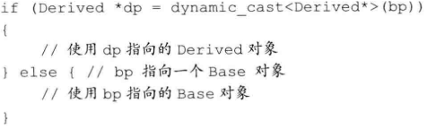

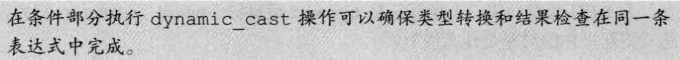

当对引用的类型转换失败时，程序抛出一个名为`std::bad_cast`的异常，定义在`typeinfo`文件中。

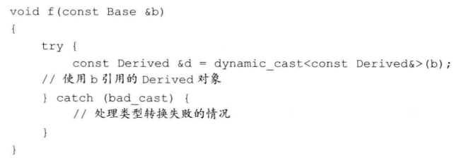

### typeid运算符

形式是：$typeid(e)$。其中`e`可以是任意表达式或类型的名字。操作结果是**一个常量对象的引用**。该对象的类型是标准库类型`type_info`或者`type_info`的公有派生类型，定义在`typeinfo`中。

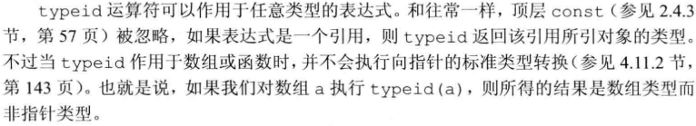

通常情况下，我们使用`typeid`比较两条表达式的类型是否相同：

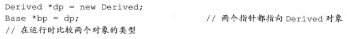


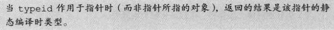

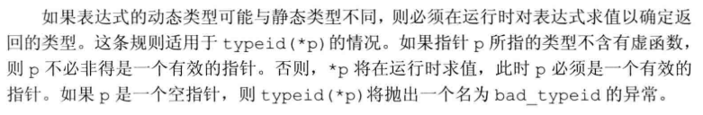

### type_info类

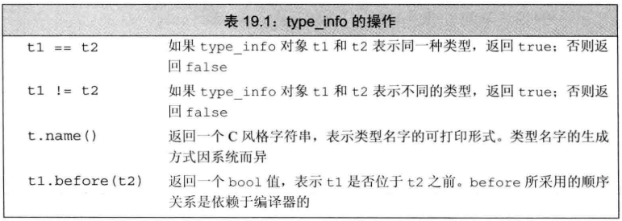

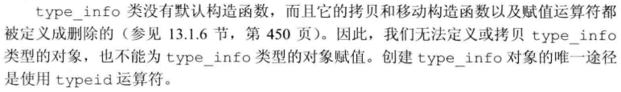


## 3. 枚举类型

枚举类型使得我们可以将一组整型常量组织在一起。和类一样，每个枚举类型定义了一种新的类型。==枚举属于字面值常量类型==。

C++包含两种枚举：限定作用域和不限定作用域的。定义==限定作用域的枚举==一般形式是：

```c++
enum class open_modes { input, output, append}
```

定义不限定作用域的枚举，则要省略`class`：

```c++
enum color { red, blue};
```

通过下面的例子，体会他们的区别：

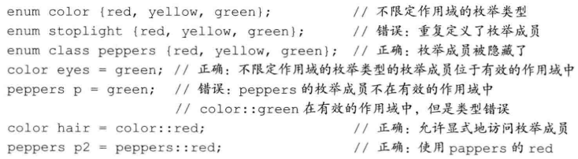

枚举成员是`const`，因此在初始化枚举成员时提供的初始值必须是常量表达式。

**一个不限定作用域的枚举类型的对象或枚举成员**自动地转换成整型：

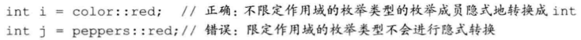

我们可以在enum的名字后加上冒号以及我们想在该`enum`中使用的类型（默认是`int`）：

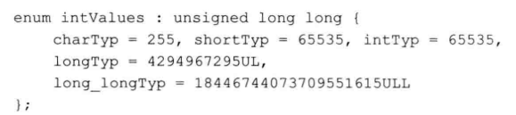


## 4. 类成员指针

成员指针是指可以指向类的非静态成员的指针。


### 数据成员指针

与普通指针不同的是，成员指针还必须包含成员所属的类。例如：

```c++
const string Screen::*pdata;
```

当我们初始化一个成员指针时，需要指定它所指定的成员：

```c++
pdata = &Screen::contents;
```

要想使用成员指针，必须把它绑定到相应类型的对象上，有两种成员指针访问运算符：`.*`和`->*`：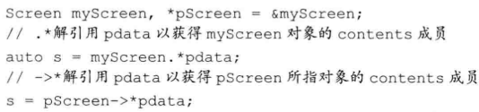

常规的访问控制规则对成员指针同样有效，如果其指向的成员是私有的，则只能在类或者友元内部使用。如果还是希望可以访问私有成员，可以写一个如下的函数：

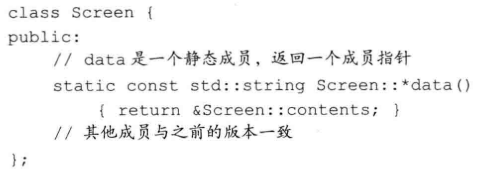

### 成员函数指针

和函数指针一样，要指名参数列表和返回类型等：


最简单的方法是使用`auto`：

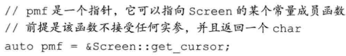

和普通函数指针不同的是，在成员函数和指向该成员的指针之间不存在自动转换规则：

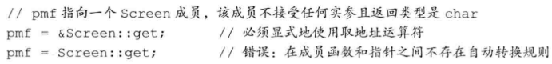

使用成员函数指针：

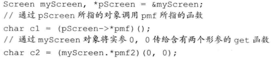

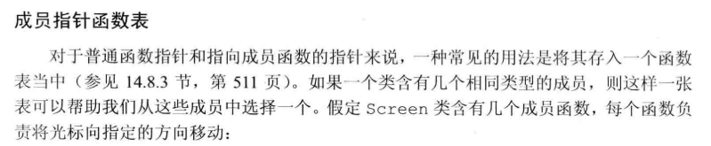

剩余具体见书。


## 5. 嵌套类

一个类定义在另一个类的内部。嵌套类是一个独立的类，与外层类基本没什么关系。嵌套类的名字在外层类作用域中是可见的，在外层类作用域之外不可见。以之前的代码为例子：

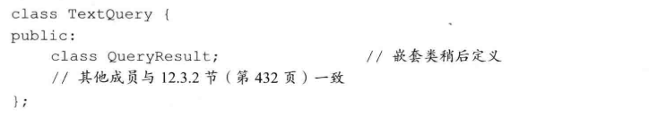

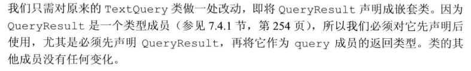

然后我们按照如下方式定义嵌套类：

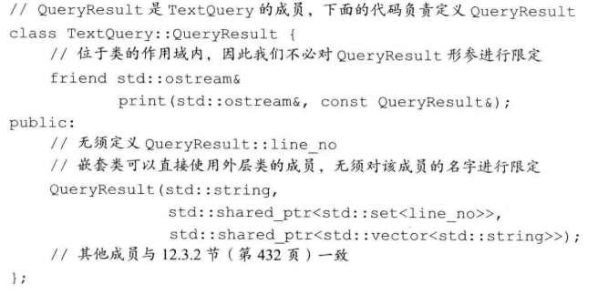

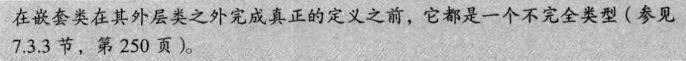

定义嵌套类的成员：

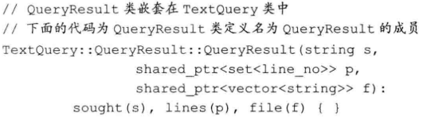

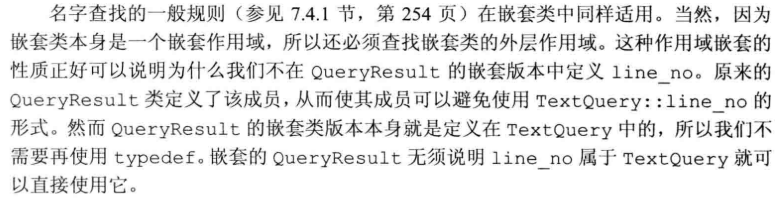


## 6. Union：一种节省空间的类

联合是一种特殊的类。一个`union`可以有多个数据成员，但是在任意时刻只有一个数据成员可以有值。`union`不能含有引用类型的成员。含有构造函数和析构函数的类类型可以作为`union`的成员类型。（默认情况下，`union`的成员都是公有的）

由于`union`既不能继承其他类，也不能作为基类使用，所以不能含有虚函数。

联合的形式如下：

```c++
union Token
{
	char cval;
	int ival;
	double dval;
};
```

匿名`union`是一个未命名的`union`，并且在右花括号和分号之间没有任何声明。在匿名`union`的定义所在的作用域内，该`union`的成员都是可以直接访问的：


含有类类型的`union`要复杂很多，因为需要在其状态切换时，调用构造或析构函数。所以我们通常把含有类类型成员的`union`内嵌在另一个类中，为了追踪`union`中到底存储了什么类型的值，通常会定义一个独立对象称为`union`的判别式。

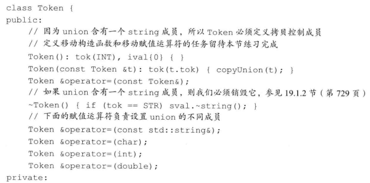

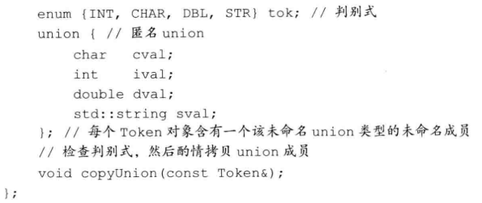

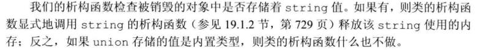

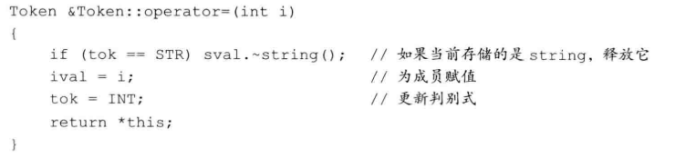

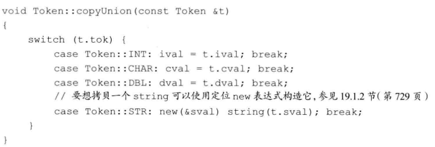


## 7. 局部类

类可以定义在某个函数的内部，我们称这样的类为==局部类==。局部类的类型只在定义它的作用域内可见。和嵌套类不同，局部类的成员受到严格限制。

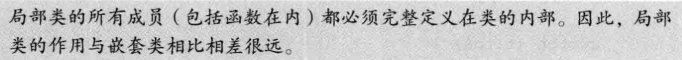

由上可知，局部类的成员函数一般只有几行代码，否则我们就很难读懂它。

局部类只能访问外层作用域定义的类型名、静态变量以及枚举成员，不能访问普通局部变量：

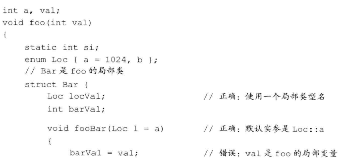

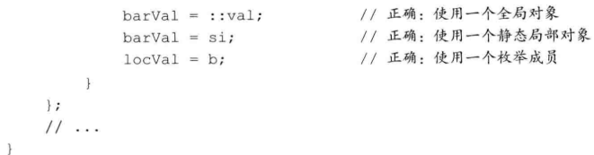

外层函数对局部类的私有成员没有任何访问权限。


## 8. 固有的不可移植特性

为了支持低层编程，C++定义了一些固有的不可移植的特性。

### 位域

类可以将其非静态成员定义成==位域==。在一个位域中含有一定数量的二进制位，当一个程序需要向其他程序或硬件设备传递二进制数据时，通常会用到位域。位域的类型必须是整型或枚举类型。

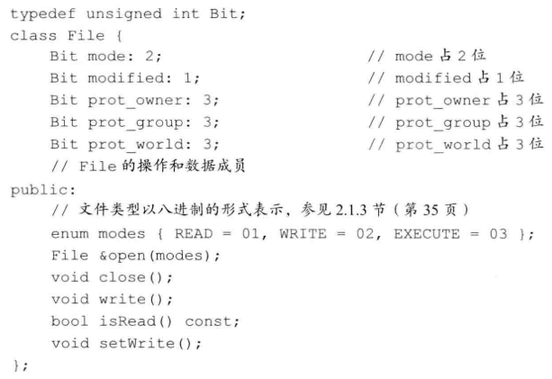

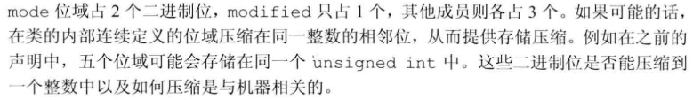

取地址符不能作用于位域，因此任何指针都无法指向类的位域。

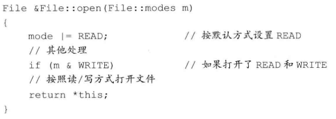


### volatile限定符

当对象的值可能在程序控制或检测之外被改变时，应该将该对象声明为`volatile`。它告诉编译器不应对这样的对象进行优化。其用法和`const`相似：

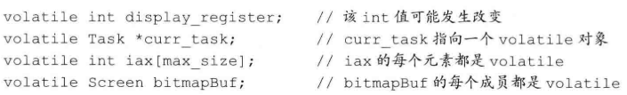

> 只有volatile的成员函数才能被volatile的对象调用。

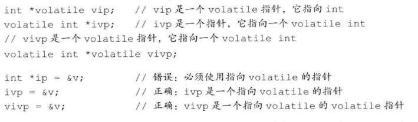

合成的拷贝对`volatile`对象无效，必须自定义拷贝或移动操作。

### 链接指示：extern “C”

C++使用链接指示指出任意非C++函数所用的语言。链接指示可以有两种形式：单个的或复合的。链接指示不能出现在类定义或函数定义的内部。同样的链接指示必须在函数的每个声明中都出现。

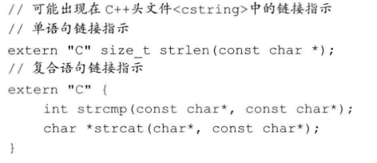

关键字 + 字符值常量（"C"）以及一个普通的函数声明。

多重声明的形式可以应用于整个头文件：

```c++
extern "C"{
	#include<string.h>
}
```

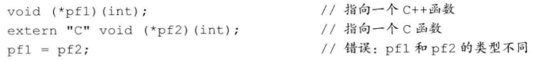

指向C函数的指针和指向C++函数的指针是不一样的类型。