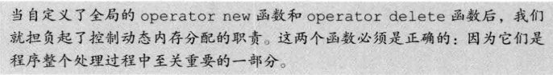

# 特殊工具与技术

## 1. 控制内存分配

### 重载new和delete

标准库定义了`operator new`和`operator delete`函数的8个重载版本。

应用程序可以自定义上面函数版本中的任意一个，前提是自定义的版本必须位于**全局作用域**或者**类作用域**中。当我们将上诉运算符函数定义成类的成员时，它们是**隐式静态的**，而且可以自定义具有任何形参的`operator new`，但不能是下面这个：

使用`malloc`和`free`来实现：

### 定位new表达式

具体见书。

## 2. 运行时类型识别（RTTI）

这个功能由两个运算符实现：

+ `typeid`运算符，用于返回表达式的类型。
+ `dynamic_cast`运算符，用于将基类的指针或引用安全地转换成派生类的指针或引用。

主要适用于：我们想要使用基类对象的指针或引用执行某个**派生类操作**，并且该操作不是**虚函数**。

### `dynamic_cast`运算符

使用形式如下所示：

