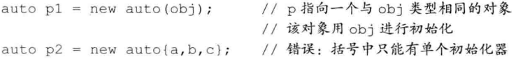
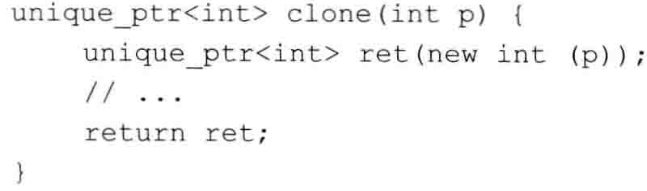
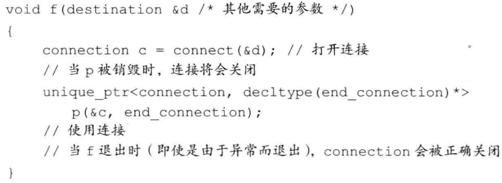

# 动态内存

我们的程序目前为止只使用过静态内存或栈内存。==静态内存==用来保存局部`static`对象、类`static`对象以及定义在任何函数之外的变量，==栈内存==用来保存定义在函数内的非`static`对象。分配在静态或栈内存中的对象由编译器==自动创建和销毁==。

初次之外，每个程序还拥有一个内存池。这部分内存被称作自由空间或==堆==。程序用堆来存储动态分配的对象——即，那些在程序运行时分配的对象。==我们的代码必须显示地销毁它们==。

为了安全使用动态内存，新标准提供==智能指针==，可以自动释放所指向的对象（定义在`memory`头文件中）。

- `shared_ptr`。允许多个指针指向同一个对象。

- `unique_ptr`。独占所指向的对象。

- `weak_ptr`。是一种弱引用，指向`shared_ptr`所管理的对象。

    

## 1. 智能指针

### Shared_ptr类

智能指针也是模板，默认初始化的智能指针中保存一个空指针。


最安全的分配和使用动态内存的方法是：调用一个名为`make_shared`的函数。此函数在动态内存中分配一个对象并初始化它，返回指向此对象的`shared_ptr`。


当指向一个对象的最后一个`shared_ptr`被销毁时，`shared_ptr`类会自动销毁此对象，通过另一个特殊的成员函数——析构函数完成销毁工作。当动态对象不再被使用时，`shared_ptr`类会自动释放动态对象。

使用动态内存的一个常见原因是：允许多个对象共享相同的状态。多个实例实际上只占据了一份动态内存。

### 直接管理内存

在自由空间分配的内存是无名的，因此`new`无法为其分配的对象命名，而是返回一个指向该对象的指针。


如果我们提供了一个括号包围的初始化器，就可以使用`auto`从此初始化器，来推断我们想要分配的对象的类型。（括号中仅有单一初始化器）



```c++
auto p1 = new auto(int); // int*
```

内存耗尽会抛出一个`bad_alloc`的异常，我们可以使用==定位new==，来阻止异常，转而返回空指针：

```c++
int* p2 = new(nothrow) int;
```

传递给delete的指针必须指向**动态分配的内存**，或者是一个**空指针**。


### shared_ptr和new结合使用

接受指针参数的**智能指针构造函数**是`explicit`的：


用来初始化智能指针的普通指针必须指向动态内存，因为智能指针默认使用`delete`释放它所关联的对象。如果想将智能指针绑定到一个指向其它类型资源的指针上，但必须提供自己的操作来替代`delete`。


==不要混合使用普通指针和智能指针！==


智能指针类型定义一个名为`get`的函数，它返回一个内置指针，指向智能指针管理的对象。==不要使用`get`初始化另一个智能指针或为智能指针赋值==。


可以用==Reset==来将一个新的指针赋予一个`shared_ptr`：

```c++
shared_ptr<int> p;
p.reset( new int(1024) );
```


### unique_ptr

初始化`unique_ptr`必须采用**直接初始化形式**：

```c++
unique_ptr<double> p1;
unique_ptr<int> p1( new int(42) );
```

`unique_ptr`==不支持普通的拷贝或赋值操作==：


不能拷贝`unique_ptr`的规则有一个例外：我们可以拷贝或赋值一个将要被销毁的`unique_ptr`。



编译器知道要返回的对象将要被销毁。在此情况下，编译器执行一种特殊的`拷贝`。

关于删除：





### weak_ptr

这是一种==不控制==所指向对象==生存期==的智能指针，它指向一个由`shared_ptr`管理的对象。将一个`weak_ptr`绑定到一个`shared_ptr`不会改变`shared_ptr`的引用计数。即使有`weak`，也能销毁`shared`。


由于对象可能不存在，我们不能使用`weak_ptr`直接访问对象，而必须调用`lock`。


## 2. 动态数组

### new和数组

```c++
int *pia = new int[get_size()];
```

我们所说的动态数组并不是数组类型，而是指针。

可以进行如下初始化：

```c++
int *pia = new int[10](); //10个值初始化为0的int
int *pia = new int[10]{0,1,2,3,4,5}; //前几个值初始化指定数，后几个为0
```

动态分配一个空数组是==合法的==：


为了释放动态数组，使用一种特殊形式的`delete`——在指针前加上一个`[]`：

```c++
delete [] pia;
```

### 智能指针和动态数组

标准库提供了一个可以管理`new`分配的数组的`unique_ptr`版本，也要加`[]`

```c++
unique_ptr<int []> up(new int[10]);
```

当指向数组时，可以使用下标运算符来访问数组中的元素：

```c++
up[0] = i;
```


和`unique_ptr`不同，`shared_ptr`不支持管理动态数组。如果希望使用，则必须提供自己定义的删除器：

```c++
shared_ptr<int> sp(new int[10], [](int *p) { delete[] p; } );
```

而且`shared_ptr`未定义下标运算符，而且不支持指针算术运算。

### allocator类

定义在`memory`中，帮助我们将**内存分配**和**对象构造**分离开来。提供一种==内存感知==的内存分配方法，它分配的内存是原始的、==未构造的==。

当使用它分配内存时，它会根据给定的对象类型来确定恰当的内存大小和对齐位置：

```c++
allocator<string> alloc;
auto const p = alloc.allocate(n);
```


为了适应`allocate`返回的内存，我们必须用`construct`构造对象。使用未构造的内存，其行为是未定义的。


==拷贝和填充算法==是这个类的两个伴随算法，可以在未初始化内存中创建对象：


# 拷贝控制


## 1. 拷贝、赋值与销毁

### 拷贝构造函数

如果一个构造函数的**第一个参数是自身类类型的引用**，且任何额外参数都有默认值，则此构造函数是==拷贝构造函数==：

```c++
class Foo{
public:
	Foo();
	Foo(const Foo&); 	//拷贝构造函数
}
```

编译器生成的==合成拷贝构造函数==会将**其参数的成员**逐个拷贝到正在创建的对象中，


使用==直接初始化==时，实际上是要求编译器使用普通的函数匹配来选择与我们提供的参数最匹配的构造函数。使用==拷贝初始化==时，通常使用拷贝函数来完成，或使用移动构造函数。==拷贝初始化的发生情况==：

- 用`=`定义变量
- 传给非引用类型的实参
- 返回类型非引用的函数返回一个对象
- `{}`列表初始化


### 拷贝赋值运算符

一般的赋值运算符：

```c++
Foo& operator=(const Foo&);
```

未定义的情况下，会自动生成`合成拷贝运算符`。同样，对于某些类，合成拷贝运算符用来禁止该类型对象的赋值。


> 对于给定类，只会有唯一一个析构函数。

三/五法则