# 面向对象程序设计

==基于三个基本概念==：数据抽象、继承、动态绑定（多态）。

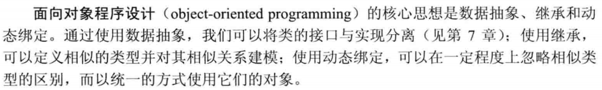

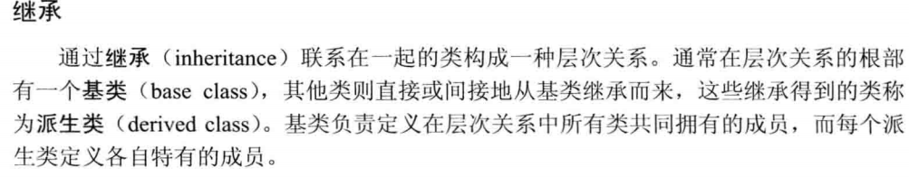


## 1. 定义基类和派生类

我们首先完成`Quote`类的定义：

```c++
#pragma once
#include<string>
class Quote
{
public:
	Quote() = default;
	Quote(const std::string &book,double sales_price):
		bookNo(book),price(sales_price){}
	std::string isbn() const { return bookNo; }

	virtual double net_price(std::size_t n) const
	{
		return n * price;
	}

	virtual ~Quote() = default;

private:
	std::string bookNo;
protected:
	double price = 0.0;
};
```

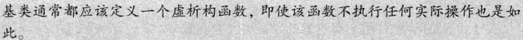

### 成员函数和继承

基类希望其派生类进行覆盖的函数，将其定义为虚函数。通过加上`virtual`关键字。如果基类把一个函数声明成虚函数，则该函数在派生类中隐式地也是虚函数。

派生类可以访问公有成员，而不能访问私有成员。特殊情况是使用`protected`，允许派生类访问，但禁止其他用户访问。

### 定义派生类

派生类必须通过使用**派生类列表**：

```c++
#pragma once
#include "Quote.h"
class Bulk_quote :
    public Quote
{
public:
    Bulk_quote() = default;
    Bulk_quote(const std::string&, double, std::size_t, double);
    double net_price(std::size_t) const override;
private:
    std::size_t min_qty = 0;  //适用折扣的最低购买量
    double discount = 0.0;    //折扣额
};
```

可以不使用`virtual`，而是在派生类成员函数后加一个`override`显式注明。

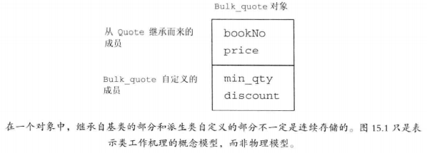

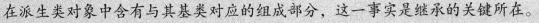

对于派生类的**基类部分的初始化**，会执行默认初始化，或者进行指定：

```c++
Bulk_quote(const std::string& book, double p, std::size_t qty, double disc):
        Quote(book,p),min_qty(qty),discount(disc) {}
```

```c++
double Bulk_quote::net_price(std::size_t cnt) const
{
	if (cnt > min_qty)
		return cnt * (1 - discount) * price;
	else
		return cnt * price;
}
```

派生类的作用域嵌套在基类的作用域之内。

> ==遵循基类的接口==：哪怕可以在派生类内初始化基类的成员，但不要这样做，而是调用基类的构造函数来进行初始化。

如果基类定义了一个静态成员，则整个继承体系中只存在该成员的唯一定义。

如果我们想将某个类用作基类，则该类必须已经定义而非仅仅声明：

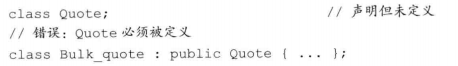

如果不希望某个类作为基类，则使用`final`关键字：

```c++
class NoDerived final {...};
```

### 类型转化和继承

通常情况下，引用和指针的类型应与对象的类型一致，但存在继承关系的类是一个重要的例外：==可以将基类的指针或引用绑定到派生类对象上==。

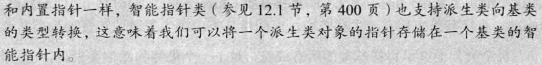

==静态类型和动态类型==：静态类型在**编译时是已知**的，它是变量声明时的类型或表达式生成的类型；动态类型则是变量或表达式表示的**内存中的对象的类型**，直到**运行时才可知**。

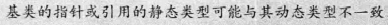

因为一个基类可能是派生类对象的一部分（每个派生类对象都包含一个基类部分），也可能不是，所以**不存在从基类向派生类的自动类型转化**。

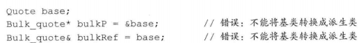

由于动态类型编译时不可知，所以绑定在派生类的基类指针或引用，也不能转换成派生类：

```c++
Bulk_quote bulk;
Quote *it = &bulk;
Bulk_quote *bp = it;  //错误 
```

派生类向基类的类型转换只对指针或引用类型有效，而在对象之间不存在。因此，实际过程中，都是调用的**拷贝和赋值函数**来完成所谓的`转换`的。

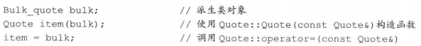


## 2. 虚函数

由于虚函数是==动态绑定==的，所以所有虚函数都必须定义。必须搞清楚的是，**动态绑定**只有当我们通过指针或引用调用虚函数时才会发生；直接调用的话，在编译时就已经确定。

> OOP的核心思想是多态。引用或指针的静态类型与动态类型不同的这一事实，是C++语言支持多态性的根本所在。

一旦某个函数被声明成虚函数，则在所有派生类中它都是虚函数。

### final和override

虽然派生类和基类的虚函数应该保持形参列表一致（返回类型有特殊情况，各自返回本身），但不一致也不会导致报错，所以为了避免这个问题，加上`override`关键字，提示编译器这个函数需要覆盖虚函数，而不是独立的个体。

我们还能把某个函数指定为`final`，则之后任何尝试覆盖该函数的操作都将引发错误。

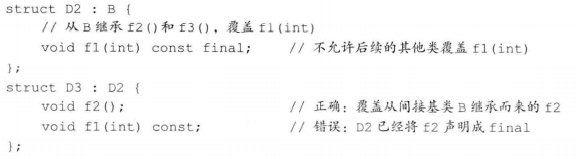

这两个关键字都在修饰符以及尾置返回类型之后。

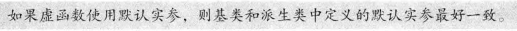

某些情况下，我们不希望动态绑定，而是强迫其执行虚函数的某个版本，可以使用作用域运算符：

```c++
double undis = baseP->Quote::net_price(42);
```

以上强调使用`Quote`的函数，而不管`baseP`指向哪个对象类型。

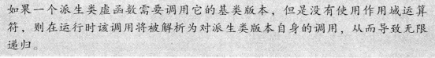


## 3. 抽象基类

### 纯虚函数

和普通的虚函数不一样，一个纯虚函数无须定义。通过在`;`前加上`=0`说明。

```c++
#pragma once
#include "Quote.h"
class Disc_quote :
    public Quote
{
    Disc_quote() = default;
    Disc_quote(const std::string& book, double p, std::size_t qty, double disc) :
        Quote(book, p), qty(qty), discount(disc) {}
    double net_price(std::size_t) const = 0;

protected:
    std::size_t qty = 0;  //适用折扣的最低购买量
    double discount = 0.0;    //折扣额
};
```

值得注意的是，**我们可以为纯虚函数提供定义，不过函数体必须定义在类的外部**。

含有纯虚函数的类是==抽象基类==。它负责定义接口，而后续其他类可以覆盖该接口。**我们不能直接创建一个抽象基类的对象**。而且`Disc_quote`的派生类必须给出自己的`net_price`定义，否则他们仍是抽象基类。

我们重写`Bulk_quote`：

```c++
#pragma once
#include "Disc_Quote.h"
class Bulk_quote :
    public Disc_quote
{
public:
    Bulk_quote() = default;
    Bulk_quote(const std::string& book, double p, std::size_t qty, double disc):
        Disc_quote(book,p,qty,disc){}
    double net_price(std::size_t) const override;
};
```

因此，每个`Bulk_quote`对象包含三个子对象：一个（空的）Bulk_quote部分，一个Disc_quote子对象和一个Quote子对象。


## 4. 访问控制与继承

关于`protected`有一条性质之前没有注意：派生类的成员或右元只能通过**派生类对象**来访问基类的受保护成员，派生类对于**基类对象**中的受保护成员没有任何访问特权。

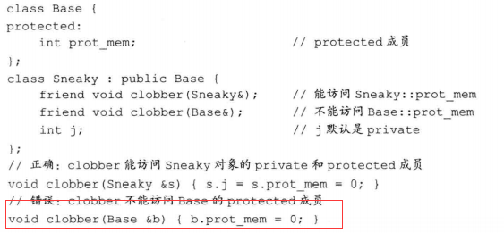

派生类的派生类别中的访问说明符**不影响派生类的访问权限**，其目的是**控制派生类用户**（包括派生类的派生类）对于基类成员的访问权限。

例如：对于`private`的派生类来说，基类的公有方法变成了`private`。派生类对象就不能直接访问了。当然，`public`，则是遵循原有的访问说明符。

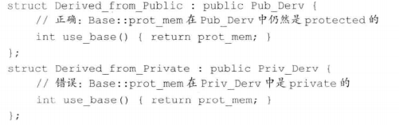

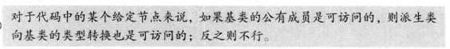

### 友元与继承

就像友元关系不能传递一样，友元关系同样也不能继承。基类的友元在访问派生类成员时不具有特殊性，反之亦然。

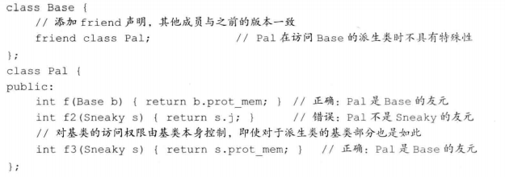

通过使用`using`，可以修改基类成员的访问级别，具体有该`using`声明语句之前的访问说明符来决定：

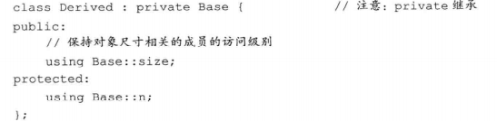

当然，派生类只能为那些它可以访问的名字提供`using`声明。


## 5. 继承中的类作用域

之前说过，派生类的作用域嵌套在基类的作用域之内。一个对象、引用和指针的静态类型决定了该对象的那些成员是可见的。所以指向派生类的基类指针，无法访问派生类的新增成员。

因为是嵌套关系，派生类的成员将隐藏同名的基类成员。当然可以使用**作用域运输符**来使用**隐藏的基类成员**。

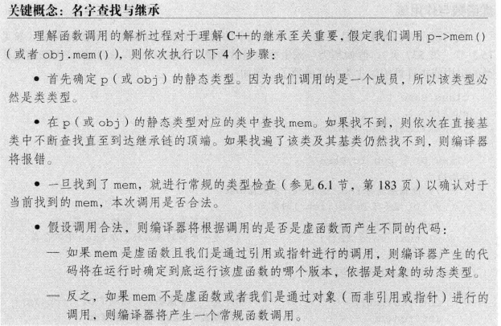

也是因为嵌套的关系，声明在内层作用域的函数并不会重载声明在外层作用域的函数。所以，一旦同名，哪怕参数不一致，也会隐藏该基类成员。（C++中，==名字查找先于类型检查==）。这样就可以理解为什么基类和派生类中的虚函数必须有相同的形参列表了。

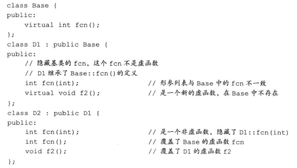

##  6. 构造函数与拷贝控制

基类通常定义一个==虚析构函数==，这样我们就能动态分配继承体系中的对象了。如前所述，当我们`delete`一个动态分配的对象的指针时将执行析构函数。如果该指针指向继承体系中的某个类型，则有可能出现指针的静态类型与被删除对象的动态对象不符的情况。

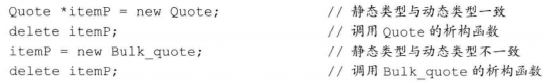

虚析构函数将阻止合成移动操作。

执行顺序。构造函数：基类$\rightarrow$派生类。析构函数：相反。

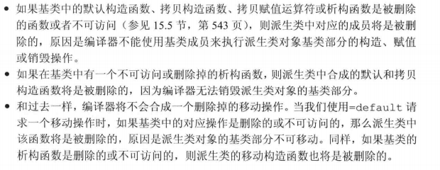

因为基类缺少移动操作会阻止派生类拥有自己的合成移动操作，所以我们确实需要执行移动操作时，应该首先在基类中进行定义。

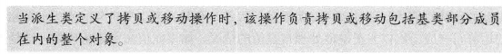

当为派生类定义拷贝或移动构造函数时，我们通常使用对应的基类构造函数初始化对象的基类部分：

```c++
...
D(const D&): Base(D)
{...}
...
```

```c++
//这个很可能是不对的，因为基类部分被默认初始化，而非拷贝
D(const &D){...}
```

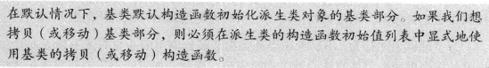

拷贝也一样，不过需要显式赋值：

```c++
D &D::operator=(const D &rhs)
{
	Base::operator(rhs);
	...
	return *this;
}
```

和构造函数和赋值函数不同，派生类的析构函数只负责销毁由派生类分配的资源。

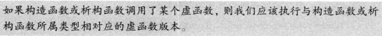

### 继承的构造函数

一个类只能继承其直接基类的构造函数（也只初始化其直接基类），不能继承默认、拷贝和移动构造函数。

使用方法是：一条注明了直接基类名的`using`声明语句。

```c++
class Bluk_quote ： public Disc_quote
{
    ...
    using Disc_quote::Disc_quote;
    ...
}
```

通常情况下，`using`声明语句只是令某个名字在当前作用域内可见，而作用于构造函数时，将令编译器产生代码，而且此时的`using`**不会改变该构造函数的访问级别**。**对于基类的每个构造函数，编译器都在派生类中生成一个形参列表完全相同的构造函数**。

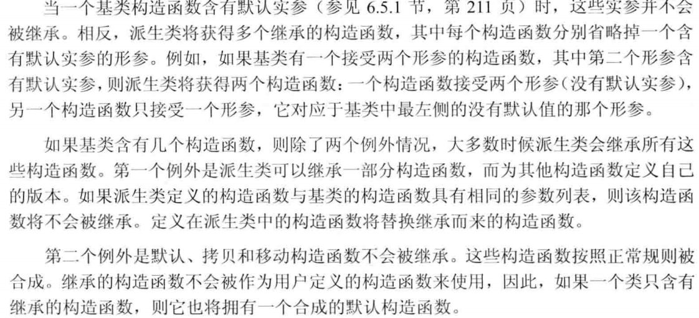


## 7. 容器和继承

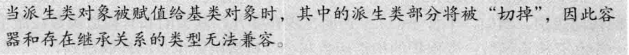

我们希望在容器中存放具有继承关系的对象时，我们实际上存放的通常是**基类的指针**（更好的选择是智能指针）。

```c++
vector<shared_ptr<Quote>> basket;
```

### 编写Basket类

```c++
#pragma once
#include<memory>
#include<set>
#include"Quote.h"

class Basket
{
public:
	void add_item(const std::shared_ptr<Quote> &sale);
	void add_item(const Quote& sale);
	void add_item(Quote&& sale);
	double total_receipt(std::ostream&)const;
private:
	static bool compare(const std::shared_ptr<Quote> &lhs,
						const std::shared_ptr<Quote> &rhs)
	{
		return lhs->isbn() < rhs->isbn();
	}
	std::multiset<std::shared_ptr<Quote>, decltype(compare)*> items{ compare };
	
};
```

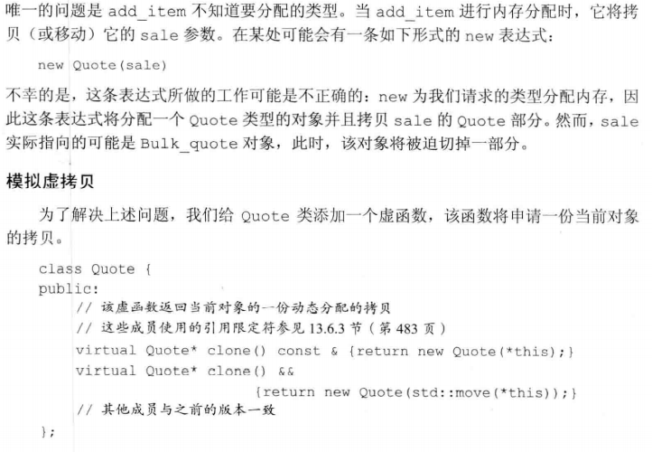