# 用于大型程序的工具

## 1. 异常处理

### 抛出异常

我们通过抛出一条表达式来引发一个异常。被抛出的表达式的类型以及的调用链共同决定了哪段处理代码将被用来处理该异常。

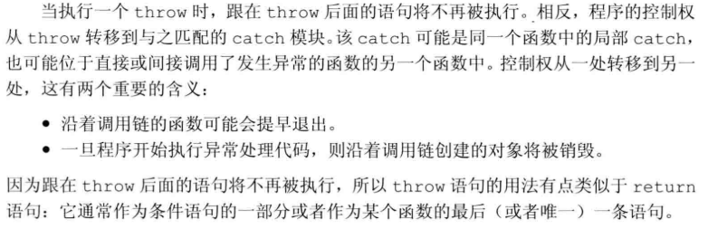

异常抛出后，遵循==栈展开==过程：从内至外直到找到匹配的`catch`语句。当执行完后，找到与`try`块关联的最后一个`catch`子句之后的点，并从这里继续执行。如果没找到`catch`子句，程序将退出（调用标准库函数`terminate`）。

如果在`栈展开`的过程中，退出了某个块，则编译器将负责销毁这个块中的局部对象。

> 析构函数应该抛出它能捕获的异常

当我们抛出一条表达式时，该表达式的静态编译类型决定了异常对象的类型。所以，即使`throw`表达式解引用一个基类指针，而该指针实际指向的是派生类对象，则抛出的对象将被切掉一部分，只有基类部分被抛出。

### 捕获异常

越是专门的`catch`越应该置于整个`catch`列表的前端，因为`catch`语句是按照其出现的顺序逐一进行匹配的，所以对于具有继承关系的多个异常时，必须使得派生类异常的处理代码出现在基·类异常之前。

异常的转化规则比较严格，只有如下转换：

有时，一个单独的`catch`语句不能完整地处理某个异常，可能决定由更上一层函数继续处理，此时使用重新抛出，通过一个单独的`throw;`

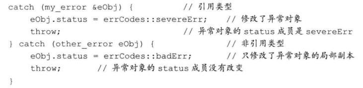

使用省略号作为异常声明，这样的处理代码被称为`捕获所有异常`，通常与重新抛出语句一起使用：

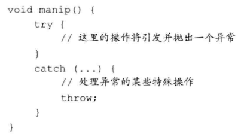

### 函数try语句块与构造函数

构造函数在进入其函数体之前首先执行初始值列表，此时`try`还未生效，无法处理抛出的异常，所以我们必须将构造函数写出**函数try语句块**，称为`函数测试块`的形式。

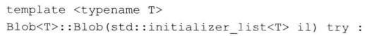

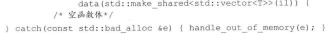

### noexcept异常说明

通过提供`noexcept`说明，指定某个函数不会抛出异常，紧跟在函数的参数列表后面：

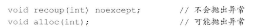

这个说明符接受一个`bool`实参，`true`表示函数不会抛出异常；`false`表示函数可能抛出异常。

==noexcept运算符==是一个一元运算符，返回布尔类型的**右值常量表达式**，用于表示给定的表达式是否会抛出异常：

函数指针及该指针指向的函数必须具有**一致的异常说明**。不抛出异常的指针不能指向抛出异常的函数。

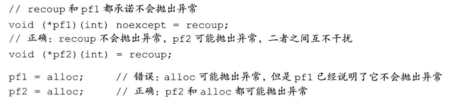

### 异常类层次

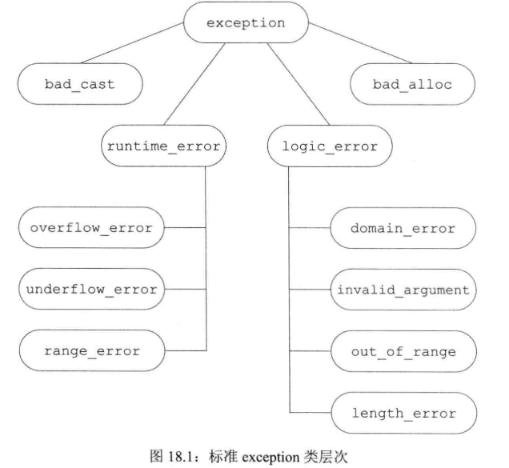

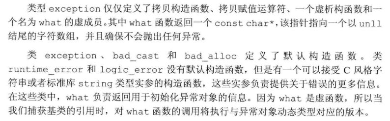

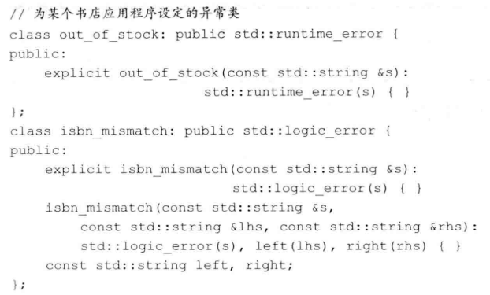

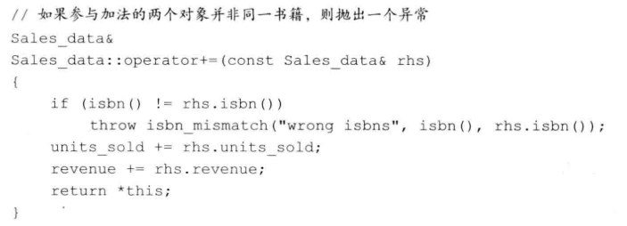

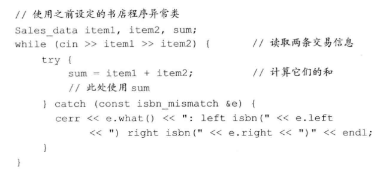

## 2. 命名空间

==命名空间==为防止**命名冲突**提供了更加可控的机制。命名空间分割了全局命名空间，其中每个命名空间是一个作用域。

### 命名空间定义

`namespace`+`name`。之后是一系列由花括号括起来的声明和定义。

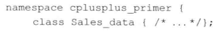

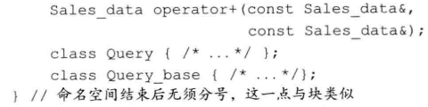

命名空间可以定义在几个不同的部分。`namespace nsp{...}`可能是定义了一个名为`nsp`的新命名空间，也可能是为已经存在的命名空间添加新成员。

以本书的命名空间为例：

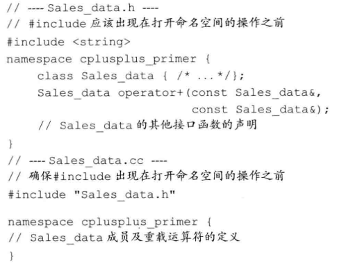

程序如果想要使用我们定义的库，则应该按照如下方式：

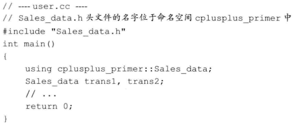

通常情况下，我们不把`#include`放在命名空间内部，如果我们做了，隐含的意思是把头文件中所有名字定义成该命名空间的成员。

新标准引入了新的嵌套命名空间，称为==内联命名空间==。和普通的嵌套空间不同，**内联命名空间的名字**可以被**外层命名空间**直接使用。定义方式是在`namespace`前添加关键字`inline`：

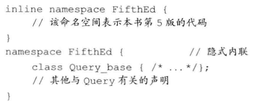

`inline`必须出现在命名空间第一次定义的地方，后续再打开命名空间的时候可写可不写。

当应用程序的代码在一次发布和另一次发布之间发生了改变时，常常会用到**内联命名空间**。例如，我们可以把本书当前版本的所有代码都放在一个**内联命名空间**中，而之前版本的代码都放在一个**非内联命名空间**中：

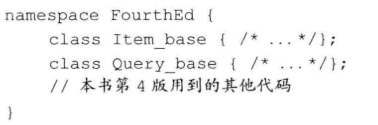

==未命名的命名空间==是指`namespace`后没有名字。未命名的命名空间中定义的变量具有静态生命周期：它们在第一次使用前创建，并且知道程序结束才销毁。这种空间可以在某个文件内不连续，但**不能跨越多个文件**。如果一个头文件定义了未命名的命名空间，则该命名空间中定义的名字将在每个包含了该头文件的文件中对于不同的实体。

**未命名的命名空**间中定义的名字的作用域和**该命名空间所在的作用域**相同。如果未命名的命名空间定义在文件的最外层作用域中，则该命名空间中的名字一定要与全局作用域中的名字有所区别：

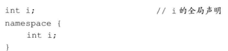

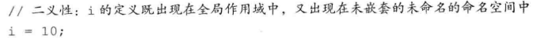

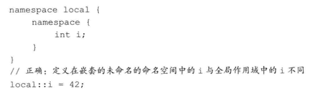

### 使用命名空间成员

==命名空间的别名==使得我们可以为命名空间的名字设定一个短的多的同义词，例如对于命名空间`cplusplus_prime`：

**一条using声明语句一次只引入命名空间的一个成员**，而using指示（例如：using namespace std;）使得某个特定的命名空间的所有的名字都可见。

### 类、命名空间与作用域

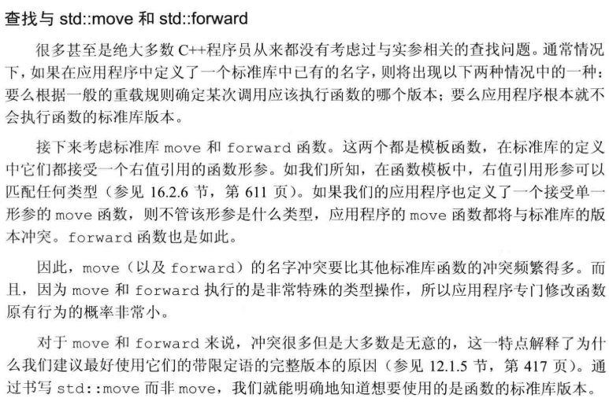

### 重载和命名空间

using声明语句声明的是一个名字，而非一个特定的函数：

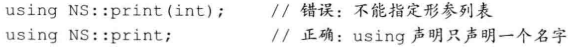

当我们为函数书写`using`声明时，该函数的所有版本都被引入到当前作用域中。

**using指示**将命名空间的成员提升到外层作用域中，如果命名空间的某个函数与该命名空间所属作用域的函数同名，则命名空间的函数将被添加到重载集合中：

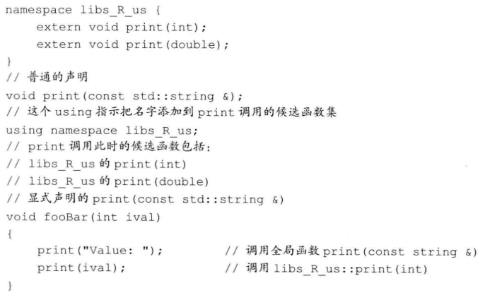

## 3. 多重继承与虚继承

==多重继承==是指从多个**直接基类**中产生派生类的能力。多重继承的派生类继承了所有父类的属性。

我们以动物园中动物的层次关系作为教学实例。

### 多重继承

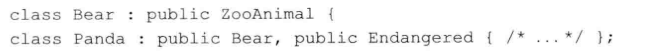

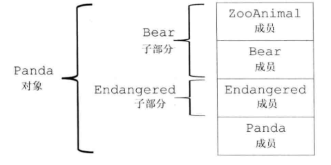

多重继承的派生类的**构造函数初始值**也只能初始化它的直接基类：

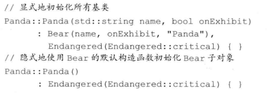

### 类型转换与多个基类

就是单基类转换的扩展。

### 多重继承下的类作用域

对于多个基类的成员名字相同，需要明确指定来自哪个基类。

### 虚继承

派生类可能多次继承同一个类（通过间接），则此时派生类中将包含该类的多个对象。我们通过==虚继承==的机制解决上诉问题，**虚继承的目的是令某个类做出声明，承诺愿意共享它的基类**。共享的基类子对象称为==虚基类==。在这种机制下，不论虚基类在继承体系中出现了多少次，在派生类中都只包含唯一一个共享的虚基类子对象。

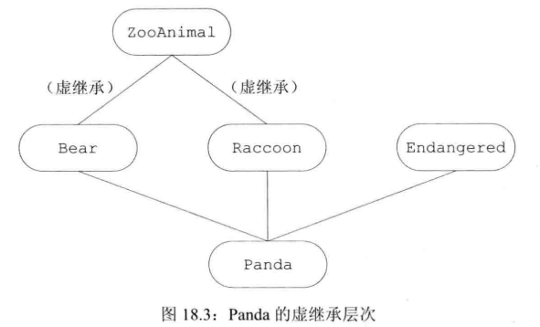

在实际的编程过程中，位于中间层次的基类将其继承声明为虚继承一般不会带来什么问题。我们指定虚基类的方式是在派生列表中添加关键字`virtual`：

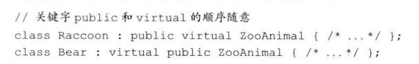

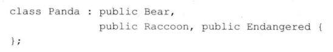

### 构造函数与虚继承

在虚派生中，虚基类是由最底层的派生类初始化的。以我们的程序为例，当创建`Panda`对象时，由`Panda`的构造函数独自控制`ZooAnimal`的初始化过程。防止虚基类的多个派生类多次对其进行初始化。

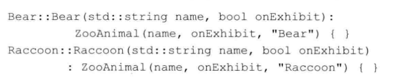

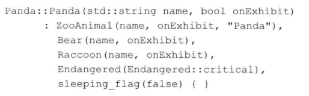

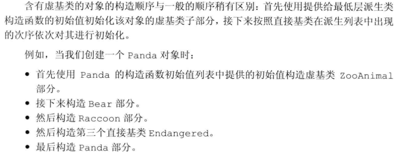

析构顺序和构造函数相反。