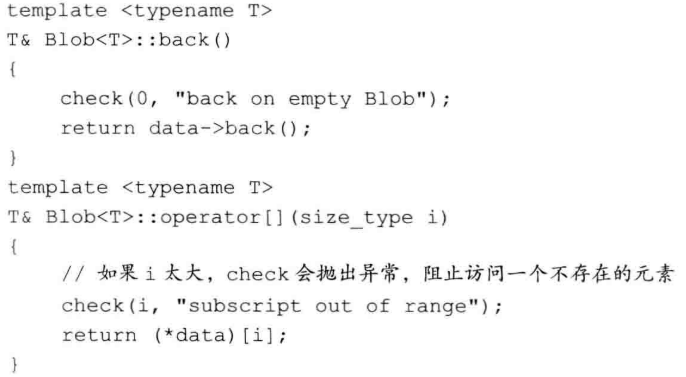

# 模板和泛型编程

OOP能处理类型在程序运行之前都未知的情况；而在泛型编程中，在编译时就能获知类型了。

## 1. 定义函数模板

以`compare`为例，一般形式如下：

```c++
template <typename T>
int compare(const T &v1, const T &v2)
{
	...
}
```

模板定义以关键字`template`开始，后跟一个==模板参数列表==，这是一个逗号分隔的一个或多个模板参数的列表，用<>包围起来。模板参数表示在类或函数定义中用到的类型或值。当使用模板时，我们指定模板实参。

```c++
compare(1,0) //T为int
```

对于模板类型参数，类型参数前必须使用关键字`class`或`typename`。这两个关键字的含义相同，可以互换使用。

```c++
template <typename T, class U> calc(const T&,const U&);
```

### 非类型模板参数

**一个非类型参数表示一个值而非一个类型**。


编写泛型代码的两个重要原则：

+ 模板中的函数参数是`const`的引用。
+ 函数体中的条件判断仅使用`<`比较运算。

通过将参数设定为`const`的引用，我们保证了函数可以用于不能拷贝的类型（目前出现的是`unique_ptr`和`IO`类型）。


### 类模板


我们为Blob指定不同类型的`T`，编译器就会生成一个不同的类。对于模板类的成员函数的定义，也要接类模板参数：




默认情况下，==类模板的成员函数只有当程序使用到它时才进行实例化==。如果没有被使用，则不会被实例化。

当我们使用一个类模板类型时必须提供模板实参，但在类的作用域内，我们可以直接使用模板名而不提供实参：


### 类模板和友元


通过以上类似代码，友好关系被限定在用相同类型实例化的`Blob`和`BlobPtr`、相等运算符之间。一个类可以将另一个模板的每个实例都声明为自己的友元，或者限定特定的实例为友元：


我们可以将==模板类型参数==声明为友元：

·

也就是说：`Foo`将成为`Bar<Foo>`的友元。

我们也可以使用模板类型别名：

```c++
typedef Blob<string> StrBlob;
```

由于模板不是一个类型，我们不能定义一个`typedef`引用一个模板。但是，新标准允许我们为类模板定义一个类型别名：


当然，我们也可以固定一个或多个参数模板：


### 模板参数

一个模板参数的可用范围是在其声明之后，至模板声明或定义结束之前。与任何其他名字一样，模板参数会隐藏外层作用域中声明的相同名字。


我们也可以提供默认模板实参：


无论何时使用一个模板，**我们都必须在模板名后接上尖括号**，哪怕一个类模板为其所有模板参数都提供了默认实参，也要在后面跟一个==空尖括号对==。

### 成员模板

一个类，无论是普通类还是模板类，可以包含本身是模板的成员函数，但不能是虚函数。对于模板类，其模板参数是各自独立的：


当我们在类模板外定义一个成员模板是，必须同时提供类模板和成员模板的模板参数列表，类模板在前，然后是成员模板：


### 控制实例化

因为使用时才会实例化，所以很多文件中可能都会有该实例，这种额外开销很严重，我们可以通过==显示实例化==来避免这种开销，形式如下：

```c++
extern template declaration;  //实例化声明
template declaration; //实例化定义
```

`declaration`是一个类或函数声明，其中所有模板参数已被替换为模板实参。例如：


`extern`声明必须出现在任何使用此实例化版本的代码之前。


**一个类模板的实例化定义会实例化该模板的所有成员，包括内联的函数成员**。因此，我们用来显示实例化一个类模板的类型，必须能用于模板的所有成员。


## 2. 模板实参推断

对于函数模板，编译器利用调用中的函数实参来确定其模板参数。这个过程被称为`模板实参推断`。

### 类型转换和模板类型参数

与往常一样，顶层const无论是在形参中还是实参只呢个，都会被忽略。在其他类型转换中，能在调用中应用于函数模板的包括如下两项：


其他类型的，包括：算术转换、派生类向基类的转换以及用户自定义的转换，都不能应用于函数模板。


总结的话：将实参传递给带模板类型的函数形参时，能够自动应用的类型转换只有`const`转换及数组或函数到指针的转换。

如果希望能够不这么严格，比如传递`int`和`long`，可以将函数模板定义为两个类型参数。

### 函数模板显示实参


在上面的例子中，我们没有任何函数实参的类型可用来推断`T1`的类型，这样每次调用时，用户必须为`T1`提供一个==显示模板实参==。


显示模板实参按从左至右的顺序与对应的模板参数匹配。只有尾部参数的显示模板实参才可以忽略，而且前提是他们可以从函数参数中推断出来。

而且，对于显示指定的模板实参，可以继续正常类型转化：

```c++
double p = 4.33;
compare<int>(p,1024);  //compare(int,int)
```

### 尾置返回类型与类型转换:star:

显示指定除了会给用户增添额外负担，可能也无法使用，比如我们不知道返回类型到底是什么：


我们不知道返回的具体类型，但是知道是所处理的序列的元素类型，而且在这个序列出现之前，它是不存在的，所以必须使用==尾置返回类型==：


如果我们需要返回一个值，而不是引用，怎么办？引用的解引用操作只能返回引用，而且所有迭代器操作都不会生成元素，只能生成元素引用。为了获得元素类型，我们可以使用标准库的==类型转换模板==，定义在头文件`type_traits`中，在平时的编程中也很有用。在本例中，我们使用`remove_reference`来获得元素类型，此模板有一个模板类型参数和一个名为`type`的类型成员：


注意：`type`是一个类的成员，而该类依赖于一个模板参数，因此，我们必须在返回类型的声明中使用`typename`来告知编译器，`type`表示一个类型。

> 

### 函数指针和实参推断

当我们使用一个函数模板初始化一个函数指针，或为一个函数指针赋值时，编辑器使用指针的类型来推断模板实参，

