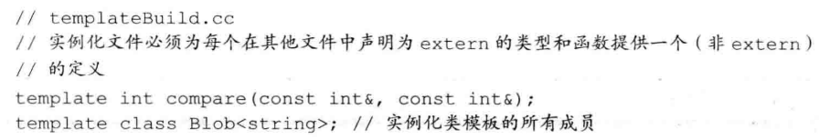
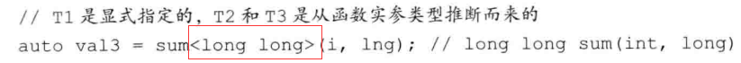
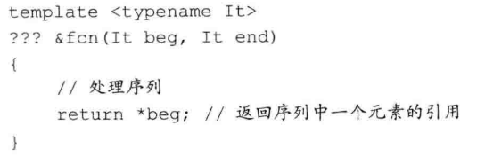
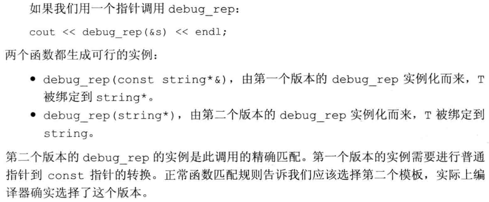

# 模板和泛型编程

OOP能处理类型在程序运行之前都未知的情况；而在泛型编程中，在编译时就能获知类型了。

## 1. 定义函数模板

以`compare`为例，一般形式如下：

```c++
template <typename T>
int compare(const T &v1, const T &v2)
{
	...
}
```

模板定义以关键字`template`开始，后跟一个==模板参数列表==，这是一个逗号分隔的一个或多个模板参数的列表，用<>包围起来。模板参数表示在类或函数定义中用到的类型或值。当使用模板时，我们指定模板实参。

```c++
compare(1,0) //T为int
```

对于模板类型参数，类型参数前必须使用关键字`class`或`typename`。这两个关键字的含义相同，可以互换使用。

```c++
template <typename T, class U> calc(const T&,const U&);
```

### 非类型模板参数

**一个非类型参数表示一个值而非一个类型**。


编写泛型代码的两个重要原则：

+ 模板中的函数参数是`const`的引用。
+ 函数体中的条件判断仅使用`<`比较运算。

通过将参数设定为`const`的引用，我们保证了函数可以用于不能拷贝的类型（目前出现的是`unique_ptr`和`IO`类型）。


### 类模板


我们为Blob指定不同类型的`T`，编译器就会生成一个不同的类。对于模板类的成员函数的定义，也要接类模板参数：


使用类的类型成员：不能直接使用`T::size_type *p`，而应该这样`Typename T::size_type *p`

默认情况下，==类模板的成员函数只有当程序使用到它时才进行实例化==。如果没有被使用，则不会被实例化。当我们使用一个类模板类型时必须提供模板实参，但在类的作用域内，我们可以直接使用模板名而不提供实参：


### 类模板和友元


通过以上类似代码，友好关系被限定在用相同类型实例化的`Blob`和`BlobPtr`、相等运算符之间。一个类可以将另一个模板的每个实例都声明为自己的友元，或者限定特定的实例为友元：


我们可以将==模板类型参数==声明为友元：

·

也就是说：`Foo`将成为`Bar<Foo>`的友元。

我们也可以使用模板类型别名：

```c++
typedef Blob<string> StrBlob;
```

由于模板不是一个类型，我们不能定义一个`typedef`引用一个模板。但是，新标准允许我们为类模板定义一个类型别名：


当然，我们也可以固定一个或多个参数模板：


### 模板参数

一个模板参数的可用范围是在其声明之后，至模板声明或定义结束之前。与任何其他名字一样，模板参数会隐藏外层作用域中声明的相同名字。


我们也可以提供默认模板实参：


无论何时使用一个模板，**我们都必须在模板名后接上尖括号**，哪怕一个类模板为其所有模板参数都提供了默认实参，也要在后面跟一个==空尖括号对==。

### 成员模板

一个类，无论是普通类还是模板类，可以包含本身是模板的成员函数，但不能是虚函数。对于模板类，其模板参数是各自独立的：


当我们在类模板外定义一个成员模板是，必须同时提供类模板和成员模板的模板参数列表，类模板在前，然后是成员模板：


### 控制实例化

因为使用时才会实例化，所以很多文件中可能都会有该实例，这种额外开销很严重，我们可以通过==显示实例化==来避免这种开销，形式如下：

```c++
extern template declaration;  //实例化声明
template declaration; //实例化定义
```

`declaration`是一个类或函数声明，其中所有模板参数已被替换为模板实参。例如：


`extern`声明必须出现在任何使用此实例化版本的代码之前。





**一个类模板的实例化定义会实例化该模板的所有成员，包括内联的函数成员**。因此，我们用来显示实例化一个类模板的类型，必须能用于模板的所有成员。


## 2. 模板实参推断

对于函数模板，编译器利用调用中的函数实参来确定其模板参数。这个过程被称为`模板实参推断`。

### 类型转换和模板类型参数

与往常一样，顶层const无论是在形参中还是实参中，都会被忽略。在其他类型转换中，能在调用中应用于函数模板的包括如下两项：


其他类型的，包括：算术转换、派生类向基类的转换以及用户自定义的转换，都不能应用于函数模板。


总结的话：将实参传递给带模板类型的函数形参时，能够自动应用的类型转换只有`const`转换及**数组或函数到指针的转换**。

如果希望能够不这么严格，比如传递`int`和`long`，可以将函数模板定义为两个类型参数。

### 函数模板显示实参


在上面的例子中，我们没有任何函数实参的类型可用来推断`T1`的类型，这样每次调用时，用户必须为`T1`提供一个==显示模板实参==。



显示模板实参按从左至右的顺序与对应的模板参数匹配。只有尾部参数的显示模板实参才可以忽略，而且前提是他们可以从函数参数中推断出来。

而且，对于显示指定的模板实参，可以继续正常类型转化：

```c++
double p = 4.33;
compare<int>(p,1024);  //compare(int,int)
```

### 尾置返回类型与类型转换:star:

显示指定除了会给用户增添额外负担，可能也无法使用，比如我们不知道返回类型到底是什么：



我们不知道返回的具体类型，但是知道是所处理的序列的元素类型，而且在这个序列出现之前，它是不存在的，所以必须使用==尾置返回类型==：


如果我们需要返回一个值，而不是引用，怎么办？引用的解引用操作只能返回引用，而且所有迭代器操作都不会生成元素，只能生成元素引用。为了获得元素类型，我们可以使用标准库的==类型转换模板==，定义在头文件`type_traits`中，在平时的编程中也很有用。在本例中，我们使用`remove_reference`来获得元素类型，此模板有一个模板类型参数和一个名为`type`的类型成员：


注意：`type`是一个类的成员，而该类依赖于一个模板参数，因此，我们必须在返回类型的声明中使用`typename`来告知编译器，`type`表示一个类型。

> 

### 函数指针和实参推断

当我们使用一个函数模板初始化一个**函数指针**，或为一个**函数指针**赋值时，编辑器使用指针的类型来推断**模板实参**，


如果不能从**函数指针类型**确定模板实参，则产生错误：


这个时候我们可以显式的实例化哪个`compare`版本：

```c++
func(compare<int>);
```

### 模板实参推断和引用

为了理解如何从函数调用进行类型推断，考虑下面的例子：

```c++
template <typename T> void f(T &p);
```

当一个函数参数是模板类型参数的一个普通（左值）引用时（形如T&），绑定规则告诉我们，只能传递给它一个左值，不能是字面值。如果实参是`const`，则T将被推断为`const`类型：


如果类型是`const T&`，则我们可以传递给他任何类型的实参——一个对象、一个临时对象或是一个字面值常量：


> 上诉规则解释了为什么我们一般定义函数，都是`const int &`这样的形式。

==引用折叠和右值引用参数==。具体见书。这里给出结论：


### 理解std::move

不能直接将一个右值引用绑定到一个左值上，但是可以用`move`获得一个绑定到左值上的右值引用。标准库是这样定义`move`的：


关于`std::move`的工作方式，具体见书，也不是很复杂。大致意思是，当实参是左值时（例如：string a;），move实例化如下：

```c++
string&& move(string &t);
```

这正是我们所寻求的，将一个右值引用绑定到一个左值。


### 转发

某些函数需要将其一个或多个实参连同类型不变地转发给其他函数。在此情况下，我们需要保持被转发实参的所有性质，包括实参类型是否是`const`的以及实参是左值还是右值。考虑如下函数：


```c++
flip1(f, j, 42);
```

正常使用`f()`会改变`v2`的值，但使用`flip1`则不会，因为传递给`flip1`的`j`是一个普通的`int`。

而通过将一个函数参数定义为一个指向模板类型参数的右值引用，我们可以保持对于实参的所有类型信息，而使用引用参数使得我们可以保持`const`属性。


此时，由于`j`是一个左值，传递给`flip2`时，`t1`的类型会折叠为`int&`，被绑定到`j`上，然后`v2`绑定到`t1`上。


==但此时我们只解决了一半的问题==，目前我们能接受左值，但不能接受右值：


```c++
flip2(g, i, 42); //错误：不能从一个左值实例化int&&
```

42被推断为`int`，所以是`int && t2`，`t2`是左值，不能从一个左值实例化右值。

这时，我们可以使用一个名为`forward`的新标准库设施来传递`flip2`的参数，它能保持原始实参的类型，定义在`utility`中，且必须通过显示模板实参来调用，返回该显示实参类型的右值引用。即`forward<T>的返回类型是T&&`。

通常情况下，我们使用`forward`传递那些定义为模板类型参数的右值引用的函数参数。通过其返回类型上的引用折叠，`forward`可以保持给定实参的左值/右值属性。


> 右值进来（&&），是一个左值（），通过forward（&&）；左值引用进来（&），通过forward（& &&），进行折叠（&）


## 3. 重载与模板

**函数模板**可以被另一个模板或一个普通非模板函数重载。此时，函数匹配规则更新如下：


### 编写函数模板

构造一组调试函数，都命名为`debug_rep`。首先编写最通用版本：

```c++
template<typename T>
string debug_rep(const T &t)
{
	ostringstream ret;
	ret << t;
	return ret.str();
}
```

接下来，定义打印指针的版本：

```c++
template<typename T>
string debug_rep(T *p)
{
	ostringstream ret;
	if(p)
		ret << debug_rep(*t);
	else
		ret << "null pointer";
	return ret.str();
}
```




然后是非模板函数，这里就不给出了。但是对于一个调用，如果一个非函数模板与一个函数模板提供同样好的匹配，则==选择非模板版本==。


## 4. 可变参数模板

一个==可变参数模板==就是一个接受可变数目参数的**模板函数或模板类**。可变数目的参数称为==参数包==，存在两种参数包：==模板参数包==，表示零个或多个模板参数；==函数参数包==，表示零个或多个函数参数。

我们用一个==省略号==来指出一个模板参数或函数参数表示一个包。（`typename ...`）


编译器会为`foo`实例化出四个不同的版本。当我们需要知道包中有多少元素时，可以使用`sizeof...`运算符：


### 编写可变参数函数模板

可变参数函数通常是递归的。

> 如6.2.6节所述，我们可以使用一个`initializer_list`来定义一个可接受可变数目实参的函数，但是所有实参必须具有相同的类型（或他们的类型可以转换为同一个公共类型）。


对于最后一个调用，两个函数都提供很好的匹配，但是非可变参数模板比可变参数模板更特例化，因此编译器选择非可变参数版本。


### 包扩展

==扩展包就是就是将它分解为构成的元素==，对每个元素应用模式（例如下面的例子中，展开的所有元素都是`const &`），获得扩展后的列表。之前的例子就有两个扩展：


我们还可以进行更复杂的包扩展：


这个`print`调用使用了模式`debug_reg(rest)`。此模式表示我们希望对函数参数包`rest`中的每个元素调用`debug_rep`。但不能这样写：

```c++
print(os, debug_rep(rest...));
```

因为它等价于：


### 转发参数包

我们可以组合可变参数模板与`forward`机制来编写函数，实现将其实参不变地传递给其他函数。作为例子，我们将为`StrVec`类添加一个`emplace_back`成员。


这里即扩展了模板参数包Args，还扩展了函数参数包args，此模式生成如下形式的元素：

```c++
std::forward<Ti>(ti);
```


## 5. 模板特例化

当我们不能或不希望使用模板版本时，可以定义类或函数模板的一个特例化版本。**一个特例化版本就是模板的一个独立的定义，在其中一个或多个模板参数被指定为特定的类型**。考虑之前的`compare`函数，第一个版本可以匹配任意类型，但实际上它接受字符指针时，原有方法是无效的，应该像版本2一样处理，所以我们可以针对字符指针的情况，定义模板的一个特例化版本。


当我们特例化一个函数模板时，必须为原模板的每个模板参数都提供实参。为了指出我们正在实例化一个模板，应使用关键字`template`后跟一个空`<>`。它指出我们将为原模板的所有模板参数提供实参：


函数参数类型咋是这样？当我们定义一个特例化版本时，函数参数类型必须与一个先前声明的模板中对应的类型匹配。在这里，我们特例化：


因为T是`const char*`，我们的函数要求一个指向此类型的const版本的引用，所以最后是：一个指向`const char`的**const指针**的引用。

> const char* + char \*const = const char\* const，最后是引用&

重要的是：==一个特例化版本本质是一个实例，而非函数名的一个重载版本==。


### 类模板特例化

除了特例化函数模板，我们还可以特例化类模板。作为例子，我们将为标准库`hash`模板定义一个特例化版本，可以用它来将`Sales_data`对象保存在无序容器中。一个特例化`hash`类必须定义：


我们需要在原模板定义所在的命名空间中特例化它，为了达到这一目的，我们首先必须打开==命名空间==：

```c++
namespace std{
...
}
```


### 类模板部分实例化

与函数模板不同，类模板的特例化不必为所有模板参数提供实参。一个类模板的部分特例化本身是一个模板。

我们可以只特例化特定成员函数而不是特例化整个模板。