# 重载运算与类型转换

## 1. 基本概念

==重载的运算符==是具有特殊名字的函数。它们的名字由关键字`operator`和其后要定义的运算符号共同组成。对一个运算符函数来说，它或者是类的成员，或者至少含有一个类类型的参数。

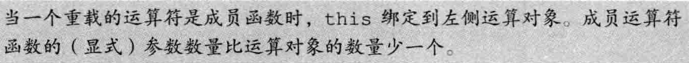

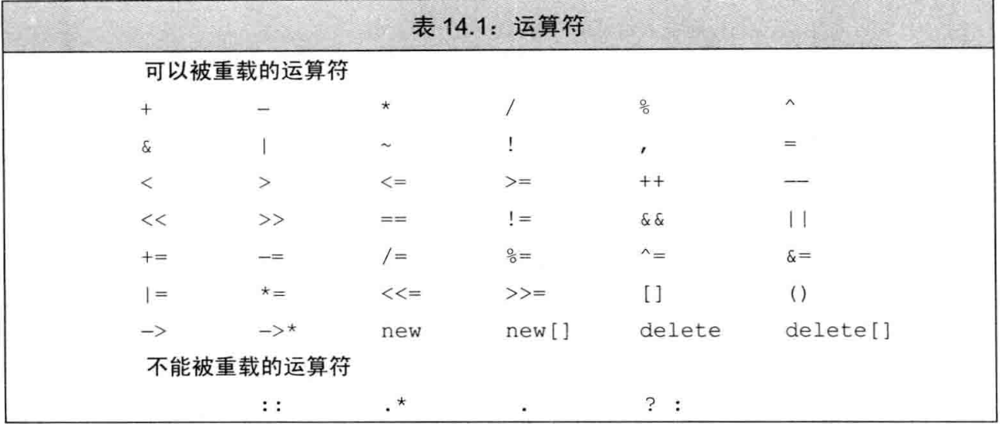

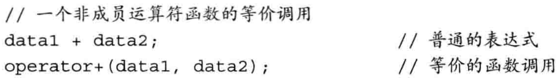

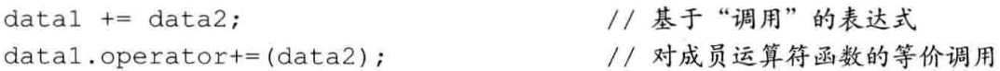

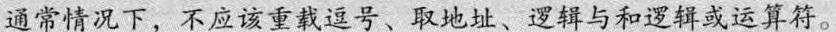

> 使用与内置类型一致的含义

**将运算符定义为成员函数还是普通的非成员函数，可以参考以下准则**：

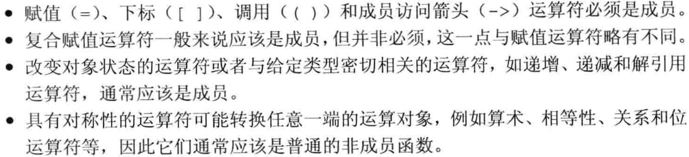

当我们把运算符定义成**成员函数**时，它的**左侧运算对象**必须是运算符**所属类的一个对象**。

# 2. 输入和输出运算符

### 重载输出运算符<<

通常情况下，输出运算符的**第一个形参**是一个**非常量`ostream`对象的引用**。之所以是非常量是因为向流写入内容会改变其状态。**第二个形参**一般来说是一个**常量的引用**，该常量是我们想要打印的类类型。为了与其它输出符保持一致，`<<`一般要返回它的`ostream`形参。

举个例子：

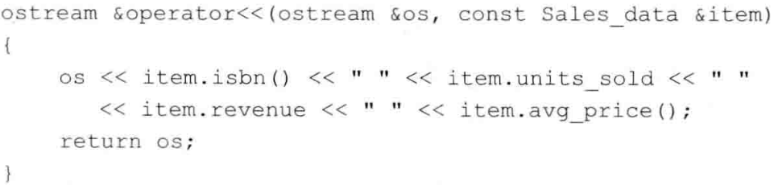

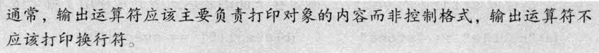

如果我们希望为类自定义IO运算符，则必须将其定义成非成员函数。当然，**IO运算符**通常需要读写类的非公有数据成员，所以**IO运算符**一般被声明为**友元**。

### 重载输入运算符>>

第一个形参是运算符将要读取的流的引用，第二个参数是将要读入到的（非常量）对象的引用。

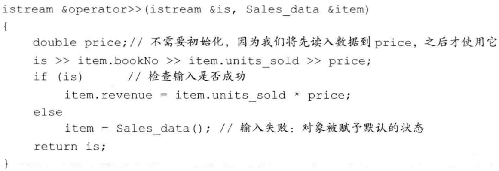

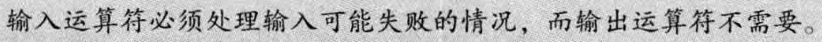

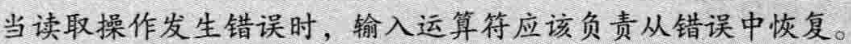

## 3. 算术和关系运算符