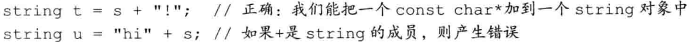
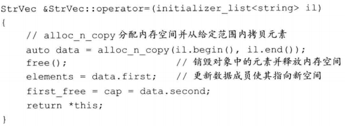
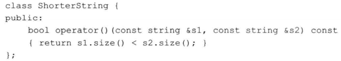

# 重载运算与类型转换

## 1. 基本概念

==重载的运算符==是具有特殊名字的函数。它们的名字由关键字`operator`和其后要定义的运算符号共同组成。对一个运算符函数来说，它或者是类的成员，或者至少含有一个类类型的参数。


> 使用与内置类型一致的含义

**将运算符定义为成员函数还是普通的非成员函数，可以参考以下准则**：


当我们把运算符定义成**成员函数**时，它的**左侧运算对象**必须是运算符**所属类的一个对象**。




## 2. 输入和输出运算符

### 重载输出运算符<<

通常情况下，输出运算符的**第一个形参**是一个**非常量`ostream`对象的引用**。之所以是**非常量**是因为向流写入内容会改变其状态。**第二个形参**一般来说是一个**常量的引用**，该常量是我们想要打印的类类型。为了与其它输出符保持一致，`<<`一般要返回它的`ostream`形参。

举个例子：


如果我们希望为类自定义IO运算符，则必须将其定义成**非成员函数**。当然，**IO运算符**通常需要读写类的非公有数据成员，所以**IO运算符**一般被声明为**友元**。

### 重载输入运算符>>

第一个形参是运算符将要读取的流的引用，第二个参数是将要读入到的（非常量）对象的引用。


## 3. 算术和关系运算符

通常情况下，我们把算术和关系运算符定义成**非成员函数**以允许对左侧或右侧的运算对象进行转换。

比如说：（复合赋值+=将在之后定义）


### 相等运算符

一般是比较对象的所有对应的成员。例如：


### 关系运算符


### 赋值运算符

除了**拷贝赋值**和**移动赋值**之外，还有**花括号**初始化和赋值的情况：


以咱们的类为例：



### 复合赋值运算符

虽然不是必须，但还是习惯将**复合赋值运算符**定义在类的内部。


## 5. 下标运算符

下标运算符必须是**成员函数**。如果一个类包含下标运算符，则通常会定义两个版本：一个返回普通定义，一个是类的常量成员并且返回常量引用。


## 6. 递增和递减运算符

对于这两个运算符，由于它们会改变所操作对象的状态，所以建议将其设定为**成员函数**。

### 定义前置


### 定义后置

为了解决重载问题，后置版本接受一个额外的（不被使用）int参数的形参，当我们使用后置运算符时，编译器为这个形参提供一个值为0的实参。


## 7. 成员运算符


## 8. 函数调用运算符

如果类重载了**函数调用符**，则我们可以像使用函数一样使用该类的对象。因为这样的类同时也能存储状态，所以说与普通函数相比它们更加灵活。


### lambda是函数对象



可以用以上这个，代替lambda表达式，如下：


`lambda`表达式产生的类不含默认构造函数、赋值运算符及默认析构函数；它是否含有默认的拷贝/移动构造函数，则通常要视捕获的数据成员类型而定。

### 标准库定义的函数对象


### 在算法中使用标准库函数对象


### 可调用对象与function:star:

C++语言中有几种可调用的对象：函数、函数指针、lambda表达式、bind创建的对象以及重载了函数调用运算符的类。

不同类型的可调用对象可以共享同一种==调用形式==，如下：$int(int,int)$


为了实现这一目的，需要定义一个**函数表**，用于存储指向这些可调用对象的`指针`。简单的使用`MAP`是不行的，比如`lambda`有它自己的类类型，无法进行匹配。

```c++
map<string, int(*)(int,int)> binops;
binops.insert({"+",add}); //right
binops,insert({"%",mod}); //wrong
```

我们可以使用个名为==function==的标准库类型解决上诉问题，定义在`functional`中。


使用这个，我们重新定义map：

```c++
map<string, function<int(int,int)> binops;
```


我们不能直接将重载函数的名字存入`function`类型的对象中，解决方法是：存储函数指针、lambda表达式。

## 9. 重载、类型转换与运算符

转换构造函数和**类型转换运算符**共同定义了==类类型转换==。

### 类型转换运算符

这是类的一种特殊成员函数，它负责将一个类类型的值转换成其它类型。类型转换函数的一般形式如下所示：

```c++
operator type() const;
```

类型转换运算符可以面向任意类型（除了void）进行定义，只要该类型能作为函数的返回类型。因此，我们不允许转换成数组或函数类型，但允许转换成指针或者引用类型。

类型转换运算符一般被定义成==const成员==。


```c++
SmallInt si;
si = 4;   //4隐式转换成SmallInt
si + 3;  //si隐式转换成int
```

尽管编译器一次只能执行一个用户定义的类型转换，但是隐式的用户定义类型转换可以置于一个标准内置类型转换之后或之前：

```c++
SmallInt si = 3.14;
si + 3.14;  //内置转换类型将所得的int继续转换成double
```

> 在大多数情况下，我们不会定义类型转换运算符


### 显式的类型转换运算符

为了防止上诉异常，C++引入了==显示的类型转换运算符==：


此规定存在一个例外，如果表达式被用作条件，则编译器会将显示的类型转换自动应用于它。

### 避免有二义性的类型转换

如果类包含一个或多个类型转换，则必须确保在类类型和目标类型之间只存在唯一一种转换方式。


之后也是讨论二义性问题，具体见书。

> 好麻烦，还是尽量少用。