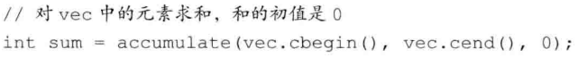

# 泛型算法

标准库定义了一组==泛型算法==，定义在头文件`algorithm`中，还在头文件`numeric`中定义了一组数值泛型算法。

## 1. 概述

标准库提供了超过100个算法。一般情况下，这些算法并不直接操作容器，而是遍历由两个迭代器指定的一个元素范围来进行操作。例如，使用find算法：

```c++
string val = "a value"; //要找的值
auto result = find(lst.cbegin(), lst.end(), val);
```

迭代器令算法不依赖于容器，但算法依赖于元素类型的操作。


## 2. 初识泛型算法

### 只读算法

不改变输入范围内的元素，例如：find（查找）、count（计数）、accumulate（求和）。



另一个只读算法是`equal`，接受三个·迭代器：前两个表示第一个序列中的元素范围，第三个表示第二个序列的首元素。基于一个重要假设：它假定第二个序列至少与第一个序列一样长。


### 写容器算法

`fill`将给定的值赋予输入序列中的每个元素：

```c++
fill( vec.begin(), vec.end(), 0);
```

一些算法接受一个迭代器来指出一个单独的目的位置。例如：`fill_n`接受一个单迭代器、一个计数值==n==和一个值。注意：容器至少要包含n个元素

```c++
fill_n( vec.begin(), 10, 0); //将前十个值置为0
```

### 介绍back_inserter

插入迭代器一种向容器中添加元素的迭代器。定义在头文件`iterator`中。


我们常常使用`back_inserter`来创建一个迭代器，作为算法的目的位置来使用：

```c++
vector<int> vec;
fill_n(back_inserter(vec), 10, 0);
```

### 拷贝算法

此算法接受三个迭代器，前两个表示一个输入范围，第三个表示目的序列的起始位置：


返回的是其目的位置迭代器的值，即`ret`恰好指向拷贝到`a2`尾元素之后的位置。

### replace算法


### 使用Unique

将相邻的重复项消除，并返回一个指向不重复值范围末尾的迭代器。


## 3. 定制操作

### 向算法传递函数

对于排序算法

```c++
bool Func(const A &a, const A &b)
{
	return a.size() < b.size();
}
...
sort(list.begin(), list.end(), Func);
```

关于稳定排序：`stable_sort`


### lambda表达式:star:

一个`lambda`表达式表示一个可调用的代码单元，可以将其理解为一个未命名的内联函数，一个`lambda`表达式具有一个返回类型、一个参数列表和一个函数体。具有如下表现形式：
$$
[capture list] (parameter list)\rightarrow ReturnType\{FunctionBody\}
$$
其中，`capturelist`（捕获列表）是一个`lambda`所在函数中定义的局部变量的列表（通常为空）。与普通函数不同，`lambda`必须使用尾置返回来指定返回类型。

可以忽略参数列表和返回类型，但必须永远包含捕获列表和函数体：

```c++
auto f = [] { return 43; };
```

lambda的调用方式与普通函数的调用方式相同，都是使用调用运算符：

```c++
cout << f() << endl;
```

### 向lambda传递参数

与普通函数不同，lambda不能有默认参数

```c++
[] (const string &a, const string &b)
{ return a.size() < b.size()};
```


### 使用捕获列表

捕获列表只能用于局部非`static`变量，lambda可以直接使用局部`static`变量，和它所在函数之外声明的名字。

```c++
[sz](const string &a)
{ return a.size() >= sz;}
```

### for_each算法

前两个是范围参数，后一个是接受一个可调用对象，并对输入序列中每个元素调用此对象


### lambda捕获和返回

当定义一个`lambda`时，编译器生成一个与`lambda`对应的、新的（未命名的）**类类型**。从`lambda`生成的类都包含一个对应该`lambda`所捕获的变量的数据成员。

值捕获和引用捕获。

### 隐式捕获

为了指示编译器**推断**捕获列表，应在**捕获列表**中写一个`&`和`=`（前者是引用捕获，后者是值捕获）


可以混合使用隐式捕获和显式捕获：（捕获列表中的第一个元素必须是一个`&`和`=`）


### 可变lambda

如果我们希望能改变一个被捕获的变量的值，就必须在参数列表首加上关键字`mutable`：


### transform算法

接受三个迭代器和一个可调用对象，前两个迭代器表示输入序列，第三个迭代器表示目的位置。算法对输入序列中的每个元素调用可调用对象，并将结果写到目的位置。


当我们需要为一个==`lambda`==定义返回类型时，必须使用**尾置返回类型**：


> 对于那种只在一两个地方使用的简单操作，`lambda`表达式是最有用的，如果我们需要在很多地方使用相同的操作，通常应该定义一个函数。


### 标准库bind函数

可以将bind函数看作一个通用的函数适配器，它接受一个可调用对象，生成一个可调用对象来`适应`原对象的参数列表：

```c++
auto newCallable = bind(callable, arg_list);
```

对于`arg_list`，有占位符 `_n`和固定的参数


名字`_n`都定义在一个名为`placeholders`的命名空间中，其本身定义在`std`命名空间：

```c++
using std::placeholders::_1
```


### ref函数

返回一个对象，包含给定的引用。


## 4. 再探迭代器

标准库在头文件`iterator`中还定义可额外几种迭代器：

- 插入迭代器：这些迭代器被绑定到一个容器上，可用来向容器插入元素。
- 流迭代器：这些迭代器被绑定到输入或输出流上，可以用来遍历所关联的IO流
- 反向迭代器：不是向后，而是向前移动。
- 移动迭代器：不是拷贝其中的元素，而是移动它们。

### 插入迭代器


插入器有三种类型，差异在于元素插入的位置：

- `back_inserter`：创建使用`push_back`的迭代器。
- `front_inserter`：使用`front_back`。
- `inserter`：创建一个使用`insert`，此函数接受第二个参数，这个参数必须是一个指向给定容器的迭代器。元素将被插入到给定迭代器所表示的元素之前。

### iostream迭代器

****

### 反向迭代器


## 5. 泛型算法结构

算法所要求的迭代器操作可以分为==5个迭代器类别==：


==输入迭代器==必须支持：


而对于==输出迭代器==，则必须支持：


对于==随机访问迭代器==，必须支持：


### 算法形参模式


### 算法命名规范 ：\_if，\_copy


## 6. 特定容器算法

对于链表类型的`list`和`forward_list`，定义了几个成员函数形式的算法。链表类型还定义了`Splice`算法：

